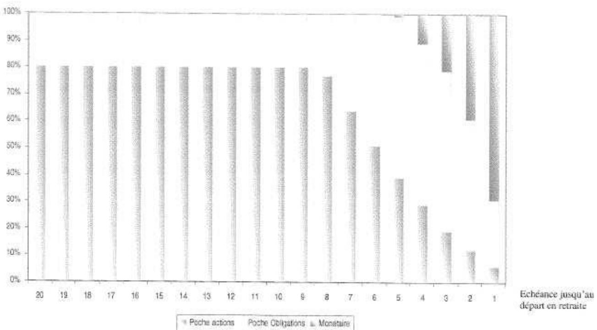

# ACCORD PORTANT REGLEMENT DU PLAN D'EPARGNE POUR LA RETRAITE COLLECTIF DU GROUPE THALES

Le règlement du plan d'épargne pour la retraite collectif (ci-après le « PERCO Groupe Thales ») est institué par le présent accord (ci-après « l'Accord ») négocié entre Thales SA et les organisations syndicales représentatives signataires de l'avenant n°1 de l'accord sur les dispositions sociales pour le bénéfice des salariés de Thales SA et l'ensemble de ses sociétés filiales détenues directement ou indirectement à plus de 50% (ci-après « le Groupe »).

Le présent PERCO Groupe Thales soumis aux dispositions du Titre IV du Livre IV du Code du travail est établi selon les modalités prévues par le Titre III du Livre I du Code du travail.

## PREAMBULE

Les Participants (tels que définis à l'article 3 du présent accord portant règlement du plan d'épargne pour la retraite collectif du groupe Thales) ont par ailleurs la possibilité conformément aux dispositions de l'article L. 443-1.2 du code du travail d'accéder à un dispositif d'épargne salariale d'une durée plus courte, le Plan d'Epargne Groupe Thales déjà existant.

Ce PERCO est institué en prévoyant également un dispositif dans un cadre d'investissement socialement responsable.

## ARTICLE 1 - OBJET DU PERCO

Le présent PERCO a pour objet de permettre aux Participants de se constituer une rente viagère à titre onéreux ou un capital dont ils pourront demander la liquidation à compter de la date effective de leur départ à la retraite.

## ARTICLE 2 - PERIMETRE

Le périmètre du présent accord comprend toutes les entreprises du groupe Thales dont le capital est détenu, directement ou indirectement, à plus de 50% par Thales. Pour les sociétés dont le capital est détenu directement ou indirectement à 50%, elles seront intégrées dans le périmètre du présent accord sous réserve que Thales exerce une influence dominante au sens de l'article L 439-1 du code du travail. Compte tenu de l'évolution du groupe Thales, le périmètre défini par les parties au présent accord peut être amené à évoluer.

En cas de nouvelles sociétés françaises intégrant le groupe Thales dans les conditions définies ci-dessus, un avenant à l'accord groupe tel que prévu à l'Article 40 de l'accord sur les dispositions sociales devra être établi.

## ARTICLE 3 - LES PARTICIPANTS

Tous les salariés appartenant à l'une des sociétés relevant du périmètre du groupe Thales peuvent adhérer au PERCO s'ils justifient d'une durée d'ancienneté de trois mois minimum.

Les anciens salariés qui ont quitté l'une des sociétés adhérentes au PERCO Groupe Thales pour partir à la retraite peuvent conserver des avoirs dans le plan sans en demander la liquidation et effectuer de nouveaux versements après leur départ en retraite, dès lors qu'ils y détenaient des avoirs avant la date de leur départ à la retraite. Toutefois, ces sommes ne peuvent plus donner lieu à abondement.

Les salariés qui quittent l'une des sociétés adhérentes au PERCO Groupe Thales avant leur départ en retraite peuvent conserver leurs avoirs et effectuer de nouveaux versements sur le plan si leur nouvelle entreprise ne leur propose pas de dispositif similaire. Ces nouveaux versements n'ouvrent pas droit à abondement.

En cas de décès du Participant, il appartient à ses ayants droit de demander la liquidation de ses avoirs.

## ARTICLE 4 - LES FORMALITES D'ADHESION PAR LES PARTICIPANTS

L'adhésion au PERCO Groupe Thales résulte du seul fait d'un premier versement au PERCO quelle qu'en soit l'origine. Le fait d'effectuer un versement sur un des dispositifs constituant le portefeuille du PERCO emporte acceptation du règlement de ce dispositif et du présent PERCO.

## ARTICLE 5 : CONTRIBUTION DE L'EMPLOYEUR

La contribution de l'employeur apportée à ses salariés participants au PERCO Groupe Thales est composée d'un abondement (voir article 6.6) et d'une aide financière. Cette aide financière consiste en la prise en charge, par l'Entreprise pour ses salariés, des prestations de tenue de compte conservation listées à l'annexe VIII. Les frais de tenue de compte-conservation des anciens salariés et retraités qui laissent leurs avoirs sur le PERCO sont perçus par prélèvement sur leurs avoirs. Un abondement ou versement complémentaire de la société Thales peut être effectué aux versements du salarié comme indiqué ci-après.

## ARTICLE 6: ALIMENTATION DU PERCO

Le PERCO peut être alimenté par :

- les versements volontaires des Participants,
- tout ou partie des sommes provenant de l'Intéressement,
- tout ou partie des sommes provenant de la Participation,
- les sommes provenant de la monétisation des Comptes Epargne Temps, de l'allocation de médailles,
- le transfert des sommes détenues dans le cadre d'un accord de Participation ou d'un autre plan d'épargne d'entreprise, de Groupe ou interentreprises conformément aux dispositions de l'article L 444-9 du code du travail,
- les versements complémentaires éventuels de l'Entreprise,
- les produits et revenus du portefeuille.

### Article 6.1: Versements volontaires par les Participants

Les versements volontaires peuvent être ponctuels ou périodiques.

Les versements ponctuels sont effectués par chèques ou prélèvements bancaires ou postal. Conformément à l'article 7, un montant minimum de 80 euros est fixé par versement.

Les versements périodiques se font par prélèvements mensuels, bancaires ou postaux dont les échéances mensuelles doivent être d'un montant minimum de 20 euros pour chaque fonds choisi.

Chaque participant ayant opté pour le prélèvement périodique remplit, avant le premier prélèvement, un bulletin de versement spécifique valable jusqu'à sa révocation.

Les bulletins de versement autorisant un prélèvement ponctuel ou périodique sur compte bancaire ainsi que les bulletins de modification, suspension ou fin de prélèvement sont disponibles sur les sites intranet du Groupe Thales et internet du Teneur de Comptes.

### Article 6.2 : Affectation de l'Intéressement

Les sommes relatives à l'intéressement régies par les dispositions des articles L 441-1 et suivantes du Code du Travail sont exonérées de l'impôt sur le revenu dans la limite de la moitié du plafond annuel de la sécurité sociale, sous réserve qu'elles soient affectées à un PEG, un PEE ou un PERCO dans un délai de 15 jours à compter de leur versement.

En conséquence, lors de la notification de ses droits éventuels à l'intéressement, chaque participant se verra simultanément proposer d'affecter tout ou partie de ses droits à intéressement au PERCO Groupe Thales et/ou au PEG/PEE, et/ou de percevoir directement ces droits.

Les sommes attribuées au participant sont soumises à CSG / CRDS qui sont déduites par l'Entreprise avant d'être versées au dépositaire des FCPE choisis par les Participants.

### Article 6.3: Affectation de la Participation

Les FCPE composant le PERCO Groupe Thales ont vocation à recueillir les sommes attribuées aux salariés des entreprises du Groupe au titre de la participation des salariés aux résultats de l'entreprise visée aux articles L 442-1 et suivants du Code du Travail.

En conséquence, lors de la notification de ses droits éventuels à participation, chaque bénéficiaire se verra simultanément proposer d'affecter tout ou partie de ses droits à participation au PERCO Groupe Thales et/ou au PEG/PEE.

Les sommes attribuées aux bénéficiaires sont soumises à CSG / CRDS et sont déduites par l'Entreprise avant d'être versées au dépositaire des FCPE choisis par les Participants.

### Article 6.4: Monétisation du Compte Epargne Temps (CET) (applicable aux entreprises ayant négocié au préalable un avenant à l'accord social ayant institué le CET, avenant autorisant le principe de monétisation)

Tout Participant au PERCO Groupe Thales pourra l'alimenter à partir du CET une fois qu'il aura été monétisé dans les conditions fixées par l'accord social de son entreprise régissant le Compte Epargne Temps.

Il est rappelé par ailleurs que les sommes issues du CET versées dans le PERCO sont traitées comme un salaire et de ce fait soumises à charges sociales et à l'impôt sur le revenu du Participant. Elles sont incluses dans le calcul du plafond du quart de rémunération annuelle tel que défini à l'article 7.

### Article 6.5: Transferts d'un PEE, PEG ou d'un PERCO vers le PERCO Groupe

Les sommes détenues dans un PEE et/ou dans un PEG et/ou dans un PERCO peuvent être transférées vers le PERCO Groupe Thales par tout participant d'une entreprise adhérente au plan. Des frais sont éventuellement perçus par l'établissement teneur de comptes du Plan d'origine.

### Article 6.6 : Abondement (Versement complémentaire)

Les modalités d'abondement sont définies pour l'ensemble des sociétés du Groupe dans le cadre du présent règlement du PERCO.

L'abondement ne peut excéder le triple de la contribution du Participant ni être supérieur à un montant fixé par la législation en vigueur, soit à la date de conclusion de l'Accord, 16% du montant du plafond annuel de la sécurité sociale par année civile et par Participant. Cet abondement est appliqué au moment du versement volontaire.

Les versements volontaires, l'intéressement et la participation peuvent être abondés. L'abondement peut être uniforme ou modulé en fonction du montant du versement du Participant ou encore des résultats de « la société ». Il peut être également différent selon le choix de placement du Participant. L'enveloppe d'abondement de 16% du montant du plafond annuel de la sécurité sociale est distincte de celle des plans d'épargne d'entreprise ou plans d'épargne de Groupe existants. Les abondements au PERCO bénéficient des mêmes exonérations fiscales et sociales que les abondements au plan d'épargne d'entreprise. Cependant, la fraction de l'abondement qui, pour chaque salarié est supérieure à € 2 300, est assujettie à une contribution patronale (au taux de 8,2 % à la date de signature du présent Accord) au profit du Fonds de réserve des retraites.

Les règles et modalités de l'abondement des Entreprises relevant du périmètre du PERCO Groupe Thales sont précisées à l'annexe II au présent PERCO. Lorsque le versement du salarié ouvre droit à abondement, celui-ci est investi en même date de valeur.

## ARTICLE 7: MONTANT DES VERSEMENTS

Tout versement au Plan doit être d'un montant minimal unitaire de 80 euros, à l'exception :

- du montant attribué au titre de l'intéressement ou de la Participation, s'il est inférieur à 80 euros et si le montant correspond à l'intégralité de la somme attribuée à l'intéressé,
- des versements volontaires périodiques effectués par prélèvements, bancaires ou postaux dont les échéances mensuelles doivent être d'un montant minimum de 20 euros pour chaque fonds choisi.

En application des dispositions de l'article L. 443-2 du Code du travail, la somme des versements effectués (versements volontaires et intéressement), au cours d'une année civile, par chaque Participant sur l'ensemble des plans d'épargne (PEE, PEG et PERCO) qui lui sont proposés, ne peut excéder le quart de sa rémunération annuelle brute.

A noter que les sommes ou valeurs détenues dans un plan d'épargne peuvent être transférées dans le PERCO. Ce transfert n'est pas pris en compte dans le plafond de versement de 25 % de la rémunération prévue à l'article L. 443-2 ; il peut donner lieu à abondement.

## ARTICLE 8 - DISPOSITIFS D'INVESTISSEMENT PROPOSES DANS LE PERCO

### Article 8.1 - Liberté de choix

En application de la réglementation, le PERCO propose obligatoirement à ses Participants, dans une logique de diversification des risques, un choix de placements entre au moins trois supports d'investissement présentant différents profils d'investissement (des OPCVM ayant une orientation de gestion et une exposition au risque différentes).

L'un au moins de trois supports doit obligatoirement être un fonds investi dans des entreprises solidaires.

### Article 8.2 - Formules proposées

A l'institution du présent PERCO, trois formules de placement sont ouvertes:

- Une formule dite « Formule sous gestion libre », donnant aux épargnants la faculté de choisir à tout moment la répartition de leurs avoirs au sein de la gamme de fonds.
- Une formule « sous gestion pilotée par horizon » avec désensibilisation progressive au risque actions.
- Une formule « ISR sous gestion pilotée par horizon » avec désensibilisation progressive au risque actions ISR.

Une grille de désensibilisation progressive au risque actions est proposée en annexe V. Les formules sous gestion pilotée par horizon nécessitent le choix par le participant d'un horizon, généralement la date prévue pour sa retraite. Par défaut, cet horizon sera placé à son soixantième-cinquième anniversaire.

D'autres formules intégrant des modalités différentes de gestion des risques seront, le cas échéant, ultérieurement intégrées au présent PERCO.

### Article 8.3 - Supports d'investissement

A partir de la formule choisie et des choix de supports proposés dans la formule, les sommes versées au PERCO sont employées à l'un ou plusieurs des supports d'investissement relevant des catégories suivantes :

- la souscription de titres émis par des sociétés d'investissement à capital variable (Sicav) à vocation générale, régies par les dispositions des articles L. 214-15 et suivants du code monétaire et financier;
- la souscription de parts de FCPE régis par l'article L. 214-39 du code monétaire et financier. Ces FCPE ne peuvent toutefois pas détenir plus de 5 % de titres de l'entreprise qui a mis en place le plan ou des sociétés qui lui sont liées. Cette limitation ne s'applique pas aux parts et actions d'OPCVM éventuellement détenues par le fonds. Enfin, ces FCPE ne peuvent détenir plus de 5 % de titres non admis aux négociations sur un marché réglementé, sans préjudice des dispositions relatives aux fonds solidaires;
- la souscription de parts de fonds investis, dans les limites prévues à l'article L.
   214-39 du code monétaire et financier, dans les entreprises solidaires définies à l'article L. 443-3-1 du code du travail.

Les notices des fonds proposés dans le cadre de ce PERCO sont annexées (Annexe VI) dans ce présent règlement.

### 8.4 Affectation des versements aux formules

Lorsqu'un versement a été affecté par un participant dans l'une des formules, tous les versements ultérieurs de ce participant seront affectés par défaut à cette même formule.

Dans le cas de la formule libre, le participant devra préciser le ou les fonds dans lesquels le versement sera effectué. Par défaut, le fond retenu sera le fond monétaire.

### Article 8.5 – Modification de l'affectation de l'épargne dans le cadre du présent PERCO (changement de formule et/ou arbitrage)

Conformément à la réglementation, la modification des choix de placement dans le cadre du PERCO ne donne pas lieu à abondement.

#### 8.5.1 Arbitrage entre les formules

Les arbitrages de la « Formule sous gestion libre » vers les « formules sous gestion pilotée par horizon » sont possibles à tout moment. Ils doivent être demandés par courrier.

Les arbitrages des « formules sous gestion pilotée par horizon » vers la « Formule sous gestion libre » sont possibles. Pour ce faire, les arbitrages devront être expressément demandés par courrier.

#### 8.5.2 Arbitrages entre les fonds de la « formule sous gestion libre »

Les Participants disposant d'avoirs dans la « formule sous gestion libre » ont la faculté de modifier à tout moment la répartition de leurs avoirs au sein de la gamme de fonds disponibles. Les deux premiers arbitrages annuels seront gratuits et demandés par courrier.

## ARTICLE 9 - FRAIS DE FONCTIONNEMENT ET DE GESTION DES FONDS

Les frais de fonctionnement et de gestion des fonds (droits d'entrée, commissions de gestion, honoraires des commissaires aux comptes) sont imputés sur l'actif du fonds conformément aux règlements des différents fonds.

Conformément à l'article 5 du présent règlement, les prestations de tenue de compte-conservation décrites en annexe VIII sont prises en charge par l'Entreprise.

## ARTICLE 10 - COMPTABILISATION DES VERSEMENTS - TENEUR DE REGISTRE DU PERCO

Tous les versements au PERCO sont inscrits sur le compte individuel du PERCO du Participant (ci-après le « Compte »).

L'Entreprise délègue la Tenue des comptes ainsi que la tenue de registre au sens de l'article R. 443-5 du code du travail au prestataire de services indépendant habilité CREELIA (« le Teneur de Registre ») selon les modalités développées dans la convention de Tenue de registre avec ce prestataire dont les coordonnées sont mentionnées ci-après.

CREELIA, Société en Nom Collectif au capital de 24 000 000 euros, immatriculée au Registre du Commerce et des Sociétés de Paris sous le n° 433 221 074 dont le siège social est 90 boulevard Pasteur 75015 Paris et dont l'adresse postale est 26956 VALENCE CEDEX 9.

## ARTICLE 11 - DELAI D'EMPLOI DES FONDS

En application de l'article R443-4 du code du travail, les versements volontaires des bénéficiaires du PERCO, les versements complémentaires des employeurs (le cas échéant), les primes d'intéressement affectées volontairement par les Participants à la réalisation du PERCO (le cas échéant), ainsi que les sommes attribuées aux Participants au titre de la participation et affectées au PERCO (le cas échéant) doivent, dans un délai de 15 jours à compter respectivement de leur versement par le bénéficiaire ou de la date à laquelle ces sommes sont dues, être employées à l'acquisition de parts et de fractions de parts des Fonds Commun(s) de Placement.

Toutefois, conventionnellement, ce délai sera de 3 jours ouvrés de comptabilisation dès réception du règlement (abondement compris).

## ARTICLE 12 - EMPLOI DES REVENUS

Afin d'assurer aux Participants, sur les revenus des FCPE, l'exonération d'impôt, ceux-ci ne sont pas distribués, mais laissés au compte des FCPE pour être réemployés.

Tous les actes et formalités nécessaires à ce réemploi seront accomplis par le dépositaire qui se chargera le cas échéant de demander à l'administration fiscale le versement des sommes correspondant aux avoirs fiscaux et crédits d'impôt attachés aux revenus réemployés.

## ARTICLE 13 - DELAI D'INDISPONIBILITE

Les sommes ou valeurs inscrites aux comptes des Participants doivent être détenues dans le PERCO jusqu'au départ à la retraite.

Au-delà de cette échéance, le Participant peut conserver les sommes et valeurs inscrites à son compte ou obtenir délivrance de tout ou partie de ses avoirs dans les conditions prévues à l'article 15.

## ARTICLE 14 - CAS DE DEBLOCAGE ANTICIPE

Conformément à l'article R. 443-12 du Code du travail, les sommes ou valeurs inscrites aux comptes des Participants peuvent être, à leur demande, exceptionnellement liquidées avant le départ à la retraite dans certains cas. A la date de conclusion du présent Accord, ces cas de déblocage anticipé sont les suivants :

a) Décès du Participant, de son conjoint ou de la personne qui lui est liée par un pacte civil de solidarité. En cas de décès du Participant, il appartient à ses ayants droit de demander la liquidation de ses droits. Dans ce cas, les dispositions du 4 du III de l'article 150-0-A du code général des impôts cessent d'être applicables à l'expiration des délais fixés par l'article 641 du même code;

b) Expiration des droits à l'assurance chômage du Participant ;

c) Invalidité du Participant, de ses enfants, de son conjoint ou de la personne qui lui est liée par un pacte civil de solidarité; cette invalidité s'apprécie au regard des 2° et 3° de l'article L. 341-4 du code de sécurité sociale, ou doit être reconnue par décision de la commission technique d'orientation et de reclassement professionnel ou de la commission départementale de l'éducation spéciale à condition que le taux d'incapacité atteigne au moins 80 % et que l'intéressé n'exerce aucune activité professionnelle. Le déblocage pour chacun de ces motifs ne peut intervenir qu'une seule fois; 

d) Situation de surendettement du Participant définie à l'article L. 331-2 du code de la consommation, sur demande adressée à l'organisme gestionnaire des fonds ou à l'employeur soit par le président de la commission de surendettement des particuliers, soit par le juge lorsque le déblocage des droits paraît nécessaire à l'apurement du passif de l'intéressé ;

e) Affectation des sommes épargnées à l'acquisition de la résidence principale ou à la remise en état de la résidence principale endommagée à la suite d'une catastrophe naturelle reconnue par arrêté ministériel.

La levée de l'indisponibilité intervient sous forme d'un versement unique qui porte, au choix du Participant, sur tout ou partie des droits susceptibles d'être débloqués.

En cas de décès du Participant, ses ayants droit doivent demander la liquidation de ses avoirs. Pour bénéficier d'une exonération d'impôt sur le revenu, les ayants droit doivent présenter cette demande dans un délai de six mois suivant le décès.

Les demandes de règlement sont adressées par écrit par le Participant ou, en cas de décès de ce dernier, par ses ayants droit, au Teneur de Compte et accompagnées le cas échéant des pièces justificatives. Elles sont exécutées dans un délai maximal fixé par le règlement du fond (soit j + 2 jours ouvrés). Le montant du règlement tient compte des retenues et prélèvements sociaux en vigueur lors de l'exécution de la demande.

## ARTICLE 15: MODALITES DE DELIVRANCE DES SOMMES

La liquidation du PERCO est de droit à partir de la date à laquelle le Participant a fait liquider sa pension dans un régime obligatoire d'assurance vieillesse.

En revanche, la loi en vigueur à la signature du présent PERCO, ne fixe pas de délai dans lequel le Participant parti en retraite devra demander la liquidation de ses avoirs. Les avoirs sont débloqués uniquement lorsque le Participant en fait la demande.

La délivrance des sommes ou valeurs inscrites aux comptes des Participants s'effectue à partir de la liquidation de la retraite (à l'exception des cas de déblocages anticipés prévus par la loi):

- sous forme de rente viagère acquise à titre onéreux,
- ou sous forme du capital constitué, en une fois ou de façon fractionnée,
- ou en panachage de ces deux options.

### Article 15.1 - Sortie sous forme de rente viagère

Le service de la rente est imposable sur les revenus ainsi que soumis aux prélèvements sociaux.

> L'organisme chargé du service de la rente est : la CNP Assurances, SA à Directoire et Conseil de Surveillance, entreprise régie par le code des Assurances dont le siège social est au 4 Place Raoul Dautry – Paris 15ème

Voir en annexe VII les caractéristiques de la rente. 

Le participant est libre de choisir tout autre organisme.

### Article 15.2 - Sortie sous forme de capital

Selon la réglementation en vigueur à la signature du présent PERCO, le capital percu est exonéré d'impôt sur le revenu mais il est assujetti aux prélèvements sociaux sur la plus-value.

## ARTICLE 16 - CAS DU DEPART DU PARTICIPANT

Tout Participant qui quitte le Groupe dont il est salarié se voit remettre par son employeur un livret d'épargne salariale. Celui-ci comporte un état récapitulatif de l'ensemble de ses avoirs avec la mention des dates de disponibilité et les coordonnées du Teneur de Compte.

- En cas de changement d'adresse, il appartient au Participant d'en informer l'établissement Teneur de Comptes en temps utile. S'il ne peut être atteint à la dernière adresse qu'il a indiquée, la conservation de ses parts de FCPE continue d'être assurée par l'organisme qui en est chargée et auprès duquel l'intéressé peut les réclamer jusqu'à l'expiration de la prescription prévue à l'article 2262 du Code Civil (30 ans à la date de signature du présent accord). A l'expiration de ce délai de prescription, l'organisme gestionnaire procède à la liquidation des parts non réclamées et verse le montant ainsi obtenu au Fonds de Réserve pour les Retraites.

  Les frais afférents à la tenue des comptes individuels cessent d'être à la charge de la société après que le Participant a quitté la société. Ces frais incombent dès lors aux Participants concernés et sont perçus par prélèvements sur les avoirs.

  C'est au Participant ayant quitté l'entreprise qu'il revient de faire valoir auprès du Teneur de compte ses droits à la libération des sommes.

- Le Participant avant quitté la société peut également obtenir le transfert (sous réserve de frais de transfert prélevés sur les avoirs du Participant dans le plan d'origine de ses avoirs du présent PERCO Groupe Thales) vers le plan d'épargne pour la retraite collectif de son nouvel employeur. Il doit alors en faire la demande auprès de l'organisme chargé de la gestion du ou des nouveaux plans et en informer le Teneur de Compte en précisant notamment le nom et l'adresse de son nouvel employeur et de l'organisme chargé de la gestion du ou des nouveaux plans.

  Ce transfert entraîne la clôture du compte du Participant au titre du présent PERCO.

## ARTICLE 17 - INFORMATION DU PERSONNEL

### Article 17.1 - Information individuelle des Participants

Chaque année, chaque société de gestion établira pour chacun des FCPE qu'elle gère un rapport sur les opérations du FCPE et les résultats obtenus pendant l'année écoulée. Ce rapport sera consultable sur l'intranet et transmis sur demande à chaque Participant.

Lors de chaque versement ou retrait effectué, le Participant reçoit un avis d'opération précisant la date, le montant et l'affectation du dernier versement ou le retrait effectué, selon le cas.

Indépendamment de cette information liée à chaque opération, le Participant reçoit, au moins une fois par année civile, un relevé des avoirs détenus dans le cadre du PERCO.

Un rapport de gestion simplifié sera par ailleurs adressé annuellement à chaque Participant.

### Article 17.2 - Information collective du personnel

Le présent accord et ses annexes peuvent être consultés à tout moment par voie électronique sur le portail intranet du Groupe Thales et feront l'objet d'une information donnée à tous les membres du personnel des sociétés adhérentes et à tout salarié nouvellement recruté.

Toute modification du présent accord fera l'objet d'un avenant qui sera communiqué à l'ensemble des salariés selon les mêmes modalités.

## ARTICLE 18 - CONSEIL D'ORIENTATION ET DE SUIVI

Conformément à l'article L. 444-10 du Code du Travail afin de faire évoluer le présent PERCO dans le temps et d'en contrôler les différents aspects, un Conseil paritaire d'orientation et de suivi du PERCO Groupe Thales est constitué selon les modalités suivantes:

### 18.1 Composition du Conseil :

Chaque organisation syndicale signataire du présent accord peut désigner deux salariés dont l'un au moins siège à un des conseils de surveillance d'un FCPE du PERCO. Les représentants de la Direction disposeront d'un tiers des sièges. Le Conseil de Suivi et d'Orientation élira son président parmi ses membres représentants des salariés.

### 18.2 Missions du Conseil d'Orientation et de Suivi :

Les missions du Conseil d'Orientation et de Suivi s'exercent dans le respect des cadres définis par la Loi et les Réglementations applicables notamment : le Code du Travail, le Code Monétaire et Financier, et les réglementations et recommandations édictées par l'Autorité des Marchés Financiers et les règlements des FCPE.

Le Conseil d'Orientation et de Suivi du PERCO a pour mission de suivre, contrôler et proposer aux organisations syndicales signataires du présent accord les évolutions nécessaires du présent règlement et les conditions d'application du règlement du PERCO au mieux des intérêts des salariés dépositaires dans le cadre d'objectifs socialement responsables. Dans le cadre de cette mission, les prérogatives du conseil d'orientation et de suivi du PERCO sont les suivantes :

- Contrôle , suivi et proposition de changement éventuel du gestionnaire de tête des FCPE
- Contrôle et recommandations sur l'orientation de la gestion des FCPE
- Recommandation éventuelle concernant la création ou la transformation de FCPE
- Recommandation éventuelle sur les changements de fonds (OPCVM) à l'intérieur des FCPE, y compris l'exclusion de fonds (OPCVM) et l'adjonction de nouveaux fonds
- Choix et suivi de la ou des grilles de désensibilisation des formules pilotées
- Choix et suivi de l'organisme gestionnaire de la rente
- Contrôle et approbation des règlements des FCPE du PERCO
- Contrôle de l'information destinée aux participants
- Recommandations éventuelles aux conseils de surveillance des FCPE constitutifs des dispositifs du PERCO

Pour mener à bien sa mission, il peut se faire assister d'un consultant.

### 18.3 Fonctionnement

Le président du conseil est élu pour deux ans parmi les membres représentatifs des salariés. Il est assisté par un secrétaire, choisi parmi les membres représentant la Direction du groupe Thales.

Il est habilité à recevoir toutes informations nécessaires des organes suivants :

- Conseils de surveillance des FCPE constitutifs des dispositifs du PERCO
- Sociétés de gestion
- Teneur de comptes
- Assureur

En période normale, le Conseil d'orientation et de Suivi se réunit deux fois par an. Toutefois, en cas de nécessité, il se réunira à la demande du tiers de ses membres ou de son président.

Les décisions se prennent à la majorité des présents et représentés. En cas de partage des voix, le président dispose d'une voix prépondérante.

Le conseil est amené à statuer sur tout litige qui pourrait naître de l'interprétation de l'accord du PERCO, ou dans le cadre de son application.

Pour assurer leur mission de contrôle, les membres du conseil recevront les documents d'information nécessaires (éléments d'information sur le marché, les gestionnaires, les OPCVM, règlements des fonds, conventions, ...) en provenance des gestionnaires de fonds

Le compte-rendu du conseil est rédigé par le secrétaire désigné par les membres représentant la Direction, il est diffusé à tous les membres du Conseil d'Orientation et de Suivi.

## ARTICLE 19 - DUREE DU PERCO

Le présent PERCO est conclu pour une durée indéterminée.

## ARTICLE 20 - REVISION DE L’ACCORD

Le présent accord peut être révisé selon les modalités prévues à l'article L. 132-7 du code du travail.

## ARTICLE 21 - LA DENONCIATION DE L'ACCORD

Le présent accord peut-être dénoncé selon les modalités prévues à l'article L. 132-8 du code du travail.

#### ARTICLE 22 - DISPOSITIONS FINALES

Le fait d'effectuer un versement dans le plan emporte acceptation du présent accord complété de ses annexes, ainsi que du règlement des FCPE composant le portefeuille.

Toute modification du présent accord doit être portée à la connaissance du personnel de l'entreprise et déposée à la Direction Départementale du Travail, de l'Emploi et de la Formation Professionnelle ainsi qu'au Conseil des Prud'hommes, l'entreprise s'engageant par ailleurs à en informer le gestionnaire des avoirs par courrier expédié sans délai.

## ARTICLE 23 - DROIT APPLICABLE ET REGLEMENT DES LITIGES

Le PERCO est régi par le droit français.

#### ARTICLE 24 - NOTIFICATION ET DEPOT

Conformément aux dispositions législatives et réglementaires en vigueur, le texte du présent accord sera notifié à l'ensemble des organisations syndicales représentatives au niveau du Groupe Thales et déposé par la Direction des Ressources Humaines, en deux exemplaires, auprès de la Direction Départementale du Travail, de l'Emploi et de la Formation Professionnelle des Hauts de Seine, dans les conditions prévues par l'article R. 132-1 du Code du Travail, et en un exemplaire au Secrétariat du Greffe du Conseil des Prud'hommes de Nanterre.

Fait à Neuilly-sur-Seine, en 10 exemplaires, le 17 octobre 2007.

Pour la Société THALES, représentée par Yves BAROU, Directeur des Ressources Humaines du Groupe THALES, en sa qualité d'employeur de l'entreprise dominante

Pour les organisations syndicales représentatives au sein du Groupe Thales:

CFDT: Guy HENRY

CFE-CGC: Hervé TAUSKY

CFTC: Alain DESVIGNES

FO: Dominique ALLO

# LISTE DES ANNEXES

ANNEXE I - PERIMETRE — SOCIETES FILIALES

ANNEXE II - MODALITES D'ABONDEMENT

ANNEXE III - LISTE DES FORMULES DE GESTION

ANNEXE IV - CRITERES DE CHOIX ET TABLEAU RECAPITULATIF DES FONDS DU PERCO THALES

ANNEXE V - GRILLES DE DESENSIBLISATION

ANNEXE VI - NOTICES DES FONDS COMMUNS DE PLACEMENT D'ENTREPRISE, FONDS SOLIDAIRES OU SICAV

ANNEXE VII - SORTIE EN RENTE

ANNEXE VIII - PRESTATIONS DE TENUE DE COMPTE - CONSERVATION PRISES EN CHARGE

## ANNEXE I

### PERIMETRE - SOCIETES FILIALES

| Division      | Dénomination sociale                          | Adresse1                       | Adresse2                 | Ville                    | CP    |
|---------------|-----------------------------------------------|--------------------------------|--------------------------|--------------------------|-------|
| Aéronautique  | THALES AVIONICS ELECTRICAL MOTORS S.A.        | 5, rue du Clos d'En Haut       |                          | CONFLANS SAINTE HONORINE | 78700 |
| Aéronautique  | THALES AVIONICS ELECTRICAL SYSTEMS S.A.       | 41, boulevard de la République |                          | CHATOU                   | 78400 |
| Aéronautique  | THALES AVIONICS LCD SA                        | 45, rue de Villiers            |                          | NEUILLY-SUR-SEINE        | 92200 |
| Aéronautique  | THALES AVIONICS S.A.                          | 45, rue de Villiers            |                          | NEUILLY-SUR-SEINE        | 92526 |
| Adronautique  | THALES COMPUTERS S.A.                         | 150, rue Marcelin Berthelot    | ZI TOULON EST            | TOULON                   | 83088 |
| Aéronautique  | THALES MICROELECTRONICS S.A.                  | Zone Industrielle de Bellevue  |                          | CHATEAUBOURG             | 35520 |
| Aéronautique  | THALES SYSTEMES AEROPORTES S.A.               | 2, avenue Gay-Lussac           |                          | ELANCOURT                | 78990 |
| Aéronautique  | UMS                                           | Route départementale 128       |                          | ORSAY                    | 91400 |
| Hors Division | GERIS CONSULTANTS                             | 18, rue de la Pépinière        |                          | PARIS                    | 75008 |
| Hors Division | Société en Nom Collectif THALES VP            | 12-16, rue Emile Baudot        |                          | PALAISEAU                | 91120 |
| Hors Division | THALES S.A.                                   | 45, rue de Villiers            |                          | NEUILLY-SUR-SEINE        | 92200 |
| Hors Division | THALES ASSURANCES ET GESTION DES RISQUES S.A. | 45, rue de Villiers            |                          | NEUILLY-SUR-SEINE        | 92200 |
| Hars Division | THALES CORPORATE VENTURES S.A.                | 45, rue de Villiers            |                          | NEUILLY SUR SEINE        | 92200 |
| Hors Division | THALES UNIVERSITE S.A.                        | 67, rue Charles-de-Gaulle      | Les Bas-Près             | JOUY-EN-JOSAS            | 78350 |
| Hors Division | THALES INTERNATIONAL S.A.                     | 45, rue de Villiers            |                          | NEUILLY-SUR-SEINE        | 92200 |
| Hors Division | FACEO PROPERTY MANAGEMENT                     | 45, rue de Villiers            |                          | NEUILLY-SUR-SEINE        | 92200 |
| Hors Division | THALES ELECTRON DEVICES S.A.                  | 2bis, rue Latécoère            |                          | VELIZY                   | 78140 |
| Hors Division | TRIXELL                                       | ZI Centr'Alp                   |                          | MOIRANS                  | 38430 |
| Naval         | SOCIETE DE CONSTRUCTIONS MECANIQUES A. PONS   | Z.I. des Paluds                |                          | AUBAGNE                  | 13400 |
| Naval         | THALES SAFARE S.A.                            | 525, route des Dollines        | Sophia Antipolis         | VALBONNE                 | 06150 |
| Naval         | THALES UNDERWATER SYSTEMS SAS                 | 525, route des Dolines         | Parc de Sophia Antipolis | VALBONNE                 | 06561 |
| Espace        | THALES ALENIA SPACE France                    | 26 avenue J.F. Champollion     |                          | TOULOUSE                 | 31037 |

### PERIMETRE - SOCIETES FILIALES
| | | | |                          |       |
|------------------------------------|------------------------------------------------------------------------|---------------------------------------|-----------------------|--------------------------|-------|
| Solutions de Sécurité & Services   | GROUPE ODYSSEE                                                         | 4. rue Jean Moulin                  |                       | RAMBOUILLET              | 78120 |
| Solutions de Sécurité & Services   | THALES e-TRANSACTIONS S.A.                                             | 157, rue de la Minière           |                       | BUC                      | 78530 |
| Solutions de Sécurité & Services   | THALES Sécurité SYSTEMS S.A.S.                                         | 18, avenue du Maréchal Juin                                      |                       | MEUDON-LA-FORET          | 92360 |
| Solutions de Sécurité & Services   | THALES Transportation Systems S.A.                                     | Centre du Bois des Bordes             |                       | BRETIGNY-SUR-ORGE        | 91220 |
| Solutions de Sécurité & Services   | THALES RAIL SIGNALLING SOLUTIONS                                       | 12, rue de la Baume                   |                       | PARIS                    | 75008 |
| Solutions de Sécurité & Services   | WYNID TECHNOLOGIES                                                     | ZAEI de Saint Sauveur                 | -                     | SAINT CLEMENT DE RIVIERE | 34980 |
| Solutions de Sécurité & Services   | THALES SERVICES SAS                                                    | 4 rue Léon Jost                       |                       | PARIS                    | 75017 |
| Solutions de Sécurité & Services   | THALES ENGINEERING & CONSULTING SA                                     | 66-68, avenue Pierre Brossolette      |                       | MALAKOFF                 | 92240 |
| Solutions de Sécurité & Services   | THALES GEODIS FREIGHT & LOGISTIC                                       |    66-68, avenue Pierre Brossolette                                   |                       | MALAKOFF                 | 92240 |
| Systèmes Aériens                   | THALES AIR SYSTEMS.                                                    | Zone Sitic,3 avenue Charles Lindbergh | Immeuble Geneve       | RUNGIS                   | 94666 |
| Systèmes Aériens                   | THALES-RAYTHEON SYSTEMS COMPANY SAS                                    | 1-5, avenue Carnot                    |                       | MASSY                    | 91300 |
| Systèmes Terrestres et Interarmées | ARISEM SAS                                                             | 1-5, avenue Carnot                    |                       | MASSY Cedex              | 91883 |
| Systèmes Terrestres et Interamées  | GERAC - Groupe d'Etudes et de Recherches Appliquées à la Compatibilité | route de Cajarc LONGAYRIE             |                       | GRAMAT                   | 46500 |
| Systèmes Terrestres et Interarmées | TDA ARMEMENTS S.A.S.                                                   | Route d'Ardon                         | Company of the        | LA FERTE SAINT-AUBIN     | 45240 |
| Systèmes Tecrestres et Interarmées | THALES ANGENIEUX S.A.                                                                     |                         |                       |  SAINT HEAND    |42570  |
| Systèmes Terrestres et Interamiées | T2M                                                                    |   Route d'Ardon             |                       |            LA FERTE SAINT AUBIN      | 45240 |
| Systèmes Terrestres et Interarmées | THALES COMMUNICATIONS SA                                               |  160, boulevard de Valmy                    |                       |            COLOMBES       | 92700 |
| Systèmes Terrestres et Interarmées | THALES CRYOGENIE S.A.                                                  |      4 nue Marcel Doré                       |  |          BLAGNAC           | 31700 |
| Systèmes Terrestres et Interarmées | THALES LASER S.A.                                                      | Route Départementale 128              | Dolligue de Colhevilla |       ORSAY         |91400  |
| Systèmes Terrestres et Interamées  | THALES OPTRONIQUE S.A.                                                 | rue Guynemer                          |                       | GUYANCOURT                | 78080  |

## ANNEXE II MODALITES D'ABONDEMENT

L'abondement annuel est fixé selon les dispositions suivantes à compter du 1er janvier 2007 :

| Ancienneté 1     | Taux d'abondement | Montant abondemen maximum annuel 2-3 2007 |  |
|------------------|-------------------|------------------------------------------------------------|--|
| 0 et < 5 ans     | 50 %              | 155 €                                                      |  |
| ≥ 5 et < 10 ans  | 50 %              | 259 €                                                      |  |
| ≥ 10 et < 15 ans | 50 %              | 363 €                                                      |  |
| ≥ 15 et < 25 ans | 50 %              | 466 €                                                      |  |
| ≥ 25 et < 35 ans | 50 %              | 518 €                                                      |  |
| ≥ 35 ans         | 50 %              | 570 €                                                      |  |
|                  |                   |                                                            |  |

De plus, tout versement dans le PERCO du montant de l'allocation accordée à l'occasion de la remise des médailles du travail demandées à partir de l'année 2008 (après la période transitoire mentionnée dans l'accord sur les dispositions sociales), sera abondé par l'entreprise à hauteur de 50% de ce montant.

L'abondement est soumis à la CSG et à la CRDS au titre des revenus d'activité, conformément à la réglementation en vigueur. Son montant ne pourra pas excéder le triple des versements de chaque bénéficiaire, ni le plafond légal en vigueur (soit 16% du PASS).

1 L'ancienneté s'apprécie à la date de versement

2 Ce montant pourra être complété des engagements de Thales Services.

3 Ce montant maximum annuel sera indexé sur l'évolution annuelle du PMSS

## ANNEXE III

### LISTE DES FORMULES DE GESTION

#### III - 1 Formule « Gestion Libre »

Elle permet à chaque participant de choisir librement les supports et la répartition entre ces supports suivant son profil de risque et son horizon de placement. L'arbitrage entre ces supports est possible à tout moment dans la limite des règles suivantes :

- 2 arbitrages par an pris en charge par l'entreprise (2 euros par arbitrage supplémentaire) dans le cas d'arbitrages opérés par courrier
- arbitrages gratuits par Internet

Les fonds accessibles à travers cette formule sont :

- 4 fonds purs (monétaire, Obligations, Actions Internationales, Actions ISR
  - FCPE « THALES Epargne Sécurité Thales »
  - FCPE « THALES Obligations »
  - · FCPE « THALES Actions Internationales »
  - FCPE « THALES Actions ISR »
- 3 fonds profilés :
  - FCPE « Epargne prudente THALES »
  - FCPE « CAAM Label Equilibre » (fonds multi-entreprise)
  - FCPE « Epargne Dynamique THALES »
-  1 fonds Solidaire
  - FCPE « Epargne Solidaire Dynamique THALES »

Voir ci-après la description de ces fonds et leurs notices (annexe VI).

### III - 2 Formule « gestion pilotée par horizon»

Elle permet à chaque participant d'opter pour une désensibilisation progressive et automatique de son épargne au risque Action.

Basée sur les fonds purs, elle autorise 2 options :

- « Piloté actions classique »
  - FCPE « THALES Epargne Sécurité Thales »
  - FCPE « THALES Obligations »
  - FCPE « THALES Actions Internationales »
- « Piloté actions ISR »
  - FCPE « THALES Epargne Sécurité Thales »
  - FCPE « THALES Obligations »
  - FCPE « THALES Actions ISR »

La désensibilisation se fera suivant les grilles figurant en annexe V.

## ANNEXE IV

### CRITERES DE CHOIX ET TABLEAU RECAPITULATIF DES FONDS DU PERCO THALES

Le choix des fonds proposés au sein du Plan d'Epargne Retraite Collectif (PERCO) THALES vise à procurer aux salariés une gamme étendue de possibilités d'investissement.

Ces fonds, dont la description figure dans un tableau récapitulatif ci-après, sont des fonds diversifiés, dans le cadre d'une gamme allant du fonds le plus sécuritaire au plus risqué, afin que chacun puisse orienter ses investissements selon son propre profil de risque et son horizon de placement.

Chaque adhérent peut orienter ses avoirs selon les évolutions de Marché et ses anticipations, en effectuant des arbitrages entre les fonds; Il peut aussi conditionner ses ordres de vente ou d'arbitrage à des prix planchers, selon des modalités de gestion décrites par les règlements du Plan et des fonds concernés. Il peut également opter pour la « gestion pilotée » conformément à l'article 8.2 du présent règlement.

Les partenaires sociaux du Groupe THALES ont choisi majoritairement les gestionnaires suivants pour la gestion des Fonds Commun de Placement d'Entreprise (FCPE) proposés dans le cadre du PERCO THALES :

- InterExpansion, pour les fonds :
  - «Epargne Dynamique THALES »
  - « Epargne Solidaire Dynamique THALES »
- Crédit Agricole Asset Management, pour les fonds :
  - « Epargne Sécurité THALES»
  - « Epargne Prudente THALES»
  - « CAAM Label Equilibre »
  - « THALES Obligations »
  - « THALES Actions Internationales »
  - « THALES Actions ISR »

Les partenaires sociaux du groupe THALES ont privilégié des FCPE en architecture ouverte pour les fonds « THALES Obligations », « THALES Actions Internationales » et « THALES Actions ISR ».

Un appel d'offres a été mené en juillet 2007 afin de définir les gestionnaires retenus dans le cadre de cette architecture ouverte.

A la création du PERCO, les gestionnaires sélectionnés par les partenaires sociaux du groupe THALES sont les suivants :

- Pour le FCPE « THALES Obligations » :
  -  Fidelity
  -  Crédit Agricole Asset Management
  -  Sinopia
-  Pour le FCPE « THALES Actions Internationales » :
  -  Fidelity
  -  Schroders
  - Sycomore Asset Management
  -  CPR Asset Management
- Pour le FCPE « THALES Actions ISR » :
  -  Inter Expansion

### Tableau récapitulatif des fonds du PERCO THALES

(présenté dans un ordre croissant d'exposition aux risques)

#### FCPE «Epargne Sécurité THALES» (fonds dédié THALES)

Il est investi en produits monétaires dont le rendement est lié au marché des taux d'intérêt à court terme. Il offre une très grande sécurité du capital investi et une progression continue de la valeur de la part.

#### FCPE «THALES Obligations» (fonds dédié THALES)

If est investi en Organismes de Placement Collectif (OPCVM) offrant une exposition aux produits de taux de la zone euro. Une proportion du fonds est investie en OPCVM exposé en produits de taux indexés sur l'inflation.

#### FCPE «Epargne Prudente THALES» (fonds dédié THALES)

Il est investi majoritairement en produits de taux de maturité inférieure à 7 ans et, dans une faible proportion en actions. Son objectif est d'offrir une bonne sécurité du capital investi à moyen terme, tout en visant à tirer parti du marché des actions pour la part minoritaire de son actif.

#### FCPE « CAAM Label Equilibre » (fonds Multi- Entreprises)

Ce fonds est labellisé par le Comité Intersyndical de l'Epargne Salariale ; il est géré selon les critères de sélection d'actions ISR (Investissement Socialement Responsable) et investi de façon équilibrée entre obligations et actions de la zone euro. Son objectif est de tirer partie des performances des marchés actions pour une moitié de son actif, tout en atténuant le risque par les investissements en produits de taux.

#### FCPE «Epargne Dynamique THALES» (fonds dédié THALES)

Il est essentiellement investi en actions des pays de la zone euro et dans une moindre part en produits de Taux ; il est investi pour plus des 2/3 en actions, en contrepartie d'une espérance de gain plus forte sur un horizon d'investissement moyen/long terme.

#### FCPE «Epargne Solidaire Dynamique THALES» (fonds dédié THALES)

Il est essentiellement investi en actions de pays de la zone euro et comprend une part de son actif investi en titres émis par des entreprises solidaires définies par l'article L.443-3-1 du code du travail. Le fonds est géré selon les critères de sélection d'actions ISR (Investissement socialement responsable).

#### FCPE « THALES Actions ISR » (fonds dédié THALES)

exposé essentiellement aux actions de la zone euro et, à titre accessoire, en liquidités. Il présente les mêmes caractéristiques que son fonds maître; sa politique de gestion prend en compte des critères sociaux, environnementaux et de bonne gouvernance en plus des critères financiers classiques.

#### FCPE «THALES Actions Internationales» (fonds dédié THALES)

Il est investi en Organismes de Placement Collectif (OPCVM) exposés essentiellement aux actions Européennes et internationales. Son objectif est de tirer partie des performances du marché actions sur un horizon d'investissement moyen/long terme.

## ANNEXE V GRILLES DE DESENSIBILISATION

Dans le cadre des gestions pilotées exposées en Annexe III, deux grilles de désensibilisation progressive au risque actions ont été définies par Crédit Agricole Asset Management (CAAM), l'une pour la gestion pilotée actions classique, l'autre pour la gestion pilotée actions ISR.

Elles ont été définies à partir du modèle d'optimisation de CAAM en fonction de paramètres de rentabilité attendue, de risque et de corrélations, définis par l'ingénierie de CAAM pour chaque classe d'actifs.

La grille retenue a un profil de risque Equilibre tel que l'allocation actions soit limitée au maximum à 80%.

### Grille de désensibilisation de la formule pilotée actions classique

Le tableau ci-dessous exprime l'allocation d'actif retenue en fonction de l'échéance qui reste à courir avant la date de départ à la retraite de l'adhérent. La poche actions est ici composée du FCPE THALES Actions internationales.

| Echéance (année) | Monétaire | Poche Obligations | Poche actions |  |
|---------------------|-----------|-------------------|---------------|--|
| 20                  | 0.0%      | 20.0%             | 80.0%         |  |
| 19                  | 0.0%      | 20.0%             | 80.0%         |  |
| 18                  | 0.0%      | 20.0%             | 80.0%         |  |
| 17                  | 0.0%      | 20.0%             | 80.0%         |  |
| 16                  | 0.0%      | 20.0%             | 80.0%         |  |
| 15                  | 0.0%      | 20.0%             | 80.0%         |  |
| 14                  | 0.0%      | 20.0%             | 80.0%         |  |
| 13                  | 0.0%      | 20.0%             | 80.0%         |  |
| 12                  | 0.0%      | 20.0%             | 80.0%         |  |
| 11                  | 0.0%      | 20.0%             | 80.0%         |  |
| 10                  | 0.0%      | 20.0%             | 80.0%         |  |
| 9                   | 0.0%      | 20.0%             | 80.0%         |  |
| 8                   | 0.0%      | 23.0%             | 77.0%         |  |
| 7                   | 0.0%      | 36.0%             | 64.0%         |  |
| 6                   | 0.0%      | 49.0%             | 51.0%         |  |
| 5                   | 1.0%      | 60.0%             | 39.0%         |  |
| 4                   | 11.0%     | 60.0%             | 29.0%         |  |
| 3                   | 21.0%     | 60.0%             | 19.0%         |  |
| 2                   | 39.0%     | 49.0%             | 12.0%         |  |
| 1                   | 69.0%     | 25.0%             | 6.0%          |  |

### Allocation

## ANNEXE VII SORTIE EN RENTE

Dès lors qu'il est à la retraite, l'adhérent a la possibilité de choisir une sortie de son PERCO sous forme de rente viagère.

L'institution chargée du service de la rente est :

CNP Assurances, S.A. à Directoire et Conseil de Surveillance, entreprise régle par le Code des Assurances

Dont le siège social est 4, place Raoul Dautry - PARIS 15ème

Les adhérents qui opteront pour le versement d'une rente viagère au moment de leur départ en retraite pourront choisir lors de la demande de liquidation, l'une ou plusieurs des options suivantes :

- le taux technique ;
- le taux de réversion ;
- les annuités garanties (\*);
- la prestation sous forme de rente majorée/minorée ou minorée/majorée ;
- la garantie dépendance (\*\*).

(\*) Le choix de l'option annuités garanties est incompatible avec l'option de rente majorée/minorée ou minorée/majorée et avec l'option garantie dépendance.

(\*\*) Le choix de l'option garantie dépendance est incompatible avec l'option annuités garanties.

Un dossier de souscription de rente sera disponible sur le site Internet mis à la disposition des participants au PERCO du Groupe THALES. Ce dossier pourra également être obtenu en contactant la plate-forme de gestion de CNP Assurances (les documents de souscription pourront être adressés par courrier, dans un délai de 48 heures).

## ANNEXE VIII

### PRESTATIONS DE TENUE DE COMPTE CONSERVATION PRISES EN CHARGE

Les prestations de tenue de compte-conservateur prises en charge par l'Entreprise sont énumérées ci-après :

- l'ouverture du compte du Participant ;
- les frais afférents à un versement annuel du salarié en plus du versement de la participation et de l'intéressement sur le plan;
- l'établissement et l'envoi des relevés d'opérations prises en charge par l'entreprise :
- une modification annuelle du choix des formules ;
- l'établissement et l'envoi du relevé annuel de situation prévu à l'article 332-88 du règlement général de l'Autorité des Marchés Financiers ;
- l'ensemble des rachats à l'échéance et ceux qui sont effectués dans le cadre des cas prévus à l'article R. 442-17 et R. 443-12 à condition qu'ils soient effectués par virement sur le compte de l'épargnant, y compris dans le cadre du traitement des cas de déblocage anticipé;
- l'accès des Participants aux outils télématiques les informant sur leurs comptes.

Ces frais sont pris en charge par l'Entreprise tant que les salariés font partie de l'effectif de l'entreprise. Dès leur sortie de l'entreprise ou la liquidation de leur retraite, ces frais sont prélevés sur les avoirs des anciens salariés.
