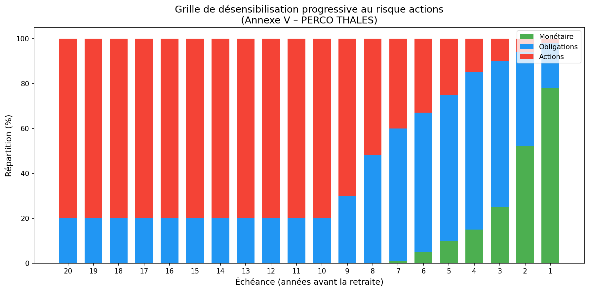

# AVENANT N° 3 A L'ACCORD PORTANT REGLEMENT DU PLAN D'EPARGNE POUR LA RETRAITE COLLECTIF DU GROUPE THALES (PERCO)

---

## PREAMBULE

La loi n° 2015-990 du 6 aout 2015 pour la croissance, l'activité et l'égalité des chances économiques a apporté un certain nombre de modifications aux dispositions légales relatives au plan d'épargne pour la retraite collectif.

Afin de tenir compte de cette évolution, les parties à l'accord portant règlement du plan d'épargne pour la retraite collectif des salariés du Groupe Thales ont convenu de la nécessité d'adapter, dans le cadre du présent avenant, les dispositions de cet accord relatives notamment au traitement social de l'abondement et à l'affectation par défaut au PERCO des sommes issues de la participation.

A l'occasion de la conclusion de cet avenant, les parties ont mis à jour le périmètre des sociétés parties au présent accord ainsi que les choix de placement (fonds) mis à disposition des bénéficiaires au titre du PERCO (annexe I de l'accord) et modifié la grille de désensibilisation progressive aux risques actions (annexe V de l'accord).

---

## Article 1 – Versements correspondant à des jours de repos non pris

Le premier paragraphe de l'article 6-4 bis est remplacé par le texte suivant :

> *« ARTICLE 6-4 BIS : VERSEMENTS CORRESPONDANTS A DES JOURS DE REPOS NON PRIS*
>
> *En l'absence de compte épargne-temps dans l'entreprise, tout salarié peut, conformément et dans les limites prévues à l'article L 3334-8 du Code du travail, verser les sommes correspondant à des jours de repos non pris sur le plan d'épargne pour la retraite collectif du groupe Thales ».*

---

## Article 2 – Abondement (Versement complémentaire)

L'article 6-6 de l'accord portant règlement du PERCO est modifié comme suit :

> *« Article 6.6 : Abondement (Versement complémentaire)*
>
> *Les modalités d'abondement sont définies pour l'ensemble des sociétés du Groupe dans le cadre du présent règlement du PERCO.*
>
> *L'abondement ne peut excéder le triple de la contribution du Participant ni être supérieur à un montant fixé par la législation en vigueur, soit à la date de conclusion de l'Accord, 16% du montant du plafond annuel de la sécurité sociale par année civile et par Participant. Cet abondement est appliqué au moment du versement volontaire.*
>
> *Les versements volontaires, y incluant le versement de la somme correspondant à l'allocation accordée à l'occasion de la remise des médailles du travail à partir de l'année 2008, l'intéressement et la participation, les transferts du PEG vers le PERCO peuvent être abondés. L'abondement peut être uniforme ou modulé en fonction du montant du versement du Participant ou encore des résultats de « la société ». Il peut être également différent selon le choix de placement du Participant. L'enveloppe d'abondement de 16% du montant du plafond annuel de la sécurité sociale est distincte de celle des plans d'épargne d'entreprise ou plans d'épargne de Groupe existants. Les abondements au PERCO bénéficient des mêmes exonérations fiscales et sociales que les abondements au plan d'épargne d'entreprise.*
>
> *Les règles et modalités de l'abondement des Entreprises relevant du périmètre du PERCO Groupe THALES sont précisées à l'annexe II au présent PERCO. Lorsque le versement du salarié ouvre droit à abondement, celui-ci est investi en même date de valeur. »*

---

## Article 3 – Formules proposées

L'Article 8.2 – Formules proposées est modifié comme suit :

> *« A l'institution du présent PERCO, deux formules de placement sont ouvertes :*
>
> - *une formule dite « Formule sous gestion libre », donnant aux épargnants la faculté de choisir à tout moment la répartition de leurs avoirs au sein de la gamme de fonds.*
> - *une formule dite « Formule gestion pilotée par horizon » avec désensibilisation progressive au risque actions.*
>
> *Une grille de désensibilisation progressive au risque actions est proposée en annexe V. La formule sous gestion pilotée par horizon nécessite le choix par le participant d'un horizon, généralement la date prévue pour sa retraite. Par défaut, la date d'échéance retenue correspondra à l'âge légal de départ à la retraite au moment du versement.*
>
> *D'autres formules intégrant des modalités différentes de gestion des risques seront, le cas échéant, ultérieurement intégrées au présent PERCO. »*

---

## Article 4 – Affectation des versements aux formules

L'article 8.4 - Affectation des versements aux formules est modifié comme suit :

> *« Si le participant choisit d'effectuer un versement sur la formule libre, il précisera le ou les fonds dans lesquels le versement sera effectué.*
>
> *En l'absence de demande de perception immédiate ou de décision d'affectation à un autre plan d'épargne salariale des sommes perçues par le participant au titre de la participation aux résultats, la moitié de ses droits est affectée par défaut dans la formule « gestion pilotée par horizon », l'autre moitié étant affectée sur le fonds Epargne Monétaire Thales du PEG. »*

---

## Article 5 – Modification de l'affectation de l'épargne dans le cadre du présent PERCO (changement de formule et/ou arbitrage)

L'article 8.5 - Modification de l'affectation de l'épargne dans le cadre du présent PERCO (changement de formule et/ou arbitrage) est complété comme suit :

> *« Conformément à la réglementation, la modification des choix de placement dans le cadre du PERCO ne donne pas lieu à abondement.*

### 8.5.1 – Arbitrage entre les formules

> *« Les arbitrages de la « Formule sous gestion libre » vers la « Formule sous gestion pilotée » sont possibles à tout moment. Ils doivent être demandés par courrier ou effectués directement en ligne sur la plateforme.*
>
> *Les arbitrages de la « Formule sous gestion pilotée » vers la « Formule sous gestion libre » sont possibles à tout moment. Ils doivent être demandés par courrier ou effectués directement en ligne sur la plateforme.*

### 8.5.2 – Arbitrages entre les fonds de la « formule sous gestion libre »

> *Les participants disposant d'avoirs dans la « formule sous gestion libre » ont la faculté de modifier à tout moment la répartition de leurs avoirs au sein de la gamme de fonds disponibles. Les arbitrages sont gratuits, demandés par courrier ou effectués directement en ligne sur la plateforme. »*

---

## Article 6 – Frais de fonctionnement et de gestion des fonds

L'article 9 - Frais de fonctionnement et de gestion des fonds est modifié comme suit :

> *« Les frais de fonctionnement et de gestion des fonds (droits d'entrée, commissions de gestion, honoraires des commissaires aux comptes) sont imputés sur l'actif du fonds conformément aux règlements des différents fonds.*
>
> *Concernant les fonds Epargne Monétaire Thales, Epargne Modérée Thales, Epargne Solidaire Equilibre Thales et Epargne Solidaire Dynamique Thales, la part B concerne les avoirs des porteurs de parts présents et les avoirs des porteurs de parts retraités dans le PERCO.*
>
> *La part C concerne les avoirs des porteurs de parts ayant quitté le Groupe, porteurs dits « Sortis ».*
>
> *Les parts B des salariés présents ayant quitté le Groupe sont arbitrées automatiquement vers les parts C.*
>
> *Conformément à l'article 5 du présent règlement, les prestations de tenue de compte-conservation décrites en annexe VIII sont prises en charge par l'Entreprise pour les salariés présents dans le Groupe. »*

---

## Article 7 – Comptabilisation des versements–teneur du registre du PERCO

L'article 10 - Comptabilisation des versements–teneur du registre du PERCO est modifié comme suit :

> *« Tous les versements au PERCO sont inscrits sur le compte individuel du PERCO du Participant (ci-après le « Compte »).*
>
> *L'Entreprise délègue la Tenue des comptes ainsi que la tenue de registre au sens de l'article R. 3332-15 du code du travail au prestataire de service indépendant habilité Amundi Tenue de Comptes, anciennement nommé CREELIA (« le Teneur de Registre ») selon les modalités développées dans la convention de Tenue de registre avec ce prestataire dont les coordonnées sont mentionnées ci-après.*
>
> *Amundi Tenue de Comptes, Société en Nom Collectif au capital de 24 000 000 euros, immatriculée au Registre du Commerce et des Sociétés de Paris sous le n° 433 221 074 dont le siège social est 90 boulevard Pasteur 75015 Paris et dont l'adresse postale est 26956 VALENCE CEDEX 9. »*

---

## Article 8 – Modification de l'ANNEXE III

L'annexe III de l'accord est supprimée et remplacée par une nouvelle annexe III rédigée comme suit :

### ANNEXE III – LISTE DES FORMULES DE GESTION

#### III - 1 Formule « Gestion Libre »

Elle permet à chaque participant de choisir librement les supports et la répartition entre ces supports suivant son profil de risque et son horizon de placement. L'arbitrage entre ces supports est possible à tout moment et il est gratuit.

**Fonds accessibles pour les porteurs de parts présents et retraités :**

4 fonds (monétaire, obligations, modéré, actions) :
- FCPE « Epargne Monétaire THALES part B »
- FCPE « THALES Obligations »
- FCPE « Epargne Modérée THALES part B »
- FCPE « THALES Actions EuroMonde »

2 fonds Solidaires :
- FCPE « Epargne Solidaire Dynamique THALES part B »
- FCPE « Epargne Solidaire Equilibre THALES part B »

**Fonds accessibles pour les porteurs de parts partis (ayant quitté le groupe pour un motif autre que la retraite) :**

4 fonds (monétaire, obligations, modéré, actions) :
- FCPE « Epargne Monétaire THALES part C »
- FCPE « THALES Obligations »
- FCPE « Epargne Modérée THALES part C »
- FCPE « THALES Actions EuroMonde »

2 fonds Solidaires :
- FCPE « Epargne Solidaire Dynamique THALES part C »
- FCPE « Epargne Solidaire Equilibre THALES part C »

Voir ci-après la description de ces fonds et leurs DICI (annexe VI).

#### III - 2 Formule « gestion pilotée par horizon »

Elle permet à chaque participant d'opter pour une désensibilisation progressive et automatique de son épargne au risque Action.

**Fonds pour les porteurs de parts présents et retraités :**
- FCPE « Epargne Monétaire Thales part B »
- FCPE « THALES Obligations »
- FCPE « THALES Actions EuroMonde »

**Fonds pour les porteurs de parts partis (ayant quitté le groupe pour un motif autre que la retraite) :**
- FCPE « Epargne Monétaire Thales part C »
- FCPE « THALES Obligations »
- FCPE « THALES Actions EuroMonde »

La désensibilisation se fera suivant la grille figurant en annexe V.

---

## Article 9 – Modification de l'ANNEXE IV

### ANNEXE IV – CRITERES DE CHOIX ET TABLEAU RECAPITULATIF DES FONDS DU PERCO THALES

Le choix des fonds proposés au sein du Plan d'Epargne Retraite Collectif (PERCO) THALES vise à procurer aux salariés une gamme étendue de possibilités d'investissement.

Ces fonds, dont la description figure dans un tableau récapitulatif ci-après, sont des fonds diversifiés, dans le cadre d'une gamme allant du fonds le plus sécuritaire au plus risqué, afin que chacun puisse orienter ses investissements selon son propre profil de risque et son horizon de placement.

Chaque adhérent peut orienter ses avoirs selon les évolutions de Marché et ses anticipations, en effectuant des arbitrages entre les fonds ; il peut aussi conditionner ses ordres de vente ou d'arbitrage à des prix planchers, selon des modalités de gestion décrites par les règlements du Plan et des fonds concernés. Il peut également opter pour la « gestion pilotée » conformément à l'article 8.2 du présent règlement.

Les partenaires sociaux du Groupe THALES ont choisi majoritairement les gestionnaires suivants pour la gestion des FCPE proposés dans le cadre du PERCO THALES :

- **Humanis** pour le fonds : « Epargne Solidaire Dynamique THALES »
- **Amundi** pour les fonds : « Epargne Monétaire THALES », « Epargne Modérée THALES », « Epargne Solidaire Equilibre THALES », « THALES Obligations », « THALES Actions EuroMonde »

Les partenaires sociaux du groupe THALES ont privilégié des FCPE en architecture ouverte pour les fonds « THALES Obligations » et « THALES Actions EuroMonde ».

### Tableau récapitulatif des fonds du PERCO THALES

*(présenté par ordre croissant d'exposition aux risques)*

**FCPE « Epargne Monétaire THALES »**
Il est investi en produits monétaires dont le rendement est lié au marché des taux d'intérêt à court terme. Il offre une progression régulière de la valeur de la part.

**FCPE « THALES Obligations »**
Il est investi en Organismes de Placement Collectif (OPCVM) offrant une exposition aux produits de taux de la zone euro. Une proportion du fonds est investie en OPCVM exposé en produits de taux indexés sur l'inflation.

**FCPE « Epargne Modérée THALES »**
Il est investi majoritairement en produits de taux de maturité inférieure à 7 ans et, dans une faible proportion en actions. Son objectif est d'offrir une valorisation du capital investi à moyen terme, tout en visant à tirer parti du marché des actions pour la part minoritaire de son actif.

**FCPE « Epargne Solidaire Equilibre THALES »**
Ce fonds est géré selon les critères de sélection d'actions ISR (Investissement Socialement Responsable) et investi de façon équilibrée entre obligations et actions de la zone euro. Il comprend une part de son actif investi en titres émis par des entreprises solidaires définies par l'article L. 3332-17-1 du code du travail. Son objectif est de tirer parti des performances des marchés actions pour une moitié de son actif, tout en atténuant le risque par les investissements en produits de taux.

**FCPE « Epargne Solidaire Dynamique THALES »**
Il est essentiellement investi en actions de pays de la zone euro et comprend une part de son actif investi en titres émis par des entreprises solidaires définies par l'article L. 3332-17-1 du code du travail. Le fonds est géré selon les critères de sélection d'actions ISR (Investissement socialement responsable).

**FCPE « THALES Actions EuroMonde »**
Il est investi en Organismes de Placement Collectif (OPCVM) exposés essentiellement aux actions Européennes et internationales. Son objectif est de tirer parti des performances du marché actions sur un horizon d'investissement moyen/long terme. Sa politique de gestion prend en compte, pour certains fonds, des critères sociaux, environnementaux et de bonne gouvernance en plus des critères financiers classiques.

---

## Article 10 – Modification de l'annexe V

Le tableau est modifié comme suit :

| Échéance (année) | Poche Monétaire | Poche Obligations | Poche actions |
|:-:|:-:|:-:|:-:|
| 20 | 0% | 20% | 80% |
| 19 | 0% | 20% | 80% |
| 18 | 0% | 20% | 80% |
| 17 | 0% | 20% | 80% |
| 16 | 0% | 20% | 80% |
| 15 | 0% | 20% | 80% |
| 14 | 0% | 20% | 80% |
| 13 | 0% | 20% | 80% |
| 12 | 0% | 20% | 80% |
| 11 | 0% | 20% | 80% |
| 10 | 0% | 20% | 80% |
| 9 | 0% | 30% | 70% |
| 8 | 0% | 48% | 52% |
| 7 | 1% | 59% | 40% |
| 6 | 5% | 62% | 33% |
| 5 | 10% | 65% | 25% |
| 4 | 15% | 70% | 15% |
| 3 | 25% | 65% | 10% |
| 2 | 52% | 42% | 6% |
| 1 | 78% | 20% | 2% |

---

## Article 11 – Transfert des actifs du fonds Amundi Label Equilibre F vers le fonds Epargne Solidaire Equilibre THALES

Dans le cadre de la réorganisation des dispositifs d'Epargne Salariale du groupe THALES, les avoirs détenus par les salariés et anciens salariés du Groupe THALES dans le Fonds Multi-Entreprises Amundi Label Equilibre part F seront transférés dans le FCPE Epargne Solidaire Equilibre Thales (en cours de création auprès de l'AMF). Ces avoirs sont actuellement détenus par Amundi Asset Management en tant que Société de gestion et CACEIS Bank en tant que Dépositaire, et Amundi TC en tant que Teneur de Compte Conservateur de parts et le resteront après le transfert collectif.

Pour rappel, les avoirs demeureront gérés par :

**Société de gestion :**
Amundi Asset Management – 90, boulevard Pasteur – 75015 PARIS.

**Dépositaire :**
CACEIS Bank France – 1-3, place Valhubert – 75013 PARIS.

**Teneur de compte conservateur de parts :**
AMUNDI Tenue de Comptes – 13-15, avenue de la gare – 26 300 ALIXAN.

Le transfert des avoirs des porteurs de parts salariés et anciens salariés de l'entreprise affectés au PERCO sont répartis comme suit :

- Les avoirs dans le PERCO des salariés présents et des salariés retraités seront transférés dans Epargne Solidaire Equilibre Thales part B.
- Les avoirs dans le PERCO des salariés partis seront transférés dans Epargne Solidaire Equilibre Thales part C.

| FCPE D'ORIGINE | FCPE DE DESTINATION |
|---|---|
| **AMUNDI LABEL EQUILIBRE part F** | **EPARGNE SOLIDAIRE EQUILIBRE THALES part B** |
| Classification AMF : Diversifié | Classification AMF : Diversifié |
| Echelle de risque (SRRI) : 5/7 | Echelle de risque (SRRI) : 5/7 |
| Frais de gestion : 0,45% à la charge du fonds | Frais de gestion : 0,45% à la charge du fonds |
| | **EPARGNE SOLIDAIRE EQUILIBRE THALES part C** |
| | Classification AMF : Diversifié |
| | Echelle de risque (SRRI) : 5/7 |
| | Frais de gestion : 0,60% à la charge du fonds |

Ce transfert sera réalisé sans aucun frais pour les porteurs de parts de l'entreprise et sera sans incidence sur la durée de blocage restant éventuellement à courir.

L'article R3332-3 du Code du travail dispose que les caractéristiques des fonds faisant partie de l'opération de transfert doivent être identiques, ce qui signifie une orientation de gestion des fonds équivalente et, pour le fonds receveur, des frais de gestion égaux ou inférieurs.

Les signataires déclarent avoir été informés des caractéristiques des fonds proposés et avoir pris connaissance des DICI de ces fonds.

Les signataires acceptent les éventuelles différences d'orientation de gestion, de profil de risque ainsi que les éventuelles différences de tarification des frais de gestion.

Une information plus détaillée concernant les modalités de transfert sera diffusée ultérieurement à l'ensemble des salariés.

---

## Article 12 – Notification et dépôt

Conformément aux dispositions légales et conventionnelles en vigueur, le texte du présent avenant sera notifié à l'ensemble des organisations syndicales représentatives au niveau du groupe et déposé par la Direction des Ressources Humaines du Groupe, en deux exemplaires, auprès de l'unité des Hauts de Seine de la Direction Régionale des Entreprises, de la Concurrence de la Consommation, du Travail et de l'Emploi (DIRECCTE) des Hauts de Seine.

---

## Article 13 – Dispositions diverses

Le présent avenant entrera en vigueur dès le lendemain du jour suivant son dépôt auprès de l'Unité des Hauts de Seine de la DIRECCTE. Il est conclu pour une durée indéterminée.

L'annexe I relative au périmètre - sociétés filiales est actualisée afin de tenir compte des modifications intervenues dans la structure du Groupe THALES.

---

*Fait à Courbevoie en 10 exemplaires le 20 mai 2016.*

**Pour la Société THALES représentée par David Tournadre, Directeur des Ressources Humaines du Groupe THALES, en sa qualité d'employeur de l'entreprise dominante**

**Pour les organisations syndicales représentatives au niveau du Groupe :**

- **CFDT** – Monsieur Didier GLADIEU
- **CFE-CGC** – Monsieur José GALZADO
- **CFTC** – P.O. 
- **CGT** – NON SIGNE

---

## ANNEXE 1

### Listes des Sociétés entrant dans le champ d'application de l'accord

#### GBU AVS

- Thales Avionics SAS
- Thales Avionics LCD SAS
- Thales Avionics Electrical Motors SAS
- Thales Avionics Electrical Systems SAS
- Thales Electron Devices SAS
- Thales Training & Simulation SAS
- Trixell SAS

#### GBU DMS

- Thales Microelectronics SAS
- Thales Systèmes Aéroportés SAS
- Thales Underwater Systems SAS

#### GBU LAS

- T D A Armements SAS
- Thales Air Systems SAS
- Thales Angénieux SAS
- Thales Cryogénie SAS
- Thales Optronique SAS
- Thales Raytheon Systems Company SAS
- Thales Seso SAS

#### GBU SIX

- Gerac SAS
- Thales Communications & Security SAS
- Thales Géodis Freight & Logistics SAS
- Thales Services SAS

#### GBU ESPACE

- Thales Alenia Space France SAS

#### Entités hors GBU

- Geris Consultants SAS
- Thales Global Services SAS
- Thales Insurance & risk management SAS
- Thales International SAS
- Thales
- Thales Université SAS
