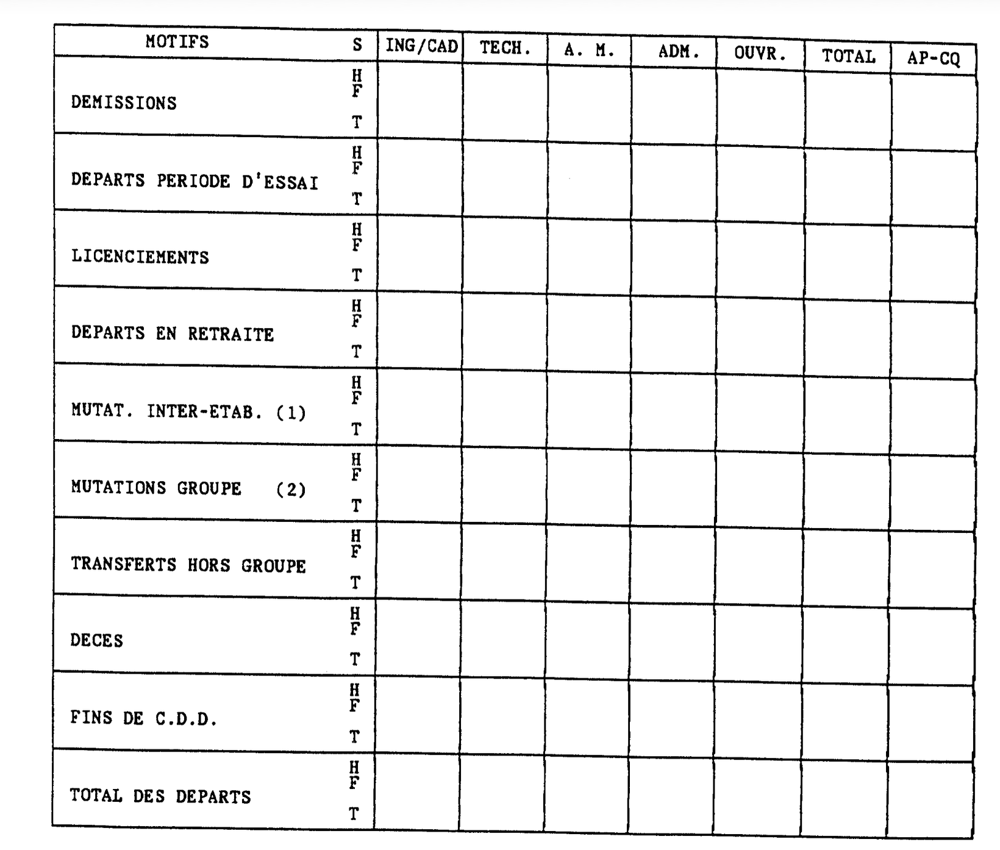
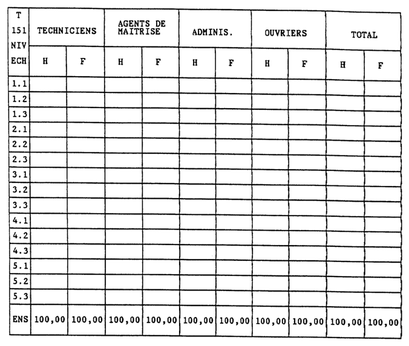
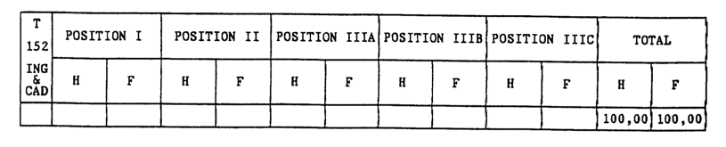
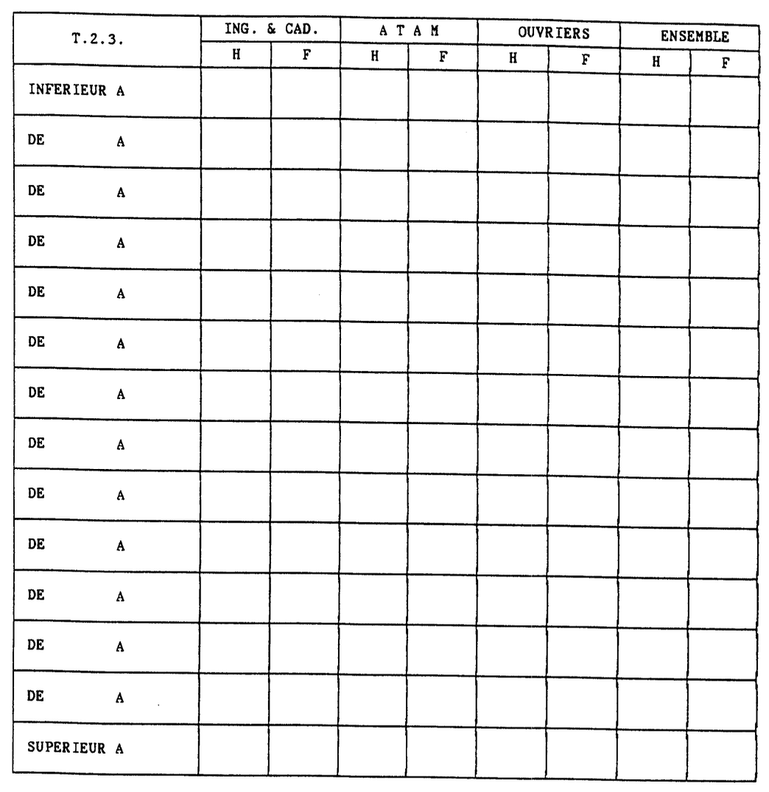
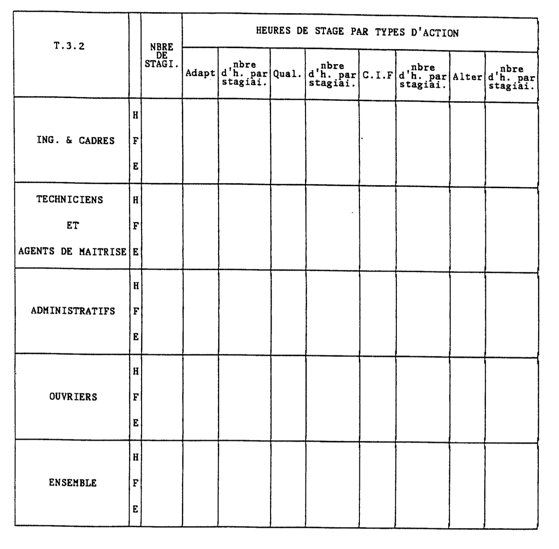
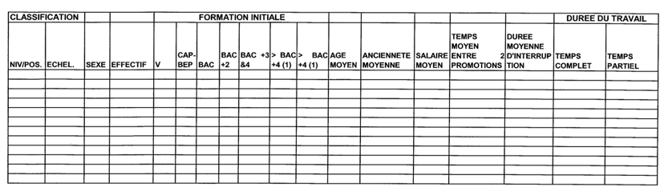

# ACCORD CADRE RELATIF À L'ÉGALITE PROFESSIONNELLE ENTRE LES FEMMES ET LES HOMMES DANS LE GROUPE THALES EN FRANCE

>[Télécharger le PDF](sources/groupe-2004-01-13-accord-cadre-relatif-a-legalite-professionnelle-entre-les-femmes-et-les-hommes-dans-le-groupe-thales-en-france.pdf)

La politique de gestion des ressources humaines, développée dans le Groupe, doit contribuer à assurer l'égalité professionnelle entre les femmes et les hommes.

La directive européenne 2002/73 du 23 septembre 2002, et la loi du 9 mai 2001 sur l'égalité professionnelle entre les femmes et les hommes constituent la référence de base pour le groupe THALES en terme d'égalité de traitement en matière d'emploi et de travail, ainsi que de dialogue social.

Les objectifs définis par le groupe en France seront adaptés, si nécessaire, aux objectifs que le Groupe se fixera au plan européen.

L'analyse de la situation du Groupe en France montre que des mesures doivent être adoptées afin d'élaborer des plans d'action permettant de corriger certaines situations et d'améliorer les perspectives :

- dans la proportion de femmes affectées à des postes de fortes responsabilités ;
- dans les embauches de femmes dans certains métiers ;
- dans les évolutions de carrière et de rémunération des femmes.

Le présent accord a pour objet d'affirmer la volonté des signataires de mettre en place dans toutes les sociétés du Groupe les moyens nécessaires pour garantir une situation d'égalité professionnelle entre les femmes et les hommes.

C'est dans les sociétés que se trouve en effet le niveau pertinent de ces négociations dont le contenu puise sa source dans la réalité concrète de la situation des femmes et des hommes dans leur environnement de travail. Aussi, cet accord doit-il être décliné par voie de négociations dans toutes les sociétés du Groupe ayant des délégués syndicaux.

Le présent accord institue les instances de concertation, élabore une méthodologie, définit des principes en matière d'égalité professionnelle entre les femmes et les hommes.

## ARTICLE 1 - INSTANCES DE CONCERTATION SUR L'ÉGALITÉ PROFESSIONNELLE ENTRE LES FEMMES ET LES HOMMES

### - Commissions d'établissement/d'entreprise

Dans chaque établissement/entreprise, la Direction prendra l'initiative de créer, au sein du comité d'entreprise/d'établissement, une commission pour l'égalité professionnelle entre les femmes et les hommes.

Cette commission, présidée par un élu du Comité, sera composée de trois salariés maximum pour les établissements/entreprises dont l'effectif est inférieur à 300 salariés. et d'au moins trois salariés pour ceux dont l'effectif est supérieur. Cette commission aura pour mission de :

- sensibiliser et informer le personnel sur l'égalité professionnelle entre les femmes et les hommes :
- préparer la délibération du Comité d'Entreprise sur le rapport annuel écrit sur la situation comparée des femmes et des hommes dans l'entreprise, prévu à L432-3-1 et D432-1 du Code du Travail. établissements/entreprises de 300 salariés et plus, et sur le rapport prévu aux L432-4.2 et R432-19 (point 2.4 du document) établissements/entreprises de moins de 300 salariés.

La commission bénéficiera pour cela de l'ensemble des documents détaillés sur la situation comparée des femmes et des hommes tels que définis dans la présente note (cf §2). Conformément à la loi du 9 mai 2001 et à ses décrets d'application, elle disposera de données chiffrées sur les conditions générales d'emploi, de formation professionnelle, de rémunérations et de conditions de travail afin de :

- cerner les mécanismes générateurs de différences ;
- proposer aux partenaires à la négociation des mesures favorisant l'égalité professionnelle entre les femmes et les hommes :
- participer au suivi des mesures adoptées.

Elle pourra se réunir durant les heures de travail dans la limite d'un crédit annuel de 6 heures par membre. Ce nombre d'heures ne tient pas compte des heures de déplacements éventuellement nécessaires, et des temps passés en réunion avec la Direction.

Les membres de la Commission d'établissement/entreprise, désignés pour la première fois, pourront bénéficier de deux journées de formation prises en charge par l'entreprise, dans l'exercice de leur mandat.

La composition de cette commission tiendra compte des diverses représentations syndicales au sein du comité. Si du fait du nombre de membres de la commission, une organisation syndicale représentative au niveau du Groupe, et représentée au comité d'entreprise ou d'établissement, n'était pas représentée à la commission, elle pourrait désigner un membre.

### - Commission d'entreprise (en cas d'établissements multiples)

Une commission relative à l'égalité professionnelle entre les femmes et les hommes sera créée au sein des comités centraux d'entreprise qui en formuleraient la demande à la majorité de leurs membres. Le crédit d'heures accordé aux membres de cette commission sera identique à celui des commissions d'établissement.

La composition de cette commission tiendra compte des diverses représentations syndicales au sein du comité. Si du fait du nombre de membres de la commission, une organisation syndicale représentative au niveau du Groupe représentée au comité n'était pas représentée à la commission, elle pourrait désigner un membre.

Cette commission aura pour mission de formuler des propositions à l'attention des partenaires à la négociation en tenant compte des délibérations des comités d'établissement et des analyses des commissions d'établissement.

### - CHSCT

Dans le cadre de l'égalité professionnelle, préalablement à la mise en œuvre de mesures relatives aux changements importants de conditions de travail, le CHSCT sera consulté.

## ARTICLE 2 - APPROCHE MÉTHODOLOGIQUE DANS LES SOCIÉTÉS DU GROUPE

### - Négociations

Dans les entreprises visées à l'article L 132-27 du Code du Travail, et dans le cadre des dispositions de la loi du 9 mai 2001, les négociations entre les Directions des sociétés du Groupe et les organisations syndicales sur l'égalité professionnelle s'appuieront notamment sur les informations contenues dans le rapport annuel sur l'égalité professionnelle entre les femmes et les hommes et les travaux des commissions précitées.

Ces négociations auront lieu tous les trois ans en cas d'accord d'entreprise. Dans ce cas, un bilan concernant les mesures décidées et leur réalisation sera réalisé annuellement.

Afin de travailler sur un échantillonnage représentatif, une version consolidée société de ces rapports sera éditée dans les sociétés comportant des établissements multiples. Cette version sera transmise au comité central d'entreprise, et le cas échéant, à la commission constituée en son sein.

Le rapport annuel sera établi pour la première fois en 2004 sur la base des données de 2003.

Dans chaque société concernée, ce rapport consolidé sera examiné par les parties à la négociation, et en fonction des priorités qu'elles se seront données, il pourra être enrichi d'éléments d'informations complémentaires, par exemple par axe/métiers, en veillant à ce que les échantillons statistiques retenus soient significatifs.

Le modèle de rapport annuel/société sur l'égalité professionnelle entre les femmes et les hommes est annexé a la présente (Annexe I).

Dans les entreprises de plus de 500 salariés, des indicateurs supplémentaires sont déterminés pour permettre une analyse globale dont la valeur statistique exige un échantillonnage minimum (annexe II).

### - Calendrier (sociétés visées à l'article L 132-27 du Code du Travail)

Le calendrier des opérations est le suivant :

- Communication au niveau de l'entreprise/établissement du hommes à la commission d'établissement et aux organisations syndicales (rapport prévu aux articles L 432-3.1. et D 432-1 du Code du Travail pour les établissements/entreprises de 432-4.2 et R432-19 (point 2.4) pour les entreprises de moins de 300 salariés:

avant le 30 avril

- Travail des commissions d'établissement :

mai

- Présentation du rapport sur l'égalité professionnelle entre les femmes et les hommes au comité d'établissement/d'entreprise :

avant le 31 mai

- Transmission du rapport consolidé société et des rapports des établissements sur l'égalité professionnelle entre les femmes et les hommes au Comité central d'entreprise, à la d'entreprise si elle existe et aux délégués commission syndicaux centraux (avec avis et proposition des commissions d'établissement):

juin

- Négociation sur les plans d'action en matière d'égalité professionnelle entre les femmes et les hommes (à défaut d'accord collectif couvrant une période de trois ans) :

septembre/octobre

## ARTICLE 3 - PRINCIPES DE RÉMUNÉRATION ET DE FORMATION

1. Dans le Groupe, le salaire d'embauche tient compte de la qualification et des compétences. En aucun cas il ne pourra être déterminé en considération du sexe de la personne. Plus généralement dans le Groupe, la détermination de la rémunération ne doit jamais être justifiée en considération du sexe du salarié.
2. Afin de contribuer à l'égalité professionnelle entre les femmes et les hommes, des dispositions sont prises de telle sorte que les salarié(e)s dont le contrat de travail est suspendu au titre d'un congé de maternité ou d'adoption, puissent bénéficier d'une révision salariale :
- Lors de la mise en place de la politique salariale au sein de la société, le salarié(e) dont le contrat de travail du salarié est suspendu en raison du congé de maternité ou d'adoption bénéficiera d'une augmentation au moins égale à la moyenne des augmentations de sa catégorie à la même date d'effet que les autres salariés.
 3. Du fait du niveau de responsabilité de leur poste, certain(e)s salarié(e)s ont une partie de rémunération sous forme variable.

- Le salarié en congé de maternité ou d'adoption bénéficiera de la partie de rémunération variable liée à la performance financière annuelle dans les conditions prévues par le plan de Rémunération Variable du Groupe THALES.

- Pour la détermination de la part de rémunération variable appréciée en fonction des objectifs annuels et permanents, la performance individuelle annuelle du salarié(e) sera appréciée sur sa seule période d'activité.

4. Dans les deux mois qui précèdent le terme d'un congé parental, le salarié sera invité à participer à un entretien avec le responsable ressources humaines afin d'évaluer les besoins éventuels de formation pour pouvoir reprendre son activité dans de bonnes perspectives professionnelles.

Ce point sera rappelé dans les notes d'orientation annuelles de la formation.

Au cours de cet entretien, le niveau de rémunération au retour du congé sera examiné.

5. Dans le cadre des revues de personnel et spécialement en ce qui concerne les propositions de poste à responsabilité, le groupe THALES attachera une attention particulière à la situation des femmes. 
6.  De plus, l'absence du salarié(e) du fait du congé d'adoption ou de maternité ne doit pas avoir d'incidence sur l'évolution de carrière ou l'évolution salariale de l'intéressé(e).

## ARTICLE 4 - CADRE COLLECTIF DE CES PRINCIPES

Les principes et règles énoncés expriment la volonté du Groupe de donner une méthode en vue d'identifier, d'examiner, d'échanger et de définir des plans d'action prévoyant la mise en place de mesures concrètes afin de garantir pour l'avenir l'égalité professionnelle entre les femmes et les hommes.

Les plans d'action qui seront mis en place en exécution du présent accord sont par nature collectifs et n'auront pas d'effets rétroactifs au titre des périodes antérieures à la signature des accords. Leurs effets seront mesurés par des indicateurs tels que les mobilités, les rémunérations, les promotions, la participation aux sessions de formation...

Des analyses relatives au parcours professionnel et à l'évolution de la rémunération seront effectuées sur la base notamment des documents de référence (cités en annexe), et après étude et discussions en commission d'égalité professionnelle.

L'écart de situation professionnelle constaté au sein d'une même catégorie professionnelle entre deux groupes de référence (c'est à dire un nombre significatif d'hommes et femmes placés dans une situation identique ou étroitement similaire à défaut d'un nombre suffisant de salariés représentatifs) donnera lieu à un plan d'action garantissant l'égalité professionnelle.

L'écart de rémunération constaté au sein de la même classification professionnelle entre les deux groupes de référence sera analysé en tenant compte de critères objectifs.

En cas d'écart injustifié, un plan d'action triennal sera défini afin de remédier, sans rétroactivité au titre des périodes antérieures à la signature des accords, à l'écart de rémunération constaté entre les deux groupes.

En cas de désaccord de la Direction de la société sur ce délai, lors des négociations, les organisations syndicales pourront saisir la Commission de suivi de l'accord Groupe qui sera réunie dans un délai d'un mois.

Elle sera une instance d'appel et de recours permettant de fixer, si nécessaire, un délai plus adapté à la situation (éventuellement supérieur à trois ans).

Les situations individuelles relèvent du processus de gestion des Ressources Humaines.

Le droit à l'information sur l'égalité professionnelle sera encouragé par la mise à disposition des textes sur l'égalité professionnelle par les services des ressources humaines à toute personne qui le souhaite, ainsi que les indicateurs de mesures du rapport sur l'égalité professionnelle entre les femmes et les hommes. Cette mise à disposition complète l'obligation d'affichage prévue par l'article L 123-7 du code du travail.

Lors de l'embauche des salarié(e)s, il sera remis sous une forme à définir dans chaque société, un document rappelant les principes d'égalité professionnelle entre les femmes et les hommes.

## ARTICLE 5 - TEMPS PARTIEL ET FORFAIT JOURS REDUITS

Le choix par le salarié(e) d'un régime à temps partiel, ou d'un forfait jour réduit, ne saurait être à l'origine de discrimination dans l'évolution de sa carrière et de sa rémunération. L'impact de la réduction du temps de travail sur la rémunération est proportionnel, et ne doit pas avoir pour conséquence une sous-évaluation des performances des salarié(e)s concerné(e)s.

L'examen de la situation montre que la grande majorité des salariés bénéficiaires de ces régimes sont des femmes souvent amenées à opérer un tel choix pour tenir compte des obligations familiales. Afin de prévenir des risques de discrimination dans leur développement professionnel, des garanties sont apportées:

- Lors des entretiens de développement professionnel, si le salarié envisage son retour à temps plein, cette situation sera abordée afin de faciliter les conditions de ce retour, et d'en tenir compte dans l'organisation du travail. Des consignes en ce sens seront données aux managers. En aucun cas les consignes données ne devront avoir pour effet d'entraver la liberté de choix du salarié.
- Les salarié(e)s n'ayant pas changé de poste depuis plus de cinq ans auront un entretien avec le Responsable des Ressources Humaines de leur unité afin de faire le point de leur évolution professionnelle.
- L'organisation de la formation professionnelle peut présenter des difficultés, notamment quand les stages sont positionnés les jours d'absence du salarié(e) de l'entreprise. Les services de formation feront tout leur possible pour prévenir le plus longtemps à l'avance de telles situations et prendront toute mesure adéquate pour faciliter sa participation. En cas d'impossibilité, un entretien avec le Responsable Ressources Humaines aura lieu afin de trouver une solution.

### ARTICLE 6 - SUIVI ET INTERPRETATION DE L'ACCORD

Les parties signataires conviennent de se réunir chaque fin d'année pour faire le point des accords signés ainsi que des pratiques mises en place dans les sociétés du Groupe.

Dans ce cadre une commission d'application et d'interprétation, composée de deux représentants par organisation syndicale signataire et un nombre équivalent de représentants de la Direction, est créée.

Elle prend ses décisions à la majorité des 2/3 des participants (présents ou représentés) et a pour objectif de faire respecter l'application du présent accord à travers sa déclinaison dans les sociétés du groupe et de trancher les éventuels litiges.

Elle se réunit, dans la limite de trois fois par an, à la demande d'1/3 de ses membres et dans les conditions prévues à l'article 4.

Cette commission de suivi sera destinataire des rapports d'entreprise des sociétés du Groupe.

Une note d'application sera envoyée par la Direction des Ressources Humaines France aux Directions des filiales afin qu'elles prennent sans tarder les initiatives leur incombant.

### ARTICLE 7 - DURÉE DE L'ACCORD

Cet accord est conclu pour une durée indéterminée. Il pourra être dénoncé par l'une des parties signataires en respectant un préavis de trois mois ou révisé dans les conditions prévues par l’article L.132-7 du Code du travail.

### ARTICLE 8 - PUBLICITÉ ET DÉPÔT

Conformément aux dispositions législatives et réglementaires en vigueur, le texte du présent accord sera déposé par la Direction des Ressources Humaines du Groupe, en cinq exemplaires auprès de la Direction départementale du travail et de l'emploi des Hauts de Seine et en un exemplaire au Secrétariat-greffe du conseil de prud'hommes de Nanterre.

Fait à Paris en 13 exemplaires le 13 Janvier 2004.

Pour la Direction du Groupe: Yves BAROU, Directeur des Ressources Humaines du Groupe

Pour les Organisations syndicales

CFDT: Guy HENRY

CFE-CGC: Hervé TAUSKY

CFTC: Alain DESVIGNES

CGT: Bernard CARLIER

FO: Odile SISSLER

# ANNEXE I: RAPPORT ANNUEL SUR L'EGALITE PROFESSIONNELLE ENTRE LES FEMMES ET LES HOMMES

ANNEE :

SOCIETE :

## I-ANALYSE CHIFFREE

### 1.1. EFFECTIFS

#### 1.1.1. REPARTITION PAR CATEGORIE PROFESSIONNELLE :

| C.D.I. | ING/C. | TECH.                                    | ADM. | A.M. | OUV. | TOTAL  | APP C.Q |
|--------|--------|------------------------------------------|------|------|------|--------|---------|
| Н      |        |                                          |      |      |      |        |         |
| %      |        |                                          |      |      |      | 100,00 |         |
| F      |        |                                          |      |      |      |        |         |
| %      |        |  |      |      |      | 100,00 |         |
| H + F  |        |                                          |      |      |      |        |         |

| C.D.D. | ING/C. | тесн. | ADM. | A.M. | ouv. | TOTAL  | APP C.Q |
|--------|--------|-------|------|------|------|--------|---------|
| Н      |        |       |      |      |      |        |         |
| %      |        |       |      |      |      | 100,00 |         |
| F      |        |       |      |      |      |        |         |
| %      |        |       |      |      |      | 100,00 |         |
| H + F  |        |       |      |      |      |        |         |

#### 1.1.2. PYRAMIDE DES AGES PAR CATEGORIE :

| T.1.1.2 | Ing./Cadres |        | Techniciens |         | Administratifs |        | Agents de Maitrise |                                                  |
|---------|-------------|--------|-------------|---------|----------------|--------|-----------------------|--------------------------------------------------|
|         | H           | F      | H           | F       | H              | F      | Н                     | F                                                |
| < 25    |             |        |             |         |                |        |                       | <del> </del>                                     |
| 25/30   |             |        |             |         |                |        |                       | <del>                                     </del> |
| 31/35   |             |        |             | <u> </u> |                |        |                       |                                                  |
| 36/40   |             |        |             |         |                |        |                       |                                                  |
| 41/45   |             |        |             |         |                |        |                       | <del> </del>                                     |
| 46/50   |             |        |             |         |                |        |                       |                                                  |
| 51/55   |             |        |             |         |                |        |                       | <del></del>                                      |
| 56/60   |             |        |             |         |                |        |                       | <del> </del>                                     |
| > 60    |             |        |             |         |                |        |                       |                                                  |
| ENS.    | 100,00      | 100,00 | 100,00      | 100     | 100            | 100,00 | 100,00                | 100,00                                           |

|       | Ouvriers |        | TOTAL  |        |  
|-------|----------|--------|--------|--------|
|       | H        | F      | Н      | F      |  
| < 25  |          |        |        |        |  
| 25/30 |          |        |        |        |  
| 31/35 |          |        |        |        |  
| 36/40 |          |        |        |        |  
| 41/45 |          |        |        |        |  
| 46/50 |          |        |        |        |  
| 51/55 |          |        |        |        |  
| 56/60 |          |        |        |        |  
| > 60  |          |        |        |        |  
| ENS.  | 100,00   | 100,00 | 100,00 | 100,00 |  

#### 1.1.3. REPARTITION DE L'EFFECTIF PAR ANCIENNETE :

| T.1.1.3 | Ing./Cadres |        | Techniciens |        | Administratifs |        | Agents de Maitrise |        |
|---------|-------------|--------|-------------|--------|----------------|--------|-----------------------|--------|
|         | Н           | F      | H           | F      | Н              | F      | Н                     | F      |
| < 1     |             |        |             |        |                |        |                       |        |
| 1/2     |             |        |             |        |                |        |                       |        |
| 3/5     |             |        |             |        |                |        |                       |        |
| 6/10    |             |        |             |        |                |        |                       |        |
| 11/15   |             |        |             |        |                |        |                       |        |
| 16/20   |             |        |             |        |                |        |                       |        |
| 21/25   |             |        |             |        |                |        |                       |        |
| 26/30   |             |        |             |        |                |        |                       |        |
| > 30    |             |        |             |        |                |        |                       |        |
| ENS.    | 100,00      | 100,00 | 100,00      | 100,00 | <text></text>  | 100,00 | 100,00                | 100,00 |

|       | Ouv    | riers  | то     | TAL    |
|-------|--------|--------|--------|--------|
|       | H F    |        | Н      | F      |
|       |        |        |        |        |
| 1/2   |        |        |        |        |
| 3/5   |        |        |        |        |
| 6/10  |        |        |        |        |
| 11/15 |        |        |        |        |
| 16/20 |        |        |        |        |
| 21/25 |        |        |        |        |
| 26/30 |        |        |        |        |
|       |        |        |        |        |
| ENS.  | 100,00 | 100,00 | 100,00 | 100,00 |

#### 1.1.4. COMMENTAIRES SUR LES TABLEAUX : 111 - 112 - 113

### 1.2. DUREE ET ORGANISATION DU TRAVAIL

#### 1.2.1. REPARTITION DES EFFECTIFS SELON LA DUREE DU TRAVAIL :

| T.1.2.1.            | ING. & CADRES |     | A T  | A M                                      | OUV       | RIERS     | ENSEMBLE                  |            |            |              |
|---------------------|---------------|-----|------|------------------------------------------|-----------|-----------|---------------------------|------------|------------|--------------|
|                     | I             | Н   |      | F                                        | H         | F         | Н                         | F          | Н          | F            |
| NOMBRE              | DE S          | SAL | AR I | ES BENEF                                 | ICIANT D' | un systei | E D'HORA                  | IRES INDIV | 'IDUALISES |              |
| HORAIRES            |               |     |      |                                          |           |           |                           |            |            |              |
| VARIABLES           |               |     |      |                                          |           |           |                           |            |            |              |
| HORAIRES            |               |     |      |                                          |           |           |                           |            |            |              |
| DECALES             |               |     |      |                                          |           |           |                           |            |            |              |
| NOMBRE DE SALA      | RIES          | oc  | :CUI | PES A TEM                                | PS PARTIE | L AU 31.  | 12 (ABATT                 | EMENT/HORA | IRE ETABL  | ISSEMNT)     |
| H<=50%              |               |     |      |                                          |           |           |                           |            |            |              |
| H>50% H<=80%        |               |     |      |                                          |           |           |                           |            |            | <u> </u>     |
| H>80% H<100%        |               |     |      |                                          | 1         |           |                           |            |            |              |
|                     | T             |     | N(   | OMBRE DE                                 | SALARIES  | EN FORFA  | IT-JOUR R                 | EDUIT      |            |              |
| ا                   | <u> </u>      |     |      | ł                                        |           |           |                           |            |            |              |
| NOMB                | RE D          | E S | SAL  | ARIES QUI                                | ONT PRIS  | UN CONG   | E NON REM                 | IUNERE DAN | S L'ANNEE  |              |
|                     |               |     |      |                                          |           |           |                           |            |            |              |
|                     | -             |     | N    | OMBRE DE                                 | SALARIES  | TRAVAILL  | ANT EN EC                 | UIPES      | <u> </u>   |              |
| EQUIPES FIXES       |               |     |      |  |           |           |                           |            |            |              |
| 2 EQUIPES           |               |     |      |                                          |           |           |                           |            |            |              |
| EQUIPES FIXES       |               |     |      |                                          |           |           |                           |            |            |              |
| + DE 2 EQUIPES      |               |     |      |                                          |           |           |                           |            |            |              |
| EQUIP. ALTERN.      |               |     |      |                                          |           |           |                           |            |            |              |
| 2 EQUIPES           |               |     |      |                                          |           |           |                           |            |            |              |
| EQUIP. ALTERN.      |               |     |      |                                          |           |           |                           |            |            |              |
| + DE 2 EQUIPES      |               |     |      |                                          |           |           |                           |            |            |              |
| EQUIPES DE          |               |     |      |                                          |           |           |                           |            |            |              |
| NUIT                |               |     |      |                                          |           |           |                           |            | 1          | ]            |
| EQUIPES DE          |               |     |      |                                          |           |           |                           |            |            |              |
|                     | 1             |     |      |                                          |           |           |                           |            |            | 1            |
| WEEK-END            | 1             |     |      | 1                                        |           | 4         |                           | •          |            | 1            |
| WEEK-END TRAVAIL | +-            |     |      |                                          | <u> </u>  |           | <table-cell></table-cell> |            |            | <del> </del> |

#### 1.2.2. ABSENTEISME :

| T.1.2.2.           |             | TA      | <b>TO</b>           |           |                    |       |
|--------------------|-------------|---------|---------------------|-----------|--------------------|-------|
|                    |             | Maladie | A.Travail Trajet | Maternite | Autres Absences | TOTAL |
| ING. & CADRES      | H F E |         |                     |           |                    |       |
| TECHNICIENS        | H F E | *       |                     |           |                    |       |
| ADMINISTRATIFS     | H F E |         |                     |           |                    | ·     |
| AGENTS DE MAITRISE | H F E |         |                     |           |                    |       |
| OUVRIERS           | H F E |         |                     |           |                    |       |
| ENSEMBLE           | H F E |         |                     |           |                    |       |

#### 1.2.3. COMMENTAIRES SUR LES TABLEAUX : 121 - 122

### 1.3. DONNEES SUR LES CONGES

#### 1.3.1. REPARTITION PAR CATEGORIE PROFESSIONNELLE:

| CONGE SABBATIQUE | ING/C. | тесн. | ADM. | A.M. | OUV. | TOTAL |
|---------------------|--------|-------|------|------|------|-------|
| Н                   |        |       |      |      |      |       |
| F                   |        |       |      |      |      |       |
| H + F               |        |       |      |      |      |       |

| CONGE PARENTAL | ING/C. | TECH. | ADM. | A.M. | ouv. | TOTAL |
|-------------------|--------|-------|------|------|------|-------|
| Н                 |        |       |      |      |      |       |
| F                 |        |       |      |      |      |       |
| H + F             |        |       |      |      |      |       |

| C.E.T. | ING/C. | TECH. | A.M. | OUV. | TOTAL                                   |
|--------|--------|-------|------|------|-----------------------------------------|
| Н      |        |       |      |      |                                         |
| F      |        |       |      |      |                                         |
| H + F  |        |       |      |      |  |

### 1.4. DONNEES SUR LES EMBAUCHES ET LES DEPARTS

### 1.4.1. REPARTITION DES EMBAUCHES :

| T.1.4.2      | C.D.D. |   | C. | D.I. | MUTATATIONS INDIVIDUELLES |                                     | DONT -25 ANS |   |
|--------------|--------|---|----|------|------------------------------|-------------------------------------|--------------|---|
|              | н      | F | Н  | F    | Н                            | F                                   | Н            | F |
| ING/CADRES   |        |   |    |      |                              |                                     |              |   |
| тесни.       |        |   |    |      |                              |                                     |              |   |
| ADMINIST.    |        |   |    |      |                              |              |              |   |
| AG. DE MAIT. |        |   |    |      |                              | |              |   |
| OUVRIERS     |        |   |    |      |                              |                                     |              |   |
| TOTAL        |        |   |    |      |                              |                                     |              |   |
| APP-CQ       |        |   |    |      |                              |                                     |              |   |

#### 1.4.2. REPARTITION DES DEPARTS

(1) MUTATIONS INTERNES INDIVIDUELLES ET TRANSFERTS COLLECTIFS INTER-ETABLISSEMENTS DANS LA MEME SOCIETE JURIDIQUE.
(2) MUTATIONS INTERNES INDIVIDUELLES ET TRANSFERTS COLLECTIFS VERS UNE AUTRE SOCIETE DU GROUPE THALES

### 1.5. POSITIONNEMENT DANS L'ENTREPRISE

#### 1.5.1. REPARTITION DE L'EFFECTIF INSCRIT PAR NIVEAU ECHELON EN % AU 31.12 :

#### 1.5.2. REPARTITION DE L'EFFECTIF PAR POSITION EN % AU 31.12 :

#### 1.5.3. COMMENTAIRES SUR LE TABLEAU : 151 - 152

### 1.6. PROMOTIONS

#### 1.6.1. EFFECTIFS PROMUS ET/OU AUGMENTES :

| T 1 6 1            |   | PRO    | ius | AUGMI                     |   | PROMUS ET/OU AU |                                          |  |
|--------------------|---|--------|-----|---------------------------|---|-----------------|------------------------------------------|--|
| T.1.6.1.           |   | Nombre | %   | Nombre                    | % |                 | 7,                                       |  |
|                    | Н |        |     | <table-cell></table-cell> |   |                 | 5555555555555555555555555555555555555555 |  |
| OUVRIERS           | F |        |     |                           |   |                 |                                          |  |
|                    | E |        |     |                           |   |                 |                                          |  |
|                    | Н |        |     |                           |   |                 |                                          |  |
| AGENTS DE MAITRISE | F |        |     |                           |   |                 |                                          |  |
|                    | E |        |     |                           |   |                 |                                          |  |
|                    | H |        |     |                           |   |                 |                                          |  |
| ADMINISTRATIFS     | F |        |     |                           |   |                 |                                          |  |
|                    | E |        |     |                           |   |                 |                                          |  |
|                    | н |        |     |                           |   |                 |                                          |  |
| TECHNICIENS        | F |        |     |                           | · |                 |                                          |  |
|                    | E |        |     |                           |   |                 |                                          |  |
|                    | Н |        |     |                           |   |                 |                                          |  |
| ING. & CADRES      | F |        |     |                           |   |                 |                                          |  |
|                    | E |        |     |                           |   |                 |                                          |  |
|                    | Н |        |     |                           |   |                 |                                          |  |
| ENSEMBLE           | F |        |     |                           |   |                 |                                          |  |
|                    | Е |        |     |                           |   |                 |                                          |  |

#### 1.6.2. COMMENTAIRES SUR LE TABLEAU : 161 

## 2. REMUNERATIONS

### 2.1. STATISTIQUES DE SALAIRE AU 31.12. :

| T.2.1.           |             | K moyen  |  | Salaire de Base 95e cent. | Moyenne P.A. | Age Moy. | Anc. Moy. Soc. |
|------------------|-------------|----------|--|---------------------------------|-----------------|-------------|----------------------|
| OUVRIERS         | H F E |          |  |                                 |                 |             |                      |
| ADMINISTRATIFS   | H F E |          |  |                                 |                 |             |                      |
| AGENTS DE MAITR. | H F E |          |  |                                 |                 |             |                      |
| TECHNICIENS      | H F E | ·        |  |                                 |                 |             |                      |
| ING & CAD 1 A 3B | H F E | <u>-</u> |  |                                 | <u>-</u>        |             |                      |

NOMBRE DE FEMMES DANS LES DIX PLUS HAUTES REMUNERATIONS :

### 2.2. REMUNERATIONS MENSUELLES MOYENNES (BRUTS FISCAUX EN EUROS) :

| T.2.2. | ING. & CAD | TECH. | A.M. | ADM. | OUV. | ENSEMBLE |
|--------|------------|-------|------|------|------|----------|
| Н      |            |       |      |      |      |          |
| F      |            |       |      |      |      |          |
| E      |            |       |      |      |      |          |

### 2.3. GRILLE DES REMUNERATIONS ANNUELLES (BASE + P.A. + P.V. - EN CE) 

## 3. FORMATION

### 3.1. BILAN DES ACTIONS DE FORMATION 

| T.3.1                                    |   | -                               |        | IAIRES                          | HEURES DE STAGE           |                                         |  |
|------------------------------------------|---|---------------------------------|--------|---------------------------------|---------------------------|-----------------------------------------|--|
|                                          |   | EFFECTIF INSCRIT AU 31.12 | Nombre | % par Rapport a l'effect. | Nombre                    | Nbre d'h. par stagiaire           |  |
|                                          | H |                                 |        |                                 |                           |                                         |  |
| | F |                                 |        |                                 |                           |                                         |  |
|                                          | E |                                 |        |                                 |                           |                                         |  |
| TECHNICIENS                              | Н |                                 |        |                                 |                           |                                         |  |
| et                                       | F |                                 |        |                                 |                           | <u> </u>                                |  |
| AGENTS DE MAITRISE                       | E |                                 |        |                                 |                           |                                         |  |
|                                          | Н |                                 |        |                                 | |                                         |  |
| ADMINISTRATIFS                           | F | n                               |        |                                 |                           |                                         |  |
|                                          | E |                                 |        |                                 |                           |                                         |  |
|                                          | Н |                                 |        |                                 |                           |                                         |  |
| OUVRIERS                                 | F |                                 |        |                                 | ·                         |  |  |
|                                          | E |                                 |        |                                 |                           |                                         |  |
|                                          | Н |                                 |        |                                 |                           |                                         |  |
| ENSEMBLE                                 | F |                                 |        |                                 |                           |  |  |
|                                          | E |                                 |        |                                 |                           |                                         |  |

## 3. FORMATION

### 3.2. BILAN DES ACTIONS DE FORMATION PAR TYPES D'ACTION

### 3.3. COMMENTAIRES SUR LES TABLEAUX: 31 - 32

# **ANNEXE II**

# **ELEMENTS D'ANALYSE GLOBALE (SOCIETES DE PLUS DE 500 SALARIES)**

Nota: la pertinence de l'analyse requiert au minimum 15 salariés par ligne

(1) Selon les cas sélection entre Groupes d'écoles
