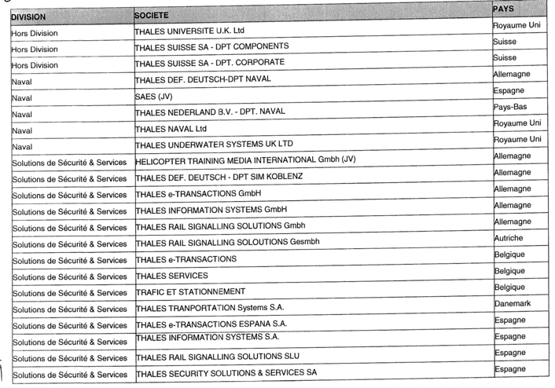

# Accord relatif au comité européen du Groupe Thales Portant avenant n°3 à l'accord du 16 novembre 1993

>[Télécharger le PDF](sources/groupe-2007-12-18-accord-relatif-au-comite-europeen-du-groupe-thales-portant-avenant-n3-a-laccord-du-16-novembre-1993.pdf)

> 📅 Signé le **18 décembre 2007** — Neuilly-sur-Seine
>
> 🏢 **Thales** : Yves BAROU, Directeur des Ressources Humaines Groupe
>
> ✅ **Signataires** : CFDT (Guy HENRY) · CFE-CGC (Hervé TAUSKY) · CFTC (Alain DESVIGNES) · CGT (Laurent TROMBINI) · FO (Dominique ALLO)
>
> ❌ **Non Signataires** : aucun

> **Validité:**  Indéterminée

 
> **Eléments liés:** N/A
---
## PREAMBULE

Le Comité européen de THALES a été institué par un accord du 16 novembre 1993.

Afin de prendre en compte le nouveau périmètre du Groupe et d'optimiser le fonctionnement du Comité Européen, les parties signataires, représentatives au niveau du Groupe, ont souhaité engager des négociations en vue de réviser, par avenant, l'accord sur le Comité Européen du 16 novembre 1993 et son avenant n° 2 conclu le 1er Mars 2002.

Une négociation a été engagée le 20 juin 2007 avec l'ensemble des organisations syndicales représentatives au niveau de la société Thales et du Groupe, ainsi que les Fédérations européennes de la métallurgie, appelée à participer à la négociation du présent avenant.

L'accord révisé sur la base des dispositions de l'article 6 de l'avenant n°2 à l'accord du 16 novembre 1933 et de l'article L.132-7 du Code du travail, s'inscrit dans le cadre des dispositions de l'article 13-1 de la directive du Conseil de l'Union Européenne du 22 septembre 1994.

En conséquence, les dispositions du présent avenant modifient les articles 2, 3, 4, 5 et 6 de l'avenant n°2 du 1er mars 2002 et s'y substituent de plein droit.

## Article 1 – CHAMPS D'APPLICATION

Cet accord s'applique à l'ensemble des salariés des entreprises de l'Espace économique européen et de la Suisse dont la société Thales détient directement ou indirectement plus de la moitié du capital social ou qu'elle contrôle directement ou indirectement, et forme avec elles, un même ensemble économique, c'est-à-dire dont le président est choisi et la majorité des administrateurs désignés par la société Thales et/ou dont la société Thales détient la majorité des droits de vote.

Le périmètre du comité d'entreprise européen fait l'objet de l'Annexe 1 jointe au présent accord. Le périmètre du Comité d'entreprise européen sera revu à chaque renouvellement dans les conditions de l'Article 3.1.

## Article 2 : MISSIONS DU COMITE EUROPEEN

Le Comité d'entreprise Européen est une instance d'information, de consultation, d'échange de vues et de dialogue social sur les questions transnationales au niveau européen.

Le Comité d'entreprise Européen, s'appuyant sur les principes de subsidiarité, ne se substitue pas aux instances représentatives propres à chaque société et à chaque pays. Il s'agit d'une instance supplémentaire et complémentaire qui a pour objectif de concourir, par le dialogue et la concertation, à la prise en compte de l'intérêt des salariés européens de Thales.

Pour remplir sa mission le comité européen est organisé comme suit :

- Une instance plénière, le comité d'entreprise européen, qui se réunit deux fois par an et permet l'échange de vues, le dialogue et le recueil d'avis sur des sujets transnationaux ayant un impact sur au moins deux pays
- Un bureau du Comité européen qui se réunit tous les deux mois et exerce une mission permanente de liaison entre la Direction du Groupe Thales et les membres du Comité d'entreprise Européen lui permettant d'être informé de manière régulière de l'évolution du Groupe et plus particulièrement de suivre ses évolutions au niveau européen.
- Deux réunions par an d'information et d'échanges au niveau de chaque Division et hors Division seront l'occasion, pour les représentants du personnel appartenant à la Division ou hors Division, d'aborder des sujets transnationaux relatifs aux questions économiques, industrielles ou organisationnelles, d'échanger sur les évolutions stratégiques et opérationnelles de la Division et de contribuer à la préparation des travaux du comité d'entreprise européen sur l'évolution stratégique des divisions (sur la base des éléments économiques et financiers du SBP).
  Ces réunions n'auront pas vocation à se substituer au Comité Européen, instance plénière, dans ses
  - Ces réunions n'auront pas vocation à se substituer au Comité Européen, instance plénière, dans ses attributions. Elles serviront de base d'information pour mieux éclairer les informations données au cours des réunions plénières au comité d'entreprise européen.

### 2.1. Réunions ordinaires sur la marche générale du Groupe

Le Comité d'entreprise Européen de la Société THALES est réuni par la Direction du Groupe deux fois par an, pour débattre de l'évolution des activités du Groupe.

Les réunions ont pour objet de favoriser l'information, de permettre le dialogue, d'organiser l'échange de vues et de procéder à la consultation, dans le cas où la consultation serait prévue.

A l'occasion de l'une de ces réunions ordinaires, la Direction établira un rapport annuel sur les activités du Groupe.

Dans cette optique, le Comité Européen a particulièrement vocation à être informé sur des questions transnationales relatives à :

- L'activité sociale, économique, industrielle, commerciale présente et future de Thales dans les différents pays européens (bilans et perspectives)
- La structure et l'évolution du capital de Thales
- La situation et l'évolution probable de l'emploi par pays et par Division.
- Les conditions de travail des salariés de Thales dans les différents pays.
- Le bilan de la politique des rémunérations et de formation.
- L'égalité professionnelle femmes / hommes.

Ces différents éléments constitueront la base du rapport annuel du Président du Groupe qui, après débat, fera l'objet d'un vote formel des représentants du personnel.

Les bilans et perspectives de la politique de recherche, d'investissement, la stratégie industrielle et ses répercussions par pays feront l'objet d'une consultation annuelle spécifique.

L'ordre du jour des réunions ordinaires est communiqué aux membres du Comité d'entreprise Européen au moins 15 jours avant la réunion.

### 2.2  Réunions extraordinaires relatives à des circonstances exceptionnelles

En cas de circonstances exceptionnelles telles que définies ci-dessous, le Président après avoir informé le bureau du comité d'entreprise Européen, ou le bureau du Comité d'entreprise européen à la majorité de ses membres, pourront décider la réunion d'un Comité extraordinaire.

Sont considérées comme circonstances exceptionnelles, de nature à affecter considérablement les intérêts des salariés, et ayant des conséquences transnationales dans un cadre européen, notamment :

- les transferts d'activités, fusions/acquisitions, cessions d'entreprise concernant plus de 500 personnes,
- les licenciements collectifs de plus de 150 personnes

qui concernent au moins deux pays appartenant au périmètre du Comité Européen.

- La modification de la structure du capital et/ou de la direction Générale du Groupe

De même, par exception, la disparition de la présence industrielle du groupe Thales ou d'une Division dans l'un des pays relevant du champ d'application du Comité d'entreprise Européen, quel que soit le nombre d'emplois concernés, sera considérée comme une circonstance exceptionnelle.

Le Président disposera alors d'un délai de quinze jours calendaires pour convoquer le Comité d'entreprise Européen en réunion extraordinaire sauf si l'une des réunions ordinaires du Comité d'entreprise Européen est prévue dans le mois qui suit. Dans ce cas l'examen de la situation sera porté à l'ordre du jour de la réunion ordinaire. Les documents d'information sur le point spécifique seront transmis dans un délai de 8 jours calendaires.

La convocation et l'ordre du jour de ces réunions extraordinaires sont communiqués aux membres du Comité d'entreprise Européen au moins 8 jours calendaires avant la réunion. »

Le Comité Européen sera ainsi réuni, par le Président ou son représentant, en vue d'être informé avec un délai suffisant, et consulté sur les orientations de l'entreprise en matière de restructurations et de décisions majeures concernant le maintien et l'avenir de l'entreprise et de ses divers centres, de sorte que les éléments du débat et l'avis puissent encore être intégrés au processus de décision.

Dans les cas de transferts d'activités, fusions/acquisitions, cessions d'entreprise concernant plus de 500 personnes, licenciements collectifs de plus de 150 personnes, les parties conviennent que la consultation du Comité d'entreprise Européen sera effectuée avant le terme des procédures d'information /consultation des instances nationales.

L'information concernant ces procédures sera fournie dès le démarrage du processus aux membres du comité d'entreprise européen.

L'ordre du jour des réunions extraordinaires est établi entre le Président du Comité d'entreprise Européen ou son représentant et le bureau du Comité d'entreprise Européen.

Avant chaque réunion extraordinaire, et en cas d'urgence exceptionnelle, la date et le lieu de la réunion sont fixés par la Direction de Thales et communiqués avec l'ordre du jour, au moins huit jours calendaires avant la réunion à l'ensemble des membres du comité d'entreprise Européen, sauf exceptionnellement si le cadre réglementaire du pays ne le permettait pas.

### <u>Un nouvel article 2.3 est institué</u>

### 2.3 Réunion thématique de travail du Comité d'entreprise européen

Une réunion thématique de travail composée de membres appartenant au comité d'entreprise européen pourra se tenir une fois par an sur un sujet transverse entrant dans les compétences du comité d'entreprise européen. Le secrétaire du comité européen aura en charge l'organisation de cette réunion (lieu, ordre du jour). Pour la bonne tenue de cette réunion, la Direction mettra à disposition les moyens nécessaires (interprétariat, salle de réunion). Les travaux de cette réunion thématique de travail seront communiqués au comité d'entreprise européen. Les sujets seront arrêtés par le bureau du comité d'entreprise européen. Pour cette réunion thématique de travail, il pourra être fait appel à des intervenants internes ou externes.

<u>Les dispositions de l'article 3 de l'accord du 1er mars 2002 portant avenant à l'accord du 16 novembre 1993 sont modifiées comme suit :</u>

## Article 3 : PRESIDENCE ET COMPOSITION

« Le Comité d'entreprise Européen est présidé par le Président Directeur Général de Thales ou son représentant. Le Président est assisté des personnes de son choix pour les questions relevant de leur compétence ; il ne prend pas part aux votes du comité.

Le Comité est composé de 35 membres titulaires désignés pour une durée de deux ans, dont la répartition est fixée dans les conditions prévues par l'article 3.1 du présent accord.

Cette durée court à compter de la première séance plénière ordinaire ou extraordinaire du Comité d'entreprise Européen suivant la désignation.

Des membres remplaçants sont désignés dans les mêmes conditions que les membres titulaires, ils n'assistent pas aux réunions plénières sauf en cas d'absence du titulaire. Ils peuvent assister aux réunions préparatoires, ainsi qu'à la réunion thématique.

Si les circonstances le justifient, le mandat d'un membre du Comité d'entreprise Européen pourra être retiré par l'instance de représentation du personnel ou l'organisation syndicale qui a procédé à sa désignation notamment dans les cas suivants : départ du Groupe Thales, départ à la retraite, démission ou différend avec l'organisation syndicale l'ayant mandaté. Il sera procédé à son remplacement par l'instance ou l'organisation syndicale concernée.

En cas de sortie d'une société du périmètre du Groupe, les mandats des membres du Comité d'entreprise Européen, et des représentants des organisations syndicales de la société concernée, fin de plein droit. Ils sont alors remplacés par un ou des remplacants.

Dans le cas où certains pays ne seraient plus représentés, ou en cas de fin de mandat détenu par des membres appartenant à des sociétés faisant l'objet d'une sortie du Groupe et, si le nombre des membres titulaires du Comité est porté à moins de 33 membres, l'attribution des sièges sera revue pour assurer jusqu'à la fin des mandats en cours, la représentation du Comité d'entreprise Européen sur la base de 35 membres.

Chacune des organisations syndicales françaises signataires représentatives au niveau du Groupe et affiliée à une confédération syndicale européenne pourra désigner, pour siéger dans cette instance, un représentant syndical. Dans le cas où ces organisations ne disposeraient pas de membre titulaire tel que prévu à l'article 3.1, elles pourront désigner un représentant qui pourra assister aux réunions préparatoires du Comité et suppléer, lors des réunions plénières, le représentant syndical si celui-ci isponible.

Un représentant de la FEM et de la FEDEM assisteront, sans droit de vote, aux réunions du Comité d'entreprise Européen .

### 3.1 Désignation des membres du Comité d'entreprise Européen

Le comité d'entreprise européen est composé de travailleurs du groupe d'entreprises de dimension communautaire élus ou désignés en leur sein par les représentants des travailleurs (directive 94/45/CE 22/09/94 annexe.1B).

- Le Comité d'entreprise Européen comprend au moins un membre par pays de l'Espace Economique européen (auquel s'ajoute la Suisse) où Thales a une filiale directe ou indirecte employant au minimum 150 salariés. Les autres sièges des membres du Comité Européen se répartissent, proportionnellement aux effectifs de chaque pays, selon le système de la représentation proportionnelle au plus fort reste. Les effectifs pris en compte pour la composition sont ceux arrêtés au 30 avril de l'année en cours.

Cette répartition, établie à la date du 30 avril 2007, figure dans le tableau en annexe 2 du présent accord. Elle sera réexaminée, tous les deux ans, lors du renouvellement de la composition du Comité d'entreprise Européen.

- Dans chaque pays, les représentants seront désignés par les salariés ou les organisations syndicales représentatives, selon les règles locales de désignation prévues par la législation en vigueur ou les usages propres à chaque pays. Ils devront être membres d'une organisation syndicale adhérente ou associée à une fédération européenne.

- Pour la France, les membres du Comité d'entreprise Européen sont désignés par les organisations syndicales représentatives au niveau du Groupe en France. Ils sont choisis parmi les membres élus ou désignés des Comités d'Entreprises ou d'Etablissement. La répartition des sièges est établie par référence aux dispositions de l'article L439-19 du code du travail français, c'est-à-dire au plus fort reste, selon la méthode « Hagenbach » (cf. annexe 3).

La première répartition suivant le présent accord, et figurant en annexe 2, sera établie à la date du 30 avril 2007. Les calculs seront pour l'avenir basés sur les résultats arrêtés le 30 avril précédant le renouvellement des membres.

Si le Groupe THALES acquiert une société dont les effectifs (plus de 150 salariés) entrent dans le périmètre du Comité d'entreprise Européen au cours de la mandature de deux ans, un représentant de cette entreprise pourra y siéger, avec droit de vote, si le pays ne disposait pas de représentant au Comité. En revanche, si le pays disposait déjà d'un représentant au Comité, l'évolution des effectifs sera sans effet sur la composition dudit Comité pendant cette période.

Si le groupe Thales acquiert une société ayant plusieurs établissements en Europe et que cette acquisition modifie de façon substantielle les effectifs du groupe Thales en Europe (plus de 5% en Europe), le Comité d'entreprise européen à la majorité de ses membres ou le Président du Comité pourront demander à procéder à son renouvellement.

Si la législation française, applicable aux accords conclus par anticipation, venait à modifier la composition du Comité Européen, les parties conviennent que ces nouvelles dispositions seraient prises en compte lors du renouvellement des membres du Comité d'entreprise Européen de Thales après avoir informé préalablement les Organisations Syndicales représentatives du Personnel.

### <u>3.2 Statut des membres du comité d'entreprise européen</u>

<u>Les dispositions de l'article 3.2 restent inchangées</u>

<u>Les dispositions de l'article 3.3 de l'accord du 1er mars 2002 portant avenant à l'accord du 16 novembre 1993 sont modifiées comme suit :</u>

### 3.3 Désignation du Secrétaire du Comité d'entreprise Européen

A chaque renouvellement, ou en cas de remplacement du Secrétaire du fait de la perte de la qualité de membre de l'instance, le Comité d'entreprise Européen procède à l'élection d'un Secrétaire, à la majorité des voix, parmi les représentants du personnel qui le composent.

Après deux tours de scrutin, si aucun candidat n'a obtenu la majorité absolue, le Secrétaire est élu au troisième tour à la majorité relative. A défaut de majorité relative, le candidat le plus âgé parmi ceux ayant obtenu le plus de voix est désigné comme Secrétaire.

Le Secrétaire assure les relations avec la Direction, les membres du Comité d'entreprise Européen, le bureau du Comité d'entreprise européen, ou avec l'expert désigné, s'il y a lieu.

En cas d'indisponibilité du secrétaire, le comité d'entreprise européen élira un remplaçant du secrétaire qui assurera la permanence de l'institution selon la méthode utilisée pour désigner le Secrétaire.

## Article 4 - FONCTIONNEMENT

<u>L'article 4.1 de accord du 1° mars 2002 portant avenant à l'accord du 16 novembre 1993 est modifié comme suit :</u>

Pour son fonctionnement le comité d'entreprise européen s'appuie sur le bureau du comité d'entreprise européen et les réunions d'information et d'échanges Divisions / hors Divisions.

### 4.1 Périodicité des réunions

Le Comité d'entreprise Européen se réunit deux fois par an en séance ordinaire. La date et le lieu de la réunion ordinaire sont fixés par la Direction de THALES, en concertation avec le Secrétaire, et communiqués au moins quatre semaines avant la réunion à l'ensemble des membres du Comité.

Les deux réunions ordinaires devront, si possible, se tenir en Avril et en Novembre.

Chaque réunion plénière sera précédée d'une réunion préparatoire à laquelle participeront les membres du Comité Européen titulaires et les remplaçants. Il sera mis à la disposition des participants à cette réunion les moyens de traduction nécessaires pour faciliter la compréhension des débats. Avant chaque réunion extraordinaire, la date et le lieu de la réunion sont fixés par la Direction de Thales et communiqués à l'ensemble des membres du comité d'entreprise européen, avec l'ordre du jour, au moins huit jours calendaires avant la réunion.

Les membres du comité d'entreprise européen ont accès aux établissements des différentes sociétés européennes du groupe afin de rencontrer les représentants du personnel.

<u>L'article 4.2 de l'accord du 1er mars 2002 portant avenant à l'accord du 16 novembre 1993 est modifié comme suit :</u>

### 4.2 Le bureau du Comité d'entreprise européen

Il est institué, un bureau du Comité d'entreprise européen qui exerce une mission permanente de liaison entre la Direction du Groupe Thales et les membres du Comité Européen..

#### 4.2.1 Composition du bureau du Comité d'entreprise européen

Cette instance est composée des membres titulaires du Comité Européen suivants :

- le Secrétaire du Comité Européen,
- 12 membres désignés par le CEE parmi ses membres. La désignation au sein de cette instance devra refléter le comité européen dans sa composition,
- un représentant de la direction de Thales dûment mandaté par le Président du Comité Européen.

Les représentants au bureau du Comité d'entreprise européen sont désignés au sein de chaque délégation lors de la première réunion du Comité Européen (cf. Annexe 2).

Par ailleurs, un représentant désigné par la FEM et un représentant de la FEDEM assisteront à ces réunions à titre d'invité permanent.

#### 4.2.2 Rôle, mission et moyens attribués aux membres du bureau du Comité d'entreprise européen :

Le bureau du Comité d'entreprise européen se réunit une fois tous les deux mois.

Il a pour mission:

- de suivre la marche générale du Groupe et d'être informé de modifications exceptionnelles de nature juridique, organisationnelle, structurelle, industrielle ou commerciale ayant un impact sur au moins deux pays entrant dans le périmètre du Comité européen, pouvant survenir dans l'intervalle entre deux réunions plénières du Comité. Enfin, le bureau du Comité d'entreprise européen sera informé sur les sujets nationaux structurant ayant un impact sur d'autres pays européens.
- d'échanger sur les orientations stratégiques du Groupe, la marche générale du Groupe et d'anticiper sur leurs conséquences sociales,
- d'assurer un suivi des réunions d'information et d'échanges Divisons et hors Divisions telles que prévues à l'article 4.4. du présent accord, dont les compte-rendus lui seront communiqués ou présentés,
- de recevoir les informations confidentielles présentant un caractère transnational et mettant en jeu le droit boursier, dès lors que ces dernières n'entravent pas gravement et ne portent pas préjudice au fonctionnement des entreprises concernés (entreprises cotées). Pour ce faire, les outils de communication informatiques pourront être utilisés.
- d'établir avec le Président du Comité d'entreprise Européen ou son représentant, l'ordre du jour de chaque réunion plénière du Comité d'entreprise Européen et cela quinze jours au moins avant chaque réunion ordinaire.
- définir la réunion thématique de travail du comité d'entreprise européen.
- désigner en son sein un représentant pour les réunions d'information et d'échanges Divisions et hors Divisions. Celui-ci sera le correspondant de la Direction dans le cadre de l'organisation de cette réunion, identifiera les sujets à traiter avec les participants à cette réunion, en accord avec la DRH de la Division. Il restituera les débats au comité d'entreprise européen.
- réunion extraordinaire du CEE.

Les membres du bureau du comité d'entreprise européen ont accès aux établissements des différentes sociétés européennes du Groupe afin de rencontrer les représentants du personnel..

Les réunions du bureau du Comité d'entreprise européen se tiendront en français et en anglais. Des interprètes assisteront aux réunions afin de faciliter les échanges.

En dehors du budget précité, les frais inhérents à l'accomplissement des missions des membres du Comité d'entreprise européen (salles de réunion, traducteurs, hébergement, transport, etc.) sont pris en charge par la Direction.

Les membres du bureau du Comité d'entreprise européen se voient allouer un crédit d'heures dans les conditions fixées à l'article 4.5. du présent accord.

#### Article 4.2.3 - Budget du comité européen

Un budget annuel est versé au comité d'entreprise européen sous forme d'un montant forfaitaire fixé à 1 500 euros par pays relevant du périmètre de l'accord, c'est-à-dire représenté au comité d'entreprise européen selon les modalités suivantes : 50% en janvier de chaque année, 50% en juillet de chaque année. Il est géré par le secrétaire du Comité d'entreprise européen, sous couvert du bureau du comité d'entreprise européen. Un bilan annuel sera présenté chaque année au Comité d'entreprise européen.

#### 4.2.4 Confidentialité et obligation de discrétion

Les membres du bureau du Comité d'entreprise européen, les experts qui éventuellement les assistent ainsi que toute personne amenée à participer à une réunion du bureau du Comité d'entreprise européen, sont tenus à une obligation de discrétion à l'égard des informations de nature confidentielles, données comme telles par la Direction.

### 4.3 Compte rendu des réunions du comité d'entreprise européen

Le secrétaire rédige, avec l'aide d'un intervenant extérieur, un projet de compte rendu des réunions du comité d'entreprise européen. Ce projet, établi en français et en anglais, est transmis aux membres du bureau du comité d'entreprise européen et au président.

Les frais de traduction sont pris en charge par la Direction. Un résumé synthétique est établi par le secrétaire, en accord avec le bureau du comité d'entreprise européen et est transmis à la Direction qui assure la traduction dans les langues nécessaires. Cette synthèse pourra, après information préalable du Président ou son Représentant, sous réserve de la confidentialité inhérente à certains sujets traités, être publiée sur l'intranet dans le mois qui suit le comité.

<u>L'article 4.4 de l'accord du 1er mars 2002 portant avenant à l'accord du 16 novembre 1993 est modifié de la manière suivante :</u>

### <u>4.4 Réunions d'information et d'échanges Divisions / hors Divisions dans le cadre du comité d'entreprise européen</u>

#### 4.4.1 L'internationalisation des activités et des effectifs du Groupe rend nécessaire le renforcement des échanges avec les représentants du personnel au niveau Européen.

Dans cet esprit, les membres désignés au CEE appartenant à la Division concernée et les organisations syndicales représentatives au niveau du Groupe affiliées à une confédération syndicale européenne seront réunis, deux fois par an, par chaque Division, afin d'échanger sur les perspectives stratégiques et sociales de la Division. Les organisations syndicales signataires du présent Avenant du comité d'entreprise européen qui ne seraient pas représentées dans la Division concernée pourront désigner un observateur.

Ces deux réunions d'information et d'échanges Divisions / hors Divisions ont pour objet d'apporter, pour les représentants du personnel appartenant à la Division une meilleure connaissance des sujets transnationaux relatifs aux questions économiques, industrielles ou organisationnelles et à la stratégie définie dans le cadre du périmètre concerné.

Les frais relatifs à l'organisation de ces réunions seront pris en charge par la Direction de la Division dans la limite maximum de 20 représentants du personnel (y compris le représentant désigné par le bureau du comité d'entreprise européen) par réunion sur la base des règles en viqueur dans le Groupe et selon les modalités prévues à l'article 4 6 du présent avenant. Le temps de ces réunions est considéré comme temps de travail et rémunéré comme tel.

Des modalités particulières d'organisation de ces réunions sont retenues :

- Participeront à la réunion d'information et d'échanges Divisions / hors Divisions :
  - 12 à 20 membres, selon l'effectif de la Division, représentants les salariés de la Division et répartis comme suit : les réunions d'information et d'échanges Divisions / hors Divisions comprennent au moins un membre par pays de l'Espace Economique Européen (auquel s'ajoute la Suisse) où Thales a une filiale directe ou indirecte employant au minimum 150 salariés. Les autres membres de chaque pays participant à cette réunion se répartissent en fonction des effectifs de la division selon les mêmes règles que celles du comité e e e e e e e e e e e e e e e e e e e
  - La répartition est examinée tous les deux ans lors du renouvellement du comité d'entreprise européen.
  - or experience au comité d'entreprise européen (titulaires ou suppléants) et les autres membres devront être représentants du personnel au sein de cette division.
  - Ne peuvent siéger aux réunions d'information et de concertation division dans la délégation française que des membres appartenant aux organisations syndicales représentatives affiliées ou partenaires de la FEM et/ou de la FEDEM.
  - Le secrétaire du Comité d'entreprise européen ou un représentant désigné par le bureau du Comité d'entreprise européen qui aura notamment pour mission de restituer au bureau du Comité d'entreprise européen la teneur des informations relatives à cette réunion.
  - le Directeur de la Division ou son représentant accompagné du DRH de la Division ou de son représentant,
  - des membres de la Direction du Groupe ayant à intervenir.
  - La Direction veillera à ce que les documents relatifs à la réunion soient transmis une semaine avant la réunion Division. Les heures passées en réunion divisions seront considérées comme temps de travail et les frais relatifs à l'organisation de ces réunions seront pris en charge par la Division. Pour faciliter les échanges dans ces réunions d'information, la Direction de la Division mettra en place les traductions nécessaires (français / anglais).

#### 4.4.2 Groupes de concertation

Sous la responsabilité du comité d'entreprise européen, et en accord avec son Président, des groupes de concertation spécifiques ayant pour objet d'analyser les conséquences économiques et sociales, les changements opérationnels ou structurels dans un cadre transnational pourront être créés. Le bureau du comité d'entreprise européen déterminera avec le Président ou son représentant la composition de ces structures.

### 4.5 Crédits d'heures

Pour leur permettre d'assurer leur mission, un crédit d'heures considéré et payé comme temps de travail est alloué aux membres du comité européen :

- le secrétaire dispose d'un crédit annuel de 350 heures
- les membres du bureau du comité d'entreprise européen disposent d'un crédit annuel de 150 heures
- les autres membres du comité européen d'un crédit annuel de 100 heures

Le temps passé en réunion du comité d'entreprise européen et du bureau du comité d'entreprise européen, ainsi qu'en réunion préparatoire, ne s'impute pas sur ce crédit d'heures. Ces réunions sont considérées et payées comme temps de travail. Le temps de trajet lié à ces réunions ne s'impute pas sur le crédit d'heures. Avec l'accord préalable de la Direction Thales, ces crédits d'heures pourront être dépassés en cas de circonstances exceptionnelles le justifiant.

### 4.6 Autres modalités de fonctionnement

Lors des réunions du comité d'entreprise européen et du bureau du comité d'entreprise européen, les langues de travail sont le Français, l'Anglais, l'Allemand, l'Espagnol et l'Italien. Néanmoins, pour leur diffusion, les documents devront être établis en Français et en Anglais. Les débats sont traduits simultanément dans les langues nécessaires à la compréhension des participants.

Les frais de déplacement et d'hébergement des membres du comité d'entreprise européen liés aux réunions de ces instances sont pris en charge par leur unité d'appartenance. Le secrétaire du comité d'entreprise européen dispose de l'ensemble des moyens (support de secrétariat à mi-temps, informatique, déplacement ...) lui permettant de remplir correctement son rôle d'animateur et de coordinateur du comité d'entreprise européen et du bureau du comité d'entreprise européen. Ses conditions de travail sur son site de rattachement seront adaptées pour lui permettre d'exercer correctement ses fonctions et missions.

## **Article 5 - MOYENS COMPLEMENTAIRES**

### 5.1. Formation

En début de mandat, les membres du comité européen bénéficieront d'une formation économique et sociale visant notamment à leur donner une meilleure connaissance du groupe Thales et des diverses législations sociales. De même, les membres qui le souhaitent pourront bénéficier d'une formation en langue française ou anglaise. Ces formations seront à la charge des Divisions.

<u>L'article 5.2 de l'accord du 1er mars 2002 portant avenant à l'accord du 16 novembre 1993 est modifié de la manière suivante :</u>

### 5.2. Assistance d'un expert

#### 5.2.1 

Les membres du Comité d'entreprise Européen pourront, au cours des réunions du Comité d'entreprise Européen et des réunions du bureau du comité européen, se faire assister par l'expert-comptable du Comité de Groupe France qui a bénéficié lors de sa mission auprès du Comité de groupe de l'ensemble des documents concernant les comptes consolidés. Pour faciliter la bonne compréhension de la situation économique et sociale du Groupe, l'expert pourra étendre sa charge d'intervention au plan européen.

 Par ailleurs, les membres du Comité d'entreprise Européen peuvent convenir, d'un commun accord avec le Président du CEE, de se faire assister sur des sujets transnationaux et d'anticipation structurants relevant de ses compétences, d'un expert. Les conclusions de l'expert seront, en premier lieu, remises aux membres du bureau du Comité d'entreprise européen et à la Direction qui pourront formuler des observations avant toute communication aux membres du Comité d'entreprise Européen. Les frais afférents à l'intervention de l'expert, dans les conditions qui précèdent, seront pris en charge par la Direction de l'entreprise dominante du Groupe , dans la limite de 50 000€ par an. En cas de situation particulière le justifiant, ce budget pourra exceptionnellement être revu, avec l'accord du président.

L'expertise ainsi diligentée n'aura pas pour objet de se substituer aux expertises légalement dévolues aux instances représentatives nationales.

<u>L'article 5.3 de l'accord du 1er mars 2002 portant avenant à l'accord du 16 novembre 1993 est modifié de la manière suivante</u>

### 5.3. Communication

Pour faciliter les échanges et débats entre eux, les membres du CEE auront à leur disposition, dans la mesure où l'unité d'appartenance est connectée :

- un accès Intranet leur permettant de recevoir et d'envoyer des e-mails, des documents et d'accéder aux données mises à leur disposition sur l'Intranet. Cet accès doit assurer la confidentialité des données échangées entre membres du CEE
- une adresse e-mail, téléphone et télécopie

Un annuaire des membres du comité sera établi et communiqué à chacun des membres du Comité Européen après accord de chacun pour diffusion aux autres membres.

Le comité européen pourra faire une communication régulière par Intranet vers les salariés européens du groupe, en accord avec le président du comité européen, sous réserve du respect des dispositions prévues par les chartes informatiques.

Le bureau du Comité d'entreprise européen se voit attribuer un accès à un espace Intranet dédié sur lequel il peut faire figurer les compte-rendus de réunion, sous réserve du respect des dispositions légales applicables concernant notamment le respect de la vie privée, de la loi informatique et libertés, de la Charte informatique, déjà mise en œuvre pour les Intercentres, au niveau du Groupe, mais également de l'obligation de discrétion qui leur incombe en application de l'article 4.2.4 du présent accord.

## Article 6: DUREE DE L'ACCORD, REVISION, DENONCIATION ET DEPOT

<u>L'article 6 de l'accord du 1er mars 2002 portant avenant à l'accord du 16 novembre 1993 est modifié de la manière suivante :</u>

Le présent avenant entre en vigueur dès sa date de signature et pour une durée indéterminée conformément aux dispositions de l'article L 132-2 et suivants du Code du travail français.

La Direction ou les membres de l'instance (par vote à la majorité simple) peuvent proposer aux parties signataires la révision de tout ou partie du présent accord.

L'accord pourra être révisé dans le cadre des dispositions de l'article L.132-7 du Code du travail.

Pourra être revue, notamment, la répartition des sièges entre/et par pays dans le cas où les effectifs de l'un des pays viendraient à être substantiellement modifiés.

Le présent accord peut être dénoncé par l'une des parties signataires conformément aux dispositions de l'article L132-8 du code du travail sous réserve du respect d'un préavis de trois mois. La dénonciation doit être notifiée à l'ensemble des parties signataires.

Si, par accord de l'ensemble des parties signataires de l'accord du 16 novembre 1993, il est décidé de constituer un groupe spécial de négociation, il est convenu que ledit accord, tel que modifié par ses avenants, cesserait d'être applicable à compter de la date d'entrée en vigueur de l'accord conclu entre le Président directeur général de Thales ou son représentant et le groupe spécial de négociation.

<u>L'article 7 de l'accord du 1er mars 2002 portant avenant à l'accord du 16 novembre 1993 est modifié de la manière suivante :</u>

## Article 7 : DEPÔT DE L'AVENANT N° 3 A L'ACCORD DU 16 NOVEMBRE 1993

Le texte du présent accord en version française fera foi.

Conformément aux dispositions législatives et réglementaires en vigueur, le texte du présent accord sera notifié à l'ensemble des Organisations Syndicales représentatives au niveau de du groupe et déposé par la Direction des Ressources Humaines, en deux exemplaires, auprès de la DDTEFP des Hauts-de-Seine, en un exemplaire au Secrétariat du Greffe du Conseil des Prud'hommes de Nanterre.

De plus, un exemplaire de cet accord sera transmis à l'inspection du Travail.

Fait à Neuilly sur seine en 11 exemplaires originaux, le 18 décembre 2007.

Pour Thales, Yves BAROU, DRH Groupe

Pour les Organisations Syndicales Représentatives au niveau du Groupe, les coordonnateurs syndicaux centraux *:

CFDT : Guy HENRY

CFE-CGC : Hervé TAUSKY

CFTC : Alain DESVIGNES

CGT : Laurent TROMBINI

FO : Dominique ALLO

Visa des représentants des Fédérations européennes suivantes :

FEM : Blandine LANDAS

FEDEM : G. BROKMANN

Cet accord a été négocié avec la participation des représentants des principaux pays européens siégeant au niveau du Comité européen

## ANNEXE I 

### PERIMETRE

| Division      | Dénomination sociale                          | Adresse1                       | Adresse2                 | Ville                    | СР    |
|---------------|-----------------------------------------------|--------------------------------|--------------------------|--------------------------|-------|
|    Aéronautique           | THALES AVIONICS ELECTRICAL MOTORS S.A.        | 5, rue du Clos d'En Haut       |                          | CONFLANS SAINTE HONORINE | 78700 |
| Aéronautique  | THALES AVIONICS ELECTRICAL SYSTEMS S.A.       | 41, boulevard de la République |                          | CHATOU                   | 78400 |
| Aéronautique  | THALES AVIONICS LCD SA                        | 45, rue de Villiers            |                          | NEUILLY-SUR-SEINE        | 92200 |
| Aéronautique  | THALES AVIONICS S.A.                          | 45, rue de Villiers            |                          | NEUILLY-SUR-SEINE        | 92526 |
| Aéronautique  | THALES COMPUTERS S.A.                         | 150, rue Marcelin Berthelot    | ZI TOULON EST            | TOULON                   | 83088 |
| Aéronautique  | THALES MICROELECTRONICS S.A.                  | Zone Industrielle de Bellevue  |                          | CHATEAUBOURG             | 35520 |
| Aéronautique  | THALES SYSTEMES AEROPORTES S.A.               | 2, avenue Gay-Lussac           |                          | ELANCOURT                | 78990 |
| Aéronautique  | UMS                                           |                                |                          | ORSAY                    | 91400 |
| Hors Division | GERIS CONSULTANTS                             | 18, rue de la Pépinière        |                          | PARIS                    | 75008 |
| Hors Division | Société en Nom Collectif THALES VP            | 12-16, rue Emile Baudot        |                          | PALAISEAU                | 91120 |
| Hors Division | THALES S.A.                                   | 45, rue de Villiers            |                          | NEUILLY-SUR-SEINE        | 92200 |
| Hors Division | THALES ASSURANCES ET GESTION DES RISQUES S.A. | 45, rue de Villiers            |                          | NEUILLY-SUR-SEINE        | 92200 |
| Hors Division | THALES CORPORATE VENTURES S.A.                | 45, rue de Villiers            |                          | NEUILLY SUR SEINE        | 92200 |
| Hors Division | THALES UNIVERSITE S.A.                        | 67, rue Charles-de-Gaulle      | Les Bas-Près             | JOUY-EN-JOSAS            | 78350 |
| Hors Division | THALES INTERNATIONAL S.A.                     | 45, rue de Villiers            |                          | NEUILLY-SUR-SEINE        | 92200 |
| Hors Division | FACEO PROPERTY MANAGEMENT                     | 45, rue de Villiers            |                          | NEUILLY-SUR-SEINE        | 92200 |
| Hors Division | THALES ELECTRON DEVICES S.A.                  | 2bis, rue Latécoère            |                          | VELIZY                   | 78140 |
| Hors Division | TRIXELL                                       | ZI Centr'Alp                   |                          | MOIRANS                  | 38430 |
| Naval         | SOCIETE DE CONSTRUCTIONS MECANIQUES A. PONS   | Z.I. des Paluds                |                          | AUBAGNE                  | 13400 |
| Naval         | THALES SAFARE S.A.                            | 525, route des Dollines        | Sophia Antipolis         | VALBONNE                 | 06150 |
| Naval         | THALES UNDERWATER SYSTEMS SAS                 | 525, route des Dolines         | Parc de Sophia Antipolis | VALBONNE                 | 06561 |
| Espace        | THALES ALENIA SPACE France                    | 26 avenue J.F. Champollion     |                          | TOULOUSE                 | 31037 |

### PERIMETRE – SOCIETES FILIALES

| Solutions de Sécurité & Services   | GROUPE ODYSSEE                                                         | 4, rue Jean Moulin                    |                       | RAMBOUILLET              | 78120 |
|------------------------------------|------------------------------------------------------------------------|---------------------------------------|-----------------------|--------------------------|-------|
| Solutions de Sécurité & Services   | THALES e-TRANSACTIONS S.A.                                             | 5 rue Latécoère                       |                       | VELIZY                   | 78141 |
| Solutions de Sécurité & Services   | THALES SÉCURITÉ SYSTEMS S.A.S.                                         | 18, av du Marechal Juin               |                       | MEUDON-LA-FORET          | 92360 |
| Solutions de Sécurité & Services   | THALES Transportation Systems S.A.                                     | 5 rue Latécoère                       |                       | VELIZY                   | 91220 |
| Solutions de Sécurité & Services   | THALES RAIL SIGNALLING SOLUTIONS                                       | 12, rue de la Baume                   |                       | PARIS                    | 75008 |
| Solutions de Sécurité & Services   | WYNID TECHNOLOGIES                                                     | ZAEI de Saint Sauveur                 |                       | SAINT CLEMENT DE RIVIERE | 34980 |
| Solutions de Sécurité & Services   | THALES SERVICES SAS                                                    | 4 rue Léon Jost                       |                       | PARIS                    | 75017 |
| Solutions de Sécurité & Services   | THALES ENGINEERING & CONSULTING SA                                     | 66-68, avenue Pierre Brossolette      |                       | MALAKOFF                 | 92240 |
| Solutions de Sécurité & Services   | THALES GEODIS FREIGHT & LOGISTIC                                       | 66-68, avenue Pierre Brossolette      |                       | MALAKOFF                 | 92240 |
| Systèmes Aériens                   | THALES AIR SYSTEMS.                                                    | Zone Silic,3 avenue Charles Lindbergh | Immeuble Geneve       |                          | 94666 |
| Systèmes Aériens                   | THALES AIR STSTEMS.  THALES-RAYTHEON SYSTEMS COMPANY SAS               | 1-5, avenue Carnot                    |                       | MASSY                    | 91300 |
| Systèmes Terrestres et Interamées  | ARISEM SAS                                                             | 1-5, avenue Carnot                    |                       | MASSY Cedex              | 91883 |
| Systèmes Terrestres et Interarmées | GERAC - Groupe d'Etudes et de Recherches Appliquées à la Compatibilité | Route de Cajarc LONGAYRIE             |                       | GRAMAT                   | 46500 |
| Systèmes Terrestres et Interamées  | TDA ARMEMENTS S.A.S.                                                   | Route d'Ardon                         |                       | LA FERTE SAINT-AUBIN     | 45240 |
| Systèmes Terrestres et Interarmées                                   | THALES ANGENIEUX S.A.                                                  |                                       |                       | SAINT HEAND              | 42570 |
| Systèmes Terrestres et Interamées  | T2M                                                                    | Route d'Ardon                         |                       | LA FERTE SAINT AUBIN     | 45240 |
| Systèmes Terrestres et Interarmées | THALES COMMUNICATIONS SA                                               | 160, boulevard de Valmy               |                       | COLOMBES                 | 92700 |
| Systèmes Terrestres et Interarmées | THALES CRYOGENIE S.A.                                                                     | 4 rue Marcel Doré                     |                       | BLAGNAC                  | 31700 |
| Systèmes Terrestres et Interarmées |  THALES LASER S.A.                           | Route Départementale 128              | Domaine de Corbeville | ORSAY                    | 91400 |
| Systèmes Terrestres et Interarmées                                   |  THALES OPTRONIQUE S.A.                                                      |   rue Guynemer                                       | | GUYANCOURT               | 78080 |

### LISTE DES SOCIETES EUROPEENNES - HORS France

| DIVISION      | SOCIETE                                         | PAYS        |
|---------------|-------------------------------------------------|-------------|
| Aéronautique  | DIEHL AEROSPACE Gmbh (JV)                       | Allemagne   |
| Aéronautique  | U.M.S. GmbH (JV)                                | Allemagne   |
| Aéronautique  | THALES ITALIA SpA - DPT. AVIONICS               | Italie      |
| Aéronautique  | THALES AVIONICS Ltd                             | Royaume Uni |
| Aéronautique  | THALES MESL Ltd                                 | Royaume Uni |
| Aéronautique  | THALES UK LTD - DPT SENSORS AIRBORNE SYSTEMS    | Royaume Uni |
| Aéronautique  | UAV TACTICAL SYSTEMS LTD                        | Royaume Uni            |
| Espace        | THALES ALENIA SPACE ANTWERP SA                  | Belgique    |
| Espace        | THALES ALENIA SPACE ETCA SA                     | Belgique    |
| Espace        | THALES ALENIA SPACE ESPANA SA                   | Espagne     |
| Espace        | THALES ALENIA SPACE ITALIA SpA                  | Italie      |
| Hors Division | THALES ELECTRON DEVICES GmbH                    | Allemagne   |
| Hors Division | THALES HOLDING GmbH                             | Allemagne   |
| Hors Division | THALES RAIL SIGNALLING SOLUTIONS HOLDING        | Allemagne   |
| Hors Division | THALES ITALIA Spa - DPT CORPORATE               | Italie      |
| Hors Division | THALES INTERNATIONAL WESTERN COUNTRIES          | Pays-Bas    |
| Hors Division | THALES NEDERLAND BV - DPT CORPORATE             | Pays-Bas    |
| Hors Division | THALES NEDERLAND BV - DPT RESEARCH & TECHNOLOGY | Pays-Bas    |
| Hors Division | THALES CORPORATE SERVICES Ltd                   | Royaume Uni |
| Hors Division | THALES PROPERTIES                               | Royaume Uni |
| Hors Division | THALES RESEARCH Ltd                             | Royaume Uni |

|     DIVISION                              | SOCIETE                                    | PAYS        |
|-----------------------------------|--------------------------------------------|-------------|
|  Systèmes aériens                          | THALES UK LTD - DPT AIR OPERATIONS         | Royaume Uni |
| Systèmes aériens                  | THALES MISSILE ELECTRONICS Ltd             | Royaume Uni |
| Systèmes terrestres et interarmée | THALES DEF. DEUTSCH - DPT COMMUNICATION    | Allemagne   |
| Systèmes terrestres et interarmée | THALES DEF. DEUTSCH - DPT GSR              | Allemagne   |
| Systèmes terrestres et interarmée                                  | THALES DEF. DEUTSCH - DPT NAVAL COMMUNICATION | Allemagne   |
|  Systèmes terrestres et interarmée                                 | FORGES DE ZEEBRUGGE (JV)                   | Belgique    |
| Systèmes terrestres et interarmée                                  | THALES COMMUNICATIONS BELGIUM N.V.         | Belgique    |
| Systèmes terrestres et interarmée | AMPER PROGRAMAS SA (JV)                    | Espagne     |
| Systèmes terrestres et interarmée                                  | THALES ITALIA SpA - DPT COMMUNICATIONS     | Italie      |
| Systèmes terrestres et interarmée | THALES NORWAY A.S.                         | Norvège     |
| Systèmes terrestres et interarmée | THALES CRYOGENICS B.V.                     | Pays-Bas    |
| Systèmes terrestres et interarmée                                  | THALES NEDERLAND BV - DPT COMMUNICATIONS   | Pays-Bas    |
| Systèmes terrestres et interarmée | THALES OPTRONICS Ltd                       | Royaume Uni |
| Systèmes terrestres et interarmée                                  | THALES OPTRONICS TAUNTON Ltd               | Royaume Uni |
| Systèmes terrestres et interarmée | THALES UK LTD -DPT CIS                     | Royaume Uni |
| Systèmes terrestres et interarmée                                  | THALES UK LTD - DPT COMMUNICATIONS         | Royaume Uni |
| Systèmes terrestres et interarmée                                  |THALES SUISSE SA - DPT DLJ                  | Suisse      |

### Répartition des sièges par pays (effectifs au 30 avril 2007)

|           | Nombre de sièges |
|-----------|----------------|
| Autriche  | 1              |
| Allemagne | 3              |
| Belgique  | 1              |
| Espagne   | 2              |
| France    | 17             |
| Italie    | 2              |
| Norvège   | 1              |
| Pays-Bas  | 1              |
| Portugal  | 1              |
| <b>UK</b> | 5              |
| Suisse    | 1              |
| TOTAL     | 35             |

<u>CALCUL DE LA REPARTITION DES SIEGES</u>

La répartition des sièges au comité européen, s'effectue conformément à l'article L.439-19 du code du travail, selon la répartition proportionnelle au plus fort reste. Le calcul de ce plus fort reste est effectué selon la méthode du quotient « Hagenbasch-Bischoff » .

### Méthode de répartition des sièges par pays

-  Sur la base des 35 sièges, la répartition par pays a été construite de la manière suivante :
  - 1. Selon l'article 3.1 de l'accord du 16 novembre 1993, le comité européen comprend au moins un membre par pays de l'Espace Economique Européen (et Suisse), où Thales possède une filiale directe ou indirecte, employant au minimum 150 salariés.
  - 2. Répartition proportionnelle au plus fort reste, c'est-à- dire :
    - 1. Détermination d'un quotient, qui est égal au nombre de sièges restant à attribuer, divisé par l'effectif total.
    - 2. On divise ce quotient, par l'effectif de chaque pays, ce qui donne un nombre de siège, on ne retient que le nombre entier.
    - 3. S'il reste des sièges à attribuer, on prend pour chaque pays, l'effectif que l'on divise par le nombre de siège obtenus lors de l'attribution ci-dessus (point 2.2)
    - 4. On attribue un siège au pays qui a le plus fort reste après l'étape 2.3. Cette opération est répétée jusqu'à ce qu'il n'y ait plus de sièges à attribuer

## ANNEXE 2

### Répartition des membres du bureau du comité européen À la date du 30 avril 2007

| PAYS     | Nombre de sièges |
|----------|------------------|
| Allemagne | 1                |
| Espagne  | 1                |
| France*  | 6                |
| Italie   | 1                |
| Pays-Bas | 1                |
| UK       | 2                |
| TOTAL    | 12               |

### Répartition des membres du bureau du comité européen pour la France

| CFDT | CGC     | CFTC  | CGT  | FO | 
|------|---------|-------|------|----|
| 3    | 2 | 0|  1 | 0  |   

- La désignation au sein de cette instance devra refléter le comité européen dans sa composition.

- Pour la France seront désignés, par ailleurs, parmi les 6 membres du bureau du comité d'entreprise européen, un représentant syndical de chaque organisation syndicale signataire.

### Répartition des membres au sein des "réunions d'information et d'échanges Divisions/hors Division (TED)" 

Attribution du nombre de sièges :
- 12 sièges si effectifs < 6000
- 14 sièges si effectifs ≥6000 et < 9000
- 16 sièges si effectifs ≥9000 et < 12000
- 18 sièges si effectifs ≥12000 et < 15000
- 20 sièges si effectifs ≥15000

### DIVISION AEROSPACE

| Pays      | Nombre de sièges |
|-----------|---------------------|
| Allemagne | 2                   |
| France    | 13                  |
| UK        | 3                   |
| TOTAL     | 18                  |

### **DIVISION AIR SYSTEMS**

| Pays      | Nombre de sièges |
|-----------|---------------------|
| Allemagne | 1                   |  
| France    | 6                   |  
| Pays-Bas  | 2                   |  
|           | 3                   |  
| TOTAL     | 12                  |  

### **DIVISION NAVAL**

| Pays   | Nombre de sièges |  
|----------------|---------------------|
| Allemagne      | 1                   |  
| France         | 5                   |  
| Pays-Bas       | 2                   |  
| UK             | 4                   |  
| TOTAL          | 12                  |  

### **DIVISION LAND & JOINT**

| Pays      | Nombre de sièges |
|-----------|---------------------|
| Allemagne | 1                   |
| Belgique  | 1                   |
| France    | 9                   |
| Norvège   | 1                   |
| Pays-Bas  | 1                   |
| UK        | 2                   |
| TOTAL     | 16                  |

### DIVISION ESPACE

| Pays     | Nombre de sièges | 
|----------|---------------------|
| Belgique | 2                   |  
| Espagne  | 1                   |  
| France   | 7                   |  
| Italie   | 4                   |  
| TOTAL    | 14                  |  

## THALES ELECTRON DEVICES & TRIXELL

| Pays   |         Nombre de sièges            |
|-------------------|---------------------|
| Allemagne         | 2                   |  
| France            | 10                  |  
| TOTAL             | 12                  |  

### **DIVISION D3S**

| Pays      | Nombre de sièges |  
|-----------|---------------------|
| Autriche  | 1                   |  |  |
| Allemagne | 2                   |  |  |
| Belgique  | 1                   |  |  |
| Espagne   | 2                   |  |  |
| France    | 7                   |  |  |
| Italie    | 1                   |  |  |
| Portugal  | 1                   |  |  |
| UK        | 4                   |  |  |
| Suisse    | 1                   |  |  |
| TOTAL     | 20                  |  |  |

### Répartition des sièges du comité européen pour la France

REPARTITION POUR LA France : Répartition par collège, selon le nombre de sièges obtenus par chaque syndicat APPLICATION DE L'ARTICLE L439-19 du CODE DU TRAVAIL

| Répartition INSCRIT par collége |        | Nb sièges à attribuer | Arrondi |
|------------------------------------|--------|--------------------------|---------|
| 1er collège                        | 8,55%  | 1,4539                   | 1       |
| 2eme collège                       | 32,92% | 5,5972                   | 6       |
| 3eme collège                       | 58,52% | 9,9489                   | 10      |
| TOTAL                              |        | 17                       |         |

| NB sièges   | s à répartir | 1      |          |         |        |        | |         |             |
|-------------|--------------|--------|----------|---------|--------|--------|---------------|---------|-------------|
| 1er collège | Suffrages    | Sièges | Quotient | Attrib1 | Reste1 | Attrib2 | Reste2        | Attrib3 | Total par OS |
| CFDT        | 762,49       | 19,00  | 0,43     | 0       | 19,00  | 0      | 0             | 0       | 0           |
| CGC         | 33,00        | 0,00   | 0,00     | 0       | 0,00   | 0      | 0             | 0       | 0           |
| CFTC        | 85,00        | 1,00   | 0,02     | 0       | 1,00   | 0      | 0             | 0       | 0           |
| CGT         | 925,99       | 20,00  | 0,45     | 0       | 20,00  | 1      | 0             | 0       | 1           |
| FO          | 240,16       | 4,00   | 0,09     | 0       | 4,00   | 0      | 0             | 0       | 0           |
| Total       | 2046,64      | 44     |          | 0       |        | 1      |               | 0       | 1           |
| Quotient    |              | 44     |          |         |        |        |               |         |             |

| NB sièges à répartir |          | 6         |                     |         | <u> </u> |         |        |         | <u> </u>     |
|----------------------|----------|-----------|---------------------|---------|----------|---------|--------|---------|--------------|
| 2eme collège         | Sufrages | Sièges    | Sièges/ Quotient | Attrib1 | Reste1   | Attrib2 | Reste2 | Attrib3 | Total par OS |
| CFDT                 | 3 424,28 | 68,00     | 3,11                | 3       | 17,00    | 0       | 17,00  | 1       | 4            |
| CGC                  | 878.79   | 7,50      | 0,34                | 0       | 7,50     | 0       | 7,50   | 0       | 0            |
| CFTC                 | 490.16   | 8.50      | 0,39                | 0       | 8,50     | 0       | 8,50   | 0       | 0            |
| CGT                  | 2 265,33 | 41,00     | 1,88                | 1       | 20,50    | 1       | 13,67  | 0       | 2            |
| FO                   | 664,80   | 6,00      | 0,27                | 0       | 6,00     | 0       | 6,00   | 0       | 0            |
| Total                | 7723,36  | 131       |                     | 4,00    |          | 1       |        | 1       | 6            |
| Quotient             |          | 21,833333 |                     |         |          |         |        |         |              |

| NB siège     | à répartir  | 10     |                     |        |       | <u> </u> | ļ      |         |              |
|--------------|-------------|--------|---------------------|--------|-------|----------|--------|---------|--------------|
| 3eme collège | Sufrages    | Sièges | Sièges/ Quotient | Attrib1 | Reste1 | Attrib2  | Reste2 | Attrib3 | Total par OS |
| CFDT         | 5 213,13    | 70,50  | 4,20                | 4      | 14,10 | 1        | 11,75  | 0       | 5            |
| CGC          | 4 214,93    | 68,50  | 4,08                | 4      | 13,70 | 0        | 13,70  | 1       | 5            |
| CFTC         | 912.75      | 11,00  | 0,65                | 0      | 11,00 | 0        | 11,00  | 0       | 0            |
| CGT          | 1 052,50    | 12,00  | 0,71                | 0      | 12,00 | 0        | 12,00  | 0       | 0            |
| FO           | 817,50      | 6,00   | 0,36                | 0      | 6,00  | 0        | 6,00   | 0       | 0            |
| Total        | 12210.80667 | 168    | 1                   | 8,00   |       | 1        |        | 1       | 10           |
| Quotient     |             | 16,8   |                     |        |       |          |        |         |              |

| CFDT | CGC | CFTC  | CGT | FO | 
|------|-----|-------|-----|----|
| 9    | 5   | 0| 3   | 0  |   

## **ANNEXE 4**

### RAPPEL DU CALCUL DE LA REPARTITION DES SIEGES

La répartition des sièges au comité européen, s'effectue conformément à l'article L.439-19 du code du travail, selon la répartition proportionnelle au plus fort reste. Le calcul de ce plus fort est effectué selon la méthode du quotient « Hagenbasch-Bischoff » .

→ Méthode de répartition des sièges par pays
  - Sur la base des 35 sièges, la répartition par pays a été construite de la manière suivante :
    - 1. Selon l'article 3.1 de l'accord du 16 novembre 1993, le comité européen comprend au moins un membre par pays de l'Espace Economique Européen (et Suisse), où Thales possède une filiale directe ou indirecte, employant au minimum 150 salariés.
    - 2. Répartition proportionnelle au plus fort reste, c'est-à- dire :
      - 1. Détermination d'un quotient, qui est égal au nombre de sièges restant à attribuer, divisé par l'effectif total.
      - 2. On divise ce quotient, par l'effectif de chaque pays, ce qui donne un nombre de siège, on ne retient que le nombre entier.
      - 3. S'il reste des sièges à attribuer, on prend pour chaque pays, l'effectif que l'on divise par le nombre de siège obtenus lors de l'attribution ci-dessus (point 2.2)
      - 4. On attribue un siège au pays qui a le plus fort reste après l'étape 2.3. Cette opération est répétée jusqu'à ce qu'il n'y ait plus de sièges à attribuer
