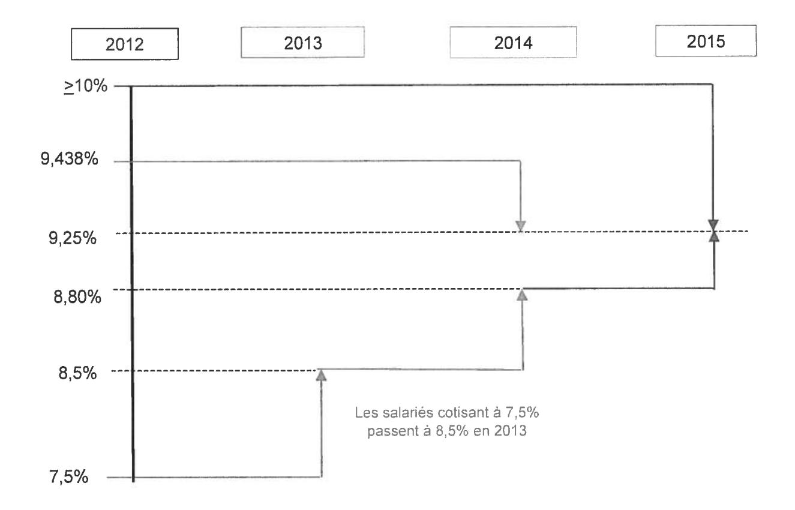
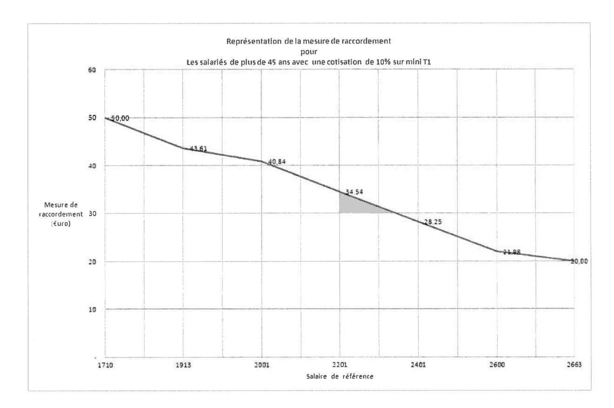

# ACCORD GROUPE SUR L'HARMONISATION DES TAUX DU REGIME DE RETRAITE COMPLEMENTAIRE ARRCO APPLICABLES AUX SALARIES DU GROUPE THALES

>[Télécharger le PDF](sources/groupe-2012-12-21-accord-groupe-sur-lharmonisation-des-taux-du-regime-de-retraite-complementaire-arrco-applicables-aux-salaries-du-groupe-thales.pdf)

## Préambule

Par la signature des accords sur le guichet unique en 2005 et sur les Dispositions sociales en 2006, le groupe Thales a souhaité harmoniser les règles applicables à l'ensemble de ses salariés en matière de retraite et de prévoyance.

Pour faire bénéficier l'ensemble des salariés (mensuels et ingénieurs et cadres) des mêmes modalités d'acquisition des droits à la retraite ARRCO, les parties signataires du présent accord reconnaissent la nécessité d'aboutir à un taux de cotisation unique.

## Article 1 / Champ d'application

Le présent accord Groupe s'applique à l'ensemble de sociétés françaises du Groupe dont le capital est détenu directement ou indirectement à plus de 50% par Thales et à celles, détenues à 50% au plus, sous réserve que Thales y exerce une influence dominante au sens de l'article L.2331-1 du Code du Travail (cf annexe 1 et 1bis).

Compte tenu de l'évolution du Groupe Thales, le périmètre en vigueur lors de la signature de l'accord peut être amené à évoluer. Dans le cas de cession ou d'acquisition de sociétés de plus de 1000 salariés, les parties conviennent de se revoir pour examiner s'il convient de modifier le présent taux. Si des sociétés de moins de 1000 salariés intègrent ou sortent du périmètre actuel du groupe, le taux défini dans le présent accord reste en vigueur.

## Article 2 / Harmonisation des taux de cotisation ARRCO 

### Article 2.1 : Harmonisation des taux ARRCO

- Les parties signataires conviennent, d'appliquer, à l'issue d'une période de deux ans, soit en 2015, un taux de cotisation ARRCO unique dans l'ensemble des sociétés relevant du périmètre du Groupe Thales, pour tous les salariés.
- En accord avec le GIE AGIRC/ARRCO, le groupe Thales appliquera donc un taux contractuel unique de cotisation ARRCO de 7,40 %. Ce taux contractuel est appelé à 125% par le GIE AGIRC/ARRCO conformément à la règlementation actuelle, soit un taux appliqué de 9,25% (désigné taux cible dans le présent document). Le taux contractuel unique ne pourra être modifié qu'avec l'accord de l'ensemble des signataires du présent accord ou à la demande du GIE AGIRC/ARRCO.
- Les signataires conviennent de répartir les cotisations de la manière suivante : part patronale 60%, part salariale 40%.

#### Répartition des cotisations

| Catégories          | ARRCO T1* Taux contractuel | ARRCO T1* Taux appelé |
|---------------------|----------------------------|--------------------------|
| Tout salarié Thales | 7.40 %                     | 9.25%                    |
| Part Salariale      | 2.96 %                     | 3.70 %                   |
| Part Patronale      | 4.44 %                     | 5.55 %                   |

\* T1 : tranche du salaire limité au Plafond Mensuel de la Sécurité Sociale (3031 euros en 2012)

### Article 2.2. : Mesures transitoires

L'application de ce nouveau taux peut avoir pour effet de modifier les cotisations à verser, tant pour les salariés que pour l'employeur. Aussi, afin de faciliter le ralliement au taux cible de 9.25 pour les salariés des sociétés qui aujourd'hui cotisent à un taux différent, un ralliement sur trois exercices (2013, 2014, 2015) sera retenu.

### Article 2.3. : Calendrier d'harmonisation

- Pour les salariés des sociétés dont le taux appelé est supérieur à 9,5 le basculement au taux cible se réalisera en 2015 (pave de décembre 2014)
- Pour les salariés des sociétés dont le taux appelé est compris entre > 9.25 et <9.5. le basculement au taux cible s'effectuera en 2014 (paye de décembre 2013)
- Pour les salariés des sociétés dont le taux appelé est compris entre > 8.50 et <8.8 et, le ralliement s'effectuera sur les deux prochaines années de la manière suivante :
- Taux de 8.80% en 2014 (paye de décembre 2013).
- Atteinte du taux cible de 9.25 en 2015 (paye de décembre 2014),
- Pour les salariés des sociétés dont le taux appelé est compris entre 7,5 et <8.50, le</li> ralliement s'effectuera sur les trois prochaines années de la manière suivante :
  - ⇒ Taux de 8.50% en 2013 (paye de décembre 2012)
  - ⇒ Taux de 8.80% en 2014 (paye de décembre 2013).
  - ⇒ Atteinte du taux cible de 9.25 en 2015 (paye de décembre 2014),
- Pour les salariés des sociétés dont le taux de cotisations ARRCO est ≥ à 10% et dont l'assiette de cotisation est basée sur le salaire dans la limite du PMSS, l'harmonisation ARRCO s'accompagnera pour l'intégration de 5 euros mensuels dans le salaire de base des salariés concernés pour les années 2015-2016-2017.

Ce calendrier est décrit en annexe 2.

### Article 2.4.: Principes d'harmonisation

#### 2.4.1 Règles de ralliement de la répartition des cotisations employeurs / salariés 2.4.1:

- Pour les catégories de salariés pour lesquelles la répartition des cotisations entre employeur et salarié n'est pas conforme à la réglementation (60% employeur, 40% salarié), le ralliement à une répartition 60% employeur, 40% salarié s'effectuera en janvier 2013 (paie de décembre 2012). La mise en conformité de cette répartition sera prise en charge intégralement par la société concernée.
- L'ensemble des salariés intégrant une société relevant du périmètre du groupe (recrutement ou mobilité inter-société) à compter de la signature de l'accord, se verront appliquer le taux cible de 9.25 dès janvier 2013.
- En cas de cession partielle ou totale d'activité, les salariés ne pourront prétendre au taux transitoire ou cible de l'accord.
- L'ensemble des contrats d'alternance (apprentissage, professionnalisation, CIFRE, ...) se verront appliquer le taux de 9,25 % à compter du 1 janvier 2013.

#### 2.4.2  Modalités de ralliement au taux cible de 9.25 en 2015

Pour accompagner cette harmonisation d'un taux ARRCO pour l'ensemble du Groupe Thales, il est prévu pour les trois années, les modalités de ralliement suivantes :

- Pour les salaires de base inférieurs ou égaux à 2200 euros mensuels, intégration à 100% dans le salaire de base, de la surcotisation salariale
- Pour les salaires de base compris entre 2201 euros mensuels et le PMSS de l'année en cours (3031 euros en 2012), intégration dans le salaire de base à hauteur de 60%, de la surcotisation salariale
- Pour les salaires de base supérieurs au PMSS de l'année en cours (3031 en 2012), intégration dans le salaire de base, à hauteur de 30% de la surcotisation salariale
- Les modalités d'accompagnement de cette harmonisation seront à réaliser sur la paie du mois au cours duquel interviendra le changement de taux ou d'assiette de cotisation.

#### 2.4.3 : Harmonisation de l'assiette de cotisations

- L'assiette mensuelle des cotisations ARRCO retenue au 1er Janvier 2013, est le salaire brut, dans la limite d'un PMSS. Cette harmonisation de l'ensemble des assiettes qui étaient utilisées précédemment dans le Groupe, sera effective au 1er Janvier 2013, applicable sur la paie de décembre 2012 (paie décalée).
- Pour les salariés qui cotisaient sur une assiette mini PMSS à 10% et dont l'âge est ≥ à 45 ans, des actions particulières seront menées afin de prendre en compte l'application des nouvelles mesures. Pour ce faire, il sera intégré, en fonction du salaire de base des salariés concernés, une somme comprise entre 50 et 20 euros, dans le salaire de base (cf. Annexe 3).
- Pour les salariés dont le taux de cotisation ARRCO représentait 7.5% basé sur le PMSS, et dont l'âge est supérieur ou égal à 45 ans, intégration de 35 euros dans le salaire de base.

Les modalités d'accompagnement de cette harmonisation seront effectuées sur la paye du mois de Janvier 2013 avec effet rétroactif à la date du changement de taux ou d'assiette de cotisation.

## Article 3 / Entrée en vigueur du présent accord

Le présent accord, conclu pour une durée indéterminée, entrera en vigueur le 31 décembre 2012. Cet accord est un accord groupe qui vaut accord d'entreprise.

Les dispositions prévues par le présent accord s'appliquent directement dans les sociétés du groupe et se substituent de plein droit à l'ensemble des dispositions conventionnelles (société, groupe), usages et engagements unilatéraux en vigueur portant sur le même objet.

Le comité central d'entreprise de Thales SA a été informé et consulté sur le projet d'accord préalablement à sa signature.

Chaque comité d'entreprise ou comité central d'entreprise des sociétés relevant du périmètre du groupe a été informé et consulté.

## Article 4 / Dispositions finales

Conformément aux dispositions légales et conventionnelles en vigueur, le texte du présent accord sera notifié à l'ensemble des organisations syndicales représentatives au niveau du groupe et déposé par la Direction des Ressources Humaines du Groupe, en deux exemplaires, auprès de l'unité des Hauts de Seine de la Direction Régionale des Entreprises, de la Concurrence de la Consommation, du Travail et de l'Emploi (DIRECCTE) d'île de France et en un exemplaire au secrétariat greffe du Conseil de Prud'hommes de Nanterre.

De plus, un exemplaire sera transmis à l'inspection du travail.

Fait à Neuilly-sur-Seine en 10 exemplaires le 20/12/2012

Pour la Société THALES représentée par le Directeur des Ressources Humaines du Groupe THALES, en sa qualité d'employeur de l'entreprise dominante : P. FOURNIE

Pour les organisations syndicales représentatives au niveau du Groupe, les coordinateurs syndicaux centraux

Pour la CFDT : Monsieur Didier GLADIEU

Pour la CFE-CGC : Monsieur Hervé TAUSKY

Pour la CFTC : Madame Véronique MICHAUT

Pour la CGT : Monsieur Laurent TROMBINI

## ANNEXE 1

### PERIMETRE D'APPLICATION DE L'ACCORD

| Dénomination sociale                                                   |
|------------------------------------------------------------------------|
| THALES AVIONICS ELECTRICAL MOTORS                                      |
| THALES AVIONICS ELECTRICAL SYSTEMS                                     |
| THALES AVIONICS LCD                                                    |
| THALES AVIONICS                                                        |
| THALES MICROELECTRONICS                                                |
| THALES SYSTEMES AEROPORTES                                             |
| ACSI                                                                   |
| GERIS CONSULTANTS                                                      |
| THALES S.A.                                                            |
| THALES ASSURANCES ET GESTION DES RISQUES                               |
| THALES GLOBAL SERVICES                                                 |
| THALES UNIVERSITE                                                      |
| THALES INTERNATIONAL                                                   |
| THALES PROPERTY SERVICES                                               |
| SOCIETE DE CONSTRUCTIONS MECANIQUES A. PONS                            |
| THALES SAFARE                                                          |
| THALES UNDERWATER SYSTEMS                                              |
| THALES ALENIA SPACE France                                             |
| THALES SESO                                                            |
| THALES SERVICES                                                        |
| THALES TRAINING & SIMULATIONS                                          |
| THALES ELECTRON DEVICES                                                |
| TRIXELL                                                                |
| THALES GEODIS FREIGHT & LOGISTIC                                       |
| THALES AIR SYSTEMS.                                                    |
| THALES-RAYTHEON SYSTEMS COMPANY                                        |
| TDA ARMEMENTS SAS                                                      |
| ARISEM                                                                 |
| GERAC - Groupe d'Etudes et de Recherches Appliquées à la Compatibilité |
| THALES ANGENIEUX                                                       |
| THALES COMMUNICATIONS & SECURITE                                       |
| THALES CRYOGENIE                                                       |
| THALES OPTRONIQUE                                                      |

# ANNEXE 2 CALENDRIER D'HARMONISATION

## **ANNEXE 3**

