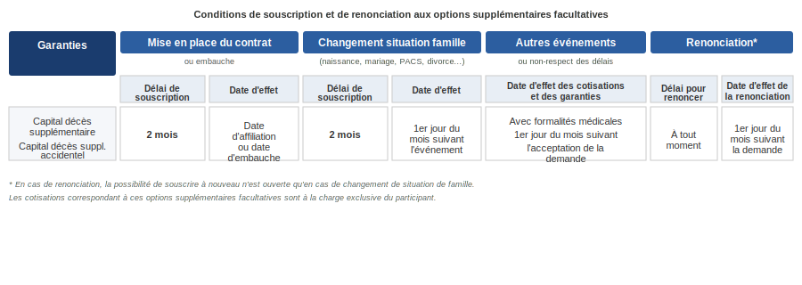

# ACCORD RELATIF AUX GARANTIES FRAIS DE SANTÉ ET PRÉVOYANCE DU GROUPE THALES

>[Télécharger le PDF](sources/groupe-2019-12-20-accord-relatif-aux-garanties-frais-de-sante-et-prevoyance-du-groupe-thales.pdf)

---

## Préambule

Depuis 2006, les salariés des sociétés du Groupe Thales bénéficient de garanties prévoyance et frais de santé responsable dans le cadre d'un dispositif collectif unique et obligatoire, répondant au souci de développer une protection sociale complète et uniforme pour l'ensemble des salariés du groupe, quelle que soit l'entreprise dont ils relèvent.

Ces régimes ont été étudiés afin :

- De pérenniser cette approche dans le contexte de l'intégration des nouvelles sociétés Thales DIS France, Thales DIS Design Services SAS et Ercom/Suneris au sein du Groupe au cours de l'année 2019 en France,
- D'améliorer les couvertures prévues au bénéfice de l'ensemble des salariés du Groupe, ainsi qu'une baisse de cotisation,
- De mettre en conformité les dispositifs avec les nouvelles dispositions législatives et réglementaires.

Les dispositifs formalisés dans le présent accord et dans le contrat d'assurance y afférent sont mis en œuvre conformément aux prescriptions des articles L242-1, L862-4, L871-1 et L911-7 du code de la sécurité sociale et de l'article 83,1° quater du code général des impôts ainsi que des décrets pris en application de ces dispositions.

---

## Section 1 : Dispositions communes à la santé et à la prévoyance

### 1.1 Objet de l'accord

Le présent accord définit la mise en place de garanties collectives obligatoires de remboursements de frais de santé et de garanties collectives obligatoires « incapacité, invalidité, décès » a pour objet d'organiser l'adhésion des salariés des sociétés relevant du groupe Thales aux contrats d'assurances collectives souscrits par le groupe auprès d'un ou plusieurs organismes habilités.

Le dispositif comprend :

- Des couvertures familiales collectives obligatoires santé prévoyance dans les conditions prévues par le présent accord ;
- Des couvertures gros risques facultatives pour les actifs et pour le maintien des garanties en sortie de groupe dans les conditions prévues par les différents contrats d'assurances et dans les notices d'information remises aux salariés.

Les régimes santé et prévoyance sont souscrits auprès de **Malakoff Humanis**. Conformément à l'article L.912-2 du code de la sécurité sociale, l'entreprise devra réexaminer le choix de l'organisme assureur désigné ci-dessus dans un délai qui ne pourra excéder cinq ans à compter de la date du présent accord. Cette disposition n'interdit pas, avant cette date, la modification du dispositif.

### 1.2 Portabilité

Les salariés dont le contrat est rompu garderont le bénéfice des garanties des régimes frais de santé responsable et prévoyance pendant leur période de chômage indemnisé en application des dispositions de l'article L.911-8 du code de la sécurité sociale dans les conditions et modalités prévues à cet article. Le financement du maintien de ces garanties est assuré par un système de mutualisation. Le coût correspondant est intégré dans les cotisations prévues aux articles 2.4 et 3.4 du présent accord.

### 1.3 Information

#### 1.3.1 Information individuelle

Chaque société du groupe remettra à chaque salarié et à tout nouvel embauché, les notices d'information détaillées, établies par l'organisme assureur pour chacun des contrats, résumant notamment les garanties et leurs modalités d'application.

Les salariés du groupe seront informés préalablement et individuellement, selon la même méthode, de toute modification de leurs droits et obligations.

#### 1.3.2 Information collective

Conformément à l'article R.2312-22 du code du travail, le comité social et économique central sera informé et consulté préalablement à toute modification des garanties.

### 1.4 Commission et convention de suivi

Le contrat de prévoyance mis en place par le présent accord sera suivi et examiné en commun pour toutes les questions relatives à ce régime au sein de la commission paritaire technique du Groupe Thales.

#### 1.4.1 Composition

La Commission est paritaire. Elle est composée de deux représentants par organisation syndicale représentative au niveau du Groupe et signataire du présent accord ainsi que d'un nombre égal de représentants de la Direction.

Le total des mandats sera réparti par moitié entre les organisations syndicales signataires et la Direction.

La répartition des mandats entre organisations syndicales signataires est effectuée en fonction des résultats obtenus aux dernières élections professionnelles intervenues au sein des sociétés comprises dans le périmètre de l'accord. Il sera fait application de la règle proportionnelle, avec la plus forte moyenne.

Les membres de la Commission sont désignés pour une durée de trois ans et le nombre de mandats n'est pas modifié pendant cette période, même en cas de remplacement.

Les décisions sont arrêtées au sein de la Commission à la majorité des 2/3ème des mandats.

#### 1.4.2 Attributions

Les missions de la Commission paritaire technique des régimes obligatoires sont les suivantes :

- Examiner toute modification des régimes existants et de proposer si nécessaire d'effectuer toute étude sur l'évolution des contrats frais de santé et prévoyance ainsi que leurs modalités de gestion.
- Examiner les propositions de modifications concernant le fonctionnement et le financement des contrats, souhaitées par ses membres.
- Examiner périodiquement (au minimum 1 fois par an) les comptes de résultats des contrats santé et prévoyance et la répartition des excédents et prendre toute décision concernant son fonctionnement et son financement en liaison avec le ou les organismes assureurs.
- Représenter les adhérents et les participants aux contrats de prévoyance et de frais de santé du groupe Thales et des filiales adhérentes dans les relations avec les organismes paritaires qu'ils soient gestionnaires ou assureurs.
- Effectuer tous les contrôles nécessaires au fonctionnement des contrats.
- Les garanties des contrats de prévoyance et de frais de santé relevant du présent accord sont établies en considération des conditions de la législation fiscale, sociale et de la Sécurité sociale en vigueur à la date du présent accord. Si ultérieurement ces conditions venaient à être modifiées, la commission paritaire en examinera les conséquences sur les contrats.
- Informer les salariés sur le fonctionnement des contrats et leurs résultats.
- Être associé au choix de l'organisme assureur désigné à l'article 1.1 du présent accord et en particulier des modalités d'organisation de la mutualisation des risques (articulation et montant des garanties couvertes, taux de cotisation, fonctionnement du régime).

Les Instances représentatives du Personnel au niveau Groupe des différentes sociétés donnent explicitement mandat à cette commission pour opérer les adaptations nécessaires en particulier en ce qui concerne les prestations, les taux de cotisations et les garanties en liaison avec le ou les organismes assureurs.

#### 1.4.3 Convention annuelle de suivi

Chaque année, une convention, organisée par la Direction du Groupe Thales, composée d'un maximum de 10 représentants par organisation syndicale représentative au niveau du groupe se réunira pour être informée et échanger sur l'application du dispositif dans les sociétés.

### 1.5 Participation aux résultats du contrat

Les éléments des comptes de résultats santé et prévoyance doivent prévoir une répartition des excédents et la constitution d'une provision d'égalisation en prévoyance et d'une réserve générale.

Le solde (positif ou négatif) de la réserve constituée au 31 décembre de l'exercice précédant la mise en œuvre du contrat relevant du présent accord sera transféré dans ce contrat.

Les dispositions figurent dans le contrat signé entre l'organisme assureur et le Groupe THALES.

Le principe de consolidation des comptes intègre toutes les entreprises adhérentes à la présente convention.

### 1.6 Fonds social

En plus de l'accès au fonds social financé par l'institution de prévoyance, le budget de **50 000 euros annuels** dédié au fonds social Thales, prélevés sur le montant des réserves du régime est maintenu. Il est rappelé que le maintien du fonds social Thales au profit des salariés actifs et retraités de Thales, est conditionné à l'équilibre du régime frais de santé Thales. Ce fonds interviendra en complément de l'action sociale de l'institution de prévoyance.

Le fonds social Thales sera destiné à accompagner les salariés en grandes difficultés financières liées à des actes médicaux, paramédicaux, dettes, arriérés, situation sociale critique… et sera composé d'un représentant par organisation syndicale signataire et d'un représentant de la Direction. Le paiement de ces aides sera assuré par l'organisme assureur.

---

## Section 2 : Dispositif de remboursement des frais de santé

### 2.1 Salariés bénéficiaires

L'ensemble des salariés du groupe Thales tel que défini à l'article 4.1 du présent accord bénéficient d'un régime familial collectif obligatoire de frais de santé d'entreprise défini par le présent accord.

### 2.2 Adhésion et dispenses

L'adhésion à ce système de garanties des salariés visés à l'article 2.1 ci-dessus est obligatoire sans condition d'ancienneté.

Les salariés pourront se prévaloir des cas de dispenses d'adhésion d'ordre public prévus par les articles L.911-7 et L.911-7-1 du code de la sécurité sociale.

Par ailleurs, les salariés suivants peuvent être dispensés d'adhérer au régime :

- Les salariés bénéficiaires de la complémentaire santé solidaire en application des articles L.861-1 et suivants du code de la sécurité sociale (antérieurement salariés bénéficiaires d'une couverture complémentaire CMU-C en application de l'ancien article L.861-3 du code de la sécurité sociale et salariés bénéficiaires d'une aide à l'acquisition d'une complémentaire santé ACS en application de l'ancien article L.863-1 du code de la sécurité sociale). La dispense ne peut alors jouer que jusqu'à la date à laquelle les salariés cessent de bénéficier de cette aide.
- Les salariés couverts par une assurance individuelle de frais de santé au moment de l'embauche. La dispense ne peut alors jouer que jusqu'à échéance du contrat individuel.
- Les salariés qui bénéficient par ailleurs, y compris en tant qu'ayant droit, à condition de le justifier dans les quinze premiers jours suivant leur embauche ou au plus tard un mois avant le 1er janvier de chaque année, d'une couverture collective relevant de l'un des dispositifs suivants :
  - Couverture obligatoire au titre d'un dispositif de protection sociale complémentaire remplissant les conditions mentionnées au sixième alinéa de l'article L.242-1 du code de la sécurité sociale ;
  - Régime local d'assurance maladie du Haut-Rhin, du Bas-Rhin et de la Moselle ;
  - Régime complémentaire d'assurance maladie des industries électriques et gazières en application du décret n°46-1541 du 22 juin 1946 (CAMIEG) ;
  - Mutuelles des fonctions publiques dans le cadre des décrets n°2007-1373 du 19 septembre 2007 et n°2011-1474 du 8 novembre 2011 ;
  - Contrats d'assurance de groupe issus de la loi n°94-126 du 11 février 1994 relative à l'initiative et à l'entreprise individuelle (contrats « Madelin ») ;
  - Régime spécial de sécurité sociale des gens de mer (ENIM) ;
  - Caisse de prévoyance et de retraite des personnels de la SNCF (CPRPSNCF).

Les salariés qui souhaitent être dispensés d'adhésion en application de l'un des cas de dispense, devront en faire la demande par écrit auprès de l'employeur en produisant les justificatifs nécessaires. A défaut, ils seront obligatoirement affiliés au régime.

### 2.3 Garanties

Les garanties telles qu'en vigueur à la date de prise d'effet du présent régime sont résumées, à titre d'information, dans le document joint à l'annexe 2. Elles relèvent de la seule responsabilité de l'organisme assureur tout comme les modalités, limitations et exclusions de garantie.

### 2.4 Cotisations

#### 2.4.1 Taux et assiette des cotisations

La cotisation destinée au financement du régime est fixée en pourcentage du salaire à :

- **3,14%** de la tranche A
- **2,18%** de la tranche B

Pour information, la tranche A correspond au salaire jusqu'à 1 plafond de la sécurité sociale et la tranche B, au salaire compris entre 1 et 4 plafonds de la sécurité sociale. Le plafond mensuel de la sécurité sociale est fixé chaque année par voie réglementaire.

La cotisation ouvre droit au bénéfice des garanties pour le salarié et ses ayants droit, tels que définis dans le contrat d'assurance et la notice d'information remise aux salariés qui sont affiliés à titre obligatoire.

L'assiette des cotisations pour le personnel travaillant à temps partiel est calculée sur le salaire réel.

#### 2.4.2 Répartition

Les cotisations servant au financement du contrat d'assurance seront prises en charge par l'entreprise et par les salariés dans les proportions suivantes :

- **Salariés affiliés à l'AGIRC :**
  - Part employeur : 50%
  - Part salarié : 50%
- **Salariés non-affiliés à l'AGIRC :**
  - Part employeur : 55%
  - Part salarié : 45%

#### 2.4.3 Cotisation pour les ayants droit d'un salarié décédé (art 30.4 avenant 11)

Les ayants droit du participant décédé en activité bénéficient de la garantie Frais de santé des actifs pendant 12 mois, et ceci à compter du jour du décès du participant, sauf demande contraire expresse des ayants droit (demande écrite en recommandé avec accusé réception). La possibilité de ce maintien concerne uniquement les ayants droit du participant décédé affilié sur le contrat des Actifs.

Durant la période de maintien de 12 mois, le montant de la cotisation est du même niveau que la cotisation du mois précédant le décès et THALES continue à participer au financement du régime à hauteur de la répartition au moment du décès du participant.

La cotisation est calculée sur le salaire de base du mois précédant le décès du salarié (salaire de base uniquement, à l'exclusion de la prise en compte du 13ème mois, de la prime d'ancienneté ou de la rémunération variable, ou de toute prime).

#### 2.4.4 Modification de l'économie du régime

Il est expressément convenu que l'obligation de l'employeur se limite au seul paiement de la part patronale de la cotisation mentionnée ci-dessus pour son montant et son taux arrêtés ci-dessus.

En conséquence en cas de déséquilibre du régime, dû notamment à un changement de législation ou à un mauvais rapport sinistre à prime, l'obligation de l'employeur sera limitée au paiement de la cotisation ci-dessus.

Toute modification du taux de cotisation fera l'objet d'une nouvelle négociation entre les partenaires sociaux.

A défaut d'avenant au présent accord, les garanties seront réduites proportionnellement par l'organisme assureur de telle sorte que le budget des cotisations défini suffise au financement du dispositif.

### 2.5 Dispositions spécifiques aux retraités du groupe Thales

La Direction de Thales et les organisations syndicales décident d'instaurer un système de solidarité intergénérationnel permettant aux salariés du Groupe d'opter pour l'un des deux régimes « Bigorre » ou « Vanoise » proposés par le Groupe Malakoff Humanis lors de leur départ en retraite.

Ils bénéficieront, pendant une période de cinq ans courant à partir de leur adhésion à l'un des deux régimes, d'un allègement de leurs cotisations frais de santé sur les régimes « Bigorre » et « Vanoise » proposés par le groupe Malakoff Humanis.

Le bénéfice de cet allègement est accordé à la condition exclusive que le salarié, sous contrat de travail Thales au moment de son départ en retraite, adhère, dans les trois mois qui suit sa liquidation de retraite, à l'un des deux régimes « Vanoise » ou « Bigorre ».

Le montant mensuel de l'allègement tient compte de l'option choisie dans le cadre des contrats « Bigorre » ou « Vanoise » individuel ou familial, soit :

**Pour tous les salariés étant partis en retraite avant le 1er janvier 2019 :**

- 60 euros par mois pour un contrat individuel
- 90 euros par mois pour un contrat familial

**Pour tous les salariés partis en retraite depuis le 1er janvier 2019 et postérieurement :**

**Pour le Régime Vanoise :**

| | 1ère année | 2ème année | 3ème année | 4ème année | 5ème année |
|---|---|---|---|---|---|
| Individuelle | 110 euros | 85 euros | 60 euros | 35 euros | 10 euros |
| Familiale | 160 euros | 125 euros | 90 euros | 55 euros | 20 euros |

**Pour le Régime Bigorre :**

| | 1ère année | 2ème année | 3ème année | 4ème année | 5ème année |
|---|---|---|---|---|---|
| Individuelle | 95 euros | 90 euros | 70 euros | 35 euros | 10 euros |
| Familiale | 160 euros | 125 euros | 90 euros | 55 euros | 20 euros |

En cas de décès du retraité au cours de la période considérée, la cotisation du conjoint, si ce dernier maintient sa couverture santé dans l'un des deux régimes précités, continuera à bénéficier de cet allègement.

L'allègement de cotisations sera financé par un prélèvement sur la réserve « mise à disposition du régime » résultant du contrat de prévoyance Thales. Ce prélèvement annuel sera versé dans une réserve dite « réserve spéciale », gérée par le Groupe Malakoff Humanis, qui effectuera les allègements de cotisations correspondant pour chaque nouvel assuré retraité relevant des contrats « Bigorre » ou « Vanoise ».

Dans ce cadre, il sera proposé à la réunion de la commission paritaire technique de constituer une réserve spéciale définie pour les régimes « Bigorre » ou « Vanoise » afin de permettre la mise en place du dispositif de solidarité intergénérationnelle.

Sous réserve d'une éventuelle évolution de la réglementation, le maintien de cette modalité de solidarité sera conditionné à l'équilibre du dispositif afin d'en garantir sa pérennité. Pour ce faire, la Commission paritaire technique veillera à ce que le montant de la réserve à disposition du régime ne puisse pas être inférieur à une couverture du risque représentant au minimum 14 mois de la cotisation décès.

Afin de suivre, année par année, l'évolution de la « réserve spéciale », la Commission paritaire technique prévue par l'article 1.5 du présent accord, examinera les résultats du contrat ainsi que le niveau de la réserve « mise à disposition du régime » et l'évolution de la « réserve spéciale ». La commission paritaire se réunira pour prendre l'ensemble des dispositions nécessaires au cas où le taux de couverture du risque précité serait susceptible d'être atteint ou en cas d'évolution des couvertures complémentaires santé proposés pour les régimes « Bigorre » ou « Vanoise ».

Ainsi, dès lors que les critères de risques décrits ci-dessus seraient atteints, la commission prendra chaque année l'ensemble des dispositions nécessaires pour modifier ou arrêter le dispositif de solidarité intergénérationnelle ou examiner d'autres évolutions.

### 2.6 Maintien des garanties en cas de suspension du contrat de travail

Dans les cas de suspension du contrat de travail donnant lieu à un maintien total ou partiel de rémunération par l'employeur ou sans rémunération, ou versement d'indemnités journalières complémentaires financées au moins pour partie par l'employeur, qu'elles soient versées directement par l'employeur ou pour son compte par l'intermédiaire d'un tiers (maladie, maternité, congés sans solde, CET, etc.), la suspension du contrat de travail n'entraîne pas la suspension du bénéfice des régimes frais de santé pour le salarié concerné.

Ainsi, les garanties frais de santé sont maintenues à titre gratuit pour les salariés ne percevant plus de salaire et bénéficiant, au titre du présent accord, des indemnités d'incapacité temporaire de travail ou d'invalidité et à conditions que le régime frais de santé soit souscrit auprès du même organisme assureur.

---

## Section 3 : Dispositif de prévoyance

### 3.1 Salariés bénéficiaires

L'ensemble des salariés du groupe Thales tel que défini à l'article 4.1 du présent accord bénéficient d'un régime collectif de prévoyance d'entreprise déterminé par le présent accord.

### 3.2 Adhésion

L'adhésion à ce système de garanties des salariés visés à l'article 2.1 ci-dessus est obligatoire sans condition d'ancienneté.

### 3.3 Garanties

Les garanties telles qu'en vigueur à la date de prise d'effet du présent régime sont résumées dans le document joint à l'annexe 3. Toutefois, elles ne constituent pas un engagement pour l'entreprise qui n'est tenue qu'au seul paiement des cotisations et, a minima, au respect de ses obligations légales et conventionnelles en la matière. Elles relèvent, en conséquence de la seule responsabilité de l'organisme assureur tout comme les modalités, limitations et exclusions de garantie.

### 3.4 Cotisations

#### 3.4.1 Taux et assiette des cotisations et répartition

| | Ensemble du personnel non affilié à l'AGIRC | | | Ensemble du personnel affilié à l'AGIRC | | |
|---|---|---|---|---|---|---|
| | **Taux global** | **Part salariale** | **Part patronale** | **Taux global** | **Part salariale** | **Part patronale** |
| **RISQUE DÉCÈS** | | | | | | |
| Tranche A | 0,760% | 0,260% | 0,500% | 0,760% | 0,000% | 0,760% |
| Tranche B | 0,048% | 0,020% | 0,028% | 0,048% | 0,048% | 0,000% |
| Tranche C | | | | 0,616% | 0,616% | 0,000% |
| **RISQUE INCAPACITÉ/INVALIDITÉ** | | | | | | |
| Tranche A | 0,740% | 0,240% | 0,500% | 0,740% | 0,000% | 0,740% |
| Tranche B | 0,632% | 0,280% | 0,352% | 0,632% | 0,632% | 0,000% |
| Tranche C | | | | 1,134% | 1,134% | 0,000% |
| **TOTAL** | | | | | | |
| Tranche A | 1,500% | 0,500% | 1,000% | 1,500% | 0,000% | 1,500% |
| Tranche B | 0,680% | 0,300% | 0,380% | 0,680% | 0,680% | 0,000% |
| Tranche C | | | | 1,750% | 1,750% | 0,000% |

Pour information, la tranche A correspond au salaire jusqu'à 1 plafond de la sécurité sociale, la tranche B, au salaire compris entre 1 et 4 plafonds de la sécurité sociale et la tranche C au salaire compris entre 4 et 8 plafonds de la sécurité sociale. Le plafond mensuel de la sécurité sociale est fixé chaque année par voie réglementaire.

#### 3.4.2 Assiette de cotisation pour les salariés ne travaillant pas à temps plein

L'assiette des cotisations pour le personnel travaillant à temps partiel, temps réduit, temps choisi ou bénéficiaires de formules diverses de réduction du temps de travail sera la suivante :

- **DÉCÈS :**
  - **Gros risques régime obligatoire :** cotisation calculée sur le salaire temps plein sauf si le salarié ne le souhaite pas, dans ce cas l'assiette du salaire réel sera appliquée.
  - **Options complémentaires facultatives :** le principe retenu est le même que pour le régime obligatoire sauf pour les garanties rente de conjoint (options fermées) pour lesquelles le salarié cotise obligatoirement sur son salaire temps plein.

- **Incapacité — Invalidité :** Cotisation calculée sur le salaire réellement perçu par le salarié au titre de son activité à temps partiel.

#### 3.4.3 Pilotage du régime

Il est expressément convenu que l'obligation de l'employeur se limite au seul paiement de la part patronale de la cotisation mentionnée ci-dessus pour son montant et son taux arrêtés ci-dessus.

En conséquence en cas de déséquilibre du régime, dû notamment à un changement de législation ou à un mauvais rapport sinistre à prime, l'obligation de l'employeur sera limitée au paiement de la cotisation ci-dessus.

Toute modification du taux de cotisation fera l'objet d'une nouvelle négociation entre les partenaires sociaux.

A défaut d'avenant au présent accord, les garanties seront réduites proportionnellement par l'organisme assureur de telle sorte que le budget des cotisations défini suffise au financement du dispositif.

### 3.5 Revalorisation des rentes en cours de service

Conformément à l'article L.912-3 du code de la sécurité sociale, les rentes en cours de service à la date de changement d'organisme assureur (y compris les prestations décès prenant la forme de rente), continueront à être revalorisées. Les garanties décès seront également maintenues au profit des bénéficiaires de rentes d'incapacité de travail ou d'invalidité lors de la résiliation du contrat d'assurance, étant précisé que la revalorisation des bases de calcul des prestations décès devra être au moins égale à celle prévue par le contrat résilié. Lors du changement d'organisme assureur, l'employeur s'engage à organiser la prise en charge des obligations ci-dessus définies, soit par l'organisme dont le contrat a été résilié, soit par le nouvel organisme assureur.

### 3.6 Maintien des garanties à titre onéreux

La garantie « décès » est maintenue pendant un mois pour les salariés qui ne bénéficiaient pas de la portabilité dans les conditions de l'article 1.2 du présent accord. La cotisation (ventilée part patronale/part salariale) est prélevée sur le dernier bulletin de salaire.

### 3.7 Maintien des garanties en cas de suspension du contrat de travail

Dans les cas de suspension du contrat de travail donnant lieu à un maintien total ou partiel de rémunération par l'employeur ou sans rémunération, ou versement d'indemnités journalières complémentaires financées au moins pour partie par l'employeur, qu'elles soient versées directement par l'employeur ou pour son compte par l'intermédiaire d'un tiers (maladie, maternité, congés sans solde, CET, etc.), la suspension du contrat de travail n'entraîne pas la suspension du bénéfice du régime de prévoyance pour le salarié concerné.

Dans cette hypothèse, l'employeur maintiendra ses différentes contributions conformément à l'article 3.4 du présent accord. Le salarié devra acquitter la part salariale des cotisations calculée selon les règles prévues par le présent accord.

Les garanties décès sont maintenues à titre gratuit pour les salariés ne percevant plus de salaire et bénéficiant, au titre du présent accord, des indemnités incapacité temporaire de travail ou invalidité prévues par le régime de prévoyance.

Il est rappelé en outre que, en application et sous les conditions des articles 7 et 7-1 de la loi n°89-1009 du 31 décembre 1989, la résiliation du contrat est sans effet sur la poursuite de l'indemnisation ou en cas de survenance du décès avant le terme de la période d'incapacité de travail ou d'invalidité telle que définie dans le contrat.

---

## Section 4 — Fonctionnement du présent accord

### 4.1 Périmètre de l'accord

Le présent accord est applicable dans l'ensemble des entités relevant du périmètre du groupe tel que défini à l'annexe 1 conformément à l'article L.2232-30 du code du travail.

En cas d'intégration d'une nouvelle société française au sein du groupe Thales, les parties signataires s'engagent, dans un délai de six mois et sous réserve de l'adaptation des dispositions conventionnelles en vigueur dans cette société, à conclure un avenant formalisant l'entrée de celle-ci dans le périmètre de l'accord.

### 4.2 Durée de l'accord

L'accord est conclu pour une durée indéterminée et prend effet le **1er janvier 2020**.

Il substitue toutes les dispositions résultant d'accords collectifs, d'accords ratifiés à la majorité des intéressés, de décisions unilatérales ou de toute autre pratique en vigueur dans les entreprises rentrant dans le périmètre du groupe tel que défini à l'article 1.4 du présent accord.

### 4.3 Révision

Le présent accord pourra, à tout moment, être modifié ou dénoncé en respectant la procédure prévue respectivement par les articles L.2222-5, L.2222-6 et L.2261-7 à L.2261-13 du code du travail.

Conformément aux articles L.2222-5 et L.2261-7-1 du code du travail, sont habilités à engager la procédure de révision du présent accord :

- Jusqu'à la fin du cycle électoral au cours duquel cet accord a été conclu, une ou plusieurs organisations syndicales de salariés représentatives dans le champ d'application de l'accord et signataires ou adhérentes de cet accord ;
- A l'issue de cette période, une ou plusieurs organisations syndicales de salariés représentatives dans le champ d'application de l'accord.

Elle sera notifiée par lettre recommandée avec avis de réception aux autres syndicats représentatifs dans le champ d'application de l'accord.

L'ensemble des partenaires sociaux se réunira alors dans un délai d'un mois à compter de la réception de cette demande afin d'envisager l'éventuelle conclusion d'un avenant de révision.

L'éventuel avenant de révision se substituera de plein droit aux dispositions du présent accord qu'il modifiera.

### 4.4 Dénonciation

Conformément aux articles L.2222-6 et L.2261-9 et suivants du code du travail, les parties signataires du présent accord ont également la possibilité de le dénoncer moyennant un préavis de trois mois.

La dénonciation par l'une des parties signataires doit être notifiée par lettre recommandée avec avis de réception aux autres signataires et faire l'objet d'un dépôt conformément à l'article L.2261-9 du code du travail. Une nouvelle négociation s'engage, à la demande d'une des parties intéressées, dans les trois mois qui suivent le début du préavis. Elle peut donner lieu à un accord, y compris avant l'expiration du délai de préavis.

L'accord dénoncé continue donc à produire effet jusqu'à l'entrée en vigueur du nouvel accord qui lui est substitué ou, à défaut, pendant une durée d'un an à compter de l'expiration du préavis de trois mois. En tout état de cause et sauf accord contraire des parties, y compris de l'organisme assureur, la dénonciation ne pourra avoir d'effet qu'à l'échéance de la convention d'assurance collective.

La résiliation, par l'organisme assureur, du contrat ci-après annexé, entraînera de plein droit la caducité du présent accord par disparition de son objet.

### 4.5 Dépôt de l'accord

Conformément aux dispositions législatives et réglementaires en vigueur, le texte du présent accord sera notifié à l'ensemble des Organisations syndicales représentatives au niveau du Groupe et déposé par la Direction des Ressources Humaines du Groupe sous forme électronique, en un exemplaire PDF signé et un exemplaire sous format Word anonymisé, sur la plateforme de téléprocédure du ministère du travail et en un exemplaire au Secrétariat du Greffe du Conseil des Prud'hommes de Nanterre.

---

Fait à Courbevoie, en 6 exemplaires, le **20 décembre 2019**

**Pour la Société Thales :** Pierre GROISY, Directeur des Ressources Humaines France du Groupe, en sa qualité d'employeur de l'entreprise dominante.

**Pour les Organisations Syndicales représentatives au niveau du Groupe, les coordonnateurs syndicaux centraux :**

| CFDT | CFE-CGC | CFTC | CGT                   |
|------|---------|------|-----------------------|
| Anne COGNIEUX | José CALZADO | Véronique MICHAUT | P.O. Laurent TROMBINI |

**Reserve CFDT:** La CFDT est signataire de cet accord, sous réserve que les descriptions des couvertures Décès/Incapacité/Invalidité soient portées dans les notices Malakoff Humanis, et sous réserve que la mise en place de l'accord surcomplémentaire santé ne remette pas en cause la qualification responsable du contrat santé de base.

---

## Annexe 1 — Périmètre d'application de l'accord

### GBU AVS
- Thales AVS France SAS
- Thales Avionics Electrical Motors SAS
- Thales Avionics Electrical Systems SAS
- Trixell

### GBU DMS
- Thales DMS France SAS
- UMS SAS

### GBU LAS
- Thales LAS France SAS

### GBU SIX
- Gerac SAS
- Thales SIX GTS France SAS
- Thales Services SAS
- RCS France SAS
- Ercom
- Suneris

### GBU ESPACE
- Thales Alenia Space SAS
- Thales Seso SAS

### GBU DIS
- Thales DIS France SA
- Thales DIS DESIGN SERVICES SAS

### Entités Corporate
- Thales S.A.
- Thales International SAS
- Geris Consultants SAS
- Thales Global Services SAS
- Thales Digital Factory SAS

---

## Annexe 2 — Résumé des garanties frais de santé

*Résumé des garanties frais de santé auquel se substituera la notice d'information une fois qu'elle aura été communiquée à l'employeur.*

## THALES — Ensemble du Personnel
### Contrat santé responsable obligatoire 2020
### GARANTIES SANTÉ / Régime Général à adhésion obligatoire

Les garanties ci-après s'appliquent dans le cadre du parcours de soins et dans les conditions et limites prévues aux conditions générales ou pour la garantie Assistance, dans la notice d'information. Dans tous les cas, les remboursements sont limités aux frais réels.

> **GARANTIES Y COMPRIS LES REMBOURSEMENTS DE LA SÉCURITÉ SOCIALE**
> *(sauf pour les forfaits en € ou PMSS qui viennent en complément des remboursements de la Sécurité sociale sauf en optique)*

### Hospitalisation chirurgicale et médicale (y compris maternité — secteur conventionné et non conventionné)

| Garantie | Régime Socle |
|---|---|
| Honoraires — DPTAM | 100 % FR |
| Honoraires — hors DPTAM | 200% BR |
| Frais de séjour | 100 % FR |
| Chambre particulière | 3,5% PMSS/jour |
| Frais d'accompagnant (enfant de moins de 12 ans) | 3,5% PMSS/jour |
| Forfait hospitalier | 100 % FR |
| Participation forfaitaire pour les actes coûteux | prise en charge |

### Soins de ville (secteur conventionné et non conventionné)

| Garantie | Régime Socle |
|---|---|
| Consultations et visites, généralistes — DPTAM | 250% BR |
| Consultations et visites, généralistes — hors DPTAM | 200% BR |
| Consultations et visites, spécialistes — DPTAM | 450% BR |
| Consultations et visites, spécialistes — hors DPTAM | 200% BR |
| Petite chirurgie et actes de spécialité — DPTAM | 100% FR |
| Petite chirurgie et actes de spécialité — hors DPTAM | 200% BR |
| Imagerie médicale et actes cliniques d'imagerie — DPTAM | 100% FR |
| Imagerie médicale et actes cliniques d'imagerie — hors DPTAM | 200% BR |
| Frais d'analyses et de laboratoire | 100% FR |
| Auxiliaires médicaux — Conventionnés | 100% FR |
| Auxiliaires médicaux — Non conventionnés | 95% FR (Mini : 100% BR) |
| Autre appareillage remboursé par la SS (orthèses, semelles orthopédiques, ceintures lombaires, bas de contention, classe I, II et III…) | 450% BR |

### Aides auditives

| Garantie | Régime Socle |
|---|---|
| Équipement Prothèses auditives 100 % Santé (classe I) | sans reste à charge pour l'assuré |
| **Équipement Prothèses auditives autres que 100 % Santé (classe II)** | |
| Bénéficiaire jusqu'à 20 ans révolus ou atteint de cécité | 450% BR dans la limite de 1 700 €/oreille |
| Bénéficiaire à compter du 21e anniversaire | 450% BR dans la limite de 1 700 €/oreille |

### Pharmacie

| Garantie | Régime Socle |
|---|---|
| Pharmacie remboursée par la SS | 100 % BR ou TFR |

### Transport

| Garantie | Régime Socle |
|---|---|
| Transport remboursé par la SS | 100% FR |

### Frais d'optique

Un équipement (1 monture + 2 verres) tous les 2 ans, sauf en cas d'évolution de la vue ou pour les mineurs de moins de 16 ans (un équipement tous les ans). Remboursement maximum pour la monture de 100 €.

**Équipement 100 % Santé (classe A) :**

| Garantie | Régime Socle |
|---|---|
| Verres et montures (y compris l'examen de la vue par l'opticien) | sans reste à charge pour l'assuré |

**Équipement autre que 100 % Santé (classe B) :**

| Garantie | Régime Socle |
|---|---|
| (a) Équipement avec 2 verres simples | 420 € |
| (b) Équipement avec 1 verre simple (a) et un verre complexe (c) | 560 € |
| (c) Équipement avec 2 verres complexes | 700 € |
| (d) Équipement avec 1 verre simple (a) et un verre très complexe (f) | 610 € |
| (e) Équipement avec 1 verre complexe (c) et un verre très complexe (f) | 750 € |
| (f) Équipement avec 2 verres très complexes | 800 € |
| Lentilles remboursées par la SS | 100% BR + 12% PMSS/an/bénéficiaire |
| Lentilles non remboursées par la SS (y compris jetables) | 12% PMSS/an/bénéficiaire |
| Chirurgie réfractive (toute chirurgie des yeux) | 50% FR limité à 20% du PMSS/œil + en complément si restant à charge : 60% FR limité à 600 €/œil |

### Frais dentaires

**Soins et prothèses 100 % Santé :** sans reste à charge pour l'assuré

**Soins autres que 100 % Santé :**

| Garantie | Régime Socle |
|---|---|
| Soins dentaires remboursés par la SS (soins, endodontie, prophylaxie, parodontologie) | 470% BR |

**Prothèses autres que 100 % Santé :**

| Garantie | Régime Socle |
|---|---|
| Inlays-onlays remboursés par la SS à tarifs maîtrisés | 500% BR |
| Inlays-onlays remboursés par la SS à tarifs libres | 500% BR dans la limite des honoraires limites de facturation |
| **Prothèses dentaires remboursées par la SS à tarifs maîtrisés :** | |
| Couronnes, bridges et inter de bridges | 550% BR |
| Inlay-Cores | 370% BR |
| Couronnes sur implant | 550% BR |
| Prothèses dentaires amovibles | 550% BR |
| Réparations sur prothèses | 550% BR |
| Prothèses dentaires provisoires | 810% BR |
| **Prothèses dentaires remboursées par la SS à tarifs libres** *(dans la limite des honoraires limites de facturation)* **:** | |
| Couronnes, bridges et inter de bridges | 550% BR |
| Inlay-Cores | 370% BR |
| Couronnes sur implant | 550% BR |
| Prothèses dentaires amovibles | 550% BR |
| Réparations sur prothèses | 550% BR |
| Prothèses dentaires provisoires | 810% BR |
| **Prothèses dentaires non remboursées par la SS :** | |
| Couronnes | 18,6% du PMSS par acte |
| Bridges | 48,9% du PMSS par acte |
| Réparations (sauf les réparations à caractère esthétique) | 2,2% du PMSS par acte |
| Orthodontie remboursée par la SS | 550% BR |
| Orthodontie non remboursée par la SS -18 ans | 550% BR reconstituée |
| Orthodontie non remboursée par la SS +18 ans | 50% FR limité à 250% BR reconstituée |
| Parodontologie non remboursée par la SS | 50% FR limité à 10% du PMSS/an/personne |
| Endodontie non remboursée par la SS | 50% FR limité à 10% du PMSS/an/personne |
| **Implant** | 65% FR limité à 25% du PMSS/implant limité à 6/an/personne |
| → Implant | 65% FR limité à 15% du PMSS/implant limité à 6/an/personne |
| → Pilier implantaire | 65% FR limité à 10% du PMSS/pilier limité à 6/an/personne |
| Régénérescence osseuse (pose d'un implant) | 300 € par implant dans la limite de 40% PMSS/an/bénéficiaire |
| Radiologie non remboursée (pose d'un implant) | 100 € par implant/an/bénéficiaire |

### Autres soins

| Garantie | Régime Socle |
|---|---|
| Cure thermale remboursée par la SS : honoraires et soins | 12% PMSS/an/bénéficiaire |
| Analyses HN | 50% FR limité à 4% du PMSS/an/bénéficiaire + en complément si restant à charge : 60% FR limité 120 €/an/bénéficiaire |
| Radiologie HN | 50% FR limité à 4% du PMSS/an/bénéficiaire + en complément si restant à charge : 70% FR limité à 70 €/acte dans la limite de 300 €/an/bénéficiaire |
| Péridurale non prise en charge par la S.S. | 50% FR limité à 4% du PMSS/an/bénéficiaire |
| Psychomotricité, Psychothérapie et Psychologue | 50% FR limité à 7% du PMSS/an/bénéficiaire + en complément si restant à charge : 60% FR limité à 45 €/séance dans la limite de 450 €/an/bénéficiaire |
| Psychomotricité, Psychothérapie et Psychologue pour enfant | 50% FR limité à 7% du PMSS/an/bénéficiaire + en complément si restant à charge : 65% FR limité à 50 €/séance dans la limite de 950 €/an/bénéficiaire |
| Ostéopathie, Acupuncture, Chiropractie et Kinésithérapie méthode Mézières | 50% FR limité à 7% du PMSS/an/bénéficiaire + en complément si restant à charge : 70% FR limité à 50 €/séance dans la limite de 400 €/an/bénéficiaire |
| Étiopathie | 17% PMSS/an/bénéficiaire |
| Vaccins prescrits non remboursés par la SS | 100% FR |
| Traitement anti-tabac remboursé par la SS | 70% FR limité à 150 €/an/bénéficiaire |
| Pilules contraceptives non remboursées par la SS | 80% FR limité à 60 €/trimestre/bénéficiaire |
| Pédicurie (uniquement ongles incarnés et hallux-valgus) | 50% FR limité à 6 actes/an/bénéficiaire |
| Actes de prévention prévus à l'article R. 871-2 du CSS | 100% FR |

### Glossaire

- **BR (ou BRSS) :** Base de remboursement de la sécurité sociale
- **DPTAM :** Dispositif de Pratique Tarifaire Maîtrisée qui rassemble les dispositifs ayant pour objet la maîtrise des dépassements d'honoraires des professionnels de santé conventionnés (CAS, OPTAM, OPTAM-CO…)
- **FR :** Frais réels
- **MR :** Montant de remboursement
- **PMSS :** Plafond mensuel de la sécurité sociale
- **SS :** Sécurité Sociale
- **TFR :** Tarif forfaitaire de remboursement
- **TM :** Ticket modérateur

### Notes

1. En secteur non conventionné, les remboursements sont effectués sur la base du tarif d'autorité.
2. Les actes de prévention pris en charge sont : scellement prophylactique des puits, sillons et fissures ; un détartrage annuel complet ; bilan du langage oral/écrit (AMO24) pour enfant de moins de 14 ans ; dépistage de l'hépatite B ; dépistage des troubles de l'audition tous les 5 ans pour les +50 ans ; ostéodensitométrie (femmes +50 ans, tous les 6 ans) ; vaccinations (diphtérie, tétanos, polio, coqueluche, hépatite B, BCG, rubéole, Haemophilus influenzae B, etc.).
3. Définitions des verres : verre simple (sphère entre -6,00 et +6,00, cylindre < +4,00) ; verre complexe (hors zone simple ou multifocal/progressif) ; verre très complexe (multifocal/progressif sphéro-cylindrique hors zone -8,00/+8,00 ou sphérique hors zone -4,00/+4,00).

---

## Annexe 3 — Résumé des garanties prévoyance

*Résumé des garanties prévoyance auquel se substituera la notice d'information une fois qu'elle aura été communiquée à l'employeur.*

## THALES — Ensemble du Personnel
### Contrat prévoyance 2020
### GARANTIES PRÉVOYANCE / Régime Général à adhésion obligatoire

### Montant des prestations — Capital en cas de décès ou d'IAD

| Garantie | Option 1 — Capital seul | Option 2 — Capital + Rente éducation |
|---|---|---|
| **CAPITAL EN CAS DE DÉCÈS OU D'INVALIDITÉ ABSOLUE ET DÉFINITIVE (IAD)\*** | | |
| Célibataire, veuf, divorcé sans enfant à charge\*\* | 250 % | — |
| Marié ou lié par un PACS sans enfant à charge\*\* | 300 % | — |
| Célibataire, veuf, divorcé, marié, pacsé avec un enfant à charge\*\* | 360 % | 150 % |
| Majoration par enfant supplémentaire à charge | 60 % | — |
| Capital supplémentaire en cas de décès accidentel | + 200 % du salaire annuel brut | |
| Double effet (décès simultané du conjoint et du participant) | + 50 % des capitaux décès prévus pour l'option 1 | |
| Allocation pour frais d'obsèques (décès du participant, de son conjoint ou partenaire PACS, ou d'un enfant à charge\*\*) | 75 % du plafond mensuel de la Sécurité sociale\*\*\* | |

\* En cas d'IAD, versement anticipé du capital décès ou versement anticipé du capital décès et de la rente éducation.
\*\* En application de la définition des personnes à charge.
\*\*\* Plafond mensuel de la Sécurité sociale en vigueur au 1er janvier de l'année de survenance du décès.

### Rente éducation (Option 2 uniquement — par an et par enfant à charge)

| Tranche d'âge | Pourcentage du SAR |
|---|---|
| De 0 à moins de 11 ans | 10 % |
| De 11 à moins de 19 ans | 15 % |
| De 19 à moins de 21 ans (ou 26 ans si études) | 20 % |
| Enfant handicapé avant 25 ans le privant de toute possibilité d'exercer une activité rémunérée, sans limite d'âge | Maintien de la dernière rente à 20 % |

### Autres prestations (Options 1 et 2)

| Garantie | Montant |
|---|---|
| Rente Handicap (par an et par enfant handicapé) | 6 000 € annuels |
| Rente temporaire de conjoint | 8 % |

### Options complémentaires facultatives

Le participant peut choisir d'adhérer à une ou deux garanties supplémentaires.

La souscription de ces options supplémentaires facultatives décès peut être effectuée lors de la survenance des événements et selon les délais indiqués ci-après. Si ce délai est respecté, la souscription est acceptée sans formalité médicale. À défaut, des formalités médicales sont obligatoires et peuvent entraîner une acceptation avec effet différé, ou un refus.

**Conditions de souscription :**

| Événement | Délai de souscription | Date d'effet |
|---|---|---|
| Mise en place du contrat ou embauche | 2 mois | Date d'affiliation ou date d'embauche |
| Changement de situation de famille (naissance, adoption, mariage, PACS, divorce, dissolution PACS, enfant cessant d'être à charge) | 2 mois | 1er jour du mois suivant l'événement |
| Autres événements ou non-respect des délais | Avec formalités médicales | 1er jour du mois suivant l'acceptation de la demande |
| Renonciation | À tout moment | 1er jour du mois suivant la demande |

*En cas de renonciation, la possibilité de souscrire à nouveau n'est ouverte qu'en cas de changement de situation de famille.*

Les cotisations correspondant à ces options supplémentaires facultatives sont à la charge exclusive du participant.

**Montant des prestations — Capital décès supplémentaire facultatif :**

| Garantie | Pourcentage du SAR (TA/TB) |
|---|---|
| Capital décès toutes causes\* — Choix entre 4 options : | +100 %, +200 %, +300 % ou +400 % |
| Capital décès accidentel — Capital supplémentaire | +100 % |

\* Ce capital est majoré de 10 % par enfant à charge à due proportion du capital choisi dans la limite de 2 enfants.

### Montant des prestations — Incapacité temporaire de travail

Les indemnités journalières sont calculées en pourcentage du salaire journalier de base (1/30e du salaire mensuel de référence) et sont fonction de la situation de famille :

| Situation de famille | Pourcentage du salaire journalier de base |
|---|---|
| Sans enfant à charge\* | 80 % |
| Avec 1 enfant à charge\* | 85 % |
| Avec 2 enfants à charge\* | 90 % |
| Avec 3 enfants à charge\* | 95 % |

\* Enfants à charge tels que définis au moment de l'arrêt de travail et en cours d'indemnisation.

### Montant des prestations — Invalidité

| Situation de l'invalidité | Pourcentage du SAR |
|---|---|
| 1ère catégorie ou rente accident du travail (ou maladie professionnelle) d'un taux compris entre 33 % et 50 % | 60 % avec une majoration de 5 % par enfant à charge\* (maximum 3 enfants) |
| En cas de reprise d'activité à temps partiel | 75 % avec une majoration de 5 % par enfant à charge\* (maximum 3 enfants) |
| 2ème catégorie ou rente accident du travail (ou maladie professionnelle) d'un taux supérieur à 50 % | 80 % avec une majoration de 5 % par enfant à charge\* (maximum 3 enfants) |
| 3ème catégorie ou rente accident du travail (ou maladie professionnelle) avec allocation pour tierce personne | 100 % |

\* Enfants à charge tels que définis au moment de l'arrêt de travail et en cours d'indemnisation.

