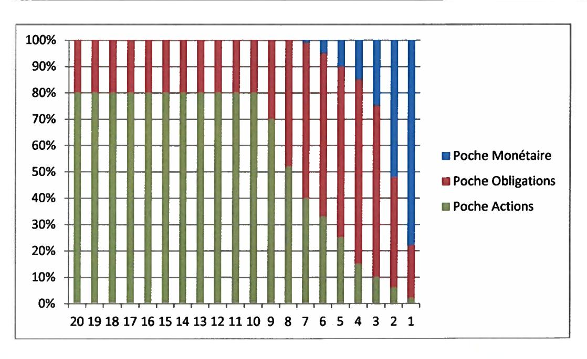

# ACCORD PORTANT TRANSFORMATION DU PERCO EN PLAN D'EPARGNE RETRAITE COLLECTIF (PERECO) ET REGLEMENT DUDIT PERECO

>[Télécharger le PDF](sources/groupe-2021-05-25-accord-portant-transformation-du-perco-en-plan-depargne-retraite-collectif-pereco-et-reglement-dudit-pereco.pdf)

## **PREAMBULE**

Aux termes de l'Accord sur les dispositions sociales applicables aux salariés du Groupe THALES et de son avenant n°1, tous deux signés le 23 novembre 2006, les partenaires sociaux et la Direction du Groupe ont prévu la mise en place d'un plan d'épargne retraite collectif (PERCO).

Un accord portant règlement du Plan d'Epargne pour la Retraite Collectif (PERCO) du Groupe THALES a été conclu le 17 octobre 2007 entre THALES et les organisations syndicales représentatives signataires de l'avenant n°1 de l'accord sur les dispositions sociales.

Cet accord avait pour objet de permettre aux collaborateurs de la société THALES SA et de l’ensemble des
sociétés filiales détenues directement ou indirectement à plus de 50% (ci-après « le Groupe ») de bénéficier
d’un dispositif d’épargne d’une durée plus longue que le Plan d’Epargne Groupe THALES déjà existant.

Cet accord a été modifié par les quatre (4) avenants suivants (ci-après dénommés les « Avenants »)
- Avenant 1, lui-même modifié par son Avenant 1, tous deux signés le 29 mars 2011
- Avenant 2 signé le 27 juin 2012
- Avenant 3 signé le 20 mai 2016
- Avenant 4 signé le 29 juin 2018

La loi n°2019-486 du 22 mai 2019 relative à la croissance et à la transformation des entreprises (dite Loi « Pacte »), complétée par l'ordonnance n°2019-766 du 22 juillet 2019 portant réforme de l'Epargne retraite et par le décret n°2019-807 du 30 juillet 2019, ont apporté un certain nombre de modifications des dispositifs d'épargne retraite notamment en supprimant les PERCO et en les remplaçant par des Plans d'Epargne Retraite d'Entreprise Collectif (PERECO).

Les signataires de l'accord du 17 octobre 2007 ont constaté que les caractéristiques du PERCO étaient conformes à celles requises pour le PERECO. Ils ont néanmoins souhaité procéder par voie d'accord pour representations.

Le présent accord emporte institution du PERECO par transformation du PERCO.

Par ailleurs, les signataires ont souhaité permettre aux salariés des sociétés Thales DIS France, Thales DIS
Design Services, Trusted Labs, Ercom et Suneris de bénéficier du PERECO.

Le présent accord se substitue donc à l'ensemble des textes relatifs au plan d'épargne retrae collectif mis en place par accord de Groupe du 17 octobre 2007 et révisé par quatre avenants. Il emporte transformation du PERCO en PERECO. Il se substitue également de plein droit aux usages d'entreprises portant sur le même objet.

Toutes les mentions relatives au traitement social et/ou fiscal des sommes versées au PERECO ou gérées dans le cadre du PERECO sont établies en fonction de la réglementation applicable à la date de signature du présent accord. Elles sont indiquées à titre informatif. Les traitements social et fiscal restent soumis au contrôle des administrations requises. Toute évolution de ces réglementations ou de leurs modalités d'application sont opposables de droit aux salariés et anciens salariés conservant la qualité de participant, sans que la révision du présent accord ne soit requise.

## ARTICLE 1 - OBJET DU PERECO

Le présent PERECO a pour objet de permettre aux Participants (tel que ce terme est défini ci-après) de se
constituer une épargne dont ils pourront demander la liquidation sous forme de rente ou de capital à compter
de la date effective de liquidation de la pension de vieillesse de la Sécurité sociale ou de l’âge légal de retraite.

## **ARTICLE 2 - PERIMETRE**

Le périmètre du présent Accord comprend toutes les sociétés du Groupe THALES dont le capital est détenu, directement ou indirectement, à plus de 50% par THALES.

Pour les sociétés dont le capital est détenu directement ou indirectement à 50%, elles seront intégrées dans le
périmètre sous réserve que THALES exerce une influence dominante au sens de l’article L. 2331-1 du code du
travail.

Compte tenu de l’évolution du Groupe THALES, le périmètre défini par les parties au présent Accord peut être
amené à évoluer.

En cas d’intégration d’une nouvelle société française au sein du Groupe THALES, les parties signataires
s’engagent, dans un délai de trois (3) mois et sous réserve de l’adaptation des dispositions conventionnelles
en vigueur dans cette société, à conclure un avenant formalisant l’entrée de celle-ci dans le périmètre de
l’Accord.

La sortie d’une société du périmètre du Groupe THALES entraine, dès sa prise d’effet, sa sortie du champ
d’application du présent accord. Cette sortie ne compromet pas l’épargne constituée par les salariés concernés
qui continue à être gérée conformément au présent accord et aux règlements des fonds applicables, sauf
décision de transfert collectif ou individuel.

## ARTICLE 3 - PARTICIPANTS

Tous les salariés appartenant à l'une des sociétés relevant du périmètre du Groupe THALES peuvent adhérer au PERECO s'ils justifient d'une ancienneté minimale de trois (3) mois (ci-après désignés le/les « Participant(s) »). L'appréciation de cette condition d'ancienneté est effectuée par la prise en compte de tous les contrats de travail exécutés par le salarié au cours de la période de calcul considérée et des douze mois qui la précèdent.

Les anciens salariés qui ont quitté l'une des sociétés adhérentes au PERECO Groupe THALES (anciennement ៍ la liquidation et effectuer de nouveaux versements après leur départ en retraite, dès lors qu'ils y détenaient des avoirs avant la date de leur départ à la retraite. Toutefois, ces sommes ne peuvent plus donner lieu à abondement.

Les salariés qui quittent l'une des sociétés adhérentes au PERECO Groupe THALES avant leur départ en retraite peuvent conserver leurs avoirs et effectuer de nouveaux versements sur le plan si leur nouvelle société ne leur propose pas de dispositif similaire. Ces nouveaux versements n'ouvrent pas droit à abondement.

En cas de décès du Participant, il appartient à ses ayants droit de demander la liquidation de ses avoirs.

## ARTICLE 4 - FORMALITES D'ADHESION PAR LES PARTICIPANTS

L’adhésion au PERECO Groupe THALES résulte du seul fait d’un premier versement au PERECO quelle qu’en
soit l’origine. Le fait d’effectuer un versement sur un des dispositifs constituant le portefeuille du PERECO
emporte acceptation du règlement de ce dispositif et du présent Accord.

Compte tenu de la conformité du PERCO à la réglementation applicable au PERECO, les adhérents au PERCO à la date d'effet du présent accord, y compris s'ils ont antérieurement quitté le Groupe, ont automatiquement la qualité d'adhérent au PERECO.

## ARTICLE 5 - CONTRIBUTIONS DE L'EMPLOYEUR

La contribution de l'employeur apportée à ses salariés participants au PERECO Groupe THALES est composée d'un éventuel abondement (voir article 6.7) et d'une aide financière.

Cette aide financière consiste en la prise en charge, par la société pour ses salariés, des frais liés aux prestations de tenue de compte conservation listées à l'Annexe VIII. Les frais de tenue de compte-conservation des anciens salariés et retraités et qui laissent leurs avoirs sur le PERECO ne sont plus pris en charge et sont prélevés sur leurs avoirs.

## **ARTICLE 6 - ALIMENTATION DU PERECO**

Le PERECO peut être alimenté dans les conditions légales etires par :

- Les versements volontaires des Participants,
- Tout ou partie des sommes provenant de l'Intéressement,
- Tout ou partie des sommes provenant de la Participation,
- Les sommes provenant de la monétisation des Comptes Epargne Temps, de l'allocation de médailles,
- Les versements complémentaires éventuels de la société,
- Les avoirs issus d’autres dispositifs d’épargne retraite, visés à l’article L. 224-40 du Code monétaire et
financier,
- Les produits et revenus du portefeuille.

### Article 6.1— Versements volontaires par les Participants

Les versements volontaires peuvent être ponctuels ou périodiques.

Les versements ponctuels sont effectués par chèques ou prélèvements bancaires ou postaux. Conformément à l'Article 7 du présent Accord, un montant minimum de 80 eurros est fixé par versement.

Les versements périodiques se font par prélèvements mensuels, bancaires ou postaux dont les échéances
mensuelles doivent être d’un montant minimum de 20 euros pour chaque fonds choisi.

Chaque Participant ayant opté pour le prélèvement périodique remplit, avant le premier prélèvement, un bulletin de versement spécifique valable jusqu'à sa révocation.

Les bulletins de versement autorisant un prélèvement ponctuel ou périodique sur compte bancaire ainsi que les bulletins de modification, suspension ou fin de prélèvement sont disponibles sur les sites intranet du Groupe THALES et internet du Gestionnaire.

Qu'il s'agisse de versements périodiques ou ponctuels, les versements volontaires réalisés dans le PERECO dans la limite du plafond légal sont, à la date de conclusion du présent accord, déductibles de l'assiette de l'impôt sur le revenu. Toutefois, l'adhérent peut renoncer à la déductibilité, sur mention expresse, pour chaque versement complémentaire, dans les conditions prévues par la réglementation.

Toute évolution de la réglementation fiscale est opposable aux salariés.

### Article 6.2 - Affectation de l'Intéressement

Les sommes relatives à l'intéressement régies par les dispositions des articles L. 3311-1 et suivants du Code du Travail sont, au jour de signature du présent accord, exonérées de l'impôt sur le revenu dans la limite de 75 % du plafond annuel de la sécurité sociale, sous réserve qu'elles soient affectées à un PEG, un PEE ou un PERECO dans un délai de quinze (15) jours à compter de leur versement.

En conséquence, lors de la notification de ses droits éventuels à l'intéressement, chaque bénéficiaire se verra simultanément proposer d'affecter tout ou partie de ses droits à intéressement au PERECO Groupe THALES et/ou au PEG/PEE, et/ou de percevoir directement ces droits.

Les sommes attribuées au bénéficiaire sont soumises à CSG / CRDS qui sont déduites par la société avant d'être versées au dépositaire des FCPE choisis par les Participants.

### Article 6.3 – Affectation de la Participation

Les FCPE composant le PERECO Groupe THALES ont vocation à recueillir les sommes attribuées aux salariés des sociétés du Groupe au titre de la participation des salariés aux résultats de l'entreprise visée aux articles L. 3321-1 et suivants du Code du Travail.

En conséquence, lors de la notification de ses droits éventuels à participation, chaque bénéficiaire se verra simultanément proposer d'affecter tout ou partie de ses droits à participation au PERECO Groupe THALES et/ou au PEG/PEE et/ou de percevoir directement ces droits. En l'absence de levée de l'option dans le délai requis, les droits à participation seront affectés au PERECO dans les conditions prévues par l'accord de participation des salariés aux résultats des sociétés du Groupe THALES, l'adhérent conservant la possibilité de demander la perception desdits droits dans un délai d'un mois à compter de la notification d'affectation au plan.

Les sommes attribuées aux bénéficiaires sont soumises à CSG / CRDS qui sont déduites par la société avant d'être versées au dépositaire des FCPE choisis par les Participants.

### Article 6.4 - Monétisation du Compte Epargne Temps (CEe Article 6.4 - Monétisation du Compte Epargne Temps (CET) Groupe

Tout Participant au PERECO Groupe THALES pourra l'alimenter à partir du CET Groupe dans les conditions fixées par l'Accord Groupe sur le Compte Epargne Temps signé le 23 février 2017.

Pour les sociétés du Groupe disposant d'un autre accord collectif relatif au CET, la faculté de monétisation de leur CET n'est possible que si leur accord collectif relatif au CET prévoit ce transfert vers le PERCO et le cas échéant, dans les conditions fixées par ledit accord.

Il est rappelé que les sommes placées dans un CET et affectées au PERECO bénéficient à la date de conclusion du présent accord du régime social et fiscal prévu à l'article L. 3152-4 du Code du travail.

### Article 6.4 bis - Versements correspondants à des jours de repos non pris

En l'absence de compte épargne-temps dans la société, tout salarié peut, conformément et dans les limites prévues à l'article D. 224-9 du Code monétaire et financier, verser les sommes correspondant à des jours de repos non pris sur le PERECO Groupe THALES.

Le congé annuel ne peut être affecté à ce dispositif que pour sa durée excédant 24 jours ouvrables.

### Article 6.5 — Transfert d’un PERCO ou d’un PERECO vers le PERECO Groupe

Les sommes détenues dans les anciens PERCO et/ou dans un PERECO peuvent être transférées vers le
PERECO Groupe THALES par tout Participant d’une entreprise adhérente au plan. Des frais sont
éventuellement perçus par l’établissement teneur de comptes du plan d’origine.

Du fait de la signature du présent accord, les avoirs des participants dans le PERCO Groupe sont désormais détenus dans le PERECO Groupe sans que cettre évolution n'entraîne de frais pour les participants.

### Article 6.6 — Transfert d’avoirs en provenance d’un autre dispositif d’épargne retraite

Les avoirs détenus au titre des contrats suivants peuvent être transférés vers le PERECO Groupe THALES :

- Contrat mentionné à l'article L. 144-1 du Code des assurances ayant pour objet l'acquisition et la jouissance de droits viagers personnels;
- Plan d'épargne retraite populaire mentionné à l'article L. 144-2 du Code des assurances ;
- Contrat relevant du régime de retraite complémentaire institué par la Caisse nationale de prévoyance de la fonction publique mentionné à l'article L. 132-23 du Code des assurances;
- Convention d’assurance de Groupe dénommée« complémentaire retraite des hospitaliers»
mentionnée à l’article L. 132-23 du Code des assurances;
- Contrats souscrits dans le cadre des régimes gérés par l’Union mutualiste retraite;
- Plan d'épargne pour la retraite collectif mentionné à l'article L. 3334-1 du Code du travail ;
- Contrat souscrit dans le cadre d'un régime de retraite supplémentaire mentionné au 2° de l'article 83 du Code général des impôts, lorsque le salarié n'est plus tenu d'y adhérer.

Ces transferts sont effectués conformément aux modalités prévues à l'article L. 224-40 du code monétaire et financier.

### Article 6.7 – Abondement (Versement complémentaire)

Les modalités d'abondement sont définies pour l'ensemble des sociétés du Groupe dans le cadre du présent règlement du PERECO.

L'abondement ne peut excéder le triple de la contribution du Participant ni être supérieur à un montant fixé par la législation en vigueur, soit à la date de conclusion de l'Accord, 16% du montant du plafond annuel de la sécurité sociale par année civile et par Participant. Cet abondement est appliqué au moment du versement volontaire.

Les versements volontaires, y incluant le versement de la somme correspondant à l'allocation accordée à l'occasion de la remise des médailles du travail à partir de l'année 2008, l'intéressement et la participation peuvent être abondés. L'abondement peut être uniforme ou modulé en fonction du montant du versement du participant ou encore des résultats de « la société ». Il peut être également différent selon le choix de placement du participant.

L'enveloppe d'abondement de 16% du montant du plafond annuel de la sécurité sociale est distincte de celle des plans d'épargne d'entreprise ou plans d'épargne de Groupe existants. Les abondements au PERECO bénéficient à la date de conclusion du présent accord des mêmes exonérations fiscales et sociales que les abondements au plan d'épargne d'entreprise.

Les règles et modalités de l'abondement des Entreprises relevant du périmètre du PERECO Groupe THALES sont précisées à l'Annexe II au présent PERECO. Lorsque le versement du salarié ouvre droit à abondement, celui-ci est investi en même date de valeur sur le versement auguel il est associé.

Conformément aux dispositions légales en vigueur, les sommes versées au titre de l'abondement supportent le précompte de la CSG et de la CRDS par la société. L'abondement est néanmoins exonéré de cotisations sociales sous réserve de ne pas dépasser les plafonds mentionnés aux Article L.3332-11 et R.3334-2 du Code du travail. Pour le Participant, l'abondement de l'employeur est exonéré au titre de l'impôt sur le revenu, conformément aux dispositions de l'Article 163 bis B du Code général des impôts.

## **ARTICLE 7 - MONTANT DES VERSEMENTS**

Tout versement au PERECO doit être d'un montant minimal unitaire de 80 euros, à l'exception :

- Du montant attribué au titre de l'Intéressement ou de la Participation, s'il est inférieur à 80 euros et si le montant correspond à l'intégralité de la somme attribuée à l'intéressé.
- Des versements volontaires périodiques effectués par prélèvements, bancaires ou postaux dont les échéances mensuelles doivent être d'un montant minimum de 20 euros pour chaque fonds choisi.

## ARTICLE 8 - DISPOSITIFS D'INVESTISSEMENT PROPOSES DANS LE PERECO

### Article 8.1 - Liberté de choix

En application de la réglementation, le PERECO propose obligatoirement à ses Participants, dans une logique de diversification des risques, un choix de placements entre au moins trois supports d'investissement présentant différents profils d'investissement (des OPCVM ayant une orientation de gestion et une exposition au risque différentes).

L'un au moins des trois supports doit obligatoirement être un fonds investi pour partie dans des entreprises solidaires.

### Article 8.2 – Formules proposées

A l’institution du présent PERECO, deux (2) formules de placement sont ouvertes :

- Une formule dite « Formule sous gestion libre », donnant aux épargnants la faculté de choisir à tout moment la répartition de leurs avoirs au sein de la gamme de fonds;
- Une formule dite « Formule sous gestion pilotée par horizon » avec désensibilisation progressive au risque actions.

Une grille de désensibilisation progressive au risque actions est proposée en Annexe V. Les formules sous gestion pilotée par horizon nécessitent le choix par le Participant d'un horizon, généralement la date prévue pour sa retraite. Par défaut, la date d'échéance retenue correspondra à l'âge légal de départ à la retraite au moment du versement.

D'autres formules intégrant des modalités différentes de gestion des risques seront, le cas échéant, ultérieurement intégrées au présent PERECO.

### Article 8.3 - Supports d'investissement

A partir de la formule choisie et des choix de supports proposés dans la formule, les sommes versées au PERECO sont employées à l'un ou plusieurs des supports d'investissement relevant des catégories suivantes :

- La souscription de titres émis par des sociétés d'investissement à capital variable (Sicav) à vocation générale, régies par les dispositions des Articles L. 214-4 et suivants du Code monétaire et financier;
- La souscription de parts de FCPE régis par l'Article L. 214-164 du Code monétaire et financier. Ces FCPE ne peuvent toutefois pas détenir plus de 5 % de titres de l'entreprise qui a mis en place le plan ou des sociétés qui lui sont liées. Cette limitation ne s'applique pas aux parts et actions d'OPCVM éventuellement détenues par le fonds. Enfin, ces FCPE ne peuvent détenir plus de 5 % de titres non admis aux négociations sur un marché réglementé, sans préjudice des dispositions relatives aux fonds solidaires;
- La souscription de parts de fonds investis, dans les limites prévues à l'Article L. 214-164 du Code monétaire et financier, dans les entreprises solidaires définies à l'Article L. 3332-17-1 du Code du travail.

Les notices des fonds proposés dans le cadre de ce PER sont annexées (Annexe VI) dans ce présent règlement.

### Article 8.4 - Affectation des versements aux formules

Si le Participant choisit d'effectuer un versement sur la Formule sous gestion libre, il précisera le ou les fonds dans lesquels le versement sera effectué.

Sauf décision contraire et expresse du participant, ses versements y compris l'abondement sont affectés sur le support d'investissement piloté.

En l'absence de demande de perception immédiate ou de décision d'affectation à un autre plan d'épargne salariale des sommes perçues par le participant au titre de la participation aux résultats, la moitié de ses droits est affecté par défaut dans la formule « gestion pilotée par horizon » du PERECO, l'autre moitié étant affectée par défaut sur le fonds Epargne Monétaire THALES du PEG.

### Article 8.5 - Modification de l'affectation de l'épargne dans le cadre du présent PERECO

Conformément à la réglementation, la modification des choix de placement dans le cadre du PER ne donne pas lieu à abondement.

#### 8.5.1 - Arbitrage entre formules

Les arbitrages de la « Formule sous gestion libre » vers les « formules sous gestion pilotée par horizon » sont possibles à tout moment. Ils doivent être demandés par courrier ou effectués directement en ligne sur la plateforme.

Les arbitrages des « formules sous gestion pilotée par horizon » vers la « Formule sous gestion libre » sont possibles. Pour ce faire, les arbitrages devront être expressément demandés par courrier ou effectués directement en ligne sur la plateforme.

#### 8.5.2 - Arbitrage entre les fonds de la « formule sous gestion libre »

Les Participants disposant d'avoirs dans la « Formule sous gestion libre » ont la faculté de modifier à tout moment la répartition de leurs avoirs au sein de la gamme de fonds disponibles. Les arbitrages sont gratuits et demandés par courrier ou effectués directement en ligne sur la plateforme.

## ARTICLE 9 - FRAIS DE FONCTIONNEMENT ET DE GESTION DES FONDS

Les frais de fonctionnement et de gestion des fonds (droits d'entrée, commissions de gestion, honoraires des commissaires aux comptes) sont imputés sur l'actif du fonds conformément aux règlements des différents fonds.

Concernant les fonds « Epargne Monétaire THALES », « Epargne Modérée THALES », « Epargne Solidaire Equilibre THALES » et « Epargne Solidaire Dynamique THALES », la part B concerne des avoirs des porteurs de parts présents et les avoirs des porteurs de parts retraités dans le PERECO.

La part C concerne les avoirs des porteurs de parts ayant quitté le Groupe, porteurs dits « Sortis ».

Les parts B des salariés présents ayant quitté le Groupe sont arbitrées automatiquement vers les parts C.

Conformément à l'Article 5 du présent règlement, les prestations de tenue de compte-conservation décrites en Annexe VIII sont prises en charge par l'Entreprise pour les salariés présents dans le Groupe.

## ARTICLE 10 - COMPTABILISATION DES VERSEMENTS - GESTIONNAIRE DU PERECO

Tous les versements au PERECO sont inscrits sur le compte individuel du PERECO du Participant (ci-après le « Compte »).

L'Entreprise délègue la tenue des comptes ainsi que la tenue de registre au sens de l'Article R. 3332-15 du Code du travail au prestataire de service indépendant habilité Amundi ESR, (« le Gestionnaire ») selon les modalités développées dans la convention de Tenue de registre avec ce prestataire dont les coordonnées sont mentionnées ci-après :

Amundi ESR, Société en Nom Collectif au capital de 24 000 000 euros, immatriculée au Registre du Commerce et des Sociétés de Paris sous le n° 433 221 074 dont le siège social est 90 boulevard Pasteur 75015 Paris et dont l'adresse postale est 26956 VALENCE CEDEX 9.

Le changement de Gestionnaire pourra intervenir après avis du conseil d'orientation et modification du présent Accord, à l'issue d'un préavis qui ne pourra excéder dix-huit mois.

## ARTICLE 11 - DELAI D'EMPLOI DES FONDS

En application de l'Article R. 3332-10 du Code du travail, les versements volontaires des bénéficiaires du PERECO, les versements complémentaires des employeurs (le cas échéant), les primes d'intéressement affectées volontairement par les Participants à la réalisation du PERECO (le cas échéant), ainsi que les sommes attribuées aux Participants au titre de la participation et affectées au PERECO (le cas échéant) doivent, dans un délai de quinze (15) jours à compter respectivement de leur versement par le bénéficiaire ou de la date à
laquelle ces sommes sont dues, être employées à l'acquisition de parts et de fractions de parts des Fonds Commun(s) de Placement.

Toutefois, conventionnellement, ce délai sera de trois (3) jours ouvrés de comptabilisation dès réception du règlement (abondement compris).

## **ARTICLE 12 - EMPLOI DES REVENUS**

Afin d'assurer aux Participants, sur les revenus des FCPE, l'exonération d'impôt, ceux-ci ne sont pas distribués, mais laissés au compte des FCPE pour être réemployés.

Tous les actes et formalités nécessaires à ce réemploi seront accomplis par le dépositaire qui se chargera le **de** et crédits d'impôt attachés aux revenus réemployés.

## ARTICLE 13 - DELAI D'INDISPONIBILITE

Les sommes ou valeurs inscrites aux comptes des Participants doivent être détenues dans le PERECO jusqu'à la date de liquidation de la pension de vieillesse de la Sécurité sociale ou l'âge légal de retraite.

Au-delà de ce délai, le Participant peut conserver les sommes et valeurs inscrites à son compte ou obtenir délivrance de tout ou partie de ses avoirs dans les conditions prévues à l'Article 15 du préesent Accord.

## **ARTICLE 13 BIS – TRANSFERTS**

En application de l'Article L. 224-6 du Code monétaire et financier, les droits individuels en cours de constitution sont transférables vers tout autre plan d'épargne retraite collectif ou individuel. Le transfert des droits n'emporte pas modification des conditions de leur rachat ou de leur liquidation. Les frais encourus à l'occasion d'un tel transfert ne peuvent excéder 1 % des droits acquis. Ils sont nuls à l'issue d'une période de cinq (5) ans à compter du premier versement dans le plan, ou lorsque le transfert intervient à compter de l'échéance mentionnée à l'Article L. 224-1 du Code monétaire et financier.

Toutefois, en application de l'article L 224-18 du Code monétaire et financier, le transfert de droits individuels d'un plan d'épargne retraite d'entreprise collectif ou individuel vers un autre plan d'épargne retraite avant le départ de l'entreprise n'est possiible que dans la limite di sie d'un transfer dure d'un transfer d'en trois (3) ans.

En cas de demande de transfert de droits individuels en cours de constitution vers un nouveau gestionnaire, le gestionnaire du PERECO Groupe Thales dispose d'un délai de deux mois pour transmettre au nouveau gestionnaire les sommes et les informations nécessaires à la réalisation du transfert. Ce délai s'applique à compter de la réception par le gestionnaire de la demande de transfert et, le cas échéant, des pièces justificatives. L'ancien et le nouveau gestionnaire peuvent convenir que tout ou partie du transfert s'effectue par un transfert de titres.

## ARTICLE 14 - CAS DE DEBLOCAGE ANTICIPE

Conformément à l’Article L.224-4 du Code monétaire et financier, les droits constitués dans le cadre du
PERECO peuvent notamment être, sur la demande des salariés, exceptionnellement liquidés avant la date de
départ en retraite dans les cas suivants:

- 1° L'invalidité de l'intéressé, de ses enfants, de son conjoint ou de son partenaire lié par un pacte civil de solidarité. Cette invalidité s'apprécie au sens des 2° et 3° de l'Article L. 341-4 du Code de sécurité sociale,
ou est reconnue par décision de la commission des droits et de l'autonomie des personnes handicapées prévue à l'article L. 241-5 du code de l'action sociale et des familles à condition que le taux d'incapacité atteigne au moins 80 % et que l'intéressé n'exerce aucune activité professionnelle. Le déblocage pour chacun de ces motifs ne peut intervenir qu'une seule fois ;

- 2° Le décès de l'intéressé, de son conjoint ou de son partenaire lié par un pacte civil de solidarité. En cas de décès de l'intéressé, la Direction de l'entreprise/établissement informera ses ayants droit de l'ensemble de leurs droits. Il appartiendra aux ayants droit de demander la liquidation de ses droits et les dispositions du 4 du III de l'article 150-0-A du code général des impôts cessent d'être applicables à l'expiration des délais fixés par l'article 641 du même code;
- 3° L'acquisition de la résidence principale au financement de laquelle sont affectées les sommes épargnées (à l'exception des droits correspondants aux sommes mentionnées au 3° de l'article L. 224-2 code monétaire et financier).
- 4° La situation de surendettement du participant définie à l'article L. 331-2 du code de la consommation, sur demande adressée à l'organisme gestionnaire des fonds ou à l'employeur, soit par le président de la commission de surendettement des particuliers, soit par le juge lorsque le déblocage des droits paraît nécessaire à l'apurement du passif de l'intéressé;
- 5° L'expiration des droits à l'assurance chômage de l'intéressé ;
- 6° La cessation d'activité non salariée du Participant à la suite d'un jugement de liquidation judiciaire en application du titre IV du livre VI du code de commerce ou toute situation justifiant ce retrait ou ce rachat selon le président du tribunal de commerce auprès duquel est instituée une procédure de conciliation mentionnée à l'article L. 611-4 du même code, qui en effectue la demande avec l'accord du Participant.

Toute modification des cas de déblocage résultant d'un texte légal ou réglementaire s'appliquera automatiquement.

La levée de l'indisponibilité intervient sous forme d'un versement unique qui porte, au choix du participant, sur tout ou partie des droits susceptibles d'être débloqués.

En cas de décès du Participant, ses ayants droit doivent demander la liquidation de ses avoirs. Pour bénéficier d'une exonération d'impôt sur le revenu, les ayants droit doivent présenter cette demande dans un délai de six (6) mois suivant le décès.

Les demandes de règlement, sont adressées par écrit par le Participant ou, en cas de décès de ce dernier, par ses ayants droit au Gestionnaire et accompagnées le cas échéant des pièces justificatives. Elles sont exécutées dans un délai maximal fixé par le règlement du fond (soit J + 2 jours ouvrés).

Le montant du règlement tient compte des retenues, et prélèvements sociaux en vigueur lors de l'exécution de la demande.

#### ARTICLE 15 - MODALITES DE DELIVRANCE DES SOMMES

La liquidation du PERECO est de droit à partir de la date à laquelle le Participant a fait liquider sa pension dans un régime obligatoire d'assurance vieillesse ou de l'âge légal de départ à la retraite.

Six mois avant la cinquième année précédant l'âge légal de départ à la retraite du Participant, le Gestionnaire informe le Participant de la possibilité pour ce dernier d'interroger par tout moyen le Gestionnaire afin de s'informer sur ses droits et sur les modalités de restitution de l'épargne appropriées à sa situation et de
confirmer, le cas échéant, le rythme de réduction des risques financiers dans le cadre de la gestion pilotée où les sommes ont été affectées.

En revanche, la loi en vigueur à la signature du présent PERECO ne fixe pas de délai dans lequel le Participant parti en retraite devra demander la liquidation de ses avoirs. Les avoirs sont débloqués uniquement lorsque le Participant en fait la demande.

Au plus tôt, de la date de liquidation de sa pension dans un régime obligatoire d'assurance vieillesse ou de l'âge légal de départ à la retraite, le Participant a le droit d'opter pour l'une des options suivantes :

- Pour les droits issus des versements obligatoires du salarié ou de l'employeur au titre d'un régime de retraite à cotisations définies ou d'un PERCO : seule la sortie en rente viagère est possible.
- Pour les droits issus des versements volontaires et/ou d'épargne salariale : les droits correspondants sont délivrés, au choix du Participant, sous la forme d'un capital, libéré en une fois ou de manière fractionnée, et/ou d'une rente viagère.

Au moins six mois avant la date souhaitée de délivrance de ses avoirs, chaque Participant communiquera ce souhait au Gestionnaire. Par la suite, chaque Participant sera informé dans les meilleurs délais, par courrier adressé à son domicile, des différentes options et des conditions dans lesquelles il pourrait souscrire une rente auprès de la compagnie d'assurance de son choix et du délai de réponse permettant la délivrance de ses avoirs dans les temps.

A défaut de réponse du Participant dans le délai qui lui sera communiqué par le Gestionnaire, ses avoirs continueront d'être gérés par l'organisme de gestion. Le Participant pourra demander la délivrance de ses avoirs à tout moment.

## ARTICLE 16 - CAS DU DEPART DU PARTICIPANT

Tout Participant quittant le Groupe Thales reçoit un état récapitulatif. Cet état comporte notamment :

- L'ensemble des sommes et valeurs mobilières épargnées ou transférées au sein du Groupe Thales dans le cadre de la participation et des plans d'épargne salariale en distinguant les actifs disponibles et ceux qui sont affectés au PERECO, avec leur date d'échéance,
- Une information sur la prise en charge des frais de tenue de compte en précisant si ces frais sont à la charge des anciens salariés par prélèvement sur leurs avoirs ou à la charge du Groupe Thales,
- Tout élément jugé utile au Participant pour obtenir la liquidation de ces avoirs ou à leur transfert éventuel vers un autre plan d'épargne retraite collectif ou individuel.

Lorsqu'un Participant ne peut être atteint à la dernière adresse indiquée par lui, la conservation des parts de FCPE continue d'être assurée par l'organisme qui en est chargé et auprès duquel l'intéressé peut les réclamer jusqu'au terme des délais prévus au III de l'article L. 312-20 du Code monétaire et financier.

Les frais afférents à la tenue des comptes individuels cessent d'être à la charge de la société après que le Participant a quitté la société. Ces frais incombent dès lors aux Participants concernés et sont perçus par prélèvements sur les avoirs.

C'est au Participant ayant quitté le Groupe Thales qu'il revient de faire valoir auprès du Gestionnaire ses droits à la libération des sommes.

Le Participant ayant quitté le Groupe Thales peut également obtenir le transfert (sous réserve de frais de transfert prélevés sur les avoirs du Participant dans le plan d'origine de ses avoirs du présent PERECO Groupe THALES) vers le PERECO de son nouvel employeur dans les conditions de l'article 13 bis.

Ce transfert entraîne la clôture du compte du Participant au titre du présent PERECO.

## ARTICLE 17 - INFORMATION DU PERSONNEL

### Article 17.1 - Information individuelle des Participants

Le Gestionnaire envoie directement aux Participants, au moins une fois par an, un relevé de compte individuel comportant :

- La valeur des droits en cours de constitution au 31 décembre de l'année précédente, ainsi que l'évolution de cette valeur depuis l'ouverture du plan et au cours de l'année précédente ;
- Le montant des versements effectués, ainsi que le montant des retraits, rachats ou liquidations, depuis l'ouverture du plan et au cours de l'année précédente ;
- Les frais de toute nature prélevés sur le plan au cours de l'année précédente, ainsi que le total de ces frais, exprimé en euros ;
- La valeur de transfert du plan d'épargne retraite au 31 décembre de l'année précédente, ainsi que les conditions dans lesquelles le Participant peut demander le transfert vers un autre plan d'épargne retraite et les éventuels frais afférents ;
- Pour chaque actif du plan, la performance annuelle brute de frais, la performance annuelle nette de frais, les frais annuels prélevés, y compris ceux liés aux éventuelles rétrocessions de commission, ainsi que les modifications significatives affectant chaque actif, selon des modalités précisées par un arrêté du ministre chargé de l'économie;
- Lorsque les versements sont affectés à une grille de gestion pilotée par horizon, la performance de cette allocation au cours de l'année précédente et depuis l'ouverture du plan et le rythme de sécurisation prévu jusqu'à la date de liquidation envisagée par le Participant;
- Les modalités de disponibilité de l'épargne.

En outre, chaque Participant, à compter de son quarante-cinquième anniversaire, reçoit avec son relevé de compte individuel annuel, une information sur la gestion pilotée par horizon. Ces informations sont également mises à disposition sur le site Internet du Gestionnaire.

Lors de tout versement ou retrait effectué, le Participant reçoit un avis d'opération précisant la date, le montant et l'affectation du dernier versement ou le retrait effectué, selon le cas.

Chaque société de gestion établira annuellement pour chacun des FCPE qu'elle gère un rapport sur les opérations du FCPE et les résultats obtenus pendant l'année écoulée. Ce rapport sera consultable sur l'intranet et transmis sur demande à chaque Participant.

### Article 17.2 - Information collective du personnel

Le présent Accord et ses Annexes peuvent être consultés à tout moment par voie électronique sur le portail intranet du Groupe THALES et feront l'objet d'une information donnée à tous les membres du personnel des sociétés adhérentes et à tout salarié nouvellement recruté.

Toute modification du présent Accord fera l'objet d'un avenant qui sera porté à la connaissance l'ensemble des salariés selon les mêmes modalités.

## ARTICLE 18 - CONSEIL D'ORIENTATION ET DE SUIVI

Conformément à l'article L 224-21 du Code monétaire et financier, il est créé un Conseil paritaire d'orientation et de suivi du PERECO Groupe THALES.

### Article 18.1 - Composition du conseil paritaire d'orientatione et de suivi

Chaque organisation syndicale représentative au niveau du Groupe peut désigner deux salariés dont l'un au moins siège à un des conseils de surveillance d'un FCPE du PERECO. Les représentants de la Direction disposeront d'un tiers des sièges. Le Conseil paritaire de Suivi et d'Orientation élit son président parmi ses membres représentants des salariés.

### Article 18.2 - Mission du conseil paritaire d’orientation et de suivi

Les missions du Conseil d’Orientation et de Suivi s’exercent dans le respect des cadres définis par la
réglementation et notamment l’article L. 224-21 du Code monétaire et financier et les réglementations et
recommandations édictées par l’Autorité de Marchés Financiers.

Le Conseil paritaire d’orientation et de suivi du PERECO a pour mission de veiller à la bonne gestion du plan
et proposer aux signataires du présent accord les évolutions nécessaires du présent règlement et les conditions
d’application du règlement du PERECO au mieux des intérêts des salariés dépositaires dans le cadre d’objectifs
socialement responsables. Dans le cadre de cette mission, les prérogatives du conseil d’orientation et de suivi
du PERECO sont les suivantes : 

- Contrôle, suivi et proposition de changement éventuel du gestionnaire de tête des FCPE
- Contrôle et recommandations sur l'orientation de la gestion des FCPE
- Recommandation éventuelle concernant la création ou la transformation de FCPE
- Recommandation éventuelle sur les changements de fonds (OPCVM) à l’intérieur des FCPE, y compris
l’exclusion de fonds (OPCVM) et l’adjonction de nouveaux fonds
- Choix et suivi de la ou des grilles de désensibilisation des formules pilotées
- Choix et suivi de l'organisme gestionnaire de la rente
- Contrôle et approbation des règlements des FCPE du PERECO
- Contrôle de l'information destinée aux participants
- Recommandations éventuelles aux conseils de surveillance des FCPE constitutifs des dispositifs du **PERECO**

Pour mener à bien sa mission, il peut se faire assister d’un consultant.

### Article 18.3 – Fonctionnement du conseil

Le président du conseil est élu pour deux ans parmi ses membres représentatifs des salariés. Il est assisté par un secrétaire, choisi parmi les membres représentant la Direction du Groupe THALES. un secrétaire, choisi parmi les membres représentant la Direction du Groupe THALES.

Il est habilité à recevoir toutes informations nécessaires des organes suivants :

- Conseils de surveillance des FCPE constitutifs des dispositifs du PERECO
- Sociétés de gestion
- Gestionnaire
- **Assureur**

En période normale, le Conseil d'orientation et de Suivi se réunit deux (2) fois par an. Toutefois, en cas de nécessité, il se réunira à lla demande du tiers de ses membre ou d la de de son présidenta de ses membres ou de soes ité, il se réunira lla demande du tiers de ses membres ou de son présidentaire de se membres ou de son président.

Les décisions se prennent à la majorité des présents et représentés. En cas de partage des voix, le président dispose d'une voix prépondérante.

Le conseil est amené à statuer sur tout litige qui pourrait naître de l'interprétation de l'accord du PER, ou dans le cadre de son application.

Pour assurer leur mission de contrôle, les membres du conseil recevront les documents d'information nécessaires (éléments d'information sur le marché, les gestionnaires, les OCVM, règlements des fonds, conventions...) en provenance des gestionnaires de fonds.

Le compte-rendu du conseil est rédigé par le secrétaire désigné par les membres représentant la Direction. Il est diffusé à tous les membres du Conseil d'Orientation et de Suivi.

## **ARTICLE 19 - DUREE DU PERECO**

Le présent PERECO est conclu pour une durée indéterminéee.

## **ARTICLE 20 - REVISION DE L'ACCORD**

Le présent Accord peut être révisé selon les modalités prévues à l'Article L. 2261-7 et L. 2261-8 du Code du travail.

## **ARTICLE 21 – DENONCIATION DE L'ACCORD**

Le présent Accord peut être dénoncé selon les modalités prévues à l’article L. 2261-9 du Code du travail.

## **ARTICLE 22 - DISPOSITIONS FINALES**

Le présent PERECO est régi par le droit français.

Le fait d'effectuer un versement dans le plan emporte acceptation du présent Accord complété de ses Annexes, ainsi que du règlement des FCPE composant le portefeuille.

Toute modification du présent Accord doit être portée à la connaissance du personnel de l'entreprise et déposée à la Direction Départementale du Travail, de l'Emploi et de la Formation Professionnelle ainsi qu'au Conseil des Prud'hommes, l'entreprise s'engageant par ailleurs à en informer le gestionnaire des avoirs par courrier expédié sans délai.

## ARTICLE 23 - ENTREE EN VIGUEUR, NOTARTICLE 23 - EENTREE EN VIGUEUR, NOTIFIICATION, DEPOT

Le présent accord se substitue, à effet du 1er juin 2021 sous réserve d'être signé par des organisations syndicales représentatives majoritaires, à l'accord collectif du 17 octobre 2007 et à tous ses avenants.

Conformément aux dispositions législatives et réglementaires en vigueur, le texte du présent Accord sera notifié
à l’ensemble des organisations syndicales représentatives au niveau du Groupe et déposé par la Direction des
Ressources Humaines du Groupe sous forme électronique, en un exemplaire PDF signé et un exemplaire sous
format Word anonymisé, sur la plateforme de téléprocédure du ministère du travail et en un exemplaire au
Secrétariat du Greffe du Conseil des Prud’hommes de Nanterre.

Fait à Courbevoie, le 25 Mai 2025

Pour la Société THALES: Monsieur Clément de VILLEPIN, Directeur des Ressources Humaines du Groupe THALES, en sa qualité d’employeur de l’entreprise dominante

Pour les Organisations Syndicales représentatives au niveau du Groupe, les coordonnateurs syndicaux centraux:

**CFDT** : Madame Anne COGNIEUX

**CFE-CGC** : Monsieur José CALZADO

**CFTC** : P.O. Philippe DESLANDE

- ANNEXE I - PERIMETRE DE L'ACCORD

- ANNEXE II - MODALITES D'ABONDEMENT

- ANNEXE III - LISTE DES FORMULE DE GESTION

- ANNEXE IV - CRITERES DE CHOIX ET TABLEAU RECAPITULATIF DES FONDS DU PER THALES

- ANNEXE V - GRILLE DE DESENSIBILISATION
- ANNEXE VI - NOTICE DES FONDS COMMUN DE PLACEMENT D'ENTREPRISE, FONDS SOLIDAIRES OU SICAV
- ANNEXE VII - SORTIE EN RENTE
- ANNEXE VIII - PRESTATION DE TENUE DE COMPTE — CONSERVATION PRISES EN CHARGE

## <u>ANNEXE I</u> Périmètre du Groupe

#### GBU AVS

Thales AVS France SAS  Thales Avionics Electrical Motors SAS  Thales Avionics Electrical Systems SAS   Trixell

#### GBU DMS

Thales DMS France SAS 

#### GBU LAS

Thales LAS France SAS 

### GBU SIX

Thales SIX GTS France SAS  Thales Services Numériques SAS  RCS France SAS 

#### GBU ESPACE

Thales Alenia Space SAS  Thales Seso SAS   Trusted Labs

#### GBU DIS

Thales DIS France SA  Thales DIS France SAS  Thales DIS DESIGN SERVICES SAS

#### Entités Corporate

Thales S.A.  Thales International SAS  Geris Consultants SAS  Thales Global Services SAS  Thales Digital Factory SAS 

## ANNEXE II  - MODALITES D'ABONDEMENT

Sous réserve du respect des règles rappelées par l'article 6.7 du présent accord, l'abondement annuel est fixé, selon les dispositions suivantes à compter du 1er janvier 2021 :

| Ancienneté 1 | Taux d'abondement | Plafond de l'abondement 23  |  |
|-------------------------|-------------------|--------------------------------------|--|
| > 3 mois et < 5 ans     | 50 %              | 300 €                                |  |
| ≥ 5 et < 10 ans         | 50 %              | 360 €                                |  |
| ≥ 10 et < 15 ans        | 50 %              | 534 €                                |  |
| ≥ 15 et < 20 ans        | 50 %              | 650 €                                |  |
| ≥ 20 et < 25 ans        | 50 %              | 767 €                                |  |
| ≥ 25 et < 30 ans        | 50 %              | 883 €                                |  |
| ≥ 30 et < 35 ans        | 50 %              | 999 €                                |  |
| ≥ 35 et < 40 ans        | 100 %             | 1 291 €                              |  |
| ≥ 40 ans                | 150 %             | 1 756 €                              |  |

De plus, tout versement dans le PERECO du montant de l'allocation accordée à l'occasion de la remise des médailles du travail est abondé à hauteur de 50% de ce montant.

Les modalités d'abondement prévues par le présent article sont applicables sous réserve de l'application de l'Article 5 de l'avenant 6 à l'accord sur les dispositions sociales.

NB: Les salariés qui informent l'employeur de leur décision de liquider leur retraite dans les 24 mois pourront bénéficier, sans condition d'ancienneté autre que celle prévue à l'Article 3 portant règlement de l'Accord PER, du taux d'abondement maximum, dans la limite d'un plafond spécifique de 2.734 € dans cette période de 24 mois dans la limite de deux exercices. Ce plafond sera indexé sur l'évolution du plafond annuel de la sécurité sociale (PASS). Cet abondement n'est pas cumulable avec l'abondement annuel lié à l'ancienneté.

>1 L'ancienneté s'apprécie à la date du versement.

>2 Ce plafond sera indexé sur l'évolution du plafond annuel de la sécurité sociale (PASS), soit 41.136 € pour 2021.

>3 Ce montant pourra être complété des engagements de THALES Services.

## **ANNEXE III** - LISTE DES FORMULES DE GESTION

### III - 1 : Formule « Gestion Libre »

en en en en en en en en en en en en en e son profil de risque et son horizon de placement. L'arbitrage entre ces supports est possible à tout moment et il est gratuit.

Les fonds accessibles à travers cette formule sont, pour les porteurs de parts présents et retraités :

- 4 fonds (monétaire, obligations, modéré, actions)
  - FCPE « Epargne Monétaire THALES part B »
  - FCPE « THALES Obligations »
  - FCPE « Epargne Modérée THALES part B »
  - FCPE « THALES Actions EuroMonde »
- 2 fonds solidaires
  - FCPE « Epargne Solidaire Dynamique THALES part B »

Les fonds accessibles à travers cette formule sont, pour les porteurs de parts partis (ayant quitté le Groupe pour un motif autre que la retraite):

- 4 fonds (monétaire, obligations, modéré, actions)
  - FCPE « Epargne Monétaire THALES part C »
  - FCPE « THALES Obligations »
  - FCPE « Epargne Modérée THALES part C »
  - FCPE « THALES Actions EuroMonde »
- 2 fonds solidaires
  - FCPE « Epargne Solidaire Dynamique THALES part C »
  - FCPE « Epargne Solidaire Equilibre THALES part C »

Voir ci-après la description de ces fonds et leurs DICI (Annexe VI).

### III - 2 : Formule « gestion pilotée par horizon »

Elle permet à chaque participant d'opter pour une désensibilisation progressive et automatique de son épargne au risque Action.

Les fonds sont affectés sur la combinaison suivante de fonds purs pour les porteurs de parts présents et
retraités:
- FCPE « Epargne Monétaire THALES part B »
- FCPE « THALES Obligations »
- FCPE« THALES Actions EuroMonde»

Les fonds sont affectés sur la combinaison suivante de fonds purs pour les porteurs de parts partis (ayant quitté le Groupe pour un motif autre que la retraite) :

- FCPE « Epargne Monétaire THALES part C »
- FCPE « THALES Obligations »
- FCPE « THALES Actions EuroMonde »

La désensibilisation se fera suivant les grilles figurant en Annexe V.

## **ANNEXE IV**

### CRITERES DE CHOIX ET TABLEAU RECAPITULATIF DES FONDS DU PERECO THALES

Le choix des fonds proposés au sein du PERECO Groupe THALES vise à procurer aux salariés une gamme étendue de possibilités d'investissement.

Ces fonds, dont la description figure dans un tableau récapitulatif ci-après, sont des fonds diversifiés, dans le cadre d'une gamme allant du fonds le plus sécuritaire au plus risqué, afin que chacun puisse orienter ses investissements selon son propre profil de risque et son horizon de placement.

Chaque adhérent peut orienter ses avoirs selon les évolutions de Marché et ses anticipations, en effectuant des arbitrages entre les fonds. Il peut aussi conditionner ses ordres de vente ou d'arbitrage à des prix planchers, selon des modalités de gestion décrites par les règlements du Plan et des fonds concernés. Il peut également opter pour la « Formule sous gestion pilotée par horizon » conformément à l'Article 8.2 du présent règlement.

Les partenaires sociaux du Groupe THALES ont choisi majoritairement les gestionnaires suivants pour la gestion des Fonds Communs de Placement d'Entreprise (FCPE) proposés dans le cadre du PERECO Groupe THALES:

- Humanis pour le fonds :
  - o « Epargne Soolidaire Dynamique THALES » e o « Epargne Solidaire Dynamique THALES »
- Amundi pour les fonds :
  - o « Epargne Monétaire THALES »
  - o « Epargne Modérée THALES »
  - o « Epargne Solidaire Equilibre THALES »
  - o « THALES Obligations »
  - « THALES Actions EuroMonde »

Les partenaires sociaux du Groupe THALES ont privilégié des FCPE en architecture ouverte pour les fonds « THALES Obligations » et « THALES Actions EuroMonde ».

#### Tableau récapitulatif des fonds du PERECO Groupe THALES

(présenté par ordre croissant d'exposition aux risques)

#### - FCPE «Epargne Monétaire THALES»

Il est investi en produits monétaires dont le rendement est lié au marché des taux d'intérêt à court terme. Il offre une progression régulière de la valeur de la part.

#### - FCPE « THALES Obligations »

Il est investi en Organismes de Placement Collectif (OPCVM) offrant une exposition aux produits de taux de la zone euro. Une proportion du fonds est investie en OPCVM exposé en produits de taux indexés sur l'inflation.

#### - FCPE «Epargne Modérée THALES»

Il est investi majoritairement en produits de taux de maturité inférieure à 7 ans et, dans une faible proportion en actions. Son objectif est d'offrir une valorisation du capital investi à moyen terme, tout en visant à tirer parti du marché des actions pour la part minoritaire de son actif.

#### - FCPE « Epargne Solidaire Equilibre THALES »

Ce fonds est géré selon les critères de sélection d'actions ISR (Investissement Socialement Responsable) et investi de façon équilibrée entre obligations et actions de la zone euro. Il comprend une part de son actif investi en titres émis par des entreprises solidaires définies par l'article L.3332-17-1 du Code du travail. Son objectif est de tirer parti des performances des marchés actions pour une moitié de son actif, tout en atténuant le risque par les investissements en produits de taux.

#### - FCPE «Epargne Solidaire Dynamique THALES»

Il est essentiellement investi en actions des pays de la zone euro et comprend une part de son actif investi en titres émis par des entreprises solidaires définies par l'Article L.3332-17-1 du Code du travail. Le fonds est géré selon les critères de sélection d'actions ISR (Investissement Socialement Responsable).

#### - FCPE « THALES Actions EuroMonde »

Il est investi en Organismes de Placement Collectif (OPCVM) exposés essentiellement aux actions Européennes et internationales. Son objectif est de tirer parti des performances du marché actions sur un horizon d'investissement moyen/long terme. Sa politique de gestion prend en compte, pour certains fonds, des critères sociaux, environnementaux et de bonne gouvernance en plus des critères financiers classiques.

ed

#C?

## **ANNEXE V** - **GRILLE DE DESENSIBILISATION**

Dans le cadre des gestions pilotées exposées en Annexe III, une grille de désensibilisation progressive au risque actions a été définie par Crédit Agricole Asset Management (Amundi).

Elle a été définie à partir du modèle d'optimisation d'Amundi en fonction de paramètres de rentabilité attendue, de risque et de corrélations, définis par l'ingénierie d'Amundi pour chaque classe d'actifs. La grille retenue a un profil de risque Equilibre tel que l'allocation actions soit limitée au maximum à 80%.

Le tableau ci-dessous exprime l'allocation d'actif retenue en fonction de l'échéance qui reste à courir avant la date de départ à la retraite de l'adhérent.

| Echéance  (année) | Poche Monétaire | Poche Obligations    | Poche Actions |  |
|----------------------|---------------|----------------------|---------------|--|
| 20                   | 0 %           | 20 % |      80 %         |  |
| 19                   | 0 %           | 20 %                     | 80 %          |  |
| 18                   | 0 %           | 20 %                     | 80 %          |  |
| 17                   | 0 %           | 20 %                 | 80 %          |  |
| 16                   | 0 %           | 20 %                 | 80 %          |  |
| 15                   | 0 %           | 20 %                 | 80 %          |  |
| 14                   | 0%            | 20 %                 |  80 %             |  |
| 13                   | 0 %           | 20 %                 | 80 %          |  |
| 12                   | 0 %           | 20 %                 | 80 %          |  |
| 11                   | 0%            | 20 %                 | 80 %          |  |
| 10                   | 0 %           | 20 %                 | 80 %          |  |
| 9                    | 0 %           | 30 %                 | 70 %          |  |
| 8                    |  0 % | 48 %                 | 52 %          |  |
| 7                    | 1 %             | 59 %                 | 40 %          |  |
| 6                    | 5 %           | 62 %                 | 33 %          |  |
| 5                    | 10 %          | 65 %             |       25 %        |  |
| 4                    | 15 %          | 70 %                 | 15 %          |  |
| 3                    | 25 %          | 65 %                 | 10 %          |  |
| 2                    | 52 %          | 42 %                 | 6%            |  |
| 1                    | 78 %          | 20 %                 | 2 %           |  |

## **ANNEXE VI** - NOTICES DES FONDS COMMUN DE PLACEMENT D'ENTREPRISE, FONDS SOLIDAIRES OU SICAV

## **ANNEXE VII** - **SORTIE EN RENTE**

Dès lors qu'il est en retraite, l'adhérent a la possibilité de choisir une sortie de son PERECO sous forme de rente viagère dans les conditions rappelées par le présent règlement. La sortie sous forme de rente viagère est obligatoire pour l'épargne provenant d'un régime de retraite à cotisations définies ou d'un PERO.

L'institution chargée du service de la rente est laissée au libre choix du participant.

Les adhérents qui opteront pour le versement d'une rente viagère au moment de leur départ en retraite pourront choisir lors de la demande de liquidation l'une ou plusieurs des options suivantes :

- Le taux technique;
- Le taux de réversion ;
- Les annuités garanties (\*);
- La garantie dépendance (\*\*).

(\*) Le choix de l'option annuités garanties est incompatible avec l'option de rente majorée/minorée ou minorée/majorée et avec l'option garantie dépendance.

(\*\*) Le choix de l'option garantie dépendance est incompatible avec l'options annuités garanties.

Un dossier de souscription de rente sera disponible sur le site Internet mis à la disposition des participants au PERECO du Groupe THALES. Ce dossier pourra également être obtenu en contactant la plate-forme de gestion des CNP Assurances (les documents de souscription pourront être adressés par courrier, dans un délai de 48 heures).

## ANNEXE VIII - PRESTATION DE TENUE DE COMPTE - CONSERVATION PRIS EN CHARGE PEDE COMPTE - CONSERVATION PRISES EN CHARGE

Les prestations de tenue de compte-conservateur prises en charge par l'Entreprise sont énumérées ci-après :

- L'ouverture du compte du Participant,
- Les frais afférents aux versements volontaires du salarié en plus du versement de la participation et de l'intéressement sur le plan,
- L'établissement et l'envoi des relevés d'opérations,
- L'établissement et l'envoi du relevé annuel de situation,
- L'ensemble des rachats à l'échéance et les rachats anticipés (pour les cas de déblocage anticipé) à condition qu'ils soient effectués par virement sur le compte de l'épparoient effectués par virement sur le compte de l'épargnant,
- L'accès des Participants aux outils informatiques degestion de leurs comp crite de leurs comptes.

Ces frais sont pris en charge par l'Entreprise tant que les salariés font partie de l'effectif de l'Entreprise. Pour les autres salariés, dès leur sortie de l'Entreprise, ces frais sont prélevés sur leurs avoirs.