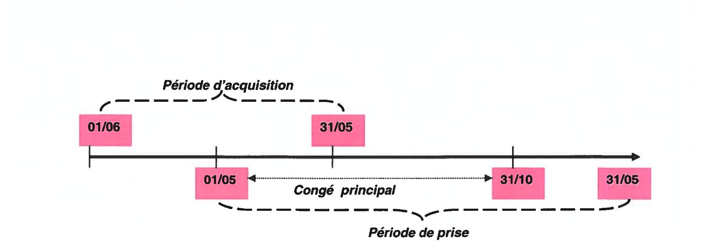

# ACCORD SUR LES DISPOSITIONS SOCIALES APPLICABLES AUX SALARIÉS DES SOCIÉTÉS DU GROUPE THALES

> [Télécharger le PDF](sources/groupe-2022-06-13-ACCORD-DISPOSITIONS-SOCIALES.pdf)

---

## PRÉAMBULE

Afin d'harmoniser les règles conventionnelles et les engagements pris en matière de dispositions sociales dans l'ensemble des sociétés du groupe Thales, la Direction et les organisations syndicales représentatives ont signé un accord de Groupe le 23 novembre 2006.

Les parties signataires de cet accord ont souhaité signer un nouvel accord pour arrêter des dispositions particulières pour permettre le ralliement des sociétés Thales DIS France SAS, Thales DIS Design Services SAS et Trusted Labs aux dispositions dudit accord et plus généralement modifier certaines dispositions pour les actualiser au regard des évolutions législatives et réglementaires.

Les dispositions de ce nouvel accord, communes à l'ensemble des sociétés du Groupe tel que défini à l'annexe 1 (ci-après « le Groupe » ou « le Groupe Thales »), permettent de faciliter et de renforcer la politique ressources humaines du Groupe, notamment en matière de mobilité interne.

A ce titre, il est convenu que les salariés « Mensuels » des entreprises actuelles du groupe entrant dans le champ d'application des conventions collectives de la Métallurgie relèvent des dispositions de la convention collective de la métallurgie de la région parisienne, sauf dispositions plus favorables de la convention collective de branche territorialement applicable.

---

## CHAPITRE I : DISPOSITIONS RELATIVES À L'ANCIENNETÉ

### ARTICLE 1 : DÉFINITION DE L'ANCIENNETÉ

L'ancienneté est déterminée par la présence continue, à temps partiel ou à temps plein, du salarié dans le Groupe depuis la date d'entrée en fonction, en vertu d'un contrat de travail conclu avec l'une des sociétés[^1] du Groupe, sans que soient exclues les périodes de suspension du contrat de travail. Pour le personnel à temps partiel, cette ancienneté n'est pas proratisée.

Cette période est augmentée de :

- a) la période de présence antérieure au sein du Groupe, en vertu d'un précédent contrat de travail2 conclu avec une des sociétés du Groupe, sauf pour le calcul du montant des indemnités conventionnelles de licenciement si le départ du salarié avait déjà donné lieu à un tel versement.

- b) la période de présence continue au sein d'une société extérieure au Groupe Thales, en vertu d'un contrat de travail, dès lors que l'intégration du salarié dans une des sociétés du Groupe Thales s'effectue en application des dispositions de l'article L.1224-1 du code du travail ou d'accords spécifiques entre sociétés.

- c) la période de présence continue au sein d'une joint-venture (société commune avec un partenaire extérieure dont le capital est détenu au moins à 50% par une société du Groupe Thales), dès lors que le salarié disposait précédemment d'un contrat de travail avec une des sociétés du Groupe Thales.

- d) la période continue correspondant à une prestation de services, un détachement ou autre contrat de travail temporaire, effectuée par l'intéressé pour le compte d'une des sociétés du Groupe Thales, en vertu d'un contrat commercial, directement préalable à son embauche au sein du Groupe Thales.

L'ancienneté reprise au titre d'un contrat de travail antérieur dans les conditions mentionnées ci-dessus est prise en compte lors de la dernière entrée dans le Groupe Thales.

>1: Filiale directe ou indirecte dont le capital est détenu par la société anonyme Thales à plus de 50%. 
>2: CDI, CDD, contrat d'apprentissage ou contrat de professionnalisation, CIFRE pour la durée accomplie de manière continue au sein du groupe Thales et dès lors que le terme de l'alternance ou du CDD est directement suivi d'une embauche au sein du Groupe.

### ARTICLE 2 : CONGÉS SUPPLÉMENTAIRES LIÉS À L'ANCIENNETÉ

Dans un souci d'une plus grande harmonisation des droits des salariés du Groupe et compte tenu des métiers exercés au sein de celui-ci, il est convenu de prévoir des congés supplémentaires liés à l'ancienneté identiques pour les salariés Mensuels et les ingénieurs et cadres, dans les conditions suivantes :

- 2 jours ouvrés pour le salarié ayant au moins 30 ans et justifiant d'au moins 1 an d'ancienneté dans le Groupe,
- 4 jours ouvrés pour le salarié ayant au moins 35 ans et justifiant d'au moins 2 ans d'ancienneté dans le Groupe.

Les droits à congés payés supplémentaires pour ancienneté sont acquis dès la date anniversaire à laquelle les conditions d'âge et d'ancienneté sont remplies. La prise des congés supplémentaires pour ancienneté donne lieu au maintien de la rémunération mensuelle, comme un jour normalement travaillé.

#### Semaine exceptionnelle lorsque le salarié atteint 35 ans d'ancienneté

Le salarié qui atteint 35 ans d'ancienneté bénéficie, au titre de l'année où il atteint cette ancienneté, de 5 jours ouvrés de congés payés supplémentaires. Cette semaine exceptionnelle de congés payés est à prendre obligatoirement dans l'année qui suit la date d'anniversaire et s'ajoute aux droits acquis par ailleurs.

Par exception, pour le salarié ayant à charge au titre de l'année considérée, un enfant ou un conjoint (marié, pacsé ou vivant maritalement) ayant un taux d'incapacité permanente supérieur ou égal à 80 %, le bénéfice de ces 5 jours de congés payés supplémentaires est accordé l'année où il atteint 20 ans d'ancienneté. Pour bénéficier de cette mesure exceptionnelle, le salarié devra remettre une attestation justifiant de cette charge.

### ARTICLE 3 : PRIME D'ANCIENNETÉ

Conformément aux dispositions de la convention collective de la Métallurgie de la Région Parisienne, la prime d'ancienneté s'ajoute au salaire réel du salarié mensuel et est calculée en fonction du salaire minimum hiérarchique conventionnel de l'emploi occupé, aux taux respectifs de 3% après 3 ans d'ancienneté, auquel il est ajouté 1% supplémentaire par année d'ancienneté supplémentaire, dans la limite de 15% après 15 ans d'ancienneté.

| Ancienneté | 3 | 4 | 5 | 6 | 7 | 8 | 9 | 10 | 11 | 12 | 13 | 14 | 15 et + |
|---|---|---|---|---|---|---|---|---|---|---|---|---|---|
| Taux | 3% | 4% | 5% | 6% | 7% | 8% | 9% | 10% | 11% | 12% | 13% | 14% | 15% |

Les salariés des sociétés Thales DIS France, Thales DIS Design Services et Trusted Labs embauchés à compter du 1er juin 2022 se voient appliquer les dispositions communes à l'ensemble des sociétés du groupe Thales.

Par exception, l'assiette de la prime d'ancienneté des salariés « Mensuels » embauchés au sein des sociétés Thales DIS France, Thales DIS Design Services et Trusted Labs, avant le 1er juin 2022 demeure le salaire brut de base mensuel du salarié. Ce dispositif dérogatoire cesse de recevoir application en cas de mobilité au sein du Groupe des salariés concernés.

---

## CHAPITRE II : CONGÉS PAYÉS ET JOURS NON TRAVAILLÉS

### ARTICLE 4 : DROITS À CONGÉS PAYÉS

Chaque salarié bénéficie d'un congé annuel payé dont la durée est fixée à deux jours ouvrables et demi par mois de travail effectif, ou assimilé par la loi, chez le même employeur sans que la durée totale du congé exigible puisse excéder trente jours ouvrables. Les congés payés sont décomptés en jours ouvrés. Les modalités de décompte des congés payés sont identiques pour les salariés à temps plein et les salariés à temps partiel.

Les jours fériés légaux, ainsi que les congés supplémentaires pour événements familiaux, s'ajoutent aux congés. Lorsque le jour férié tombe un samedi habituellement non travaillé, il donne également droit à un jour ouvré de congé supplémentaire :

- s'il est précédé et suivi d'au moins un jour de congé payé ouvré,
- ou s'il est précédé ou suivi d'au moins deux jours de congés payés ouvrés.

Il est également convenu que les jours de congés payés seront suspendus en cas d'arrêt de travail justifié pour cause de maladie intervenant pendant la prise du congé principal dès lors que l'arrêt de travail est d'une durée minimum de 2 semaines calendaires consécutives.

#### Article 4.1. — Les périodes de référence

La période de référence pendant laquelle le salarié acquiert ses droits à congés payés est fixée du 1er juin de l'année n au 31 mai de l'année n + 1.

La période de prise des congés s'étend en principe du 1er mai de l'année n + 1 au 31 mai de l'année n + 2 étant entendu que 10 jours ouvrés consécutifs au moins doivent être pris entre le 1er Mai et le 31 Octobre.

La période de prise du congé principal s'étend du 1er mai au 31 octobre de l'année n + 1. Le congé payé ne dépassant pas 10 jours ouvrés pendant cette période doit être continu. La durée des congés pouvant être pris en une seule fois ne peut excéder 20 jours ouvrés, à l'exception des salariés des départements et territoires d'Outre-Mer.

Conformément à l'article L 3141-12 du code du Travail, les congés peuvent être pris dès l'ouverture des droits, à raison de deux jours et demi ouvrables par mois de travail effectif pour le compte du même employeur.

Dans le cadre d'une mobilité Groupe, les soldes de congés et jours de repos sont transférés ou soldés dans les conditions prévues par l'accord Groupe relatif à la mobilité individuelle des salariés.

Les deux jours de substitution au congé de fractionnement, ou dispositifs équivalents, sont attribués sans distinction à tous les salariés du Groupe, et ceci sans aucune possibilité d'y déroger.

#### Article 4.2. — Les modalités de prise des congés payés

Les congés payés sont pris dans l'ordre suivant :

- congés légaux,
- congés conventionnels (par exemple, congé supplémentaire pour ancienneté).

Il est rappelé que cette règle ne fait pas obstacle à la prise prioritaire au cours de l'année civile des jours individuels acquis au titre de la réduction du temps de travail.

Les congés doivent être pris au cours de la période mentionnée à l'article 4.1. et ne peuvent pas être reportés (sauf en cas de situation exceptionnelle).

Toutefois, les congés excédant 20 jours ouvrés peuvent, à la demande du salarié, être reportés jusqu'au départ en congé pour création d'entreprise ou congé sabbatique dans les conditions légales.

Les salariés originaires des DROM-COM pourront, après accord de la DRH de l'établissement dont ils relèvent, cumuler l'ensemble des congés payés, y compris la 5ème semaine et les congés d'ancienneté.

Il est recommandé de favoriser l'étalement des congés.

### ARTICLE 5 : INDEMNITÉ DE CONGÉS PAYÉS

L'indemnité de congés payés est égale au dixième de la rémunération totale perçue par le salarié au cours de la période de référence visée à l'article 4.

Pour la détermination de la rémunération totale, il est tenu compte de :

- la rémunération mensuelle de base du salarié
- les majorations pour heures supplémentaires
- la prime d'ancienneté, les primes de travail en équipe, les indemnités d'expatriation
- l'indemnité de congés payés de l'année précédente
- l'indemnité afférente aux repos compensateurs
- des appointements versés à l'occasion des périodes légalement assimilées à un temps de travail (périodes d'indemnisation pour maladie et accident du travail, congés de formation non rémunérés ou partiellement rémunérés).

La détermination de la rémunération totale exclut :

- les primes qui correspondent à un risque exceptionnel, réellement subi, et qui ne joue plus durant l'absence pour congés payés,
- les primes ou autres éléments de rémunération ayant un caractère forfaitaire pour l'ensemble de l'année et qui à ce titre ne subissent pas d'abattement au titre des congés payés,
- les indemnités de remboursement de frais.

L'indemnité de congés payés ne peut être inférieure au montant de la rémunération qui aurait été perçue pendant la période de congé si le salarié avait effectivement continué à travailler.

Lorsque la durée du congé est différente de celle prévue à l'article L. 3141-3 et suivants du code du travail, l'indemnité est calculée selon la règle fixée ci-dessus et proportionnellement à la durée du congé effectivement dû.

### ARTICLE 6 : CONGÉS EXCEPTIONNELS POUR ÉVÉNEMENTS FAMILIAUX

Les congés exceptionnels pour évènements familiaux s'ajoutent aux droits à congés annuels et sont assimilés à du temps de travail effectif.

L'ensemble du personnel bénéficie, sur justification, de congés exceptionnels payés exprimés en jours ouvrés pour les évènements familiaux prévus ci-dessous :

| Événement | Lien | Durée |
|---|---|---|
| Mariage | du salarié | 5 jours |
| | d'un enfant | 2 jours |
| | d'un enfant du conjoint | 2 jours |
| | d'un frère / d'une sœur | 2 jours |
| Décès | du conjoint | 5 jours |
| | du concubin | 5 jours |
| | d'un enfant | 7 jours |
| | d'une personne âgée de moins de 25 ans dont le salarié a la charge effective et permanente | 7 jours |
| | d'un enfant du conjoint | 7 jours |
| | du gendre ou de la bru | 3 jours |
| | d'un parent | 3 jours |
| | d'un beau-parent | 3 jours |
| | d'un frère ou d'une sœur | 3 jours |
| | d'un beau-frère ou belle-sœur | 2 jours |
| | d'un petit-enfant | 2 jours |
| | d'un grand-parent | 2 jours |
| | d'un grand-parent du conjoint | 2 jours |
| Deuil | d'un enfant âgé de moins de 25 ans | 8 jours* |
| | d'une personne de moins de 25 ans à la charge effective et permanente du salarié | 8 jours* |

\* *Jours ouvrables. Le congé de deuil peut être fractionné en deux périodes.*

Les jours de congés exceptionnels sont attribués de manière forfaitaire. Les temps de voyage éventuellement nécessaires pour participer à un évènement familial s'ajoutent à la durée du congé exceptionnel.

Dans l'hypothèse d'un congé supérieur ou égal à 3 jours, le ou les jours pourront être pris dans les trois mois suivants l'événement, voire dans les 12 mois suivants l'événement sous réserve de l'accord de la hiérarchie. Le congé de deuil peut être pris dans un délai d'un an à compter du décès de l'enfant.

Si l'évènement familial a lieu pendant les congés payés du bénéficiaire, ceux-ci sont suspendus et leur terme est prolongé de la durée du congé exceptionnel.

Lorsque l'événement familial intervient dans les DROM-COM ou à l'étranger, le salarié peut différer le congé exceptionnel et le prendre accolé à ses congés payés.

Les congés exceptionnels pour évènements familiaux s'ajoutent aux droits à congés annuels et sont assimilés à du temps de travail effectif.

#### Congés d'accompagnement / Journée administrative

Les salariés ayant des parents ou beaux-parents âgés d'au moins 70 ans dont l'état physique ou médical justifie des démarches médicales ou administratives bénéficieront de 2 jours ouvrés par année civile sous réserve de fournir un justificatif. Ce congé peut être pris en journée ou en demi-journée.

Il est mis fin aux dispositions relatives aux autres congés d'accompagnement et journées administratives en vigueur dans certaines sociétés du Groupe.

#### Naissance ou arrivée d'un enfant placé en vue de son adoption

Tout salarié a droit à un congé supplémentaire de 3 jours ouvrés à l'occasion de chaque naissance ou adoption. Ce congé ne peut pas se cumuler avec le congé de maternité, mais il est cumulable avec le congé de paternité.

#### Droits du salarié titulaire d'un Pacte Civil de Solidarité

Pour l'ensemble des dispositions du présent article, les droits du salarié titulaire d'un Pacte Civil de Solidarité sont identiques à ceux du salarié marié(e).

Les congés exceptionnels pris au titre d'un PACS ne peuvent pas faire l'objet d'un nouvel octroi au titre d'un mariage postérieur avec la même personne.

### ARTICLE 7 : CONGÉS DE MATERNITÉ ET D'ADOPTION

La salariée absente pour congé de maternité ou le salarié(e) absent pour congé d'adoption survenant après 3 mois de présence dans l'une des entreprises du Groupe, au sens de l'article 1, a droit au maintien de ses appointements mensuels pendant la durée légale de son congé.

Pendant cette période, l'employeur versera à l'intéressé(e) un complément de salaire venant s'ajouter aux indemnités journalières versées par la Sécurité sociale, dans la limite de sa rémunération mensuelle de base.

Ces dispositions s'appliquent au deuxième parent en cas de partage du congé d'adoption entre les deux parents (avec un minimum de 25 jours consécutifs d'absence pour chaque parent, 32 jours en cas d'adoptions multiples).

Elles s'appliquent également au père, dans l'hypothèse du décès de la mère, pendant la période du congé de maternité, ou, si le père y renonce, au conjoint salarié de la mère ou à la personne salariée liée à elle par un PACS ou vivant maritalement avec elle.

Ces dispositions suivront l'évolution de la législation.

### ARTICLE 8 : CONGÉ DE PATERNITÉ ET D'ACCUEIL DE L'ENFANT

Le salarié absent pour congé de paternité bénéficie d'un maintien de sa rémunération pendant les 25 jours calendaires octroyés par la loi (32 jours en cas de naissances multiples). En cas d'allongement de la durée du congé paternité du fait d'une hospitalisation de l'enfant dans les conditions prévues par la loi, la rémunération du salarié en congé paternité sera maintenue pour la durée de l'allongement dans la limite d'une durée maximale de 30 jours consécutifs. Les dispositions du présent paragraphe sont applicables rétroactivement pour les enfants nés ou qui auraient dû naître à compter du 1er juillet 2021.

Pendant cette période, l'employeur versera au salarié concerné un complément de salaire venant s'ajouter aux indemnités journalières versées par la sécurité sociale dans la limite de sa rémunération mensuelle.

### ARTICLE 9 : AUTORISATIONS D'ABSENCES EXCEPTIONNELLES EN CAS D'ENFANT MALADE

Une autorisation d'absence rémunérée est accordée aux salariés dont l'enfant âgé au maximum de 16 ans (18 ans pour un enfant handicapé) est malade, dans la limite de 5 jours ouvrés par année civile et par enfant.

Cette absence sera autorisée sous réserve de la délivrance d'un certificat médical attestant de l'état de santé de l'enfant et de la nécessité d'une présence constante d'un parent.

Si les deux parents sont salariés du Groupe Thales, ils bénéficient l'un et l'autre des dispositions ci-dessus, mais ils ne peuvent pas prendre simultanément les jours d'absence.

### ARTICLE 10 : COMPLÉMENT À L'ALLOCATION JOURNALIÈRE DE PRÉSENCE PARENTALE

Les salariés bénéficiant d'un congé de présence parentale pour s'occuper de leur enfant âgé de moins de 20 ans atteint d'une maladie grave, d'un handicap ou gravement accidenté, et percevant dans ce cadre l'allocation journalière de présence parentale (AJPP) bénéficieront d'un complément de salaire, versé par leur entité, calculé sur la base du différentiel entre le salaire de base et l'allocation versée par la CAF pour toute la durée du congé indemnisé.

Ce complément de salaire, sera versé mensuellement sous réserve de la présentation des justificatifs de versement de l'AJPP par la caisse d'allocations familiales pour la période mensuelle considérée.

Ce complément de salaire est égal, pour un mois complet, à la différence entre le montant total de l'AJPP perçu pour la période et le montant du salaire mensuel brut de base du salarié.

En cas de congé d'une durée inférieure à un mois, ce complément sera égal, par jour indemnisé, au différentiel entre le montant journalier de l'AJPP et le salaire brut journalier du salarié.

Ce complément de salaire n'est pas cumulable avec un financement par le salarié de son congé de présence parentale par son compte épargne temps sur la même période.

### ARTICLE 11 : DONS DE JOURS DE REPOS

La loi n° 2014-459 du 9 mai 2014 a institué un dispositif permettant aux salariés, sous réserve de l'accord de l'employeur, de donner des jours de repos à un parent d'un enfant gravement malade, atteint d'un handicap, d'une maladie ou victime d'un accident d'une particulière gravité rendant indispensable une présence soutenue et des soins contraignants. Un tel don de jours est également possible au bénéfice d'un salarié en cas de décès de son enfant âgé de moins de 25 ans ou de la personne à sa charge effective et permanente de moins de 25 ans ou au bénéfice d'un salarié qui vient en aide à un proche en perte d'autonomie d'une particulière gravité ou présentant un handicap pour laquelle il pourrait bénéficier d'un congé de proche aidant.

Afin de favoriser ces initiatives solidaires, les sociétés entrant dans le périmètre du présent accord accèderont à toute demande visant à faire don de jours de repos à un autre salarié appartenant à la même société. Cette mesure est étendue au profit des salariés dont le conjoint (marié ou pacsé) est gravement malade nécessitant une présence soutenue et des soins contraignants.

En outre, pour chaque jour donné par un salarié, la société procèdera à l'abondement d'une demi-journée supplémentaire au profit du salarié bénéficiaire, dans la limite de 20 demi-journées.

Il est rappelé qu'afin de garantir le droit au repos des salariés donateurs, seuls peuvent être cédés dans le cadre de ce dispositif les congés payés légaux correspondant à la 5e semaine de congés payés, les jours de réduction du temps de travail et jours de repos ainsi que les jours de congé conventionnels.

Une autorisation d'absence rémunérée correspondant à la somme des jours de repos donnés par les salariés et aux demi-journées abondées par la société est octroyée au salarié bénéficiaire, sous réserve, conformément à l'article L 1225-65-2 du Code du travail des justificatifs correspondants.

Le don de jours de repos est effectué de manière anonyme, sans contrepartie et est définitif.

Chaque année, sera transmis aux comités sociaux et économiques centraux / comité social et économique (pour les entreprises mono-établissement), ainsi qu'à la commission de contrôle et de suivi de l'accord une information concernant le nombre de jours de repos donnés et utilisés dans le cadre du présent dispositif, tout en respectant l'anonymat du bénéficiaire.

### ARTICLE 12 : AUTORISATIONS D'ABSENCES EN FAVEUR DES SALARIÉS HANDICAPÉS OU AYANT À CHARGE UN ENFANT HANDICAPÉ

Les salariés handicapés bénéficient d'une autorisation spéciale d'absence rémunérée d'une semaine (5 jours ouvrés) par année civile, dès lors qu'ils font partie des Bénéficiaires de l'Obligation d'Emploi des Personnes Handicapés (BOETH) conformément à l'article L. 5212-13 du code du travail.

Ce congé supplémentaire doit obligatoirement faire l'objet d'une prise continue ou non au cours de la période de référence définie à l'article 4.1. Il est exclu qu'il soit accolé au congé annuel principal. La date doit être arrêtée en accord avec la direction locale. En accord avec leur direction locale, les intéressés pourront remplacer la semaine exceptionnelle d'absence par un aménagement de leur horaire de travail quotidien ou hebdomadaire, équivalent à une semaine de travail.

Par ailleurs, une autorisation d'absence rémunérée de 5 jours — distincte du congé pour enfant malade, est accordée annuellement pour tout salarié ayant à charge un enfant handicapé.

### ARTICLE 13 : AUTORISATIONS D'ABSENCES EXCEPTIONNELLES

- Tout déménagement intervenant à l'initiative du salarié pendant un jour ouvré sera rémunéré comme un jour habituellement travaillé sous réserve que la preuve de la réalité du déménagement soit apportée. La présente disposition ne peut s'appliquer une nouvelle fois qu'après un délai d'un an suivant le précédent déménagement. Des règles spécifiques seront négociées en cas de déménagement rendu nécessaire à la suite d'un changement collectif de lieu de travail (cf. accord sur la mobilité au sein du Groupe Thales).

- Tout salarié volontaire pour effectuer des dons de plasma ou de plaquettes sanguines bénéficiera d'une journée pour réaliser le prélèvement et disposer d'un temps de récupération.

- Tout salarié justifiant d'une convocation pour consultation hospitalière bénéficie d'une autorisation d'absence rémunérée sur une demi-journée. Cette autorisation d'absence rémunérée nécessite la présentation d'un justificatif.

- Lors de la rentrée scolaire de jeunes enfants, une absence rémunérée est accordée selon les usages ou autre directive en vigueur dans les établissements.

- Le salarié convoqué pour participer à un jury d'assises bénéficie du maintien de sa rémunération nette sous déduction de l'indemnité de session pour les journées au titre desquelles il siège en qualité de juré d'assises, sous réserve de la fourniture d'un justificatif de présence aux audiences.

### ARTICLE 14 : ABSENCES EXCEPTIONNELLES POUR LES SALARIÉS RÉSERVISTES

Dans le cadre de l'adhésion du Groupe Thales à la politique des réserves, tout salarié volontaire ayant souscrit un contrat d'engagement à servir dans la réserve bénéficiera d'une suspension de son contrat de travail pendant le déroulement de ses activités militaires, dans la limite de 20 jours ouvrés par an.

Pour les périodes d'absence excédant 30 jours et dans le cas particulier d'opérations extérieures, les demandes de l'autorité militaire feront l'objet d'un examen préalable devant répondre aux mieux aux besoins des armées.

Afin de soutenir l'engagement de ses salariés réservistes au profit de la Défense Nationale, le Groupe Thales s'engage à maintenir leur rémunération nette sans déduction de la solde nette perçue de la part du Ministère des Armées ainsi que le droit à l'intéressement et à la participation.

### ARTICLE 15 : LES JOURS FÉRIÉS

Les jours fériés chômés n'entraînent pas de changement de la rémunération mensuelle, quelle que soit l'ancienneté du salarié.

En application des dispositions de l'article 26 de la convention collective de la Métallurgie de la Région Parisienne, un salarié Mensuel qui effectuerait des heures de travail un jour férié, autre que le 1er mai, bénéficierait d'une majoration « d'incommodité » de 50% ou d'un repos payé d'égale durée majoré de 50 %.

L'ingénieur ou Cadre appelé à travailler un jour férié, autre que le 1er Mai, bénéficiera d'un repos compensateur d'une durée égale à celle du temps de travail accompli, majoré de 50%.

Conformément aux dispositions actuelles de l'article L. 3133-11 du code du travail, et sauf accord collectif d'entreprise contraire, la journée de solidarité est le lundi de la Pentecôte.

---

## CHAPITRE III : ALLOCATIONS DIVERSES

### ARTICLE 16 : DÉPART À LA RETRAITE

#### Article 16.1. — Allocation de départ à la retraite

La rupture du contrat de travail d'un salarié de sa propre initiative dans le cadre d'un départ à la retraite donnera droit au versement d'une allocation de départ à la retraite dont le montant est fixé à :

- 1 mois de salaire après 2 ans d'ancienneté3
- 2 mois de salaire après 5 ans d'ancienneté
- 3 mois de salaire après 10 ans d'ancienneté
- 3,7 mois de salaire après 15 ans d'ancienneté
- 4,5 mois de salaire après 20 ans d'ancienneté
- 6,5 mois de salaire après 30 ans d'ancienneté
- 8 mois de salaire après 40 ans d'ancienneté

Pour les salariés se trouvant entre deux seuils d'ancienneté, le calcul de l'allocation de départ à la retraite sera réalisé par interpolation linéaire.

L'allocation de départ en retraite est calculée sur la moyenne mensuelle des appointements des 12 derniers mois de présence du salarié dans l'entreprise4].

Ce barème d'indemnité de départ à la retraite ne saurait concerner les salariés du groupe fermé de Thales Alenia Space dont les modalités de calcul de l'indemnité de départ en retraite sont fixées par des dispositions conventionnelles spécifiques résultant de l'application d'un barème distinct globalement plus favorable que celui du présent accord.

Ce barème concernera les salariés des sociétés DIS France SAS, Trusted Labs et Thales DIS Design Services SAS pour les départs en retraite5] qui interviendront à compter du 1er janvier 2022 selon les modalités suivantes :

- pour les départs en retraite des sociétés DIS France SAS, Trusted Labs et Thales DIS Design Services SAS qui interviendront à compter de 2022, le montant de l'indemnité de départ à la retraite sera celui résultant de l'application du barème prévu par les dispositions des conventions collectives de branche applicables au salarié à la date du départ, augmenté de 25 % du montant résultant de la différence entre l'application de ce barème et de celle du barème détaillé ci-dessus,

- pour les départs en retraite intervenant à compter de 2023, le montant de l'indemnité de départ à la retraite sera celui résultant de l'application du barème prévu par les dispositions des conventions collectives de branche applicables au salarié à la date du départ, augmenté de 50 % du montant résultant de la différence entre l'application de ce barème et de celle du barème détaillé ci-dessus sous réserve de la conclusion d'un accord dont la négociation interviendra en novembre 2022,

- pour les départs en retraite intervenant à compter de 2024, le montant de l'indemnité de départ à la retraite sera celui résultant de l'application du barème prévu par les dispositions des conventions collectives de branche applicables au salarié à la date du départ, augmenté de 75 % du montant résultant de la différence entre l'application de ce barème et de celle du barème détaillé ci-dessus sous réserve de la conclusion d'un accord dont la négociation interviendra en novembre 2023,

- pour les départs en retraite intervenant à compter du 1er janvier 2025, le montant de l'indemnité de départ à la retraite sera celui détaillé ci-dessus sous réserve de la conclusion d'un accord dont la négociation interviendra en novembre 2024.

>3: au sein du Groupe Thales 
>4: Moyenne mensuelle des appointements des 12 derniers mois de présence = salaire mensuel de base + prime d'ancienneté + allocation annuelle + prime de travail en équipe + prime d'expatriation + indemnité afférente aux repos compensateurs + rémunération variable (ingénieurs et cadres) + heures supplémentaires et leurs majorations. 
>5: La date de départ en retraite correspond à la date de fin du préavis.

#### Article 16.2. — Allocation de départ à la retraite pour les salariés en carrière longue ou en situation de handicap

La rupture du contrat de travail d'un salarié de sa propre initiative dans le cadre d'un départ à la retraite au titre d'un des dispositifs de départ anticipé légalement prévus au profit des salariés en situation de handicap (art. L 351-1-3 du code de la sécurité sociale) ouvre droit (hors situation de MAD prévue par l'accord Anticipation) au versement d'une majoration de l'allocation de départ en retraite telle que prévue à l'article 16-1 du présent accord d'un montant équivalent à 8 mois de salaire (3 mois au titre du présent accord + 5 mois au titre de l'accord Handicap).

La rupture du contrat de travail d'un salarié de sa propre initiative dans le cadre d'un départ à la retraite justifiant d'une longue carrière (article L 351-1-1 du Code de la Sécurité Sociale) ouvre droit (hors situation de MAD prévue dans l'accord Anticipation) au versement d'une majoration de l'allocation de départ en retraite telle que prévue à l'article 16.1 du présent accord d'un montant équivalent à 3 mois de salaire.

Ces deux majorations ne se cumulent pas.

#### Article 16.3. — Avance PERECO

Tout salarié qui informe l'employeur de sa décision de liquider sa retraite dans les 24 mois pourra avant la date de ce départ, bénéficier d'une avance d'un mois de salaire maximum par an. Cette avance devra être affectée au PERECO. Pour en bénéficier, les salariés devront adresser à la DRH de l'établissement un courrier précisant leur décision de départ, la date de ce départ et formuler une demande d'avance.

### ARTICLE 17 : INDEMNITÉ DE MISE À LA RETRAITE

La mise à la retraite d'un salarié ayant atteint l'âge fixé à l'article L 351-8 1° du Code de la sécurité sociale pourra être opérée à l'initiative de l'employeur dans les conditions précisées à l'article L 1237-5 du code du travail.

A compter de l'entrée en vigueur du présent accord, tout salarié mis à la retraite dans les délais et conditions mentionnés ci-dessus bénéficiera d'une indemnité de mise à la retraite dont le montant est fixé à :

- 1 mois de salaire après 2 ans d'ancienneté6
- 2 mois de salaire après 5 ans d'ancienneté
- 3 mois de salaire après 10 ans d'ancienneté
- 3,7 mois de salaire après 15 ans d'ancienneté
- 4,5 mois de salaire après 20 ans d'ancienneté
- 6,5 mois de salaire après 30 ans d'ancienneté
- 8 mois de salaire après 40 ans d'ancienneté

Le montant de l'indemnité de mise à la retraite est calculé sur la moyenne mensuelle des appointements des 12 derniers mois de présence du salarié dans l'entreprise7.

Pour les salariés se trouvant entre deux seuils d'ancienneté, le calcul de l'indemnité de mise à la retraite sera réalisé par interpolation linéaire.

En application de l'article L 1237-7 du code du travail, l'indemnité de mise à la retraite est au moins égale à l'indemnité légale de licenciement.

Ce nouveau barème d'indemnité de mise à la retraite tel que résultant du présent article ne saurait concerner les salariés du groupe fermé de Thales Alenia Space dont les modalités de calcul de l'indemnité de mise à la retraite sont fixées par des dispositions conventionnelles spécifiques résultant de l'application d'un barème distinct globalement plus favorable que celui du présent accord.

Ce barème concernera les salariés des sociétés DIS France SAS, Trusted Labs et Thales DIS Design Services SAS pour les mises à la retraite8 qui interviendront à compter du 1er janvier 2022 selon les modalités suivantes :

- pour les mises à la retraite intervenant à compter de 2022, le montant de l'indemnité de départ à la retraite sera celui résultant de l'application du barème prévu par les dispositions des conventions collectives de branche applicables au salarié à la date du départ, augmenté de 25 % du montant résultant de la différence entre l'application de ce barème et de celle du barème détaillé ci-dessus,

- pour les mises à la retraite intervenant à compter de 2023, le montant de l'indemnité de départ à la retraite sera celui résultant de l'application du barème prévu par les dispositions des conventions collectives de branche applicables au salarié à la date du départ, augmenté de 50 % du montant résultant de la différence entre l'application de ce barème et de celle du barème détaillé ci-dessus sous réserve de la conclusion d'un accord dont la négociation interviendra en novembre 2022,

- pour les mises à la retraite intervenant à compter de 2024, le montant de l'indemnité de départ à la retraite sera celui résultant de l'application du barème prévu par les dispositions des conventions collectives de branche applicables au salarié à la date du départ, augmenté de 75 % du montant résultant de la différence entre l'application de ce barème et de celle du barème détaillé ci-dessus sous réserve de la conclusion d'un accord dont la négociation interviendra en novembre 2023,

- pour les mises à la retraite intervenant à compter du 1er janvier 2025, le montant de l'indemnité de mise à la retraite sera celui détaillé ci-dessus sous réserve de la conclusion d'un accord dont la négociation interviendra en novembre 2024.

>6: au sein du Groupe Thales  
>7: voir note de bas de page n°4  
>8: La date de départ en retraite correspond à la date de fin du préavis.

### ARTICLE 18 : ALLOCATION ANNUELLE

Contractuellement, les salariés Mensuels disposent d'une allocation annuelle dont le montant est fixé à un mois d'appointements de base bruts (hors prime d'ancienneté) pour une année complète et quelle que soit la durée du travail prévue au contrat de travail.

Cette allocation est versée selon les modalités suivantes :

- un premier versement sous la forme d'un acompte de 50% à l'occasion du versement du salaire afférent au mois de mai.
- le solde intervenant avec le versement du salaire afférent au mois de novembre sous réserve de la compatibilité avec les systèmes de paie.

Les appointements à prendre en considération pour le calcul de l'allocation sont ceux versés au cours de l'exercice considéré, soit de décembre N-1 à novembre N.

En cas de départ de la société, le calcul se fait au prorata du temps de présence effectué au cours de la période de référence, sur la base des derniers appointements, selon la règle du 360ème.

Les périodes de référence à prendre en considération sont les suivantes :

- du 1er décembre de l'année précédente au 31 mai de l'année en cours pour le paiement de l'acompte,
- du 1er décembre au 30 novembre pour le paiement du solde.

L'allocation annuelle a le caractère d'une rémunération. Elle n'est payée que si l'intéressé a perçu pendant la période de référence des appointements ou une indemnisation par la société. Chaque journée non rémunérée ou non indemnisée par la société donne lieu à un abattement.

Ne donnent pas lieu à abattement :

- les absences pour accident du travail,
- les congés de formation économique, sociale, environnementale et syndicale prévus par l'article L. 2141-5 du code du travail,
- les congés de formation avec rémunération prise totalement ou partiellement en charge,
- les congés pour l'exercice de mandat électif prévu par la loi du 3 février 1992, dans la limite de 10 jours ouvrés par an,
- les périodes de suspension du contrat de travail au titre des périodes de réserve.

Pour chaque journée ayant donné lieu à abattement au cours de la période de référence allant du 1er décembre au 31 mai, il est opéré une déduction de 1/180ème sur le montant de cette demi-part, considérée comme un acompte.

Lors du versement du solde de l'allocation, une régularisation est alors opérée en pratiquant une déduction de 1/360ème par journée ayant donné lieu à abattement, au cours de la période allant du 1er décembre au 30 novembre.

Du montant de l'allocation annuelle ainsi déterminé est alors soustrait le montant de l'acompte versé en mai.

---

## CHAPITRE IV : MÉDAILLES DU TRAVAIL

### ARTICLE 19 : ALLOCATIONS ACCORDÉES À L'OCCASION DE LA DÉLIVRANCE DES MÉDAILLES D'HONNEUR DU TRAVAIL DE L'ÉTAT

A l'occasion de la délivrance des médailles d'honneur du travail de l'État au titre de l'année 2021, des allocations sont attribuées aux salariés du groupe Thales dans les conditions suivantes :

- **Obtention de la MÉDAILLE D'ARGENT D'HONNEUR DU TRAVAIL** : les salariés justifiant de 20 ans de travail percevront une indemnité forfaitaire de 1 060 €, allouée à l'occasion de la remise de cette médaille.

- **Obtention de la MÉDAILLE DE VERMEIL D'HONNEUR DU TRAVAIL** : les salariés justifiant de 30 ans de travail percevront une indemnité forfaitaire de 1 852 €, allouée à l'occasion de la remise de cette médaille.

- **Obtention de la MÉDAILLE D'OR D'HONNEUR DU TRAVAIL** : les salariés justifiant de 35 ans de travail percevront une indemnité forfaitaire de 1 988 €, allouée à l'occasion de la remise de cette médaille.

- **Obtention de la GRANDE MÉDAILLE D'OR** : les salariés justifiant de 40 ans de travail percevront une indemnité forfaitaire de 2 250 €, allouée à l'occasion de la remise de cette médaille.

Les indemnités forfaitaires allouées à l'occasion de la délivrance des médailles du travail ne peuvent donner lieu à un versement rétroactif.

En cas d'obtention de plusieurs médailles du travail, il sera attribué l'indemnité forfaitaire la plus élevée. Cette allocation ne peut se cumuler avec toute indemnité annuelle ayant pour objet de récompenser l'ancienneté. A ce titre, il est mis fin aux allocations annuelles d'ancienneté versées par les sociétés Thales DIS France, Thales DIS Design Services et Trusted Labs. Les salariés ayant bénéficié de l'allocation annuelle d'ancienneté versée par ces sociétés au titre d'un seuil d'ancienneté ne peuvent demander à bénéficier de l'indemnité forfaitaire allouée à l'occasion de la délivrance de la médaille du travail portant sur le même seuil.

Les présentes médailles du travail seront accordées après 18, 25, 30 et 35 ans de service lorsque l'activité exercée par le salarié présente un caractère de pénibilité, tel que défini par le décret du 17 octobre 2000, permettant de bénéficier d'une retraite anticipée dans les conditions légales en vigueur. Ces mêmes conditions d'années de service seront également appliquées aux salariés dont le handicap peut légalement justifier une liquidation anticipée des droits à la retraite.

#### Indexation de l'allocation médailles

L'indemnité forfaitaire allouée à l'occasion de la délivrance des médailles sera indexée sur l'évolution du PMSS.

---

## CHAPITRE V : RÉGIMES DE RETRAITE COMPLÉMENTAIRE

Le régime de retraite complémentaire AGIRC-ARRCO est applicable dans toutes les sociétés et établissements constituant le groupe Thales.

Les dispositions du présent chapitre ne sont pas applicables aux salariés des sociétés Thales DIS France, Thales DIS Design Services et Trusted Labs. Elles le deviendront dès lors que la négociation aura abouti, et après signature d'un avenant au présent accord si les modalités arrêtées étaient différentes de celles mentionnées au présent accord.

### ARTICLE 20 : TAUX APPLICABLE

L'ensemble des salariés relevant du périmètre du groupe Thales se verra appliquer un taux contractuel de 7,4% appelé à 9,40% (taux d'appel à 127% depuis 2019).

La cotisation globale sera répartie entre :

- L'employeur à hauteur de 60%
- Le salarié à hauteur de 40%

L'assiette de cotisation sur laquelle est basée le régime complémentaire est le salaire brut de base dans la limite d'un plafond de la sécurité sociale.

### ARTICLE 21 : RÉGIME PARTICULIER DE RETRAITE COMPLÉMENTAIRE DES SALARIÉS EX-CETH

Les ingénieurs et cadres et les collaborateurs dits assimilés, désignés ex-CETH au terme de la Convention Sociale de Thomson-CSF de 1969, sont affiliés au régime de retraite cadre (AGIRC).

La cotisation globale à l'AGIRC est de 16,24 % sur T2 et T3 répartie entre :

- employeur : 12,18 % soit 75% du montant total
- cotisant : 4,06 % soit 25% du montant total

### ARTICLE 22 : RÉGIME PARTICULIER POUR LES SALARIÉS À TEMPS PARTIEL

Sont considérés comme salariés à temps partiel, les salariés dont la durée du travail est inférieure à :

- la durée légale ou conventionnelle du travail exprimée en heures,
- ou au forfait en jours sur l'année applicable dans l'entreprise.

Les cotisations aux différents régimes de retraite seront prélevées sur la base du salaire effectivement perçu, en effectuant le calcul du prorata du plafond de sécurité sociale pour la détermination des tranches T1 et T2.

Il est néanmoins convenu que l'assiette des cotisations destinée à calculer les droits à la retraite tant pour le régime général de sécurité sociale que pour les régimes complémentaires peut être maintenue à la hauteur du salaire correspondant à l'activité exercée à temps plein. Dans ce cas, le salarié qui décide de maintenir le calcul des cotisations sur une assiette à temps plein assumera le paiement du supplément de cotisations salariales, l'employeur prenant à sa charge les cotisations patronales.

#### Temps partiel thérapeutique

Afin de garantir une référence de rémunération sur la base d'une durée du travail à temps plein, sur laquelle sont assises les cotisations sociales, l'employeur est subrogé aux salariés placés en situation de temps partiel thérapeutique dans ses droits aux indemnités journalières qui leur sont dues.

---

## CHAPITRE VI : RÉGIMES DE SANTÉ / PRÉVOYANCE-DÉPENDANCE

Les salariés du groupe Thales bénéficient de garanties frais de santé, prévoyance, et dépendance dans le cadre de dispositifs collectifs et obligatoires, répondant à une volonté de développer une protection sociale complète et uniforme pour l'ensemble des salariés du Groupe, quelle que soit l'entreprise dont ils relèvent.

Afin de pouvoir faire évoluer tant le périmètre d'application de ces contrats collectifs, que les garanties qu'ils mettent en place, indépendamment d'une révision de l'accord sur les dispositions sociales, la Direction du Groupe et les Organisations Syndicales représentatives ont souhaité dédier aux dispositions relatives aux Frais de Santé, à la Prévoyance ainsi que la Dépendance des accords distincts. Il convient alors de se référer aux accords suivants :

- **Accord relatif aux garanties Frais de santé et Prévoyance du Groupe Thales** signé le 20 décembre 2019 : précise les dispositions communes à la santé et à la prévoyance.

- **Accord instituant un régime surcomplémentaire obligatoire aux garanties collectives « frais de santé »** du Groupe Thales signé le 20 décembre 2019 : mise en place au bénéfice des salariés du Groupe d'un régime de surcomplémentaire collectif de remboursement des frais médicaux à adhésion obligatoire portant sur les dépassements d'honoraires de médecins, l'optique, le dentaire et les médecines douces.

- **Accord Groupe Thales portant sur le régime dépendance** signé le 19 avril 2019 : instaure un régime collectif et obligatoire à prestations définies prévoyant une garantie dépendance couvrant la dépendance totale et la dépendance partielle définie selon la grille AGGIR.

---

## CHAPITRE VII : DISPOSITIONS RELATIVES À LA MALADIE, AUX ACCIDENTS DE TRAVAIL OU DE TRAJET ET AUX CURES THERMALES ET AUX SALARIÉS EN SITUATION DE HANDICAP

### ARTICLE 23 : INDEMNITÉS COMPLÉMENTAIRES DES JOURS DE MALADIE ET DES ABSENCES POUR ACCIDENT DE TRAJET

L'ensemble des salariés des sociétés comprises dans le périmètre du présent accord bénéficie, en matière d'indemnisation complémentaire des jours de maladie et des absences pour accident de trajet, du régime prévu par l'article 16 de la convention collective nationale des Ingénieurs et Cadres de la Métallurgie. Cette indemnisation intervient pour l'ensemble des personnels considérés aux dates habituelles de paye.

### ARTICLE 24 : INDEMNISATION COMPLÉMENTAIRE DES ABSENCES POUR ACCIDENT DE TRAVAIL OU MALADIE PROFESSIONNELLE SURVENUES DANS LE GROUPE THALES

L'ensemble des salariés des entreprises comprises dans le périmètre du présent accord est indemnisé dans les conditions prévues par la convention collective nationale des Ingénieurs et Cadres de la Métallurgie, mais sans conditions d'ancienneté.

Par ailleurs, lorsque les périodes conventionnellement indemnisées à 100% (y compris l'indemnisation de la Sécurité Sociale) seront épuisées, la société complètera à 100% :

- les périodes conventionnellement indemnisées à 75% (y compris l'indemnisation Sécurité sociale et éventuellement les prestations en espèces des caisses de prévoyance)

- les périodes pendant lesquelles les régimes de prévoyance prendront le relais (y compris l'indemnisation Sécurité sociale) et ce, pendant une durée de :
  - 5 mois pour une ancienneté de moins de 5 ans
  - 6 mois pour une ancienneté comprise entre 5 et 10 ans
  - 7 mois pour une ancienneté comprise entre 10 et 15 ans
  - 8 mois pour une ancienneté égale ou supérieure à 15 ans

### ARTICLE 25 : GÉNÉRALISATION DE LA SUBROGATION

Dispositif suivant lequel une société, qui maintient au salarié tout ou partie de son salaire pendant un arrêt de travail tout en se substituant à lui pour la perception des indemnités journalières de Sécurité Sociale, la subrogation évite aux salariés de supporter le « différé » nécessaire aux organismes de sécurité sociale pour procéder à l'indemnisation en cas d'arrêt de travail.

La subrogation permet à l'employeur de percevoir directement les indemnités journalières de Sécurité sociale qui sont dues au salarié par la CPAM pour la période de son arrêt de travail ou de son congé.

Deux conditions sont nécessaires à la mise en œuvre de la subrogation :

- il doit y avoir un maintien du salaire intégral ou partiel pendant la durée de l'arrêt de travail ou du congé,
- la part du salaire maintenu doit être d'un montant au moins égal à celui des indemnités journalières dues au salarié par la CPAM.

Si le salaire maintenu est inférieur aux indemnités journalières (par exemple, le salarié ayant perçu des primes certains mois au cours de la période de référence, la moyenne des salaires servant au calcul des indemnités journalières est plus élevée que le salaire mensuel), l'employeur doit restituer au salarié la différence.

Les salariés des sociétés du groupe bénéficient de la subrogation pour tous les types d'arrêts de travail ouvrant droit à des indemnités journalières de sécurité sociale (maladie, accident, maternité/adoption/temps partiel thérapeutique).

Les salariés des sociétés Thales DIS France, Thales DIS Design Services et Trusted Labs bénéficieront de la subrogation dans un délai de trois mois à compter de l'entrée en vigueur de l'accord.

### ARTICLE 26 : CURES THERMALES

Lorsque la cure prescrite doit être effectuée en dehors du congé payé de l'intéressé, il est versé à celui-ci des indemnités égales à celles auxquelles il peut prétendre dans le cas d'absence pour maladie, sous réserve qu'il remplisse les conditions requises.

Il est précisé qu'il s'agit d'indemnités différentielles calculées comme si les indemnités journalières de l'assurance maladie continuaient d'être versées par la Sécurité sociale en cas d'arrêt du travail pour cure thermale.

La cure thermale non prescrite pour une date précise devra normalement être effectuée pendant le congé payé.

Si l'intéressé est dans l'impossibilité d'effectuer celle-ci pendant ses congés payés, il pourra bénéficier d'un congé sans solde.

Le congé qui, exceptionnellement et sur décision de l'employeur, serait indemnisé à titre bénévole, s'imputera sur la durée d'indemnisation prévue pour la maladie.

### ARTICLE 27 : ACTIONS FAVORISANT L'INSERTION ET LA FORMATION DES ENFANTS EN SITUATION DE HANDICAP

Sur présentation de justificatifs, le Groupe participera aux dépenses engagées pour le suivi d'actions de formations diplômantes à hauteur de 1 500 euros par année scolaire maximum pour chaque enfant à charge en situation de handicap de salariés Thales.

---

## CHAPITRE VIII : DISPOSITIONS FINALES

### ARTICLE 28 : PÉRIMÈTRE, NATURE, MISE EN ŒUVRE ET DURÉE DE L'ACCORD

Le présent accord, conclu entre la Direction de la société Thales, entreprise dominante, et les organisations syndicales représentatives au niveau du Groupe Thales, constitue un accord de Groupe au sens des articles L. 2232-30 et suivants du Code du travail.

Il s'appliquera à l'ensemble des sociétés relevant du périmètre du Groupe au sens de l'article L. 2331-1 du Code du travail et visées à l'annexe 1 du présent accord, et ce afin de tenir compte des modifications intervenues dans la structure du Groupe Thales.

Les dispositions du présent accord se substituent aux dispositions sociales ayant le même objet et étant en vigueur au sein des sociétés de l'Activité Mondiale Identité et Sécurité Numériques telles que listées à l'annexe 1 du présent accord. Le présent accord se substitue et révise l'ensemble des dispositions issues de l'accord sur les Dispositions sociales applicables aux salariés des sociétés du Groupe Thales du 23 novembre 2006 et de tous ses avenants qui cessent de recevoir application.

Le présent accord entre en vigueur à compter du 1er juin 2022. Il est conclu pour une durée indéterminée et pourra faire l'objet d'une dénonciation ou d'une révision dans les conditions prévues par la loi.

### ARTICLE 29 : COMMISSION DE SUIVI

Une Commission de Suivi est instaurée. Elle est composée d'un maximum de 3 représentants par organisation syndicale signataire et d'un maximum de 5 représentants de la Direction.

La Direction s'engage à informer la Commission des décisions des Sociétés du Groupe relatives à la mise en œuvre de l'accord comme :

- dénonciation d'accords portants sur les mêmes objets,
- signatures ou désaccords sur les accords d'adhésion,
- tout sujet relatif à l'accord.

La Commission sera saisie de toute question relative à l'interprétation de l'accord.

La Direction s'engage à faciliter la mission des membres de la Commission en prenant en charge les déplacements et les heures pour préparer et participer aux réunions de la Commission.

### ARTICLE 30 : ÉVOLUTION DU PÉRIMÈTRE DE L'ACCORD

Le périmètre du présent accord comprend les entreprises du groupe Thales telles que visées à l'annexe 1.

Compte tenu de l'évolution du Groupe Thales, le périmètre défini par les parties au présent accord peut être amené à évoluer.

En cas de nouvelle société française intégrant le groupe Thales, les parties signataires s'engagent, par un avenant à l'accord, à décider de l'entrée de cette nouvelle société dans le périmètre de l'accord.

### ARTICLE 31 : NOTIFICATION ET DÉPÔT

Conformément aux dispositions législatives et réglementaires en vigueur, le texte du présent accord sera notifié à l'ensemble des Organisations syndicales représentatives au niveau du Groupe et déposé par la Direction des Ressources Humaines du Groupe sous forme électronique, en un exemplaire pdf signé et un exemplaire sous format Word anonymisé, sur la plateforme de téléprocédure du ministère du travail et en un exemplaire au Secrétariat du Greffe du Conseil des Prud'hommes de Nanterre.

Fait à Courbevoie en 6 exemplaires, le 13 juin 2022.

**Pour la Société THALES** : Clément de VILLEPIN, Directeur Général des Ressources Humaines, en sa qualité d'employeur de l'entreprise dominante.

**Pour les Organisations Syndicales représentatives au niveau du Groupe, les coordonnateurs syndicaux centraux :**

| CFDT | CFE-CGC | CFTC                  | CGT |
|---|---|-----------------------|---|
| Anthony PERROCHEAU | Marc CRUCIANI | P.O Philippe DESLANDE | Grégory LEWANDOWSKI |

---

## ANNEXE 1 : PÉRIMÈTRE D'APPLICATION DE L'ACCORD

**GBU AVS**
Thales AVS France SAS, Thales Avionics Electrical Motors SAS, Thales Avionics Electrical Systems SAS, Thales Simulation & Training SAS, Trixell

**GBU DMS**
Thales DMS France SAS, UMS SAS

**GBU LAS**
Thales LAS France SAS

**GBU SIX**
Thales SIX GTS France SAS, Thales Services Numériques SAS, RCS France SAS, Ercom, Suneris

**GBU ESPACE**
Thales Alenia Space SAS, Thales Seso SAS

**GBU DIS**
Thales DIS France SA, Thales DIS France SAS, Thales DIS DESIGN SERVICES SAS, Trusted Labs

**Entités Corporate**
Thales S.A., Thales International SAS, Geris Consultants SAS, Thales Global Services SAS, Thales Digital Factory SAS
