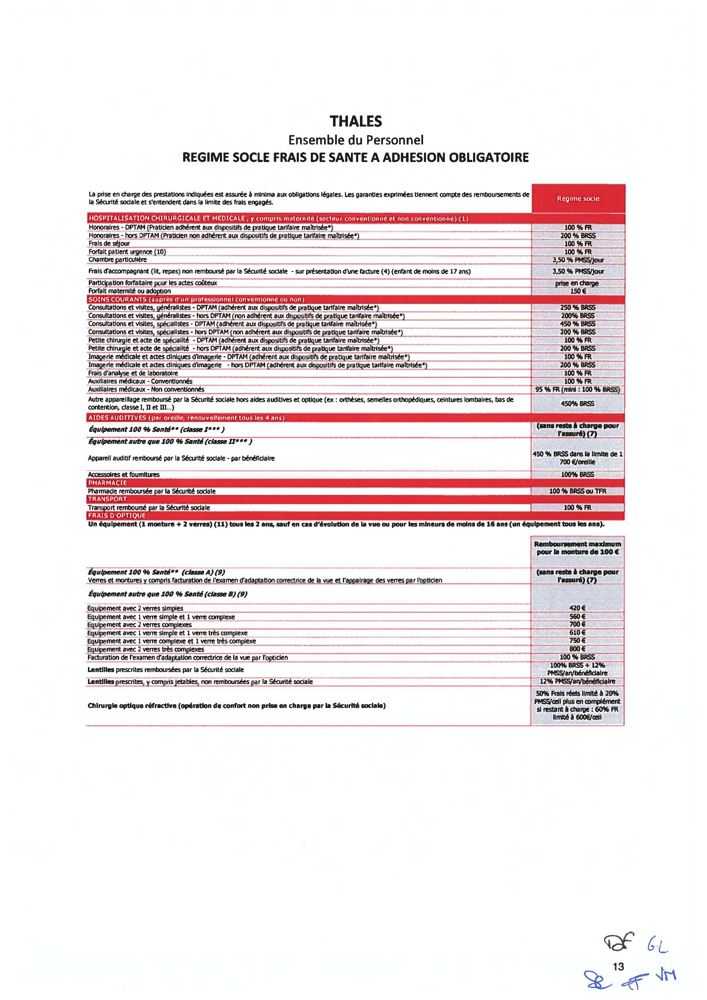
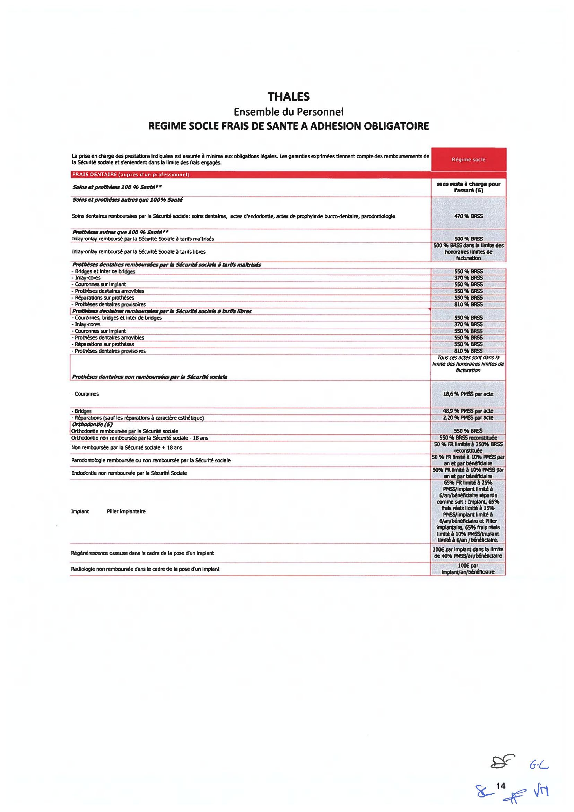
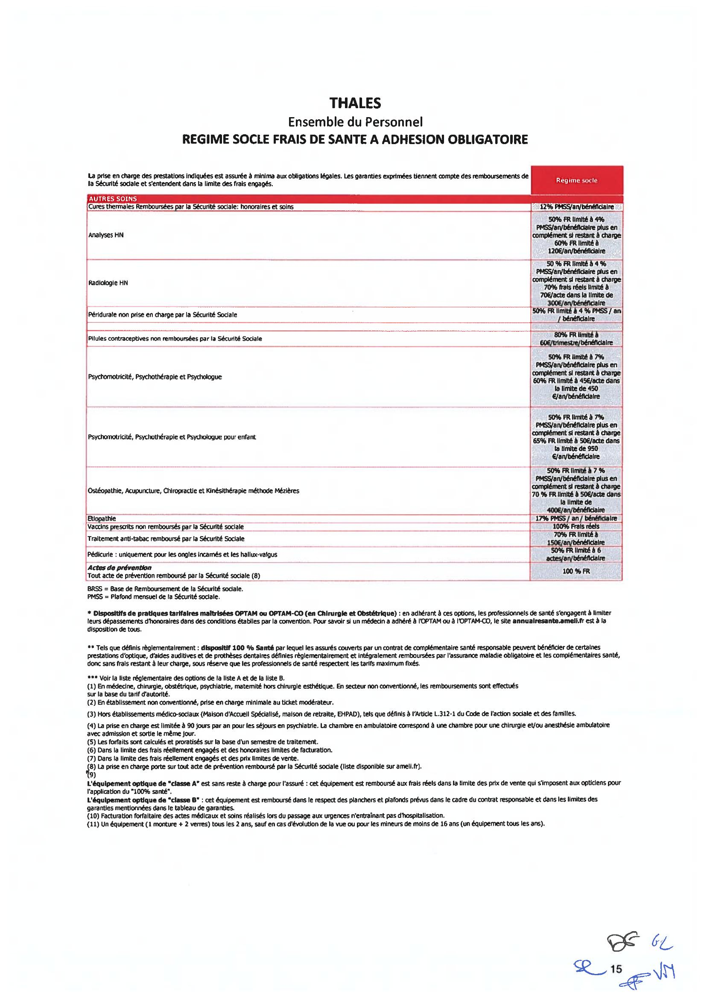
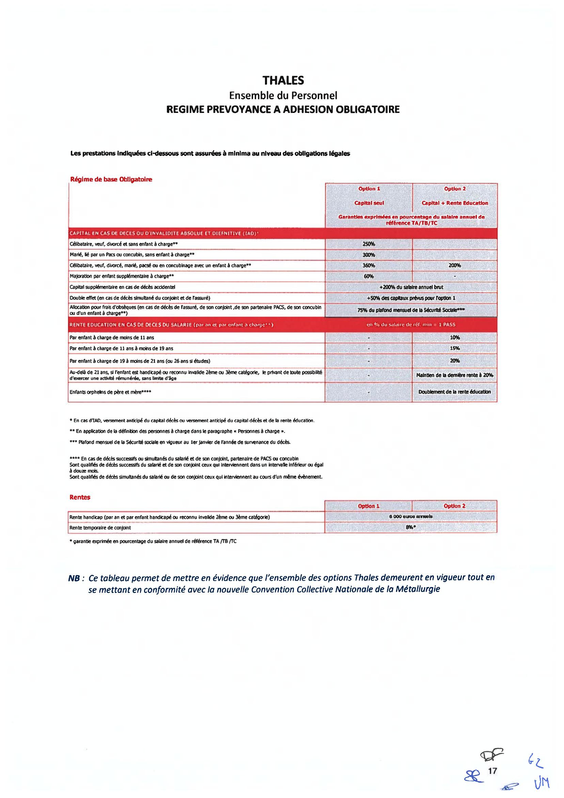
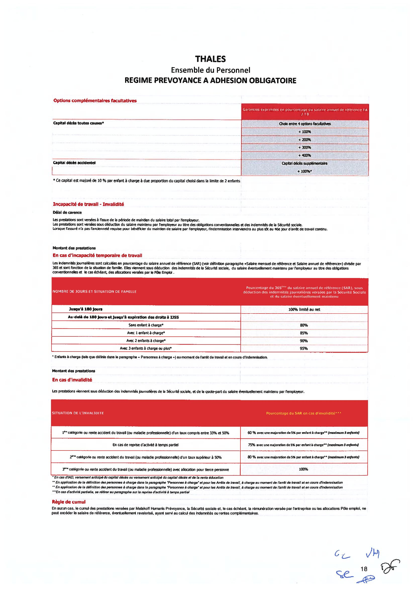

# Avenant N°3 à l'Accord Groupe relatif aux garanties Frais de santé et Prévoyance du Groupe Thales

## Préambule

Depuis 2006, les salariés du Groupe Thales bénéficient de garanties de prévoyance et de frais de santé dans le cadre d'un dispositif collectif unique et obligatoire, répondant au souci de développer une protection sociale complète et uniforme pour l'ensemble des salariés du groupe, quelle que soit l'entreprise dont ils relèvent.

Afin d'adapter ces dispositifs aux évolutions législatives et réglementaires, et de la doctrine administrative, les partenaires sociaux ont conclu le 20 décembre 2019 un accord de groupe relatif aux garanties de frais de santé et de prévoyance du Groupe Thales.

Depuis lors, les partenaires sociaux de branche ont conclu, le 7 février 2022, une nouvelle Convention Collective Nationale (CCN) de la métallurgie dont les dispositions relatives à la protection sociale complémentaire entreront en vigueur au 1er janvier 2023.

Conformément à l'article 5 de l'annexe 9 de la CCN du 7 février 2022 relative à la *« Définition d'un socle minimal de garanties de frais de soins de santé et en prévoyance de la branche de la métallurgie »* et de l'article L. 2253-1 du code du travail, les organisations syndicales représentatives au sein du Groupe Thales ainsi que l'employeur ont entendu, dans le cadre du présent avenant, procéder à la mise en conformité des régimes de frais de santé et de prévoyance en vigueur afin d'adapter les dispositions de ces régimes à un niveau au moins équivalent à celui défini au niveau de la branche.

Le présent avenant vise en outre à mettre en conformité les régimes précités avec les nouvelles exigences de l'administration telles que reprises dans la fiche « Protection sociale complémentaire » du Bulletin Officiel de la Sécurité Sociale, notamment celles relatives aux cas de suspension du contrat de travail.

Les dispositifs formalisés dans le présent accord et dans le contrat d'assurance y afférant sont mis en œuvre conformément aux prescriptions des articles L. 242-1, L. 862-4, L. 871-1 et L. 911-7 du code de la sécurité sociale et de l'article 83, 1° quater du code général des impôts ainsi que des décrets pris en application de ces textes.

Il a été décidé ce qui suit, en application de l'article L. 911-1 du code de la sécurité sociale :

---

## Section 1 : Dispositions communes à la santé et à la prévoyance

### Article 1 : Degré élevé de solidarité et fonds social Thales

La section 1 est complétée d'un article 1.7 – *Degré élevé de solidarité* rédigé comme suit :

*« 1.7 – Degré élevé de solidarité*

*Les partenaires sociaux de la branche de la Métallurgie ont prévu, à l'article 22 de l'annexe n°9 de la CCN de la métallurgie du 7 février 2022, tel que modifié par l'avenant du 1er juillet 2022, que les sociétés sont tenues d'affecter au financement des actions et prestations du degré élevé de solidarité (DES), au moins 2 % de la cotisation HT sur les primes d'assurance des contrats collectifs frais de santé et prévoyance lourde au titre des garanties socles et des garanties additionnelles obligatoires, **ou un budget équivalent**.*

*Le groupe Thalès a donc décidé, de mettre en place un budget équivalent dédié au financement de tout ou partie des actions énumérées à l'annexe n° 9.2 de la CCN de la métallurgie du 7 février 2022, tel que modifié par l'avenant du 1er juillet 2022, pour un montant total de 2% de la cotisation HT sur les primes d'assurance des contrats collectifs frais de santé et prévoyance lourde au titre des garanties socles et des garanties additionnelles obligatoires.*

*Un suivi de l'utilisation de ce budget et des actions menées sera réalisé annuellement en commission paritaire, courant du dernier trimestre de l'année, afin de s'assurer de l'utilisation de ce budget et examiner les actions pouvant être mises en place pour l'année suivante.*

*Dans ce cadre, certaines actions de préventions sont déjà en place, telles que :*

- *le bilan santé …*
- *les actions de prévention des Troubles Musculosquelettiques*
- *la semaine de la santé au travail*
- *les campagnes de vaccination organisées dans les locaux du Groupe*

*Le plan d'actions « prévention santé » relevant du degré élevé de solidarité (DES) sera arrêté lors de la première réunion de la Commission paritaire Santé/Prévoyance prévue à cet effet qui sera organisée en janvier 2023 et au cours de laquelle la question des alternants pourra éventuellement être abordée. »*

---

## Section 2 : Dispositif de remboursement des frais de santé

### Article 2 – Garanties

L'article 2.3 de l'accord du 20 décembre 2019 est remplacé par les stipulations suivantes :

*« Les prestations telles qu'en vigueur à la date de prise d'effet du présent régime sont résumées, à titre d'information, dans le document joint à l'annexe 2.*

*Elles respectent les dispositions légales et conventionnelles (résultant en dernier lieu de la CCN de la métallurgie du 7 février 2022).*

*Elles relèvent de la seule responsabilité de l'organisme assureur tout comme les modalités, limitations et exclusions de garantie ». »*

### Article 3 – Cotisations

L'article 2.4.1 de l'accord du 20 décembre 2019 est remplacé par les stipulations suivantes :

*« Article 2.4.1 - Taux et assiette de cotisation*

*A titre informatif, la cotisation servant au financement du régime est fixée en pourcentage du salaire tel que soumis aux cotisations de sécurité sociale au sens de l'article L. 242-1 du code de la sécurité sociale à :*

- *3,14 % de la tranche 1 ;*
- *2,18 % de la tranche 2, dans la limite de 4 plafonds de la sécurité sociale.*

*Pour information, la tranche 1 correspond au salaire jusqu'à une fois le plafond de la sécurité sociale et la tranche 2, au salaire compris entre 1 et 8 fois le plafond de la sécurité sociale.*

*Le plafond mensuel de la sécurité sociale est fixé chaque année par voie réglementaire.*

*La cotisation ouvre droit au bénéfice des garanties pour le salarié et ses ayants droit, telles que définis dans le contrat d'assurance et la notice d'information remise aux salariés qui sont affiliés à titre obligatoire.*

*L'assiette des cotisations pour le personnel travaillant à temps partiel est calculée sur le salaire réel ». »*

L'article 2.4.2 de l'accord du 20 décembre 2019 est remplacé par les stipulations suivantes :

*« Les cotisations servant au financement du contrat d'assurance seront prises en charge par l'entreprise et par les salariés dans les proportions suivantes :*

- *Personnel cadres et assimilés relevant de l'article 2.1, de l'article 2.2 de l'accord national interprofessionnel (ANI) du 17 novembre 2017 relatif à la prévoyance des cadres, et ceux relevant de l'article 36 de l'annexe I à la CCN de retraite et de prévoyance des cadres du 14 mars 1947, tel qu'il était en vigueur au 31 décembre 2018, catégorie agréée par l'APEC :*
  - *Part employeur : 50 % ;*
  - *Part salarié : 50 %.*
- *Personnel non-cadres ne relevant ni de l'article 2.1, ni de l'article 2.2 de l'ANI du 17 novembre 2017 relatif à la prévoyance des cadres, ni de l'article 36 précité :*
  - *Part employeur : 55 % ;*
  - *Part salarié : 45 %. »*

Il est toutefois précisé, conformément à l'article 166-1 de la CCN de la Métallurgie, tel qu'il résulte de l'avenant du 1er juillet 2022, que les catégories d'emplois mentionnées au présent article sont, pour l'année 2023, les suivantes :

- **Personnel relevant de l'article 2.1 de l'ANI du 17 novembre 2017 :** Sont visés les salariés relevant de la catégorie des ingénieurs et cadres, telle que définie aux articles 1er, 21 et 22 de la CCN des ingénieurs et cadres de la Métallurgie du 13 mars 1972 ;

- **Personnel relevant de l'article 2.2 de l'ANI du 17 novembre 2017 :** Sont visés les salariés dont l'emploi est classé au moins 2e échelon du niveau V de la classification définie par l'accord national du 21 juillet 1975 sur la classification ;

- **Personnel relevant des dispositions conventionnelles de l'article 36** de la CCN de retraite et de prévoyance des cadres du 14 mars 1947 tel qu'il était en vigueur au 31 décembre 2018, catégorie agréée par l'APEC : Sont visés les salariés dont l'emploi est du niveau IV, Echelon II, Coefficient 270, au niveau V, Echelon I, Coefficient 305. Par exception, les quelques salariés du niveau III, Echelon II, Coefficient 225 au niveau IV, Echelon I, Coefficient 255 qui cotisaient, continueront à relever des dispositions conventionnelles de l'Article 36 de la Convention Collective Nationale de retraite et donc de cotiser (Groupe fermé).

A compter du 1er janvier 2024, en application de l'article 62.3 de la nouvelle CCN de la Métallurgie, les catégories d'emplois mentionnées au présent article sont les suivantes :

- **Personnel relevant de l'article 2.1 de l'ANI du 17 novembre 2017 :** Sont visés les salariés relevant des emplois **classés au moins F11** de la nouvelle classification de branche prévue au Titre V de la nouvelle CCN de la Métallurgie ;

- **Personnel relevant de l'article 2.2 de l'ANI du 17 novembre 2017 :** Sont visés les salariés relevant des emplois **classés au moins E9** de la nouvelle classification de branche prévue au Titre V de la nouvelle CCN de la Métallurgie ;

- **Personnel relevant de l'article 36** de l'annexe I à la CCN de retraite et de prévoyance des cadres du 14 mars 1947, tel qu'il était en vigueur au 31 décembre 2018, catégorie agréée par l'APEC : Sont visés les salariés relevant des emplois **classés au moins C6** de la nouvelle classification de branche prévue au Titre V de la nouvelle CCN de la Métallurgie.

### Article 4 – Maintien des garanties en cas de suspension du contrat de travail

L'article 2.6 de l'accord du 20 décembre 2019 est remplacé par les stipulations suivantes :

*« Article 2.6.1 : Salariés dont la suspension du contrat de travail est indemnisée :*

*L'adhésion des salariés et de leur(s) ayant(s) droit est maintenue en cas de suspension de leur contrat de travail, quelle qu'en soit la cause, dès lors qu'ils bénéficient, pendant cette période :*

- *d'un maintien de salaire, total ou partiel ;*
- *d'indemnités journalières complémentaires financées au moins en partie par la société ;*
- *d'un revenu de remplacement versé par l'employeur (notamment, lorsque les salariés sont placés en activité partielle ou en activité partielle de longue durée, ainsi que toute période de congé rémunéré par l'employeur).*

*Dans une telle hypothèse, la société verse la même contribution que pour les salariés actifs pendant toute la période de suspension du contrat de travail indemnisée. Parallèlement, le salarié doit obligatoirement continuer à acquitter sa propre part de cotisations.*

*Par exception, les garanties frais de santé sont maintenues à titre gratuit pour les salariés ne percevant plus de salaire et bénéficiant au titre du présent accord, des indemnités d'incapacité temporaire de travail ou d'invalidité et à conditions que le régime de prévoyance soit souscrit auprès du même organisme assureur.*

*Article 2.6.2 : Salariés dont la suspension du contrat de travail n'est pas indemnisée :*

*Conformément à l'article 9.2.b) de l'annexe 9 de la CCN de la Métallurgie, les salariés dont la suspension du contrat de travail ne donne lieu à aucune indemnisation voient le bénéfice de leurs garanties frais de santé suspendu pour la période.*

*Sont notamment concernés les salariés en congé sabbatique, en congé parental d'éducation total, en congé sans solde, etc.*

*Pendant la période de suspension du contrat de travail non indemnisée, les garanties sont toutefois maintenues au bénéfice du salarié pendant le mois au cours duquel intervient cette suspension et le mois civil suivant dès lors qu'il y aura eu paiement de la cotisation pour le mois en cours. De fait, aucune cotisation n'est due pour le mois civil suivant.*

*Toutefois, ces salariés auront la possibilité de continuer à adhérer au régime au-delà de la période de suspension visée à l'alinéa précédent, sous réserve de s'acquitter de l'intégralité de la cotisation (part patronale et salariale).*

*La cotisation afférente aux garanties précitées est réglée directement par le salarié auprès de l'organisme assureur.*

*Article 2.6.3 : Salariés en période de réserves militaires ou policières :*

*Conformément à l'article 9.2.c) de l'annexe 9 de la CCN de la Métallurgie, les salariés dont le contrat de travail est suspendu pour effectuer une période de réserve (militaire ou policière) voient leur régime frais de santé maintenu, sous réserve qu'ils s'acquittent de la cotisation salariale afférente.*

*Dans une telle hypothèse, la société verse la même contribution que pour les salariés actifs pendant toute la période de suspension du contrat de travail indemnisée. Parallèlement, le salarié doit obligatoirement continuer à acquitter sa propre part de cotisations. »*

---

## Section 3 : Dispositif de prévoyance

### Article 5 – Garanties

L'article 3.3 de l'accord du 20 décembre 2019 est remplacé par les stipulations suivantes :

*« Les garanties telles qu'en vigueur à la date de prise d'effet du présent régime sont résumées, à titre d'information, dans le document joint à l'annexe n° 3.*

*Elles respectent les dispositions légales et conventionnelles (résultant en dernier lieu de la CCN de la métallurgie du 7 février 2022) et préservent l'architecture actuelle tout en mettant en conformité les garanties le nécessitant.*

*Elles relèvent de la seule responsabilité de l'organisme assureur tout comme les modalités, limitations et exclusions de garantie ». »*

### Article 6 : Cotisations du dispositif de prévoyance

L'article 3.4.1 de l'accord du 20 décembre 2019 est remplacé par les stipulations suivantes :

*« Article 3.4.1 : Taux et assiettes des cotisations et répartition*

*A compter du 1er janvier 2023, la contribution patronale est modifiée comme précisé dans le tableau ci-après.*

**Personnel non-cadres** ne relevant ni de l'article 2.1, ni de l'article 2.2 de l'ANI du 17 novembre 2017 relatif à la prévoyance des cadres, ni de l'article 36 de la CCN du 14 mars :

|                  | T1    | T2 (salaire compris entre 1 à 4 plafonds) |
|------------------|-------|-------------------------------------------|
| Part patronale   | 0,72% | 1,50%                                     |
| Part salariale   | 0,40% | 0,30%                                     |
| **Total**        | **1,12%** | **1,80%**                             |

**Personnel cadres et assimilés** relevant de l'article 2.1, de l'article 2.2 de l'ANI du 17 novembre 2017, et ceux relevant de l'article 36 de la CCN du 14 mars 1947 :

|                  | T1    | T2 (salaire compris entre 1 à 4 plafonds) | T2 (salaire compris entre 4 et 8 plafonds) |
|------------------|-------|-------------------------------------------|---------------------------------------------|
| Part patronale   | 1,12% | 1,12%                                     | 1,12%                                       |
| Part salariale   | 0%    | 0,68%                                     | 1,75%                                       |
| **Total**        | **1,12%** | **1,80%**                             | **2,87%**                                   |

*Pour information, la tranche 1 correspond au salaire jusqu'à une fois le plafond de la sécurité sociale et la tranche 2, au salaire compris entre 1 et 8 fois le plafond de la sécurité sociale. Le plafond mensuel de la sécurité sociale est fixé chaque année par voie réglementaire. »*

Les catégories d'emplois pour 2023 et à compter de 2024 sont identiques à celles décrites à l'article 3 ci-dessus (cotisations frais de santé).

*Compte tenu des résultats du régime de prévoyance et du montant des réserves, les cotisations ci-dessus définies feront l'objet d'un taux d'appel à 90% pour les années 2023 et 2024, diminuant à due concurrence le montant des cotisations payées au titre de ces exercices. Le taux de répartition des cotisations entre l'employeur et le salarié reste inchangé.*

*Par la suite, le maintien ou non du taux d'appel dépendra des résultats techniques du régime et du niveau des réserves.*

*Ainsi, si l'analyse des comptes de résultat de l'année N, réalisée courant du premier semestre de l'année suivante (N+1) dans le cadre de la commission paritaire THALES, laisse apparaitre un résultat équilibré, le taux d'appel sera maintenu au 1er janvier de l'année qui suit (N+2).*

*A contrario, si l'analyse des comptes de résultat de l'année N, réalisée courant du premier semestre de l'année suivante (N+1) dans le cadre de la commission paritaire THALES, fait ressortir un résultat déficitaire le taux d'appel sera supprimé au 1er janvier de l'année qui suit (N+2) et les taux de cotisations contractuels s'appliqueront.*

### Article 7 : Maintien du régime de prévoyance en cas de suspension du contrat de travail

L'article 3.7 relatif à la suspension du contrat de travail est remplacé par les stipulations suivantes :

*« Article 3.7.1 : Salariés dont la suspension du contrat de travail est indemnisée*

*L'adhésion des salariés est maintenue en cas de suspension de leur contrat de travail, quelle qu'en soit la cause, dès lors qu'ils bénéficient, pendant cette période :*

- *d'un maintien de salaire, total ou partiel ;*
- *d'indemnités journalières complémentaires financées au moins en partie par la société ;*
- *d'un revenu de remplacement versé par l'employeur (notamment, lorsque les salariés sont placés en activité partielle ou en activité partielle de longue durée, ainsi que tout période de congé rémunéré par l'employeur).*

*Dans une telle hypothèse, la société verse la même contribution que pour les salariés actifs pendant toute la période de suspension du contrat de travail indemnisée. Parallèlement, le salarié doit obligatoirement continuer à acquitter sa propre part de cotisations.*

*Par exception, les garanties décès sont maintenues à titre gratuit pour les salariés ne percevant plus de salaire et bénéficiant au titre du présent accord, des indemnités d'incapacité temporaire de travail ou d'invalidité prévues par le régime de prévoyance.*

*L'assiette des cotisations et des prestations pour la garantie incapacité des salariés en suspension du contrat de travail indemnisée par un revenu de remplacement versé par l'employeur, est égale au montant brut dudit revenu de remplacement (indemnité légale), le cas échéant complété d'une indemnisation complémentaire ou conventionnelle versé par l'employeur.*

*S'agissant des garanties décès et invalidité, l'assiette des cotisations et des prestations des salariés précités est la rémunération antérieure à la suspension indemnisée du contrat de travail (soit les salaires des 12 derniers mois).*

*Article 3.7.2 : Salariés dont la suspension du contrat de travail n'est pas indemnisée :*

*Conformément à l'article 15.2.b) de l'annexe 9 de la CCN de la Métallurgie, les salariés dont la suspension du contrat de travail ne donne lieu à aucune indemnisation voient le bénéfice de leurs garanties prévoyance suspendu pour la période.*

*Sont notamment concernés les salariés en congé sabbatique, en congé parental d'éducation total, congé pour création d'entreprise, en congé sans solde, etc.*

*Pendant la période de suspension du contrat de travail non indemnisée, les garanties sont toutefois maintenues au bénéfice du salarié pendant le mois au cours duquel intervient cette suspension et le mois civil suivant dès lors qu'il y aura eu paiement de la cotisation pour le mois en cours. De fait, aucune cotisation n'est due pour le mois civil suivant.*

*Toutefois, ces salariés auront la possibilité de demander à rester affiliés au contrat collectif, au titre de la seule garantie décès, au-delà de la période de suspension visée à l'alinéa précédent, sous réserve de s'acquitter de l'intégralité de la cotisation (part patronale et salariale).*

*La cotisation afférente aux garanties précitées est réglée directement par le salarié auprès de l'organisme assureur.*

*Article 3.7.3 : Salariés en période de réserves militaires ou policières :*

*Conformément à l'article 15.2.c) de l'annexe 9 de la CCN de la Métallurgie, les salariés dont le contrat de travail est suspendu pour effectuer une période de réserve (militaire ou policière) voient leur régime frais de santé maintenu, sous réserve qu'ils s'acquittent de la cotisation salariale afférente.*

*Dans une telle hypothèse, la société verse la même contribution que pour les salariés actifs pendant toute la période de suspension du contrat de travail indemnisée. Parallèlement, le salarié doit obligatoirement continuer à acquitter sa propre part de cotisations. »*

---

## Section 4 – Fonctionnement du présent avenant

### Article 8.1 – Périmètre de l'avenant

Le présent avenant est applicable dans l'ensemble des sociétés relevant du périmètre du groupe tel que défini à l'annexe n° 1, conformément à l'article L. 2232-30 du code du travail.

En cas d'intégration d'une nouvelle société française au sein du groupe Thales, les parties signataires s'engagent, dans un délai de six mois et sous réserve de l'adaptation des dispositions conventionnelles en vigueur dans cette société, à conclure un accord formalisant l'entrée de celle-ci dans le périmètre de l'avenant.

### Article 8.2 – Durée de l'avenant

L'accord est conclu pour une durée indéterminée et prend effet le 1er janvier 2023. Il se substitue, s'agissant des stipulations identifiées, à toutes les dispositions résultant d'accords collectifs, d'accords ratifiés à la majorité des intéressés, de décisions unilatérales ou de toute autre pratique en vigueur, dans les entreprises rentrant dans le périmètre de l'avenant.

### Article 9 : Dépôt et publicité

Conformément aux articles L. 2231-6 et D. 2231-4 et suivants du code du travail, un exemplaire du présent avenant sera déposé sur la plateforme de téléprocédure du ministère du travail dans sa version signée par les parties ainsi que dans sa version anonymisée. Un exemplaire sera également déposé auprès du secrétariat greffe du conseil de prud'hommes du lieu de sa conclusion. L'accord sera publié sur la base de données nationale prévue par l'article L.2231-5-1 du code du travail.

En outre, un exemplaire sera établi pour chaque partie. Le présent avenant sera notifié à l'ensemble des organisations syndicales représentatives dans l'entreprise et non signataires de celui-ci sous la forme électronique.

Enfin, en application des articles R.2262-1, R.2262-2 et R.2262-3 du Code du travail, il sera transmis aux représentants du personnel et mention de cet accord sera faite sur les panneaux réservés à la direction pour sa communication avec le personnel ainsi que sur l'intranet.

---

Fait en 6 exemplaires originaux. A Paris-la-Défense, le 20/12/2022

**Pour le Groupe Thales :** Monsieur Pierre GROISY, Directeur des Relations sociales, de la Protection sociale et DRH de Thales SA, en sa qualité d'employeur de la société dominante.

**Pour les Organisations Syndicales représentatives au niveau du Groupe, les coordonnateurs syndicaux centraux :**

| CFDT                 | CFE-CGC | CFTC | CGT |
|----------------------|---------|------|-----|
| P.O. SANDRINE CORANT | P.O.    | Véronique MICHAUT | Grégory LEWANDOWSKI |

---

## Annexe 1 – Périmètre d'application de l'accord

**GBU AVS**
- Thales AVS France SAS
- Thales Avionics Electrical Motors SAS
- Thales Avionics Electrical Systems SAS
- Thales Simulation & Training SAS
- Trixell

**GBU DMS**
- Thales DMS France SAS
- UMS SAS

**GBU LAS**
- Thales LAS France SAS

**GBU SIX**
- Thales SIX GTS France SAS
- Thales Services Numériques SAS
- Thales Cloud Sécurisé
- RCS France SAS
- GTS France SAS
- Ercom
- Suneris

**GBU ESPACE**
- Thales Alenia Space SAS
- Thales Seso SAS

**GBU DIS**
- Thales DIS France SAS

**Entités Corporate**
- Thales S.A.
- Thales International SAS
- Geris Consultants SAS
- Thales Global Services SAS
- Thales Digital Factory SAS

---

## Annexe 2 – Résumé des garanties frais de santé en vigueur au 1er janvier 2023

---

## Annexe 3 – Résumé des garanties de prévoyance en vigueur au 1er janvier 2023

