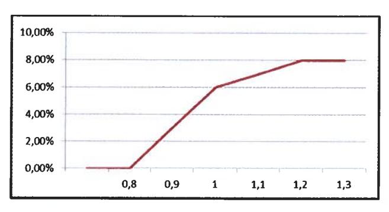

# ACCORD GROUPE SUR L'INTERESSEMENT 2023 - 2024 - 2025

## **SOMMAIRE**

| SOMMAIRE                                                                                                                                  | 2  |
|-------------------------------------------------------------------------------------------------------------------------------------------|----|
| PRÉAMBULE                                                                                                                                 | 3  |
| Article 1 : Champ d'application                                                                                                           | 4  |
| Article 2 : Evolution du périmètre                                                                                                        | 4  |
| Article 3 : Bénéficiaires                                                                                                                 | 5  |
| Article 4 : Nature des sommes versées au titre de l'intéressement                                                                         | 5  |
| Article 5 : Calcul de l'intéressement global distribuable                                                                                 | 5  |
| Article 6 : Critères de répartition                                                                                                       | 9  |
| Article 8 : Information du Comité social économique central (société multi-établissemer social économique (entreprise mono-établissement) |    |
| Article 9 : Versement des sommes issues de l'intéressement                                                                                | 11 |
| Article 10 : Information des bénéficiaires                                                                                                | 12 |
| Article 12 : Entrée en vigueur et durée de l'accord                                                                                       | 13 |
| Article 13 : Différends                                                                                                                   | 13 |
| Article 14 : Notification et dépôt                                                                                                        | 13 |

## **PRÉAMBULE**

L'accord de Groupe sur l'intéressement signé le 5 juin 2020 entre la Direction et l'ensemble des Organisations syndicales représentatives au niveau du groupe Thales est arrivé à échéance le 31 décembre 2022.

Dans ce cadre, la Direction et les Organisations syndicales se sont réunies pour définir les modalités d'un nouvel accord afin de garantir la possibilité de versement d'un intéressement à l'ensemble des salariés relevant du périmètre du Groupe pour les trois prochaines années.

Ce nouvel accord d'intéressement mutualisé réaffirme la volonté des parties signataires d'associer l'ensemble des salariés aux résultats et à l'amélioration des performances du Groupe tout en garantissant une répartition équitable par le dispositif de mutualisation que les parties ont souhaité maintenir.

Cet accord souligne ainsi la volonté l'attachement des parties au principe de solidarité permettant de renforcer l'appartenance à une même communauté de travail autour d'objectifs communs.

Pour ce faire, conformément aux articles L. 3311-1 et suivants du Code du travail, il est institué un régime d'intéressement des salariés du groupe Thales (ci-après « le Groupe ») régi :

- par les dispositions susvisées et par les textes ultérieurs les complétant ou les modifiant,
- par les stipulations du présent accord.

Enfin, les parties, qui rappellent que le versement de l'intéressement a, par nature, un caractère aléatoire et variable, acceptent le résultat tel qu'il peut ressortir des calculs chaque année.

L'intéressement global distribuable sera réparti chaque année entre les bénéficiaires, en partie proportionnellement à la rémunération du bénéficiaire et en partie en fonction de sa durée de présence au cours de l'exercice de référence.

Les sociétés visées en annexe du présent accord attestent par ailleurs qu'elles satisfont aux obligations leur incombant en matière de représentation du personnel.

## Article 1 : Champ d'application

Le présent accord est applicable au sein du Groupe Thales. Il est conclu entre (i) la société Thales, entreprise dominante agissant pour son compte et, sur mandat, pour celui des sociétés entrant dans le périmètre du présent accord et (ii) les organisations syndicales représentatives au niveau du Groupe Thales, et constitue de ce fait un accord de Groupe au sens des articles L. 2232-30 et suivants du Code du travail.

Ont vocation à intégrer le présent accord toutes les sociétés françaises quel que soit leur effectif dont le capital est détenu directement ou indirectement à plus de 50 % par Thales.

Les sociétés dont le capital est détenu par Thales à hauteur de 50% seront intégrées au présent accord sous réserve que Thales y exerce une influence dominante au sens de l'article L 2331-1 du Code du travail.

La condition d'appartenance au Groupe Thales, telle que définie au présent article, est une condition déterminante de son application à chaque société concernée. La sortie d'une société du périmètre du Groupe rend impossible l'application du présent accord à cette société et à ses salariés, au sens du 2ème alinéa de l'article L. 3313-4 du code du travail, selon les modalités mentionnées à l'article 2.

Au jour de la signature du présent accord, celui s'applique aux sociétés du Groupe Thales visées en annexe 1.

## Article 2 : Evolution du périmètre

Toute nouvelle société intégrant le Groupe après la signature du présent accord, parce qu'elle vient à satisfaire aux critères d'appartenance ci-dessus définis, sera adhérente de plein droit au présent accord, sous réserve :

- de ne pas être liée par un accord d'intéressement qui lui serait propre au titre des exercices visés par le présent accord,
- de la signature d'un avenant constatant la volonté d'adhésion de cette nouvelle société et qui ne devra être signé que par les représentants employeurs et salariés de cette dernière, selon l'une des modalités prévues à l'article L. 3312-5 du Code du travail.

L'avenant d'adhésion sera déposé à la DREETS du siège social de la société Thales et à la DREETS du siège social de la société concernée et sera signifiée aux autres parties signataires du présent accord.

Dès lors qu'une société ne remplirait plus la condition d'intégration dans le périmètre du présent accord, prévue à l'article 1, l'accord ne pourra s'appliquer à cette société. La Direction de Thales notifiera à la Direction de la société concernée sa sortie du champ d'application de l'accord d'intéressement Groupe.

La sortie d'une société du périmètre du présent accord sera également notifiée aux signataires de l'accord ainsi qu'aux DREETS des lieux de dépôt du présent accord.

En cas de sortie du Groupe d'une société relevant du périmètre du présent accord en cours d'exercice, cette société cessera de bénéficier du présent accord à la date de clôture de l'exercice précédent.

## Article 3 : Bénéficiaires

Sont bénéficiaires du présent accord les salariés (à temps complet ou à temps partiel, en CDD ou en CDI, y compris ceux bénéficiant d'un contrat de formation en alternance) des entreprises du Groupe telles que visées à l'article 1 du présent accord, sous réserve de justifier d'une ancienneté de trois mois dans le Groupe à la date de clôture de l'exercice pour les salariés présents à l'effectif à cette date, ou à la date de départ du salarié en cours d'exercice s'il n'est plus présent à cette date.

Pour le calcul de l'ancienneté, sont pris en compte tous les contrats de travail exécutés au cours de la période de calcul et des 12 mois qui la précèdent.

Les périodes de simple suspension du contrat de travail ne sont pas déduites pour le calcul de l'ancienneté.

## Article 4: Nature des sommes versées au titre de l’intéressement

Les sommes versées au titre de l'intéressement ne peuvent se substituer à aucun des éléments de rémunération. Elles n'ont pas le caractère d'élément de salaire pour l'application de la législation du travail et ne sont pas soumises à cotisations et charges sociales.

Les sommes versées au titre de l'intéressement, à la date de conclusion du présent accord, sont assujetties à la C.S.G. (Contribution Sociale Généralisée) à la C.R.D.S. (Contribution au Remboursement de la Dette Sociale) et, dans les entreprises d'au moins 250 salariés, au forfait social au taux en vigueur.

Elles sont intégrées dans l'assiette de l'impôt sur le revenu des bénéficiaires sauf affectation dans un plan d'épargne Groupe/entreprise ou dans le Plan d'Epargne Retraite d'Entreprise COllectif (PERECO) dans les 15 jours à compter de leur perception, cette affectation emportant exonération d'impôt sur le revenu des sommes considérées dans la limite d'un montant égal à 3/4 du plafond annuel de la sécurité sociale.

### Article 5: Calcul de l’intéressement global distribuable

L'intéressement global pour un exercice donné, à répartir entre les salariés des sociétés du Groupe visées à l'article 1, résulte de l'addition des contributions des sociétés parties au présent accord.

Chaque contribution pour un exercice donné, calculée selon les modalités indiquées ci-après, est plafonnée pour chaque entité de telle sorte que le montant de sa contribution à l'intéressement global, ajouté à sa contribution à la réserve spéciale de participation prise en compte dans le
cadre de l'accord de participation mutualisée n'excède pas 8 % de sa masse salariale brute¹ (plafond P + I).

Dans le cas où, au titre d'un exercice donné, la contribution d'une société à la réserve spéciale de participation prise en compte dans le cadre de l'accord de participation mutualisée excède 8 % de sa masse salariale brute, l'entité considérée ne contribuera pas à l'intéressement global distribuable.

Toutefois, le plafond P + I pourrait être relevé dans les conditions suivantes :

#### Au titre de l'année 2024,

- Si la marge d'EBIT du Groupe arrêtée à la fin de l'année 2023 est supérieure ou égale à 12 % et inférieure à 12,3 %, alors le plafond P + I applicable sera relevé à 9 % de la masse salariale.
- Si la marge d'EBIT du Groupe arrêtée à la fin de l'année 2023 est supérieure ou égale à 12,3 %, alors le plafond P + I applicable sera relevé à 9,5 % de la masse salariale.

#### Au titre de l'année 2025

- Si la marge d'EBIT du Groupe arrêtée à la fin de l'année 2024 est supérieure ou égale à 12 % et inférieure à 12,3 %, alors le plafond P + I applicable sera relevé à 9 % de la masse salariale.
- Si la marge d'EBIT du Groupe arrêtée à la fin de l'année 2024 est supérieure ou égale à 12,3 % et inférieure à 13 %, alors le plafond P + I applicable sera relevé à 9,5 % de la masse salariale.
- Si la marge d'EBIT du Groupe arrêtée à la fin de l'année 2024 est supérieure ou égale à 13 %, alors le plafond P + I applicable sera relevé à 10 % de la masse salariale.

| Intéressement & Participation                        | Valeur du plafond P+I au titre de l'exercice considéré                                                                                                                          |  |  |
|------------------------------------------------------|---------------------------------------------------------------------------------------------------------------------------------------------------------------------------------|--|--|
| Intéressement & Participation 2023 (versé en 2024) | • 8%                                                                                                                                                                            |  |  |
| Intéressement & Participation 2024 (versé en 2025) | <ul> <li>8 % si EBIT 2023 &lt; 12 %</li> <li>9 % si EBIT 2023 ≥ 12% et &lt; 12,3%</li> <li>9,5 si EBIT 2023 ≥ 12,3%</li> </ul>                                                  |  |  |
| Intéressement et Participation 2025 (versé en 2026) | <ul> <li>8 % si EBIT 2024 &lt; 12 %</li> <li>9 % si EBIT 2024 ≥ 12% et &lt; 12,3 %</li> <li>9,5 % si EBIT 2024 ≥ 12,3% et &lt; 13%</li> <li>10 % si EBIT 2024 ≥ 13 %</li> </ul> |  |  |

>1 brut fiscal sur l'année civile, incluant la rémunération des expatriés

L'intéressement global distribuable est, en toute circonstance, plafonné à 20 % de la masse des salaires bruts versés dans l'ensemble des entreprises entrant dans le périmètre du présent accord.

#### a. <u>Pour les sociétés Thales SA, Thales International, Thales Global Services, Geris et Thales</u> Digital Factory

La contribution de chacune des sociétés sera déterminée, avant plafonnement éventuel, sur la base de la progression du résultat opérationnel courant Groupe (périmètre Thales S.A., filiales France et Etranger) avant restructuration et PPA (comptabilisation des regroupements d'entreprise) et hors variation de périmètre de l'année considérée par rapport aux trois années précédentes selon la formule suivante :

###### Contribution entité = K1 \* 3% de la masse salariale de l'entité pour l'année N

K1 est égal à 0 si le ratio [ROC Groupe N / ROC Groupe N-1, N-2, N-3] est inférieur à 0,8 et varie de 50% à 130 % par tranche au-delà suivant le barème suivant :

| R = ROC Groupe année N / ( ROC Groupe années N-1, N-2 et N-3 ) | <b>K</b> 1 |
|----------------------------------------------------------------|------------|
| R < 0,8                                                        | 0%         |
| 0.8 < ou = R < 0.85                                            | 50%        |
| 0.85 < ou = R < 0.9                                            | 75%        |
| 0.9 < ou = R < 0.95                                            | 85%        |
| 0,95 < ou = R < 1                                              | 95%        |
| 1 < ou = R< 1,1                                                | 100%       |
| 1,1 < ou = R< 1,2                                              | 120%       |
| R > ou = 1,2                                                   | 130%       |

A titre d'exemple, lorsque le ratio ROC Groupe année N / ROC Groupe moyenne des années N-1, N-2 et N-3 est égal à 1,05, la contribution de l'entité est égale à : 100% \* 3% de la masse salariale de l'entité pour l'année N.

#### b. Pour la société Thales DIS France SAS

La contribution de la société Thales DIS France SAS sera déterminée, avant plafonnement éventuel, sur la base de la progression du résultat opérationnel courant de la GBU DIS pour Thales DIS France, avant restructuration (et hors charges de participation/intéressement).

Le ROC budgété de la GBU DIS est basé sur le budget, tel que fixé par la Direction générale du Groupe Thales et en normes IFRS telles qu'utilisées dans les remontées dans Magnitude.

Ainsi, la contribution de la société Thales DIS France SAS sera déterminée selon la formule suivante :

###### Contribution entité = K2 \* 3% de la masse salariale de l'entité pour l'année N

K2 est égal à 0 si le ratio [ROC réalisé GBU / ROC budgété] est inférieur à 0,8 et varie de 50 % à 130 % par tranche au-delà suivant le barème suivant :

| ROC réalisé         | K2   |  |
|---------------------|------|--|
| ROC budgété         | NZ   |  |
| R < 0,8             | 0%   |  |
| 0.8 < ou = R < 0.85 | 50%  |  |
| 0,85 < ou = R < 0,9 | 75%  |  |
| 0.9 < ou = R < 0.95 | 85%  |  |
| 0,95 < ou = R < 1   | 95%  |  |
| 1 < ou = R< 1,1     | 100% |  |
| 1,1 < ou = R< 1,2   | 120% |  |
| R > ou = 1,2        | 130% |  |

#### c. Pour les autres sociétés relevant du périmètre du Groupe

La contribution de chacune des autres sociétés à l'intéressement global est déterminée, avant plafonnement éventuel, sur la base du niveau d'atteinte de l'objectif de progrès du résultat d'exploitation de la société considérée apprécié au travers du ratio ROC réalisé / ROC budgété selon la formule suivante :

###### Contribution entité = K3 \* ROC

- Où ROC est égal au résultat opérationnel courant de la société avant restructurations (et hors charges de participation/intéressement), tel que remonté dans Magnitude (IFRS),
- Où la valeur de K3 varie de façon linéaire de 0% en cas de ratio ROC réalisé / ROC budgété inférieur à 0,8 à 6% en cas de ratio ROC réalisé / ROC budgété égal à 1 et de façon linéaire de 6% en cas de ratio de ROC réalisé / ROC budgété égal à 1 à 8% en cas ratio de ROC réalisé / ROC budgété supérieur ou égal à 1,2 :

\* réel/ budget < 0,8 = 0

budget atteint = 6%

réel/budget 1,1 = 7%

réel / budget 1,2 = 8%

Cette formule de calcul sera applicable aux sociétés qui intégreront le périmètre du Groupe dans les conditions prévues à l'article 2.

### Article 6: Critères de répartition

Les parties signataires décident que la répartition de l'intéressement global distribuable sera réalisée de façon mutualisée entre les salariés bénéficiaires tels que définis à l'article 3.

L'intéressement global distribuable est réparti entre les bénéficiaires :

- à hauteur de 40 % du montant de l'intéressement global distribuable proportionnellement à la rémunération perçue par chaque salarié au cours de l'exercice considéré, cette rémunération perçue par chaque salarié au cours de l'exercice considéré, cette rémunération perçue par chaque salarié au cours de l'exercice considéré, cette rémunération perçue par chaque salarié au cours de l'exercice considéré, cette rémunération perçue par chaque salarié sociale, et d'un plafond égal à 3 fois ce même plafond. Sont éligibles à l'intéressement sur le critère rémunération les salariés en situation de MAD, DAR temps de compensation et congé de fin de carrière. Pour les périodes assimilées à une période de présence au sens du présent article, le salaire pris en compte correspond au salaire qui aurait été versé si le salarié avait travaillé pendant la période concernée.

- à hauteur de 60 % du montant de l'intéressement global distribuable en fonction de la durée de présence dans une ou plusieurs entreprises du Groupe au cours de l'exercice considéré.

Sont assimilées à des périodes de présence :

- les périodes de congé de maternité, de congé de paternité et d'accueil de l'enfant, de congé d'adoption et de congé de deuil,
- les périodes de suspension du contrat de travail consécutives à un accident du travail ou à une maladie professionnelle,
- les périodes de mécénat de compétences, transfert de savoirs et de compétences,
- les heures chômées au titre d'une période d'activité partielle de l'entreprise,
- les périodes de mise en quarantaine au sens du 2ème alinéa du I de l'article L. 3131-1 du Code de la santé publique,
- les périodes d'utilisation en temps du CET hors congé de fin de carrière correspondantes aux alimentations en temps.

Plus généralement, sont assimilées à une période de présence toutes les périodes légalement assimilées de plein droit à du travail effectif et rémunérées comme tel. Les autres absences cumulées inférieures à 30 jours ne sont pas déduites de la durée de présence.

Ne sont pas assimilés à une période de présence le temps passé en temps de compensation, congé de fin de carrière, mise à disposition sans obligation permanente d'activité (MAD). Les salariés à temps partiel sont considérés comme salariés à temps plein au regard du critère de répartition relatif à la durée de présence.

Le montant de l'intéressement individuel est plafonné dans les conditions définies à l'article 7.

### Article 7 : Plafonnement légal des droits individuels

L'intéressement individuel calculé en application de l'article 6 attribué à un bénéficiaire ne peut, au titre d'un exercice, excéder les 3/4 du plafond annuel de la sécurité sociale.

Ce plafond est calculé au prorata de la durée d'appartenance à une ou plusieurs entreprises du Groupe pour les bénéficiaires n'ayant appartenu à une ou plusieurs entreprises du Groupe que pendant une partie de l'exercice.

Les parts d'intéressement individuels non attribuées du fait de ce plafonnement légal ne sont pas réparties entre les autres salariés bénéficiaires de l'accord.

### Article 8 : <u>Information du Comité social et économique central (société multi-établissements)</u> / Comité social et économique (société mono-établissement)

Chaque année, avant le versement effectif, les données servant au calcul du montant de l'intéressement Groupe pour l'exercice écoulé et le montant de l'intéressement ainsi dégagé seront présentés au Comité social et économique (société mono-établissement) ou au Comité social et économique central (société multi-établissements) de chaque société entrant dans le périmètre d'application du présent accord.

Parmi les informations présentées, figureront entre autre pour la société concernée :

- Le ROC budgété
- Le ROC réalisé
- Le montant de la contribution remontée par la société concernée
- La totalité de la contribution remontée par l'ensemble des sociétés du Groupe

### Article 9 : Versement des sommes issues de l'intéressement

Le versement de l'intéressement au salarié est effectué au plus tard avant le 1er jour du 6ème mois suivant la clôture de l'exercice au titre duquel l'intéressement est dû. Tout versement de l'intéressement au-delà de cette date produira des intérêts égaux à 1,33 fois le taux moyen de rendement des obligations des sociétés privées.

Chaque répartition individuelle de l'intéressement fait l'objet d'une fiche distincte du bulletin de paie, adressée à chaque bénéficiaire et mentionnant notamment :

- le montant global de l'intéressement,
- le montant moyen perçu par les bénéficiaires,
- le montant des droits attribués à l'intéressé,
- le montant retenu au titre de la contribution sociale généralisée et de la contribution au remboursement de la dette sociale,
- le délai à partir duquel les droits nés de l'investissement de l'intéressement sur les plans d'épargne entreprise et/ou Groupe applicables dans l'entreprise sont négociables ou exigibles et les cas dans lesquels ces droits peuvent être exceptionnellement liquidés ou transférés avant l'expiration de ce délai,
- les modalités d'affectation par défaut au plan d'épargne d'entreprise et/ou Groupe des sommes attribuées au titre de l'intéressement lorsque le bénéficiaire ne formule pas de demande de versement ou d'affectation des fonds pour tout ou partie des sommes qui lui sont attribuées.

Elle comporte en annexe une note rappelant les règles essentielles de calcul et de répartition prévues par le présent accord.

Tout bénéficiaire pourra affecter tout ou partie de sa prime d'intéressement au plan d'épargne de Groupe (ou plan d'épargne d'entreprise le cas échéant), au PERECO ainsi qu'au Compte Epargne Temps Groupe ou en demander le versement immédiat.

Chaque bénéficiaire devra faire connaître son choix dans un délai de 15 jours à compter de la date à laquelle il a été informé du montant qui lui a été attribué en retournant un questionnaire qui lui sera adressé avant chaque versement.

A défaut de réponse du bénéficiaire dans le délai requis, les droits à intéressement seront affectés au fonds d'épargne salariale présentant le profil d'investissement le moins risqué parmi les supports du Plan d'Epargne Groupe.

### Article 10 : Information des bénéficiaires

L'accord d'intéressement fera l'objet d'une note d'information, mentionnant notamment les dispositions prévues à l'article D. 3313-11 du Code du travail, qui sera remise à toutes les personnes concernées par cet accord.

Un livret d'épargne salariale conforme aux dispositions du Code du travail, présentant l'ensemble des dispositifs d'épargne salariale en vigueur au sein de la société, est établi sur tout support durable et est remis à chaque salarié lors de la conclusion de son contrat de travail.

Chaque répartition individuelle de l'intéressement fera l'objet d'une information individuelle selon les modalités prévues à l'article 9 du présent accord relatif au « versement des sommes issues de l'intéressement ».

Lorsqu'un salarié susceptible de bénéficier de l'intéressement quitte son entreprise avant que ses droits aient pu être calculés, l'entreprise quittée prend note de l'adresse à laquelle il pourra être informé de ses droits et lui demande de l'avertir de ses changements d'adresse éventuels.

Lorsque l'intéressé ne peut pas être atteint à la dernière adresse indiquée par lui, les sommes auxquelles il peut prétendre sont tenues à sa disposition par l'entreprise quittée pendant une durée d'un an courant à compter de la date limite de versement de l'intéressement, telle que définie à l'article L 3314-9 du Code du travail. Passé ce délai, les sommes sont remises à la Caisse des dépôts et consignations où l'intéressé peut les réclamer jusqu'au terme de la prescription légale.

En outre, tout bénéficiaire quittant une entreprise du Groupe reçoit un état récapitulatif de l'ensemble de ses avoirs en épargne salariale dans les conditions prévues par le Code du travail.

### Article 11 : Suivi de l'application de l'accord

L'application du présent accord est suivie par le Comité social et économique (société monoétablissement) ou le Comité social et économique central (société multi-établissements) de chacune des entreprises parties à l'accord. Les comités concernés seront informés chaque année des éléments de calcul de l'intéressement et des modalités de sa répartition.

Le comité social et économique (société mono-établissement) ou le Comité social et économique central (société multi-établissements) de chaque société est régulièrement informé de l'évolution prévue des éléments retenus pour la détermination du montant de l'intéressement.

### Article 12 : Entrée en vigueur et durée de l'accord

L'accord est valable pour une durée de trois exercices (c'est-à-dire les exercices 2023, 2024 et 2025).

Il ne pourra être dénoncé ou modifié par avenants que par l'ensemble des parties signataires dans les mêmes formes que sa conclusion.

Par exception, la dénonciation unilatérale par l'une des parties est admise, en application des articles L. 3345-2 et L. 3313-3 du Code du travail, lorsqu'elle fait suite à une contestation par l'administration de la légalité de l'accord, intervenue dans les délais prévus par les dispositions en vigueur, et a pour objet la renégociation d'un accord conforme aux dispositions législatives et réglementaires.

La dénonciation ou l'avenant sera adressé à la DREETS selon les mêmes formalités et délais que l'accord lui-même.

### Article 13: Différends

Les différends qui pourraient surgir dans l'application du présent accord ou de ses avenants sont examinés aux fins de règlement par la direction de la Société Thales, chargée de sa mise en œuvre et l'ensemble des parties signataires.

Pendant toute la durée du différend, l'application de l'accord se poursuivra conformément aux règles qu'il a énoncées.

A défaut de règlement amiable, le différend sera soumis aux juridictions compétentes par la partie la plus diligente.

### Article 14 : Notification et dépôt

Conformément aux dispositions législatives et réglementaires en vigueur, le texte du présent accord sera notifié à l'ensemble des organisations syndicales représentatives au niveau du Groupe et déposé par la Direction des Ressources Humaines du Groupe sous forme électronique, en un exemplaire PDF signé et un exemplaire sous format Word anonymisé, sur la plateforme de téléprocédure du ministère du travail et en un exemplaire au Secrétariat du Greffe du Conseil des Prud'hommes de Nanterre.

Fait à Courbevoie en 6 exemplaires originaux, le 21 Juin 2023

Pour la Société Thales : Monsieur Clément de VILLEPIN, Directeur Général des Ressources Humaines Groupe, dominante.

Pour les Organisations Syndicales représentatives au niveau du Groupe, les coordonnateurs
syndicaux centraux:

CFDT : Anthony PERROCHEAU  
CFE-CGC : Marc CRUCIANI  
CFTC : Stéphane KHATTI  
CGT :  P.O. Thierry DUBERT  

 

## ANNEXE 1 - Périmètre du Groupe

### **GBU AVS**

Thales AVS France SAS 
Thales Avionics Electrical Motors SAS 
Thales Avionics Electrical Systems SAS 
Thales Simulation & Training SAS 
Trixell

### **GBU DMS**

Thales DMS France SAS

### **GBU LAS**

Thales LAS France SAS

### **GBU SIX**

Thales SIX GTS France SAS 
Thales Services Numériques SAS 
GTS France SAS 
RCS France SAS 
Thales Cloud Sécurisé 
Ercom 
Suneris 
Thales Cyber Solutions 

### **GBU ESPACE**

Thales Alenia Space SAS  
Thales Seso SAS

### <u>GBU DIS</u>

Thales DIS France SAS

### **Entités Corporate**

Thales S.A.  
Thales International SAS  
Geris Consultants SAS  
Thales Global Services SAS  
Thales Digital Factory SAS
