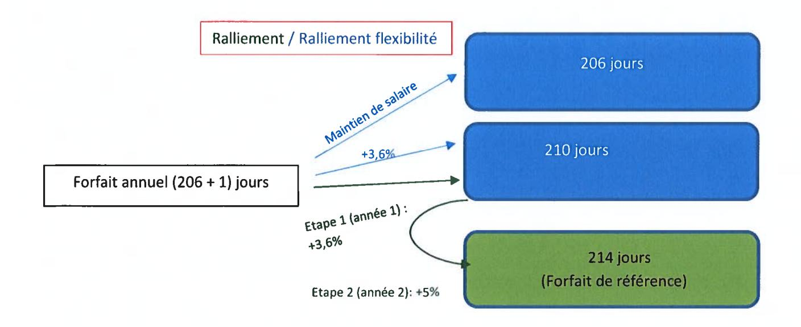
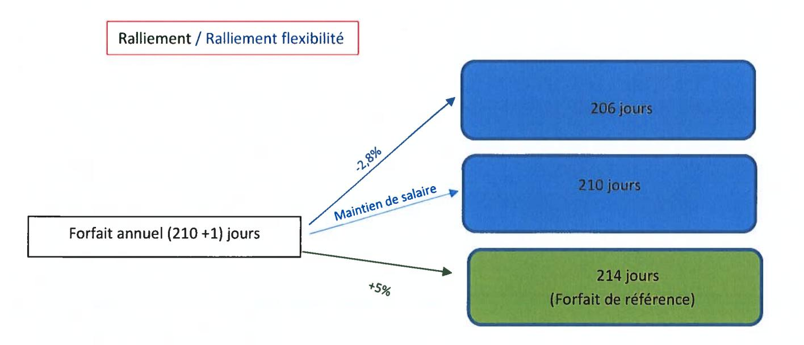
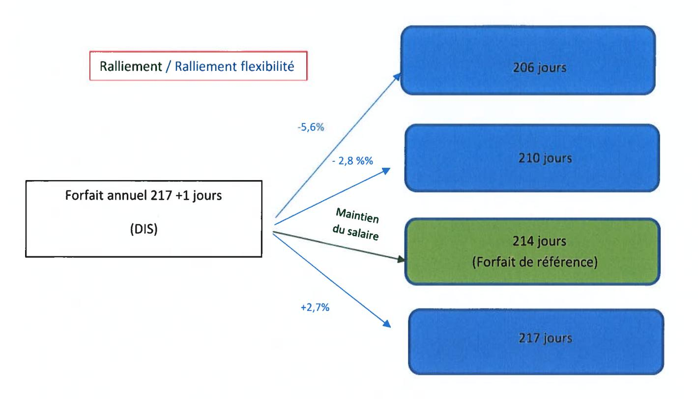
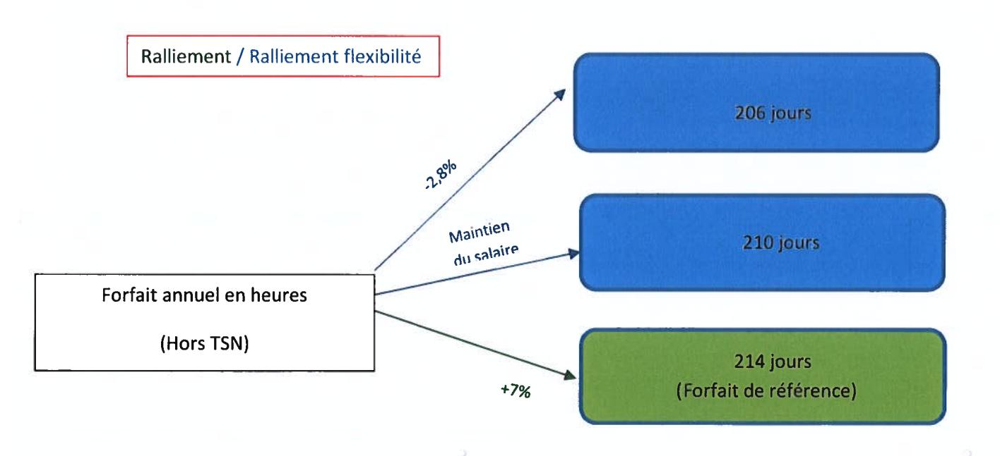
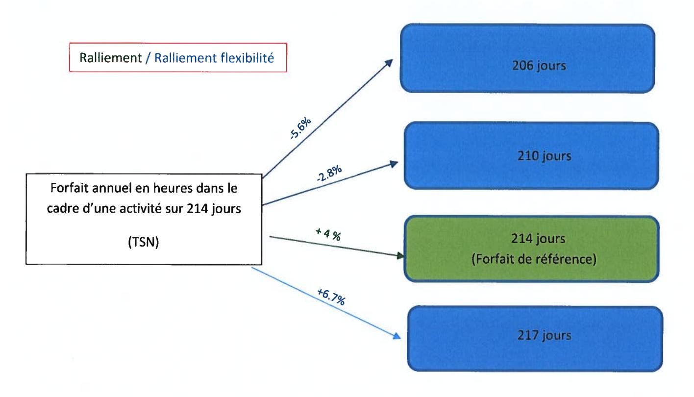
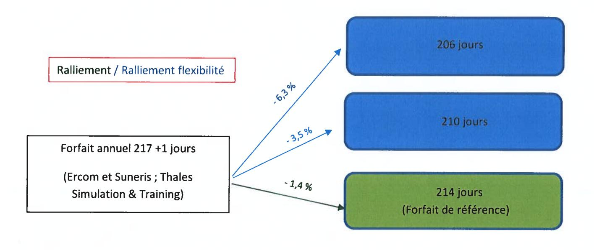

# ACCORD GROUPE SUR LE TEMPS ET L'ORGANISATION DU TRAVAIL

## **SOMMAIRE**

## **PREAMBULE**

Dans les années 2000, le Groupe a cherché à mettre en place une organisation commune du temps de travail sur la base d'un accord cadre et d'accords société.

Depuis cette date, le Groupe a connu de nombreuses évolutions, celles-ci se traduisant par une grande disparité du temps et des modes d'organisation du travail au sein du Groupe ainsi qu'une certaine complexité dans les dispositifs existants.

Dans ce cadre et par la conclusion du présent accord, les parties entendent :

- simplifier et harmoniser le cadre général de la durée du travail et de l'organisation du temps de travail au sein du Groupe ;
- mieux considérer les besoins d'autonomie et de responsabilité des salariés dans l'organisation du temps de travail en permettant, sur la base du volontariat et de la réversibilité, une flexibilité du temps de travail;
- évaluer, partager et assurer un suivi régulier de la charge de travail ;
- garantir l'adéquation entre charge de travail et temps de travail afin de favoriser un meilleur équilibre vie professionnelle / vie personnelle conformément aux principes de l'accord Groupe Qualité de Vie au Travail conclu le 20 avril 2018;
- faciliter les mobilités au sein du Groupe ;
- définir le cadre général de l'organisation et du temps de travail des salariés mensuels, des salariés dont l'emploi relève des groupes d'emploi A à E - et placer la négociation de leur organisation et temps de travail au niveau des sociétés et des établissements;
- définir les prévisions d'emploi (alternants, stagiaires, seniors) ainsi que le niveau de recrutement tenant compte du niveau d'activité de chaque société relevant du périmètre du Groupe;
- prendre en compte les situations de pénibilité;
- fixer le périmètre du présent accord.

Pour ce faire, le présent accord :

- i. reprend les dispositions générales applicables à l'ensemble des salariés en matière de durée et d'organisation du temps de travail, en rappelant l'importance de la prise en compte de la qualité de vie au travail dans l'organisation du travail et de garantir un juste équilibre entre les temps de vie ;
- ii. fixe le forfait annuel en jours de référence dans le Groupe Thales et pérennise les mécanismes de flexibilité du temps de travail ;
- iii. précise que les cadres dont l'emploi les amène à travailler de manière structurelle et permanente dans le cadre d'un horaire fixe relèveront du régime horaire applicable aux salariés dont l'emploi relève des groupes d'emploi A à E de la nouvelle Convention collective nationale de la métallurgie ;
- iv. donne la possibilité aux salariés soumis à une convention individuelle de forfait annuel en heures d'opter pour le forfait annuel en jours de référence ;
- v. définit le cadre applicable en matière de temps de travail et d'organisation du travail pour les salariés Mensuels et à compter du 1er janvier 2024, des salariés dont l'emploi relève des groupes d'emploi A à E;
- vi. reprend pour partie les dispositifs introduits par l'Accord Groupe sur l'évolution de la Croissance et l'Emploi signé le 23 février 2017 et dont l'application s'est arrêtée le 31 mars 2022.

## **CHAPITRE I – DISPOSITIONS GENERALES**

### Article 1 - Champ d'application de l'Accord

Le présent accord (ci-après désigné l'« Accord ») est conclu dans le cadre des dispositions du Code du travail relatif aux accords collectifs de groupe, entre la Direction de la société Thales et les organisations syndicales représentatives au niveau du groupe Thales. Il est directement applicable dans l'ensemble des entités relevant du périmètre du Groupe tel que défini à l'Annexe 1 du présent Accord.

En cas d'intégration d'une nouvelle société française au sein du groupe Thales, les Parties s'engagent à examiner les conditions dans lesquelles ladite société rejoindrait le périmètre de l'Accord dans un délai de six (6) mois.

A l'exception des articles 3.5, 16 et 17 relatifs à l'emploi des seniors, les dispositions du présent accord ne sont pas applicables aux cadres dirigeants qui s'entendent des cadres auxquels sont confiées des responsabilités dont l'importance implique une grande indépendance dans l'organisation de leur emploi du temps qui sont habilités à prendre des décisions de façon largement autonome et bénéficient d'une rémunération parmi les plus élevées de leur entreprise. A titre d'information et au sein du Groupe, les Cadres IIIC réunissent ces critères à la date de signature du présent accord.

Au sein du Groupe, ces salariés ne bénéficient pas de jours de repos.

Les dispositions du présent accord ne sont pas non plus applicables aux salariés détachés à l'étranger qui, pendant le temps de leur mission, sont soumis, en ce qui concerne le temps de travail, à la législation du pays d'accueil sous réserve du respect des dispositions légales françaises relatives aux durées maximales de travail quotidien et hebdomadaire et au temps de repos minimal quotidien et hebdomadaire.

### Article 2 – Période de référence

La période de référence en matière de durée et d'organisation du travail est l'année civile.

Les parties conviennent que l'intégralité des jours non travaillés (jours de repos ou jours de réduction du temps de travail) seront positionnés au cours de l'année par le salarié. La prise des jours de RTT/repos correspondant se fera dès l'ouverture de la période de référence.

Les éventuels jours de fermeture collective, pris sur les congés payés, sont déterminés par les établissements/les sociétés, dans le cadre de la négociation annuelle sur la rémunération, le temps de travail et le partage de la valeur ajoutée.

### Article 3 - Le temps de travail effectif

#### 3.1 Temps constituant du temps de travail effectif

Conformément aux dispositions de l'article L. 3121-1 du Code du travail, le temps de travail effectif est le temps pendant lequel le salarié est à la disposition de l'employeur et se conforme à ses directives sans pouvoir vaquer librement à des occupations personnelles. Le temps consacré aux visites médicales, ainsi que le temps d'habillage et de déshabillage sont pris sur le temps de travail.

Les temps de trajet et de déplacement au cours d'une journée entre deux lieux de travail constituent du temps de travail effectif.

Cette définition sert de référence notamment pour le calcul des durées maximales de travail.

#### 3.2 Temps assimilé à du temps de travail effectif pour le calcul des droits à congés payés et au titre de l'ancienneté

Les périodes de congés (qu'ils soient légaux ou conventionnels), les jours fériés chômés ou les jours de réduction du temps de travail ou de repos ne sont pas considérés comme du temps de travail effectif. Ils sont néanmoins pris en compte pour le calcul des congés payés et de l'ancienneté.

Il est précisé que les temps de formation à l'initiative de l'employeur ainsi que les temps de formations syndicales sont assimilés à du temps de travail effectif dans les conditions prévues par les dispositions légales.

#### 3.3 Temps de repos quotidien et hebdomadaire minimal

Chaque salarié devra observer, par jour, un temps de travail de 10 heures maximum ainsi qu'un temps de repos minimal quotidien de 12 heures entre deux journées de travail consécutives et un temps de repos hebdomadaire de 36 heures (24 + 12 heures).

#### 3.4 Forfait jours et journée de solidarité

Le forfait jours de référence est fixé à 214 jours de travail par an, y incluant la journée de solidarité, fixée le Lundi de Pentecôte, qui demeure travaillée, à l'exception des stagiaires et des alternants.

#### 3.5 Congés supplémentaires liés à l'ancienneté

Dans un souci d'une plus grande harmonisation, il est convenu que tous les salariés du Groupe bénéficieront, après deux ans d'ancienneté et quelle que soit leur classification, de cinq jours de congés supplémentaires liés à l'ancienneté à partir de l'âge de 30 ans.

Les salariés bénéficiant, à la date de signature de l'accord, de droits excédant les congés supplémentaires exposés ci-dessus conserveront le bénéfice de ceux-ci en groupes fermés à savoir :

- salariés de l'établissement de Cholet de Thales SIX GTS France qui bénéficient en population fermée de 6 jours de congés d'ancienneté,
- salariés de l'établissement de La Ferté Saint Aubin de Thales LAS France qui bénéficient en population fermée de 5 jours de congés d'ancienneté,
- salariés de Thales AVS France qui bénéficient en population fermée de 5 jours de congés d'ancienneté.

Les salariés de Thales DMS France et Thales LAS France conserveront par ailleurs le bénéfice des dispositions relatives aux jours supplémentaires pour ancienneté applicables aux salariés âgés de 61 ans et plus (Thales LAS France) et 62 ans et plus (Thales DMS France).

## CHAPITRE II – CHARGE DE TRAVAIL ET EQUILIBRE ENTRE LES TEMPS PROFESSIONNEL ET PERSONNEL

### Définition de la charge de travail

De manière générale, la charge de travail représente, pour un salarié, la somme des actions à mener, au regard de ses responsabilités et objectifs et des délais qui lui sont fixés pour les réaliser. Elle est également évaluée en tenant compte de la complexité du travail, des demandes faites au salarié, des ressources et des outils mis à sa disposition pour atteindre ses objectifs.

L'analyse de la charge de travail prend en compte trois dimensions :

- La charge de travail prescrite : induite par les objectifs fixés et mesurée par les indicateurs de résultat le cas échéant, en prenant en compte les éventuelles prescriptions médicales formulées ;
- La charge de travail ressentie : comment est-elle vécue par chacun et comment sont ressenties les contraintes de l'activité ;
- La charge de travail réelle : qui prend en compte les conditions dans lesquelles est réalisé le travail.

La charge de travail inclura notamment le travail prescrit, le travail sur les affaires et projets, la formation, le transfert de compétences, les tâches administratives, ainsi que les aléas éventuels sur les projets.

L'équilibre de la charge de travail repose sur l'adéquation des objectifs fixés avec les compétences, qualifications ainsi que le temps et les moyens dont le salarié dispose afin de réaliser ses missions.

Ainsi, chaque responsable hiérarchique s'assurera que la charge de travail des salariés de son équipe est compatible avec la réalisation des missions et objectifs. Pour ce faire, il tiendra compte des ressources mises à disposition du salarié, des interactions nécessaires avec ses pairs, de l'organisation en place et du niveau de responsabilité permettant de garantir la tenue des objectifs (autonomie).

### Article 4 - Suivi de la charge de travail pour l'ensemble des salariés

Les Parties rappellent qu'elles attachent une importance toute particulière à une évaluation et à un suivi régulier de la charge de travail des salariés, quel que soit leur niveau de classification.

Dans ce cadre, les responsables hiérarchiques partageront en amont avec leurs équipes, dans le cadre d'une discussion collective, les orientations générales et objectifs d'équipe qui devront être conduits sur l'année.

#### 4.1 Suivi individuel de la charge de travail

Jusqu'en 2019, le suivi de la charge de travail était organisé dans le cadre de l'entretien annuel d'activité. Au 1er janvier 2020, de nouvelles modalités d'échanges entre les salariés et leurs
responsables hiérarchiques ont été mises en place, modifiant les dispositifs préexistants de l'entretien annuel d'activité et de l'entretien de développement professionnel.

Dites « Check-In », ces discussions plus régulières, à l'initiative du salarié ou de son responsable hiérarchique, sont l'occasion de faire un point sur l'état d'avancement des objectifs, sur le développement professionnel des salariés et plus particulièrement de suivre et adapter la charge de travail du salarié et la bonne organisation du travail au sein de l'équipe.

En complément de ces échanges réguliers, les responsables hiérarchiques devront aborder avec les salariés de leur équipe, au cours de l'un des Check-in, partiellement dédié à cette discussion, le sujet relatif à sa charge de travail, tant prescrite que ressentie, permettant ainsi d'adapter les objectifs et les missions si nécessaires à l'organisation du travail de l'équipe, à l'équilibre des temps de vie et à l'exercice de son droit à la déconnexion.

De manière générale, un état des lieux de la charge, ainsi que l'adéquation des missions confiées au salarié au regard des moyens alloués et de son temps de travail seront partagés lors de cet échange afin, le cas échéant, d'adapter la charge de travail du salarié. Dans ce cadre, les salariés pourront adresser à leur responsable hiérarchique tout document permettant de prendre en compte la question de la charge de travail.

Cette discussion sera amorcée par l'envoi au salarié, via l'outil de gestion des Ressources Humaines (Workday à la date de signature du présent Accord) et préalablement à l'entretien, d'un questionnaire spécifique abordant ces différents sujets. Une synthèse de l'ensemble de ces discussions devra être formalisée dans l'outil informatique Ressources Humaines dédié à cet effet.

Si l'état des lieux réalisé à l'occasion de cet entretien conduit à l'évaluation d'une charge ne permettant plus d'assurer un juste équilibre entre vie personnelle et vie professionnelle, une adaptation des missions sera opérée. Par ailleurs et si cela est nécessaire, des actions correctrices seront examinées et partagées entre salarié et responsable hiérarchique.

Une attention particulière sera portée à la charge de travail :

- des salariés en situation de management à distance afin de conserver une proximité managériale et d'assurer un suivi rigoureux de la charge de travail,
- des salariés bénéficiant d'un double rattachement de manière à ce que leur charge de travail soit bien prise en compte.

L'évaluation de la charge doit en tout état de cause tenir compte de l'organisation matricielle et intégrer les missions transverses.

#### 4.2 Charge de travail excessive et sollicitation du responsable hiérarchique et/ou du responsable Ressources Humaines

Conformément aux dispositions conventionnelles en vigueur au sein du Groupe Thales, il revient aux responsables hiérarchiques, de veiller à ce que la charge de travail de leurs salariés permette de respecter un équilibre entre les temps de vie. Ils doivent notamment s'assurer d'une bonne répartition du travail entre les membres de leur équipe. Une attention particulière sera portée aux salariés en situation de handicap.

Les salariés s'adresseront à leur responsable hiérarchique et/ou à leur responsable Ressources Humaines dès qu'ils considèrent que leur charge de travail met en cause l'équilibre entre leur temps de travail et leur vie personnelle, ce afin de trouver les actions permettant de remédier à cette situation. En cas de difficultés, les salariés concernés pourront se faire éventuellement accompagner d'un représentant du Personnel (élu ou désigné). Un bilan trimestriel de ces démarches et des situations éventuelles de charge excessive sera adressé aux CSSCT.

### Article 5 - Equilibre entre le temps professionnel et le temps personnel

La maîtrise du temps de travail est assurée grâce à une bonne adéquation entre la charge de travail et les moyens en termes d'organisation et d'effectif. Dans ce cadre, les responsables hiérarchiques porteront une vigilance particulière à l'organisation et à la charge de travail des salariés, au respect des amplitudes des journées de travail, au respect des horaires d'ouverture des sites fixés par le règlement intérieur, au temps de repos minimum (12 heures entre 2 journées consécutives), à la prise de jours de repos/JRTT et des congés payés.

Les Parties à l'accord réaffirment toute l'importance accordée au sujet de l'équilibre entre la vie professionnelle et la vie personnelle et aux principes de l'Accord sur la Qualité de Vie et le Bien-Être au Travail au sein du Groupe Thales conclu le 20 avril 2018, visant à assurer aux salariés du Groupe un équilibre des temps de vie notamment en s'assurant de l'effectivité d'un droit à la déconnexion pour chacun, en rappelant les règles nécessaires à l'efficience des temps de réunion ou encore en rappelant aux supérieurs hiérarchiques leur rôle central en matière de suivi de la charge de travail de leurs salariés.

#### 5.1 Garantie d'un droit et devoir à la déconnexion

Le monde du travail est désormais caractérisé par la disponibilité de technologies de communication (courriels, ordinateurs portables, smartphones, tablettes, ...) qui facilitent le travail des salariés et des équipes, et l'accès à une information abondante et continue, qui conduisent à plus d'instantanéité et de complexité. Dans ce contexte, si ces nouvelles conditions renforcent la capacité d'action et la flexibilité, elles peuvent aussi induire des dépendances et une pression que chacun gère en fonction de son propre contexte, et rendre plus poreuse la frontière entre la vie professionnelle et la vie personnelle.

Les Parties à l'accord sont attachées à limiter les impacts négatifs de ces évolutions sur l'efficacité professionnelle, le collectif de travail, et la santé des salariés. La possibilité de travailler à tout moment et en tous lieux, que les technologies permettent, doit être prise en compte et gérée avec la plus grande attention.

C'est pourquoi le Groupe réaffirme que le droit à la déconnexion s'entend comme un droit pour chaque salarié de ne pas être sollicité en dehors de son temps de travail et doit bénéficier à l'ensemble des salariés du Groupe. Il confirme le rôle d'exemplarité qui incombe aux responsables hiérarchiques sur ce sujet et rappelle qu'aucun délai de réponse ne pourra être reproché aux salariés sollicités en dehors de leur temps de travail, ni faire l'objet, à ce titre d'une procédure disciplinaire (à l'exception des salariés sous astreinte qui doivent être disponibles et en capacité d'intervenir à tout moment).

Dans le cadre de l'Accord sur la Qualité de Vie et le Bien-Être au Travail, le Groupe avait pris des engagements concrets visant à assurer l'effectivité du droit à la déconnexion pour tous et à assurer
une régulation de l'utilisation des outils numériques afin d'assurer l'équilibre entre vie professionnelle et vie personnelle.

Il s'était notamment engagé à organiser des actions de sensibilisation pour les salariés lors de la semaine dédiée à la Qualité de Vie au Travail, à sensibiliser plus spécifiquement tous les responsables hiérarchiques dans le cadre du parcours de formation « Passeport management », à informer les salariés de la bonne utilisation des outils numériques et notamment la messagerie électronique. Dans le prolongement de ces actions, seront mises en œuvre, dans les six mois suivant la signature de l'accord, une formation en ligne et une sensibilisation en coordination avec le Médecin du service de santé au travail de l'établissement, destinées à l'ensemble des salariés, sur les risques de l'hyperconnectivité et le droit à la déconnexion.

Le dispositif prévoit également l'organisation d'un suivi entre responsable hiérarchique et salarié sur l'utilisation des outils numériques par ce dernier et ce, afin de s'assurer que charge de travail et exercice du droit à la déconnexion sont compatibles.

Une démarche visant à assurer une connexion maîtrisée et une utilisation efficiente des outils numériques a été déployée au sein de la société TGS. Les Parties conviennent que le bilan de cette initiative sera présenté à la Commission Centrale QVT afin d'étudier l'opportunité de déployer cette démarche à d'autres sociétés du Groupe. Les actions prises dans ce cadre seront partagées avec les organisations syndicales.

Une fenêtre d'alerte (pop-up) sera, dans les 6 mois suivant la date de signature de l'accord, également mise en place et déployée, chaque jour, 30 minutes avant l'heure de fermeture de l'établissement afin d'inviter les salariés du Groupe à quitter leur poste de travail. Cette fenêtre d'alerte demeurera active le week-end.

Préalablement à la mise en place de ces fenêtres pop-up, pour les établissements qui n'ont pas d'ores et déjà déployé un tel dispositif, une communication spécifique sera adressée à l'ensemble des salariés pour les informer de ce dispositif, et rappeler les règles d'utilisation des outils connectés et les principes du droit à la déconnexion.

Par ailleurs, de façon à s'assurer de l'effectivité du droit à la déconnexion, un bilan trimestriel sera réalisé par la Direction des Ressources Humaines au sein des services ou dans le cadre de projet transverses au sein desquels auraient été identifiées des situations de surcharge et présenté en CSSCT / CSE, afin de vérifier que les communications effectuées via la messagerie électronique au sein de l'équipe sont respectueuses du droit à la déconnexion de chacun de ses membres. Ce bilan prendra en compte les projets particuliers pouvant générer des connexions répétées hors du temps de travail habituel. Pour les situations de surcharge identifiées, un plan d'actions spécifiques sera proposé pour corriger cette situation, sauf conditions particulières pouvant l'expliquer.

Enfin, il sera réalisé au sein de chaque société une enquête générale tous les deux ans concernant le suivi de la charge et l'utilisation des outils informatiques par chaque salarié afin de mieux appréhender la nature de l'utilisation de ces outils et le respect des horaires de travail. Cette enquête, qui sera co-construite et partagée avec les Organisations syndicales représentatives du Personnel, devrait contribuer à ajuster la communication nécessaire pour une bonne utilisation des outils numériques, sensibiliser aux risques de l'hyper-connectivité et identifier les éventuels plans d'actions retenus.

Au terme de la première année de mise en œuvre de l'accord Groupe, un bilan sera fait avec les Instances représentatives du Personnel au niveau du Groupe, bilan qui sera communiqué aux CSEC/CSE.

#### 5.2 Heures de réunions

L'organisation des réunions doit favoriser le travail collaboratif essentiel au bon déroulement des activités et des projets transverses sans nuire à l'efficacité professionnelle et à la vie personnelle des salariés.

Les réunions de travail et les séminaires programmés se doivent de respecter les horaires habituels de travail de l'établissement.

Il est ainsi rappelé que les principes essentiels concourant à la qualité des temps de réunion énoncés dans le cadre de l'Accord sur la Qualité de Vie et le Bien-Être au Travail doivent être affichés dans l'ensemble des salles de réunion. Ces principes concernent notamment :

- Le respect des horaires de réunion prévus;
- L'encouragement à des réunions courtes, avec objectifs déterminés, un ordre du jour préétabli, la présence de participants en lien avec le sujet traité et un relevé de décision à l'issue;
- La prise en compte des contraintes personnelles dans le choix des dates et des horaires de réunion.

Les horaires de réunion doivent se tenir dans les plages des horaires de présence obligatoire de l'établissement (sauf situation d'urgence impactant la poursuite de l'activité). Ces réunions doivent tenir compte des pauses déjeuners et des impératifs familiaux et garantir ainsi l'équilibre des temps de vie.

#### 5.3 Procédure de sortie tardive

L'ensemble des sociétés du Groupe mettront en place une procédure de sortie tardive consistant à alerter les salariés et leur responsable hiérarchique, lorsque les horaires de sortie sont en dehors des horaires d'établissement. Dans ce cadre, a minima un suivi trimestriel précis sera réalisé au sein des Comités Sociaux et Economiques.

Une consolidation annuelle des sorties tardives recensées dans les sociétés sera par ailleurs communiquée au niveau du Groupe.

## **CHAPITRE III – DISPOSITIONS APPLICABLES AUX CADRES**

Les Cadres, à l'exception des Cadres Dirigeants qui ne sont pas assujettis aux règles du présent accord en matière de durée et d'organisation du travail, disposant d'une autonomie dans l'organisation de leur emploi du temps et dont la nature des fonctions les conduit à ne pas suivre l'horaire collectif applicable relèvent d'une convention individuelle de forfait annuel en jours dont les modalités sont exposées ci-après.

Les Parties attachent une importance particulière au respect de l'autonomie inhérente aux missions dévolues aux Cadres.

Cette autonomie consiste en la possibilité, pour le salarié, d'adapter le volume journalier de son temps de travail et la répartition journalière de ce temps en cohérence avec ses missions, le niveau de ses responsabilités et obligations professionnelles.

Quel que soit le type de forfait applicable et le volume de ce forfait, l'ensemble des dispositions du présent Accord et notamment les règles relatives à la charge de travail, à l'organisation du travail, à la proratisation des temps de repos en cas d'absence, au calcul des jours de repos (forfait annuel en jours) seront applicables à ces salariés dès leur entrée en vigueur.

Les Parties conviennent que les salariés Cadres qui bénéficient au jour de la signature du présent accord d'une convention de forfait annuel en heures ou d'une convention de forfait annuel en jours pourront rallier le forfait annuel en jours de référence prévu dans les modalités définies à l'article 6.1.5 du présent accord.

Par ailleurs, il est admis que les salariés des établissements de la société Thales LAS France, qui ne proposaient jusqu'alors que le forfait annuel en heures (établissements de Fleury les Aubrais, Limours, Rungis, Ymare, ainsi que Massy), conserveront, par exception, leur convention de forfait annuel en heures et se verront proposer, dans le cadre de cet accord, une convention de forfait annuel en jours. Il est toutefois précisé que Thales LAS France privilégiera la mise en œuvre du forfait annuel en jours qui traduit davantage l'autonomie dont disposent les cadres au sein du Groupe, tant pour les nouveaux embauchés que pour les salariés changeant d'emploi ou évoluant dans le cadre d'une mobilité. Tout ralliement au forfait annuel en jours de référence sera définitif.

Pour tout nouvel entrant Cadre (recrutements externes hors I/C position I ou, à compter du 1er janvier 2024, cadre du Groupe F classe 11), le forfait applicable sera le forfait jours défini à l'article 6, à l'exception des salariés dont la responsabilité conduit à travailler de manière structurelle – ou conjoncturelle supérieure à 6 mois – en horaires décalés (2X8 h, 3X8 h) ou dont le métier impose un horaire fixe qui suivront le régime horaire applicable aux salariés mensuels sans baisse de rémunération, et ce, pour toute la durée de leur activité sur ce dispositif d'organisation du travail. En cas d'évolution de leurs responsabilités, ils cesseront de bénéficier de ces dispositions et seront assujettis au forfait jours de référence.

Les Cadres position I (ou à compter du 1er janvier 2024, cadre du Groupe F classe 11) nouvellement embauchés, seront soumis au régime horaire applicable aux salariés des groupes d'emploi A à E dans leur société. Le contrat de travail des salariés concernés contiendra une convention de forfait en jours de référence automatiquement applicable à compter de 12 mois d'ancienneté, sous réserve de la
validation de la hiérarchie, formalisant ainsi l'autonomie qui leur est reconnue dans l'organisation de leur travail.

A compter du 1er janvier 2024, date d'entrée en vigueur de la nouvelle classification de la métallurgie, les Cadres du Groupe F, classe 11 nouveaux embauchés se verront appliquer le régime ci-dessus.

## Article 6 - Le forfait annuel en jours

### 6.1 Le forfait annuel en jours de référence

#### 6.1.1 Les caractéristiques du forfait annuel en jours de référence

Le forfait annuel en jours est un mode d'organisation du temps de travail des salariés permettant de comptabiliser la durée du travail, non plus en heures de travail, mais en jours de travail effectués sur l'année. Dans ce cadre, il est rappelé que par leur autonomie d'organisation du travail, tout salarié en forfait annuel en jours a toute liberté pour gérer la tenue de ses objectifs dans les délais fixés et peut donc s'absenter en cas de situation particulière sans avoir à poser de congés payés ou jours de repos. Toutefois, pour la bonne conduite des affaires, il est souhaitable que le salarié en informe sa hiérarchie.

Le forfait annuel en jours de référence applicable au sein du Groupe à compter de la date d'entrée en vigueur de l'accord est de 214 jours de travail effectif, y incluant la journée de solidarité, pour tout nouvel entrant dans la société, à l'exception des I/C position I (ou à compter du 1er janvier 2024, cadre du Groupe F classe 11) qui seront soumis au régime horaire applicable aux salariés mensuels tel que mentionné dans le préambule du présent chapitre. Ce forfait est défini par année civile de référence complète et pour un droit à prise intégrale de congés.

Dans le cadre d'une mobilité Groupe, le salarié ralliera le forfait de référence (214 jours) et pourra bénéficier immédiatement de la flexibilité telle que prévue à l'article 6.1.6.

Le forfait jours de référence est fixé à 214 jours de travail par an, y incluant la journée de solidarité, fixée le Lundi de Pentecôte, qui demeure travaillé, à l'exception des stagiaires et des alternants.

Le nombre de jours de repos correspondants à ce forfait est déterminé en tenant compte du nombre total de jours dans l'année, duquel sont déduits les jours de repos hebdomadaires, les jours de congés légaux, les jours fériés chômés tombant un jour ouvré au cours de la période de référence et les jours de congés de substitution de fractionnement qui sont attribués sans distinction à tous les salariés du Groupe conformément à l'article 4.1 de l'accord sur les dispositions sociales du 13 juin 2022.

Le nombre de jours de repos varie ainsi selon les années. Il sera communiqué chaque année par la Direction des Ressources Humaines de chaque entité en temps utile (Cf. Annexe 6).

Les forfaits en vigueur au sein de Thales Alenia Space (214 + 1) et de Thales SESO (213 + 1) qui relèvent d'un mode de décompte différent et n'intègrent pas la déduction des jours de fractionnement ne sont pas modifiés par le présent accord pour l'ensemble des salariés. Les salariés relevant du forfait correspondant peuvent bénéficier de la flexibilité à raison de +3 jours, -4 jours, -8 jours assortis des modifications salariales prévues à l'article 6.1.6. Le bénéfice des mesures de flexibilité étant exclusif de l'application d'un nombre de jours de repos garanti.

Les jours de congé pour ancienneté viennent en déduction du nombre de jours prévus dans le cadre du forfait.

Pour les salariés qui ne souhaiteraient pas rejoindre le forfait jours à 214 jours y incluant la journée de solidarité, leur forfait demeurera de 206 jours +1, 210 jours +1 et 217 jours +1.

#### 6.1.2 Incidence des entrées et sorties en cours d’année

Lorsqu'un salarié n'est pas présent sur la totalité de la période de référence du fait de son entrée ou de sa sortie au cours de cette période, le nombre de jours travaillés est calculé prorata temporis sous réserve de droits complets à congés payés en fonction de sa date d'entrée ou de sortie

En cas de sortie en cours d'année, un examen du nombre de jours effectivement travaillés sur l'année sera effectué et une régularisation du solde pourra être opérée pendant la période de préavis. En l'absence de préavis, dans le cas d'un solde négatif, aucune retenue sur salaire ne sera effectuée.

#### 6.1.3 Incidences des absences en cours d'année

Les journées d'absence assimilées à du temps de travail effectif (congés payés, jours de repos, absence autorisée par le responsable hiérarchique ...) ne peuvent pas réduire le nombre de jours de repos.

S'agissant des absences pour maladie qui ne sont pas assimilées à du temps de travail effectif pour la détermination des congés payés par une disposition légale, réglementaire ou conventionnelle, elles n'entrainent pas de diminution proportionnelle du nombre de jours de repos.

Néanmoins, les Parties conviennent des dispositions particulières

- Les périodes de suspension du contrat de travail pour congé de maternité, d'adoption, de paternité et d'accueil de l'enfant ne peuvent pas réduire le nombre de jours de repos. Dans l'hypothèse où ils ne pourraient être pris avant la fin de la période de référence, ces jours de repos seront accolés systématiquement après la fin du congé de maternité, d'adoption, de paternité et d'accueil de l'enfant.
- La période d'arrêt de travail suite à un accident du travail n'entraine pas de réduction du nombre de jours de repos.

#### 6.1.4 Prise des jours de repos

Les jours de repos à l'initiative du salarié sont pris par journée (en forfait jours ou en forfait annuel en heures), ou demi-journée (en forfait annuel en heures) et seront, de préférence, échelonnés dans l'année. Ils pourront être accolés au congé principal, à d'autres congés payés ou à des jours de fermeture collective.

Les jours de repos non pris pourront être affectés sur le compte-épargne temps dans les conditions prévues par l'accord collectif qui y est relatif (l'Accord Groupe sur le Compte-Epargne Temps du 27 juin 2023, au jour de la signature du présent Accord).

#### 6.1.5 Les modalités de ralliement au forfait annuel en jours de référence

Il est rappelé en préalable que, pour les salariés ayant opté pour le dispositif de flexibilité exposé à l'Article 2.5 « Forfait en jours sur l'année » de l'Accord sur la Croissance et l'Emploi signé le 23 février 2017, qui consiste à augmenter ou réduire, sur le principe du volontariat et de la réversibilité, le
nombre de jours prévu par la convention individuelle de forfait en jours sur l'année, ce dispositif a pris fin au terme de son avenant n° 4, soit au 31 mars 2022. A la date de mise en œuvre du présent accord, les salariés concernés pourront rallier le forfait annuel en jours de référence fixé à l'article 6.1.1.

Ainsi, les salariés qui dans le cadre de la flexibilité ont conservé un forfait à 214 jours, devront revenir préalablement au forfait jours de la société (ex : forfait jours 210) pour rallier le nouveau forfait jours défini par le présent accord (214 jours, y incluant la journée de solidarité). La mesure s'applique également aux salariés de Thales AVS qui ont opté pour un forfait à 210 jours et qui pour le conserver en vue de rallier le nouveau forfait de référence de 214 jours y incluant la journée de solidarité devront préalablement repasser au forfait de 206 jours.

Sont indiquées ci-après les conditions de ralliement au forfait annuel en jours de référence exposé à l'article 6.1.1 du présent accord. Ces conditions s'appliquent sous réserve du ralliement au forfait annuel en jours de référence, sans recours, dès le premier exercice, aux modalités d'adaptation du forfait prévues à l'article 6.1.6.

| Régime actuel                                                                          | Modalités de rémunération associées pour ralliement au forfait jours de référence (214 jours y incluant la journée de solidarité)                                                                    |
|----------------------------------------------------------------------------------------|------------------------------------------------------------------------------------------------------------------------------------------------------------------------------------------------------|
| Forfait annuel de 206 jours                                                            | <ul> <li>Revalorisation du salaire de base de + 3,6 % pour 210 jours la première année,</li> <li>Revalorisation du salaire de base de + 5 % pour un passage à 214 jours la seconde année.</li> </ul> |
| Forfait annuel de 210 jours (dont TSN)                                                 | Revalorisation du salaire de base de + 5%                                                                                                                                                            |
| Forfait annuel de 217 jours (DIS)                                                      | Maintien de la rémunération actuelle                                                                                                                                                                 |
| Forfait annuel en heures (hors TSN)                                                    | Revalorisation du salaire de base¹ de 7 %                                                                                                                                                            |
| Forfait annuel en heures dans le cadre d'une activité sur 214 jours (TSN) 2 | Revalorisation du salaire de base1 de + 4 %                                                                                                                                                          |
| Forfait annuel de 217 jours +1 (Ercom et Suneris, Thales Simulation and Training)      | Ralliement au nouveau forfait jour - 1,4 %                                                                                                                                                           |

>1 Le salaire de base s'entend du salaire mensuel incluant le paiement des heures supplémentaires structurelles comprises dans le forfait

>2 Pour Thales Services Numériques, les modalités de décompte des jours travaillés des salariés qui resteraient en forfait heures, dans le cadre d'une activité sur 214 jours, ne sont pas modifiés par le présent Accord.

Le ralliement au nouveau forfait jours de référence est exclusif du bénéfice et du maintien des jours qui étaient garantis/octroyés chaque année par les entités dans le cadre du dispositif temps de travail.

Les salariés qui relèveraient de situations contractuelles particulières pourront soit les conserver, soit rallier le forfait jours de référence dans les conditions à définir avec leur société d'appartenance.

Le ralliement au forfait annuel en jours de référence sera formalisé par la signature d'un avenant au contrat de travail fixant notamment le nombre de jours de travail inclus dans le forfait et la rémunération forfaitaire y étant associée (Annexe 2). Les salariés disposant d'un forfait annuel en heures ou d'un forfait en jours différent du forfait annuel en jours de référence pourront le conserver au sein de leur entité.

Les parties conviennent que les revalorisations indiquées dans le présent tableau seront appliquées sur le salaire de base du salarié à la date du ralliement au forfait annuel de référence. Cette revalorisation pourra s'effectuer chaque année lors de la campagne d'ouverture annuelle du ralliement, ralliement qui sera proposé lors du dernier trimestre de l'année en cours pour application l'année suivante. La revalorisation liée au ralliement n'aura aucun impact sur l'application de la politique salariale de l'année dont pourra bénéficier le salarié.

#### 6.1.6 Les possibilités d'adaptation du forfait annuel en jours de référence

Les salariés nouvellement embauchés au forfait jour de référence (214 jours) pourront, à l'issue de leur période d'essai, bénéficier des modalités de flexibilité à l'occasion de la première campagne suivant la fin de cette période d'essai.

Les salariés bénéficiant du forfait jours de référence (214 y incluant la journée de solidarité) pourront travailler à raison de 217, 210 ou 206 jours, y incluant la journée de solidarité, étant entendu que :

- I'augmentation du nombre de jours ainsi travaillés donnera lieu à une augmentation de salaire de base en vigueur à la date de leur demande de flexibilité de 0,9 % par jour,
- la diminution du nombre de jours ainsi travaillés donnera lieu à une baisse du salaire de base en vigueur à la date de leur demande de flexibilité de 0,7 % par jour,

Dans l'hypothèse où un salarié souhaite recourir à ces modalités d'adaptation du forfait dès la première année du ralliement au forfait annuel en jours de référence, il se verra appliquer une augmentation ou une baisse de salaire dans les conditions prévues ci-dessus et détaillées en annexe 7 du présent accord. Toute modulation ultérieure du forfait annuel en jours sera effectuée selon ces mêmes modalités. Cette flexibilité ne pourra excéder 4 jours par an à la hausse.

Les salariés dont la durée du travail est fixée en heures sur l'année bénéficieront du même dispositif et seront appréhendés de la même façon que les salariés au forfait 210 jours (pour les salariés au forfait heures hors TSN) ou 214 jours (pour les salariés au forfait heures de TSN).

Il est par ailleurs précisé que les salariés qui bénéficient d'un régime de temps de travail autre que la convention de forfait annuel en jours de référence ne peuvent pas solliciter le bénéfice d'une adaptation de leur durée de travail au titre du présent article, qu'il s'agisse d'une augmentation ou d'une diminution du temps de travail.

Cette règle n'est pas applicable aux salariés en situation de handicap qui bénéficient d'aménagements d'horaires individualisés mis en place en fonction des recommandations du médecin du Service de Santé au Travail et de leur situation personnelle.

La mise en place du dispositif choisi sera formalisée par un avenant au contrat de travail qui mentionnera notamment la date de prise d'effet de la nouvelle durée du travail et la durée de l'avenant (Annexe 3).

Les salariés qui souhaitent recourir à ces modalités d'adaptation du forfait annuel en jours dès la première année de ralliement se verront proposer un avenant au contrat de travail mentionnant le nouveau forfait annuel en jours de référence (214 jours) et la nouvelle durée du travail résultant de la mise en œuvre de la mesure de flexibilité (annexe 4).

Il est convenu entre les parties signataires que les salariés peuvent revenir sur leur choix d'augmenter ou de diminuer leur temps de travail chaque année en formulant une demande expresse auprès du service des Ressources Humaines pour revenir au forfait de référence de 214 jours.

Cette flexibilité (maximum 4 jours par an à la hausse) ne pourra être exercée chaque année que sous réserve d'en faire la demande au cours du dernier trimestre de l'année précédente.

Pour les salariés qui se déclareraient aidants (personne avec qui le salarié vit en couple ; son ascendant, son descendant ou son collatéral jusqu'au 4e degré dont le salarié assume la charge ; l'ascendant, le descendant ou le collatéral jusqu'au 4e degré de la personne avec laquelle le salarié vit en couple ; personne âgée ou handicapée avec laquelle le salarié réside ou à qui il vient en aide de manière régulière et fréquente) et dont la diminution du nombre de jours travaillés dans l'année serait portée à 8 jours, ils bénéficieront d'un abondement Thales permettant de ramener l'impact de baisse de salaire à hauteur de 6 jours, soit 4,2%.

### 6.2 Le forfait annuel en jours réduits

A leur demande, les salariés titulaires d'une convention de forfait en jours de référence (214 jours) pourront bénéficier d'un forfait de jours de travail réduit par rapport à celui indiqué ci-dessus et prévoyant une rémunération et un nombre de jours de repos proportionnels.

Ce forfait pourra être établi, sur la base :

-  193 jours y incluant le jour de solidarité, soit 90% du forfait en jours de référence ;
- 171 jours y incluant le jour de solidarité, soit 80 % du forfait en jours de référence;
-  128 jours y incluant le jour de solidarité, soit 60 % du forfait en jours de référence ;
-  107 jours y incluant le jour de solidarité, soit 50 % du forfait en jours de référence.

Il est précisé que ce nombre de jours travaillés s'entend pour une année complète de travail et pour un droit intégral à congés.

Le forfait jours de référence est fixé à 214 jours de travail par an, y incluant la journée de solidarité, fixée le Lundi de Pentecôte qui demeure travaillée à l'exception des stagiaires et des alternants.

Les forfaits jours réduits seront conclus pour une durée d'un (1) an et renouvelables par tacite reconduction.

Les salariés au forfait à 206 jours pourront exceptionnellement rallier en une fois le forfait jours de référence (214 jours y incluant la journée de solidarité) afin de bénéficier de l'un des forfaits jours réduits fixés ci-dessus.

Le salarié qui souhaite bénéficier d'un forfait jours réduit devra faire une demande écrite, précisant le forfait souhaité, à sa hiérarchie qui la transmettra à la Direction des Ressources Humaines accompagnée de son avis, au moins deux (2) mois avant la date souhaitée.

La Direction s'efforcera de lui donner satisfaction, sous réserve que le forfait en jours réduit soit compatible avec les fonctions du salarié et les impératifs du service.

Sans que cela ne remette en cause l'autonomie et l'indépendance dont dispose le salarié dans l'organisation de son temps de travail, et afin de garantir le bon fonctionnement de l'entreprise et la continuité de service, les parties pourront, en cas d'acceptation, convenir de fixer un nombre précis et 
les jours qui ne seront pas travaillés par semaine.

Les salariés ayant conclu un forfait jours réduit cotiseront au titre de la retraite sur une base temps plein. Le différentiel de cotisations part patronale et part salariale sera intégralement supporté par la Société dans les conditions prévues à l'article L. 241-3-1 du Code de la sécurité sociale. Cette mesure est étendue à l'ensemble des temps réduits quels que soient leur nature dans toutes les sociétés relevant du périmètre du Groupe3.

Le salarié ayant conclu un forfait jours réduit pourra demander, par écrit, à sa hiérarchie qui le transmettra à la Direction des Ressources Humaines au moins deux (2) mois avant la date souhaitée, à retrouver un forfait jours de référence. La Direction s'efforcera de lui donner satisfaction, sous réserve que le forfait de référence soit compatible avec la situation de l'entreprise/du service et les fonctions du salarié. Le salarié pourra, dès retour au forfait jours de référence, demander le bénéfice des mesures de l'article 6.1.6 et ainsi augmenter ou diminuer son temps de travail.

Pour les forfaits jours réduits conclus en cours d'année, il serait établi une proratisation du nombre de jours correspondant à la formule choisie (x jours selon la formule choisie X nombre de jours calendaire restant à courir / 365 ou 366). De même, le nombre de jours de travail sera augmenté à concurrence du nombre de jours de congés légaux et conventionnels auxquels le salarié ne peut prétendre sur l'exercice.

Les dispositions du présent accord sur le forfait annuel en jours relatives notamment aux modalités de réduction du temps de travail, à l'organisation des jours de repos, au traitement des absences et aux modalités de décompte des jours travaillés s'appliquent aux salariés bénéficiant du forfait jours réduit.

Les parties reconnaissent que les salariés ayant conclu un forfait jours réduit bénéficient des mêmes dispositions en matière d'évolution de carrière que les salariés bénéficiant d'un forfait jours de droit commun.

### 6.3 Les modalités de décompte et de suivi des jours de travail

Le décompte du temps de travail se fait par jour ou demi-journée (hors forfait jours) au moyen d'un système auto-déclaratif des absences, établi par chaque salarié concerné qui sera consolidé par mois.

>3 La prise en charge de ce différentiel de cotisations sera assurée, à titre rétroactif, pour les salariés engagés sur la base d'un temps réduit en 2023, ou ayant conclu en 2023 un avenant de « passage à temps réduit ».

Le système fait apparaître les jours travaillés et les jours non travaillés, qu'il s'agisse de jours ou de repos ainsi que la nature des jours d'absence et de repos (absence pour maladie, pour enfant malade, congés payés, jours de repos...).

Il est accessible aux salariés ainsi qu'à leur responsable hiérarchique et à leur responsable Ressources Humaines qui peuvent ainsi suivre le temps de travail.

### 6.4 Organisation du travail

La semaine de travail est organisée sur cinq (5) jours, du lundi au vendredi, à l'exception de la Société Thales DMS France qui conservera la semaine de travail qui est organisée sur 4,5 jours pour l'ensemble de ses salariés4.

Dans le cadre de cet accord Groupe sur le temps et l'organisation du travail, chaque responsable hiérarchique s'assurera, (sauf situation d'urgence impactant la poursuite de l'activité), hors Cadres dirigeants, à ce que les réunions de travail se tiennent dans le strict respect des horaires d'établissement du lundi au vendredi matin, le vendredi après-midi étant consacré à la planification et à l'organisation du travail pour chaque salarié (en dehors de la société DMS pour laquelle le vendredi après-midi n'est pas travaillé).

Le samedi est un jour habituellement non travaillé mais demeure néanmoins un jour ouvrable qui peut être exceptionnellement travaillé.

Il est admis, par exception, que pour les Ingénieurs & Cadres de Thales Services Numériques en forfait jours qui, compte tenu de la nature de leur activité, sont appelés à pouvoir exceptionnellement intervenir sur site client le samedi, la ou les journée(s) effectuée(s) sera(ont) récupérée(s) ou payée(s) en tenant compte de la majoration applicable.

Ces dispositions ne font pas obstacle à des régimes spécifiques d'organisation industrielle (équipe de suppléance, VSD ...) et à des interventions ou circonstances exceptionnelles justifiant un recours au travail dominical.

>4 Pourront également continuer à bénéficier, en population fermée, d'une organisation du travail sur 4,5 jours par semaine les salariés de Thales LAS France de l'établissement d'Elancourt provenant de « l'activité Electronique de missile ».

## CHAPITRE IV— DISPOSITIONS APPLICABLES AUX SALARIES MENSUELS 

## Article 7 - Durée et organisation du travail des salariés Mensuels dont l'emploi relèvera des groupes d'A à E à compter du 1er janvier 2024

La durée du travail ainsi que les modalités d'organisation du travail de ces salariés, sont définies au sein de chaque société ou établissement, dans le respect des principes suivants :

- Sauf fixation hebdomadaire à 35 heures ou dispositif d'aménagement du temps de travail sur une période supérieure à la semaine liés à la nature des activités, la fixation d'une durée hebdomadaire de travail supérieure permettant l'attribution minimale de 9 jours de réduction du temps de travail (JRTT);
- Les jours de fermeture collective sont déterminés par l'entreprise ou l'établissement;
- Les JRTT sont pris par journée ou demi-journée et seront, de préférence, échelonnés dans l'année.

La semaine de travail est organisée sur cinq jours, du lundi au vendredi en fonction de l'organisation du travail des sociétés qui 
pourront fixer l'horaire hebdomadaire de travail (à l'exception de la société DMS France qui conserve la semaine de 
travail organisée sur 4,5 jours)5.

Le samedi est un jour habituellement non travaillé mais demeure néanmoins un jour ouvrable qui peut être exceptionnellement travaillé.

Ces dispositions ne font pas obstacle à des régimes spécifiques d'organisation industrielle (équipe de suppléance, VSD ...) et à des interventions ou circonstances exceptionnelles justifiant un recours au travail dominical.

>5 Pourront également continuer à bénéficier, en population fermée, d'une organisation du travail sur 4,5 jours par semaine les salariés de Thales LAS France de l'établissement d'Elancourt provenant de « l'activité Electronique de missile ».

## Article 8 – Incidences des absences sur le nombre de jours de réduction du temps de travail (JRTT)

Les journées d'absence assimilées à du temps de travail effectif (congés payés, jours de repos, absence autorisée par le responsable hiérarchique ...) 
n'entraînent pas de réduction du nombre de jours de réduction du temps de travail.

S'agissant des absences pour maladie, dès lors qu'elles ne sont pas assimilées à du temps de travail effectif pour la détermination 
des congés payés par une disposition légale, réglementaire ou conventionnelle, elles n'entrainent pas de diminution proportionnelle du nombre de jours de réduction du temps de travail.

Néanmoins, les parties signataires conviennent des dispositions particulières suivantes:

- Les périodes de suspension du contrat de travail pour congé maternité/adoption et congé paternité ne conduisent pas à réduire le nombre de jours de réduction du temps de travail. Dans l'hypothèse où ils ne pourraient être pris avant la fin de la période de référence, ces jours de réduction du temps de travail seront accolés systématiquement après la fin du congé maternité légal/adoption/paternité;

- La période d'arrêt de travail suite à un accident du travail n'entraine pas de réduction du nombre de jours de réduction du temps de travail.

## Article 9 - Le temps partiel

### 9.1 Définition

Sont considérés comme travaillant à temps partiel les salariés dont la durée du travail, calculée sur une base hebdomadaire, mensuelle ou annuelle, est inférieure à la durée légale du travail ou le cas échéant à la durée fixée conventionnellement pour l'entreprise (ou l'établissement si elle est inférieure).

### 9.2 Le passage à temps partiel

Les salariés ont la possibilité de solliciter un passage à temps partiel auprès de leur hiérarchie, au moins deux (2) mois avant la date souhaitée pour ce passage à temps partiel. Toute demande devra être formalisée par écrit en précisant le taux d'activité souhaité.

Le responsable hiérarchique, en concertation avec le service des Ressources Humaines, et dans un délai maximum de deux (2) mois suivant la réception de la demande écrite du salarié, fera part au salarié de sa réponse sur un passage à temps partiel.

Le salarié, le service des Ressources Humaines et le responsable hiérarchique définiront ensemble, au cours d'un entretien dédié, les modalités d'organisation envisageables dans le cadre d'un passage à temps partiel (adaptation des missions, répartition des activités dans le temps, répartition de la durée du travail...).

Un avenant au contrat de travail sera formalisé.

Cet avenant spécifiera les modalités retenues pour le travail à temps partiel du salarié et notamment :

- La qualification du salarié;
- Dans le respect des dispositions conventionnelles de la métallurgie, la durée et la répartition du temps de travail entre les jours de la semaine ou les semaines du mois, ou la définition sur l'année des heures travaillées et non travaillées ainsi que la répartition des heures de travail à l'intérieur de ces périodes;
- Les cas éventuels de modification
- Les modalités de communication des nouveaux horaires de travail au salarié;
- Le salaire de référence annuel brut sur la base d'un temps plein reconstitué ;
- Les éléments de rémunération et les modalités de calcul de la rémunération;
- Les conditions dans lesquelles les heures complémentaires peuvent être réalisées;
- Les modalités de passage à temps complet.

Les salariés ayant conclu un avenant de passage à temps partiel cotiseront au titre de la retraite sur une base temps plein. Le différentiel de cotisations part patronale et part salariale sera intégralement supporté par la Société dans les conditions prévues à l'article L. 241-3-1 du Code de la sécurité sociale.

Cette mesure est étendue à l'ensemble des temps partiels quels que soient leur nature dans toutes les sociétés relevant du périmètre du Groupe6.

>6 La prise en charge de ce différentiel de cotisations sera assurée, à titre rétroactif, pour les salariés engagés à temps partiel en 2023, ou ayant conclu en 2023 un avenant de « passage à temps partiel ».

### 9.3 Le passage à temps complet

Les salariés à temps partiel peuvent demander, par écrit, à passer à temps complet sur la base du nouvel horaire collectif dans le cadre de la priorité d'accès aux emplois à temps complet disponibles et pour lesquels ils remplissent les conditions de qualification. Leur rémunération sera alors traitée dans les mêmes conditions que pour les salariés à temps complet.

Lorsque la demande du salarié est justifiée par un événement familial grave, elle est examinée en priorité par l'entreprise.

Les salariés présentant une demande de passage à temps complet se verront adresser, suite à leur demande écrite et dans les deux (2) mois suivants cette demande, une liste des postes pour lesquels ils remplissent les conditions de qualification.

### 9.4 Egalité de traitement avec les salariés à temps plein 

Les salariés à temps partiel bénéficient des mêmes droits légaux et conventionnels que les salariés en temps complet et notamment en matière d'évolution professionnelle.

## Article 10 - Passage Cadre

Lors de l'examen d'un passage Cadre, le salarié ne pourra pas conserver le régime horaire applicable aux salariés mensuels et devra opter pour le forfait jours de référence, c'est-à-dire 214 jours y incluant le jour de solidarité. Il pourra bénéficier de la flexibilité dès la première campagne suivant la date de son passage cadre.

## CHAPITRE V — ORGANISATION DU TRAVAIL ET ACCOMPAGNEMENT DE LA CROISSANCE

Afin de permettre aux entités du Groupe de continuer de bénéficier des leviers ou outils nécessaires à la gestion des situations de baisse ou d'augmentation de charge, les Parties souhaitent intégrer dans le présent accord et dans les conditions ci-dessous définies les dispositifs d'adaptation de l'emploi à la charge prévus par l'Accord Groupe sur l'évolution de la Croissance et l'Emploi signé le 23 février 2017.

## Article 11 – Les recours ponctuels à des organisations de travail atypiques

### 11.1 Situation de surcharge conjoncturelle

Il est proposé de mettre à disposition des sociétés du Groupe des modes d'organisation permettant de trouver les flexibilités adaptées pour faire face aux situations de hausses de charge importantes et pour pouvoir répondre aux attentes de leurs clients.

Les modes d'organisation envisagés dans le cadre du présent dispositif visent à répondre à une situation de surcharge conjoncturelle.

#### 11.1.1 Types d'organisation du travail envisagée

Thales propose ainsi, chaque fois que cela s'avèrerait nécessaire, d'examiner le ou les types d'organisation du travail atypique(s) qui serai(en)t susceptible(s) de répondre à la situation rencontrée.

Le recours à des organisations du travail atypiques (travail de nuit, 2X8, 3X8, VSD7/SDL8 notamment) n'est pas de nature à remettre en cause les modalités retenues au sein des sociétés du Groupe qui ont recours de façon structurelle à ces organisations du travail.

Le recours à ce type d'organisation du travail « atypique » devra faire l'objet d'une information/consultation des Instances représentatives locales conformément aux dispositions légales.

Dès lors que de tels aménagements du temps de travail atypique seraient mis en place, les conditions d'indemnisation négociées localement feront l'objet d'un accord d'entreprise ou d'établissement prévoyant, outre les clauses rendues obligatoires par la loi, les contreparties correspondantes à ces organisations du temps de travail atypiques.

Les modalités d'accompagnement de ces types d'organisation du travail seront portées à la négociation locale sur la base minimum du tableau ci-dessous qui prendra en compte obligatoirement au minimum une prime de panier et des indemnités kilométriques quel que soit le type d'organisation atypique proposé, ainsi que des compensations concernant d'éventuels frais de gardes que pourrait occasionner cette mise en place d'horaires atypiques.

>7 Vendredi, Samedi, Dimanche

>8 Samedi, Dimanche, Lundi

###### Seuils minimum de compensation

| Travail de nuit  | Prime journalière de 2,3 MG/jour au prorata du nombre de jours travaillés dans le mois versée mensuellement + prime panier (min. barème ACCOSS) + indemnités kms (barème fiscal) |
|------------------|----------------------------------------------------------------------------------------------------------------------------------------------------------------------------------|
| Travail en 3 X 8 | Prime journalière de 2 MG/jour au prorata du nombre de jours travaillés dans le mois versée mensuellement + prime panier (min. barème ACCOSS) + indemnités kms (barème fiscal)   |
| Travail en 2 X 8 | Prime journalière de 1,8 MG/jour au prorata du nombre de jours travaillés dans le mois versée mensuellement + prime panier (min. barème ACCOSS) + indemnités kms (barème fiscal) |
| VSD / SDL        | Salaire de base majoré de 50 % + indemnités kms (barème fiscal) + prime panier (min. barème ACCOSS)                                                                              |

###### Valeur MG au 1er mai 2023 : 4,10 €
 
NB:

- ce barème fixe les seuils minimums de compensation dans le cas d'un projet de recours à l'une des modalités d'organisation du travail fixées à l'article 10 et pourra être négocié par les sociétés concernées sans possibilité cependant d'être inférieur au barème fixé par le présent accord;
- en cas de recours ponctuels à d'autres modalités d'organisation de travail atypique, celles-ci doivent donner lieu à des modalités de compensation au niveau local.

Thales garantira que les dispositifs et conditions nouvelles qui pourraient ainsi être mis en œuvre en cas d'organisation de travail atypique ne se substituent pas aux conditions déjà existantes au titre d'un recours ponctuel à ces organisations qui seraient plus favorables dans certaines sociétés. Ces conditions nouvelles ne sont par ailleurs pas cumulables avec toute ou partie des compensations déjà existantes.

#### 11.1.2 Modalités de mise en oeuvre et d’accompagnement

La mise en place de ces modes d'organisation particuliers devra être préalablement présentée au Comité Social et Economique pour recueil d'avis préalable de la ou des société(s) et du ou des établissement(s) concerné(s). Cette présentation comprendra notamment l'analyse des éléments structurant de planification et les ressources et les besoins associés, la durée, le nombre de personnes susceptibles d'être concernées, les modalités d'informations nécessaires à la mise en œuvre.

En tout état de cause, le recours à ce type d'organisation du travail ne sera possible que pour une durée maximale de 6 mois, renouvelable 2 fois dans la limite d'une durée totale maximum de 18 mois.

Un bilan annuel du recours aux organisations de travail atypique sera réalisé au cours du premier trimestre de l'exercice et partagé avec les Intercentres du Groupe.

Par ailleurs dans le cadre de l'expertise annuelle du CSE ou du CSEC, seront pris en compte les conditions de recours à ces organisations atypiques afin notamment d'examiner les postes d'actions permettant de limiter ou d'éviter autant que faire se peut le recours à ce type d'organisation du travail atypique.

### 11.2 Situation de baisse de charge

Dans les situations où une Business Line ferait face à une baisse d'activité et aurait recours à un dispositif permettant de gérer une telle baisse (notamment, GAE, l'utilisation du CET solidaire, recours à l'activité partielle) au sein de l'une de ces activités, donnant lieu à information et consultation du CSEC :

- le Comité Social et Economique d'établissement bénéficiera d'une information relative à la baisse de charge identifiée pour l'année n+1,
- Cette société ne permettra pas aux salariés appartenant à cette Business Line concernée par l'un de ces dispositifs, de solliciter une augmentation de leur temps de travail, pendant toute la période de mise en œuvre dudit dispositif. Ainsi, les salariés concernés qui auraient baissé leur temps de travail conserveront le même forfait jours pour toute la durée de la mise en œuvre du dispositif.
- Les salariés qui auraient augmenté leur temps de travail de trois (3) jours reviendront automatiquement à une convention de forfait de 214 jours, sans perte de salaire (maintien du + 2,7%) et ce, pour toute la durée de mise en œuvre du dispositif. A l'issue, le salarié retrouvera une convention de forfait de 217 jours et pourra diminuer son temps de travail conformément aux règles prévues dans le cadre de l'Article 6.1.6 du présent Accord.

Un bilan annuel sera présenté à la commission centrale anticipation, afin d'examiner les modalités d'application du présent article.

## Article 12 - Le temps partiel aménagé sur tout ou partie de l'année

L'organisation du temps partiel sur tout ou partie de l'année permet aux salariés occupés à temps partiel de travailler suivant un rythme différent en alternant au cours de l'année des périodes d'activité à temps complet et des périodes d'inactivité.

Des dispositifs de temps partiel aménagé sur tout ou partie de l'année dont la période de référence ne peut excéder 1 an pourront être institués par accord d'entreprise au niveau de chaque Société. Dans ce cadre, les modalités suivantes seront définies :

- les conditions et délais de prévenance des changements de durée ou d'horaire de travail,
- les limites du recours aux heures complémentaires (au maximum 1/5 de la durée contractuelle de travail, sans pouvoir porter celle-ci à la durée légale de travail),
- les conditions de prise en compte, pour la rémunération des salariés, des absences ainsi que des arrivées et départs en cours de période,
- les modalités de communication et de modification de la répartition ou de la durée et des horaires de travail,
- la période de référence.

Le bénéfice d'un dispositif de temps partiel aménagé sur tout ou partie de l'année donnera lieu, conformément aux dispositions légales, à la signature d'un avenant au contrat de travail précisant :

- la durée du travail à temps partiel,
- la qualification du salarié,
- les éléments de sa rémunération,
- les modalités selon lesquelles les horaires de travail pour chaque journée travaillée sont communiquées par écrit au salarié,
- les limites dans lesquelles peuvent être accomplies des heures complémentaires.

Un « lissage » de la rémunération sera proposé aux salariés souhaitant intégrer ce dispositif de façon à leur assurer le bénéfice d'une rémunération mensuelle indépendante de l'horaire accompli au cours de la période considérée.

## Article 13 – Temps réduit en raison des besoins de la vie personnelle

Les salariés peuvent solliciter la réduction de leur temps de travail sous forme d'une ou plusieurs périodes d'au moins une semaine, pour des raisons liées à leur vie personnelle (la rémunération étant réduite à proportion).

Mis en place à l'initiative du salarié et subordonné à l'accord de l'employeur concerné, qui peut refuser pour des raisons objectives liées aux nécessités de fonctionnement de l'entreprise, ce temps réduit pour raisons familiales donne lieu à la conclusion d'un avenant au contrat de travail précisant la ou les périodes non travaillées.

Pendant les périodes travaillées, le salarié est occupé selon l'horaire collectif applicable dans l’entreprise ou l’établissement.

Un « lissage » de la rémunération sera proposé aux salariés souhaitant intégrer ce dispositif de façon à leur assurer le bénéfice d'une rémunération mensuelle indépendante de l'horaire accompli au cours de la période considérée.

## Article 14 - Temps réduit scolaire

Le temps partiel aménagé sur tout ou partie de l'année pourra notamment permettre aux salariés bénéficiant d'un temps partiel à 80 % du forfait jours de référence / de l'horaire hebdomadaire de référence au sein de l'établissement (mensuels) d'organiser leur activité de telle façon à ce que les périodes non travaillées correspondant à ce temps partiel (soit 43 jours) soient placés les mercredis et pendant les périodes de vacances scolaires (la rémunération étant réduite à proportion).

Ce dispositif, sollicité par le salarié, est subordonné à l'accord de l'employeur concerné, qui peut refuser pour des raisons objectives liées aux nécessités de fonctionnement de l'entreprise. Ce temps réduit scolaire donne lieu à la conclusion d'un avenant au contrat de travail précisant la ou les périodes non travaillées.

Un lissage de la rémunération sera proposé aux salariés souhaitant intégrer ce dispositif, de façon à leur assurer le bénéfice d'une rémunération mensuelle indépendante de l'horaire accompli au cours de la période considérée.

## **CHAPITRE VI - EMPLOI**

## Article 15 - Prévisions d'emploi

Thales s'engage dans le cadre du présent accord, à accompagner la croissance du Groupe en France par la réalisation sur la période 2024 à 2025 de l'ordre de 8 500 embauches (hors mobilités internes) en maintenant une politique, favorisant la mobilité interne qui devrait représenter de l'ordre de 40% de l'ensemble des embauches et le recrutement des jeunes âgés de moins de 30 ans qui sera réalisé en contrat à durée indéterminée en prenant en compte notre objectif de diversité.

Dans ce cadre et sauf situations financières et industrielles qui pourraient remettre en cause les équilibres économiques et industriels du Groupe, Thales s'engage à ce que sur la France et à périmètre constant, l'adaptation de l'emploi sans rupture de l'ensemble des salariés du Groupe soit la priorité et permette ainsi le maintien des compétences et expertises afin de garantir la sécurisation de l'emploi.

Afin de suivre l'évolution de l'emploi en France, chaque société présentera chaque fin d'année au Comité Social et Economique Central, ou CSE pour les sociétés mono-établissement, la prévision générale de recrutements qui précisera les familles professionnelles et les domaines concernés. Cette présentation sera également faite en commission centrale d'anticipation.

### 15.1 Favoriser l’entrée des Jeunes dans l’entreprise

#### 15.1.1 Accueil des alternants

Thales s'engage à poursuivre activement les actions en faveur de l'emploi, de la formation et de l'insertion professionnelle des alternants.

Le Groupe réaffirme sa volonté d'accueillir des alternants et de leur permettre de se former à un métier dans le cadre d'engagements mutuels et d'apports réciproques alliant pédagogie et implication professionnelle en vue de réussir leur insertion professionnelle.

Thales inscrit pleinement la politique d'insertion et de professionnalisation des jeunes dans sa politique de l'emploi afin de concourir à leur intégration tant dans l'entreprise que dans la société.

La formation en alternance (contrats d'apprentissage, contrats de professionnalisation) demeure une voie privilégiée de recrutement pour le renouvellement des compétences et la transmission des savoirs.

En tenant compte de la volonté du Groupe d'accorder aux jeunes en alternance l'attention qu'il convient et d'être attentif au potentiel d'embauches que le Groupe serait en mesure de réaliser, Thales s'engage à maintenir le volume des formations en alternance à hauteur de 5 % de l'effectif annuel moyen du Groupe en France, soit de l'ordre de 1 900 alternants. Pour faciliter le suivi, Thales maintiendra l'indicateur suivant : nombre et pourcentage de jeunes en alternance en distinguant les femmes et les hommes au regard de l'effectif annuel moyen du Groupe en France sur trois années glissantes.

Dans le cadre de leur formation, les alternants se verront appliquer la durée légale du travail de 35 heures hebdomadaire. A ce titre, ils ne bénéficieront pas d'éventuelles modalités conventionnelles spécifiques prévoyant un dispositif de réduction du temps de travail. En revanche, les alternants bénéficieront d'une autorisation d'absence rémunérée au titre des journées de fermetures collectives dans les conditions définies annuellement par la négociation annuelle obligatoire sur le temps de travail au sein de chaque entité.

Par ailleurs, dans le but de favoriser l'insertion des jeunes, une proposition d'embauche prioritaire en CDI sera faite aux alternants sortants (année en cours) ayant obtenu leur diplôme et dont l'évaluation dans l'entreprise aura été jugée satisfaisante, dès lors que les postes ouverts au sein du Groupe le permettent, et ce, sous réserve d'éventuelles priorités données à des candidatures internes.

Dans ce cadre, à la suite d'une période de formation en alternance réussie, le nouvel embauché ne sera pas soumis à une période d'essai. Sa période d'alternance, précédant directement l'embauche, est prise en compte dans l'ancienneté Thales

Par principe, et sauf situation qui le justifie, le recrutement des salariés au sein des sociétés du Groupe s'opère pour une durée indéterminée. Ainsi, le recours au CDD pour l'embauche d'un jeune de moins de 26 ans devra être justifié et fera l'objet d'une autorisation écrite du DRH de la société.

#### 15.1.2 Accueil des stagiaires

Les stages en entreprise sont strictement encadrés par le Code de l'Education et limités aux situations présentant un intérêt pédagogique déterminé dans le cadre d'une convention conclue entre une entreprise, un jeune et l'établissement d'enseignement dans lequel il poursuit ses études.

Aucune forme de stage non conventionnée ne pourra être proposée, étant entendu que la journée de solidarité ne leur est pas applicable.

Les stages ne peuvent avoir pour objet d'exécuter une tâche régulière correspondant à un poste de travail permanent dans l'entreprise.

Thales réaffirme sa volonté de porter une attention particulière au statut des stagiaires présents dans l'entreprise.

Tout stage d'une durée égale ou supérieure à quatre semaines est rémunéré et les stagiaires ont accès aux activités sociales et culturelles du comité social et économique dans les mêmes conditions que les salariés. Les stagiaires bénéficieront par ailleurs d'une autorisation d'absence rémunérée au titre des journées de fermetures collectives dans les conditions définies annuellement par la négociation annuelle obligatoire sur le temps de travail au sein de chaque entité.

Le Groupe s'assurera du respect des engagements du Groupe relatifs aux offres de stages et d'alternance à l'égard des jeunes en situation de handicap prévus par les dispositions conventionnelles en vigueur arrêtées au niveau du Groupe en faveur des personnes en situation de handicap.

Le Groupe s'assurera du respect des engagements pris en matière d'égalité professionnelle dans le cadre de l'accord cadre Groupe du 13 janvier 2004 et de son avenant du 27 juin 2012 pour ce qui concerne le recrutement des jeunes en alternance et l'accueil des stagiaires.

### 15.2 Actions spécifiques permettant de proposer aux jeunes embauchés des parcours de formation qualifiant, diplômant ou certifiant

Dans les situations où un check-in révèlerait un besoin de formation complémentaire du jeune embauché, Thales proposera aux jeunes ayant intégré le Groupe avec les niveaux de qualification les moins élevés le bénéfice d'un parcours de formation qui privilégie les cursus qui débouchent sur un Certificat de qualification professionnelle de la Branche métallurgie (CQPM), sur un diplôme de l'éducation nationale (Bac pro, BTS, DUT, licence...) ou sur une certification professionnelle externe.

Ces formations « diplômantes » permettront aux jeunes embauchés d'augmenter leur niveau de compétences et ainsi de développer pour l'avenir leur employabilité. Elles seront réalisées en alternance.

###### Soutien apporté par Thales à l'éducation des jeunes les moins qualifiés : Bourses Thales Education

Les parties au présent accord reconnaissent la nécessité d'accompagner les alternants qui n'ont pas encore acquis un diplôme de niveau suffisant pour leur permettre d'accéder à un emploi durable.

Thales propose d'accompagner chaque année 24 bourses de niveau bac professionnel afin de les aider à accéder à un niveau de qualification supérieur tel que BTS Systèmes Electroniques, BTS Electrotechnique, BUT Maintenance Industrielle.

Exceptionnellement, des jeunes de niveau BEP pourront également être accompagnés jusqu'à un niveau Bac professionnel voire au-delà.

Le programme vise à favoriser l'insertion des « jeunes » dont les programmes d'enseignement sont issus de filières industrielles des écoles, centres de formation partenaires avec lesquels le Groupe souhaite entretenir des relations privilégiées.

La qualité des cursus d'enseignement et programmes de formation doivent préparer les futurs diplômés aux techniques et technologies du Groupe en corrélation avec les besoins en recrutement des sociétés.

L'attribution des bourses « Prix Thales Education » allouées aux étudiants, d'un montant de 2 500 euros par année, est soumise au respect de « critères de ressources » définis au sein de l'établissement d'enseignement au regard du barème national mais doit également prendre en compte 3 critères définis par le Groupe :

- La définition du projet professionnel
- La motivation du candidat à intégrer le Groupe

## Article 16 – L’emploi des salariés séniors

Depuis plus de 10 ans, Thales mène une politique volontariste à l'égard des seniors, visant à prévenir toute forme de discrimination liée à l'âge et s'est engagé en faveur à la fois du recrutement des salariés âgés et de leur maintien dans l'emploi. Le travail des seniors fait l'objet au sein du groupe d'une entière reconnaissance et ils bénéficient des moyens leur permettant de poursuivre leur carrière.

Les parties au présent accord entendent favoriser l'embauche et le maintien dans l'emploi <del>de présence</del> des Seniors dans le groupe, définir des actions visant à favoriser l'évolution de la carrière professionnelle des salariés seniors, et proposer, si nécessaire, des aménagements de fin de carrière permettant la transition entre activité et retraite.

Les situations et attentes des seniors peuvent varier en fonction de leur situation professionnelle ou même personnelle :

- Généralement, les seniors aspirent à poursuivre leur activité antérieure,
- Certains salariés seniors peuvent, en fonction de leur situation professionnelle vouloir bénéficier d'une adaptation de leur poste de travail, d'une adaptation de leurs conditions de travail ou encore mettre en place les conditions d'une transition entre activité professionnelle et activité personnelle (temps partiel senior, rachat de trimestres).

Les échanges réguliers au cours des entretiens de développement professionnel sont l'occasion pour les salariés seniors de faire état de leurs souhaits quant à leur évolution professionnelle et de leurs attentes pour la suite de leur carrière.

### 16.1 Entretiens de développement professionnel de fin de carrière et maintien dans l'emploi

Conscientes de la diversité des aspirations des salariés seniors, les parties rappellent l'importance particulière que revêt l'entretien de développement professionnel proposé à chaque salarié mené dans les deux années précédant la date à laquelle ils peuvent prétendre à une retraite à taux plein sous réserve que le salarié ait confirmé à la Direction des Ressources Humaines la date effective de son départ à la retraite à taux plein.

Cet entretien doit ainsi permettre de faire le point des attentes précises de ces salariés quant à leur carrière et de leur proposer des solutions adaptées à ces attentes : poursuite à l'identique de la vie professionnelle, adaptation des conditions de travail, aménagement d'une transition entre activité professionnelle et activité personnelle (retraite...).

De la même façon, cet entretien permettra d'envisager l'opportunité, pour les salariés qui le souhaitent et disposent de compétences clés et des qualités pédagogiques requises, d'assurer des missions de tutorat ou de formation.

Par ailleurs, Thales s'engage, dans le cadre du présent accord à maintenir l'employabilité des salariés âgés d'au moins 57 ans.

Un indicateur de suivi sera proposé chaque année, prenant en compte le nombre de salariés ayant bénéficié d'un entretien de carrière mené deux ans avant la date à laquelle ils peuvent prétendre à une retraite à taux plein.

#### 16.2 Une entière reconnaissance du travail des seniors et le soutien à leur carrière

Les parties reconnaissent le travail des seniors et leur droit à la poursuite de leur développement professionnel.

L'application des mesures suivantes devrait permettre de répondre à une plus grande reconnaissance du travail des salariés seniors et à leur motivation :

- pour ce qui concerne les parcours professionnels et les évolutions de carrière en favorisant l'anticipation des évolutions de carrière professionnelle,
- en portant une attention particulière aux mobilités professionnelles et géographiques des seniors et au développement de leurs compétences et qualifications,

### 16.3 Favoriser le maintien dans l'emploi des seniors par une meilleure anticipation

#### 16.3.1 Anticipation de l'évolution des carrières professionnelles

Le groupe Thales s'est engagé dans une démarche concertée d'anticipation des évolutions d'emploi.

Cette démarche d'anticipation des emplois et des évolutions des familles professionnelles qui concerne l'ensemble des salariés constitue un axe essentiel du maintien dans l'emploi des seniors et de la richesse de leur parcours professionnel.

La commission centrale Anticipation disposera des informations et indicateurs définis par le présent accord afin de s'assurer que les seniors bénéficient des mêmes évolutions de carrière que les autres salariés dans les familles professionnelles.

Une analyse particulière sera réalisée chaque année par famille professionnelle afin de s'assurer de l'effectivité des mesures prévues en faveur de l'emploi des seniors.

L'indicateur suivant est complété chaque année : Nombre de promotions concernant des salariés de 55 ans à 59 ans inclus, de 60 ans à 64 ans inclus et 65 ans et plus, rapporté au nombre total de promotions.

#### 16.3.2 Mobilité professionnelle et géographicue 

La mobilité professionnelle doit être facilitée tout au long de la vie professionnelle.

Les seniors bénéficient également de l'ensemble des dispositions conventionnelles relatives à la mobilité applicable à l'ensemble des salariés telle qu'elle résulte notamment de l'article E 5 de l'accord européen IDEA, repris par l'accord Groupe relatif à la mobilité individuelle des salariés signé le 25 novembre 2019.

Les mobilités professionnelles et géographiques interviennent sur la base du volontariat hors circonstance particulière (transfert collectif).

Outre ces dispositions, les parties conviennent de rechercher, si nécessaire, une solution adaptée aux difficultés éventuelles que soulève une mobilité géographique entraînant pour les salariés de plus de 55 ans un temps de trajet aller/retour supérieur ou égal à 2 heures ou une distance aller-retour de plus de 80 kms.

#### 16.3.3 <u>Rémunération</u>

Thales s'engage à prévenir toute situation de discrimination liée à l'âge tant en terme de rémunération que de promotion.

Les salariés âgés de 55 ans et plus bénéficieront d'une politique de promotions similaire à celle de l'ensemble des salariés.

## **CHAPITRE VII – TEMPS DE TRAVAIL DES SALARIES SENIORS**

Développer le maintien dans l'emploi des seniors implique nécessairement qu'une attention particulière soit portée aux conditions de travail de ces salariés et que des mesures d'accompagnement adaptées à certaines situations professionnelles ou personnelles soient proposées.

La volonté d'assurer à ses salariés un cadre de travail sûr et sain constitue l'un des engagements forts de la Direction du Groupe.

La prévention en matière de santé au travail constitue un axe majeur de la politique sociale du Groupe.

Afin de déterminer la programmation et d'assurer le suivi des actions de prévention, les sociétés du Groupe se baseront notamment sur les données issues du document unique d'évaluation des risques, sur les données transmises par le service de prévention et de santé au travail, sur la liste des salariés soumis à surveillance médicale renforcée, sur le programme annuel de prévention des risques professionnels et d'amélioration des conditions de travail, sur l'avis et les propositions de la CSSCT sur le rapport et le programme annuel de prévention.

Les salariés seniors en situation de handicap bénéficient par ailleurs de l'ensemble des dispositions et engagements prévus par les dispositions conventionnelles en vigueur arrêtées au niveau du Groupe en faveur des personnes en situation de handicap.

## Article 17 - Adapter si nécessaire la situation professionnelle et prendre en compte la situation personnelle des seniors

La richesse des parcours professionnels proposés et le déploiement de l'ensemble des dispositions prévues par le présent accord concourent au maintien de l'investissement des seniors dans leur travail. L'entreprise s'engage à prendre en compte, pour définir les mesures adaptées, les situations professionnelles ou personnelles particulières auxquelles ils peuvent être confrontés.

Les parties au présent accord ont dès lors convenu que différents dispositifs pouvaient être mis en œuvre pour répondre aux besoins et attentes exprimés par les salariés seniors.

La recherche de l'amélioration des conditions de travail et de la compatibilité entre le poste de travail et les capacités de chaque salarié contribue pleinement à favoriser l'emploi des seniors.

Certains salariés seniors, compte tenu de leur situation personnelle (fatigue, accompagnement de parents âgés...) ou de leur situation professionnelle (difficulté personnelle à continuer à exercer les missions du poste dans les conditions antérieures), peuvent solliciter une adaptation du poste, un aménagement de leur fin de carrière ou une transition entre activité professionnelle et activité personnelle.

Ainsi, toute difficulté de se maintenir au poste de travail, révélée par le salarié devra faire l'objet d'une analyse systématique et approfondie, sauf inaptitude médicale traitée par ailleurs.

Une telle situation pourra également être signalée, sous réserve du respect du secret médical et de l'accord du salarié, par le service santé au travail qui contribuera à la prévention de la santé des salariés seniors.

Les seniors confrontés à de telles situations peuvent (sans attendre les entretiens de développement professionnel dont ils bénéficient) solliciter, si nécessaire, une adaptation et un aménagement de leurs conditions de travail s'ils en ressentent la nécessité. L'ergonomie de leur poste pourra notamment être adaptée.

Ces aménagements, soumis à l'accord de l'employeur, peuvent notamment consister à :

- adapter le poste de travail et son ergonomie
- modifier l'organisation de leur travail en les déchargeant de certaines de leurs missions au profit de nouvelles missions plus adaptées
- bénéficier d'une mobilité professionnelle
- procéder à un  à un aménagement de leurs horaires de travail
- bénéficier d'un « temps partiel senior » à 80%
- bénéficier d'un rachat de trimestres
- bénéficier d'une préparation à la retraite (formation)
- bénéficier d'un accompagnement de fin de carrière et de transfert de savoir-faire
- bénéficier du mécénat de compétences de fin de carrière

### 17.1 Adaptation des missions et/ou mobilité professionnelle interne

Si l'analyse de la situation du salarié fait apparaître la nécessité d'une modification de l'organisation du travail ou d'un repositionnement professionnel, celui-ci bénéficiera soit d'une mesure d'adaptation de son poste de travail après discussion avec son responsable hiérarchique lorsque le poste le permet soit d'une priorité d'emploi sur les postes ouverts au sein de son entreprise ou du Groupe dans le cadre d'une mobilité interne.

Il bénéficiera, alors, des mesures d'accompagnement de la mobilité interne prévues par l'Accord Groupe sur la mobilité individuelle des salariés signé le 25 novembre 2019.

Une action de formation ou d'adaptation pourra, en cas de repositionnement professionnel interne, être dispensée au salarié afin de lui permettre de prendre en charge, dans les meilleures conditions possibles, ses nouvelles responsabilités.

### 17.2 Aménagement des horaires de travail

Le salarié et le responsable hiérarchique peuvent convenir d'adapter les horaires de travail du salarié si celui-ci en fait la demande, lorsque le poste le permet.

### 17.3 Temps partiel senior à 80 %

Au plus tôt trois ans avant l'âge auquel ils pourront faire valoir leurs droits à retraite à taux plein, les salariés pourront solliciter une réduction de leur temps de travail afin d'exercer leur activité à 80 %, rémunérée à 85 % (base temps plein).

Toute demande en ce sens devra comporter l'engagement du salarié de faire valoir ses droits à la retraite dès l'obtention du taux plein et sera soumise à l'acceptation de l'entreprise, au travers d'un examen mené conjointement par le responsable ressources humaines et le supérieur hiérarchique du salarié.

Pendant la période de temps partiel senior, les salariés concernés bénéficieront du maintien de leurs droits en matière de retraite au titre du régime général et du ou des régimes complémentaires comme s'ils avaient poursuivi leur activité à temps plein. Pendant la période de temps partiel, les salariés concernés cotiseront sur une base temps plein. Le différentiel de cotisations salariales et patronales entre le temps plein et le temps partiel sera pris en charge par l'employeur.

Pour ce qui concerne le régime de prévoyance « gros risques », (part obligatoire), la Direction de la société concernée permettra au salarié qui le souhaite d'opter pour une cotisation basée sur la rémunération temps plein dont il bénéficiait avant l'entrée en temps partiel afin de conserver les mêmes garanties. Dans ce cas le salarié bénéficiera d'une compensation salariale équivalente au coût de la part salariale de la cotisation assise sur la différence entre la rémunération versée et celle qu'il aurait perçu s'il avait poursuivi son activité à temps plein.

A l'issue de la période de temps partiel, soit au moment de la liquidation de la retraite, les salariés bénéficieront d'une indemnité de retraite équivalente à celle qu'ils auraient acquises s'ils avaient continué à exercer leur activité à temps plein durant la période de temps partiel senior.

Les seniors souhaitant bénéficier de ces dispositifs de temps partiel senior fourniront, à l'appui de leur demande, un relevé de carrière attestant d'un nombre de trimestres cotisés leur permettant de faire valoir leurs droits à la retraite à taux plein dans les délais maximums précisés ci-dessus.

La modification du contrat de travail du salarié résultant du passage à temps partiel fera l'objet d'un avenant au contrat de travail précisant notamment l'engagement du salarié de faire valoir ses droits à la retraite au terme du dispositif, les modalités d'organisation du travail à temps partiel et la rémunération octroyée au salarié.

Si les dispositions législatives relatives aux conditions de liquidation de la retraite à taux plein venaient à évoluer, les parties conviennent de se réunir afin d'adapter ces dispositions, les salariés étant maintenus dans le dispositif jusqu'à la date à laquelle ils auront la faculté de faire valoir leurs droits à la retraite sans abattement (hors application du coefficient de solidarité).

### 17.4 Dispositif d'accompagnement fin de carrière et transfert de savoir-faire

Dans le cadre de notre politique d'anticipation et de maintien des compétences et savoir-faire, les parties conviennent que les salariés pourront, sur la base du volontariat et sous réserve de l'accord de la Société, bénéficier d'un dispositif de fin de carrière permettant de gérer dans la durée les transferts générationnels nécessaires pour anticiper suffisamment tôt les flux de sortie naturels dans des conditions permettant d'anticiper les transferts de compétences et de savoir.

- Salariés éligibles au dispositif: tout salarié, quelle que soit sa catégorie socio-professionnelle, s'engageant à liquider à l'âge requis sa retraite dès l'obtention de ses droits à la retraite du régime général de la sécurité sociale à taux plein.
    La date d'accès à la retraite du régime général de la sécurité sociale à taux plein devra coïncider avec la fin du dispositif. Toutefois, il sera possible, en accord avec la hiérarchie, tout en respectant la durée de 3 ans, d'effectuer la dernière année du dispositif au-delà de l'obtention des droits à la retraite à taux plein.

- Modalités d'entrée dans le dispositif: La demande du salarié d'entrée dans ce dispositif sera soumise à l'acceptation de la Direction des Ressources Humaines et du supérieur hiérarchique du salarié.

- Durée du dispositif et rémunération associée : un, deux ou trois ans.
  Tout au long de la mise en œuvre de ce dispositif, le salarié devra s'engager à accompagner le transfert des compétences liées à son poste de travail.
  Le salarié pourra, à sa demande, suivre une formation de « formateur » avant l'entrée dans ce dispositif.
  Pour ce faire la première année, le salarié bénéficiera d'une réduction de son temps de travail de 20 % afin d'exercer son activité à raison de 4 jours par semaine, une journée étant dédiée au transfert de compétences et savoir-faire et percevra une rémunération représentant 85 % de sa rémunération base temps plein.
  La deuxième année, le salarié bénéficiera d'une réduction de son temps de travail de 40 % afin d'exercer son activité, à raison de trois jours par semaine, une journée étant dédiée au transfert de compétences et savoir-faire et percevra alors une rémunération représentant 70 % de sa rémunération base temps plein.
  Enfin, la troisième année, le salarié bénéficiera d'une réduction de son temps de travail de 60 % afin d'exercer son activité, à raison de deux jours par semaine, une journée étant dédiée au transfert de compétences et savoir-faire et percevra alors une rémunération représentant 60 % de sa rémunération base temps plein.
  En cas de mise en œuvre du dispositif pour une durée d'une ou deux années, les salariés bénéficieront
  -  des mesures prévues ci-dessus la première année en cas de dispositif d'une durée d'un an,

  -  des mesures prévues ci-dessus la première et la deuxième année en cas de dispositif d'une durée de deux ans.

- Régimes de retraite CNAV/AGIRC/ARCCO: pour toute la durée du dispositif, le différentiel des cotisations retraite CAV/AGIRC/ARCCO des salariés sera pris en charge par l'employeur sur une base temps plein.

- Indemnité de départ à la retraite : au terme de la période d'un, deux ou trois ans, le salarié devra liquider sa retraite à taux plein et dans le cadre de ce départ à la retraite, il bénéficiera d'une indemnité de départ à la retraite équivalente à celle qu'il aurait acquise s'il avait continué à exercer son activité à temps plein, majorée :
  -  de 1,4 de mois de salaire en cas de dispositif d'une durée d'un an,
  -  de 2,7 mois de salaire en cas de dispositif d'une durée de deux ans,

Cette majoration est cumulable avec les majorations prévues par l'accord dispositions sociales.

La modification du contrat de travail du salarié résultant de l'entrée du salarié dans ce dispositif fera l'objet d'un avenant au contrat de travail précisant notamment l'engagement du salarié de faire valoir ses droits à la retraite au terme du dispositif, les modalités d'organisation du travail à temps partiel et la rémunération octroyée au salarié.

Le bénéfice de ce dispositif ne peut être cumulé avec le dispositif de Compte Epargne Temps congé de fin de carrière.

### 17.5 Rachat de trimestres

Pour faciliter les conditions de départ à la retraite des salariés qui souhaiteraient faire valoir leurs droits à retraite sans disposer du nombre de trimestres leur permettant de bénéficier d'une retraite à taux plein, les sociétés du Groupe pourront participer au financement du rachat d'années d'études ou d'années incomplètes des salariés.

Seront concernés par ce dispositif les salariés volontaires qui, par le rachat de trimestres s'engageront sur une date de départ en retraite dès l'obtention du taux plein et au plus tard dans les 24 mois9.

Les salariés qui bénéficieront de ce dispositif percevront obligatoirement une aide dont le montant retenu par l'entreprise ne pourra être inférieur à 2 000 € par trimestre et sera, en tout état de cause, plafonnée à 48 000 € hors cotisations sociales. Le comité social et économique sera informé chaque année du nombre de salariés bénéficiaires de cette aide. Les situations particulières pourront être analysées pour faciliter l'accès à cette mesure.

>9 A titre exceptionnel, les salariés qui ont effectivement financé un rachat de trimestres au cours de l'année 2023 pourront bénéficier de la prise en charge prévue par l'article 17.5, sous réserve de s'engager sur une date de départ en retraite dès l'obtention du taux plein et au plus tard dans les 24 mois suivant la date de leur rachat.

### 17.6 Temps de compensation liés aux situations de pénibilité

L'Accord contrat de génération conclu le 23 juillet 2013 permettait aux salariés soumis aux facteurs de risques professionnels dans les conditions prévues par l'accord pendant une durée au moins égale à 10 ans de bénéficier, avant leur départ en retraite, d'un temps de compensation.

Au terme de cet Accord, ces dispositions ont été maintenues dans le cadre de l'Accord Groupe sur l'évolution de la Croissance et de l'Emploi signé le 23 février 2017. Ce dernier étant arrivé à échéance le 31 mars 2022, les parties conviennent de maintenir le dispositif conventionnel de temps de compensation en vigueur.

Pourront bénéficier du dispositif de temps de compensation, les salariés justifiant, pendant la durée de l'accord et à la date de leur demande, d'une période minimale de 10 ans d'exposition aux :

- Facteurs de risques professionnels légaux selon les seuils conventionnels définis à l'annexe 2 de l'Accord Groupe Contrat de Génération de 2013 ;

- Métiers difficiles identifiés sur la base de l'Accord de Groupe Seniors et des accords d'entreprise / d'établissement prenant en compte les aménagements de postes de travail/machines/outils (travail posté, travail en salle blanche) selon les seuils conventionnels définis par ces mêmes accords. Un recensement des situations de pénibilité prises en compte au sein de chaque site/établissement sera effectué et partagé au sein des CSE concernés.

Ce temps de compensation, rémunéré à temps plein (salaire de base et prime d'ancienneté) ne génère pas de droit à congé payé, RTT ni jours de repos. Il sera équivalent à un trimestre pour dix ans d'activité et un trimestre par tranche de cinq ans supplémentaire. Au-delà des dix premières années, entre deux tranches de cinq ans, il sera procédé à une interpolation linéaire.

Le salarié doit prendre ces temps de compensation de façon à ce que l'échéance de ces temps corresponde à la première date de liquidation de la retraite à taux plein au titre du régime général.

Ce ou ces temps de compensation seront, à la demande des salariés âgés de 46 ans et plus, transférés sur leur CET congé fin de fin de carrière à la fin de chaque année civile. Ce temps de compensation ouvrira droit, dans ce cadre, à l'abondement prévu de 40 % dans le cadre du congé de fin de carrière et selon les conditions fixées à l'accord de Groupe sur le CET.

Cette possibilité d'ouvrir un congé fin de carrière sera également ouverte, exceptionnellement, aux salariés âgés de moins de 46 ans qui justifieraient, pendant la durée de l'accord, d'une période minimale de 10 ans d'exposition à un facteur de pénibilité au sens du présent accord afin d'y placer le ou les trimestres de compensation acquis. Toutefois, Les autres sources d'alimentation du CET ne seront ouvertes à ces salariés qu'à partir de 46 ans.

L'objet des temps de compensation étant de permettre une cessation d'activité avant la première date de liquidation de la retraite à taux plein, leur placement dans le cadre d'un congé de fin de carrière ne peut donner lieu qu'à utilisation en temps à l'exclusion de toute monétisation.

Par ailleurs, les CSSCT seront associées aux différentes actions de prévention concourant à la réduction des risques concernant les questions de pénibilité qui seront par ailleurs prises en compte dans le cadre de l'établissement des budgets.

Pour suivre les actions concourant à la réduction des risques à l'exposition aux facteurs de pénibilité, un comité restreint au niveau du Groupe, représenté par des membres de la direction et par deux membres de chaque organisation syndicale se réunira deux fois par an (juin et novembre). Ce comité disposera d'une vue de tous les facteurs de pénibilités présent par société et examinera les litiges éventuels que les salariés pourraient porter à la connaissance des parties.

### 17.7 Congé fin de carrière

La loi de financement rectificative de la sécurité sociale pour 2023 portant l'âge de la retraite à 64 ans, les parties s'accordent sur la mesure suivante :

Pour les salariés qui, à la date de signature du présent accord sont en congé de fin de carrière et ne seront pas en mesure de faire valoir leurs droits à la retraite à taux plein à la date prévue, la Direction les maintiendra dans le dispositif au même niveau d'indemnisation afin de leur permettre de ne pas avoir à reprendre une activité et donc de demeurer en CET fin de carrière jusqu'à la première date de liquidation de leur retraite à taux plein.

### Dispositif de mécénat de compétences de fin de carrière

#### Définition

Sur la base du volontariat, il s'agit de mettre à disposition, au profit d'associations ou fondations éligibles ou présentant un caractère d'intérêt général ou d'utilité publique, des salariés sur leur temps de travail dans le cadre d'un prêt de main d'œuvre à titre gratuit.

#### Types d'Associations éligibles au titre du mécénat de compétences de fin de carrière Thales

Le mécénat ne pourra s'exercer qu'auprès d'associations ou fondations qui présentent un caractère d'intérêt général ou d'utilité publique et satisfont aux critères suivants :

- Avoir une  gestion désintéressée,
- Ne pas fonctionner au profit d’un cercle restreint de personnes,
- Ne pas exercer d'activité lucrative,
- Ne pas entretenir de relation privilégiée avec des entreprises qui en retirent un avantage concurrentiel.

Seront étudiées les conditions de missions au sein d'Associations d'intérêt général ou d'utilité publique ayant au moins 3 ans d'existence présentées par le salarié volontaire en vue d'agir dans les domaines de l'exclusion, d'éducation à la prévention des risques et à la protection de l'environnement.

#### Critères d'éligibilité

Pour accéder à ce dispositif, le salarié devra réunir les critères suivants :

- Etre volontaire
- Se situer entre 6 et 36 mois de la date d'accès à la retraite du régime général à taux plein de la sécurité sociale au moment du début de la mission
- Prendre l'engagement de partir volontairement à la retraite dès qu'il remplit les conditions lui permettant de bénéficier de la pension de retraite à taux plein du régime général de la sécurité sociale
- Avoir une ancienneté au moins égale à 10 ans au moment de la demande

Pour la période du mécénat, les salariés volontaires pourront opter pour la semaine de 4 jours.

#### Conditions d'accessibilité Thales

Pour accéder à ce dispositif, et sous réserve qu'il remplisse l'ensemble des critères, le salarié devra formuler sa demande, pour accord, auprès de son Responsable Ressources Humaines. En cas d'accord, il sera mis à disposition de l'Association à minima un jour par semaine et ce, jusqu'à ce qu'il puisse faire valoir ses droits à la retraite à taux plein du régime général de la sécurité sociale.

#### Régime appliqué au dispositif de mécénat

Dans le cadre de ce dispositif, quel que soit le nombre de jours mis à disposition pour permettre au salarié volontaire de servir des missions présentant un caractère général ou d'utilité publique, il est précisé que:

- La rémunération sera maintenue à 100%, ainsi que les cotisations santé/prévoyance/ dépendance et les cotisations AGIRC/ARCCO.
- L'indemnité de départ en retraite sera majorée d'un mois par année de mécénat, soit trois mois au maximum

## **CHAPITRE VIII – DISPOSITIONS FINALES**

## Article 18 - Entrée en vigueur, durée et révision de l'Accord

Le présent Accord entrera en vigueur à compter du 1er janvier 2024.

A ce titre, les cadres nouvellement embauchés à compter du 1er janvier 2024 seront soumis au nouveau forfait jours de référence prévu à l'article 6 du présent accord dans les conditions prévues au préambule du chapitre III du présent accord.

L'ensemble des salariés, hors situation de période d'essai, pourront rallier le nouveau forfait de référence à compter du 1er janvier 2025 dans le cadre d'une campagne annuelle qui se tiendra au cours du dernier trimestre de l'année 2024. Le nouveau forfait de référence sera appliqué aux mobilités professionnelles au sein du Groupe prenant effet à compter du 1er janvier 2025.

Aussi, les dispositions des articles 2 et 3.5 du chapitre I entreront en vigueur respectivement en janvier 2025 et juin 2024 afin de correspondre avec la période d'attribution des droits.

Jusqu'au 1er janvier 2025, les cadres resteront donc soumis aux dispositions sur le temps de travail prévues par les accords collectifs applicables à la date de signature du présent accord conformément à leur convention individuelle de forfait annuel.

Les salariés ayant bénéficié d'une augmentation ou d'une réduction du nombre de jours prévus à leur forfait pourront continuer à bénéficier de cette mesure au titre de l'année 2024, sauf à ce qu'ils souhaitent réintégrer leur forfait contractuel à compter du 1er janvier 2024.

Le présent accord est conclu pour une durée indéterminée et pourra faire l'objet d'une dénonciation ou d'une révision. Cette dénonciation ou cette révision interviendra en application des dispositions légales applicables, sous réserve du respect d'un délai de préavis de trois (3) mois.

Il annule et remplace dès son entrée en vigueur, l'Accord relatif aux principes d'applications des mesures de Réduction du Temps de Travail dans le Groupe Thomson-CSF du 5 juillet 2000, et se substitue de plein droit aux dispositions de tout accord d'entreprise, d'établissement, décision unilatérale, usages10 ou pratiques d'établissements, ayant le même objet ou la même cause au sein du périmètre du présent-Accord. Il se substitue ainsi notamment aux dispositions relatives aux congés et autorisations d'absence dérogeant au décompte des JRTT tel que prévu au présent accord. Dans ce cadre, les dispositions applicables aux salariés mensuels ne sont pas remises en cause par le présent accord dès lors qu'elles sont conformes à minima aux dispositions du présent accord.

>10L'accord Groupe ne remet pas en cause le bénéfice de la Journée des Mouchoirs (Chôlet), St Eloi et la Braderie de Lille (Lambersart), pour la Société Thales Alenia Space la journée de St Cassien de l'établissement de Cannes et la journée « Etablissement » pour le site de Toulouse.

## Article 19 - Suivi de l'Accord

Il est institué une commission de suivi du présent Accord composée de 2 membres par organisation Syndicales signataires et d'une délégation de 2 représentants de la Direction. Cette commission se réunira une (1) fois par an, à l'initiative de la Direction, afin de faire le point sur les différents régimes de temps de travail au sein du Groupe.

## Article 20 - Dépôt de l’Accord

Conformément aux dispositions législatives et réglementaires en vigueur, le texte du présent Accord sera notifié à l'ensemble des organisations syndicales représentatives au niveau du Groupe et déposé par la Direction des Ressources Humaines du Groupe sous forme électronique, en un exemplaire PDF signé et un exemplaire sous format Word anonymisé, sur la plateforme de téléprocédure du ministère du travail et en un exemplaire au Secrétariat du Greffe du Conseil des Prud'hommes de Boulogne-Billancourt.

Fait à Meudon, en 6 exemplaires, le 20/11/2023

Pour Thales: Monsieur Patrice CAINE, Président- directeur général, en sa qualité d’employeur de la
société dominante.

Pour les Organisations Syndicales représentatives au niveau du Groupe, les coordonnateurs syndicaux centraux :

CFDT : Anthony PERROCHEAU

CFE-CGC : Marc CRUCIANI

CFTC : Stéphane KHATTI

CGT : Grégory LEWANDOWSKI

## ANNEXE 1- Périmètre d’application de l’accord

#### **GBU AVS**

Thales AVS France

#### GBU DMS

**Thales DMS France SAS** 

#### **GBU LAS**

**Thales LAS France SAS** 

#### **GBU SIX**

Thales SIX GTS France SAS  
Thales Services Numériques SAS  
Ercom  
Suneris  
Thales Cyber Solutions SAS  
Thales Cloud Sécurisé SAS

##### **GBU ESPACE**

Thales Alenia Space SAS   Thales Seso SAS

#### **GBU DIS**

**Thales DIS France SAS** 

#### **Entités Corporate**

Thales S.A.  
Thales International SAS  
Geris Consultants SAS  
Thales Global Services SAS  
Thales Digital Factory SAS

## ANNEXE 2 — Avenant à durée indéterminée au contrat de travail— Ralliement au forfait de référence

Entre

La Société XX

Adresse

Enregistrée sous les numéros suivants : représentée par *XXX*, en qualité de *XXX* 

d'une part,

et,

#### XXXXX

de nationalité *XXXX*né(e) le *XXXX*, à *XXXXXX*,\nimmatriculé(e) à la Sécurité Sociale sous le numéro *XXXXXXX*demeurant *XXXXXXXXXXXXXXXXXXXXXXXXXXXXXXXXXXXX* 

Ci-après ensemble dénommées «Le/La Salarié(e)»

#### **ARTICLE 1: DUREE DU TRAVAIL**

Conformément aux dispositions de l'Accord Groupe sur le temps et l'organisation du travail du xx et compte tenu du niveau de ses responsabilités et du degré d'autonomie dont le salarié dispose pour organiser son temps de travail, il/elle sera rémunéré(e) sur la base d'un forfait annuel défini par un nombre de jours de travail. Votre rémunération forfaitaire est calculée sur la base de 214 jours de travail par an, y incluant la journée de solidarité, pour une année civile complète et d'un droit intégral à congés payés.

Les appointements bruts annuels du salarié sont fixés à xx euros (soit une augmentation de +xx% [hors DIS France SAS]), versés en douze mensualités.

#### **ARTICLE 2: DISPOSITIONS FI**

Les dispositions du contrat de travail du salarié non modifiées par le présent avenant demeurent inchangées.

Cet avenant prend effet à compter du xx/xx/xx pour une durée indéterminée. Fait en deux exemplaires oriللللللللللللللللللللللللللللi.........

Le/La Salarié(e) \*

Pour la Société

**Directeur des Ressources Humaines** 

\* Le/La salarié(e) du présent contrat fera précéder sa signature de la mention "lu et approuvé, reçu un original du présent avenant" après avoir paraphé chaque page.

## ANNEXE 3 – Avenant à durée déterminée au contrat de travail – Passage au forfait annuel en jours de 217 jours

Entre
La Société xx
Adresse
Enregistrée sous les numéros suivants : représentée par xx,

d'une part,

en qualité de xx

et,

de nationalité xx né(e) le xx, à xx, immatriculé(e) à la Sécurité Sociale sous le numéro xx demeurant xx

d'autre

Il a été convenu ce qui suit :

Conformément à votre demande exprimée en date du xx, nous vous confirmons que vous bénéficierez, à compter du 1er janvier 202X, d'un forfait annuel en jours de 217 jours, y incluant la journée de solidarité, pour une année civile complète de travail et d'un droit intégral à congés payés.

Vos appointements bruts annuels sont corrélativement portés à xx euros versés en douze mensualités (+xx% par rapport à vos appointements bruts annuels prévus pour un forfait annuel de xx jours, conformément à l'accord Groupe sur le temps et l'organisation du travail du xx) pour l'année 2024. Votre taux cible de rémunération variable demeure inchangé.

Sauf volonté expresse de votre part, le présent avenant se renouvellera par tacite reconduction chaque année.

Fait en deux exemplaires orig

Le/La Salarié(e) \*

Pour la société

**Directeur des Ressources Humaines** 

\* Le/La salarié(e) du présent contrat fera précéder sa signature de la mention "lu et approuvé, reçu un original du présent avenant" après avoir paraphé chaque page.

Entre La Société xx Adresse Enregistrée sous les numéros suivants : représentée par xx, en qualité de xx d'une part, et, XX de nationalité xx né(e) le xx, à xx, immatriculé(e) à la Sécurité Sociale sous le numéro xx demeeeeeeeeeeeeeeeeeeeeeeeeeeeeeeeeeee Il a été convenu ce qui suit :

#### ARTICLE 1 : DUREE DU TRAVAIL

Compte tenu de votre niveau de responsabilités et du degré d'autonomie dont vous disposez pour organiser votre temps de travail, vous bénéficiez, à compter du 1er janvier 202X et pour une durée indéterminée, du forfait annuel en jours de référence de 214 jours de travail par an, y incluant la journée de solidarité, prévu à l'Accord Groupe sur le temps et l'organisation du travail du xx.

#### **ARTICLE 2: MODULATION ANNUELLE DU FORFAIT ANNUEL EN JOURS**

Conformément à votre demande exprimée en date du xx d'augmenter le nombre de jours de votre forfait par rapport au forfait annuel en jours de référence, nous vous confirmons que vous bénéficierez, à compter du 1er janvier 202X, d'un forfait annuel en jours de 217, y incluant la journée de solidarité, pour une année civile complète de travail et d'un droit intégral à congés payés.

Vos appointements bruts annuels sont corrélativement portés à xx euros versés en douze mensualités (+xx% par rapport à vos appointements bruts annuels prévus pour un forfait annuel de xx jours, conformément à l'article 6.1.6 de l'accord Groupe sur le temps et l'organisation du travail du xx) pour ner en en en en en en en en en en en en en

Sauf volonté expresse de votre part, ce forfait annuel en jours de 217 jours, y incluant la journée de solidarité, se renouvellera par tacite reconduction chaque année. Toutefois, à l'issue de chaque exercice, il vous sera possible de retrouver le forfait annuel en jours de référence (214 jours) ou de recourir à une autre modalité d'adaptation du forfait annuel en jours de référence selon les modalités fixées par l'article 6.1.6 de l'accord Groupe sur le temps et l'organisation du travail du xx.

Page **48** sur **55 AP PL C.L** 

#### **ARTICLE 3: DISPOSITIONS FINALES**

Les dispositions du contrat de travail du salarié non modifiées par le présent avenant demeurent inchangées.

FFFFFFFFFFFFFFFFFFFFFFFFFFFFFFFFFFFFFF

Le/La Salarié(e) \*
xx

Pour la Société

Xx

Directeur des Ressources Humaines

\* Le/La salarié(e) du présent contrat fera précéder sa signature de la mention "lu et approuvé, reçu un original du présent avenant" après avoir paraphé chaque page.

## ANNEXE 5 – Suivi de la charge de travail

### Questionnaire utilisé dans le cadre du suivi individuel de la charge (article 4.1) et de l’enquête telle que définie à l’Article 5.1

| 1. | L'organisation du travail au sein de l'équipe vous permet-elle de gérer votre charge de travail dans de bonnes conditions ?                                                                       |
|----|---------------------------------------------------------------------------------------------------------------------------------------------------------------------------------------------------|
| 2. | Etes-vous soumis à des variations de charge importante au cours de l'année ? Votre charge de travail est-elle souvent modifiée par des impératifs ?                                               |
| 3. | Votre charge de travail vous amène-t-elle à avoir une amplitude de travail de 10 heures ?                                                                                                         |
| 4. | Votre charge de travail vous parait-elle compatible avec le respect des temps de repos quotidiens et hebdomadaires ?                                                                              |
| 5. | Pouvez-vous prendre vos jours de congés, jours de réduction du temps de travail, jours de repos ?                                                                                                 |
| 6. | Avez-vous suffisamment de visibilité sur votre charge de travail ?                                                                                                                                |
| 7. | Estimez-vous que votre droit à la déconnexion durant les périodes de repos (week-end, JRTT, jours non travaillés pour les temps partiels) et congés s'exerce dans des conditions satisfaisantes ? |
|    | Considérez-vous que l'organisation du travail vous permet d'assurer un juste équilibre entre votre activité professionnelle et votre vie personnelle ?                                            |
| 9. | Pouvez-vous estimer en moyenne votre durée de travail quotidienne / hebdomadaire ?                                                                                                                |

## ANNEXE 6
Calcul du nombre de jours de repos en fonction de jours chômés tombant un jour travaillé ( Forfait jours 214)

| année(s) concernée(s)             | nbr jours année | nbr samedi/ dimanche | nbr jours CP | Jour de substitution au fractionnement | Nbr jours fériés | Nbr de jours repos |  |  |  |  |
|--------------------------------------|--------------------|-------------------------|-----------------|----------------------------------------|------------------|--------------------|--|--|--|--|
| 2025, 2030                           | 365                | 104                     | 25              | 2                                      | 9                | 11                 |  |  |  |  |
| 2026, 2029                           | 365                | 104                     | 25              | 2                                      | 8                | 12                 |  |  |  |  |
| 2027                                 | 365                | 104                     | 25              | 2                                      | 6                | 14                 |  |  |  |  |
| 2023                                 | 365                | 105                     | 25              | 2                                      | 8                | 11                 |  |  |  |  |
| 2024                                 | 366                | 104                     | 25              | 2                                      | 9                | 12                 |  |  |  |  |
| 2028                                 | 300                | 106                     | 25              | 2                                      | 8                | 11                 |  |  |  |  |

### Exemple 2023

| Nombre de jours calendaires en 2023                                      | 365              |
|--------------------------------------------------------------------------|------------------|
| Nombre de Jours de WE                                                    | 105              |
| Nombre de jours de CP                                                    | 25               |
| Nombre de jours chômés tombant un jour travaillé                         | 8                |
| Nombre de jours de substitution de fractionnement                        | 2                |
| Total nombre de jours restant                                            | 225              |
| Nombre de jours prévus au forfait y incluant la journée de solidarité | 214              |
| Nombre de jours total de repos 2023                                      | (225 – 214) = 11 |

NB: Le décompte ci-dessus n’est pas applicable à Thales Alenia Space (cf. Article 6.1.1).

## ANNEXE 7 – Modalités de flexibilité du temps de travail et conséquences sur l'évolution du salaire mensuel de base

|                                                                                     |                                                                                 | Forfait annuel en jours de l'année N+1 y incluant la journée de solidarité |                |                                             |                |  |
|-------------------------------------------------------------------------------------|---------------------------------------------------------------------------------|----------------------------------------------------------------------------|----------------|---------------------------------------------|----------------|--|
|                                                                                     |                                                                                 | 206 jours / an                                                             | 210 jours / an | 214 jours / an (forfait de référence) | 217 jours / an |  |
| Forfait annuel en jours de l'année N   Y incluant la journée de solidarité | 206 jours / an γ incluant la journée de solidarité                           | -                                                                          | + 3,6 %        | -                                           | -              |  |
|                                                                                     | 210 jours / an y incluant la journée de solidarité                           | -2,8%                                                                      | -              | + 3,6 %                                     | -              |  |
|                                                                                     | 214 jours / an (forfait de référence) y incluant la journée de solidarité | -5,6%                                                                      | -2,8%          |                                             | + 2,7 %        |  |
|                                                                                     | 217 jours / an y incluant la journée de solidarité                           | -7,7%                                                                      | -4,9%          | -2,1%                                       | -              |  |

## ANNEXE 8 – Ralliement Accord

