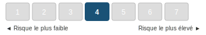
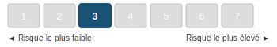
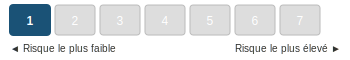

# AVENANT N°4 A L'ACCORD GROUPE PORTANT TRANSFORMATION DU PERCO EN PLAN D'EPARGNE RETRAITE COLLECTIF (PERECO) ET REGLEMENT DUDIT PERECO

>[Télécharger le PDF](sources/groupe-2024-10-03-avenant-n4-a-laccord-groupe-portant-transformation-du-perco-en-plan-depargne-retraite-collectif-pereco-et-reglement-dudit-pereco.pdf)

---

## PREAMBULE

Le 25 mai 2021, les parties ont conclu un accord de Groupe portant transformation du PERCO en Plan d'Epargne Retraite d'Entreprise COllectif (PERECO) et règlement dudit PERECO (ci-après « l'Accord »).

Afin de tenir compte des évolutions de la structure du Groupe Thales, l'Accord a fait l'objet de trois avenants conclus respectivement le 3 octobre 2022, le 27 avril 2023 et le 20 mars 2024.

Afin de permettre aux salariés et anciens salariés du Groupe participant au PERECO d'investir dans un support d'investissement labellisé présentant une orientation particulière pour financer la transition énergétique et écologique ou des projets socialement responsables, les parties signataires de l'Accord souhaitent par le présent avenant compléter les supports d'investissement disponibles dans le PERECO en y ajoutant le fonds « Impact Solidaire THALES ».

---

## Article 1 — Modification de l'article 8 — Dispositifs d'investissement proposés dans le PERECO

Les dispositions de l'article 8.1 de l'Accord, dans sa version en vigueur à la date de conclusion du présent avenant, sont supprimées et remplacées par les dispositions suivantes :

> **« Article 8.1 — Liberté de choix**
>
> En application de la réglementation, le PERECO propose obligatoirement à ses Participants, dans une logique de diversification des risques, un choix de placements entre au moins trois supports d'investissement présentant différents profils d'investissement (des OPCVM ayant une orientation de gestion et une exposition au risque différentes).
>
> L'un au moins des trois supports doit obligatoirement être un fonds investi pour partie dans des entreprises solidaires. Un autre support doit être labellisé (ou être un fonds nourricier d'un fonds labellisé) au titre du financement de la transition énergétique et écologique ou de l'investissement socialement responsable. »

---

## Article 2 — Modification de l'article 9 — Frais de fonctionnement et de gestion des fonds

Les dispositions de l'article 9 de l'Accord, dans sa version en vigueur à la date de conclusion du présent avenant, sont supprimées et remplacées par les dispositions suivantes :

> « Les frais de fonctionnement et de gestion des fonds (droits d'entrée, commissions de gestion, honoraires des commissaires aux comptes) sont imputés sur l'actif du fonds conformément aux règlements des différents fonds.
>
> Concernant les fonds « Epargne Monétaire THALES », « Epargne Modérée THALES », « Epargne Solidaire Equilibre THALES », « Epargne Solidaire Dynamique THALES » et « Impact Solidaire THALES », la part B concerne les avoirs des porteurs de parts présents et les avoirs des porteurs de parts retraités dans le PERECO. La part C concerne les avoirs des porteurs de parts ayant quitté le Groupe, porteurs dits « Sortis ». Les parts B des salariés présents ayant quitté le Groupe sont arbitrées automatiquement vers les parts C.
>
> Conformément à l'article 5 du présent règlement, les prestations de tenue de compte-conservation décrites en Annexe VIII sont prises en charge par l'Entreprise pour les salariés présents dans le Groupe. ».

---

## Article 3 — Modification de l'annexe I — « Périmètre du Groupe », de l'annexe III — « Liste des formules de gestion », de l'annexe IV — « Critères de choix et tableau récapitulatif des fonds du PERECO Thales », de l'annexe VI — « Notices des fonds communs de placement d'entreprise, fonds solidaires ou SICAV »

Les parties conviennent de substituer les annexes I, III, IV et VI jointes au présent avenant aux annexes I, III, IV et VI de l'Accord.

---

## Article 4 — Dispositions diverses

Le présent avenant s'applique à l'ensemble des sociétés relevant du périmètre du Groupe au sens de l'article L. 2331-1 du Code du travail et visées à l'annexe I du présent avenant.

Le présent avenant, conclu entre la Direction de la société Thales, entreprise dominante, et les organisations syndicales représentatives au niveau du Groupe Thales, constitue un accord de Groupe au sens des articles L. 2232-30 et suivants du Code du travail.

Le présent avenant entrera en vigueur à compter du lendemain de son dépôt. Il est conclu pour une durée indéterminée et pourra faire l'objet d'une dénonciation ou d'une révision dans les conditions prévues par la loi.

Conformément aux dispositions législatives et règlementaires en vigueur, le texte du présent avenant sera notifié à l'ensemble des Organisations syndicales représentatives au niveau du Groupe et déposé par la Direction des ressources Humaines du Groupe sous forme électronique, en un exemplaire pdf signé et un exemplaire sous format Word anonymisé, sur la plateforme de téléprocédure du ministère du travail et en un exemplaire au Secrétariat du Greffe du Conseil de Prud'hommes de Boulogne-Billancourt.

---

Fait à Meudon en 6 exemplaires, le **3 octobre 2024**

**Pour le Groupe Thales :** Monsieur Clément de VILLEPIN, Directeur Général des Ressources Humaines Groupe, en sa qualité d'employeur de la société dominante.

**Pour les Organisations syndicales représentatives au niveau du Groupe, les coordonnateurs syndicaux centraux :**

| CFDT | CFE-CGC | CFTC | CGT |
|------|---------|------|-----|
| Anthony PERROCHEAU | Marc CRUCIANI | Stéphane KHATTI | Grégory LEWANDOWSKI |

---

# ANNEXE I - Périmètre du Groupe

### GBU AVS
- Thales AVS France SAS
- Trixell
- Thales Simulation & Training SAS

### GBU DMS
- Thales DMS France SAS
- UMS SAS

### GBU LAS
- Thales LAS France SAS
- TRS AMDC2

### GBU SIX
- Thales SIX GTS France SAS
- Thales Services Numériques SAS
- Ercom Engineering Reseaux Communications
- Suneris Solution
- Thales Cloud Sécurisé SAS (S3NS)

### GBU ESPACE
- Thales Alenia Space France SAS
- Thales Seso SAS

### GBU DIS
- Thales DIS France SAS
- Thales Cyber Solutions SAS

### Entités Corporate
- Thales S.A.
- Thales International SAS
- Geris Consultants SAS
- Thales Global Services SAS
- Thales Digital Factory SAS

---

# ANNEXE III - LISTE DES FORMULES DE GESTION

## III — 1 : Formule « Gestion Libre »

Elle permet à chaque participant de choisir librement les supports et la répartition entre ces supports suivant son profil de risque et son horizon de placement. L'arbitrage entre ces supports est possible à tout moment et il est gratuit.

**Les fonds accessibles à travers cette formule sont, pour les porteurs de parts présents et retraités :**

- 4 fonds (monétaire, obligations, modéré, actions) :
  - FCPE « Epargne Monétaire THALES part B »
  - FCPE « THALES Obligations »
  - FCPE « Epargne Modérée THALES part B »
  - FCPE « THALES Actions Euromonde »

- 2 fonds solidaires :
  - FCPE « Epargne Solidaire Dynamique THALES part B »
  - FCPE « Epargne Solidaire Equilibre THALES part B »

- 1 fonds labellisé au titre du financement de la transition énergétique et écologique ou de l'investissement socialement responsable (sous réserve de l'obtention du label) :
  - FCPE « Impact Solidaire THALES part B »

**Les fonds accessibles à travers cette formule sont, pour les porteurs de parts partis (ayant quitté le Groupe pour un motif autre que la retraite) :**

- 4 fonds (monétaire, obligations, modéré, actions) :
  - FCPE « Epargne Monétaire THALES part C »
  - FCPE « THALES Obligations »
  - FCPE « Epargne Modérée THALES part C »
  - FCPE « THALES Actions Euromonde »

- 2 fonds solidaires :
  - FCPE « Epargne Solidaire Dynamique THALES part C »
  - FCPE « Epargne Solidaire Equilibre THALES part C »

- 1 fonds labellisé au titre du financement de la transition énergétique et écologique ou de l'investissement socialement responsable (sous réserve de l'obtention du label) :
  - FCPE « Impact Solidaire THALES part C »

Voir ci-après la description de ces fonds et leurs DIC (Annexe VI).

## III — 2 : Formule « gestion pilotée par horizon »

Elle permet à chaque participant d'opter pour une désensibilisation progressive et automatique de son épargne au risque Action.

**Les fonds sont affectés sur la combinaison suivante de fonds purs pour les porteurs de parts présents et retraités :**

- FCPE « Epargne Monétaire THALES part B »
- FCPE « THALES Obligations »
- FCPE « THALES Actions Euromonde »

**Les fonds sont affectés sur la combinaison suivante de fonds purs pour les porteurs de parts partis (ayant quitté le Groupe pour un motif autre que la retraite) :**

- FCPE « Epargne Monétaire THALES part C »
- FCPE « THALES Obligations »
- FCPE « THALES Actions Euromonde »

La désensibilisation se fera suivant les grilles figurant en Annexe V.

---

# ANNEXE IV - CRITÈRES DE CHOIX ET TABLEAU RÉCAPITULATIF DES FONDS DU PERECO THALES

Le choix des fonds proposés au sein du PERECO Groupe THALES vise à procurer aux salariés une gamme étendue de possibilités d'investissement.

Ces fonds, dont la description figure dans un tableau récapitulatif ci-après, sont des fonds diversifiés, dans le cadre d'une gamme allant du fonds le plus sécuritaire au plus risqué, afin que chacun puisse orienter ses investissements selon son propre profil de risque et son horizon de placement.

Chaque adhérent peut orienter ses avoirs selon les évolutions de Marché et ses anticipations, en effectuant des arbitrages entre les fonds. Il peut aussi conditionner ses ordres de vente ou d'arbitrage à des prix planchers, selon des modalités de gestion décrites par les règlements du Plan et des fonds concernés. Il peut également opter pour la « Formule sous gestion pilotée par horizon » conformément à l'Article 8.2 du présent règlement.

**Les partenaires sociaux du Groupe THALES ont choisi majoritairement les gestionnaires suivants pour la gestion des Fonds Communs de Placement d'Entreprise (FCPE) proposés dans le cadre du PERECO Groupe THALES :**

- **Sienna Gestion** pour le fonds :
  - « Epargne Solidaire Dynamique THALES »

- **Amundi Asset Management** pour les fonds :
  - « Epargne Monétaire THALES »
  - « Epargne Modérée THALES »
  - « Epargne Solidaire Equilibre THALES »
  - « THALES Obligations »
  - « THALES Actions Euromonde »

- **Natixis Investment Managers International** pour le fonds :
  - « Impact Solidaire THALES »

Les partenaires sociaux du Groupe THALES ont privilégié des FCPE en architecture ouverte pour les fonds « THALES Obligations » et « THALES Actions Euromonde ».

---

## Tableau récapitulatif des fonds du PERECO Groupe THALES

*(Présenté par ordre croissant d'exposition aux risques)*

### FCPE « Epargne Monétaire THALES »

Il est investi en produits monétaires dont le rendement est lié au marché des taux d'intérêt à court terme. Il offre une progression régulière de la valeur de la part.

### FCPE « THALES Obligations »

Il est investi en Organismes de Placement Collectif (OPCVM) offrant une exposition aux produits de taux de la zone euro. Une proportion du fonds est investie en OPCVM exposé en produits de taux indexés sur l'inflation.

### FCPE « Epargne Modérée THALES »

Il est investi majoritairement en produits de taux de maturité inférieure à 7 ans et, dans une faible proportion en actions. Son objectif est d'offrir une valorisation du capital investi à moyen terme, tout en visant à tirer parti du marché des actions pour la part minoritaire de son actif.

### FCPE « Epargne Solidaire Equilibre THALES »

Ce fonds est géré selon les critères de sélection d'actions ISR (Investissement Socialement Responsable) et investi de façon équilibrée entre obligations et actions de la zone euro. Il comprend une part de son actif investi en titres émis par des entreprises solidaires définies par l'article L.3332-17-1 du Code du travail. Son objectif est de tirer parti des performances des marchés actions pour une moitié de son actif, tout en atténuant le risque par les investissements en produits de taux.

### FCPE « Epargne Solidaire Dynamique THALES »

Il est essentiellement investi en actions des pays de la zone euro et comprend une part de son actif investi en titres émis par des entreprises solidaires définies par l'Article L.3332-17-1 du Code du travail. Le fonds est géré selon les critères de sélection d'actions ISR (Investissement Socialement Responsable).

### FCPE « Impact Solidaire THALES »

Ce fonds est investi en actions de la zone euro favorisant la transition économique durable. Il sélectionne des entreprises ayant des contributions environnementales et sociales positives en relation avec les ODD (Objectifs de Développement Durable de l'ONU) : santé et bien-être, eau propre et assainissement, énergie propre, industrie innovante et infrastructure, villes durables, consommation et production responsables et lutte contre le changement climatique. Parallèlement, le fonds est investi entre 5 % et 10 % de son actif en titres émis par des entreprises solidaires agréées. L'orientation de gestion répond aux exigences d'une gestion ISR (Investissement socialement responsable).

### FCPE « THALES Actions EuroMonde »

Il est investi en Organismes de Placement Collectif (OPC) exposés essentiellement aux actions Européennes et internationales. Son objectif est de tirer parti des performances du marché actions sur un horizon d'investissement moyen/long terme. Sa politique de gestion prend en compte, pour certains fonds, des critères sociaux, environnementaux et de bonne gouvernance en plus des critères financiers classiques.

---

# ANNEXE VI — NOTICES DES FONDS COMMUNS DE PLACEMENT D'ENTREPRISE, FONDS SOLIDAIRES OU SICAV

---

## EPARGNE SOLIDAIRE DYNAMIQUE THALES (Part B - 990000097329)

### Document d'Informations Clés

**Initiateur :** SIENNA GESTION  
**Site internet :** www.sienna-gestion.com  
**Contact :** sienna-gestion@sienna-im.com  
**Autorité de tutelle compétente :** Autorité des marchés financiers (AMF)  
**Agrément :** GP 97020  
**Date de production du document :** 17/05/2024

> **AVERTISSEMENT :** VOUS ÊTES SUR LE POINT D'ACHETER UN PRODUIT QUI N'EST PAS SIMPLE ET QUI PEUT ÊTRE DIFFICILE À COMPRENDRE

### En quoi consiste ce produit ?

**TYPE :** EPARGNE SOLIDAIRE DYNAMIQUE THALES est un Fonds Commun de Placement d'Entreprise (FCPE) de droit français relevant de l'article L. 214-164 du Code Monétaire et Financier prenant la forme d'un FCPE. Ce FCPE a été agréé par l'Autorité des Marchés Financiers le 28/11/2006.

**DURÉE ET RÉSILIATION :** Le Fonds est créé pour une durée indéterminée. Le Conseil de surveillance ou la société de gestion peut décider la dissolution ou la fusion du présent Fonds à leur initiative.

**OBJECTIFS :**

Le Fonds a pour objectif de gestion d'obtenir, sur sa durée de placement recommandée de 5 ans minimum, une performance nette de frais de gestion supérieure ou égale à celle de son indicateur de référence en intégrant en amont une approche extra-financière (critères Environnementaux, Sociaux et de Gouvernance dits « critères ESG ») pour la sélection et le suivi des titres. L'indicateur de référence du FCPE est l'indice composite suivant : 70 % MSCI EMU NR (dividendes nets réinvestis / cours de clôture), 15 % Bloomberg Euro Aggregate Treasury 5-7 ans (coupons réinvestis / cours de clôture), 15 % ESTR capitalisé (Euro Overnight Average). Le Fonds adopte une gestion Socialement Responsable (SR) dans la sélection et le suivi des titres c'est-à-dire en tenant compte des critères ESG des émetteurs. 90% minimum des investissements du Fonds, réalisés en direct et/ou au travers de fonds supports, sont sélectionnés par SIENNA GESTION sur la base de critères ESG.

**Stratégie financière :** L'objectif de gestion s'appuie, à travers des titres détenus en direct et/ou des OPC de la zone euro, sur des actions de la zone euro de sociétés de grandes, moyennes et de petites capitalisations. La gestion Actions pratiquée est de type fondamental.

**Affectation des sommes distribuables :** Capitalisation

**SFDR :** Article 8, le Fonds promeut des caractéristiques environnementales, sociales et de gouvernance.

**INVESTISSEURS DE DÉTAIL VISÉS :** Ce produit est destiné aux bénéficiaires d'un dispositif d'épargne salariale ou d'épargne retraite ayant un objectif d'investissement à long terme (supérieure à 5 ans) et ayant une connaissance théorique des marchés de taux et d'actions tout en acceptant de s'exposer à un risque de variation de la valeur liquidative inhérent à ces marchés.

**DÉPOSITAIRE :** BNP PARIBAS SA

**PÉRIODICITÉ DE CALCUL DE LA VALEUR LIQUIDATIVE :** La valeur liquidative est calculée quotidiennement.

### Quels sont les risques et qu'est-ce que cela pourrait me rapporter ?

**INDICATEUR DE RISQUE (SRI)**

Nous avons classé ce produit dans la classe de risque **4 sur 7**, qui est une classe de risque moyenne. Autrement dit, les pertes potentielles liées aux futurs résultats du produit se situent à un niveau moyen et, si la situation venait à se détériorer sur les marchés, il est possible que notre capacité à vous payer en soit affectée.

**Risques supplémentaires non pris en compte dans l'indicateur :**
- **Risque de crédit :** risque de baisse de la qualité de crédit d'un émetteur monétaire ou obligataire ou de défaut de ce dernier.
- **Risque de contrepartie :** risque de perte pour le portefeuille résultant du fait que la contrepartie à une opération peut faillir à ses obligations.
- **Risque de liquidité :** risque qu'une position ne puisse pas être cédée pour un coût limité et dans un délai suffisamment court.
- **Risque lié à l'impact des techniques telles que les produits dérivés :** Le Fonds peut avoir recours à des instruments financiers à terme.

Ce produit ne prévoyant pas de protection contre les aléas de marché, vous pourriez perdre tout ou partie de votre investissement.

### Scénarios de performance

**Période de détention recommandée : 5 ans**  
**Investissement : 10 000 euros**

| Scénarios | Si vous sortez après 1 an | Si vous sortez après 5 ans |
|-----------|--------------------------|---------------------------|
| **Minimum** | Il n'existe aucun rendement minimal garanti. Vous pourriez perdre tout ou une partie de votre investissement. ||
| **Tensions** — Ce que vous pourriez obtenir après déduction des coûts | 2 890,00 € | 2 940,00 € |
| Rendement annuel moyen | -71,10% | -21,72% |
| **Défavorable** — Ce que vous pourriez obtenir après déduction des coûts | 8 730,00 € | 8 650,00 € |
| Rendement annuel moyen | -12,70% | -2,86% |
| **Intermédiaire** — Ce que vous pourriez obtenir après déduction des coûts | 10 380,00 € | 11 630,00 € |
| Rendement annuel moyen | 3,80% | 3,07% |
| **Favorable** — Ce que vous pourriez obtenir après déduction des coûts | 12 960,00 € | 13 860,00 € |
| Rendement annuel moyen | 29,60% | 6,75% |

- Scénario défavorable : investissement entre le 31/03/2015 et le 31/03/2020
- Scénario intermédiaire : investissement entre le 30/06/2014 et le 30/06/2019
- Scénario favorable : investissement entre le 29/12/2016 et le 29/12/2023

### Que se passe-t-il si SIENNA GESTION n'est pas en mesure d'effectuer les versements ?

Le Fonds est constitué comme une entité distincte de la société de gestion. En cas de défaillance de la société de gestion, les actifs du Fonds conservés par le dépositaire ne seront pas affectés. En cas de défaillance du dépositaire, le risque de perte financière du Fonds est atténué en raison de la ségrégation légale des actifs du dépositaire de ceux du Fonds.

### Que va me coûter cet investissement ?

**Coûts au fil du temps :**

| Exemple d'investissement | Si vous sortez après 1 an | Si vous sortez après 5 ans (Période de détention recommandée) |
|--------------------------|--------------------------|--------------------------------------------------------------|
| Coûts totaux | 59,73 € | 351,39 € |
| Incidence des coûts annuels | 0,60% | 0,62% |

**Composition des coûts :**

| Type de coût | Description | Si vous sortez après 1 an |
|-------------|-------------|--------------------------|
| **Coûts d'entrée** | Nous ne facturons pas de coût d'entrée. | 0,00 € |
| **Coûts de sortie** | Nous ne facturons pas de coût de sortie pour ce produit. | 0,00 € |
| **Frais de gestion et autres frais administratifs** | 0,35% de la valeur de votre investissement par an. | 35,20 € |
| **Coûts de transaction** | 0,25% de la valeur de votre investissement par an. | 24,53 € |
| **Commissions liées aux résultats** | Aucune commission liée aux résultats n'existe pour ce produit. | 0,00 € |

**Durée de placement minimale recommandée :** 5 ans

---

## THALES OBLIGATIONS (990000097049)

### Document d'Informations Clés

**Société de gestion :** Amundi Asset Management  
**Devise :** EUR  
**Site internet :** www.amundi.fr  
**Date de production du document :** 04/07/2024

### En quoi consiste ce produit ?

**Type :** Ce produit est un fonds d'investissement alternatif (FIA) constitué sous la forme d'un fonds commun de placement d'entreprise (FCPE) individualisé de groupe, soumis au droit français.

**Durée :** Ce FCPE a été créé pour une durée indéterminée. La société de gestion peut, après accord du conseil de surveillance du FCPE, procéder à la fusion, scission ou liquidation du FCPE.

**Classification AMF :** « Obligations et autres titres de créances libellés en euro »

**Objectifs :**

En souscrivant à THALES OBLIGATIONS, vous investissez dans un fonds en permanence exposé sur un ou plusieurs marchés de taux de pays de la zone euro. L'objectif de gestion du FCPE est de rechercher une performance supérieure à celle de l'indicateur de référence composé à 42,5 % de l'indice Merrill Lynch EMU Large Cap Investment Grade, de 42,5 % de Barclays Euro Aggregate et de 15 % de Barclays Inflation Linked Bonds EMU, et ce, sur la durée de placement recommandée. L'exposition au risque ne doit pas excéder 10 % de l'actif net du fonds.

Le Fonds est géré activement et vise à obtenir une performance supérieure à celle de son indice de référence. Sa gestion est discrétionnaire.

**Dépositaire :** CACEIS Bank.

### Quels sont les risques et qu'est-ce que cela pourrait me rapporter ?

**INDICATEUR DE RISQUE**

Nous avons classé ce produit dans la classe de risque **3 sur 7**, qui est une classe de risque entre basse et moyenne.

Ce produit ne prévoyant pas de protection contre les aléas de marché, vous pourriez perdre tout ou partie de votre investissement.

### Scénarios de performance

**Période de détention recommandée : 3 ans**  
**Investissement de 10 000 EUR**

| Scénarios | Si vous sortez après 1 an | Si vous sortez après 3 ans |
|-----------|--------------------------|---------------------------|
| **Minimum** | Il n'existe aucun rendement minimal garanti. ||
| **Tensions** — Ce que vous pourriez obtenir après déduction des coûts | -2 540 € | -2 300 € |
| Rendement annuel moyen | -25,40% | -8,30% |
| **Défavorable** — Ce que vous pourriez obtenir après déduction des coûts | -1 670 € | -1 630 € |
| Rendement annuel moyen | -16,70% | -5,8% |
| **Intermédiaire** — Ce que vous pourriez obtenir après déduction des coûts | 130 € | 590 € |
| Rendement annuel moyen | 1,30% | 1,90% |
| **Favorable** — Ce que vous pourriez obtenir après déduction des coûts | 980 € | 1 270 € |
| Rendement annuel moyen | 9,60% | 4,10% |

### Coûts

| Exemple d'investissement 10 000 EUR | Si vous sortez après 1 an | Si vous sortez après 3 ans |
|-------------------------------------|--------------------------|---------------------------|
| Coûts totaux | 47 € | 151 € |
| Incidence des coûts annuels | 0,5% | 0,5% |

**Composition des coûts :**

| Type | Description | Montant après 1 an |
|------|------------|-------------------|
| Coûts d'entrée | Pas de coûts d'entrée | 0 EUR |
| Coûts de sortie | Pas de coûts de sortie | 0 EUR |
| Frais de gestion | 0,474% de la valeur de votre investissement par an | 47,4 EUR |
| Coûts de transaction | 0,00% de la valeur de votre investissement par an | 0,06 EUR |
| Commissions liées aux résultats | Aucune | 0 EUR |

**Période de détention recommandée :** 3 an(s).

---

## EPARGNE SOLIDAIRE EQUILIBRE THALES - Part B (C) (990000116909)

### Document d'Informations Clés

**Société de gestion :** Amundi Asset Management  
**Devise :** EUR  
**Site internet :** www.amundi.fr  
**Date de production du document :** 28/02/2024

### En quoi consiste ce produit ?

**Type :** Ce produit est un fonds d'investissement alternatif (FIA) constitué sous la forme d'un fonds commun de placement d'entreprise (FCPE), individualisé de groupe, soumis au droit français.

**Durée :** Ce FCPE a été créé pour une durée indéterminée.

**Classification AMF :** Non applicable

**Objectifs :**

En souscrivant à EPARGNE SOLIDAIRE EQUILIBRE THALES - Part A, vous accédez à un univers large composé des marchés de taux et d'actions, intégrant des critères environnementaux, sociaux et de gouvernance (ESG).

L'objectif de gestion du FCPE est de réaliser une performance supérieure à celle de son indicateur de référence (dividendes et coupons réinvestis), après prise en compte des frais courants : 45% Euro Stoxx 50 et 45% EuroMTS Global + 10% €STR Capitalisé. L'indice de référence n'évalue pas ou n'inclut pas ses constituants en fonction des caractéristiques environnementales et/ou sociales et n'est donc pas aligné sur les caractéristiques ESG promues par le portefeuille.

Le FCPE est exposé entre 30 et 60% de l'actif en produits de taux au travers d'obligations et titres de créance d'émetteurs publics et/ou privés ainsi qu'entre 40 et 70% de l'actif en produits actions. La zone géographique prépondérante est la zone euro. En complément, entre 5 et 10% de l'actif net du FCPE est investi en titres émis par des entreprises solidaires agréées.

Le Fonds promeut des critères environnementaux, sociaux et de gouvernance (ESG) au sens de l'article 8 du Règlement (UE) 2019/2088 (« Règlement Disclosure »).

**Durée de placement recommandée :** 5 ans.

**Dépositaire :** CACEIS Bank.

### Quels sont les risques et qu'est-ce que cela pourrait me rapporter ?

**INDICATEUR DE RISQUE**

Nous avons classé ce produit dans la classe de risque **3 sur 7**, qui est une classe de risque entre basse et moyenne.

Ce produit ne prévoyant pas de protection contre les aléas de marché, vous pourriez perdre tout ou partie de votre investissement.

### Scénarios de performance

**Période de détention recommandée : 5 ans**  
**Investissement 10 000 EUR**

| Scénarios | Si vous sortez après 1 an | Si vous sortez après 5 ans |
|-----------|--------------------------|---------------------------|
| **Minimum** | Il n'existe aucun rendement minimal garanti. ||
| **Tensions** | €5 120 | €4 950 |
| Rendement annuel moyen | -48,8% | -13,1% |
| **Défavorable** | €8 410 | €9 750 |
| Rendement annuel moyen | -15,9% | -0,8% |
| **Intermédiaire** | €10 320 | €11 630 |
| Rendement annuel moyen | 3,2% | 3,1% |
| **Favorable** | €12 020 | €13 250 |
| Rendement annuel moyen | 20,2% | 5,8% |

### Coûts

| Investissement 10 000 EUR | Si vous sortez après 1 an | Si vous sortez après 5 ans |
|---------------------------|--------------------------|---------------------------|
| Coûts totaux | €52 | €303 |
| Incidence des coûts annuels | 0,5% | 0,5% |

**Composition des coûts :**

| Type | Description | Montant après 1 an |
|------|------------|-------------------|
| Coûts d'entrée | Pas de coûts d'entrée | Jusqu'à 0 EUR |
| Coûts de sortie | Pas de coûts de sortie | 0 EUR |
| Frais de gestion | 0,46% de la valeur de votre investissement par an | 46,40 EUR |
| Coûts de transaction | 0,05% de la valeur de votre investissement par an | 5,19 EUR |
| Commissions liées aux résultats | Aucune | 0,00 EUR |

**Période de détention recommandée :** 5 ans.

---

## EPARGNE MODEREE THALES - PART B (C) (990000097399)

### Document d'Informations Clés

**Société de gestion :** Amundi Asset Management  
**Devise :** EUR  
**Site internet :** www.amundi.fr  
**Date de production du document :** 28/02/2024

### En quoi consiste ce produit ?

**Type :** Ce produit est un fonds d'investissement alternatif (FIA) constitué sous la forme d'un fonds commun de placement d'entreprise (FCPE), individualisé de groupe, soumis au droit français.

**Durée :** Ce FCPE a été créé pour une durée 99 ans.

**Classification AMF :** Non applicable

**Objectifs :**

En souscrivant à EPARGNE MODEREE THALES - PART A, vous accédez à des expertises variées au sein d'un univers large constitué des marchés de taux, d'actions et de devises internationaux.

L'objectif de gestion du FCPE est de réaliser une performance à moyen terme supérieure à celle de son indicateur de référence (dividendes et coupons réinvestis), après prise en compte des frais courants : 55% EuroMTS 3-5, 25% EuroStoxx 50, 5% Exane Euro Convertible, et 15% €STR Capitalisé.

Le FCPE peut être exposé entre 60% et 110% de l'actif aux produits de taux ou convertibles au travers d'obligations et titres de créance d'émetteurs publics et/ou privés et dans une moindre mesure aux produits actions c'est à dire jusqu'à 40% de l'actif.

**Durée de placement recommandée :** 3 ans.

**Dépositaire :** CACEIS Bank.

### Quels sont les risques et qu'est-ce que cela pourrait me rapporter ?

**INDICATEUR DE RISQUE**

Nous avons classé ce produit dans la classe de risque **3 sur 7**, qui est une classe de risque entre basse et moyenne.

### Scénarios de performance

**Période de détention recommandée : 3 ans**  
**Investissement 10 000 EUR**

| Scénarios | Si vous sortez après 1 an | Si vous sortez après 3 ans |
|-----------|--------------------------|---------------------------|
| **Minimum** | Il n'existe aucun rendement minimal garanti. ||
| **Tensions** | €7 120 | €7 660 |
| Rendement annuel moyen | -28,8% | -8,5% |
| **Défavorable** | €9 060 | €9 660 |
| Rendement annuel moyen | -9,4% | -1,1% |
| **Intermédiaire** | €10 180 | €10 610 |
| Rendement annuel moyen | 1,8% | 2,0% |
| **Favorable** | €11 320 | €11 700 |
| Rendement annuel moyen | 13,2% | 5,4% |

### Coûts

| Investissement 10 000 EUR | Si vous sortez après 1 an | Si vous sortez après 3 ans |
|---------------------------|--------------------------|---------------------------|
| Coûts totaux | €34 | €109 |
| Incidence des coûts annuels | 0,3% | 0,3% |

**Composition des coûts :**

| Type | Description | Montant après 1 an |
|------|------------|-------------------|
| Coûts d'entrée | Pas de coûts d'entrée | Jusqu'à 0 EUR |
| Coûts de sortie | Pas de coûts de sortie | 0 EUR |
| Frais de gestion | 0,28% de la valeur de votre investissement par an | 28,20 EUR |
| Coûts de transaction | 0,06% de la valeur de votre investissement par an | 5,82 EUR |
| Commissions liées aux résultats | Aucune | 0,00 EUR |

**Période de détention recommandée :** 3 ans.

---

## THALES ACTIONS EUROMONDE (990000097079)

### Document d'Informations Clés

**Société de gestion :** Amundi Asset Management  
**Devise :** EUR  
**Site internet :** www.amundi.fr  
**Date de production du document :** 23/11/2023

### En quoi consiste ce produit ?

**Type :** Ce produit est un fonds d'investissement alternatif (FIA) constitué sous la forme d'un fonds commun de placement d'entreprise (FCPE) individualisé de groupe, soumis au droit français.

**Durée :** Ce FCPE a été créé pour une durée indéterminée.

**Classification AMF :** « Actions internationales »

**Objectifs :**

En souscrivant à THALES ACTIONS EUROMONDE, vous investissez à hauteur de 60 % au moins sur un marché d'actions étranger ou sur des marchés d'actions de plusieurs pays, dont éventuellement le marché français.

L'objectif de gestion du FCPE est de rechercher une performance supérieure à celle de l'indicateur de référence composé à 60 % de l'indice Euro Stoxx TR, 20% du MSCI Europe TR et 20 % du MSCI World Developed TR, et ce, sur la durée de placement recommandée.

La composition du Fonds est la suivante :
- 50% - 70% actions de la zone euro dont 12,5% minimum sur des PME-ETI via des OPCVM et/ou FIVG spécialisés éligibles au PEA/PME
- 15% - 25% actions de l'Union Européenne
- 15% - 25% actions internationales

**Dépositaire :** CACEIS Bank.

### Quels sont les risques et qu'est-ce que cela pourrait me rapporter ?

**INDICATEUR DE RISQUE**

Nous avons classé ce produit dans la classe de risque **4 sur 7**, qui est une classe de risque moyenne.

### Scénarios de performance

**Période de détention recommandée : 5 an(s)**  
**Investissement de 10 000 EUR**

| Scénarios | Si vous sortez après 1 an | Si vous sortez après 5 an(s) |
|-----------|--------------------------|---------------------------|
| **Minimum** | Il n'existe aucun rendement minimal garanti. ||
| **Tensions** | €2 300 | €2 390 |
| Rendement annuel moyen | -77,0% | -24,9% |
| **Défavorable** | €8 330 | €9 170 |
| Rendement annuel moyen | -16,7% | -1,7% |
| **Intermédiaire** | €10 610 | 12 930 € |
| Rendement annuel moyen | 6,1% | 5,3% |
| **Favorable** | €14 440 | €16 330 |
| Rendement annuel moyen | 44,4% | 10,3% |

### Coûts

| Investissement 10 000 EUR | Si vous sortez après 1 an | Si vous sortez après 5 an(s) |
|---------------------------|--------------------------|---------------------------|
| Coûts totaux | €82 | €537 |
| Incidence des coûts annuels | 0,8% | 0,9% |

**Composition des coûts :**

| Type | Description | Montant après 1 an |
|------|------------|-------------------|
| Coûts d'entrée | Pas de coûts d'entrée | NA |
| Coûts de sortie | Pas de coûts de sortie | NA |
| Frais de gestion | 0,81% de la valeur de votre investissement par an | 81,30 EUR |
| Coûts de transaction | Pas de coûts de transaction | NA |
| Commissions liées aux résultats | Aucune | NA |

**Période de détention recommandée :** 5 an(s).  
**Teneur de comptes :** Amundi ESR

---

## EPARGNE MONETAIRE THALES - PART B (C) (990000097439)

### Document d'Informations Clés

**Société de gestion :** Amundi Asset Management  
**Devise :** EUR  
**Site internet :** www.amundi.fr  
**Date de production du document :** 28/02/2024

### En quoi consiste ce produit ?

**Type :** Ce produit est un fonds d'investissement alternatif (FIA) constitué sous la forme d'un fonds commun de placement d'entreprise (FCPE), individualisé de groupe, soumis au droit français.

**Durée :** Ce FCPE a été créé pour une durée 99 ans.

**Classification AMF :** OPC Monétaire à Valeur Liquidative Variable Standard

**Objectifs :**

En souscrivant à EPARGNE MONETAIRE THALES - PART A, vous investissez dans des instruments du marché monétaire (certificats de dépôts, billets de trésorerie, etc.) dont l'échéance maximale est de 2 ans, dans le cadre d'une très faible exposition au risque de taux.

L'objectif de gestion du FCPE est de vous offrir une performance égale à l'€STR capitalisé après prise en compte des frais.

Dans certaines situations de marché telles que le très faible niveau de l'€STR, la valeur liquidative du FCPE pourra baisser de manière structurelle et affecter négativement le rendement du FCPE, ce qui pourrait compromettre l'objectif de préservation du capital du FCPE.

**Durée de placement recommandée :** minimum 1 jour.

**Dépositaire :** CACEIS Bank.

### Quels sont les risques et qu'est-ce que cela pourrait me rapporter ?

**INDICATEUR DE RISQUE**

Nous avons classé ce produit dans la classe de risque **1 sur 7**, qui est la classe de risque la plus basse.

### Scénarios de performance

**Période de détention recommandée : Minimum 1 jour**  
**Investissement 10 000 EUR**

| Scénarios | Si vous sortez après Minimum 1 jour |
|-----------|-------------------------------------|
| **Minimum** | Il n'y a pas de rendement minimum garanti en cas de sortie avant Minimum 1 jour. |
| **Tensions** | €9 960 |
| Rendement annuel moyen | -0,4% |
| **Défavorable** | €9 980 |
| Rendement annuel moyen | -0,2% |
| **Intermédiaire** | €10 000 |
| Rendement annuel moyen | 0,0% |
| **Favorable** | €10 030 |
| Rendement annuel moyen | 0,3% |

### Coûts

| Investissement 10 000 EUR | Si vous sortez après Minimum 1 jour |
|---------------------------|-------------------------------------|
| Coûts totaux | €0 |
| Incidence des coûts annuels | 0,0% |

**Composition des coûts :**

| Type | Description | Montant après Minimum 1 jour |
|------|------------|------------------------------|
| Coûts d'entrée | Pas de coûts d'entrée | Jusqu'à 0 EUR |
| Coûts de sortie | Pas de coûts de sortie | 0 EUR |
| Frais de gestion | 0,19% de la valeur de votre investissement par an | 0,05 EUR |
| Coûts de transaction | Aucun | 0,00 EUR |
| Commissions liées aux résultats | Aucune | 0,00 EUR |

**Période de détention recommandée :** Minimum 1 jour.

---

## IMPACT SOLIDAIRE THALES (Part B - 990000201889)

### Document d'Informations Clés

**Société de Gestion :** Natixis Investment Managers International (Groupe BPCE)  
**Site internet :** www.im.natixis.com  
**Agrément :** GP 90-009  
**Date de production du document :** 10/09/2024

### En quoi consiste ce Produit ?

**Type :** Ce Produit est un Fonds d'Investissement Alternatif (FIA) qui a la forme juridique d'un FCPE (Fonds Commun de Placement d'Entreprise). Ce Produit est un portefeuille d'instruments Financiers que vous détiendrez collectivement avec d'autres investisseurs et qui sera géré conformément à ses objectifs.

**Durée :** Ce Produit n'a pas de date d'échéance spécifique prévue. Cependant, ce Produit peut être dissous ou fusionné.

**Objectifs :**

- Le Fonds a un objectif d'investissement durable au sens de l'Article 9 du Règlement SFDR. Investi via des OPC en actions de pays de l'Union européenne et de pays de la zone euro, le Produit a pour objectif, sur une durée de placement recommandée de 5 ans, d'obtenir une performance nette de frais de gestion supérieure à son indicateur de référence composé à 91,5% de l'indice EURO STOXX grâce à des investissements — majoritairement via le compartiment « BEYOND SEMPEROSA » (part I) de la SICAV de droit Luxembourgeois « DNCA INVEST » — dans des sociétés dont les activités sont liées à des thèmes d'investissement durable, et à 8,5% en titres solidaires dont la performance sera mesurée via l'indice €str Capitalisé compte-tenu de la rémunération usuellement faible des titres solidaires.

- Le Fonds adopte une approche de gestion ISR consistant à sélectionner à hauteur de 90% minimum de son actif (hors titres solidaires) des OPC sous-jacents respectant un processus ISR. Le Fonds ne bénéficie pas du Label « ISR ».

**Le Fonds est exposé :**
- entre 65% minimum et 75% maximum (70% en cible) au travers du compartiment « BEYOND SEMPEROSA » (part I) de la SICAV « DNCA INVEST », gérée par DNCA FINANCE
- entre 5% minimum et 10% maximum de son actif net (8,5% en cible) dans le FPS « MIROVA SOLIDAIRE »
- entre 15% minimum et 30% maximum (21,5% en cible) en actions et ou parts d'autres OPC actions quasi exclusivement au travers du compartiment « BEYOND CLIMATE » (part I) de la SICAV « DNCA INVEST », gérée par DNCA FINANCE

Le Fonds ne détiendra pas de titres en direct. Le Fonds n'a pas recours aux produits dérivés. Le Produit capitalise ses revenus.

**Investisseurs de détail visés :** Ce produit est ouvert aux salariés et autres bénéficiaires définis dans le cadre du ou des dispositifs d'épargne de leur entreprise.

**Informations complémentaires :**
- **Dépositaire :** CACEIS Bank
- **Teneur de comptes conservateur de parts :** AMUNDI ESR
- **Forme juridique :** FCPE Individualisé de Groupe

### Quels sont les risques et qu'est-ce que cela pourrait me rapporter ?

**INDICATEUR DE RISQUE**

Nous avons classé ce Produit dans la classe de risque **4 sur 7**, qui est une classe de risque moyenne.

Ce Produit ne prévoyant pas de protection contre les aléas de marché, vous pourriez perdre tout ou partie de votre investissement.

Autres risques importants du Produit non pris en compte dans le calcul du SRI : néant.

**Attention au risque de change.** Les sommes qui vous seront versées le seront dans une autre monnaie ; votre gain final dépendra donc du taux de change entre les deux monnaies.

### Scénarios de performance

**Période de détention recommandée : 5 années**  
**Investissement de 10 000 EUR**

| Scénarios | Si vous sortez après un an | Si vous sortez après 5 années |
|-----------|--------------------------|------------------------------|
| **Minimum** | Ce Produit ne bénéficie d'aucune Garantie. Vous pouvez perdre une partie ou la totalité de votre investissement. ||
| **Tensions** | 2 010 EUR | 1 910 EUR |
| Rendement annuel moyen | -79,9% | -28,2% |
| **Défavorable** | 8 080 EUR | 7 310 EUR |
| Rendement annuel moyen | -19,2% | -6,1% |
| **Intermédiaire** | 10 130 EUR | 11 140 EUR |
| Rendement annuel moyen | 1,3% | 2,2% |
| **Favorable** | 13 790 EUR | 13 890 EUR |
| Rendement annuel moyen | 37,9% | 6,8% |

(*) Les scénarios se sont réalisés pour un investissement (par rapport à l'indice de Référence 91,5% EURO STOXX 50 INDEX PI, 8,5% EONIA/ESTR Capitalized) effectué entre mars 2015 et mars 2020 pour le scénario défavorable, entre décembre 2014 et décembre 2019 pour le scénario intermédiaire et entre mars 2019 et mars 2024 pour le scénario favorable.

### Que se passe-t-il si Natixis Investment Managers International n'est pas en mesure d'effectuer les versements ?

Les actifs de votre Produit sont conservés chez le Dépositaire de votre Produit, CACEIS Bank, ils sont distincts de ceux de la Société de gestion. Ainsi, en cas d'insolvabilité de Natixis Investment Managers International, les actifs de votre Produit ne seront pas affectés. Cependant, en cas d'insolvabilité du Dépositaire ou d'un sous-dépositaire, il existe un risque potentiel de perte financière. Toutefois, ce risque est atténué dans une certaine mesure par le fait que le Dépositaire est tenu par la loi et la réglementation de séparer ses propres actifs des actifs du Produit.

Il existe un dispositif d'indemnisation ou de garantie des investisseurs en cas de défaut du Dépositaire prévu par la loi.

### Que va me coûter cet investissement ?

**Coûts au fil du temps :**

| | Si vous sortez après un an | Si vous sortez après 5 années |
|--|--------------------------|------------------------------|
| Coûts Totaux | 116 EUR | 606 EUR |
| Incidence des coûts annuel | 1,2% | 1,2% chaque année |

**Composition des coûts :**

| Type | Description | Si vous sortez après 1 an |
|------|------------|--------------------------|
| Coûts d'entrée | Il n'y a pas de frais d'entrée. | Néant |
| Coûts de sortie | Il n'y a aucun frais de sortie. | Néant |
| Frais de gestion et autres frais administratifs et de fonctionnement | 1,12% | 112 EUR |
| Coûts de transactions | 0,04% de la valeur de votre investissement | 4 EUR |
| Commission de surperformance | Aucune | Néant |

### Combien de temps devez-vous conserver ce Produit ?

**Période de détention recommandée : 5 années**

Cette durée correspond à la période pendant laquelle il vous est conseillé de rester investi pour obtenir un rendement potentiel tout en minimisant le risque de pertes sans tenir compte de la durée de blocage légale de vos avoirs.

### Comment pouvez-vous formuler une réclamation ?

Si vous voulez formuler une réclamation, vous pouvez envoyer un mail à l'adresse ClientServicingAM@natixis.com ou envoyer un courrier à Natixis Investment Managers International — 43 avenue Pierre Mendès France — 75648 Paris Cedex 13 ou contacter votre teneur de compte.

### Autres informations pertinentes

- **Fiscalité :** Les produits réinvestis et indisponibles ainsi que les gains nets de votre Produit réalisés dans le cadre d'un plan d'épargne sont exonérés d'impôt sur le revenu. Seuls les prélèvements sociaux sont redevables selon les dispositions de la réglementation fiscale et sociale française.
- **Conseil de surveillance :** Le Conseil de surveillance est composé de 12 membres :
  - Soit six (6) membres salariés porteurs de parts représentant les porteurs de parts salariés et anciens salariés du Groupe, chaque organisation syndicale représentative au niveau du Groupe désignant un (1) représentant chacune
  - Et six (6) membres représentant le Groupe, désignés par la direction du Groupe.
- Le Conseil de surveillance exerce les droits de vote attachés aux valeurs inscrites à l'actif du Produit et décide de l'apport des titres, et, à cet effet, désigne un ou plusieurs mandataires représentant le FCPE aux assemblées générales de la société émettrice.

---
