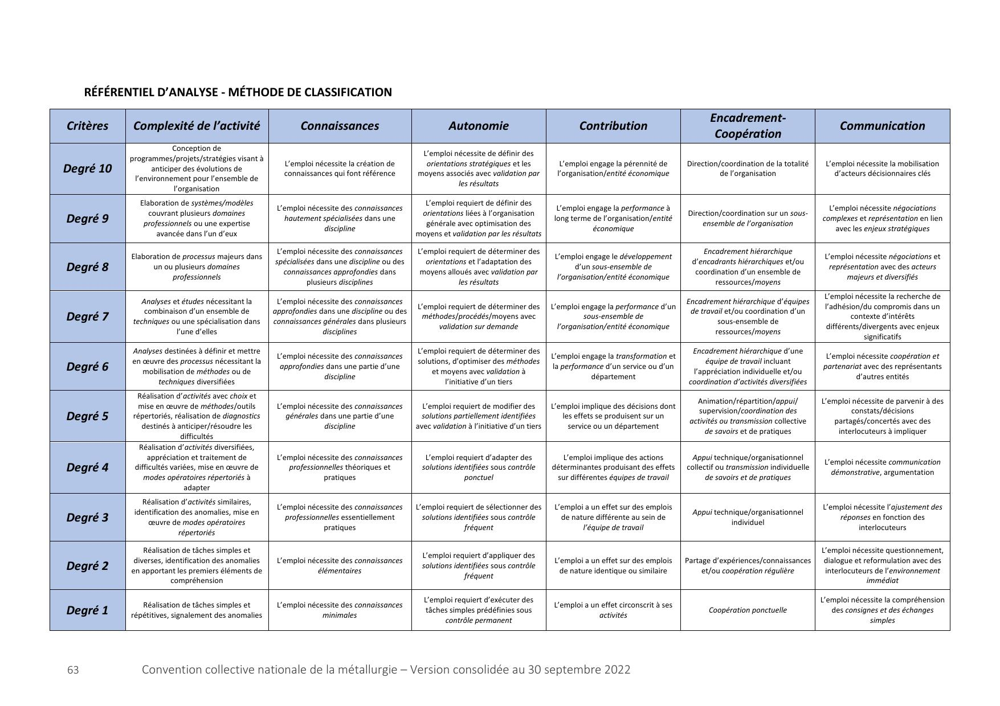
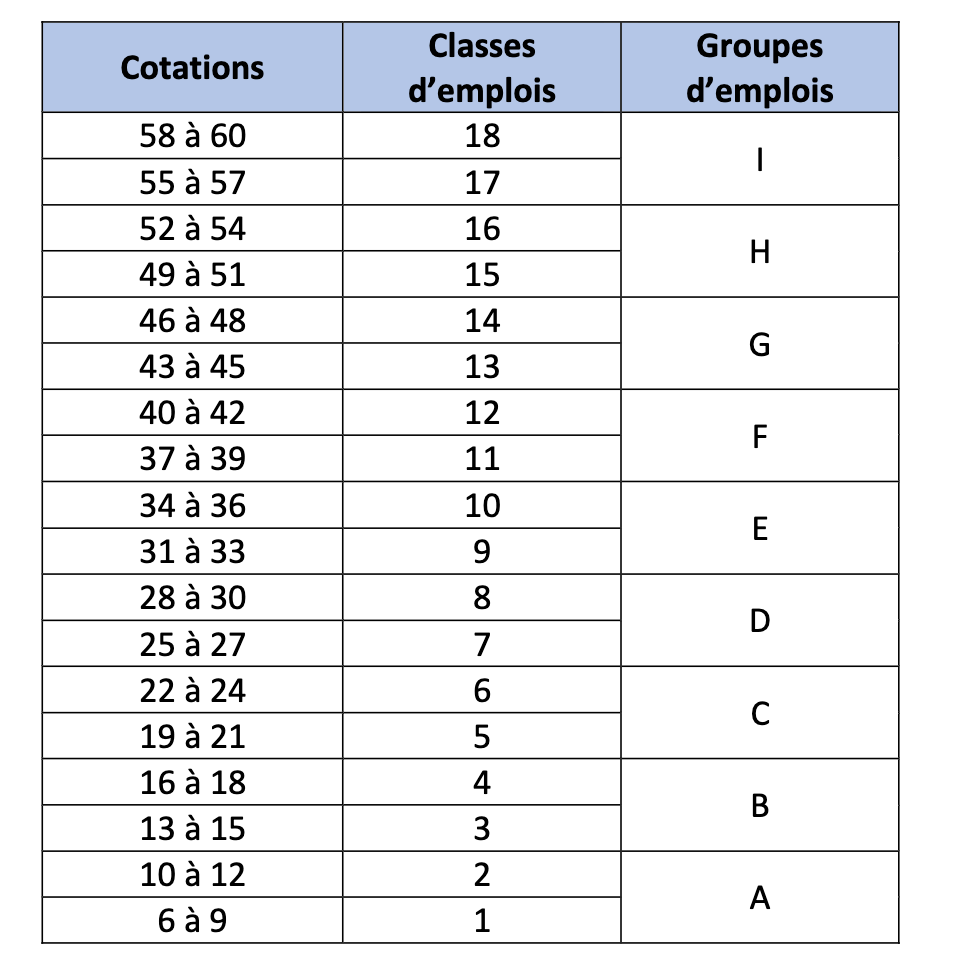

# Convention collective nationale de la métallurgie

**Convention collective nationale de la métallurgie du 7 février 2022**
*modifiée par l'avenant du 1er juillet 2022 et par l'avenant du 30 septembre 2022*

*Version consolidée au 30 septembre 2022*

*Des coquilles ont été décelées dans le texte, elles seront modifiées par avenant.*

---

## PRÉAMBULE

*Modifié par Avenant du 30 septembre 2022 à la CCN du 7 février 2022 - art. 1.*

Dès le début du XXème siècle, les partenaires sociaux de la branche ont cherché, par la négociation
collective – alors peu structurée juridiquement –, à faire converger les intérêts respectifs des salariés et des
entreprises, avec la conviction partagée que seule une industrie forte et compétitive est créatrice
d'emplois.

La branche professionnelle de la métallurgie, qui regroupe un nombre important de salariés et
d'entreprises exerçant des activités industrielles très diverses, a contribué au modèle social français. De
nombreuses avancées sociales mises en place dans la métallurgie sont devenues des acquis fondamentaux
pour tous les secteurs d'activité de l'économie.

Après l'entrée en vigueur de la loi du 11 février 1950, les négociations collectives de branche se sont
multipliées. En raison, notamment, de l'implantation historique des sites industriels, ces négociations de
branche étaient exclusivement territoriales, afin de tenir compte des importantes différences industrielles
et économiques qui existaient alors entre les départements français, voire au sein de certains d'entre eux.

A partir des années 1970, ces différences territoriales ont commencé à s'estomper. Le besoin de règles
uniformes, simples et fiables, a alors prévalu. C'est ainsi que la branche a entrepris, dans certains domaines,
la négociation d'accords nationaux qui venaient compléter les conventions collectives territoriales. Tel a
été le cas, en particulier, de l'Accord national du 10 juillet 1970 sur la mensualisation, qui a unifié les statuts
respectifs des ouvriers et des ETAM. Tel a également été le cas de la Convention collective nationale des
ingénieurs et cadres de la métallurgie du 13 mars 1972, qui a été substituée aux avenants « ingénieurs et
cadres » qui figuraient, à l'époque, dans les conventions collectives territoriales.

Depuis les années 2000, les profondes mutations de l'environnement industriel, qu'elles soient
technologiques, organisationnelles, ou liées à la globalisation de l'économie ou au respect de
l'environnement, ont renforcé encore le besoin de règles conventionnelles uniformes.

Dans l'industrie comme ailleurs, l'environnement de travail a considérablement évolué : les
organisations traditionnelles des entreprises sont repensées à l'aune des nouvelles technologies et des
défis environnementaux. La globalisation de l'économie, générant une concurrence mondiale toujours plus
forte, implique que chaque acteur s'adapte en permanence à l'évolution rapide des métiers et des
compétences. Les entreprises et les salariés se sont nécessairement adaptés. Les dispositions
conventionnelles doivent donc, à leur tour, s'adapter à ces transformations.

Enfin, les évolutions législatives récentes ont ouvert aux partenaires sociaux – de branche et d'entreprise - des possibilités nouvelles d'organisation du travail et de dialogue social.

Partant du constat que le système conventionnel de la branche n'est plus adapté à la réalité des métiers
et des environnements de travail, ni aux attentes des entreprises et des salariés en matière de qualité de
vie et des conditions de travail, les signataires ont pris, en 2016, leurs responsabilités, pour répondre à ces
nouveaux défis.

Ils ont ainsi engagé une négociation nationale, destinée à moderniser le dispositif conventionnel de la
branche, en substituant, à l'ensemble des conventions collectives territoriales et sectorielle, et à l'ensemble
des accords nationaux, une seule convention collective nationale, incluant un système de protection sociale
et une grille de classification unique totalement inédite, applicable à tous les salariés.

La négociation collective de branche remplit une double fonction régulatrice : celle des normes sociales
et celle de la concurrence entre les différents secteurs industriels qui composent la branche. Ni la loi, ni la
négociation d'entreprise ne peuvent réaliser à la fois ces deux fonctions essentielles. Par la présente

convention collective nationale, les signataires entendent ainsi revitaliser la négociation de branche. Cette
convention, qui repose sur un large consensus, facilitera et enrichira en outre le dialogue social, dans la
branche à son niveau territorial comme dans les entreprises, avec les femmes et les hommes qui font le
succès des entreprises.

Au-delà de dispositions qui s'appliquent directement à tout salarié de la branche, la convention
collective définit des orientations, des outils ou des méthodes, dont les entreprises sont invitées à se saisir,
pour développer le dialogue social et permettre aux salariés de construire de véritables projets d'évolution
professionnelle dans un environnement de travail de qualité.

La présente convention collective nationale est l'illustration de la volonté des signataires de construire
un cadre conventionnel plus simple, plus accessible, plus juste, socialement et économiquement plus
performant, au service du développement et de l'excellence de l'industrie.

## TITRE I. DISPOSITIONS GENERALES

### Chapitre 1. Périmètre et champ d’application

##### Article 1. Périmètre de la branche

Le périmètre d'une branche professionnelle est constitué d'un ensemble d'activités économiques
cohérentes. Pour la branche de la métallurgie, ce périmètre couvre, à ce jour, l'ensemble des activités
économiques visées dans l'Accord national du 16 janvier 1979 sur le champ d'application des accords
nationaux de la métallurgie. Il est susceptible d'évoluer, notamment dans le cadre de la restructuration des
branches professionnelles, et ainsi de couvrir d'autres activités économiques.

La branche de la métallurgie est unique. Son périmètre géographique couvre l'ensemble du territoire
national.

Le périmètre de la branche se distingue du champ d'application de la convention collective nationale et
des accords collectifs de branche autonomes. Cette convention et ces accords peuvent, en effet, comporter
un champ d'application territorial ou professionnel plus restreint que le périmètre de la branche.

Le périmètre de la branche se distingue également du champ de représentation statutaire de ses
acteurs. Ces derniers sont, d'une part, les organisations patronales et, d'autre part, les organisations
syndicales de salariés représentatives, qui ont statutairement vocation à intervenir, au niveau national ou
territorial, dans le périmètre de cette branche.

##### Article 2. Champ d’application de la convention collective nationale

###### Article 2.1. Champ d’application professionnel

La présente convention collective nationale s'applique aux entreprises dont l'activité est visée par
l'Accord national du 16 janvier 1979 sur le champ d'application des accords nationaux de la métallurgie.

###### Article 2.2. Champ d’application territorial

La présente convention collective nationale s'applique en France métropolitaine.

###### Article 2.3. Salariés visés

La présente convention collective nationale s'applique à l'ensemble des salariés des entreprises visées
à l'Article 2.1 de la présente convention.

Elle ne s'applique pas aux représentants de commerce qui relèvent du statut légal de VRP défini par les
articles L. 7311-1 et suivants du Code du travail. Toutefois, certaines dispositions de la présente convention
pourront être applicables à ces salariés, à condition de le stipuler expressément.

Elle ne s'applique pas non plus aux travailleurs à domicile définis par les articles L. 7411-1 du Code du
travail. Toutefois, certaines dispositions de la présente convention pourront être applicables à ces salariés,
à condition de le stipuler expressément.

### Chapitre 2. Ancienneté

##### Article 3. Définition de l’ancienneté

La définition de l'ancienneté visée au présent article s'applique aux droits et obligations liés à
l'ancienneté, prévus par les présentes dispositions conventionnelles.

L'ancienneté du salarié débute à partir de la date d'embauche au titre du contrat de travail en cours. En
cas de mutation concertée, l'ancienneté débute à partir de la date d'embauche dans la première entreprise.

En outre, sont prises en compte :
- la durée des contrats de travail antérieurs conclus avec la même entreprise, y compris les
contrats de chantier ou d'opération ;

- la durée des missions accomplies par le salarié dans l'entreprise avant son recrutement par
cette dernière au titre d'un contrat de travail temporaire conclu en application de l'article
L. 1251-1 du Code du travail ou d'un contrat de travail à durée indéterminée intérimaire conclu
en application de l'article L. 1251-58-1 du Code du travail ;

- les périodes de suspension du contrat de travail.

### Chapitre 3. Affirmation des principes de la branche en matière de dialogue social

Un dialogue social dynamique et constructif est vecteur de progrès social et économique. Un tel dialogue
ne saurait être mené sans respecter certains principes essentiels pour assurer des échanges de qualité.

Les signataires de la présente convention s'accordent sur l'importance du strict respect de la liberté
d'opinion, de la liberté syndicale et du principe de non-discrimination, qui s'appliquent tant aux salariés
qu'aux employeurs. De tels principes constituent le socle d'une parole libre essentielle à la construction
d'un dialogue diversifié et prospère.

Eu égard au rôle déterminant des représentants du personnel, élus ou désignés, dans la construction du
dialogue social, la règlementation en vigueur accorde une protection spécifique à ces salariés. Les
signataires rappellent l'intérêt d'un tel statut protecteur, garantie d'un dialogue social vertueux.

Enfin, il est primordial que les différents acteurs de la négociation, ainsi que les salariés des entreprises
concernées, aient connaissance du contenu des dispositions conventionnelles applicables. Les signataires
mettent à disposition de l'ensemble des acteurs du dialogue, en branche et en entreprise, un espace, sur
un site internet administré par l'UIMM, dédié aux textes conventionnels applicables dans la métallurgie.

### Chapitre 4. Affirmation des principes de la branche en matière d’emploi, de formation, de conditions de travail, de handicap et d’égalité professionnelle

##### Article 4. Affirmation des principes de la branche en matière de santé, sécurité, qualité de vie et des conditions de travail

La qualité de vie et des conditions de travail, dont la santé et la sécurité au travail sont un des aspects,
est un facteur de santé et de réalisation personnelle pour les salariés. Sur le plan collectif, la qualité de vie
et des conditions de travail est une condition de la performance de l'entreprise. Elle contribue à la cohésion,

à la pérennité et au développement des entreprises de la métallurgie. Ainsi, un engagement dans ce
domaine est une nécessité pour assurer une compétitivité durable. Il garantit un mode de développement
équilibré dans les domaines économiques, sociaux et environnementaux.

Les signataires de la présente convention invitent les acteurs de l'entreprise à prendre conscience de
l'impact éventuel de leurs activités sur les milieux naturels, notamment l'eau, l'air, les sols, ainsi que sur la
consommation énergétique.

La présente convention propose une articulation entre les politiques de santé et de sécurité au travail
et une démarche plus globale de qualité de vie et des conditions de travail dans l'entreprise. Celle-ci devient
un enjeu important du dialogue social qui se déploie dans le cadre des institutions représentatives du
personnel et de la négociation d'entreprise, mais également dans le cadre d'un dialogue professionnel
constructif entre les salariés et leurs responsables hiérarchiques.

La santé, la sécurité et la qualité de vie et des conditions de travail s'inscrivent dans les enjeux plus
globaux de la responsabilité sociétale des entreprises. En impulsant une politique de prévention des risques
professionnels et d'amélioration de la qualité de vie et des conditions de travail, les signataires préparent
l'avenir.

Les signataires décident qu'un accord autonome développera ces thèmes, en fixant les principes d'une
démarche d'amélioration de la santé, de la sécurité et de la qualité de vie et des conditions de travail. Les
rôles respectifs des différents acteurs, institutions et instances de l'entreprise et de la branche seront
présentés. L'accord donnera les orientations des principales actions à conduire en santé et qualité de vie et
des conditions de travail et recensera les principaux risques connus dans la métallurgie.

##### Article 5. Affirmation des principes de la branche en matière d’emploi et de formation professionnelle

Placés au cSur d'un marché mondialisé, concurrentiel et en perpétuelle évolution, les entreprises
industrielles et leurs salariés doivent, en permanence, à la fois, maintenir leur niveau de compétence et de
qualification, et innover sans cesse pour répondre aux défis démographiques, technologiques,
environnementaux, de recherche et de développement, d'investissement, et d'adaptation aux mutations
des métiers.

Les signataires de la présente convention font le constat que les réponses à apporter à ces défis
impliquent d'adapter régulièrement la politique emploi-formation et les actions à mettre en œuvre. A cette
fin, ils décident de renvoyer la négociation du dispositif conventionnel de branche en matière d'emploi et
de formation professionnelle à un accord autonome qui détermine les orientations des principales actions
à mener.

La priorité est de mettre en œuvre une politique de branche, d'apprentissage et de formation
professionnelle, au service de l'emploi, en créant un cadre favorable permettant aux entreprises
industrielles, en particulier les petites et moyennes entreprises, de disposer des compétences dont elles
ont besoin pour mettre en œuvre leur stratégie et améliorer leur compétitivité, et, aux salariés, en tenant
compte de leurs aspirations personnelles, de maintenir et développer leurs compétences et leurs
qualifications, et de sécuriser les mobilités professionnelles, notamment par l'accès à des parcours de
formation certifiants.

Au-delà, les signataires rappellent leur profond attachement au dialogue social en matière d'emploi et
de formation professionnelle, exprimé, dans les entreprises, dans la branche au niveau national ou régional,

ou encore dans un cadre interindustriel dans l'objectif de partager une véritable politique emploi-formation
interindustrielle.

##### Article 6. Affirmation des principes de la branche en matière d’égalité de traitement entre salariés et la prévention des discriminations

Les signataires de la présente convention sont attachés au respect des principes de non-discrimination
et d'égalité de traitement entre salariés. Les décisions de l'employeur sont prises en fonction de critères
professionnels et non sur des considérations d'ordre personnel, fondées sur des éléments extérieurs au
travail. Seules certaines différences de traitement répondant à une exigence professionnelle essentielle et
déterminante sont possibles, pour autant que l'objectif soit légitime et l'exigence proportionnée.

A ce titre, aucun salarié ne peut être écarté d'une procédure de recrutement ou de l'accès à un stage ou
à une période de formation en entreprise pour l'un des motifs visés par les dispositions légales en vigueur.

Par ailleurs, les signataires rappellent qu'aucun salarié ne peut être sanctionné, licencié ou faire l'objet
d'une mesure discriminatoire, directe ou indirecte, pour un motif discriminatoire prohibé par la législation
en vigueur et tout particulièrement dans les domaines de la rémunération, de la formation, du
reclassement, de la classification ou de la promotion professionnelle.

Les litiges sont réglés selon les modalités prévues par les dispositions légales en vigueur.

##### Article 7. Affirmation des principes de la branche de la métallurgie en matière d’égalité professionnelle

Les signataires de la présente convention sont convaincus que la diversité des parcours et la
complémentarité des approches sont de réels atouts pour l'entreprise, sa croissance et son dynamisme
social.

L'enjeu social de la mixité est une priorité de la branche, notamment, pour déconstruire, démystifier les
stéréotypes, accompagner les salariés, et en particulier les femmes, à saisir l'opportunité d'apporter et de
développer leurs compétences au sein de l'industrie.

Les signataires rappellent que l'égalité professionnelle entre les femmes et les hommes constitue une
priorité de la branche. Ils partagent le constat selon lequel les actions les plus efficaces sont celles qui sont
mises en œuvre directement au niveau de chacune des entreprises, notamment, par la négociation
d'accords collectifs ou la définition de plans d'action dans ce domaine.

A cette fin, ils incitent les entreprises à développer une culture prenant en compte la diversité et à
sensibiliser l'ensemble des salariés, spécialement les responsables d'équipe, aux principes et pratiques de
non-discrimination liés au sexe, à l'identité de genre ou à la grossesse, notamment en matière de
recrutement, de rémunération, de formation, d'affectation, de qualification, de classification, de promotion
professionnelle ou de mutation.

En matière d'égalité professionnelle, les signataires ont à cSur de proposer des mesures de nature à
privilégier, développer et garantir les principes de diversité et d'égalité des chances, valeurs essentielles de
la branche, et de poursuivre ses efforts en la matière.

Les signataires souhaitent ainsi impulser une nouvelle dynamique de la politique de la branche, tant en
faveur de l'égalité professionnelle que de la suppression des écarts de rémunération entre les femmes et
les hommes.

Les litiges sont réglés selon les modalités prévues par les dispositions légales en vigueur.

##### Article 8. Affirmation des principes de la branche en matière de handicap

Conscients du rôle qui incombe à la branche en matière de handicap, les signataires de la présente
convention décident de la mise en place d'une politique durable en faveur de l'insertion professionnelle,
de la formation professionnelle et de l'emploi des personnes en situation de handicap. La politique
d'insertion, de maintien dans l'emploi et de prévention du handicap, et les actions qu'elle détermine, sont
concrétisées par les dispositions conventionnelles en vigueur en matière de handicap prévues par un accord
autonome.

A cette fin, les signataires se fixent pour ambition d'accompagner et de sensibiliser les entreprises,
quelle que soit leur taille, en vue de favoriser l'insertion, le maintien dans l'emploi et l'évolution de carrière
des personnes en situation de handicap. Dans ce cadre, ils accorderont une attention particulière à la
prévention de la désinsertion professionnelle, à la détection des situations de travail et des environnements
professionnels susceptibles d'affecter la santé des salariés, ou de nature à remettre en cause leur maintien
dans l'emploi dans les entreprises de la métallurgie.

Au-delà, les signataires affirment leur profond attachement à l'application du principe de nondiscrimination et d'égalité de traitement, que ce soit en matière d'accès à l'emploi, d'accès à la formation
professionnelle ou d'évolution de carrière des personnes en situation de handicap.

## TITRE II. PRINCIPES, PHILOSOPHIE ET ARCHITECTURE DU DISPOSITIF CONVENTIONNEL DE LA BRANCHE

### Chapitre 1. La branche professionnelle de la métallurgie

##### Article 9. Le rôle de la branche : une vision et une ambition

Par le dialogue et la négociation entre les organisations patronales et les organisations syndicales, la
branche constitue le niveau pertinent pour construire une vision et une ambition communes aux
employeurs et aux salariés qu'elle regroupe.

Dans cette perspective, l'action commune des partenaires sociaux de la branche de la métallurgie
poursuit notamment les objectifs suivants :
1. favoriser l'attractivité, le développement et la performance des entreprises de la branche, et
donc l'emploi, en tenant compte des enjeux économiques et sociaux auxquels ces entreprises
sont confrontées ;
2. promouvoir une industrie forte, compétitive, prospère, et porteuse d'innovation sociale,
auprès des différents intervenants du champ politique, économique et social ;
3. concourir à réguler la concurrence entre les entreprises relevant du champ d'application de la
convention collective nationale et des accords collectifs de branche autonomes, en application
de l'article L. 2232-5-1, 2° du Code du travail, conformément à l'objet des syndicats
professionnels qui la composent, défini à l'article L. 2131-1 du Code du travail ;
4. anticiper et accompagner les besoins des entreprises et des salariés ;
5. développer des environnements de travail attractifs pour les salariés, notamment en
apportant, dans le cadre de la négociation collective, des garanties sociales spécifiques à la
branche ;
6. orienter, notamment en matière sociale, des politiques publiques favorables au
développement de l'industrie et de ses emplois ;
7. promouvoir un dialogue économique et social efficace, aux différents niveaux de la branche et
dans les entreprises ;
8. favoriser le maintien de la capacité des salariés à occuper un emploi, en tenant compte de
l'évolution des métiers de la branche et du marché du travail.

##### Article 10. Les moyens pour y parvenir

Pour concrétiser le rôle de la branche, sa vision et son ambition, les partenaires sociaux de la branche
disposent des outils que constituent la négociation collective et les autres formes de dialogue social.

###### Article 10.1. La négociation collective de branche : un cadre de référence

La négociation collective de branche permet d'assurer la cohérence des règles applicables dans le champ
des relations sociales au sein des entreprises de la branche, à travers un corpus de normes communes à ces
entreprises. Ce corpus comprend des dispositions dont la force normative est déterminée par les
signataires.

Les signataires de la présente convention rappellent que la légitimité de ce corpus de normes repose sur
celle des parties qui en sont signataires. En application de la loi, cette légitimité, pour la partie représentant

les salariés, résulte de l'audience électorale de chacune des organisations syndicales représentatives au
moment de la conclusion des dispositions conventionnelles qui composent ce corpus.

###### Article 10.1.1. L’objet de la négociation collective de branche

Les garanties apportées aux salariés par la négociation collective contribuent à favoriser l'attractivité de
la branche. Elles permettent également à la branche professionnelle de jouer son rôle de régulateur social.

Le corpus de dispositions conventionnelles de branche définit les conditions d'emploi, de formation
professionnelle et de travail des salariés, ainsi que leurs garanties sociales.

Ce corpus comporte notamment des droits et des obligations pour les salariés et pour les employeurs,
ainsi que des droits et des obligations que les organisations patronales et les organisations syndicales se
fixent à elles-mêmes par ces normes.

Il comporte également des dispositions permettant aux entreprises d'accéder, même en l'absence d'un
accord collectif conclu à leur niveau, à des dispositifs dont la mise en œuvre est conditionnée, par la loi, à
la conclusion d'un accord collectif.

###### Article 10.1.2. La force normative des dispositions conventionnelles de branche

Le corpus de normes conventionnelles de branche détermine la force normative de chacune de ses
dispositions.

En particulier, il distingue les dispositions impératives au sens de l'article L. 2253-2 du Code du travail,
c'est-à-dire celles auxquelles un accord d'entreprise ne peut pas déroger dans un sens moins favorable aux
salariés, par opposition aux dispositions dérogeables, c'est-à-dire celles auxquelles un accord d'entreprise
peut déroger en défaveur des salariés. Le corpus de normes conventionnelles distingue également les
dispositions impératives au sens de l'article L. 2252-1 du Code du travail, c'est-à-dire celles auxquelles un
accord de branche couvrant un champ territorial ou professionnel moins large ne peut pas déroger dans un
sens moins favorable aux salariés.

Les signataires conviennent de déterminer les dispositions impératives au fur et à mesure des
négociations qu'ils conduisent.

Par ailleurs et indépendamment de ce qui précède, ce corpus distingue les dispositions conventionnelles
de branche non supplétives, qui s'appliquent quel que soit le droit conventionnel applicable dans
l'entreprise, par opposition aux dispositions conventionnelles de branche supplétives, qui s'appliquent
uniquement en l'absence d'accord d'entreprise ayant le même objet.

Les dispositions supplétives de branche ont pour objet de permettre aux conventions et accords
d'entreprise de définir, en fonction des spécificités de l'entreprise, de ses besoins ou de son environnement,
un équilibre plus adapté que celui négocié au niveau de la branche. Ces dispositions s'appliquent donc aux
entreprises qui n'ont pas conclu d'accord collectif d'entreprise ayant le même objet. Elles constituent, en
tout état de cause, un cadre de référence pour les négociations d'entreprise.

###### Article 10.2. Les autres formes de dialogue social

Le dialogue social permet également des échanges entre les acteurs de la branche sur les sujets qu'ils
jugent utiles, dans le cadre qu'ils déterminent.

Il est pertinent, en particulier, sur des thématiques telles que l'économie et les technologies, le travail
et son évolution, l'emploi et la formation professionnelle, le suivi de la négociation collective d'entreprise,
ou encore le suivi et l'évaluation des accords collectifs de branche.

Il peut également permettre de préparer ou d'accompagner la négociation collective de branche.

Il est organisé au niveau – national, régional ou territorial – le plus adapté, et selon les modalités qui
permettent des échanges efficaces, en fonction de ses finalités.

Le dialogue social de branche peut poursuivre, selon le cas :
1. un objectif de concertation : il s'agit d'organiser des échanges d'informations entre les
partenaires sociaux, le cas échéant sur la base d'observations ou de travaux prospectifs,
économiques et sociaux ;
2. un objectif de pilotage, afin de permettre d'orienter l'action d'interlocuteurs internes ou
externes à la branche ;
3. un objectif d'élaboration et de gestion d'outils paritaires et de moyens mutualisés, notamment
dans le domaine de l'emploi et de la formation professionnelle continue ;
4. un objectif de suivi et d'interprétation des dispositions conventionnelles de branche.

### Chapitre 2. L’architecture du dispositif conventionnel de la métallurgie

Le présent chapitre a pour objet de permettre l'application harmonieuse des dispositions
conventionnelles aux entreprises de la branche, en considération des trois niveaux de négociation suivants :
- la négociation de branche au niveau national ;

- la négociation de branche au niveau territorial (régional, départemental ou local) ;

- la négociation – d'établissement, d'entreprise, de groupe ou interentreprises –, pour les
entreprises relevant du champ d'application des conventions et accords collectifs de la
métallurgie.

##### Article 11. Les principes de l’architecture

*Modifié par Avenant du 30 septembre 2022 à la CCN du 7 février 2022 - art. 2.*

L'architecture du dispositif conventionnel de la métallurgie est organisée selon les principes suivants :
1. elle assure la cohérence des dispositions de branche conclues aux différents niveaux, territorial,
national ou sectoriel ;
2. elle permet, dans les conditions définies par les accords nationaux de branche, d'appliquer,
d'adapter ou de compléter, au niveau territorial, au niveau sectoriel et au niveau de
l'entreprise, les dispositions conventionnelles nationales ;
3. elle favorise l'innovation et permet l'expérimentation conventionnelle.

##### Article 12. La convention collective nationale

La convention collective nationale a pour objet d'harmoniser les dispositions conventionnelles de
branche applicables sur l'ensemble du territoire national. Elle contient les mentions nécessaires à son
extension.

Elle est négociée au niveau national et conclue pour une durée indéterminée.

##### Article 13. Les accords collectifs autonomes

*Modifié par Avenant du 30 septembre 2022 à la CCN du 7 février 2022 - art. 3.*

Les accords collectifs autonomes portent sur un ou plusieurs thèmes entrant dans l'objet de la
négociation collective.

Les accords autonomes peuvent être conclus pour une durée déterminée ou indéterminée. Chacun
d'entre eux peut, s'il a été conclu pour une durée indéterminée, être dénoncé indépendamment des autres
accords autonomes et de la convention collective nationale.

Les accords autonomes peuvent être conclus au niveau national, territorial ou sectoriel.

##### Article 14. La répartition des dispositions entre convention collective nationale et accords collectifs autonomes nationaux

La convention collective nationale est caractérisée par la stabilité des règles, principes et garanties
qu'elle contient.

Les accords collectifs autonomes nationaux portent sur des règles susceptibles d'évolutions en raison
d'enjeux politiques, économiques ou sociaux.

La répartition des dispositions conventionnelles, entre la convention collective nationale et les accords
autonomes nationaux, est réalisée au cours de chaque négociation, selon les principes prévus au présent
article.

##### Article 15. L’articulation des normes au sein de la branche

*Modifié par Avenant du 30 septembre 2022 à la CCN du 7 février 2022 - art. 4.*

Afin de garantir une meilleure sécurité juridique aux entreprises et aux salariés, les négociations
nationales et les négociations territoriales veillent à la cohérence et à la lisibilité des différentes normes de
branche.

Pour cela, ces négociations ne doivent pas aboutir à susciter des concours de normes. Il s'agit d'éviter
aux entreprises et aux salariés les difficultés liées à la détermination de la norme applicable, lorsque
plusieurs dispositions conventionnelles, établies dans la branche à des niveaux différents, ont le même
objet.

A cette fin, les négociateurs territoriaux et sectoriels concluent des accords autonomes respectueux des
dispositions conventionnelles dont le champ d'application est national.

### Chapitre 3. L’expérimentation conventionnelle

Le présent chapitre a pour objet de définir, dans la branche, le cadre de mise en œuvre de
l'expérimentation conventionnelle.

##### Article 16. Définition

Les clauses « d'expérimentation conventionnelle » ont pour objet de susciter, voire d'organiser, des
initiatives prises par les différents acteurs de la branche – en particulier les entreprises, les organisations
patronales et les organisations syndicales de salariés –, d'en suivre la mise en œuvre et d'en apprécier
l'efficacité, préalablement à leur éventuelle généralisation ou pérennisation.

Ces clauses peuvent notamment permettre aux accords ayant un champ d'application plus restreint, ou,
si elles le prévoient, à l'employeur, par décision unilatérale, d'avoir recours à certains dispositifs ou à
certaines pratiques que ces clauses déterminent.

##### Article 17. Modalités de mise en œuvre

Les clauses « d'expérimentation conventionnelle » précisent les objectifs qu'elles poursuivent. Elles
prévoient la durée de l'expérimentation.

Elles peuvent prévoir d'écarter l'application de certaines dispositions conventionnelles de branche
conclues au même niveau, pour les entreprises concernées par l'expérimentation, et pour la durée de celleci.

Ces clauses prévoient, le cas échéant, les modalités d'information ou de consultation des représentants
du personnel sur la mise en œuvre de l'expérimentation dans l'entreprise.

Elles prévoient un dispositif paritaire de suivi et d'évaluation de leurs effets. Lorsque l'expérimentation
est prévue par une disposition nationale, et sauf disposition contraire, ce suivi et cette évaluation sont
assurés par la sous-commission de l'observation de la négociation collective définie à l'Article 20.3.1 de la
présente convention.

Ces clauses prévoient également les conditions et les modalités de cessation de l'expérimentation.

##### Article 18. Terme de l’expérimentation

Lors de la cessation de l'expérimentation ou à l'échéance de son terme, et sauf disposition
conventionnelle prévoyant sa généralisation ou sa pérennisation, les dispositions conventionnelles dont
l'application avait été écartée s'appliquent à nouveau de plein droit, dans la mesure où elles n'ont pas été
mises en cause par ailleurs.

## TITRE III. GOUVERNANCE DU DIALOGUE SOCIAL DE BRANCHE

Dans la branche de la métallurgie, le dialogue social existe à un double niveau.

Au niveau national, le dialogue social s'exerce entre la ou les organisations patronales nationales de
branche et les organisations syndicales de salariés représentatives dans la branche.

Au niveau territorial, il s'exerce entre les chambres syndicales territoriales de la métallurgie et les
organisations syndicales de salariés représentatives dans la branche.

Le présent chapitre a pour objet de définir les règles applicables aux instances nécessaires à l'existence,
à chacun de ces niveaux, du dialogue social dans la branche de la métallurgie.

Les représentants des organisations syndicales de salariés membres des commissions paritaires prévues
par le présent titre sont désignés par les fédérations nationales.

### Chapitre 1. Les instances paritaires de branche relatives à la négociation, à l’interprétation, à la conciliation et au dialogue économique

#### Section 1. Au niveau national : la Commission paritaire permanente de négociation et d’interprétation de la métallurgie (CPPNI)
En application de l'article L. 2232-9 du Code du travail, une commission paritaire permanente de
négociation et d'interprétation (CPPNI) doit être mise en place dans chaque branche. La branche de la
métallurgie étant unique, la CPPNI de la branche de la métallurgie est mise en place au niveau national.

##### Article 19. Les missions de la CPPNI de la métallurgie

Les missions de la CPPNI de la métallurgie sont constituées à la fois de celles prévues par la loi, et de
celles que les signataires de la présente convention décident de lui attribuer.

###### Article 19.1. La négociation collective

En application de l'article L. 2261-19 du Code du travail, la CPPNI est l'instance au sein de laquelle sont
négociés et conclus la convention collective nationale et les accords collectifs de branche autonomes
susceptibles d'être étendus.

L'établissement annuel de l'agenda social de la branche, dans les conditions prévues à l'Article 20.2.1
de la présente convention, permet d'organiser la négociation de branche au niveau national.

###### Article 19.2. L’observation de la négociation collective

Le rôle de la CPPNI en matière d'observation de la négociation collective recouvre les missions
suivantes :
1. les missions confiées à l'observatoire de la négociation collective prévu par l'article L. 2232-10
du Code du travail, c'est-à-dire l'observation des accords collectifs conclus dans les entreprises
relevant de la métallurgie ;
2. l'établissement du rapport annuel d'activité, visé au 3° du II de l'article L. 2232-9 du Code du
travail, comportant le bilan des accords d'entreprise relatifs à la durée du travail, à la répartition
et à l'aménagement des horaires, au repos quotidien et aux jours fériés, aux congés et au
compte épargne-temps, en particulier l'impact de ces accords sur les conditions de travail des
salariés et sur la concurrence entre les entreprises de la branche et, le cas échéant, les
recommandations destinées à répondre aux difficultés identifiées, le bilan de l'action de la
branche en faveur de l'égalité professionnelle entre les femmes et les hommes, notamment en
matière de classifications, de promotion de la mixité des emplois et d'établissement des
certificats de qualification professionnelle, des données chiffrées sur la répartition et la nature
des postes entre les femmes et les hommes, ainsi que le bilan des outils mis à disposition des
entreprises pour prévenir et agir contre le harcèlement sexuel et les agissements sexistes ;
3. la veille sur le dispositif conventionnel de la métallurgie, en particulier concernant le respect
des principes de son architecture visés à l'Article 11 de la présente convention ;
4. le suivi de l'application des conventions et accords collectifs de branche conclus au niveau
national, sauf stipulations différentes prévues par la convention ou l'accord collectif ;
5. la veille sur les conditions de travail et l'emploi dans la branche, en application du 2° du II de
l'article L. 2232-9 du Code du travail.

###### Article 19.3. L’interprétation des dispositions conventionnelles de branche

###### Article 19.3.1. Demande d’interprétation émanant d’une juridiction judiciaire

La CPPNI de la métallurgie constitue, conformément à l'article L. 2232-9 du Code du travail, l'instance
compétente pour rendre un avis, à la demande d'une juridiction de l'ordre judiciaire, sur l'interprétation de
la convention collective nationale et des accords collectifs autonomes conclus dans la branche de la
métallurgie, formulée dans les conditions mentionnées à l'article L. 441-1 du Code de l'organisation
judiciaire.

La CPPNI se réunit dans le mois suivant la date de sa saisine. Lorsque cette demande porte sur une
disposition conventionnelle de branche conclue au niveau territorial, la CPPNI se réunit dans les quarantecinq jours civils suivant la date de sa saisine. Afin de faciliter le respect de ces délais, si nécessaire, cette
question s'ajoute à l'ordre du jour d'une des réunions prévues par le calendrier prévisionnel établi dans le
cadre de l'agenda social visé à l'Article 20.2.1 de la présente convention.

Lorsque cette demande porte sur une disposition conventionnelle de branche conclue au niveau
territorial, la CPPNI consulte la commission paritaire territoriale de négociation (CPTN), visée à la soussection 2, concernée. A cette fin, le secrétariat de la CPPNI transmet, dans les plus brefs délais et de manière
dématérialisée, la demande d'interprétation de la juridiction de l'ordre judiciaire à la CPTN. Celle-ci se réunit
dans le mois suivant la date de cette transmission.

L'avenant interprétatif conclu dans le cadre de la CPTN, ou l'avis qu'elle émet, est transmis à la CPPNI,
dans les plus brefs délais et de manière dématérialisée ou, à défaut, par tout autre moyen. Dans l'avis
qu'elle adresse à la juridiction de l'ordre judiciaire à l'origine de la demande d'interprétation, la CPPNI est
liée par l'avenant interprétatif ou l'avis émis par la CPTN.

###### Article 19.3.2. Autres demandes d’interprétation

En dehors du cas prévu à l'Article 19.3.1 de la présente convention, la CPPNI peut être saisie par l'une
des organisations qui la composent.

Toute demande d'interprétation d'une convention ou d'un accord collectif de branche doit être motivée
et adressée, par voie dématérialisée, au secrétariat de la CPPNI, dans les conditions déterminées par le
règlement intérieur visé à l'Article 20.5 de la présente convention.

La CPPNI de la métallurgie constitue l'instance, à l'exclusion de toute autre, compétente pour interpréter
la convention collective et les accords collectifs de branche autonomes conclus au niveau national.

La CPPNI se réunit dans le mois suivant la date de sa saisine.

###### Article 19.3.3. Modalités d’interprétation des dispositions nationales

Les membres de la CPPNI privilégient, dans la mesure du possible, la conclusion d'un avenant
interprétatif de la disposition litigieuse. L'avenant interprétatif n'ajoute, ni ne retranche à la disposition
litigieuse, donc ne la modifie pas. Il s'applique avec effet rétroactif à la date d'entrée en vigueur de la
disposition qu'il interprète.

Lorsque les organisations syndicales de salariés, signataires ou adhérentes à la convention ou à l'accord
contenant la disposition litigieuse, atteignent ensemble le seuil minimal de suffrages exprimés, mentionné
aux articles L. 2232-6 et L. 2232-7 du Code du travail, requis pour conclure une convention ou un accord
collectif, l'avenant interprétatif est conclu, à l'unanimité, par l'UIMM et ces organisations syndicales
signataires ou adhérentes.

Dans le cas contraire, l'avenant interprétatif est conclu par l'UIMM et les organisations syndicales de
salariés représentatives dans les conditions prévues à l'article L. 2261-7, II, du Code du travail.

A défaut d'avenant interprétatif, les membres de la CPPNI peuvent émettre un avis interprétatif de la
disposition litigieuse. Cet avis est adopté à la majorité simple des voix exprimées par l'UIMM et par les
organisations syndicales représentatives de salariés, signataires ou adhérentes à la convention ou à l'accord
contenant la disposition litigieuse. A ce titre, chacune de ces organisations syndicales de salariés
représentatives, signataires ou adhérentes, dispose d'une voix. L'UIMM dispose d'un nombre de voix égal
au nombre de voix de l'ensemble de ces organisations syndicales de salariés représentatives, signataires ou
adhérentes.

###### Article 19.4. La conciliation

La CPPNI peut être saisie, dans les conditions prévues à l'Article 20.3.2 de la présente convention, pour
traiter des conflits collectifs de travail susceptibles de survenir entre les employeurs et les salariés relevant
de la branche de la métallurgie, lorsque l'ampleur de ces conflits est nationale.

###### Article 19.5. La représentation de la branche

En application du 1° du II de l'article L. 2232-9 du Code du travail, la CPPNI de la métallurgie représente
la branche, notamment dans l'appui aux entreprises qui en relèvent et vis-à-vis des pouvoirs publics.

Elle exerce cette mission sur les sujets ne relevant pas de la compétence des instances paritaires de
branche en matière d'emploi et de formation professionnelle prévues aux chapitres 2 et 3 du présent Titre.

Pour accomplir cette mission, la CPPNI peut notamment constituer le cadre dans lequel sont élaborées
des lettres paritaires, signées par l'UIMM et tout ou partie des organisations syndicales de salariés
représentatives, à destination des pouvoir publics.

###### Article 19.6. Le dialogue économique

Le dialogue économique a pour objet l'échange d'informations d'ordre économique, entre l'UIMM et
les organisations syndicales de salariés représentatives, sur la base, le cas échéant, d'études, d'observations
ou de travaux.

##### Article 20. Le fonctionnement de la CPPNI de la métallurgie

###### Article 20.1. La composition de la CPPNI

La CPPNI est composée, d'une part, de l'UIMM et, d'autre part, des organisations syndicales de salariés
représentatives dans la branche.

Elle comprend :
- cinq représentants pour chacune des organisations syndicales de salariés représentatives dans
la branche ;

- un nombre de représentants de l'UIMM égal au nombre de représentants de ces organisations
syndicales.

###### Article 20.2. Les réunions de la CPPNI

Conformément à l'article L. 2232-9 du Code du travail, la CPPNI est convoquée au moins trois fois par
an, sans préjudice des réunions prévues à l'Article 20.2.1 et l'Article 20.2.2 de la présente convention.

###### Article 20.2.1. Réunion de l’agenda social

Chaque année, une réunion de la CPPNI est consacrée à l'établissement de l'agenda social.

Cette réunion vise à établir la liste annuelle et le calendrier prévisionnel :
- des thèmes de négociation de branche au niveau national ;

- des thèmes prioritaires de concertation à aborder dans le cadre du dialogue social de branche
au niveau national, à l'exclusion des questions d'emploi et de formation professionnelle, qui
relèvent de la compétence des instances paritaires de branche chargées de l'emploi et de la
formation prévues par les chapitres 2 et 3 du présent Titre.

L'agenda social distingue notamment :
1. les thèmes de négociation et de concertation prioritaires pour l'année ;
2. les thèmes relevant des négociations obligatoires de branche prévues aux articles L. 2241-1 et
suivants du Code du travail.

Chacune des organisations syndicales de salariés membres de la CPPNI adresse au secrétariat de cette
dernière, de manière dématérialisée, la liste de ses demandes de négociation ou de concertation, au moins
quatorze jours civils avant la date de la réunion. Le secrétariat de la CPPNI joint à la convocation la liste de
ces demandes de négociation ou de concertation.

Le compte rendu de la réunion est établi par le secrétariat de la CPPNI, visé à l'Article 20.4 de la présente
convention. Il reprend la liste prévisionnelle des thèmes de négociation et de concertation arrêtée d'un
commun accord, ainsi que le calendrier envisagé pour tenir ces négociations et concertations. Il est transmis
par son secrétariat aux membres de la CPPNI.

###### Article 20.2.2. Réunion de dialogue économique

Afin de permettre une meilleure compréhension des enjeux auxquels les entreprises industrielles et
leurs salariés sont confrontés, la CPPNI consacre, chaque année, au moins l'une de ses réunions au dialogue
économique visé à l'Article 19.6 de la présente convention.

###### Article 20.3. Les sous-commissions et instance de la CPPNI

Deux sous-commissions et une instance sont instituées, au niveau national, au sein de la CPPNI,
auxquelles cette dernière délègue l'exercice de certaines de ses missions. Les missions et le fonctionnement
des commissions paritaires territoriales de négociation (CPTN), constitutives de la CPPNI pour négocier au
niveau territorial des accords susceptibles d'extension, sont définis à la section 2 suivante.

###### Article 20.3.1. La sous-commission de l’observation de la négociation collective

###### Article 20.3.1.1. Missions

La sous-commission de l'observation de la négociation collective est chargée, par délégation de la CPPNI,
des missions visées à l'Article 19.2 de la présente convention.

La sous-commission peut formuler des propositions, de nature à faciliter le respect des principes sur
lesquels repose l'architecture du dispositif conventionnel visés à l'Article 11 de la présente convention.

Dans le cadre de la mission de suivi des accords collectifs de branche conclus au niveau national, elle
peut formuler toute proposition de modification de la convention collective et de ces accords, notamment
au regard de l'évolution des dispositions législatives et réglementaires. Ces propositions sont transmises au
secrétariat de la CPPNI en vue de l'élaboration de l'agenda social.

La sous-commission de l'observation de la négociation collective est réunie au moins une fois par an.

###### Article 20.3.1.2. Informations transmises à la sous-commission

La sous-commission de l'observation de la négociation collective est, pour la branche de la métallurgie,
l'unique instance destinataire des accords relatifs à la durée du travail, à la répartition et à l'aménagement
des horaires, au repos quotidien et aux jours fériés, aux congés et au compte épargne-temps visés au 3° du
II de l'article L. 2232-9 du Code du travail.

La transmission de ces accords s'effectue auprès du secrétariat de la CPPNI, de manière dématérialisée. A cet effet, l'UIMM crée une adresse électronique dédiée.

Dans des conditions et selon une périodicité déterminées par le règlement intérieur de la CPPNI, l'UIMM
adresse, sous forme dématérialisée, aux organisations syndicales de salariés membres de la sous-commission, une copie des accords collectifs reçus.

###### Article 20.3.1.3. Bilan annuel de la négociation collective dans la métallurgie
La sous-commission de l'observation de la négociation collective établit un bilan annuel des accords
collectifs conclus dans les entreprises de la métallurgie.

Ce bilan s'appuie sur des données quantitatives et qualitatives issues des accords d'entreprise transmis
à la sous-commission, ainsi que sur des éléments recueillis par le Ministère du Travail pour l'établissement
de son bilan annuel de la négociation collective.

###### Article 20.3.1.4. Rapport d’activité

La sous-commission de l'observation de la négociation collective établit le rapport annuel d'activité
prévu au 3° du II de l'article L. 2232-9 du Code du travail.

###### Article 20.3.2. La sous-commission de conciliation

Une sous-commission de conciliation est instituée, au niveau national de la branche de la métallurgie,
pour aider à la résolution des conflits collectifs dont l'ampleur est nationale et dont les enjeux justifient
l'intervention des partenaires sociaux de la branche.

La sous-commission est saisie par l'une des organisations membres de la CPPNI.

Toute demande de conciliation doit être adressée, sous forme dématérialisée, au secrétariat de la
CPPNI.

La sous-commission se réunit au plus tard dans les sept jours civils suivant la date de sa saisine.

###### Article 20.3.3. La composition des sous-commissions de la CPPNI

Chaque sous-commission de la CPPNI est composée :
- de deux représentants de chacune des organisations syndicales de salariés représentatives
dans la branche ;

- d'un nombre égal de représentants de l'UIMM.

###### Article 20.3.4. L’instance paritaire qualité de vie et des conditions de travail

Il est institué, sous l'égide de la CPPNI, une instance paritaire qualité de vie et des conditions de travail
(IPQVCT). Le fonctionnement de cette instance est régi par l'accord collectif autonome visé à l'Article 4 de
la présente convention.

L'instance est composée :
- de trois représentants de chacune des organisations syndicales de salariés représentatives
dans la branche ;

- d'un nombre égal de représentants de l'UIMM.

###### Article 20.4. Le secrétariat de la CPPNI

L'UIMM assume la tâche matérielle du secrétariat de la CPPNI et de chacune de ses sous-commissions
et instance.

La CPPNI, ses sous-commissions et instance siègent à l'UIMM.

###### Article 20.5. Le règlement intérieur de la CPPNI

Le règlement intérieur de la CPPNI définit notamment :
- les modalités de fixation de l'ordre du jour des réunions de la CPPNI, de ses sous-commissions
et instance ;

- les modalités de transmission des informations entre les membres de la CPPNI ;

- les modalités de la communication numérique ;

- les modalités de fixation des dates de réunion, en privilégiant un calendrier prévisionnel
annuel.

###### Article 20.6. Mode de consultation et de prise de décision

A l'exception de l'avis mentionné à l'Article 19.3.3 de la présente convention, lorsqu'un avis de la CPPNI
ou de l'une de ses sous-commissions ou instance est nécessaire, il est pris à la majorité simple des voix
exprimées. Chaque organisation syndicale de salariés représentative dans la branche dispose d'une voix.

L'UIMM dispose d'un nombre de voix égal au nombre de voix de l'ensemble des organisations syndicales
de salariés représentatives dans la branche. Lorsqu'un avis de la CPPNI ou de l'une de ses sous-commissions
ou instance est sollicité dans un délai restreint, il peut faire l'objet, si nécessaire, d'une consultation par
voie électronique dans les conditions prévues par le règlement intérieur.

#### Section 2. Au niveau territorial : la commission paritaire territoriale de négociation

Afin d'harmoniser les modalités du dialogue social dans la branche de la métallurgie, des commissions
paritaires territoriales de négociation (CPTN) sont instituées au niveau territorial.

##### Article 21. Le champ géographique de compétence de la CPTN

Le champ géographique de compétence de la CPTN correspond à celui de la convention collective
territoriale applicable avant sa disparition, figurant en annexe 8 de la présente convention.

##### Article 22. Les missions de la CPTN

La CPTN est chargée de la négociation des dispositions conventionnelles territoriales de branche et de
leur interprétation. Elle est également chargée de la conciliation des conflits collectifs survenant dans son
champ géographique de compétence.

###### Article 22.1. La négociation collective

La CPTN est l'instance au sein de laquelle sont négociés et conclus les accords collectifs territoriaux de
branche susceptibles d'être étendus en application de l'article L. 2232-5-2 du Code du travail.

###### Article 22.2. L’interprétation des dispositions conventionnelles

En dehors du cas prévu à l'Article 19.3.1 de la présente convention, la CPTN constitue la seule instance
compétente pour interpréter les accords de branche conclus dans son champ géographique de
compétence.

###### Article 22.2.1. Saisine de la CPTN

Pour l'interprétation des dispositions conventionnelles, la CPTN est saisie par l'une des organisations qui
la composent.

Toute demande d'interprétation d'un accord de branche conclu au niveau territorial doit être motivée
et adressée, par voie dématérialisée, au secrétariat de la CPTN.

La CPTN se réunit dans le mois suivant la date de sa saisine.

###### Article 22.2.2. Modalités d’interprétation

Les membres de la CPTN privilégient, dans la mesure du possible, la conclusion d'un avenant
interprétatif de la disposition litigieuse. L'avenant interprétatif n'ajoute, ni ne retranche à la disposition
litigieuse, donc ne la modifie pas. Il s'applique avec effet rétroactif à la date d'entrée en vigueur de la
disposition qu'il interprète.

Lorsque les organisations syndicales de salariés, signataires ou adhérentes à l'accord contenant la
disposition litigieuse, atteignent ensemble le seuil minimal de suffrages exprimés, mentionné aux articles
L. 2232-6 et L. 2232-7 du Code du travail, requis pour conclure un accord collectif, l'avenant interprétatif
est conclu, à l'unanimité, par la ou les chambres syndicales et ces organisations syndicales signataires ou
adhérentes.

Dans le cas contraire, l'avenant interprétatif est conclu par la ou les chambres syndicales parties à
l'accord contenant la disposition litigieuse et les organisations syndicales représentatives de salariés dans
la branche, dans les conditions prévues à l'article L. 2261-7, II, du Code du travail.

A défaut d'avenant interprétatif, les membres de la CPTN peuvent émettre un avis interprétatif de la
disposition litigieuse. Cet avis est adopté à la majorité simple des voix exprimées par la ou les chambres
syndicales territoriales membres de la CPTN et par les organisations syndicales de salariés représentatives
signataires ou adhérentes à l'accord contenant la disposition litigieuse. A ce titre, chacune de ces
organisations syndicales de salariés représentatives, signataires ou adhérentes, dispose d'une voix. La ou
les chambres syndicales territoriales membres de la CPTN disposent d'un nombre de voix égal au nombre
de voix de l'ensemble de ces organisations syndicales de salariés représentatives signataires ou adhérentes.

###### Article 22.3. La conciliation

La CPTN peut être saisie pour traiter des conflits collectifs de travail susceptibles de survenir, dans son
champ géographique de compétence, entre les employeurs et les salariés relevant de la branche de la
métallurgie, et dont les enjeux justifient l'intervention des partenaires sociaux.

A cette fin, il est instauré, au sein de la CPTN, une sous-commission de la conciliation.

La sous-commission de la conciliation est saisie par l'une des organisations membres de la CPTN.
Elle est composée :
- de deux représentants pour chacune des organisations syndicales de salariés représentatives
dans la branche ;

- d'un nombre égal de représentants de la ou des chambres syndicales territoriales de la
métallurgie dont le champ de représentation statutaire couvre ce champ de compétence.

Toute demande de conciliation doit être adressée, sous forme dématérialisée, au secrétariat de la CPTN,
visé à l'Article 23.3 de la présente convention.

La CPTN se réunit au plus tard dans les sept jours civils suivant la date de sa saisine.

##### Article 23. Le fonctionnement de la CPTN

###### Article 23.1. La composition de la CPTN

La CPTN est composée, d'une part, de la ou des chambres syndicales patronales territoriales de la
métallurgie dont le champ de représentation statutaire couvre le champ de compétence géographique de
la CPTN, et, d'autre part, des organisations syndicales de salariés représentatives dans la branche.

Elle comprend :
- quatre représentants, au plus, pour chacune des organisations syndicales de salariés
représentatives dans la branche ;

- d'un nombre égal de représentants de la ou des chambres syndicales territoriales de la
métallurgie dont le champ de représentation statutaire couvre ce champ de compétence.

###### Article 23.2. Les réunions de la CPTN

La commission paritaire territoriale de négociation est convoquée au moins une fois par an.

Dans la limite d'une fois par an, elle peut également être réunie à la demande de la majorité des
organisations syndicales de salariés membres de la CPTN. Dans ce cas, ces organisations adressent le ou les
thèmes qu'elles souhaitent aborder lors de cette réunion aux autres membres de la CPTN.

###### Article 23.3. Le secrétariat de la CPTN

La ou l'une des chambres syndicales territoriales assume la tâche matérielle du secrétariat de la CPTN.

###### Article 23.4. Le règlement intérieur de la CPTN

Le règlement intérieur de la CPTN définit notamment :
- les modalités de fixation de l'ordre du jour des réunions de la CPTN et de sa sous-commission ;

- les modalités de transmission des informations entre les membres de la CPTN ;

- les modalités de la communication numérique.

### Chapitre 2. Instances paritaires nationales de branche en matière d’emploi et de formation professionnelle

#### Section 1. La Commission paritaire nationale de l’emploi et de la formation professionnelle (CPNEFP)

##### Article 24. Missions

La CPNEFP a pour missions :
1. de permettre l'information et des échanges réciproques sur le contexte économique et social,
la situation de l'emploi dans la branche et dans les branches industrielles et ses évolutions
prévisibles ;
2. de définir les orientations prioritaires en matière d'observations prospectives des métiers et
des qualifications, d'alternance, de formation et de certifications professionnelles ;
3. d'assurer le suivi des dispositions conventionnelles en vigueur en matière d'emploi et de
formation professionnelle ;
4. de promouvoir la politique emploi-formation de la branche auprès de l'ensemble des acteurs
de l'emploi et de la formation professionnelle ;
5. de réaliser annuellement le bilan de fonctionnement des CPREFP ;
6. de permettre une information sur les conventions signées par l'UIMM dans le champ de
l'orientation, de l'emploi et de la formation professionnelle initiale et continue.

##### Article 25. Fonctionnement

###### Article 25.1. Composition

La CPNEFP comprend :
- a. cinq représentants désignés par chacune des organisations syndicales de salariés
représentatives dans la branche ;
- b. un nombre de représentants désignés par l'UIMM égal au nombre de représentants des
organisations syndicales de salariés.

La CPNEFP peut faire appel, si nécessaire, à des intervenants extérieurs pour éclairer ses travaux,
notamment les acteurs des autres branches industrielles.

###### Article 25.2. Réunions

La CPNEFP se réunit au moins deux fois par an.

###### Article 25.3. Mode de consultation et de prise de décision

Lorsqu'un avis de la CPNEFP, de la CPNEFP restreinte ou des groupes techniques paritaires est
nécessaire, il est pris à la majorité simple des voix exprimées.

Chaque organisation syndicale de salariés représentative dans la branche dispose d'une voix. L'UIMM
dispose d'un nombre de voix égal au nombre de voix de l'ensemble des organisations syndicales de salariés
représentatives dans la branche.

Lorsqu'un avis de la CPNEFP, de la CPNEFP restreinte ou des groupes techniques paritaires est sollicité
dans un délai restreint, il peut faire l'objet, si nécessaire, d'une consultation par voie électronique dans les
conditions prévues par le règlement intérieur visé à l'Article 25.5 de la présente convention.

###### Article 25.4. Secrétariat

L'UIMM assume la tâche matérielle du secrétariat de la CPNEFP.

###### Article 25.5. Règlement intérieur

La CPNEFP détermine son règlement intérieur, qui comporte notamment les modalités de fixation de
l'ordre du jour, les délais et modalités de transmission des documents préparatoires et les modalités de
validation des comptes rendus ou relevés de décisions de la CPNEFP, de la CPNEFP restreinte, ainsi que des
différents groupes techniques paritaires.

#### Section 2. La Commission paritaire nationale de l’emploi et de la formation

professionnelle restreinte (CPNEFP restreinte)

##### Article 26. Missions

Sous l'autorité de la CPNEFP, la CPNEFP restreinte assure les missions qui lui sont confiées par les
dispositions conventionnelles en vigueur en matière de formation professionnelle prévues par l'accord
collectif autonome visé à l'Article 5 de la présente convention, en particulier les priorités de financement
des différents dispositifs de formation.

##### Article 27. Fonctionnement

###### Article 27.1. Composition

La CPNEFP restreinte comprend :
- a) deux représentants désignés par chacune des organisations syndicales de salariés
représentatives dans la branche ;
- b) un nombre de représentants désignés par l'UIMM égal au nombre de représentants des
organisations syndicales de salariés.

###### Article 27.2. Réunion

La CPNEFP restreinte se réunit autant de fois que nécessaire et au moins deux fois par an.

###### Article 27.3. Secrétariat

L'UIMM assume la tâche matérielle du secrétariat de la CPNEFP restreinte.

#### Section 3. Groupes techniques paritaires de la CPNEFP

Trois groupes techniques paritaires agissent par délégation de la CPNEFP et dans le cadre des
orientations qu'elle détermine :
1. un groupe technique paritaire chargé des observations prospectives des métiers, des
compétences et des qualifications, dénommé groupe technique paritaire « Observations » ;
2. un groupe technique paritaire chargé d'établir les certifications professionnelles de la branche,
dénommé groupe technique paritaire « Certifications » ;
3. un groupe technique paritaire chargé d'établir les orientations prioritaires de la branche en
matière d'alternance, dénommé groupe technique paritaire « Alternance ».

En outre, la CPNEFP peut, en tant que de besoin, décider de créer des groupes techniques paritaires ad
hoc qui traitent d'une thématique qu'elle définit dans le champ de l'emploi ou de la formation
professionnelle, en particulier en matière de handicap. Ces groupes techniques paritaires agissent par
délégation de la CPNEFP.

Les missions de chaque groupe technique paritaire visé au présent article sont définies par les accords
collectifs autonomes visés à l'Article 5 et à l'Article 8 de la présente convention.

### Chapitre 3. Instances paritaires régionales de branche et dialogue social territorial en matière d’emploi et de formation professionnelle

#### Section 1. Les Commissions paritaires régionales de l’emploi et de la formation professionnelle (CPREFP)

##### Article 28. Champ d’intervention géographique

Une commission paritaire régionale de l'emploi et de la formation professionnelle (CPREFP) est
constituée dans chaque région administrative prévue par l'article L. 4111-1 du Code général des
collectivités territoriales, à l'initiative de l'UIMM régionale ou des chambres syndicales territoriales de la
région, après avis des représentants, sur la région concernée, des organisations syndicales de salariés
représentatives dans la branche.

La collectivité territoriale de Corse relève de la CPREFP constituée pour la région Provence Alpes Côte
d'Azur.

##### Article 29. Missions

Chaque CPREFP a pour missions :
1. de permettre l'information et des échanges réciproques sur le contexte économique et social,
la situation de l'emploi dans la région et ses évolutions prévisibles. En particulier, elle est
informée, en application de l'Article 82.1 de la présente convention, des projets de
licenciement pour motif économique d'au moins dix salariés ;
2. d'orienter les études et les travaux du groupe technique paritaire « Observations », en
particulier sur la définition des métiers en tension, ainsi que ceux des observatoires régionaux ;
3. dans le cadre des dispositions conventionnelles en vigueur en matière d'emploi et de formation
professionnelle prévues par l'accord collectif autonome visé à l'Article 5 de la présente
convention, d'échanger sur les orientations prioritaires et les résultats en matière de création
d'emploi, d'alternance, de formation et de certifications professionnelles en région. A ce titre,
elle est informée de toute négociation de branche ouverte, dans son champ d'intervention
géographique, portant sur l'emploi et la formation professionnelle ;
4. dans le cadre des dispositions conventionnelles en vigueur en matière d'emploi et de formation
professionnelle prévues par l'accord collectif autonome visé à l'Article 5 de la présente
convention, d'échanger sur le financement de l'alternance et de la formation continue ;
5. de promouvoir, dans la région, la politique emploi-formation de la branche auprès de
l'ensemble des acteurs de l'emploi et de la formation professionnelle ;
6. de permettre une information sur les conventions signées au niveau régional dans la branche,
dans le champ de l'orientation, de l'emploi et de la formation initiale, de l'alternance et de la
formation professionnelle continue ;
7. de désigner les experts, en application des articles L. 6211-2 et de l'article R. 6251-1 du Code
du travail, chargés du contrôle pédagogique des formations par apprentissage conduisant à
l'obtention des diplômes ;
8. ponctuellement, d'échanger sur les actions menées en matière d'insertion et de maintien dans
l'emploi de publics identifiés (personnes en situation de handicap, demandeurs d'emploi&) ;
9. de réaliser un compte rendu annuel de son activité qu'elle transmet à la CPNEFP.

##### Article 30. Fonctionnement

###### Article 30.1. Composition

Chaque CPREFP comprend :
- a) au moins trois représentants titulaires et trois représentants suppléants désignés, au
niveau national, par chaque organisation syndicale de salariés représentative dans la
branche ;
- b) un nombre de représentants titulaires et suppléants désignés par la(les) chambre(s)
syndicale(s) territoriale(s) de la région, égal au nombre de représentants des organisations
syndicales de salariés.

Chaque CPREFP peut faire appel, si nécessaire, à des intervenants extérieurs pour éclairer ses travaux,
notamment les acteurs des autres branches industrielles.

Les membres suppléants siègent uniquement en l'absence des membres titulaires. Toutefois, le
règlement intérieur visé à l'Article 30.3 de la présente convention peut prévoir les conditions selon
lesquelles un membre suppléant peut participer aux réunions de la CPREFP.

###### Article 30.2. Réunions

Chaque CPREFP tient au moins deux réunions par an.

###### Article 30.3. Règlement intérieur

Chaque CPREFP détermine son règlement intérieur, selon un modèle établi par la CPNEFP. Ce règlement
comporte notamment les modalités de fixation de l'ordre du jour, les délais et modalités de transmission
des documents préparatoires et les modalités de validation des comptes rendus ou relevés de décisions.

###### Article 30.4. Secrétariat

La délégation patronale régionale assure la tâche matérielle du secrétariat de la CPREFP.

###### Article 30.5. Mode de consultation et de prise de décision

Lorsqu'un avis de la CPREFP est nécessaire, il est pris à la majorité simple des voix exprimées.

Chaque organisation syndicale de salariés représentative dans la branche dispose d'une voix. La (Les)
Chambre(s) syndicale(s) territoriale(s) de la région dispose(nt) d'un nombre de voix égal au nombre de voix
de l'ensemble des organisations syndicales de salariés représentatives au niveau national dans la branche.

Lorsqu'un avis de la CPREFP est sollicité dans un délai restreint, il peut faire l'objet, si nécessaire, d'une
consultation par voie électronique dans les conditions prévues par le règlement intérieur visé à l'Article
30.3 de la présente convention.

#### Section 2. Autres formes de dialogue social territorial de branche en matière d’emploi et de formation professionnelle

##### Article 31. Dialogue social infrarégional

Les chambres syndicales territoriales et les organisations syndicales de salariés représentatives dans la
branche ont la possibilité de créer toute forme de dialogue paritaire à un niveau infrarégional, dans les
conditions et avec des missions qu'elles déterminent.

### Chapitre 4. Les modalités spécifiques du dialogue social

##### Article 32. Calendrier des négociations

Les signataires de la présente convention constatent que la négociation dans la branche de la
métallurgie est dynamique, tant par la variété des sujets traités que par le contenu des échanges qu'ils
suscitent. Ce dynamisme résulte notamment de la liberté des partenaires sociaux de fixer leur calendrier
de négociation en fonction des enjeux économiques et sociaux qu'ils jugent prioritaires, dans le cadre de
leur agenda social visé à l'Article 20.2.1 de la présente convention.

Les signataires considèrent que les périodicités des négociations obligatoires de branche, telles qu'elles
résultent des articles L. 2241-7 et suivants du Code du travail, conduisent parfois à perturber le traitement
de ces sujets arrêtés d'un commun accord, sans toujours apporter plus de clarté ou de pertinence à leurs
échanges.

L'article L. 2241-4 du Code du travail autorise les partenaires sociaux, au niveau de la branche, à adapter
à leurs spécificités la périodicité des négociations obligatoires. Les signataires souhaitent saisir cette
opportunité pour réaffirmer leur autonomie et leur responsabilité quant au dialogue social de branche.

En conséquence, à l'exclusion de la négociation relative aux salaires, visée à l'article L. 2241-8 du Code
du travail, la périodicité des négociations triennales obligatoires de branche est portée à 4 ans.

Sur la base de ces dispositions, un accord de méthode relatif à la périodicité des négociations est
négocié, conformément à l'article L. 2241-5 du Code du travail.

Toutefois, la périodicité demeure celle définie par le Code du travail lorsque le thème de négociation
obligatoire n'est pas traité par un accord collectif de branche en vigueur.

En tout état de cause, les membres de la CPPNI peuvent décider, dans le cadre de la réunion de l'agenda
social visée à l'Article 20.2.1 de la présente convention et selon les modalités prévues à l'Article 20.6 de la
présente convention, d'inscrire, dans le calendrier prévisionnel des négociations, un ou plusieurs thèmes
de négociation obligatoire avant le terme de la période dans laquelle s'inscrit l'obligation de le traiter.

A l'occasion de la réunion de l'agenda social, l'UIMM présente un état des lieux récapitulatif des thèmes
pour lesquels le Code du travail prévoit, au niveau de la branche, une obligation périodique de négocier.

Cet état des lieux mentionne la prochaine échéance de négociation pour chacun de ces thèmes.

Dans la métallurgie, sauf disposition conventionnelle contraire, les négociations périodiques obligatoires
visées aux articles L. 2241-1 et suivants du Code du travail sont engagées dans le cadre de la CPPNI.

Les partenaires sociaux peuvent convenir expressément qu'un thème, objet d'une des obligations
périodiques de négociation prévues par la loi, est traité au niveau territorial. Ils prévoient alors la périodicité
de cette négociation.

##### Article 33. Modalités de suivi, de révision et de dénonciation des accords collectifs

La convention collective nationale et les accords collectifs de branche autonomes, conclus au niveau
national ou au niveau territorial, prévoient leurs modalités de suivi, de révision, de dénonciation et, le cas
échéant, de dénonciation partielle.

Sauf disposition différente, le suivi de la convention et des accords nationaux est assuré par la souscommission de l'observation de la négociation collective de la CPPNI, visée à l'Article 20.3.1 de la présente
convention et le suivi des accords territoriaux est assuré par la CPTN.

### Chapitre 5. Les voies et moyens du dialogue social de branche

#### Section 1. Renforcement des acteurs du dialogue social

##### Article 34. La formation des partenaires sociaux de branche

Les signataires de la présente convention conviennent de développer les formations communes, en vue
d'améliorer les pratiques du dialogue social dans la branche. Ces formations, visées à l'article L. 2212-1 du
Code du travail, peuvent être dispensées par tous les centres, instituts ou organismes de formation.

L'Institut national du travail, de l'emploi et de la formation professionnelle (INTEFP) apporte son concours
à la création et à la mise en œuvre de ces formations.

Les signataires conviennent de développer ces formations communes, en vue, notamment, d'améliorer
les connaissances des acteurs de la négociation de la branche et, sans préjudice des formations communes
prévues par accord d'entreprise, des acteurs de la négociation dans les entreprises de la branche.

Dans cet objectif, ils conviennent de définir, le cas échéant avec l'appui de l'INTEFP, le contenu d'un
cahier des charges propre à la branche.

Celui-ci est créé dans le cadre d'un groupe de travail paritaire. Ce cahier des charges détermine, en
particulier, les thématiques traitées par les formations communes, qui portent sur l'environnement
économique, technologique et social, notamment les impacts et enjeux de performance industrielle
(évolution des procédés, transformation écologique et numérique, RSE, évolution des métiers, des emplois
et des compétences&), et, s'agissant plus particulièrement de l'entreprise, la connaissance de l'économie
et la gestion d'une entreprise, la dynamique de la négociation collective en entreprise ainsi que la
connaissance de l'environnement juridique (évolutions législatives et réglementaires du dialogue social,
articulation des niveaux de négociation, connaissance des accords conclus au niveau de l'entreprise et du
nouveau dispositif conventionnel de branche&).

##### Article 35. Mise à disposition auprès d’organisations syndicales

Afin d'encourager et de sécuriser la mise à disposition de salariés auprès d'organisations syndicales,
l'Article 55 de la présente convention en détermine les principes directeurs, sans préjudice des accords
collectifs d'entreprise conclus sur le même sujet.

#### Section 2. Les moyens du dialogue social

##### Article 36. Les moyens existants

Les différentes instances visées par le présent titre font l'objet de moyens prévus par les dispositions
législatives et réglementaires.

###### Article 36.1. La participation d’un salarié à certaines instances paritaires

relatives à l’emploi et à la formation professionnelle
Les articles L. 3142-42 et suivants du Code du travail et leur décret d'application du 27 mars 1979
prévoient, notamment au bénéfice des salariés désignés pour siéger dans une commission, un conseil ou
un comité paritaire appelés à traiter des problèmes d'emploi ou de formation, une autorisation d'absence
sans diminution de rémunération, ainsi que le remboursement, par l'employeur, de leurs frais de
déplacement.

En conséquence, l'autorisation d'absence est accordée pour le temps qui coïncide avec l'horaire de
travail, aussi bien lorsque ce temps correspond au temps de réunion de l'instance paritaire, que lorsqu'il
correspond au temps permettant au salarié de se rendre sur le lieu de la réunion ou d'en revenir.

Dans la métallurgie, en application de l'arrêté du 20 mai 1980 modifié, bénéficient de cette
indemnisation les salariés désignés pour siéger :
- à la CPNEFP, à sa délégation restreinte, aux groupes techniques paritaires traitant de l'emploi
et de la formation agissant par délégation de la CPNEFP, visés au chapitre 2 du présent titre ;

- aux CPREFP, visées à la section 1 du chapitre 3 du présent titre ;

- lorsqu'elles existent, aux instances infrarégionales traitant des questions d'emploi et de
formation, visées à la section 2 du chapitre 3 du présent titre ;

- aux instances de l'Opco 2i telles que visées par l'Accord constitutif de l'Opco 2i.

Par ailleurs, en application de l'article L. 6332-1-3, II, du Code du travail, l'Opco 2i prend en charge, dans
les conditions déterminées par son conseil d'administration, les frais de déplacement, de séjour et de
restauration des personnes qui siègent au sein de ses organes de direction.

###### Article 36.2. Fonds de financement du paritarisme

En application des dispositions des articles L. 2135-9 et suivants du Code du travail, les organisations
syndicales de salariés et les organisations professionnelles d'employeurs bénéficient de financements
versés par le fonds paritaire prévu à cet article, notamment pour leur participation à la conception, la
gestion, l'animation et l'évaluation des politiques menées paritairement. Ces financements sont
majoritairement issus de la contribution patronale spécifique mentionnée au 1° du I de l'article L. 2135-10
du Code du travail.

Dans la métallurgie, ces financements doivent permettre de contribuer à financer les frais de
participation à l'ensemble des instances paritaires mises en place dans la branche, et en particulier
l'indemnisation des membres des organisations syndicales, qui ne bénéficient pas, en tant que salariés,
d'une des indemnisations visées à l'Article 36.1 de la présente convention.

##### Article 37. Les moyens complémentaires

###### Article 37.1. Autorisation d’absence et maintien de salaire

L'employeur accorde, aux salariés désignés par leur organisation syndicale représentative dans la
branche pour siéger à la CPPNI, à une CPTN ou à un jury paritaire de délibération réuni dans le cadre de
l'attribution de CQPM ou de CCPM, une autorisation d'absence, sans diminution de rémunération, pour
participer aux réunions de ces commissions.

L'autorisation d'absence est accordée pour le temps qui coïncide avec l'horaire de travail, aussi bien
lorsque ce temps correspond au temps de réunion de l'instance paritaire, que lorsqu'il correspond au temps
permettant au salarié de se rendre sur le lieu de la réunion ou d'en revenir.

Cette autorisation est accordée sous réserve que le salarié demandeur présente un justificatif et
respecte un délai de prévenance qui ne peut être inférieur à 8 jours civils.

Ce délai de prévenance n'est toutefois pas opposable au salarié lorsque la date d'envoi de la convocation
à la CPPNI, à la CPTN ou au jury paritaire de délibération de CQPM ou de CCPM ne permet pas de le
respecter.

###### Article 37.2. Allocations complémentaires

Les moyens mentionnés à l'Article 36.1 de la présente convention et à l'Article 36.2 ne couvrent pas
totalement les frais de fonctionnement de l'ensemble des instances, nationales et territoriales, de dialogue
social. En particulier, les frais de déplacement des participants à ces réunions peuvent constituer une charge
importante.

C'est pourquoi l'UIMM accepte de compléter ces moyens dans les conditions suivantes.

###### Article 37.2.1. Allocation annuelle forfaitaire

L'UIMM attribue une allocation annuelle forfaitaire aux organisations syndicales de salariés
représentatives au niveau de la branche. Cette allocation est versée à la fédération nationale de branche
de chacune de ces organisations.

Le montant de cette allocation annuelle forfaitaire est fixé à 20 000 €. L'allocation est versée au cours
du premier trimestre de l'année suivant celle au titre de laquelle elle est due.

Chaque versement s'effectue sur présentation, par l'organisation syndicale bénéficiaire, d'un état des
frais de fonctionnement auxquels est affectée la somme correspondante.

Chaque année, l'UIMM présente à la CPPNI un bilan de l'application des présentes dispositions.

Le montant de l'allocation visée au présent article est revalorisé tous les ans, proportionnellement à
l'évolution de la masse salariale de la branche professionnelle, telle qu'elle est retenue par l'Association de
gestion du fonds paritaire national (AGFPN), pour l'attribution des fonds dédiés au financement du dialogue
social.

La masse salariale de référence est celle de l'année qui précède l'entrée en vigueur des présentes
dispositions.

###### Article 37.2.2. Allocation liée aux déplacements

En complément de l'allocation visée à l'Article 37.2.1 de la présente convention, l'UIMM attribue une
allocation annuelle destinée, en particulier, à prendre en charge, pour partie, les frais de déplacement
engagés par les organisations syndicales de salariés pour se rendre à une instance paritaire de branche

régionale ou territoriale, dont l'existence est prévue par une disposition conventionnelle de branche
négociée au niveau national.

Ces instances sont les CPREFP, les CPTN et les jurys paritaires de délibération réunis dans le cadre de
l'attribution de CQPM ou de CCPM.

Cette « allocation de déplacement » est versée à la fédération nationale de branche de chacune des
organisations syndicales représentatives de salariés, qui participent à ces instances en application des
dispositions conventionnelles nationales. A défaut de fédération nationale de branche, elle est versée à
l'organisation syndicale interprofessionnelle à laquelle elle est affiliée.

Le montant de cette allocation dépend de la participation de chacune des organisations syndicales
représentatives de salariés, attestée par les chambres syndicales territoriales, aux instances visées cidessus.

Pour chaque organisation syndicale de salariés représentative membre d'une CPREFP, d'une CPTN ou
d'un jury de délibération de CQPM ou de CCPM, l'allocation de déplacement est égale au nombre de
réunions de ces instances auxquelles au moins un de ses représentants a participé, multiplié par un montant
forfaitaire établi comme suit :
- 200 € pour la participation à une réunion d'une CPREFP ;

- 100 € pour la participation à une CPTN ;

- 50 € pour la participation à un jury paritaire de délibération réuni dans le cadre de l'attribution
de CQPM ou de CCPM.

Ces montants sont indépendants de la composition de la délégation de l'organisation syndicale
concernée.

Le nombre de réunions prises en compte au titre de l'allocation de déplacement est limité comme suit :
- 2 réunions annuelles maximum par CPREFP ;

- 2 réunions annuelles maximum par CPTN.

Pour permettre le calcul et le versement de l'allocation de déplacement, les chambres syndicales
territoriales transmettent, deux fois par an, à l'UIMM, une attestation mentionnant la participation des
organisations syndicales aux CPREFP, aux CPTN et aux jurys paritaires de délibération des CQPM ou des
CCPM dont elles assurent le secrétariat.

L'allocation de déplacement est versée en deux fois. La première moitié est versée au cours du troisième
trimestre de chaque année, pour les réunions tenues de janvier à juin. La seconde moitié est versée au
cours du premier trimestre de l'année suivante, pour les réunions tenues de juillet à décembre.

Chaque versement est accompagné d'un état des lieux récapitulatif de la participation de l'organisation
syndicale de salariés aux instances paritaires mentionnées ci-dessus, telle qu'elle résulte des attestations
établies par les chambres syndicales territoriales.

Chaque organisation à laquelle l'UIMM verse l'allocation de déplacement établit, avant le 30 avril de
chaque année, un rapport sur l'utilisation de l'allocation perçue au titre de l'année précédente, qu'elle
transmet au secrétariat de la CPPNI. Ce rapport précise la répartition territoriale des sommes perçues. Une
synthèse des rapports établis en application du présent alinéa est présentée chaque année à la CPPNI.

Le versement de l'allocation de déplacement est conditionné au respect de l'obligation de transmission
à la CPPNI, dans les conditions visées à l'alinéa précédent, du rapport relatif à l'allocation versée l'année
précédente.

Les présentes dispositions relatives à l'allocation de déplacement s'appliquent à la date d'entrée en
vigueur de la présente convention.

Toutefois, lorsque l'indemnisation des organisations syndicales de salariés ou de leurs représentants –
au titre de leur participation à une CPREFP, à une commission de négociation territoriale ou à un jury de
délibération de CQPM ou de CCPM – est prévue par une disposition d'une convention ou d'un accord
collectif de branche conclu au niveau territorial ou du règlement intérieur de l'une de ces instances, les
réunions correspondantes ne seront prises en compte, dans le calcul de l'allocation de déplacement, qu'à
partir de l'abrogation de cette disposition territoriale.

###### Article 37.3. Articulation des dispositions relatives aux moyens du dialogue social
Les allocations complémentaires visées à l'Article 37.2 de la présente convention sont dues sans
préjudice du respect des obligations suivantes :
- l'obligation, pour l'employeur, de maintenir la rémunération et de prendre en charge les frais
de déplacement d'un salarié qui participe à certaines instances paritaires relatives à l'emploi
et à la formation professionnelle, dans les conditions rappelées à l'Article 36.1 de la présente
convention ;

- l'obligation, pour l'employeur, de maintenir la rémunération d'un salarié qui participe à une
réunion de CPTN, de CPPNI ou à un jury paritaire de délibération de CQPM ou de CCPM, dans
les conditions visées à l'Article 37.1 de la présente convention ;

- lorsqu'elles existent, les obligations issues de dispositions conventionnelles territoriales ou
d'un règlement intérieur de l'une de ces instances, qui prévoient des moyens spécifiques,
relatifs à une instance paritaire de branche autre que la CPPNI, la CPNEFP, une CPREFP, une
CPTN ou un jury paritaire de délibération de CQPM ou de CCPM.

## TITRE IV. DIALOGUE SOCIAL EN ENTREPRISE

### Chapitre 1. Des voies du dialogue adaptées à l’entreprise

Section préliminaire. Principes fondamentaux relatifs au dialogue en
entreprise

##### Article 38. Liberté d’opinion, liberté syndicale et principe de nondiscrimination

La qualité du dialogue social repose sur le respect mutuel, par l'ensemble des acteurs de l'entreprise,
des droits et libertés que leur garantissent la loi et la Constitution.

Les signataires de la présente convention réaffirment leur attachement à la liberté d'opinion ainsi qu'à
la liberté, tant pour les salariés que pour les employeurs, d'adhérer au syndicat professionnel de leur choix.

L'exercice du droit syndical est reconnu dans toutes les entreprises dans le respect des principes légaux
et constitutionnels, en particulier de la liberté individuelle du travail. Les syndicats professionnels peuvent
s'organiser librement dans toutes les entreprises conformément aux dispositions du Code du travail.

Compte tenu du rôle des organisations syndicales représentatives dans le cadre du dialogue social, les
signataires souhaitent rappeler que l'exercice du droit syndical doit être encouragé et développé.

En application de ces principes, et conformément aux articles L. 1132-1 et L. 2141-5 du Code du travail,
les signataires affirment leur volonté de prévenir toute forme de discrimination. Dans ce cadre, les
employeurs s'engagent à ne pas prendre en considération le fait d'appartenir ou non à un syndicat, à ne
pas tenir compte des activités syndicales des salariés en vue d'arrêter leur décision en ce qui concerne le
recrutement, l'accès à un stage ou à une formation, la conduite et la répartition du travail, l'évolution
professionnelle, la rémunération, les mesures de discipline et de rupture du contrat de travail. L'exercice
d'un mandat ne doit pas avoir pour effet de pénaliser le représentant du personnel, élu ou désigné, dans
l'accès aux emplois disponibles dans l'entreprise. S'agissant, en particulier, de l'évolution professionnelle,
la qualité de représentant du personnel, élu ou désigné, et l'exercice des responsabilités en découlant ne
doivent pas constituer, pour les salariés concernés, un obstacle aux promotions ou aux évolutions de
carrière auxquelles ils pourraient prétendre. Les entreprises s'engagent également à ne faire aucune
pression sur le personnel, en faveur d'un syndicat en particulier. En outre, elles recherchent les voies et
moyens de nature à valoriser les compétences acquises dans l'exercice des responsabilités de représentant
du personnel à l'occasion d'un projet d'évolution professionnelle du salarié. Les signataires estiment que
l'investissement porté par certains salariés dans le cadre de la prise de mandats peut représenter un
vecteur d'acquisition d'expériences et de nouvelles compétences et leur permettre ainsi, au-delà de leur
parcours de représentant du personnel, de poursuivre leur développement de carrière.

##### Article 39. Information des responsables hiérarchiques directs

La qualité des relations qu'entretiennent les représentants du personnel et leurs responsables
hiérarchiques directs participe à la construction d'un dialogue social vertueux.

C'est pourquoi les signataires de la présente convention reconnaissent l'importance d'améliorer la
connaissance et la compréhension, par ces responsables, du rôle des instances et des détenteurs d'un
mandat, ainsi que l'intérêt d'un dialogue social de qualité au sein de l'entreprise.

L'identification des responsables hiérarchiques directs résulte de l'analyse de la répartition des liens
fonctionnels, organisationnels et hiérarchiques au sein de l'entreprise. Il s'agit des personnes identifiées
comme étant notamment en mesure de donner directement, dans le cadre de leur activité professionnelle,
des instructions aux salariés titulaires d'un mandat, d'accompagner et de favoriser leur développement
professionnel.

Les entreprises informent, et forment si nécessaire, les responsables hiérarchiques qui accueillent dans
leur équipe, en particulier lorsqu'il s'agit de la première fois, un salarié élu ou désigné, sur son rôle, ses
attributions et les moyens mis à sa disposition, notamment le temps consacré à l'exercice du mandat et
l'adaptation de sa charge de travail.

En tout état de cause, les responsables hiérarchiques directs prennent en compte l'exercice du mandat
dans l'organisation du travail du salarié et dans la définition des objectifs annuels et leur évaluation.

##### Article 40. Protection des représentants du personnel

En raison de la nature de leurs missions, et dans l'intérêt de l'ensemble des salariés qu'ils représentent,
les salariés, élus ou désignés, bénéficient, dans les conditions fixées par la réglementation en vigueur, d'une
protection contre la rupture du contrat de travail à l'initiative de l'employeur.

Cette protection, nécessaire pour prévenir toute mesure discriminatoire, de représailles ou
d'intimidation, se traduit par l'obligation de respecter les procédures légales et réglementaires.

#### Section 1. Dialogue et représentation des salariés

##### Article 41. Périmètre de mise en place de la représentation du personnel

###### Article 41.1. Etablissements distincts et représentants de proximité

Les signataires de la présente convention s'attachent à reconnaître l'importance du rôle de la
représentation du personnel, élue ou désignée, dans l'élaboration d'un dialogue social constructif et
dynamique.

La configuration du comité social et économique (CSE), mis obligatoirement en place dans l'entreprise
dont l'effectif a atteint au moins onze salariés pendant douze mois consécutifs, peut être adaptée, dans
chaque entreprise, afin de déterminer un périmètre de représentation favorisant la qualité du dialogue
social.

A cet effet, la libre détermination du nombre et du périmètre des établissements distincts, laissée,
conformément à l'article L. 2313-2 du Code du travail, à l'appréciation des partenaires sociaux, permet
d'ajuster pleinement la structure de la représentation du personnel à l'organisation de la collectivité de
salariés concernés.

La centralisation des attributions et des acteurs au sein du comité social et économique permet aux
représentants du personnel d'accéder à une vision globale et périphérique des enjeux de l'entreprise.

Toutefois, les entreprises peuvent également avoir intérêt, au regard de leur activité, de leur structure ou
de leur organisation, à compléter leur paysage de représentation du personnel par la mise en place de
représentants de proximité, conformément à l'article L. 2313-7 du Code du travail.

Les représentants de proximité, dont le nombre, le rôle et les moyens de fonctionnement sont librement
déterminés par les partenaires sociaux, peuvent, en effet, permettre le traitement et la résolution de
problèmes au plus près du terrain, notamment en matière de santé, de sécurité et de conditions de travail.

A cet égard, les signataires de la présente convention incitent les entreprises à examiner, à l'occasion de
la négociation sur le périmètre de mise en place du comité social et économique, l'opportunité de négocier
un accord sur le droit syndical et d'instituer des représentants de proximité. Le cas échéant, l'accord
d'entreprise prévoit les moyens associés à leur mission.

Par ailleurs, il convient d'être attentif à l'articulation de leurs attributions avec celles dévolues aux
institutions représentatives du personnel.

Les représentants de proximité bénéficient, en tout état de cause, de la protection légale prévue aux
articles L. 2411-1 et suivants du Code du travail.

###### Article 41.2. Commission santé, sécurité et conditions de travail

De même, la négociation d'entreprise est le moyen d'adapter, à chaque entreprise, le nombre et les
modalités de mise en place des commissions du comité social et économique, en fonction des thématiques
prioritaires pour l'entreprise et les représentants des salariés, conformément à l'article L. 2315-45 du Code
du travail.

Les signataires de la présente convention considèrent que les thèmes liés à la santé, à la sécurité et aux
conditions de travail, traités par les comités sociaux et économiques et les commissions santé, sécurité et
conditions de travail (CSSCT), sont essentiels.

A cet égard, les signataires accordent une importance particulière à la détermination des attributions
de la ou des CSSCT, obligatoires notamment dans les entreprises ou établissements d'au moins trois cents
salariés. La liberté accordée aux partenaires sociaux, conformément aux articles L. 2315-41 et suivants du
Code du travail, de déterminer les modalités de fonctionnement et les missions déléguées à la commission
santé, sécurité et conditions de travail, permet, en effet, d'en ajuster le rôle à l'organisation et aux besoins
de l'entreprise dans ces matières.

Par ailleurs, les entreprises peuvent identifier leurs besoins en matière de prévention des risques liés à
leur activité, afin d'apprécier l'opportunité de faire évoluer le nombre de représentants et de mettre en
place une commission santé, sécurité et conditions de travail dans les entreprises ou établissements de
moins de trois cents salariés.

##### Article 42. Elections professionnelles

###### Article 42.1. Répartition du personnel entre les collèges

Au regard de la nouvelle classification prévue par la présente convention, et en l'absence de méthode
proposée par le Ministère du travail, les signataires de la présente convention proposent d'élaborer un
cadre indicatif de règles en vue de permettre aux partenaires sociaux de l'entreprise de procéder à une
répartition appropriée du personnel entre les collèges électoraux avant le 31 décembre 2023.

###### Article 42.2. Campagne électorale et modalités de vote

Les signataires de la présente convention rappellent l'importance, dans le processus électoral, de
l'organisation de la campagne électorale. L'utilisation, par les candidats, des moyens de communication,
mis à leur disposition par la loi, les conventions ou directement par l'employeur, permet de faire connaître

aux salariés les professions de foi des candidats et ainsi les raisons pour lesquelles ils se présentent et les
principes qu'ils défendent.

Quelle que soit la forme utilisée, la campagne électorale doit respecter les principes généraux du droit
électoral ainsi que la vie privée des salariés, et, le cas échéant, les dispositions relatives à la presse.

Les partenaires sociaux sont libres de déterminer, conformément à l'article L. 2314-26 du Code du
travail, les modalités d'organisation du vote les plus adaptées à la situation de l'entreprise, telles que le
vote physique, le vote électronique ou encore le vote par correspondance.

Le recours unilatéral au vote électronique par l'employeur ne peut intervenir qu'à l'issue d'une tentative
loyale de négociation avec le ou les délégués syndicaux s'ils existent.

En tout état de cause, le recours au vote électronique doit donner lieu à une concertation préalable avec
le comité social et économique, quelle que soit la taille de l'entreprise.

#### Section 2. Dialogue et participation des salariés

##### Article 43. Place du dialogue professionnel au sein du dialogue en entreprise

Les signataires de la présente convention entendent promouvoir une vision du dialogue en entreprise
en tant que facteur de progrès social, d'efficacité économique et d'amélioration des relations de travail.

La qualité de ce dialogue doit s'apprécier en termes de capacité à traiter des réalités du travail et à les
faire évoluer. Elle favorise également la circulation de l'information au sein de l'entreprise, la compétitivité
et la performance au travers des discussions sur la réalisation du travail, le bien-être au travail, et contribue
à la fidélisation des salariés. Dans cette optique, le dialogue dans l'entreprise doit s'entendre largement,
comme renvoyant à l'ensemble des échanges, débats et négociations qui ont lieu entre les différents
acteurs de l'entreprise, dans l'objectif de concourir au développement de l'entreprise et à l'amélioration
des conditions de travail.

Au regard de ces considérations, deux constituantes du dialogue en entreprise sont identifiées.

La première, le dialogue social, comprend :
- les mécanismes de dialogue réglementés par un ensemble riche de dispositions du Code du
travail, ce qui inclut tous types de négociation, consultation ou échange d'informations entre
les représentants du personnel, élus ou désignés, et l'employeur ;

- l'ensemble des échanges informels entre l'employeur et les représentants du personnel, sans
que ces échanges s'inscrivent dans une procédure réglementée.

La seconde, le dialogue professionnel, comprend des voies de dialogue permettant, sans empiéter sur
le dialogue social, ni l'entraver, d'impliquer plus directement les salariés sur les questions opérationnelles
des activités de l'entreprise.

Ainsi, le dialogue professionnel désigne toute forme de communication et de partage direct
d'informations relatives à la vie de l'entreprise, à son organisation et à la réalisation du travail. Ce dialogue
englobe l'ensemble des échanges au sein de la communauté de travail et, le cas échéant, avec l'employeur.

Le dialogue professionnel permet d'agir sur la qualité du travail, de redonner du sens au travail, en
explicitant les liens avec les objectifs de l'entreprise.

Les responsables hiérarchiques occupent une place essentielle dans l'animation du dialogue
professionnel, du fait de leur positionnement entre la direction et les salariés. Représentants de la direction

auprès des salariés, acteurs du relais des actualités de l'entreprise, ils concourent à la création et au
développement d'un dialogue de proximité. En contact direct avec les salariés, les managers de proximité
exercent donc un rôle central dans la promotion d'un dialogue professionnel durable et de qualité. En ce
sens, les managers de proximité concourent à entretenir le lien social dans l'entreprise.

Le dialogue social et le dialogue professionnel s'exercent de façon complémentaire, en vue de la
réalisation d'intérêts communs.

La diversité des canaux de dialogue favorise la richesse et la profondeur des échanges entre les parties
prenantes.

###### Article 43.1. Le dialogue professionnel dans les entreprises pourvues d’institutions représentatives du personnel

Le dialogue professionnel permet de mettre en lumière certaines situations professionnelles dont les
représentants du personnel et l'employeur ont intérêt à se saisir, afin d'enrichir leurs échanges. La
consultation des représentants du personnel et la négociation peuvent ainsi être nourries, tant par
l'employeur que par les élus, par la prise en compte des initiatives et des propositions faites par les salariés.

Ce dialogue permet d'impliquer plus directement les salariés sur les questions opérationnelles des
activités de l'entreprise présentées aux représentants du personnel, ou d'alimenter le dialogue social. Le
dialogue professionnel constitue un facteur de qualité de vie au travail.

Le dialogue professionnel ne doit pas se substituer au dialogue social. L'employeur respecte les priorités
légales d'information et de consultation des représentants du personnel.

###### Article 43.2. Le dialogue professionnel dans les entreprises dépourvues d’institutions représentatives du personnel

Dans les entreprises dépourvues d'institutions représentatives du personnel, le dialogue professionnel
est un facteur de bien-être au travail des salariés, dès lors qu'est encouragée leur participation, à travers
leur expression, à la définition de leurs conditions de travail et d'emploi, et qu'ils sont directement associés
à la compréhension des grandes orientations de l'entreprise au regard de son développement économique
et social.

L'information prévue à l'Article 49 de la présente convention, sur le rôle des représentants du personnel,
permet aux salariés de prendre connaissance de l'ensemble des prérogatives et missions inhérentes à
l'exercice des fonctions représentatives et peut favoriser l'engagement syndical.

###### Article 43.3. L’organisation du dialogue professionnel dans l’entreprise

Que l'entreprise soit ou non pourvue de représentants du personnel, les signataires de la présente
convention entendent déterminer un cadre d'organisation et de promotion du dialogue professionnel dont
les entreprises peuvent se saisir pour l'adapter à leur niveau. En outre, le respect de la liberté d'opinion et
d'expression des salariés est indispensable pour assurer un dialogue professionnel de qualité.

Le Code du travail réglemente une première voie de dialogue professionnel par le droit d'expression
directe et collective des salariés.

##### Article 44. Droit d’expression directe et collective

Le Code du travail offre une première voie du dialogue professionnel avec le droit d'expression directe
et collective. A ce titre, les salariés, notamment les responsables hiérarchiques, bénéficient d'un droit à

l'expression directe et collective, sur le contenu, les conditions d'exercice et l'organisation de leur travail.

L'expression directe et collective des salariés a pour objet de définir les actions à mettre en œuvre aux fins
d'améliorer leurs conditions de travail, l'organisation de l'activité et la qualité de la production dans l'unité
de travail à laquelle ils appartiennent et dans l'entreprise.

Le droit à l'expression directe et collective des salariés, sur les lieux et pendant le temps de travail, est
de droit dans toutes les entreprises sans condition d'effectif minimum. L'accès de chacun à ce droit
d'expression directe peut être assuré par le recours aux outils numériques, le cas échéant par les réseaux
sociaux d'entreprise. Les partenaires sociaux encouragent les entreprises à déterminer à leur niveau, et
indépendamment de leur taille ou de leur forme, les modalités d'exercice et de suivi de ce droit
d'expression collective adaptées à la communauté de travail. Le droit d'expression directe peut s'exercer
notamment au sein de groupes de discussion, d'ateliers d'expression, ou encore au moyen de
questionnaires du personnel.

Les représentants du personnel ont vocation à être associés à la détermination des modalités d'exercice
du droit d'expression directe des salariés, afin de permettre une articulation entre les deux composantes
du dialogue d'entreprise que sont le dialogue social et le dialogue professionnel.

##### Article 45. Partage sur la stratégie de l’entreprise

Le dialogue professionnel peut également prendre la forme d'une communication par l'employeur aux
salariés sur la stratégie de l'entreprise.

L'accélération de la transformation des modèles économiques, la digitalisation et l'automatisation des
modes d'organisation que traversent les entreprises rendent, plus que jamais, indispensables la
concertation et les échanges avec les différents acteurs de l'entreprise.

Ces changements ont un impact sur l'organisation et la réalisation du travail, et seront d'autant mieux
pris en compte que le dialogue de proximité sera développé.

Un partage responsable et transparent, par la direction de l'entreprise avec les salariés, des projets
envisagés et de leurs effets attendus est utile. En présence de représentants du personnel dans l'entreprise,
ce partage ne doit pas entraver le bon déroulement de leurs missions.

Ce partage prend tout son sens lorsqu'une bonne articulation entre dialogue social et dialogue
professionnel est effective, et que la direction de l'entreprise dispose d'une réelle capacité à pouvoir ajuster
ses projets au regard des échanges issus de ces deux formes de dialogue.

Il est utile pour les entreprises d'organiser une remontée des potentielles observations des salariés sur
les informations présentées par l'employeur, au besoin par l'intermédiaire de leurs responsables
hiérarchiques ou des représentants du personnel.

#### Section 3. Dialogue et négociation collective

##### Article 46. Délégué syndical adjoint

Le dialogue social est un facteur de cohésion au sein de l'entreprise. Par la recherche d'équilibres et de
compromis, dans un climat de loyauté, la négociation collective favorise et complète la construction de
normes adaptées aux besoins de l'entreprise et au développement de l'emploi.

Dans cet esprit, les entreprises sont incitées à négocier un accord de méthode, afin d'organiser les
modalités permettant à la négociation de se dérouler loyalement.

Au regard de la place qui lui est accordée par le Code du travail, la négociation avec les délégués
syndicaux constitue la voie privilégiée de l'élaboration de telles normes. A ce titre, le délégué syndical a
vocation à jouer un rôle essentiel.

La loi et les éventuelles dispositions en vigueur dans les entreprises confèrent au délégué syndical et au
délégué syndical central les moyens associés à leur mandat.

La définition du nombre et du périmètre des établissements distincts peut conduire à la création de
mandats électifs et désignatifs dont le champ d'intervention couvre une pluralité de sites géographiques.

Le cas échéant et lorsque l'entreprise ou l'établissement distinct concerné couvre au moins quatre sites
géographiques, la mise en place d'un délégué syndical adjoint, par accord collectif, constitue un moyen
utile pour favoriser le développement harmonieux de la négociation collective et le dialogue de proximité.

De même, lorsque l'entreprise dispose d'au moins quatre établissements distincts, la création, par
accord collectif, d'un délégué syndical central adjoint peut contribuer à promouvoir le dialogue social.

Le cas échéant, l'accord collectif instituant ces délégués syndicaux adjoints détermine leur rôle et les
moyens associés à leur mission.

##### Article 47. Coordonnateur syndical de groupe

Les organisations syndicales représentatives au niveau du groupe peuvent désigner, en application
de l'article L. 2232-32 du Code du travail, dans le cadre de la négociation d'un accord collectif de groupe,
un coordonnateur syndical de groupe.

Ce dernier n'est pas doté d'un statut par les dispositions légales. Il peut être opportun, selon les cas, de
lui reconnaître, par accord collectif de groupe, un statut pérenne, pour assurer la stabilité et l'efficacité des
négociations. Le cas échéant, l'accord collectif instituant le coordonnateur syndical de groupe détermine
les moyens associés à sa mission.

### Chapitre 2. Des moyens au service des acteurs du dialogue en entreprise

#### Section 1. Information des acteurs du dialogue

##### Article 48. Information sur le droit conventionnel applicable

*Modifié par Avenant du 30 septembre 2022 à la CCN du 7 février 2022 - art. 5.*

Les signataires de la présente convention conviennent de communiquer aux acteurs de la branche des
informations sur le droit conventionnel applicable. A ce titre, l'UIMM met à la disposition des entreprises
de la branche, au profit de leurs instances représentatives du personnel, de leurs représentants syndicaux,
et de leurs salariés, un espace sur son site internet, dédié exclusivement aux conventions et accords
collectifs, interprofessionnels ou professionnels – nationaux et territoriaux –, applicables dans les
entreprises et établissements qui entrent dans le champ d'application de la présente convention collective.

Le site visé au présent article est en libre accès. Il donne accès à l'ensemble des conventions et accords
collectifs considérés, ainsi qu'à leurs mises à jour et avenants éventuels. Son adresse est communiquée aux
entreprises adhérentes des chambres syndicales territoriales de la métallurgie et à celles adhérentes du

Syndicat professionnel patronal de la Sidérurgie, ainsi qu'aux organisations syndicales de salariés
représentatives dans la branche de la métallurgie.

L'employeur informe les salariés par tout moyen sur cette possibilité d'accès et sur l'adresse du site et
de la rubrique.

Les entreprises communiquent, en outre, aux salariés et aux représentants du personnel, dans les
conditions prévues par les dispositions légales et réglementaires du Code du travail, les conventions et
accords collectifs d'entreprise, d'établissement ou de groupe, ainsi que leurs modifications éventuelles, qui,
le cas échéant, leur sont applicables.

##### Article 49. Information des salariés sur le rôle des représentants du personnel

Les signataires de la présente convention incitent les entreprises de la branche à informer, selon la forme
de leur choix et de préférence en amont des élections professionnelles, leurs salariés sur les droits et
devoirs des représentants du personnel, ainsi que sur les moyens dont ils disposent pour l'exercice de leur
mandat.

Bénéficier de ces informations peut permettre aux salariés de prendre connaissance de l'ensemble des
prérogatives et responsabilités inhérentes à l'exercice des missions représentatives. Ainsi informés, les
salariés désireux d'exercer un mandat de représentant du personnel s'engagent en toute connaissance de
cause.

##### Article 50. Information des représentants du personnel sur leurs moyens d’action

Les représentants du personnel nouvellement élus ou désignés bénéficient, à l'occasion de l'entretien
individuel de début de mandat visé à l'Article 51.1 de la présente convention, des informations nécessaires
à l'exercice de leur mandat, en particulier les informations relatives aux moyens matériels et de formation.

Parmi ceux-ci figurent notamment les outils rappelés ci-après.

###### Article 50.1. Local des représentants du personnel

En application du Code du travail, l'employeur est tenu, selon l'effectif de l'entreprise ou de
l'établissement, de mettre à disposition des sections syndicales un local commun et, en outre, un local
propre à chaque section syndicale constituée par une organisation syndicale de salariés représentative.

Le local syndical demeure la propriété de l'entreprise. Dans ce cadre, les modalités d'aménagement et
d'utilisation du local par les sections syndicales sont fixées par accord avec l'employeur.

Le local syndical est distinct de celui affecté au CSE.

Le local syndical et le local du CSE sont, l'un et l'autre, accessibles aux salariés. Ils doivent être aménagés,
dotés du matériel nécessaire à l'exercice des fonctions des représentants du personnel, et convenir à
l'exercice de leurs missions, en vue notamment de leur permettre de se réunir.

###### Article 50.2. Base de données économiques sociales et environnementales

La base de données économiques, sociales et environnementales (BDESE), obligatoire dans les
entreprises d'au moins cinquante salariés, comprend l'ensemble des informations nécessaires aux
consultations récurrentes que l'entreprise met à la disposition du CSE.

Les éléments qui y figurent doivent être compréhensibles, et mis à jour chaque fois que nécessaire. La
BDESE est accessible en permanence aux membres de la délégation du personnel au CSE et au CSE central,
ainsi qu'aux délégués syndicaux. Ceux-ci sont tenus au secret professionnel et à une obligation de discrétion
à l'égard des informations contenues dans la BDESE revêtant un caractère confidentiel et présentées
comme telles par l'employeur.

Un accord d'entreprise peut adapter la BDESE, en définissant son organisation, son contenu, son
architecture et ses modalités de fonctionnement, notamment les droits d'accès ou le niveau de mise en
place dans les entreprises comportant des établissements distincts. La conclusion d'un tel accord au niveau
de l'entreprise permet d'adapter la BDESE pour la rendre conforme aux exigences de ceux y ayant accès. A
ce titre, les signataires de la présente convention encouragent les entreprises de la branche à négocier sur
le sujet. Les conséquences environnementales de l'activité de l'entreprise doivent être prises en
considération.

En tout état de cause, les signataires souhaitent que soit privilégiée la mise à disposition de la BDESE au
moyen d'un support informatique intuitif et d'outils numériques, notamment un ordinateur, permettant
de faciliter son accessibilité pour permettre sa consultation par ceux y ayant accès.

###### Article 50.3. Outils de communication des représentants du personnel

L'accroissement du travail à distance ainsi que le développement des nouvelles technologies modifient
la manière de communiquer. Une évolution des moyens de communication doit permettre de compléter
et d'améliorer les outils traditionnels, tels que l'affichage sur les panneaux réservés respectivement aux
communications syndicales et à celles du comité social et économique, les publications et tracts. Un accord
collectif ou un accord conclu avec le CSE peut, à ce titre, réglementer la mise à disposition pour les
représentants du personnel d'une messagerie électronique professionnelle ou de l'intranet de l'entreprise
lorsqu'il existe, l'objectif étant de faciliter la communication entre les salariés et les représentants du
personnel, élus ou désignés, y compris en situation de télétravail ou de travail sur un autre lieu que leur site
habituel.

A défaut d'accord dans l'entreprise, les représentants du personnel bénéficient d'une messagerie
électronique (professionnelle ou autre).

En cas d'utilisation des outils numériques par les représentants du personnel, ceux-ci doivent respecter
les conditions d'utilisation des moyens de communication fixées, le cas échéant, dans la charte de bonne
utilisation applicable à l'entreprise, notamment en termes de fonctionnement et de sécurité du réseau
informatique de l'entreprise.

Les règles relatives à la protection, à la confidentialité des données et au secret de fabrication, ainsi que
celles relatives à la liberté d'expression doivent également être respectées.

En tout état de cause, l'utilisation des outils numériques par les représentants du personnel ne doit pas
porter préjudice à la bonne marche de l'entreprise, ni entraver la liberté pour les salariés d'accepter ou de
refuser un message.

###### Article 50.4. Budgets du comité social et économique

Dans les entreprises d'au moins cinquante salariés, le CSE a la personnalité civile et gère son patrimoine.
Dans ce cadre, l'employeur verse au comité une subvention de fonctionnement ainsi qu'une contribution
pour financer les activités sociales et culturelles.

Le CSE assure, contrôle ou participe à la gestion de toutes les activités sociales et culturelles établies
dans l'entreprise.

Les activités sociales et culturelles constituent à la fois des éléments de cohésion sociale et d'attractivité.

La gestion de leur budget est placée sous la responsabilité du CSE, et constitue un élément à part entière
du mandat des élus du CSE.

Le CSE peut décider de transférer une partie du montant de l'excédent annuel de l'un de ces budgets
vers l'autre. Cette décision, qui résulte d'une délibération du CSE, émane de sa seule volonté. Le comité est
en effet seul compétent pour apprécier s'il est opportun d'effectuer un tel transfert.

#### Section 2. Parcours des acteurs du dialogue

##### Article 51. Entretiens réalisés au titre du mandat

###### Article 51.1. Entretien individuel de début de mandat

Le représentant du personnel élu ou le détenteur d'un mandat syndical bénéficie d'un entretien
individuel de début de mandat avec son employeur, portant sur les modalités pratiques d'exercice de son
mandat au sein de l'entreprise au regard de son emploi. Il peut se faire accompagner par une personne de
son choix appartenant au personnel de l'entreprise. Le responsable hiérarchique mène cet entretien,
accompagné, le cas échéant, d'un responsable des ressources humaines, lorsqu'il existe. L'entretien a pour
objectif de faciliter l'articulation entre l'activité professionnelle et l'exercice du mandat, et d'identifier les
mesures à mettre en œuvre à cette fin. Cet entretien ne se substitue pas à l'entretien professionnel ou à
l'entretien annuel d'évaluation.

A l'occasion de cet entretien, et afin d'éviter tout risque de distorsion entre la situation du détenteur
d'un mandat et celle des autres salariés, l'employeur examine, avec le salarié, les conditions dans lesquelles
il exerce à la fois son activité professionnelle et son ou ses mandats. Cet examen a pour objet d'identifier,
dès l'entrée dans le ou les mandats, les questions spécifiques susceptibles de se poser, tant dans l'exercice
du ou des mandats que pour l'organisation du travail, et de rechercher, sans préjudice des prérogatives
découlant de l'exercice du mandat, des réponses adaptées, en particulier en veillant à ajuster la charge de
travail et les objectifs professionnels. Pour l'évaluation des objectifs professionnels, il sera tenu compte du
temps consacré à l'exercice du mandat.

Les entreprises réalisent cet entretien dans un délai maximum de quatre mois à compter de l'élection
ou de la désignation du représentant du personnel.

###### Article 51.2. Entretien professionnel intervenant en cours de mandat

A l'occasion d'un entretien professionnel prévu par l'accord collectif autonome visé à l'Article 5 de la
présente convention intervenant en cours de mandat, l'employeur et le salarié font le point sur les activités
exercées et sur les nouvelles compétences acquises dans l'exercice du mandat. En outre, le salarié peut
évoquer les questions et difficultés qu'il rencontre dans l'exercice de son mandat, de son activité
professionnelle ou de l'évolution de sa carrière, et qu'il estime liées à l'exercice de ce mandat.

###### Article 51.3. Entretien professionnel à l’issue du mandat

Sans préjudice des dispositions conventionnelles en vigueur en matière de formation professionnelle
prévues par l'accord collectif autonome visé à l'Article 5 de la présente convention, un entretien
professionnel est proposé systématiquement au représentant élu du personnel et au bénéficiaire d'un
mandat syndical dont le mandat arrive ou est arrivé à terme. A cette occasion, l'employeur et le salarié font
le point sur l'évolution salariale au cours du mandat, ainsi que sur les nouvelles compétences acquises dans
l'exercice du mandat. Ils examinent les moyens de les valoriser dans le cadre de la poursuite de l'activité
professionnelle de l'intéressé et de l'évolution de sa carrière. Ils examinent également l'opportunité de
mettre en œuvre une action de formation professionnelle, de bilan de compétences ou de validation des
acquis de l'expérience.

Les entreprises réalisent cet entretien professionnel, si possible avant le terme du mandat et au plus
tard dans un délai maximum de quatre mois à compter de ce terme.

##### Article 52.

Validation des acquis de l’expérience

Afin de valoriser l'expérience acquise dans l'exercice d'une responsabilité de représentation du
personnel, les salariés élus ou désignés peuvent s'engager dans une démarche de validation des acquis de
l'expérience (VAE), en vue d'obtenir un diplôme, un titre ou un certificat de qualification professionnelle. A
cette fin, les signataires de la présente convention rappellent qu'il existe plusieurs formations et
certifications permettant de valoriser les compétences acquises dans l'exercice d'un mandat, en particulier
la « certification relative aux compétences acquises dans l'exercice d'un mandat de représentant du
personnel ou d'un mandat syndical » créée par arrêté du 18 juin 2018, enregistrée au Répertoire spécifique
et structurée en domaines de compétences transférables.

Les signataires incitent les entreprises à favoriser les démarches de validation des acquis de l'expérience
des salariés élus ou désignés, notamment pour les titulaires de mandats « lourds » ou « longs ». En
particulier, dans les entreprises d'au moins deux cent cinquante salariés, les représentants du personnel,
élus ou désignés, reprenant leur activité professionnelle totale ou partielle à l'issue d'un ou plusieurs
mandats représentant plus de 50 % de leur durée du travail, ou s'étant prolongés sur plusieurs mandats
successifs représentant une durée totale d'au moins huit ans, bénéficient, à leur demande, d'un
accompagnement par les ressources humaines dans leurs démarches de validation des compétences
acquises dans le cadre de leur(s) mandat(s).

##### Article 53. Formations

###### Article 53.1. Accès à la formation

Les représentants du personnel, élus ou désignés, ont accès à la formation professionnelle dans des
conditions identiques à celles applicables aux autres salariés.

A ce titre, ils ont accès à l'ensemble des actions de formation, de bilan de compétences, de validation
des acquis de l'expérience et d'actions de formation par apprentissage, mises en œuvre dans le cadre des
dispositifs de formation professionnelle continue ou par alternance visés par les dispositions
conventionnelles en vigueur. De plus, ils bénéficient des dispositions relatives à la construction d'un projet
d'évolution professionnelle prévues au Chapitre III « Parcours Professionnel » du titre V.

D'autre part, l'employeur examinera l'opportunité de prendre en compte les actions de formation en
lien avec l'exercice du mandat dans le cadre du plan de développement des compétences de l'entreprise.

En outre, dans le cadre du congé de formation économique, sociale, environnementale et syndicale, les
salariés appelés à exercer des fonctions syndicales peuvent suivre des stages ou sessions de formation
économique, sociale et environnementale ou de formation syndicale mis en œuvre dans les conditions
prévues par les articles L. 2145-5 et suivants du Code du travail, notamment ceux ayant pour objet
l'amélioration de la connaissance de l'environnement économique, technologique et social de l'entreprise
et de la branche, ainsi que des transitions liées au numérique et à l'écologie, tels que ceux visés à l'Article
53.2 de la présente convention.

Enfin, les salariés élus bénéficient des formations prévues par le Code du travail, et aux conditions qu'il
prévoit, en matière de santé, de sécurité et des conditions de travail d'une part, et en matière économique
d'autre part.

###### Article 53.2. Formations communes des acteurs du dialogue social

Les signataires de la présente convention affirment leur attachement à un dialogue social dynamique et
de qualité, mené au niveau des entreprises de la branche, en vue de favoriser la recherche de compromis
constructifs entre les besoins d'adaptation des entreprises et les aspirations des salariés.

Ce dialogue social doit être mis en œuvre dans toutes les entreprises, quelle que soit leur taille.

A cette fin, les formations communes aux salariés, aux employeurs ou à leurs représentants, visées à
l'article L. 2212-1 du Code du travail, participent au développement d'une culture du dialogue et de la
négociation et à la reconnaissance de la qualité mutuelle des acteurs, en confrontant les regards sur
l'entreprise, en questionnant les acteurs sur leur représentation du dialogue social et en partageant, sur
une base commune, les informations juridiques, économiques et sociales.

Dans cette perspective, l'Article 34 de la présente convention collective prévoit la création, dans le cadre
d'un groupe de travail paritaire, d'un cahier des charges propre à la branche.

##### Article 54. Congés pour évènements syndicaux

Les salariés sont autorisés à s'absenter, sous réserve de respecter les conditions ci-après énumérées,
pour assister aux réunions statutaires de leur organisation syndicale.

Ces autorisations d'absence peuvent être rémunérées selon les pratiques et usages en vigueur dans
l'entreprise.

Le salarié souhaitant s'absenter fournit à son employeur une convocation écrite nominative de
l'organisation syndicale indiquant les dates de l'évènement. La demande est formulée au moins 7 jours
avant le début de celui-ci.

En cas de non-respect du délai minimal de 7 jours, l'employeur est en droit de refuser la demande
d'autorisation d'absence du salarié.

L'employeur peut également refuser la demande si l'absence est préjudiciable à la production et à la
bonne marche de l'entreprise.

#### Section 3. Outils pratiques pour les acteurs du dialogue

##### Article 55. Mise à disposition auprès d’organisations syndicales

###### Article 55.1. Objet et principes de la mise à disposition

La mise à disposition de salariés auprès des organisations syndicales est un dispositif auquel les
entreprises et les organisations syndicales ont régulièrement recours. Afin d'encourager et de sécuriser les
pratiques existantes, les présentes dispositions en déterminent les principes directeurs, sans préjudice des
accords collectifs d'entreprise conclus sur le même sujet.

La convention de mise à disposition fixe les modalités de mise en œuvre de la mise à disposition, dans
le respect des principes énoncés aux présents articles.

Les signataires de la présente convention rappellent que la mise à disposition de salariés auprès
d'organisations syndicales est facultative, de telle sorte qu'aucune des parties ne peut l'imposer à l'autre.

En cas d'acceptation par l'entreprise de la mise à disposition, une convention est signée entre
l'entreprise et l'organisation syndicale. Le salarié signe un avenant à son contrat de travail.

Pendant la mise à disposition, les obligations de l'employeur à l'égard du salarié sont maintenues.

Le salarié mis à disposition conserve le bénéfice des dispositions légales et conventionnelles applicables
dans l'entreprise.

Les signataires tiennent à rappeler que la mise à disposition ne peut avoir pour conséquence de limiter
l'évolution de carrière ou de rémunération du salarié mis à disposition, à laquelle l'employeur doit veiller,
ou bien encore son accès à la formation professionnelle.

La convention précise la durée de la mise à disposition, l'identité et la qualification du salarié ainsi que
les obligations respectives des parties.

###### Article 55.2. Exécution du travail du salarié mis à disposition

Le salarié est placé sous la direction de l'organisation syndicale durant la mise à disposition. Le cas
échéant, l'organisation syndicale laisse au salarié le temps nécessaire à l'exercice de ses fonctions
de représentant du personnel au sein de son entreprise.

L'avenant au contrat de travail du salarié, signé dans le cadre de la mise à disposition, précise le travail
confié par l'organisation syndicale au salarié, le lieu d'exécution, les horaires ainsi que les caractéristiques
particulières des missions syndicales confiées.

###### Article 55.3. Organisation du temps de travail durant la mise à disposition

La mise à disposition peut être à temps plein ou à temps partiel.

En cas de mise à disposition à temps partiel, la convention doit préciser le volume (nombre de jours ou
d'heures par mois), ainsi que la répartition retenue par les parties.

###### Article 55.4. Rémunération durant la mise à disposition

La convention de mise à disposition définit le mode de détermination des salaires, des charges sociales
afférentes et des frais professionnels ainsi que, le cas échéant, les conditions et les modalités de leur
refacturation à l'organisation syndicale.

L'organisation syndicale peut prévoir le versement d'indemnités de fonction pour le salarié mis à
disposition. Dans ce cas, conformément aux dispositions légales, ces indemnités sont assimilées à des
salaires. Les cotisations et charges afférentes sont acquittées par l'organisation syndicale.

###### Article 55.5. Santé et sécurité du salarié mis à disposition

L'organisation syndicale s'engage à prendre toutes les mesures nécessaires à la santé et à la sécurité du
salarié mis à disposition.

Les obligations de l'employeur à l'égard du salarié sont maintenues, notamment celles en matière
d'accidents du travail et de maladies professionnelles.

###### Article 55.6. Formation durant la mise à disposition

Les obligations de l'employeur en matière de formation professionnelle visées à l'article L. 6321-1 du
Code du travail sont maintenues à l'égard des salariés mis à disposition d'une organisation syndicale, en
application de l'article L. 2135-7 du Code du travail.

A cette fin, la convention de mise à disposition organise des périodes permettant à l'employeur de
mettre en œuvre les obligations en matière de formation.

###### Article 55.7. Rupture anticipée ou renouvellement de la mise à disposition

La convention de mise à disposition et l'avenant au contrat de travail du salarié peuvent prévoir les
conditions d'un retour anticipé du salarié avant le terme initialement retenu, ou d'un renouvellement.

###### Article 55.8. Fin de la mise à disposition

Au terme de la mise à disposition, le salarié retrouve son poste de travail ou un poste similaire assorti
d'une rémunération au moins équivalente.

###### Article 55.9. Règlement des différends

La convention de mise à disposition peut prévoir qu'en cas de difficulté sur son interprétation, sa portée
et ses effets, les parties se rapprocheront afin de trouver un règlement amiable du différend, préalablement
à toute saisine du juge.

##### Article 56. Négociation collective à distance

Les signataires de la présente convention rappellent que la priorité doit être donnée à la tenue de
réunions de négociation où les participants sont physiquement présents. Cette forme de réunion est la plus
adaptée au processus de négociation, dans la mesure où elle permet d'échanger facilement sur un même
lieu avec l'ensemble des négociateurs.

Si les acteurs entendent privilégier ce mode d'organisation de la négociation collective, certaines
contraintes, telles que l'éloignement géographique ou des circonstances exceptionnelles, peuvent rendre
difficile, voire impossible, la présence physique.

Aussi les signataires reconnaissent que la négociation collective à distance peut répondre à ces
contraintes particulières et assurer un dialogue social régulier et durable. Ils constatent que la négociation
collective à distance peut garantir la continuité d'un dialogue social constructif et dynamique, notamment
lorsque des circonstances particulières, telle une crise sanitaire, perturbent l'organisation de réunions en
présentiel.

Afin d'apprécier l'opportunité de négocier à distance et d'adapter les modalités d'une telle négociation
à l'organisation de l'entreprise, les partenaires sociaux ont toute liberté pour fixer, ponctuellement ou dans
le cadre d'un accord de méthode, les règles relatives à la négociation à distance. Ni l'employeur, ni les
négociateurs représentant les salariés, ne peuvent se voir imposer un tel recours.

Les signataires rappellent que, quelle que soit sa forme, la négociation à distance ne peut s'envisager
que dans le respect du principe de loyauté, tant à l'occasion de la convocation des parties que pendant le
déroulement de la négociation. La négociation collective à distance ne fait pas obstacle à d'éventuelles
suspensions de séance.

Dans ce cadre, les entreprises doivent se doter d'outils sécurisés et efficaces et, en tout état de cause,
rester vigilantes au respect de la règlementation générale relative à la protection des données. Il est
également nécessaire de s'assurer que les moyens de communication à distance utilisés garantissent
l'identification technique des parties à la négociation ainsi que leur participation effective aux échanges, en
assurant la retransmission continue et simultanée du son et de l'image des négociations, sous réserve
d'éventuelles difficultés techniques.

Tant la négociation que la conclusion d'un accord collectif peuvent être envisagées à distance. Les
signataires rappellent ainsi que, conformément aux dispositions légales, les entreprises peuvent mettre en
place un dispositif de signature électronique.

##### Article 57. Heures de délégation des salariés ayant conclu une convention de forfait en jours sur l’année

En raison des caractéristiques propres au décompte du temps de travail des salariés ayant conclu une
convention de forfait en jours sur l'année, l'utilisation et le décompte des heures de délégation font l'objet
de dispositions particulières dans le Code du travail. Il est permis aux partenaires sociaux de déterminer et
de préciser le régime applicable, au moyen de la négociation collective.

Les signataires de la présente convention entendent se saisir de cette possibilité et proposer aux
entreprises de la branche un dispositif d'utilisation et de décompte des heures de délégation des salariés
ayant conclu une convention de forfait en jours sur l'année.

Ainsi, afin d'encadrer l'utilisation et le décompte des heures de délégation des salariés ayant conclu une
convention de forfait en jours sur l'année, les entreprises pourront décider d'appliquer, après consultation
du comité social et économique, le présent dispositif.

Lorsqu'il est fait application du présent article, le crédit d'heures dévolu, en application des dispositions
en vigueur dans l'entreprise, aux salariés ayant conclu une convention de forfait en jours sur l'année, est
mensuel. Ces salariés disposent d'une liberté d'utilisation, à l'heure, à la demi-journée ou à la journée, de
leur crédit d'heures, étant entendu qu'une demi-journée correspond à l'utilisation de quatre heures de
délégation. Cette utilisation s'effectue selon les mêmes modalités que celles utilisées par les salariés
titulaires de mandat, dont le temps de travail est décompté en heures. Ainsi, chaque heure de délégation
prise par les salariés ayant conclu une convention de forfait en jours est décomptée du crédit d'heures
mensuel dont ils disposent, selon l'utilisation faite du crédit d'heures.

Le temps passé en délégation est considéré comme du temps de travail effectif pour l'accomplissement
du forfait en jours sur l'année.

Dans le cadre du contrôle annuel du nombre de jours travaillés et de l'évaluation de l'organisation et de
la charge de travail, tels que prévus par l'Article 103.6 et l'Article 103.7 de la présente convention, les heures
de délégation utilisées par les salariés, pendant les jours travaillés au titre de la convention de forfait en

jours, sont comptabilisées pour l'appréciation du respect du nombre annuel de journées ou demi-journées
de travail fixé dans la convention individuelle des salariés.

Lorsque les salariés ayant conclu une convention de forfait en jours sur l'année utilisent des heures de
délégation durant des jours non travaillés au titre de la convention de forfait, les heures de délégation sont
comptabilisées dans un compteur. Lorsque le compteur atteint quatre heures, il est possible de procéder
au rachat de la demi-journée dans les conditions prévues à l'Article 103.6 de la présente convention, ou à
l'octroi aux salariés par l'employeur d'une demi-journée de repos supplémentaire, afin de ne pas dépasser
le nombre annuel de journées ou demi-journées de travail fixé dans la convention individuelle des salariés.

Il en va de même lorsque, à la fin de l'année, le compteur des heures de délégation est inférieur à quatre
heures.

##### Article 58. Heures de délégation en cas de circonstances exceptionnelles

Le nombre mensuel d'heures de délégation des membres titulaires du CSE peut être augmenté en cas
de circonstances exceptionnelles, conformément à l'article R. 2314-1 du Code du travail. Les membres de
la CSSCT, désignés parmi les membres du CSE, peuvent ainsi bénéficier de ce surcroît d'heures, dans les
conditions prévues par la loi.

Au regard des attributions de la CSSCT en matière de santé et de sécurité, et afin d'en faciliter l'exercice,
les employeurs sont incités, en cas de circonstances exceptionnelles, à accorder aux membres de la CSSCT
dont le crédit d'heures est épuisé, la possibilité d'accomplir des heures de délégation, de plein droit
considérées comme temps de travail et payées à l'échéance normale, sans que les salariés aient à apporter
la preuve, au préalable, de l'existence de ces circonstances exceptionnelles.

Ces circonstances exceptionnelles, au sens du précédent alinéa, sont liées à l'existence d'une situation
inhabituelle, d'ampleur nationale ou territoriale, nécessitant, pour les représentants élus du personnel, un
surcroît de démarches et d'activités, débordant le cadre de leurs tâches coutumières au sein de la CSSCT,
en raison notamment de la soudaineté de l'évènement ou de l'urgence de la mesure à prendre.

Le nombre d'heures de délégation additionnel, ainsi que le régime de leur utilisation, ont vocation à être
déterminés dans le cadre du dialogue social, c'est-à-dire par accord collectif ou par décision de l'employeur
après consultation du comité social et économique lorsqu'il existe.

## TITRE V. CLASSIFICATION

### Chapitre préliminaire

Les signataires de la présente convention considèrent que la classification de branche constitue un enjeu
central dans ce dispositif, à partir duquel un nouveau projet social pour la branche peut être construit.

Ce projet social doit permettre de renforcer le développement des entreprises industrielles, et de les
aider à relever les défis (économiques, technologiques, démographiques et environnementaux) auxquels
elles sont confrontées, et aux salariés d'évoluer dans des environnements de travail attractifs, valorisant
les compétences et les qualifications professionnelles tout au long de leurs parcours professionnels.

Ce système de classification vise à prendre en compte la diversité des activités des entreprises, leurs
différents modes d'organisation et de management, ainsi que la diversité des contenus d'activité des
salariés (actuels, émergents ou futurs), tout en étant capable de s'adapter aux évolutions de ces
organisations et de ces contenus d'activité.

Les signataires souhaitent mettre en place une méthode de classement qui garantisse au mieux l'équité
entre les salariés de la branche. C'est pourquoi, la méthode retenue est fondée sur la réalité des activités
réalisées et sur l'analyse du contenu des emplois.

Cette analyse de l'emploi, comme principe de classement objectif, doit être complétée par une approche
globale des parcours professionnels, favorisant une meilleure lisibilité des possibilités de progression
professionnelle des salariés au sein de l'entreprise. A ce titre, les signataires conviennent de l'intérêt des
diplômes et autres certifications professionnelles, mais aussi de l'expérience, qui, pour les employeurs,
révèlent les capacités à mettre en œuvre dans un emploi, et, pour les salariés, constituent un élément clé
d'accès ou de progression dans l'emploi.

Une classification de branche est, avant tout, un système d'évaluation et de hiérarchisation des emplois,
mais elle doit également permettre aux salariés de se situer dans le périmètre de la profession et dans
l'entreprise. Les signataires souhaitent que la classification des emplois de la métallurgie puisse également
constituer, en elle-même, un outil donnant à chaque salarié une plus grande visibilité sur ses perspectives
de progression professionnelle.

Les signataires entendent, par ailleurs, établir un dispositif compréhensible, accessible et lisible par les
employeurs et les salariés, afin de simplifier son utilisation et de faciliter son appropriation dans
l'entreprise. Ils souhaitent mettre en place des outils permettant de faciliter la mise en œuvre de ce
dispositif au sein des entreprises.

Enfin, ils estiment qu'à l'occasion de la mise en place d'un nouveau dispositif de classification, doivent
être abordés d'autres éléments qui y sont étroitement liés, tels que la rémunération minimale garantie par
la branche, pour permettre à cette dernière de jouer son rôle régulateur, ou encore la gestion des parcours
professionnels des salariés, notamment en facilitant l'accès de ces derniers aux dispositifs de formation, de
qualification et de validation des acquis de l'expérience.

### Chapitre 1. La méthode de classement des emplois

##### Article 59. Les principes de classement

La classification vise à ordonner les emplois de manière hiérarchisée, selon une méthode déterminée
paritairement, et permettant aux entreprises de la branche de s'adapter aux enjeux économiques et
sociaux qui leur sont propres.

Afin de garantir l'objectivité de la démarche, chaque emploi est décrit puis classé au regard de la réalité
de cet emploi.

L'évaluation de l'emploi tenu est réalisée sur la base de critères classants applicables à tous les emplois,
quels que soient leur intitulé et la nature du travail effectué.

Le classement est ainsi réalisé sur une échelle unique, commune à l'ensemble des emplois.

##### Article 60.

Référentiel d’analyse des emplois

L'analyse des emplois est réalisée à travers six critères classants. Ces critères valorisent les dimensions
du travail essentielles pour l'industrie.

Ces critères classants sont communs à tous les emplois, afin de prendre en compte la diversité des
activités des entreprises industrielles. Les critères classants sont définis comme suit :
1. Complexité de l’activité : difficulté/technicité et diversité du travail, solutions à mettre en
œuvre, problèmes à traiter ;
2. Connaissances : savoirs et savoir-faire requis dans l'emploi, acquis par la formation
initiale/continue ou l'expérience ;
3. Autonomie : latitude d'action, d'organisation et de décision dans le cadre de l'emploi ; niveau
de contrôle associé ;
4. Contribution : effet et influence des actions et décisions sur les activités, l'organisation et son
environnement ; nature et importance du champ d'action et de responsabilité ;
5. Encadrement/Coopération : appui/soutien, accompagnement/transmission, supervision,
encadrement, management/coordination, qu'il s'agisse d'une responsabilité hiérarchique,
fonctionnelle ou de projet ;
6. Communication : nature et variété des échanges et des interlocuteurs ; transmission,
concertation, négociation, représentation.

La diversité des critères classants retenus permet d'analyser avec précision le contenu des emplois.

Afin de permettre une analyse précise des emplois, dans l'entreprise et dans la branche, dix degrés
d'exigence sont définis pour chacun des critères classants, traduisant ainsi la progressivité du niveau
d'exigence des emplois dans chacun de ces critères.

Les six critères classants et leurs dix degrés d'exigence constituent l'architecture du référentiel d'analyse
des emplois, ci-dessous.

Voici le tableau converti :

## RÉFÉRENTIEL D'ANALYSE - MÉTHODE DE CLASSIFICATION

| Critères | Complexité de l'activité | Connaissances | Autonomie | Contribution | Encadrement-Coopération | Communication |
|---|---|---|---|---|---|---|
| **Degré 10** | Conception de programmes/projets/stratégies visant à anticiper des évolutions de l'environnement pour l'ensemble de l'organisation | L'emploi nécessite la création de connaissances qui font référence | L'emploi nécessite de définir des orientations stratégiques et les moyens associés avec *validation par les résultats* | L'emploi engage la pérennité de l'organisation/entité économique | Direction/coordination de la totalité de l'organisation | L'emploi nécessite la mobilisation d'acteurs décisionnaires clés |
| **Degré 9** | Élaboration de systèmes/modèles couvrant plusieurs domaines professionnels ou une expertise avancée dans l'un d'eux | L'emploi nécessite des connaissances hautement spécialisées dans une discipline | L'emploi requiert de définir des orientations liées à l'organisation générale avec optimisation des moyens *et validation par les résultats* | L'emploi engage la *performance* à long terme de l'organisation/entité économique | Direction/coordination sur un sous-ensemble de l'organisation | L'emploi nécessite négociations complexes et représentation en lien avec les enjeux stratégiques |
| **Degré 8** | Élaboration de processus majeurs dans un ou plusieurs domaines professionnels | L'emploi nécessite des connaissances spécialisées dans une discipline ou des connaissances approfondies dans plusieurs disciplines | L'emploi requiert de déterminer des orientations et l'adaptation des moyens alloués avec *validation par les résultats* | L'emploi engage le développement d'un sous-ensemble de l'organisation/entité économique | Encadrement hiérarchique d'encadrants hiérarchiques et/ou coordination d'un ensemble de ressources/moyens | L'emploi nécessite négociations et représentation avec des acteurs majeurs et diversifiés |
| **Degré 7** | Analyses et études nécessitant la combinaison d'un ensemble de techniques ou une spécialisation dans l'une d'elles | L'emploi nécessite des connaissances approfondies dans une discipline ou des connaissances générales dans plusieurs disciplines | L'emploi requiert de déterminer des méthodes/procédés/moyens avec *validation sur demande* | L'emploi engage la performance d'un sous-ensemble de l'organisation/entité économique | Encadrement hiérarchique d'équipes de travail et/ou coordination d'un sous-ensemble de ressources/moyens | L'emploi nécessite la recherche de l'adhésion/du compromis dans un contexte d'intérêts différents/divergents avec enjeux significatifs |
| **Degré 6** | Analyses destinées à définir et mettre en œuvre des processus nécessitant la mobilisation de méthodes ou de techniques diversifiées | L'emploi nécessite des connaissances approfondies dans une partie d'une discipline | L'emploi requiert de déterminer des solutions, d'optimiser des méthodes et moyens avec *validation à l'initiative d'un tiers* | L'emploi engage la transformation et la performance d'un service ou d'un département | Encadrement hiérarchique d'une équipe de travail incluant l'appréciation individuelle et/ou coordination d'activités diversifiées | L'emploi nécessite coopération et partenariat avec des représentants d'autres entités |
| **Degré 5** | Réalisation d'activités avec choix et mise en œuvre de méthodes/outils répertoriés, réalisation de diagnostics destinés à anticiper/résoudre les difficultés | L'emploi nécessite des connaissances générales dans une partie d'une discipline | L'emploi requiert de modifier des solutions partiellement identifiées avec *validation à l'initiative d'un tiers* | L'emploi implique des décisions dont les effets se produisent sur un service ou un département | Animation/répartition/appui/ supervision/coordination des activités ou transmission collective de savoirs et de pratiques | L'emploi nécessite de parvenir à des constats/décisions partagés/concertés avec des interlocuteurs à impliquer |
| **Degré 4** | Réalisation d'activités diversifiées, appréciation et traitement de difficultés variées, mise en œuvre de modes opératoires répertoriés à adapter | L'emploi nécessite des connaissances professionnelles théoriques et pratiques | L'emploi requiert d'adapter des solutions identifiées sous contrôle ponctuel | L'emploi implique des actions déterminantes produisant des effets sur différentes équipes de travail | Appui technique/organisationnel collectif ou transmission individuelle de savoirs et de pratiques | L'emploi nécessite communication démonstrative, argumentation |
| **Degré 3** | Réalisation d'activités similaires, identification des anomalies, mise en œuvre de modes opératoires répertoriés | L'emploi nécessite des connaissances professionnelles essentiellement pratiques | L'emploi requiert de sélectionner des solutions identifiées sous contrôle fréquent | L'emploi a un effet sur des emplois de nature différente au sein de l'équipe de travail | Appui technique/organisationnel individuel | L'emploi nécessite l'ajustement des réponses en fonction des interlocuteurs |
| **Degré 2** | Réalisation de tâches simples et diverses, identification des anomalies en apportant les premiers éléments de compréhension | L'emploi nécessite des connaissances élémentaires | L'emploi requiert d'appliquer des solutions identifiées sous contrôle fréquent | L'emploi a un effet sur des emplois de nature identique ou similaire | Partage d'expériences/connaissances et/ou coopération régulière | L'emploi nécessite questionnement, dialogue et reformulation avec des interlocuteurs de l'environnement immédiat |
| **Degré 1** | Réalisation de tâches simples et répétitives, signalement des anomalies | L'emploi nécessite des connaissances minimales | L'emploi requiert d'exécuter des tâches simples prédéfinies sous contrôle permanent | L'emploi a un effet circonscrit à ses activités | Coopération ponctuelle | L'emploi nécessite la compréhension des consignes et des échanges simples |

##### Article 61. La méthode de cotation des emplois

###### Article 61.1. Méthode générale de cotation

La cotation nécessite une analyse précise, objective et préalable de l'emploi.

Afin de renforcer l'objectivité de l'analyse et de rendre compte, le plus fidèlement possible, de la
diversité des emplois existants, chacun des critères classants est évalué indépendamment des autres.

Pour chaque critère, le degré d'exigence retenu est celui dont la définition globale, mentionnée
dans le référentiel prévu à l'Article 60 de la présente convention, correspond à l'emploi considéré, ou
s'en approche le plus.

Le degré d'exigence retenu donne lieu à l'attribution d'un nombre de points égal au numéro du
degré correspondant, soit une valeur comprise entre 1 et 10.

L'addition des points obtenus pour l'ensemble des critères permet de déterminer la cotation d'un
emploi. Le référentiel visé à l'Article 60 de la présente convention permet donc de distinguer 55
cotations différentes, comprises entre 6 et 60 points.

###### Article 61.2. Indications spécifiques relatives au critère « connaissances »

Conformément aux dispositions de l'Article 61.1 de la présente convention, le degré attribué au
critère « connaissances » est uniquement déterminé au regard des connaissances nécessaires pour
occuper l'emploi considéré. Les connaissances correspondant à chacun des dix degrés d'exigence du
critère « connaissances » peuvent avoir été acquises par la formation initiale, par la formation continue
ou par l'expérience.

Les signataires rappellent que la détention d'un diplôme ne génère pas de droit à l'attribution du
degré d'exigence correspondant lors de l'évaluation du critère « connaissances ».

Afin de faciliter l'évaluation du critère « connaissances », les signataires identifient ci-dessous, à
titre indicatif, le degré d'exigence du critère « connaissances » auquel est susceptible de correspondre
chaque niveau de diplômes prévu par le cadre national des certifications professionnelles visé aux
articles L. 6113-1 et D. 6113-19 du Code du travail, en correspondance avec le précédent classement
issu de la nomenclature approuvée le 21 mars 1969.

| Niveau du cadre national des certifications professionnelles | Niveau de diplômes (Prévu par le cadre national des certifications professionnelles visé à l'article D. 6113-19 du Code du travail et par l'article 2 du Décret n°2019-14 du 8 janvier 2019) | Degré d'exigence du critère « connaissances » |
|:---:|:---:|:---:|
| 8 | (ex-niveau I) – Grade de Doctorat | 8 ou plus |
| 7 | (ex-niveau I) – Grade de Master | 7 ou plus |
| 6 | (ex-niveau II) – Grade de Licence | 6 |
| 5 | (ex-niveau III) – (BTS, DUT) … | 5 ou 6 |
| 4 | (ex-niveau IV) – (BP, BT, Baccalauréat professionnel ou technologique…) | 4 |
| 3 | (ex-niveau V) – (CAP, BEP…) | 3 |
| 2 | Sans objet | 2 |
| 1 | Sans objet | 1 |

##### Article 62. L’échelle unique de classification

Gage de lisibilité et de simplicité, l'échelle unique permet le classement dans un même dispositif
de tous les emplois, tout en prenant en compte les spécificités liées aux emplois tenus par les salariés
en alternance.

###### Article 62.1. Principes

Les 55 cotations visées à l'Article 61.1 de la présente convention font l'objet de regroupements en
18 classes d'emplois. Chaque classe d'emplois est désignée par un numéro compris entre 1 et 18.

Les classes font, elles-mêmes, l'objet de regroupements en 9 groupes d'emplois. Chaque groupe
d'emplois est désigné par une lettre allant de A à I.

Les regroupements sont définis comme suit :

| Cotations | Classes d'emplois | Groupes d'emplois |
|:---:|:---:|:---:|
| 58 à 60 | 18 | I |
| 55 à 57 | 17 | I |
| 52 à 54 | 16 | H |
| 49 à 51 | 15 | H |
| 46 à 48 | 14 | G |
| 43 à 45 | 13 | G |
| 40 à 42 | 12 | F |
| 37 à 39 | 11 | F |
| 34 à 36 | 10 | E |
| 31 à 33 | 9 | E |
| 28 à 30 | 8 | D |
| 25 à 27 | 7 | D |
| 22 à 24 | 6 | C |
| 19 à 21 | 5 | C |
| 16 à 18 | 4 | B |
| 13 à 15 | 3 | B |
| 10 à 12 | 2 | A |
| 6 à 9 | 1 | A |

Le classement d'un emploi est désigné par la lettre du groupe d'emplois et par le numéro de la
classe, dont cet emploi relève.

###### Article 62.2. Identification des emplois relevant de la catégorie

professionnelle des cadres
Pour l'application des dispositions conventionnelles de la branche, les emplois relevant de la
catégorie professionnelle des cadres sont ceux classés dans les groupes d'emplois F, G, H et I.

###### Article 62.3. Identification des emplois pour le bénéfice de dispositions

spécifiques en matière de protection sociale
complémentaire
Pour l'application des dispositions conventionnelles de l'article 2.1 de l'Accord national
interprofessionnel du 17 novembre 2017 relatif à la prévoyance des cadres, sont visés les salariés
relevant des emplois classés au moins F11.

Pour l'application des dispositions conventionnelles de l'article 2.2 de l'Accord national
interprofessionnel du 17 novembre 2017 relatif à la prévoyance des cadres, sont visés les salariés
relevant des emplois classés au moins E9.

Pour l'application des dispositions conventionnelles de l'article 36 de l'annexe I à la Convention
collective nationale de retraite et de prévoyance des cadres du 14 mars 1947 tel qu'il était en vigueur
au 31 décembre 2018, sont visés les salariés relevant des emplois classés au moins C6.

Il est rappelé que les dispositions du présent article ne valent que pour le bénéfice des seules
dispositions spécifiques en matière de protection sociale complémentaire et, le cas échéant pour les
seuls salariés relevant des emplois classés au moins E9, pour le bénéfice des services de l'APEC.

###### Article 62.4. Contrats en alternance

Compte tenu de la nature des contrats en alternance, associant, à des enseignements dans un
centre de formation, une formation fondée sur l'exercice d'activités professionnelles diverses et
fluctuantes dans l'entreprise, en lien avec la certification professionnelle préparée objet du contrat,
les signataires de la présente convention conviennent, par dérogation aux dispositions du présent titre
en matière de classification des emplois à l'exception de celles qui leur sont applicables au titre de
l'Article 63.2.1, l'Article 63.2.2, l'Article 63.3 de la présente convention et du chapitre 3 du présent
Titre, de la mise en place d'un dispositif spécifique de classement des salariés titulaires d'un contrat
en alternance.

L'employeur classe les bénéficiaires d'un contrat en alternance pendant la durée d'exécution d'un
contrat d'apprentissage ou de professionnalisation conclu pour une durée déterminée, ou pendant la
durée de la période d'apprentissage ou de l'action de professionnalisation d'un contrat à durée
indéterminée, dans l'une des 4 familles suivantes :
- Relèvent de la famille 1 les salariés titulaires d'un contrat d'apprentissage ou de
professionnalisation visant l'obtention d'une certification professionnelle située au
niveau 3 du cadre national des certifications professionnelles, qui, pour acquérir les
savoir-faire et capacités en lien avec la qualification préparée, doivent exécuter, en partie
ou, de façon occasionnelle, en totalité, des activités professionnelles correspondant à un
ou des emplois relevant du groupe d'emplois A de la grille de classification des emplois
de la branche ;

- Relèvent de la famille 2 les salariés titulaires d'un contrat d'apprentissage ou de
professionnalisation visant l'obtention d'une certification professionnelle située au
niveau 4 du cadre national des certifications professionnelles, qui, pour acquérir les
savoir-faire et capacités en lien avec la qualification préparée, doivent exécuter, en partie
ou, de façon occasionnelle, en totalité, des activités professionnelles correspondant à un
ou des emplois relevant des groupes d'emplois A et B de la grille de classification des
emplois de la branche ;

- Relèvent de la famille 3 les salariés titulaires d'un contrat d'apprentissage ou de
professionnalisation visant l'obtention d'une certification professionnelle située au
niveau 5 ou au niveau 6 du cadre national des certifications professionnelles, qui, pour
acquérir les savoir-faire et capacités en lien avec la qualification préparée, doivent
exécuter, en partie ou, de façon occasionnelle, en totalité, des activités professionnelles
correspondant à un ou des emplois relevant des groupes d'emplois A, B et C de la grille
de classification des emplois de la branche ;

- Relèvent de la famille 4 les salariés titulaires d'un contrat d'apprentissage ou de
professionnalisation visant l'obtention d'une certification professionnelle située au moins
au niveau 7 du cadre national des certifications professionnelles, qui, pour acquérir les
savoir-faire et capacités en lien avec la qualification préparée, doivent exécuter, en partie
ou, de façon occasionnelle, en totalité, des activités professionnelles correspondant à un
ou des emplois relevant des groupes d'emplois A, B, C et D de la grille de classification des
emplois de la branche.

| Exemples de diplômes* | Niveau du cadre national des certifications professionnelles | Famille de classement en fonction du niveau de la certification professionnelle préparée | Groupe(s) d'emploi selon la grille de classification des emplois de la branche |
|:---:|:---:|:---:|:---:|
| Doctorat | 8 | Famille 4 | Groupes A, B, C et D |
| Master, diplôme d'ingénieur | 7 | Famille 4 | Groupes A, B, C et D |
| Licence, BUT | 6 | Famille 3 | Groupes A, B et C |
| BTS, DUT | 5 | Famille 3 | Groupes A, B et C |
| Baccalauréat professionnel ou technologique | 4 | Famille 2 | Groupes A et B |
| CAP, BEP | 3 | Famille 1 | Groupe A |

>\* Les titres à finalité professionnelle et les CQP préparés par des salariés titulaires d’un contrat en
alternance sont classés par niveau selon le cadre national des certifications professionnelles,
permettant d’identifier la famille de classement correspondante.

###### Article 62.5. Niveau de connaissances et emploi tenu

Le niveau de connaissances, acquis par la formation initiale, par la formation continue ou par
l'expérience, est à la base de toutes les compétences requises pour un emploi. Toutefois, la détention
d'un niveau de diplôme ou de certification professionnelle ne crée pas de droit à un classement
minimal.

Les signataires de la présente convention rappellent que, conformément au principe de la liberté
contractuelle, les parties au contrat de travail déterminent librement la nature des travaux – à fournir
par l'employeur, et à exécuter par le salarié – dont elles conviennent dans le cadre dudit contrat.

Toutefois, conformément à l'obligation de négocier et former de bonne foi le contrat de travail, les
entreprises assurent la loyauté des offres d'emploi, tant internes qu'externes, en faisant en sorte que,
lorsque la possession de certains diplômes ou certifications professionnelles y est exigée, ceux-ci soient
cohérents par rapport aux exigences réelles de l'emploi proposé et donc au classement de ce dernier.

En vue de favoriser cette cohérence, et par exception à l'alinéa premier, lorsque l'offre d'emploi
mentionne l'exigence d'un diplôme ou d'une certification professionnelle de niveau 7 du cadre

national des certifications professionnelles, l'emploi, tel qu'il est réellement tenu, relève au moins de
la classe d'emplois F11.

De même, lorsque l'offre d'emploi mentionne l'exigence d'un diplôme ou d'une certification
professionnelle de niveau 5 du cadre national des certifications professionnelles, l'emploi, tel qu'il est
réellement tenu, relève au moins de la classe d'emplois C6.

### Chapitre 2. Mise en œuvre de la classification

##### Article 63. Mise en œuvre dans les entreprises

###### Article 63.1. Description de l’emploi

Préalablement à la cotation de l'emploi, l'employeur établit une fiche descriptive de cet emploi en
français.

L'objectif de cette fiche est de permettre la cotation de l'emploi, critère par critère, selon le
référentiel d'analyse visé à l'Article 60 de la présente convention.

La fiche descriptive de l'emploi comprend notamment :
- la description des activités significatives de l'emploi ;

- la nature et le périmètre des responsabilités exercées ;

- la description des relations de travail.

Les activités significatives sont décrites, y compris lorsqu'elles relèvent de domaines professionnels
différents ou correspondent à une faible part de l'emploi.

Afin d'accompagner les entreprises dans la réalisation de la fiche descriptive d'emploi, le guide
pédagogique prévu à l'Article 64.1 de la présente convention comprend un modèle de fiche descriptive
d'emploi.

Aux fins de consultation du salarié, l'employeur lui communique, par tout moyen, la fiche
descriptive de l'emploi qu'il occupe.

En tout état de cause, la fiche descriptive d'emploi fait l'objet d'un réexamen à l'occasion de
l'entretien professionnel visé à l'article L. 6315-1 du Code du travail. Le cas échéant, la fiche descriptive
de l'emploi mise à jour est adressée au salarié à la suite de cet entretien.

###### Article 63.2. Modalités de classement des emplois

Après analyse de l'emploi, l'employeur détermine le classement de l'emploi considéré selon la
méthode de classement des emplois prévue au chapitre I du présent titre.

###### Article 63.2.1. Mise en place de la nouvelle classification

Pour la première application de la présente convention dans l'entreprise, l'employeur notifie par
écrit, à chaque salarié, le classement de son emploi.

Dans le délai d'un mois à partir de cette notification, le salarié peut adresser à son employeur une
demande d'explications concernant le classement retenu.

En réponse, dans le délai d'un mois suivant cette demande, l'employeur indique au salarié, par tout
moyen, le degré retenu pour chaque critère classant du référentiel d'analyse visé à l'Article 60 de la

présente convention. Cette réponse peut notamment avoir lieu à l'occasion d'un entretien entre le
salarié et l'employeur ou son représentant.

###### Article 63.2.2. Embauche

Dans le délai d'un mois suivant la fin de sa période d'essai, ou, à défaut de période d'essai, dans le
délai d'un mois suivant son embauche, le salarié peut adresser à son employeur une demande
d'explications concernant le classement de son emploi. En réponse, dans le délai d'un mois suivant
cette demande, l'employeur indique au salarié, par tout moyen, le degré retenu pour chaque critère
classant du référentiel d'analyse visé à l'Article 60 de la présente convention. Cette réponse peut
notamment avoir lieu à l'occasion d'un entretien entre le salarié et l'employeur ou son représentant.

###### Article 63.2.3. Changement de classement

Lorsque le contenu de la fonction du salarié s'élargit de manière significative et durable, à la
demande de l'employeur ou avec son accord exprès, l'employeur vérifie si la cotation de la fonction
s'en trouve affectée, et, le cas échéant, il relève le classement attribué à celle-ci.

Les signataires de la présente convention rappellent que toute modification d'un élément essentiel
du contrat de travail (dite aussi « modification du contrat », par opposition à « changement des
conditions de travail »), décidée par l'employeur, est soumise à l'accord préalable du salarié. L'accord
du salarié est exprès, sauf lorsque la loi prévoit qu'il est exprimé tacitement. Toute modification de
l'emploi décidée par l'employeur, lorsqu'elle entraîne une modification de classement, constitue
nécessairement la modification d'un élément essentiel du contrat de travail.

Dans le délai d'un mois à partir de cette modification, le salarié peut adresser à son employeur une
demande d'explications concernant le classement retenu. En réponse, dans le délai d'un mois suivant
cette demande, l'employeur indique au salarié, par tout moyen, le degré retenu pour chaque critère
classant du référentiel d'analyse visé à l'Article 60 de la présente convention. Cette réponse peut
notamment avoir lieu à l'occasion d'un entretien entre le salarié et l'employeur ou son représentant.

###### Article 63.3. Rôle des institutions représentatives du personnel

Dans les entreprises de cinquante salariés et plus, en prévision de l'entrée en vigueur de la
classification résultant de la présente convention, le comité social et économique, s'il existe, est
informé et consulté sur les modalités envisagées pour la mise en œuvre de cette classification dans
l'entreprise.

Dans les entreprises d'au moins onze salariés, la délégation du personnel au comité social et
économique, s'il existe, présente, dans le cadre de la mission définie au premier alinéa de l'article
L. 2312-5 du Code du travail, à l'employeur les réclamations individuelles ou collectives relatives à la
mise en œuvre, dans l'entreprise, de la classification résultant de la présente convention.

En l'absence d'institutions représentatives du personnel dans l'entreprise, l'employeur porte à la
connaissance des salariés, par tout moyen, le support d'information rédigé paritairement visé à
l'Article 64.1 de la présente convention.

##### Article 64. Accompagnement par la branche

###### Article 64.1. Guide pédagogique de référence

Les signataires de la présente convention souhaitent accompagner les entreprises et les salariés
dans le déploiement de la classification prévue par la présente convention.

A cet effet, ils ont réalisé un guide pédagogique, visant à accompagner les entreprises dans la mise
en œuvre de ce dispositif de classification, et à présenter et expliquer ce dispositif aux salariés.

Le guide pédagogique explique le fonctionnement du système de classement des emplois résultant
de la présente convention, ainsi que ses objectifs. Il précise et illustre la méthode de cotation et de
classement des emplois, visée au chapitre I du présent titre. Il prévoit également les moyens de sa
diffusion la plus large possible auprès des entreprises et des salariés de la branche. Il comprend un
support d'information à destination des salariés, présentant de manière synthétique la nouvelle
classification.

Ce guide a été élaboré dans le cadre d'un groupe technique paritaire. Les éventuelles évolutions ou
modifications du guide seront également faites dans ce cadre.

A l'issue des travaux du groupe technique paritaire, le guide pédagogique fait l'objet d'une
validation par la commission paritaire permanente de négociation et d'interprétation (CPPNI).

Le guide pédagogique paritaire est accessible par tout moyen aux salariés et aux employeurs. Cette
volonté de transparence a pour objectif de permettre à chaque acteur de l'entreprise de mieux
comprendre et utiliser le système de classification des emplois. Il a également pour effet de permettre
à chacun de s'assurer de la bonne utilisation de la classification.

###### Article 64.2. Suivi du déploiement de la nouvelle classification

La CPPNI assure le suivi de la mise en œuvre de la classification dans le cadre de la sous-commission
de l'observation de la négociation collective prévue à l'Article 20.3.1 de la présente convention.

Une évaluation de la présente convention est réalisée au plus tard 5 ans après son entrée en
vigueur.

###### Article 64.3. Certification professionnelle à la méthode de classement

Afin d'attester de la connaissance de la classification résultant de la présente convention, en
particulier la méthode de classement des emplois qu'elle définit, les signataires de la présente
convention ont convenu de la création d'une certification professionnelle à la méthode de classement,
dont les modalités d'élaboration ont été définies par l'accord national du 27 juin 2016 relatif à la mise
en œuvre opérationnelle de la négociation de l'évolution du dispositif conventionnel de branche de la
métallurgie, modifié.

Cette certification est un certificat de compétences professionnelles de la métallurgie (CCPM).

Elle est présentée soit à l'issue d'une action de formation réalisée par tout organisme de formation
habilité par la branche, soit en candidature libre. Elle est obtenue après réussite à l'évaluation prévue.

Les conditions d'habilitation des organismes de formation et les conditions d'attribution du CCPM
sont définies par le « Dispositif des Certifications professionnelles » prévu par l'accord collectif
autonome visé à l'Article 5 de la présente convention.

La formation est mise en œuvre soit à l'initiative de l'employeur dans le cadre du plan de
développement des compétences, soit à l'initiative du salarié dans le cadre du compte personnel de

formation sous réserve de l'enregistrement du CCPM dans le Répertoire spécifique (RS). Elle peut être
également mise en œuvre dans le cadre du congé de formation économique, sociale,
environnementale et syndicale visé aux articles L. 2145-1 et suivants du Code du travail, en particulier
pour les représentants du personnel.

La formation est financée dans les conditions de droit commun, le cas échéant avec le soutien
financier de l'Opco 2i.

### Chapitre 3. Parcours professionnels

##### Article 65. Information des salariés sur les parcours professionnels

###### Article 65.1. Informations nécessaires à la construction d’un projet

d’évolution professionnelle
La branche accompagne les salariés, tout au long de leur parcours professionnel, en mettant à leur
disposition les outils et informations nécessaires à la construction d'un projet d'évolution
professionnelle.

A cette fin, les groupes techniques paritaires « Certifications » et « Observations » diffusent, sur
leur site internet, les informations utiles à la compréhension de l'environnement professionnel, des
évolutions des métiers et des qualifications professionnelles de la branche, ainsi que les coordonnées
et missions des organismes en charge du conseil en évolution professionnelle (CEP) visé à l'article
L. 6111-6 du Code du travail.

En outre, le référentiel d'analyse des emplois permet au salarié de bénéficier d'une meilleure
visibilité sur les évolutions envisageables dans le cadre d'un parcours professionnel. La définition, pour
chaque critère classant, de chacun des degrés visés à l'Article 60 de la présente convention, permet au
salarié, en fonction du positionnement de son emploi sur le référentiel, de bénéficier d'une vision
précise sur le niveau d'exigence requis pour occuper un emploi correspondant aux degrés supérieurs.

###### Article 65.2. Entretien professionnel

Les signataires de la présente convention rappellent que l'entretien professionnel défini par
l'accord collectif autonome visé à l'Article 5 de la présente convention constitue le moment privilégié
pour aborder le parcours professionnel et pour échanger, entre l'employeur et le salarié, sur les
évolutions prévisibles des emplois, métiers, compétences et qualifications, ainsi que sur les dispositifs
d'accompagnement pouvant être mobilisés à l'appui d'un projet d'évolution professionnelle.

Le modèle de support de l'entretien professionnel, établi par le groupe technique paritaire
« Observations », intègre les différentes étapes et les différents dispositifs mobilisables à l'appui d'un
projet d'évolution professionnelle.

##### Article 66. Employeur et salarié acteurs du projet d’évolution professionnelle

###### Article 66.1. Accompagnement de l’employeur dans la définition et la mise en œuvre du projet d’évolution professionnelle

Lorsque le salarié et l'employeur s'accordent sur la définition d'un projet d'évolution
professionnelle, notamment à l'occasion de l'entretien professionnel, l'employeur identifie,
conjointement avec le salarié, les actions à engager, par exemple les dispositifs de formation, les
modalités d'évaluation des compétences acquises, les certifications adaptées, le calendrier
prévisionnel envisagé et les perspectives d'évolution professionnelle.

###### Article 66.2. Examen de la mise en œuvre du projet d’évolution professionnelle

Lorsque le salarié obtient la qualification requise pour tenir un emploi correspondant au projet
d'évolution professionnelle visé à l'Article 66.1 de la présente convention, l'employeur examine les
conditions dans lesquelles le salarié accède en priorité à un emploi disponible, correspondant aux
besoins de l'entreprise et à cette qualification.

Le salarié qui, à l'issue du projet d'évolution professionnelle, a accédé à un nouvel emploi dans la
même entreprise, bénéficie de l'attribution du classement correspondant.

##### Article 67. Salarié acteur de son projet d’évolution professionnelle

Afin de lui permettre d'élaborer, à son initiative, un projet d'évolution professionnelle, le salarié
peut solliciter l'appui des organismes en charge du CEP. Il bénéficie, dans ce cadre, d'un accueil
individualisé lui permettant d'identifier les actions à engager, les dispositifs de formation et de
certification adaptés, et les perspectives d'évolution professionnelle.

Le salarié peut, notamment à l'occasion de l'entretien professionnel, porter à la connaissance de
l'employeur les actions de formation et de certification réalisées dans le cadre de son projet
d'évolution professionnelle. Sur demande du salarié, l'employeur examine sa candidature à un emploi
disponible, correspondant aux besoins de l'entreprise et à cette qualification.

Le salarié qui, à l'issue du projet d'évolution professionnelle, a accédé à un nouvel emploi dans la
même entreprise, bénéficie de l'attribution du classement correspondant.

### Chapitre 4. Classification et salaires minimaux conventionnels

Un salaire minimal hiérarchique est déterminé pour chacune des 18 classes d'emplois visées à
l'Article 62.1 de la présente convention.

Ces salaires minimaux hiérarchiques sont déterminés au chapitre 1 du Titre X.

### Chapitre 5. Dispositions transitoires

##### Article 68. Maintien du bénéfice des dispositions conventionnelles applicables aux cadres

Les salariés dont l'emploi relève, à la date d'entrée en vigueur de la présente convention, des
dispositions de la convention collective nationale des ingénieurs et cadres de la métallurgie du 13 mars
1972 – soit en application des dispositions de cette dernière, soit en application de l'article 2 de
l'accord national du 29 janvier 2000 portant révision provisoire des classifications dans la métallurgie - mais ne remplit pas la condition visée à l'Article 62.2 de la présente convention, bénéficient, aussi
longtemps qu'ils tiennent ledit emploi au sein de l'entreprise qui les emploie à cette date, des
dispositions conventionnelles suivantes :
- l'Article 73 relatif à la prise en compte des périodes de suspension du contrat de travail
pour la détermination de l'ancienneté en application du chapitre relatif à la rupture du
contrat de travail ;

- l'Article 74.2.1 relatif à la durée du préavis de démission ;

- l'Article 75.2.1 relatif à la durée du préavis de licenciement ;

- l'Article 75.3 relatif aux modalités de calcul de l'indemnité conventionnelle de
licenciement ; le salarié, qui relève du champ d'application du présent article, bénéficiera,
selon la formule la plus avantageuse pour lui, de l'indemnité légale de licenciement visée
à l'article L. 1234-9 du Code du travail, de l'indemnité visée à l'Article 75.3.1.1 ou de celle
visée à l'Article 75.3.1.2 ;

- l'Article 84 relatif à l'incidence de la maladie sur le droit à congés payés ;

- l'Article 91.1 relatif à l'indemnisation complémentaire des absences pour maladie ou
accident ;

- le titre XII de la présente convention relatif aux dispositions nationales relatives aux
conditions d'exercice des missions des salariés occupant des emplois relevant d'un certain
degré de responsabilité.

##### Article 69. Garanties en matière de salaire

L'attribution du classement résultant de la première application de la présente convention dans
l'entreprise ne peut avoir pour effet de réduire la rémunération totale du salarié.

## TITRE VI. CONTRAT DE TRAVAIL

### Chapitre 1. Formation du contrat de travail

##### Article 70. Période d’essai

###### Article 70.1. Objet de la période d’essai

Conformément à l'article L. 1221-20 du Code du travail, la période d'essai permet à l'employeur
d'évaluer les compétences du salarié dans son travail, notamment au regard de son expérience, et au
salarié d'apprécier si les fonctions occupées lui conviennent.

En conséquence, les éventuelles périodes de suspension du contrat de travail survenant pendant la
période d'essai prolongent celle-ci d'une durée identique à ces périodes, calculées en jours civils.

###### Article 70.2. Existence de la période d’essai

En application de l'article L. 1221-23 du Code du travail, la période d'essai figure expressément dans
la lettre d'engagement ou dans le contrat de travail. A défaut, le contrat de travail ne comporte pas de
période d'essai.

Par accord écrit entre les parties, la durée de la période d'essai peut être réduite au cours de son
exécution.

###### Article 70.3. Durée de la période d’essai

La durée de la période d'essai du contrat de travail à durée déterminée est fixée conformément aux
dispositions législatives.

La durée de la période d'essai du contrat de travail à durée indéterminée est au plus égale aux
durées fixées ci-après :

| Groupes d'emploi de la classification de la métallurgie | Durée maximale de la période d'essai (hors renouvellement) |
|:---:|:---:|
| A, B et C | 2 mois calendaires |
| D et E | 3 mois calendaires |
| F, G, H et I | 4 mois calendaires |

Sans préjudice des dispositions législatives prévoyant que certaines relations de travail antérieures
à l'embauche sont imputables sur la durée de la période d'essai, sont déduites de la durée de la période
d'essai du salarié en CDI, les périodes de travail dans l'entreprise effectuées, dans le même emploi, au
cours des 6 derniers mois précédant l'embauche, au titre d'un CDD conclu avec la même entreprise ou
d'un CTT.

En application de l'article L. 6222-16 du Code du travail, lorsque le contrat d'apprentissage est suivi
immédiatement de la signature d'un CDI, d'un CDD ou d'un CTT dans la même entreprise, aucune
période d'essai ne peut être imposée.

Par exception à l'alinéa précédent, lorsque le contrat d'apprentissage est suivi de la signature d'un
CDI, d'un CDD ou d'un CTT dans la même entreprise, une période d'essai peut être prévue lorsque le
contenu de l'emploi ne correspond pas aux activités professionnelles qui avaient été confiées au
titulaire du contrat d'apprentissage. Toutefois, dans ce cas, cette période d'essai n'est pas
renouvelable.

###### Article 70.4. Renouvellement de la période d’essai

Conformément aux dispositions législatives en vigueur, la période d'essai du contrat de travail à
durée déterminée n'est pas renouvelable.

La période d'essai du contrat de travail à durée indéterminée peut être renouvelée une fois, à
condition que cette possibilité ait été expressément prévue par la lettre d'engagement ou par le
contrat de travail et que le renouvellement fasse l'objet d'un accord exprès des parties intervenu au
cours de la période d'essai initiale prévue à l'Article 70.3 de la présente convention.

La durée totale de la période d'essai, qui résulte de la durée de la période d'essai fixée
conformément à l'Article 70.3 de la présente convention à laquelle s'ajoute la durée du
renouvellement, est au plus égale aux durées définies ci-après :

| Groupes d'emploi de la classification de la métallurgie | Durée totale maximale de la période d'essai (renouvellement compris) |
|:---:|:---:|
| A et B | 2 mois calendaires |
| C | 3 mois calendaires |
| D | 4 mois calendaires |
| E | 5 mois calendaires |
| F, G, H et I | 6 mois calendaires |

###### Article 70.5. Délai de prévenance en cas de rupture de la période d’essai

###### Article 70.5.1. Durée du délai de prévenance

###### Article 70.5.1.1. Rupture de la période d’essai à l’initiative de

l’employeur
Lorsque l'employeur met fin au CDI pendant la période d'essai, il est tenu de respecter à l'égard du
salarié, sauf accord entre les parties, un délai de prévenance dont la durée ne peut être inférieure à :
1. 48 heures au cours du premier mois de présence ;
2. 2 semaines calendaires après un mois de présence ;
3. 1 mois calendaire après 3 mois de présence.

Conformément à l'article L. 1221-25 du Code du travail, les délais de prévenance sont applicables
au CDD lorsque la durée de la période d'essai prévue est d'au moins 1 semaine.

Pour la détermination de la durée du délai de prévenance prévu au présent article :
- la durée de présence correspond à la présence effective du salarié dans l'entreprise
pendant la période d'essai, à l'exclusion des périodes de suspension du contrat de travail ;

- la durée de présence du salarié est appréciée à la date à laquelle l'employeur a manifesté
la volonté de mettre fin à la période d'essai.

La date de notification au salarié de la rupture de la période d'essai fixe le point de départ du délai
de prévenance.

###### Article 70.5.1.2. Rupture de la période d’essai à l’initiative du salarié

Lorsque le salarié met fin au CDI pendant la période d'essai, il est tenu de respecter à l'égard de
l'employeur, sauf accord entre les parties, un délai de prévenance dont la durée est la suivante :
- 24 heures en cas de durée de présence du salarié inférieure à 8 jours ;

- 48 heures en cas de durée de présence du salarié au moins égale à 8 jours.

Ces délais de prévenance sont applicables au CDD lorsque la durée de la période d'essai prévue est
d'au moins 1 semaine.

Pour la détermination de la durée du délai de prévenance :
- la durée de présence correspond à la présence effective du salarié dans l'entreprise
pendant la période d'essai, à l'exclusion des périodes de suspension du contrat de travail ;

- la durée de présence du salarié est appréciée à la date à laquelle le salarié a manifesté la
volonté de mettre fin à la période d'essai.

La date de notification à l'employeur de la rupture de la période d'essai fixe le point de départ du
délai de prévenance.

###### Article 70.5.2. Exécution du délai de prévenance

La période d'essai, renouvellement inclus, ne peut être prolongée du fait de la durée du délai de
prévenance. Le contrat prend fin au terme du délai de prévenance si celui-ci est exécuté, et au plus
tard à l'expiration de la période d'essai dans le cas où la durée du délai de prévenance est supérieure
à la durée restant à courir de la période d'essai.

En application de l'article L. 1221-25 du Code du travail, lorsque le délai de prévenance n'a pas été
respecté par l'employeur, le salarié bénéficie, sauf s'il a commis une faute grave ou lourde, d'une
indemnité compensatrice égale au montant des salaires et avantages qu'il aurait perçus s'il avait
accompli son travail jusqu'à l'expiration du délai de prévenance, indemnité de congés payés comprise.

L'employeur peut décider unilatéralement de dispenser le salarié de tout ou partie de l'exécution
du délai de prévenance. Dans ce cas, le contrat de travail est rompu à la date de manifestation de la
volonté de l'employeur de procéder à cette dispense, et le salarié bénéficie d'une indemnité dont le
montant est égal à celui de l'indemnité compensatrice visée à l'alinéa précédent.

En cas de rupture de la période d'essai à l'initiative de l'employeur, le salarié n'est pas tenu
d'exécuter le délai de prévenance s'il se trouve dans l'obligation d'occuper un nouvel emploi avant
l'expiration du délai de prévenance. Dans ce cas, il n'est pas redevable de l'indemnité pour inexécution
du délai de prévenance.

###### Article 70.5.3. Autorisations d’absences pour recherche d’emploi

###### Article 70.5.3.1. Décompte du temps de travail en heures

En cas de rupture de la période d'essai à l'initiative de l'employeur, lorsque le délai de prévenance
est d'au moins 2 semaines, le salarié est autorisé à s'absenter pour rechercher un emploi pendant une
durée de 2 heures 30 minutes par jour travaillé.

Les modalités de prise, y compris le regroupement éventuel de ces heures, sont convenues entre
l'employeur et le salarié.

A défaut d'accord entre les parties sur les modalités de prise des heures, elles sont fixées
alternativement un jour par l'employeur et un jour par le salarié.

Par exception à l'alinéa précédent, à défaut d'accord entre les parties, lorsque le salarié exerce une
activité caractérisée par la nécessité d'assurer la continuité du service ou de la production, notamment
pour les établissements ou parties d'établissement pratiquant une organisation du travail par équipes
successives, ou lorsque les modalités d'organisation du travail sont incompatibles avec la prise des
heures conformément au premier alinéa, ces heures sont regroupées pour être attribuées sur un poste
entier de travail, dès que le nombre d'heures acquises est suffisant.
Ces absences n'entraînent pas de réduction de rémunération.

Elles cessent d'être autorisées dès que le salarié a retrouvé un emploi.

###### Article 70.5.3.2. Décompte du temps de travail en jours

En cas de rupture de la période d'essai à l'initiative de l'employeur, lorsque le délai de prévenance
est d'au moins 2 semaines, l'employeur veille à adapter la charge de travail du salarié ayant conclu une
convention de forfait en jours sur l'année, afin de tenir compte des contraintes liées à sa recherche
d'emploi.

En outre, si nécessaire, le salarié est autorisé à s'absenter pour rechercher un emploi pendant une
journée par quinzaine travaillée.

Les modalités de prise sont convenues entre l'employeur et le salarié.

A défaut d'accord entre les parties sur les modalités de prise de cette journée, celle-ci est fixée
alternativement une quinzaine par l'employeur et une quinzaine par le salarié. Lorsque la durée du
délai de prévenance est égale à 2 semaines, la journée est fixée par l'employeur.

Ces absences n'entraînent pas de réduction de rémunération.

Elles cessent d'être autorisées dès que le salarié a retrouvé un emploi.

### Chapitre 2. Exécution du contrat de travail

##### Article 71. Reclassement consécutif à une déclaration d’inaptitude

Conformément à l'article L. 4624-1 du Code du travail, tout salarié bénéficie d'un suivi individuel de
son état de santé. Dans ce cadre, le médecin du travail peut, conformément à l'article L. 4624-3 du
Code du travail, proposer des mesures individuelles d'aménagement, d'adaptation ou de
transformation du poste de travail ou des mesures d'aménagement du temps de travail justifiées par
des considérations relatives notamment à l'âge ou à l'état de santé du salarié.

Conformément aux articles L. 1226-2 et suivants et L. 1226-10 et suivants du Code du travail, hormis
le cas où l'avis d'inaptitude emporte dispense de l'obligation de reclassement, lorsque le médecin du
travail déclare le salarié inapte à son poste de travail dans les conditions prévues à l'article L. 4624-4
du Code du travail, l'employeur recherche un autre emploi, approprié aux capacités du salarié déclaré
inapte, aussi comparable que possible à l'emploi précédemment occupé.

Lorsque l'éventuelle proposition de reclassement correspond à une modification d'un élément
essentiel du contrat de travail, dite « modification du contrat de travail », elle fait l'objet de l'accord
écrit du salarié.

A ce titre, lorsque la modification du contrat de travail résultant d'un reclassement sur un autre
emploi au sein de la même entreprise consécutif à sa déclaration d'inaptitude par le médecin du travail
emporte une diminution de sa rémunération, le salarié qui justifie d'au moins un an d'ancienneté à la

date de l'accord entre les parties bénéficie du maintien temporaire de la rémunération correspondant
à l'emploi pour lequel il a été déclaré inapte, pendant une période de 3 mois courant à partir de la date
d'application de la modification du contrat de travail.

Cette période est portée à 4 mois si le salarié justifie d'au moins 3 ans d'ancienneté, et à 6 mois si
le salarié justifie d'au moins 5 ans d'ancienneté.

La rémunération maintenue correspond à celle que le salarié aurait perçue, s'il avait travaillé dans
les conditions de l'emploi pour lequel il a été déclaré inapte.

Le maintien temporaire de rémunération prévu au présent article n'est pas applicable à la part de
la diminution de la rémunération résultant d'une réduction du temps de travail.

##### Article 72. Mobilité géographique

La mobilité géographique peut constituer un facteur d'évolution professionnelle et
d'enrichissement du parcours du salarié, en permettant une diversification de ses expériences et en
renforçant sa capacité d'adaptation à des environnements professionnels variés. Elle accroît
également les opportunités d'emplois.

Afin de lever certains freins à la mobilité géographique, des mesures d'accompagnement sont mises
en place, en particulier lorsqu'un changement de résidence est rendu nécessaire.

###### Article 72.1. Définition

La mobilité géographique des salariés, c'est-à-dire le changement du lieu de travail, peut résulter :
1. de la décision unilatérale de l'employeur, lorsque ce changement ne constitue pas la
modification d'un élément essentiel du contrat de travail, dite « modification du contrat
de travail », car il intervient dans le même secteur géographique ;
2. de la mise en œuvre, par l'employeur, d'une clause de mobilité figurant dans le contrat
de travail ;
3. de l'application d'un accord de performance collective visé à l'article L. 2254-2 du Code
du travail, afin de répondre aux nécessités liées au fonctionnement de l'entreprise ou en
vue de préserver, ou de développer l'emploi ;
4. d'un accord entre l'employeur et le salarié, à l'initiative de l'un ou de l'autre (ou, lorsque
la loi le prévoit, d'un accord exprimé tacitement par le salarié), dans le cas d'une
modification d'un élément essentiel du contrat de travail, dite « modification du contrat
de travail ».

###### Article 72.2. Accompagnement des mobilités nécessitant un changement de lieu de résidence

###### Article 72.2.1. Dispositions générales

Dans les cas visés à l'Article 72.1 de la présente convention, la modification du lieu de travail, à
l'initiative de l'employeur, qui nécessite un changement de lieu de résidence, ouvre droit, pour le
salarié, à la prise en charge, par l'employeur :
1. des frais de déménagement ;

2. des frais de transport et d'hébergement du salarié, ainsi que des autres personnes
occupant le domicile lors du déménagement entre l'ancienne et la nouvelle résidence.

La prise en charge de ces frais par l'employeur est subordonnée au respect des conditions visées
au deuxième alinéa de l'article 8 de l'arrêté du 20 décembre 2002 relatif aux frais professionnels
déductibles pour le calcul des cotisations de sécurité sociale.

Les modalités de prise en charge de ces frais sont déterminées par accord entre les parties. A défaut
d'accord, l'employeur rembourse :
- les frais de déménagement prévus au 1°, sur la base du devis le moins onéreux ; à ce titre,
l'employeur peut demander au salarié la présentation d'au plus 3 devis ;

- les frais prévus au 2°, selon les modalités applicables dans l'entreprise.

Les frais prévus aux 1° et 2° sont remboursés au salarié dans la limite des dépenses réellement
engagées, sous réserve que les dépenses soient justifiées.

###### Article 72.2.2. Dispositions spécifiques à la mise en œuvre d’une clause de mobilité

Dans le respect des principes de justification et de proportionnalité prévus par l'article L. 1121-1 du
Code du travail, le contrat de travail peut prévoir une clause de mobilité, par laquelle le salarié accepte
par avance que son lieu de travail puisse être modifié par l'employeur au sein de la même entreprise
dans le cadre d'une zone géographique préalablement définie. La clause de mobilité définit de façon
précise sa zone géographique d'application, de manière qu'au moment de la conclusion de la clause,
le salarié connaisse précisément le contenu de l'obligation de mobilité découlant de cette clause.

La clause de mobilité est insérée au contrat de travail du salarié lorsque la nature de son emploi la
rend nécessaire pour le fonctionnement de l'entreprise. En tout état de cause, l'emploi du salarié doit
relever au minimum du groupe d'emplois D.

En cas de modification significative de l'emploi du salarié au cours de l'exécution du contrat de
travail, les parties sont invitées à examiner si la clause de mobilité demeure justifiée et proportionnée,
compte tenu de l'emploi occupé.

La mise en œuvre de la clause de mobilité, lorsqu'elle nécessite un changement de lieu de résidence
du salarié, intervenant dans le respect des conditions visées au 4ème alinéa de l'Article 72.2.1 de la
présente convention, s'effectue dans les conditions définies ci-après.

La clause de mobilité est mise en œuvre par l'employeur conformément à l'intérêt de l'entreprise
et dans le respect de l'obligation de loyauté. A ce titre, l'employeur prend en compte la vie personnelle
et familiale du salarié, dans le respect des principes de justification et de proportionnalité prévus par
l'article L. 1121-1 du Code du travail.

Le salarié est informé de la mise en œuvre de la clause de mobilité au moins 2 mois avant sa date
d'application effective, sauf accord entre les parties.

Les modalités opérationnelles de la mobilité géographique sont examinées à l'occasion d'un
entretien entre l'employeur et le salarié.

Lorsque la clause de mobilité a déjà été appliquée, elle ne peut pas être à nouveau mise en œuvre
dans les 30 mois suivant sa mise en œuvre précédente, sauf accord entre les parties.

Les dispositions de l'Article 72.2.2 de la présente convention ne s'appliquent pas aux salariés dont
la mobilité géographique est inhérente aux fonctions exercées.

### Chapitre 3. Rupture du contrat de travail

##### Article 73. Dispositions générales

Les dispositions du présent chapitre sont relatives à la rupture du contrat de travail à durée
indéterminée. Elles ne sont pas applicables pendant la période d'essai.

Conformément aux dispositions législatives, le contrat de travail à durée indéterminée peut être
rompu à l'initiative de l'employeur ou du salarié, ou d'un commun accord.

Par dérogation à l'Article 3 de la présente convention relatif à la définition de l'ancienneté et sous
réserve des dispositions législatives, ne sont pas prises en compte pour la détermination de
l'ancienneté en application du présent chapitre :
- la durée des contrats de travail antérieurs conclus avec la même entreprise ;

- la durée des missions accomplies par le salarié dans l'entreprise avant son recrutement
par cette dernière au titre d'un contrat de travail temporaire conclu en application de
l'article L. 1251-1 du Code du travail ou d'un contrat de travail à durée indéterminée
intérimaire conclu en application de l'article L. 1251-58-1 du Code du travail ;

- les périodes de suspension du contrat de travail dont la durée continue est supérieure à
un an sauf lorsque cette suspension correspond à un congé financé par un compte
épargne-temps. La phrase précédente ne s'applique pas aux salariés dont l'emploi relève
des groupes d'emplois F, G, H et I, pour lesquels les périodes de suspension du contrat de
travail sont prises en compte pour la détermination de l'ancienneté en application du
présent chapitre.

Pour le calcul des indemnités visées à l'Article 75.3.1.1 et à l'Article 77.3 de la présente convention,
l'ancienneté, telle que définie au présent article, acquise par le salarié relevant des groupes d'emplois
A à E, au titre des périodes durant lesquelles l'intéressé a été lié par une convention de forfait en jours
sur l'année avec la même entreprise, est majorée de 50 %.

##### Article 74. Démission

###### Article 74.1. Définition

La démission est un acte unilatéral par lequel le salarié manifeste, de façon claire et non équivoque,
sa volonté de mettre fin au contrat de travail.

###### Article 74.2. Préavis

###### Article 74.2.1. Durée du préavis

Sous réserve des exceptions prévues par les dispositions législatives, le salarié est tenu de respecter
à l'égard de l'employeur, sauf accord entre les parties, un préavis dont la durée ne peut être inférieure
aux durées fixées ci-après :

| Groupes d'emplois de la classification de la métallurgie | Durée du préavis |
|:---:|:---:|
| A et B | 2 semaines calendaires |
| C | 1 mois calendaire |
| D et E | 2 mois calendaires |
| F, G, H, I | 3 mois calendaires |

Pour la détermination de la durée du préavis fixée ci-dessus, le groupe d'emplois est apprécié à la
date à laquelle le salarié a manifesté la volonté de démissionner.

La date de notification à l'employeur de la démission fixe le point de départ du préavis.

###### Article 74.2.2. Exécution du préavis

En cas de non-respect par le salarié de son préavis, tel que visé à l'Article 74.2.1 de la présente
convention, le salarié doit à l'employeur une indemnité compensatrice de préavis.

Lorsque l'employeur est à l'initiative de l'inexécution du préavis, notamment en cas de dispense, le
salarié bénéficie d'une indemnité compensatrice égale au montant des salaires et avantages qu'il
aurait perçus s'il avait accompli son travail jusqu'à l'expiration du préavis, indemnité de congés payés
comprise.

Lorsque l'inexécution du préavis est décidée d'un commun accord entre les parties, aucune
indemnité compensatrice de préavis n'est due par l'une ou l'autre des parties et le contrat de travail
est rompu à la date convenue entre les parties.

##### Article 75. Licenciement

###### Article 75.1. Définition

Le licenciement est une rupture du contrat de travail à l'initiative de l'employeur. Il est justifié dans
les conditions prévues par les dispositions législatives, notamment, par un motif inhérent à la personne
du salarié ou par un motif économique.

###### Article 75.2. Préavis

###### Article 75.2.1. Durée du préavis

Lorsque le licenciement n'est pas motivé par une faute grave ou lourde, l'employeur respecte à
l'égard du salarié, sauf accord entre les parties, un préavis dont la durée ne peut être inférieure aux
durées fixées ci-après :

| Ancienneté du salarié | Groupe d'emplois concernés | Age du salarié | Durée du préavis |
|:---:|:---:|:---:|:---:|
| Inférieure à 2 ans | Tout groupe d'emplois | Tout âge | 1 mois calendaire |
| Au moins égale à 2 ans | Tout groupe d'emplois | Tout âge | 2 mois calendaires |
| Au moins égale à 3 ans | Groupe d'emplois E | Tout âge | 3 mois calendaires |
| Au moins égale à 3 ans | Groupes d'emplois F, G, H et I | Moins de 50 ans | 3 mois calendaires |
| Au moins égale à 3 ans | Groupes d'emplois F, G, H et I | 50 ans à moins de 55 ans | 4 mois calendaires |
| Au moins égale à 3 ans | Groupes d'emplois F, G, H et I | Au moins 55 ans | 6 mois calendaires |
| Au moins égale à 5 ans | Groupes d'emplois F, G, H et I | 50 ans à moins de 55 ans | 6 mois calendaires |

Pour la détermination de la durée du préavis fixée ci-dessus, l'ancienneté, le groupe d'emplois et
l'âge du salarié sont appréciés à la date à laquelle l'employeur a manifesté la volonté de licencier le
salarié.

La date de notification au salarié du licenciement fixe le point de départ du préavis.

###### Article 75.2.2. Exécution du préavis

En cas de non-respect de son préavis, tel que visé à l'Article 75.2.1 de la présente convention, le
salarié doit à l'employeur une indemnité compensatrice de préavis.

Lorsque l'inexécution du préavis est imputable à l'employeur, notamment en cas de dispense, le
salarié bénéficie d'une indemnité compensatrice égale au montant des salaires et avantages qu'il
aurait perçus s'il avait accompli son travail jusqu'à l'expiration du préavis, indemnité de congés payés
comprise.

Le salarié ayant exécuté au moins la moitié de la durée du préavis prévue à l'Article 75.2.1 de la
présente convention n'est pas tenu d'exécuter le préavis restant à courir s'il se trouve dans l'obligation
d'occuper un nouvel emploi avant son expiration. Ce droit est soumis au respect d'un délai de
prévenance de 7 jours calendaires. Dans ce cas, il n'est pas redevable de l'indemnité compensatrice de
préavis prévue au premier alinéa.

L'alinéa précédent s'applique sous réserve des dispositions particulières prévues pour le préavis
applicable en matière de licenciement pour motif économique.

Lorsque l'inexécution du préavis est décidée d'un commun accord entre les parties, aucune
indemnité compensatrice de préavis n'est due par l'une ou l'autre des parties et le contrat de travail
est rompu à la date convenue entre les parties.

###### Article 75.2.3.

Autorisations d’absences pour recherche d’emploi

###### Article 75.2.3.1. Décompte du temps de travail en heures

Pendant le préavis, le salarié est autorisé à s'absenter pour rechercher un emploi pendant une
durée de 2 heures 30 minutes par jour travaillé, dans la limite de 50 heures par mois de préavis.

Pour les salariés à temps partiel, le volume de 50 heures est réduit à due proportion de la durée du
travail prévue au contrat de travail.

Les modalités de prise, y compris le regroupement éventuel de ces heures, sont convenues entre
l'employeur et le salarié.

A défaut d'accord entre les parties sur les modalités de prise des heures, elles sont fixées
alternativement un jour par l'employeur et un jour par le salarié.

Par exception à l'alinéa précédent, à défaut d'accord entre les parties, lorsque le salarié exerce une
activité caractérisée par la nécessité d'assurer la continuité du service ou de la production, notamment
pour les établissements ou parties d'établissements pratiquant une organisation du travail par équipes
successives, ou lorsque les modalités d'organisation du travail sont incompatibles avec la prise des
heures conformément au premier alinéa, ces heures sont regroupées pour être attribuées sur un poste
entier de travail, dès que le nombre d'heures acquises est suffisant.

Ces absences n'entraînent pas de réduction de rémunération.

Elles cessent d'être autorisées dès que le salarié a retrouvé un emploi.

###### Article 75.2.3.2. Décompte du temps de travail en jours

Pendant le préavis, l'employeur veille à adapter la charge de travail du salarié ayant conclu une
convention de forfait en jours sur l'année afin de tenir compte des contraintes liées à sa recherche
d'emploi.

En outre, si nécessaire, le salarié est autorisé à s'absenter pour rechercher un emploi pendant une
journée par quinzaine travaillée.

Les modalités de prise de cette journée sont convenues entre l'employeur et le salarié.

A défaut d'accord entre les parties sur les modalités de prise de cette journée, elle est fixée
alternativement une quinzaine par l'employeur et une quinzaine par le salarié.

Ces absences n'entraînent pas de réduction de rémunération.

Elles cessent d'être autorisées dès que le salarié a retrouvé un emploi.

###### Article 75.3. Indemnité de licenciement

Sauf en cas de faute grave ou lourde, le salarié licencié bénéficie, s'il justifie d'une ancienneté d'au
moins 8 mois, d'une indemnité de licenciement calculée comme suit.

L'ancienneté requise pour l'ouverture du droit à l'indemnité de licenciement est appréciée à la date
à laquelle l'employeur a manifesté la volonté de licencier le salarié.

###### Article 75.3.1. Montant de l’indemnité de licenciement

Le groupe d'emplois visé à l'Article 75.3.1.1 et l'Article 75.3.1.2 de la présente convention est
apprécié à la date à laquelle l'employeur a manifesté la volonté de licencier le salarié.

###### Article 75.3.1.1. Groupes d’emplois A, B, C, D ou E

Pour les salariés dont l'emploi relève des groupes d'emplois A, B, C, D ou E, l'indemnité de
licenciement est au moins égale à un montant fixé comme suit :
1. 1/4 de mois de salaire de référence par année d'ancienneté pour les années jusqu'à 10
ans ;
2. 1/3 de mois de salaire de référence par année d'ancienneté pour les années à partir de
10 ans.

Pour une ancienneté comprise entre 8 mois et moins d'un an, l'indemnité est calculée
proportionnellement au nombre de mois complets accomplis.

Les mois complets de travail accomplis au-delà des années entières sont pris en compte, à raison
d91/12ème d'année par mois d'ancienneté.

Pour la détermination du montant de l'indemnité de licenciement, l'ancienneté du salarié est
appréciée à la date de rupture du contrat de travail.

Lorsqu'un salarié a été employé à temps complet et à temps partiel, le montant de l'indemnité de
licenciement est calculé à due proportion de chacune de ces périodes d'emploi.

###### Article 75.3.1.2. Groupes d’emplois F, G, H et I

Pour les salariés dont l'emploi relève des groupes d'emplois F, G, H et I, l'indemnité de licenciement,
sans pouvoir dépasser un montant égal à 18 mois de salaire de référence, est au moins égale à un
montant fixé comme suit :
1. pour un salarié dont l'ancienneté est inférieure à 8 ans : 1/4 de mois de salaire de
référence par année d'ancienneté ;
2. pour un salarié dont l'ancienneté est au moins égale à 8 ans :

  - a) 1/5ème de mois de salaire de référence par année d'ancienneté pour les années jusqu'à
7 ans ;
  - b) 3/5ème de mois de salaire de référence par année d'ancienneté pour les années à partir
de 7 ans.

Pour une ancienneté comprise entre 8 mois et moins d'un an, l'indemnité est calculée
proportionnellement au nombre de mois complets accomplis.

Les mois complets de travail accomplis au-delà des années entières sont pris en compte, à raison
de 1/12ème par mois d'ancienneté.

Pour la détermination du montant de l'indemnité de licenciement, l'ancienneté du salarié est
appréciée à la date de rupture du contrat de travail.

Lorsqu'un salarié a été employé à temps complet et à temps partiel, le montant de l'indemnité de
licenciement, y compris le plafond de 18 mois, est calculé à due proportion de chacune de ces périodes
d'emploi.

###### Article 75.3.2. Salaire de référence

Le salaire de référence servant au calcul de l'indemnité de licenciement est, selon la formule la plus
avantageuse pour le salarié, la moyenne mensuelle de la rémunération brute, au sens de l'article
L. 3221-3 du Code du travail, due :
1. soit au titre des 12 derniers mois précédant la date à laquelle l'employeur a manifesté la
volonté de licencier le salarié, ou, lorsque l'ancienneté du salarié est inférieure à 12 mois,
des mois précédant cette même date ;
2. soit au titre des 3 derniers mois précédant la date à laquelle l'employeur a manifesté la
volonté de licencier le salarié.

Tout élément de rémunération versé au salarié au cours des 12 ou 3 derniers mois visés aux 1° et
2° ci-dessus, à périodicité supérieure à la période de référence concernée, est pris en compte dans la
limite d'un montant calculé à due proportion.

En cas de suspension du contrat de travail au cours des 12 ou 3 derniers mois visés aux 1° et 2° cidessus, il est retenu, au titre de ces périodes, la rémunération brute que le salarié aurait perçue s'il
avait travaillé pendant la période considérée.

###### Article 75.3.3. Majoration et planchers ou minoration de l’indemnité de licenciement des salariés relevant des groupes d’emplois F, G, H et I

Lorsque l'emploi du salarié relève des groupes d'emplois F, G, H ou I à la date à laquelle l'employeur
a manifesté la volonté de le licencier, le montant de l'indemnité de licenciement calculé conformément
à l'Article 75.3.1.2 et l'Article 75.3.2 de la présente convention est majoré :
- de 20 % pour les salariés âgés de 50 ans à moins de 55 ans et justifiant de 5 ans
d'ancienneté, sans pouvoir être inférieur à 3 mois de salaire de référence ;

- de 30 % pour les salariés âgés de 55 ans à moins de 60 ans et justifiant de 5 ans
d'ancienneté, sans pouvoir être inférieur à 6 mois de salaire de référence.

Le montant, résultant des alinéas précédents, ne peut pas dépasser un montant égal à 18 mois de
salaire de référence.

Le montant de l'indemnité de licenciement, calculé conformément à l'Article 75.3.1.2 et à l'Article
75.3.2 de la présente convention, est minoré :
- de 5 % pour les salariés âgés de 61 ans ;

- de 10 % pour les salariés âgés de 62 ans ;

- de 20 % pour les salariés âgés de 63 ans ;

- de 40 % pour les salariés âgés de 64 ans et plus.

La minoration ne peut aboutir à porter l'indemnité de licenciement à un montant inférieur à celui
de l'indemnité légale de licenciement.

La minoration n'est pas applicable si le salarié démontre qu'à la date de rupture du contrat de
travail :
- soit il n'a pas la durée d'assurance requise au sens de l'article L. 351-1 du Code de la
sécurité sociale pour bénéficier d'une retraite à taux plein ;

- soit l'une des retraites complémentaires auxquelles l'employeur cotise avec lui est
liquidée avec un abattement.

Les conditions d'âge et d'ancienneté prévues au présent article sont appréciées à la date de rupture
du contrat de travail.

###### Article 75.3.4. Modalités de versement de l’indemnité de licenciement

L'indemnité de licenciement est versée à la rupture du contrat de travail.

Dans les entreprises employant moins de 50 salariés, lorsque le montant de l'indemnité de
licenciement est supérieur à celui de l'indemnité légale de licenciement prévue à l'article L. 1234-9 du
Code du travail et excède 3 mois de salaire, l'employeur peut verser la partie qui excède le montant
de l'indemnité légale de licenciement en plusieurs fois dans un délai maximum de 3 mois à partir de la
date de rupture du contrat de travail.

##### Article 76. Rupture conventionnelle individuelle

###### Article 76.1. Définition

Le contrat de travail peut être rompu d'un commun accord des parties dans le cadre d'une rupture
conventionnelle, dans les conditions prévues par les articles L. 1237-11 à L. 1237-16 du Code du travail.

###### Article 76.2. Indemnité spécifique de rupture conventionnelle

L'indemnité spécifique de rupture conventionnelle individuelle prévue par l'article L. 1237-13,
alinéa 1er, du Code du travail est au moins égale à l'indemnité de licenciement prévue par l'Article 75.3
de la présente convention.

La période de référence servant au calcul du salaire de référence visée à l'Article 75.3.2 de la
présente convention est celle qui précède la date de rupture du contrat de travail.

##### Article 77. Départ volontaire à la retraite

###### Article 77.1. Définition

Constitue un départ volontaire à la retraite le fait pour un salarié de quitter volontairement
l'entreprise pour bénéficier d'une pension de vieillesse.

###### Article 77.2. Préavis

En cas de départ volontaire à la retraite, le salarié est tenu de respecter à l'égard de l'employeur,
sauf accord entre les parties, un préavis dont la durée ne peut être inférieure aux durées fixées ciaprès :

| Ancienneté du salarié | Durée du préavis |
|:---:|:---:|
| Inférieure à 2 ans | 1 mois calendaire |
| Au moins égale à 2 ans | 2 mois calendaires |

Pour la détermination de la durée du préavis, l'ancienneté est appréciée à la date à laquelle le
salarié a manifesté la volonté de quitter l'entreprise dans le cadre d'un départ volontaire à la retraite.
La date de notification à l'employeur du départ volontaire à la retraite fixe le point de départ du
préavis.

###### Article 77.3. Indemnité de départ à la retraite

Le départ volontaire à la retraite ouvre droit, pour le salarié, à une indemnité de départ à la retraite,
au moins égale aux montants fixés ci-après :

| Ancienneté du salarié | | Montant de l'indemnité (en nombre de mois du salaire de référence) |
|:---:|:---:|:---:|
| ≥ 2 ans | < 5 ans | 0,5 |
| ≥ 5 ans | < 10 ans | 1,0 |
| ≥ 10 ans | < 20 ans | 2,0 |
| ≥ 20 ans | < 30 ans | 3,0 |
| ≥ 30 ans | < 35 ans | 4,0 |
| ≥ 35 ans | < 40 ans | 5,0 |
| ≥ 40 ans | | 6,0 |

Le salaire de référence servant au calcul de l'indemnité de départ à la retraite est le même que celui
servant au calcul de l'indemnité de licenciement définie à l'Article 75.3.2 de la présente convention.

La période de référence servant au calcul du salaire de référence visée à l'Article 75.3.2 de la
présente convention est celle qui précède la date à laquelle le salarié a manifesté la volonté de quitter
l'entreprise dans le cadre d'un départ volontaire à la retraite.

Pour la détermination de l'ouverture du droit à l'indemnité de départ à la retraite, ainsi que pour
la détermination de son montant, l'ancienneté du salarié est appréciée à la date de rupture du contrat
de travail.

##### Article 78. Mise à la retraite

###### Article 78.1. Définition

Constitue une mise à la retraite le fait par un employeur de rompre le contrat de travail d'un salarié
dans les conditions et sous les réserves prévues par l'article L. 1237-5 du Code du travail.

###### Article 78.2. Préavis

En cas de mise à la retraite, l'employeur respecte à l'égard du salarié, sauf accord entre les parties,
un préavis dont la durée ne peut être inférieure aux durées fixées ci-après :

| Ancienneté du salarié | Durée du préavis |
|:---:|:---:|
| Inférieure à 2 ans | 1 mois calendaire |
| Au moins égale à 2 ans | 2 mois calendaires |

Pour la détermination de la durée du préavis fixée dans le tableau ci-dessus, l'ancienneté est
appréciée à la date à laquelle l'employeur a manifesté la volonté de mettre le salarié à la retraite.

La date de notification au salarié de la mise à la retraite fixe le point de départ du préavis.

###### Article 78.3. Indemnité de mise à la retraite

La mise à la retraite ouvre droit, pour le salarié, à une indemnité de mise à la retraite
En application de l'article L. 1237-7 du Code du travail, l'indemnité de mise à la retraite est au moins
égale à l'indemnité légale de licenciement prévue à l'article L. 1234-9 du Code du travail.

##### Article 79. Clause de non-concurrence

Par dérogation au premier alinéa de l'Article 73 de la présente convention, le présent article
concerne tout type de contrat de travail et tout type de rupture.

###### Article 79.1. Définition et dispositions générales

Dans le respect des principes de justification et de proportionnalité prévus par l'article L. 1121-1 du
Code du travail, la lettre d'engagement, le contrat de travail ou tout accord écrit des parties peut
prévoir une clause de non-concurrence, par laquelle le salarié s'interdit, après la rupture de son contrat
de travail, d'exercer une activité professionnelle concurrente de celle de son employeur, dans les
conditions prévues par le présent article.

La clause de non-concurrence définit de façon précise l'étendue de l'obligation de nonconcurrence, limitée dans le temps et l'espace, dans le respect des deux principes cumulatifs suivants :
1° indispensable à la protection des intérêts légitimes de l'entreprise, la clause de nonconcurrence est justifiée par l'emploi du salarié, susceptible d'entraîner une réelle
concurrence et de porter préjudice à l'ancien employeur.

2° elle ne doit pas empêcher le salarié d'exercer une activité professionnelle conforme à sa
formation et à son expérience professionnelle.

En cas de modification significative de l'emploi du salarié au cours de l'exécution du contrat de
travail, les parties sont invitées à examiner si la clause de non-concurrence demeure justifiée et
proportionnée, au regard de l'emploi occupé.

###### Article 79.2. Durée maximale d’application

La clause de non-concurrence fixe la durée d'application de l'obligation de non-concurrence, qui ne
peut excéder une durée d'un an.

Toutefois, l'obligation de non-concurrence peut être renouvelée une fois, dans la limite d'une durée
maximale totale de 2 ans.

Par dérogation aux deux alinéas précédents, conformément au principe de proportionnalité, en cas
de rupture du contrat de travail pendant la période d'essai, la durée de l'obligation de non-concurrence
ne peut excéder la durée de la période d'essai figurant dans le contrat de travail ou dans la lettre
d'engagement, fixée conformément à l'Article 70.3 de la présente convention.

La durée et les conditions de renouvellement sont fixées dans la clause de non-concurrence. A
défaut de stipulation, le renouvellement fait l'objet d'un accord des parties, avant le terme de la durée
initiale de l'obligation de non-concurrence.

En tout état de cause, les parties au contrat de travail veillent à fixer une durée d'application
proportionnée à la protection des intérêts légitimes de l'entreprise, au regard de la nature de l'emploi
du salarié.

###### Article 79.3. Contrepartie financière

La clause de non-concurrence comporte l'obligation pour l'employeur de verser une contrepartie
financière pendant la durée de l'obligation de non-concurrence.

La contrepartie financière correspond à une indemnité mensuelle ne pouvant être inférieure à un
montant égal à la moitié de la moyenne mensuelle de la rémunération brute, au sens de l'article
L. 3221-3 du Code du travail, des 12 derniers mois précédant le départ effectif du salarié de
l'entreprise. Ce montant est porté à 60 % de cette moyenne en cas de renouvellement de l'obligation
de non-concurrence, pour la durée du renouvellement.

En cas de suspension du contrat de travail au cours des 12 mois visés au présent article, il est retenu,
au titre de ces périodes, la rémunération brute que le salarié aurait perçue s'il avait travaillé pendant
la période considérée.

L'indemnité mensuelle prévue ci-dessus étant la contrepartie du respect de la clause de nonconcurrence, elle cesse d'être due en cas de violation par le salarié de son obligation de nonconcurrence.

###### Article 79.4. Renonciation à la clause de non-concurrence

L'employeur peut renoncer unilatéralement à l'exécution de la clause de non-concurrence dans les
conditions définies ci-après.

L'employeur manifeste sa volonté de renonciation par écrit, au plus tard dans un délai de 15 jours
calendaires suivant :
1. la date à laquelle il manifeste sa volonté de rompre le contrat de travail, en cas de rupture
du contrat de travail à son initiative ;
2. la date de notification à l'employeur de la rupture, lorsque le salarié est à l'initiative de la
rupture du contrat de travail ;
3. la date de rupture d'un commun accord du contrat de travail à durée déterminée ;
4. la date de signature de la convention de rupture visée à l'article L.1237-13 du Code du
travail, à défaut de mention de la renonciation dans cette convention.

Dans le cas visé au 4° ci-dessus, la renonciation est réputée non écrite lorsque la convention de
rupture n'est pas suivie d'une rupture effective du contrat de travail.

Lorsque la date visée au 2° coïncide avec une période de fermeture collective de l'établissement
pour congés, le point de départ du délai de 15 jours est reporté au premier jour suivant la fin de la
période de fermeture.

La renonciation à la clause de non-concurrence libère l'employeur du versement de la contrepartie
financière prévue à l'Article 79.3 de la présente convention.

### Chapitre 4. Dispositions particulières en matière de prévention du licenciement pour motif économique et de rupture du contrat
de travail

#### Section 1. Rupture d’un commun accord dans le cadre d’un accord collectif

##### Article 80. Rupture d’un commun accord dans le cadre d’un accord de rupture conventionnelle collective ou d’un congé de mobilité

En application des articles L. 1237-17 et suivants du Code du travail, les partenaires sociaux
disposent de la faculté de négocier, par accord collectif, des ruptures d'un commun accord sous la
forme d'une rupture conventionnelle collective ou d'un congé de mobilité. Ces ruptures, exclusives de
tout licenciement ou de la démission, reposent sur le consentement mutuel de l'employeur et du
salarié.

Ces accords collectifs ne se substituent pas aux plans de départ volontaire mis en œuvre, le cas
échéant, par les entreprises qui justifient d'un motif économique en application de l'article L. 1233-3
du Code du travail.

#### Section 2. Prévention du licenciement pour motif économique et rupture du contrat de travail dans le cadre du licenciement pour motif économique

##### Article 81. Prévention du licenciement pour motif économique

###### Article 81.1. Modification du contrat de travail pour motif économique

Afin de limiter le nombre de licenciements pour motif économique qu'elle pourrait être amenée à
mettre en œuvre, l'entreprise confrontée à des difficultés économiques, à des mutations
technologiques ou à la nécessité de sauvegarder sa compétitivité, privilégie, lorsque cela est possible,
la modification du contrat de travail pour motif économique, qui n'entraîne, pour le salarié, ni
classement, ni rémunération inférieurs.

Dès lors qu'une modification du contrat pour motif économique est envisagée, elle est proposée
au salarié en application de l'article L. 1222-6 du Code du travail. Dans ce cadre, le salarié dispose d'un
mois, à compter de la réception de la proposition par lettre recommandée avec avis de réception, pour
faire connaitre son refus. Ce délai est réduit à 15 jours lorsque l'entreprise est en redressement
judiciaire ou en liquidation judiciaire.

A défaut de réponse dans les délais visés ci-dessus, le salarié est réputé avoir accepté la
modification proposée.

###### Article 81.2. Reclassement

###### Article 81.2.1. Reclassement interne

Les entreprises recherchent toutes les possibilités de reclassement interne pour les salariés dont le
licenciement pour motif économique est envisagé, dans les conditions prévues par les dispositions
légales et réglementaires.

Pour la communication aux salariés des postes disponibles au reclassement interne, l'employeur
peut adresser une offre personnalisée à chaque salarié concerné ou diffuser par tout moyen une liste
des postes disponibles à l'ensemble des salariés concernés.

S'il privilégie la diffusion des postes disponibles au moyen d'une liste, celle-ci comporte un délai de
réflexion commun à toutes les offres, dans les conditions fixées à l'article D. 1233-2-1 du Code du
travail.

En cas de diffusion d'une liste des offres de reclassement interne, celle-ci comprend les postes
disponibles situés sur le territoire national dans l'entreprise et dans les autres entreprises du groupe
dont l'entreprise fait partie. La liste précise les critères de départage entre salariés en cas de
candidatures multiples sur une même offre, ainsi que le délai dont dispose le salarié pour présenter sa
candidature écrite.

En cas d'actualisation de la liste, la ou les nouvelles offres sont soumises à un délai de réflexion
identique au délai de réflexion initial, et courant à compter de la date de publication de ces nouvelles
offres.

L'absence de candidature écrite du salarié à l'issue de chacun des délais de réflexion visés aux deux
précédents alinéas vaut refus des offres.

###### Article 81.2.2. Reclassement externe

Les partenaires sociaux de la branche peuvent apporter leur contribution à la recherche de
reclassement externe des salariés, lorsqu'un licenciement collectif pour motif économique est
envisagé.

Les chambres syndicales territoriales de la métallurgie ont la possibilité de mettre en relation les
entreprises qui envisagent ces licenciements avec celles qui font état d'un besoin en recrutement. Elles
peuvent, en outre, mobiliser les outils d'accompagnement de la branche au reclassement, notamment
les bourses de l'emploi qu'elles ont mises en place, ou encore les outils déployés par les centres de
formation de la profession.

L'UIMM favorise les recherches de reclassement, en mettant en place une bourse de l'emploi
numérique accessible sur un site internet à disposition des entreprises et des salariés de la branche.

Cet outil intègre la possibilité, pour les entreprises qui envisagent les licenciements collectifs pour
motif économique, d'entrer des profils, de manière anonyme, leur permettant de repérer les emplois
disponibles dans d'autres entreprises, auxquels les salariés concernés pourraient accéder.

###### Article 81.3. Maintien temporaire de rémunération

En cas de modification du contrat de travail pour motif économique ou résultant d'un reclassement
au sein de la même entreprise d'un salarié dont le licenciement pour motif économique est envisagé,

lorsque la modification emporte une diminution de la rémunération du salarié au sens de l'article
L. 3141-24, I, du Code du travail, le salarié justifiant d'une ancienneté minimale d'un an déterminée
dans les conditions prévues par l'article L. 1234-1, 2°) bénéficie du maintien temporaire de cette
rémunération pendant une période de 3 mois suivant la date d'entrée en vigueur de la modification
du contrat de travail.

Cette période est portée à 4 mois pour les salariés justifiant d'une ancienneté au moins égale à 3
ans, et à 6 mois pour les salariés justifiant d'une ancienneté au moins égale à 5 ans.

###### Article 81.4. Accès à la formation

En cas de modification du contrat de travail pour motif économique ou résultant d'un reclassement
au sein de la même entreprise d'un salarié dont le licenciement pour motif économique est envisagé,
l'employeur assure, en application de l'article L. 6321-1 du Code du travail, l'adaptation des salariés
concernés à leur poste de travail et veille au maintien de leur capacité à occuper un emploi, au regard
notamment de l'évolution des emplois, des technologies et des organisations.

Lorsque le salarié concerné le demande, l'entreprise examine les conditions lui permettant de
développer ses compétences. Dans ce cadre, elle peut, par exemple, envisager un abondement de son
compte personnel de formation.

##### Article 82. Rupture du contrat de travail dans le cadre du licenciement pour motif économique

###### Article 82.1. Information des Commissions paritaires régionales de l’emploi et de la formation professionnelle (CPREFP)
Les entreprises qui envisagent le licenciement pour motif économique d'au moins 10 salariés en
informent la ou les CPREFP concernées.

###### Article 82.2. Préavis

Sauf s'il bénéficie d'un congé de reclassement ou d'un contrat de sécurisation professionnelle, le
salarié licencié dans le cadre d'un licenciement pour motif économique bénéficie d'une réduction de
la durée de son préavis s'il justifie de la conclusion d'un nouveau contrat de travail. Dans ce cas, le
salarié n'est pas redevable de l'indemnité compensatrice de préavis, et le contrat prend alors fin au
plus tard la veille du premier jour d'exécution du nouveau contrat de travail.

###### Article 82.3. Priorité de réembauche

En application de l'article L. 1233-45 du Code du travail, le salarié licencié pour motif économique
bénéficie d'une priorité de réembauche durant un délai d'un an à compter de la date de rupture de
son contrat s'il en fait la demande au cours de ce même délai.

Dans ce cas, l'employeur l'informe de tout emploi devenu disponible et compatible avec sa
qualification. Cette information précise le délai au cours duquel le salarié peut exprimer son choix en
faveur d'un emploi disponible.

## TITRE VII. SUSPENSIONS DU CONTRAT DE TRAVAIL

### Chapitre 1. Congés payés – Congés exceptionnels

##### Article 83. Durée du congé et période d’acquisition

Conformément aux articles L. 3141-3 et suivants du Code du travail, chaque salarié bénéficie d'un
congé annuel payé dont la durée est fixée à deux jours et demi ouvrables par mois de travail effectif,
soit 30 jours ouvrables pour une année de travail complète. Le congé principal est d'une durée de 24
jours ouvrables. Les 6 jours ouvrables restants constituent la 5ème semaine de congés payés.

L'entreprise peut adopter un décompte des congés payés en jours ouvrés.

La période de référence pour l'acquisition des congés payés est fixée, selon le choix de l'entreprise :
- du 1er juin au 31 mai de l'année suivante ;

- sur l'année civile ;

- le cas échéant, sur la période annuelle de décompte du temps de travail.

##### Article 84. Incidence de la maladie ordinaire sur le droit à congés payés

Sans préjudice des dispositions de l'article L. 3141-5 du Code du travail, sont considérées comme
périodes de travail effectif pour la détermination de la durée du congé, les périodes pendant lesquelles
le contrat de travail est suspendu pour cause de maladie ou d'accident, dans la limite des durées
suivantes :
1. 2 mois calendaires d'absence, si le salarié justifie d'un an d'ancienneté ;
2. 4 mois calendaires d'absence, si le salarié justifie de 5 ans d'ancienneté ;
3. 6 mois calendaires d'absence, si le salarié justifie de 10 ans d'ancienneté ;
4. 8 mois calendaires d'absence, si le salarié justifie de 20 ans d'ancienneté.

En tout état de cause, si plusieurs absences pour maladie ou accident ont lieu au cours d'une même
période de référence prise en considération pour la détermination du congé payé légal, la durée
d'assimilation cumulée ne peut excéder les durées prévues aux 1° à 4° ci-dessus.

Par exception aux dispositions prévues ci-dessus, pour le salarié dont l'emploi relève des groupes
d'emplois F, G, H ou I, les périodes visées au premier alinéa du présent article sont limitées à une durée
d'un an calendaire d'absence, quelle que soit l'ancienneté du salarié.

L'ancienneté est appréciée à l'ouverture de la période de référence.

##### Article 85. Période de prise des congés payés et ordre des départs

La période de prise des congés payés est fixée, en principe, du 1er mai au 30 avril de l'année
suivante.

En fonction des besoins de l'entreprise, une autre période peut être fixée par l'employeur. Celle-ci
comprend nécessairement la période du 1er mai au 31 octobre. Elle est portée à la connaissance des
salariés au moins 2 mois avant son ouverture.

L'ordre des départs est fixé par l'employeur en tenant compte de tout ou partie des critères
suivants :
- l'activité du salarié chez un ou plusieurs autres employeurs ;

- la situation de famille ;

- la date de présentation de la demande de congé ;

- l'ancienneté dans l'entreprise.

##### Article 86. Modification de l’ordre des départs ou des dates de congés et rappel en cours de congés

L'ordre et la date des départs en congés peuvent être modifiés dans les délais visés au 2° de l'article
L. 3141-16 du Code du travail.

Dans les cas exceptionnels où, sur demande de l'employeur, les dates de congés d'un salarié
seraient modifiées au cours du délai de prévenance minimal applicable en vertu de l'alinéa précédent,
ou lorsque le salarié est rappelé pendant ses congés payés, les frais occasionnés lui sont remboursés,
sur justificatifs.

Lorsque le salarié est rappelé pendant ses congés payés, il bénéficie d'un congé supplémentaire de
deux jours ouvrables, pris dans des conditions déterminées d'un commun accord entre l'employeur et
le salarié.

##### Article 87. Règles de fractionnement

Les 24 jours ouvrables du congé principal sont pris consécutivement, sauf dans les cas visés à
l'article L. 3141-19 du Code du travail.

Une fraction du congé principal de 12 jours ouvrables minimum doit être prise en continu. Cette
fraction est prise au cours de la période allant du 1er mai au 31 octobre.

Les jours du congé principal restants sont pris par le salarié en une ou plusieurs fractions durant la
période définie à l'Article 85 de la présente convention.

Les dispositions de l'article L. 3141-23 du Code du travail sont applicables sauf en cas de
fractionnement du congé principal à l'initiative du salarié ou avec son accord.

##### Article 88. Modalités de report des congés

Lorsque les congés du salarié ont été reportés en raison d'une maladie ordinaire ou d'un accident
du travail ou d'une maladie professionnelle, survenant avant la date du départ en congés, ceux-ci
peuvent être pris dans un délai maximal de 15 mois suivant la date du retour du salarié dans
l'entreprise à l'issue de la période de suspension du contrat de travail.

Conformément aux dispositions de l'article L. 3141-22 du Code du travail, lorsque l'entreprise
décompte le temps de travail des salariés sur l'année dans le cadre d'un accord d'aménagement du
temps de travail sur une période annuelle ou d'une convention individuelle de forfait en heures ou en
jours sur l'année, la prise des congés payés peut être reportée, à la demande du salarié, et après accord

de l'employeur, jusqu'au 31 décembre de l'année suivant celle pendant laquelle la période de prise de
ces congés a débuté.

Cette possibilité peut être utilisée l'année au cours de laquelle l'entreprise modifie la période
d'acquisition des congés payés pour la faire coïncider avec la période annuelle de décompte du temps
de travail.

Les congés reportés sont rémunérés dans les conditions fixées aux articles L. 3141-24 et suivants
du Code du travail.

La demande de report doit être formulée par le salarié au moins 3 mois avant l'expiration de la
période de prise en cours.

Le report a pour effet de majorer, au cours de l'année où il est effectué :
- le seuil annuel de déclenchement des heures supplémentaires applicable. Ce seuil est
majoré de la valeur horaire du nombre de jours de congés reportés ;

- le volume annuel d'heures de travail convenu dans le cadre d'une convention individuelle
de forfait en heures sur l'année. Ce volume est majoré de la valeur horaire du nombre de
jours de congés payés reportés ;

- le volume du nombre de jours de travail convenu dans le cadre d'une convention
individuelle de forfait en jours sur l'année. Ce seuil est majoré du nombre de jours de
congés reportés, exprimés en jours ouvrés.

Le report a pour effet de réduire, au cours de l'année de prise des jours de congés ainsi reportés :
- le seuil annuel de déclenchement des heures supplémentaires applicable. Ce seuil est
diminué de la valeur horaire du nombre de jours de congés reportés ;

- le volume annuel d'heures de travail convenu dans le cadre d'une convention individuelle
de forfait en heures. Ce volume est diminué de la valeur horaire du nombre de jours de
congés payés reportés ;

- le volume du nombre de jours de travail convenu dans le cadre d'une convention
individuelle de forfait en jours sur l'année. Ce seuil est diminué du nombre de jours de
congés reportés, exprimés en jours ouvrés.

##### Article 89. Congés payés supplémentaires

Les signataires de la présente convention considèrent que les congés supplémentaires peuvent
constituer un élément d'attractivité pour les entreprises de la branche, en particulier vis-à-vis des
salariés entrant sur le marché du travail. Ils estiment en outre que les contraintes particulières liées à
l'organisation du travail dans le cadre d'une convention de forfait en jours ou en heures sur l'année
justifient l'attribution d'un temps de repos complémentaire.

Les dispositions du présent article ne sont pas applicables lorsqu'un accord d'entreprise prévoit
l'attribution de jours de congés payés supplémentaires en application de l'article L. 3141-10 du Code
du travail.

###### Article 89.1. Dispositions communes

Pour tout salarié justifiant de 2 ans d'ancienneté, le congé payé légal est augmenté d'un congé payé
supplémentaire d'un jour ouvrable.

La durée de ce congé payé supplémentaire est portée à 2 jours ouvrables pour le salarié âgé d'au
moins 45 ans.

La durée de ce congé payé supplémentaire est portée à 3 jours ouvrables pour le salarié âgé de plus
de 55 ans et justifiant d'au moins 20 ans d'ancienneté.

Les jours de congés supplémentaires ont pour effet de réduire d'autant le nombre d'heures ou de
jours de travail convenus dans la convention de forfait sur l'année.

###### Article 89.2. Dispositions spécifiques applicables aux cadres dirigeants et

aux salariés en convention de forfait sur l’année
Sans préjudice de l'application de l'Article 89.1 de la présente convention, le salarié qui justifie d'un
an d'ancienneté bénéficie d'un jour ouvrable de congé payé supplémentaire :
- s'il a la qualité de cadre dirigeant au sens de l'Article 104 de la présente convention ;

- ou si son temps de travail est décompté en heures ou en jours dans le cadre d'une
convention de forfait sur l'année, selon les modalités prévues à l'Article 102 et l'Article
103 de la présente convention.

###### Article 89.3. Appréciation du droit à congé supplémentaire

Le droit à congé supplémentaire prévu à l'Article 89 de la présente convention s'apprécie à la date
d'expiration de la période de référence prise en considération pour la détermination du congé payé
légal ou à la date de rupture du contrat de travail du salarié si celle-ci est antérieure.

Ce droit à congé supplémentaire est proportionnel à la durée du congé payé légal acquis par le
salarié au cours de la période de référence retenue.

Lorsque le nombre de jours de congés payés, congés supplémentaires inclus, n'est pas un nombre
entier, la durée du congé est portée au nombre entier immédiatement supérieur.

###### Article 89.4. Dispositions transitoires

###### Article 89.4.1. Salariés visés

Le présent article concerne le salarié dont le contrat de travail a été conclu dans l'entreprise
antérieurement à la date d'entrée en vigueur des présentes dispositions conventionnelles.

Le présent article a pour objet de compenser le préjudice résultant de l'entrée en vigueur des
présentes dispositions conventionnelles pour les salariés visés à cet article au regard de leurs droits à
congés payés supplémentaires.

###### Article 89.4.2. Situations visées

*Modifié par Avenant du 30 septembre 2022 à la CCN du 7 février 2022 - art. 6.*

Si le salarié bénéficie, à la date d'entrée en vigueur des présentes dispositions conventionnelles, en
application, soit de l'article 1er de l'Accord national du 23 février 1982 sur la durée du travail, soit de
dispositions particulières prévues par les conventions collectives territoriales ou sectorielle, soit de
l'article 14 de la Convention collective nationale des ingénieurs et cadres de la métallurgie du 13 mars
1972, d'un nombre de jours de congés payés supplémentaires supérieur à celui résultant de l'Article
89.1 et Article 89.2 de la présente convention, il conserve le bénéfice de ce nombre de jours de congés
tel qu'il est atteint à cette même date dans les conditions prévues à l'Article 89.4.3.

Si le salarié bénéficie, à la date d'entrée en vigueur des présentes dispositions conventionnelles, en
application, soit de l'article 1er de l'Accord national du 23 février 1982 sur la durée du travail, soit de
dispositions particulières prévues par les conventions collectives territoriales ou sectorielle, soit de
l'article 14 de la Convention collective nationale des ingénieurs et cadres de la métallurgie du 13 mars
1972, d'un nombre de jours de congés payés supplémentaires inférieur ou égal à celui résultant de
l'Article 89.1 et Article 89.2 de la présente convention, il bénéfice des droits issus de l'Article 89.1 et
de l'Article 89.2.

A l'issue d'une période de 5 ans à compter de l'entrée en vigueur des présentes dispositions
conventionnelles, la situation des salariés visés à l'Article 89.4.1 de la présente convention fait l'objet
d'un réexamen. Si le salarié avait bénéficié, à l'issue de cette période de 5 ans, en application, selon le
cas, soit de l'article 1er de l'Accord national du 23 février 1982 sur la durée du travail, soit de
dispositions particulières prévues par les conventions collectives territoriales ou sectorielle, soit de
l'article 14 de la Convention collective nationale des ingénieurs et cadres de la métallurgie du 13 mars
1972, d'un nombre de jours de congés payés supplémentaires supérieur à celui résultant de
l'application de l'Article 89.1 et de l'Article 89.2 de la présente convention, ou du maintien de ses droits
tel que prévu au premier alinéa de l'Article 89.4.2, il conserve, à l'issue de cette période, le bénéfice
de ce nombre de jours de congés tel qu'il est atteint à l'issue de ladite période de 5 ans dans les
conditions prévues à l'Article 89.4.3. Dans le cadre de la comparaison, la condition tenant au
classement du salarié pour l'attribution du congé de responsabilité prévu par l'article 48 de la
convention collective nationale de la Sidérurgie est, par exception, appréciée à la date du 31 décembre
2023 et ne fait l'objet d'aucune réévaluation ultérieure.

###### Article 89.4.3. Fonctionnement du maintien des droits

Le maintien des droits prévu à l'Article 89.4.2 de la présente convention s'effectue sans cumul avec
les droits issus de l'Article 89.1 et Article 89.2.

Le maintien des droits cesse à partir de la date à laquelle le salarié concerné bénéficie d'un nombre
de jours de congés payés supplémentaires, en application de l'Article 89.1 et de l'Article 89.2 de la
présente convention, au moins égal à celui correspondant au maintien de ses droits. Ces dispositions
ne font pas obstacle au réexamen prévu au 3ème alinéa de l'Article 89.4.2.

En tout état de cause, le maintien des droits cesse à la date de rupture du contrat de travail.

Le présent article n'est pas applicable aux contrats de travail conclus dans l'entreprise à partir de la
date d'entrée en vigueur des présentes dispositions conventionnelles.

##### Article 90. Congés exceptionnels pour évènements de famille

Le salarié a droit, sans condition d'ancienneté et sur justificatif, à des jours de congés, qui
constituent des autorisations exceptionnelles d'absence, lui permettant de participer à des
évènements familiaux, d'accomplir les formalités administratives qui y sont attachées et d'assister, le
cas échéant, aux cérémonies qui les accompagnent.

En application des articles L. 3142-4 et L. 3142-1-1 du Code du travail, ces jours de congés sont
attribués au titre des évènements énumérés ci-dessous et selon les modalités suivantes :

**Jours prévus par le Code du travail (ouvrables)**

| | Événement | Durée |
|---|---|---|
| 1° | Mariage d'un enfant | 1 jour |
| 2° | Pour chaque naissance pour le père et, le cas échéant, le conjoint ou le concubin de la mère ou la personne liée à elle par un pacte civil de solidarité | 3 jours |
| 3° | Pour l'arrivée d'un enfant placé en vue de son adoption | 3 jours |
| 4° | Décès d'un enfant âgé de 25 ans et plus sans enfant lui-même | 5 jours |
| 5° | Deuil d'un enfant âgé de moins de 25 ans ou deuil d'une personne âgée de moins de 25 ans à la charge effective et permanente du salarié | 8 jours |
| 6° | Décès du conjoint, du partenaire lié par un pacte civil de solidarité ou du concubin | 3 jours |
| 7° | Décès du père, de la mère, du beau-père, de la belle-mère, d'un frère ou d'une sœur | 3 jours |
| 8° | Annonce de la survenue d'un handicap, d'une pathologie chronique nécessitant un apprentissage thérapeutique ou d'un cancer chez un enfant | 2 jours |

**Jours prévus par le Code du travail (ouvrés)**

| | Événement | Durée |
|---|---|---|
| 9° | Décès d'un enfant âgé de moins de 25 ans ou décès d'un enfant lui-même parent quel que soit son âge ou décès d'une personne de moins de 25 ans à la charge effective et permanente du salarié | 7 jours |

**Jours conventionnels (calendaires)**

| | Événement | Durée |
|---|---|---|
| 10° | Mariage du salarié ou conclusion d'un pacte civil de solidarité par le salarié | Une semaine |
| 11° | Décès du conjoint, du partenaire lié par un pacte civil de solidarité ou du concubin en cas d'enfant(s) à charge (non cumulable avec les jours décès prévus au 6° du présent article) | 5 jours |
| 12° | Décès d'un grand-parent | 1 jour |
| 13° | Décès d'un petit-enfant | 1 jour |

En cas d'éloignement, afin de permettre au salarié de se rendre sur le lieu de l'évènement,
l'employeur veille à lui permettre de prendre des jours repos (par exemple des congés payés, des jours
de réduction du temps de travail, voire un congé sans solde) avant le début du congé pour évènement
de famille.

Conformément à l'article L. 3142-1 du Code du travail, les jours d'absence prévus au 2° et 3° cidessus ne se cumulent pas avec les congés accordés pour ce même enfant dans le cadre du congé de
maternité.

Ces congés n'entrainent aucune réduction de la rémunération. Ils sont assimilés à du temps de
travail effectif pour la détermination de la durée du congé payé annuel.

### Chapitre 2. Maladie – Accident - Parentalité

##### Article 91. Absences pour maladie ou accident

###### Article 91.1. Indemnisation complémentaire

###### Article 91.1.1. Conditions de l’indemnisation complémentaire

*Modifié par Avenant du 1er juillet 2022 à la CCN du 7 février 2022 - art. 1.*

En cas d'incapacité de travail résultant de maladie ou d'accident, justifiée sous 48 heures par
certificat médical pouvant donner lieu à contre-visite, le salarié ayant au moins une année
d'ancienneté dans l'entreprise bénéficie d'une indemnisation complémentaire à la charge de
l'employeur, à condition :
- d'être indemnisé par la sécurité sociale ; l'indemnisation par la sécurité sociale s'entend
du versement des indemnités journalières de sécurité sociale ; cette condition ne fait pas
obstacle à l'indemnisation des arrêts de travail dont la durée est inférieure au délai
mentionné aux articles L. 323-1 et R. 323-1 du Code de la sécurité sociale ;

-  d'être soigné sur le territoire français ou dans l'un des autres Etats membres de l'Union
européenne ou dans l'un des autres Etats partie à l'accord sur l'Espace économique
européen.

Toutefois, en cas d'absence pour accident du travail ou maladie professionnelle survenu ou
contractée dans l'entreprise, l'indemnisation complémentaire est versée à tout salarié ayant au moins
trois mois d'ancienneté.

L'ancienneté du salarié dans l'entreprise pour l'application des présentes dispositions s'apprécie au
premier jour de l'absence conformément aux dispositions de l'Article 3 de la présente convention.

Toutefois, si un salarié qui n'a pas l'ancienneté requise pour bénéficier des dispositions du présent
article acquiert cette ancienneté pendant qu'il est absent pour maladie ou accident, il lui sera fait
application des dispositions du présent article sans déduction de la période n'ouvrant pas droit à
indemnisation.

En cas de changement de tranche d'ancienneté en cours d'absence pour maladie ou accident, le
salarié bénéficie immédiatement du crédit d'indemnisation afférent.

###### Article 91.1.2. Durée et montant de l’indemnisation complémentaire

###### Article 91.1.2.1. Durée et montant d’indemnisation des salariés

relevant des groupes d’emplois A, B, C, D et E
A compter du 1er jour entièrement non-travaillé, l'indemnisation du salarié est versée à hauteur
de :
- pour une ancienneté de 1 à 5 ans : 100 % pendant 90 jours ;

- pour une ancienneté de 5 à 10 ans : 100 % pendant 120 jours ;

- pour une ancienneté de 10 à 15 ans : 100 % pendant 150 jours ;

- pour une ancienneté supérieure à 15 ans : 100 % pendant 180 jours.

Par dérogation au 1er alinéa du présent article, tout salarié en arrêt de travail consécutif à un
accident du travail ou à une maladie d'origine professionnelle survenu ou contractée dans l'entreprise
est indemnisé à partir du 1er jour d'absence.

###### Article 91.1.2.2. Durée et montant d’indemnisation des salariés relevant des groupes d’emplois F, G, H et I

A compter du 1er jour entièrement non-travaillé, l'indemnisation du salarié est versée à hauteur
de :
- pour une ancienneté de 1 à 5 ans :
   - 100 % pendant 90 jours ;
   - 50 % pendant 90 jours ;

- pour une ancienneté de 5 à 10 ans :
    - 100 % pendant 120 jours ;
    - 50 % pendant 120 jours ;

- pour une ancienneté de 10 à 15 ans :
    - 100 % pendant 150 jours ;
    - 50 % pendant 150 jours ;

- pour une ancienneté supérieure à 15 ans :
    - 100 % pendant 180 jours ;
    - 50 % pendant 180 jours.

Par dérogation au 1er alinéa du présent article, tout salarié en arrêt de travail consécutif à un
accident du travail ou à une maladie d'origine professionnelle survenu ou contractée dans l'entreprise
est indemnisé à partir du 1er jour d'absence.

###### Article 91.1.3. Modalités de versement de l’indemnisation complémentaire

L'indemnisation versée s'entend de la rémunération brute que le salarié aurait perçue s'il avait
continué à travailler. La rémunération à prendre en considération est celle correspondant à l'horaire
pratiqué, pendant son absence, dans l'établissement ou partie d'établissement. Toutefois, si l'horaire
des salariés a été augmenté par suite de l'absence du salarié, cette augmentation n'est pas prise en
considération pour la fixation de la rémunération. Toute prime ou gratification à périodicité supérieure

au mois, versée au salarié pendant cette période, n'est prise en compte que dans la limite d'un
montant calculé à due proportion.

L'indemnisation versée par l'employeur n'intervient qu'en complément des indemnités
journalières de la sécurité sociale perçues par le salarié. Par conséquent, lorsque ces indemnités sont
réduites, du fait, notamment, d'une sanction prononcée par la caisse à l'encontre du salarié ou de
toute autre disposition légale ou réglementaire ayant pour incidence une réduction de leur montant,
elles sont réputées être servies intégralement pour le calcul de l'indemnisation complémentaire versée
par l'employeur au titre des présentes dispositions.

En cas d'action en répétition de l'indu exercée par la caisse en vertu du Code de la sécurité sociale,
l'employeur est fondé à solliciter le remboursement des sommes versées au titre de l'indemnisation
complémentaire, selon les règles légales en vigueur.

L'indemnisation versée par l'employeur est effectuée sous déduction du montant des indemnités
journalières de la sécurité sociale perçues par le salarié, ou des caisses complémentaires, mais en ne
retenant dans ce dernier cas que la part des prestations résultant des versements patronaux. Sans
préjudice des dispositions plus favorables, ces indemnités ou prestations sont retenues pour leur
montant avant précompte des contributions sociales et impositions de toute nature, applicables, le
cas échéant, sur lesdites indemnités ou prestations et mises à la charge du salarié par la loi.

En tout état de cause, l'intéressé ne peut percevoir, après application des garanties de quelque
nature que ce soit mentionnées ci-dessus et, le cas échéant, après application des garanties dont le
salarié bénéficie en application d'un régime complémentaire de prévoyance, une indemnisation plus
importante que la rémunération nette qu'il aurait perçue s'il avait continué à travailler pendant la
période de suspension de son contrat.

Pour le calcul des indemnités dues au salarié à chaque période de paie, il est tenu compte des
indemnités déjà perçues par l'intéressé au cours de l'année civile, de telle sorte que si plusieurs
absences pour maladie ou accident, séparées par une reprise effective du travail, ont été indemnisées
au cours de ces douze mois, la durée totale d'indemnisation ne dépasse pas celle définie par les
dispositions du présent article.

L'indemnisation calculée conformément aux dispositions ci-dessus interviendra aux dates
habituelles de la paie.

###### Article 91.1.4. Dispositions applicables aux départements de la Moselle, du Bas Rhin et du Haut-Rhin

Les dispositions de l'Article 91.1 de la présente convention s'appliquent aux salariés qui relèvent du
droit local d'Alsace-Moselle au sens des dispositions particulières du Code du travail, dans le respect
de l'application des dispositions des articles L. 1226-23 et L. 1226-24 du Code du travail.

Aux termes des dispositions de l'article L. 1226-23 précité, le salarié dont le contrat de travail est
suspendu pour une cause personnelle indépendante de sa volonté et pour une durée relativement
sans importance a droit au maintien de son salaire. Toutefois, pendant la suspension du contrat, les
indemnités versées par un régime d'assurances sociales obligatoire sont déduites du montant de la
rémunération due par l'employeur.

Aux termes des dispositions de l'article L. 1226-24 précité, le commis commercial qui, par suite d'un
accident dont il n'est pas fautif, est dans l'impossibilité d'exécuter son contrat de travail a droit à son
salaire pour une durée maximale de six semaines.

Pendant cette durée, les indemnités versées par une société d'assurance ou une mutuelle ne sont
pas déduites du montant de la rémunération due par l'employeur. Toute stipulation contraire est nulle.

Est un commis commercial le salarié qui, employé par un commerçant au sens de l'article L. 121-1
du code de commerce, occupe des fonctions commerciales au service de la clientèle.

###### Article 91.2. Licenciement motivé par l’absence prolongée ou les absences répétées du salarié perturbant le fonctionnement de l’entreprise
Conformément aux dispositions législatives, aucun salarié ne peut être licencié en raison de son
état de santé, sauf inaptitude constatée par le médecin du travail dans les conditions prévues à l'article
L. 4624-4 du Code du travail.

Ces dispositions ne s'opposent pas au licenciement justifié, non par l'état de santé du salarié mais
par la situation objective de l'entreprise dont le fonctionnement est perturbé par l'absence prolongée
ou les absences répétées du salarié.

La durée ou la répétition des absences justifiées ne constituent pas, en elles-mêmes, un motif de
licenciement. L'absence prolongée ou les absences répétées du salarié doivent entraîner une
perturbation dans l'entreprise, rendant nécessaire pour l'employeur de procéder au remplacement
définitif du salarié dans un délai raisonnable.

Les perturbations dans l'entreprise et les raisons qui justifient le remplacement définitif du salarié,
dont se prévaut l'employeur pour motiver le licenciement, doivent être réelles et sérieuses.

L'indemnité de licenciement applicable dans les conditions de l'Article 75.3 de la présente
convention est majorée de 50 % si la date de manifestation de la volonté de l'employeur de licencier
le salarié intervient avant l'expiration des durées d'absence suivantes :
1. 2 mois calendaires, si le salarié justifie d'un an d'ancienneté ;
2. 4 mois calendaires, si le salarié justifie de 5 ans d'ancienneté ;
3. 6 mois calendaires, si le salarié justifie de 10 ans d'ancienneté.

L'ancienneté est appréciée à la date de manifestation de la volonté de l'employeur de licencier le
salarié.

Les absences prises en compte pour l'atteinte des durées fixées aux points 1° à 3° sont les absences
continues ou le cumul d'absences discontinues.

Si le salarié licencié en fait la demande dans un délai de 3 mois suivant la date de rupture de son
contrat de travail, l'employeur l'informe, pendant une période de 6 mois à compter de la date de
rupture de son contrat de travail, de tout emploi devenu disponible et compatible avec sa qualification,
situé au sein de la même région dans l'entreprise.

Le présent article s'applique sans préjudice des protections spécifiques, accordées par la loi,
relatives à la rupture du contrat de travail pendant certaines périodes de suspension du contrat de
travail.

##### Article 92. Congés liés à la parentalité

###### Article 92.1. Maternité

###### Article 92.1.1. Indemnisation complémentaire

La salariée a le droit de bénéficier d'un congé de maternité pendant la durée fixée par le Code du
travail.

Au cours des périodes d'arrêt de travail dues au congé de maternité, y compris celles dues à un état
pathologique attesté par certificat médical comme relevant de la grossesse ou des suites de
l'accouchement, la salariée ayant plus d'un an d'ancienneté dans l'entreprise à la date de l'arrêt de
travail pour maternité, est indemnisée à hauteur de 100 %.

L'indemnisation versée s'entend de la rémunération brute que la salariée aurait perçue si elle avait
continué à travailler. La rémunération à prendre en considération est celle correspondant à l'horaire
pratiqué, pendant son absence, dans l'établissement ou partie d'établissement. Toutefois, si l'horaire
des salariés a été augmenté par suite de l'absence de la salariée, cette augmentation n'est pas prise
en considération pour la fixation de la rémunération. Toute prime ou gratification à périodicité
supérieure au mois, versée à la salariée pendant cette période, n'est prise en compte que dans la limite
d'un montant calculé à due proportion.

L'indemnisation due par l'employeur est effectuée sous déduction du montant des indemnités
journalières de la sécurité sociale perçu par la salariée, ou des caisses complémentaires, mais en ne
retenant, dans ce dernier cas, que la part des prestations résultant des versements patronaux. Sans
préjudice des dispositions plus favorables, ces indemnités ou prestations sont retenues pour leur
montant avant précompte des contributions sociales et impositions de toute nature, applicables, le
cas échéant, sur lesdites indemnités ou prestations et mises à la charge de la salariée par la loi.

En tout état de cause, l'intéressée ne peut percevoir, après application des garanties de quelque
nature que ce soit mentionnées ci-dessus et, le cas échéant, après application des garanties dont la
salariée bénéficie en application d'un régime complémentaire de prévoyance, une indemnisation plus
importante que la rémunération nette qu'elle aurait perçue si elle avait continué à travailler pendant
la période de suspension de son contrat.

###### Article 92.1.2. Entrées et sorties anticipées ou différées

A compter du troisième mois de grossesse, la salariée bénéficie d'entrées et de sorties anticipées
ou différées, sauf si elle bénéficie déjà d'horaires individualisés. Ces temps n'entraînent aucune perte
de rémunération pour la salariée. Les modalités de mise en œuvre de ces entrées et sorties anticipées
ou différées sont fixées par l'entreprise.

###### Article 92.2. Adoption

Le salarié a le droit de bénéficier d'un congé d'adoption pendant une durée fixée par le Code du
travail.

Au cours des périodes d'arrêt de travail dues à une adoption, le salarié ayant plus d'un an
d'ancienneté dans l'entreprise à la date de l'arrivée de l'enfant au foyer, est indemnisé à hauteur de
100 %.

L'indemnisation versée s'entend de la rémunération brute que le salarié aurait perçue s'il avait
continué à travailler. La rémunération à prendre en considération est celle correspondant à l'horaire

pratiqué, pendant son absence, dans l'établissement ou partie d'établissement. Toutefois, si l'horaire
des salariés a été augmenté par suite de l'absence du salarié, cette augmentation n'est pas prise en
considération pour la fixation de la rémunération. Toute prime ou gratification à périodicité supérieure
au mois, versée au salarié pendant cette période, n'est prise en compte que dans la limite d'un
montant calculé à due proportion.

L'indemnisation due par l'employeur est effectuée sous déduction du montant des indemnités
journalières de la sécurité sociale perçu par le salarié, ou des caisses complémentaires, mais en ne
retenant dans ce dernier cas que la part des prestations résultant des versements patronaux. Sans
préjudice des dispositions plus favorables, ces indemnités ou prestations sont retenues pour leur
montant avant précompte des contributions sociales et impositions de toute nature, applicables, le
cas échéant, sur lesdites indemnités ou prestations et mises à la charge du salarié par la loi.

En tout état de cause, l'intéressé ne peut percevoir, après application des garanties de quelque
nature que ce soit mentionnées ci-dessus et, le cas échéant, après application des garanties dont le
salarié bénéficie en application d'un régime complémentaire de prévoyance, une indemnisation plus
importante que la rémunération nette qu'il aurait perçue s'il avait continué à travailler pendant la
période de suspension de son contrat.

###### Article 92.3. Congé pour enfant malade

###### Article 92.3.1. Durée

Conformément à l'article L. 1225-61 du Code du travail, le salarié bénéficie d'un congé en cas de
maladie ou d'accident, constaté par certificat médical, d'un enfant de moins de 16 ans dont il assume
la charge. La durée de ce congé est de 3 jours par an et par salarié. Elle est portée à 5 jours par an et
par salarié si l'enfant est âgé de moins d'un an ou si le salarié assume la charge de 3 enfants ou plus
âgés de moins de 16 ans.

Le congé est accordé au salarié sur présentation d'un certificat médical attestant de la présence
nécessaire de ce dernier auprès de l'enfant.

###### Article 92.3.2. Indemnisation

Le congé visé à l'Article 92.3.1 de la présente convention donne lieu, si le salarié justifie d'au moins
un an d'ancienneté, au maintien de la moitié de la rémunération brute qu'il aurait perçue s'il avait
continué à travailler dans la limite de 4 jours par an.

### Chapitre 3. Autres dispositions

##### Article 93. Réserve opérationnelle

Conformément à l'article L. 3142-92 du Code du travail, l'employeur ne peut rompre le contrat de
travail d'un salarié en raison des absences résultant d'une activité exercée au titre d'un engagement à
servir dans la réserve opérationnelle ou faisant suite à un appel ou un rappel des salariés soumis à une
obligation de disponibilité.

A l'issue de la période exécutée au titre de l'alinéa précédent, le salarié retrouve son précédent
emploi.

###### Article 93.1. Réserve volontaire

Le salarié ayant souscrit un engagement à servir dans la réserve opérationnelle bénéficie d'une
autorisation d'absence conformément aux dispositions des articles L. 3142-89 et suivants du Code du
travail et L. 4221-4 et suivants du Code de la défense.

###### Article 93.2. Obligation de disponibilité des anciens militaires

Le salarié ancien militaire de carrière est autorisé à s'absenter dans le cadre de son obligation légale
de disponibilité, telle que visée à l'article L. 4211-1 du Code de la défense.

A ce titre, il bénéficie du maintien de son salaire, déduction faite de la solde nette perçue.

##### Article 94. Participation aux jurys d’assises

Le salarié désigné, conformément aux articles 254 et suivants du Code de procédure pénale, est
autorisé à s'absenter pour remplir les fonctions de juré d'assises.

Il bénéficie du maintien de son salaire, déduction faite des indemnités qu'il perçoit au titre de
l'article R. 140 du Code de procédure pénale.

## TITRE VIII. DUREE DU TRAVAIL

### Chapitre 1. Durée du travail : règles générales

##### Article 95. Durée légale de travail effectif

En application de l'article L. 3121-27 du Code du travail, la durée légale de travail effectif des
salariés à temps complet est fixée à 35 heures par semaine.

##### Article 96. Les temps hors temps de travail effectif

###### Article 96.1. Le temps d’habillage et déshabillage

Le temps nécessaire aux opérations d'habillage et de déshabillage visé à l'article L. 3121-3 du Code
du travail n'est pas du temps de travail effectif. Il fait l'objet d'une contrepartie lorsque le port d'une
tenue de travail est imposé par des dispositions législatives ou conventionnelles, ou par le règlement
intérieur ou le contrat de travail et qu'elle doit être mise et ôtée dans l'entreprise ou sur le lieu de
travail, notamment, en raison d'impératifs liés à des raisons d'hygiène ou de sécurité.

La contrepartie fixée par l'employeur est adaptée aux conditions d'habillage et de déshabillage
imposées par l'entreprise. En tout état de cause, cette contrepartie ne peut être inférieure, pour
chaque semaine comportant un temps d'habillage et de déshabillage visé à l'article L. 3121-3 du Code
du travail, à une indemnité égale à la moitié du taux horaire du salaire minimum hiérarchique
applicable au salarié. Cette indemnité peut être versée en une seule fois dans le cadre de chaque
période de 12 mois civils.

Cette contrepartie peut être convertie, à l'initiative de l'employeur, ou à la demande du salarié et
après accord de l'employeur, en un repos équivalent, le cas échéant, attribué en une seule fois dans le
cadre de chaque période de 12 mois civils. L'employeur en fixe les modalités de prise.

En application de l'article L. 2253-3 du Code du Travail, les dispositions du présent article ne sont
pas applicables lorsqu'un accord d'entreprise prévoit des contreparties au titre du temps d'habillage
et de déshabillage, quels que soient le montant et les modalités de calcul ou de versement de la
contrepartie prévue par cet accord d'entreprise.

###### Article 96.2. Le temps d'astreinte

###### Article 96.2.1. Dispositions générales

Les dispositions du présent article s'appliquent à l'ensemble des salariés, que leur temps de travail
soit décompté en heures ou en jours.

En application de l'article L. 3121-9 du Code du travail, une période d'astreinte est une période
pendant laquelle le salarié, sans être sur son lieu de travail et sans être à la disposition permanente et
immédiate de l'employeur, doit être en mesure d'intervenir pour accomplir un travail au service de
l'entreprise. La période d'astreinte ne constitue pas un temps de travail effectif. A ce titre, elle est prise
en compte pour le calcul de la durée minimale de repos quotidien et des durées minimales de repos
hebdomadaire.

En revanche, les temps d'intervention, incluant le temps de trajet aller-retour du domicile au lieu
d'intervention, constituent un temps de travail effectif, et sont rémunérés et décomptés comme tel,
que le temps de travail soit décompté en heures ou en jours.

###### Article 96.2.1.1. Modalités d'organisation des astreintes

En application de l'article L. 3121-11 du Code du travail, l'astreinte peut être instituée dans
l'entreprise ou l'établissement pour tout ou partie des salariés, après avis du comité économique et
social, s'il existe. L'entreprise détermine les périodes pendant lesquelles les astreintes peuvent être
programmées. Les astreintes peuvent coïncider avec des périodes de repos quotidien et
hebdomadaire, des jours fériés chômés et des jours non travaillés en raison de la répartition du temps
de travail applicable au salarié concerné, à l'exclusion des périodes de congés payés.

L'entreprise veille à organiser un roulement entre les salariés placés en situation d'astreinte.

###### Article 96.2.1.2. Modalités d'information des salariés de la

programmation des astreintes
L'employeur informe, par tout moyen, chaque salarié de son programme individuel d'astreinte,
dans les délais prévus au 2° de l'article L. 3121-12 du Code du travail, soit un délai de 15 jours civils,
susceptible d'être réduit jusqu'à un jour franc en cas de circonstances exceptionnelles.

###### Article 96.2.1.3. Compensation des astreintes

Le salarié bénéficie d'une compensation au titre du temps d'astreinte, déterminée par l'employeur.
Cette compensation ne peut être inférieure à une indemnité égale :
- au taux horaire du salaire minimum hiérarchique applicable au salarié, pour chaque
période d'astreinte située sur un repos quotidien ;

- à deux fois le taux horaire du salaire minimum hiérarchique applicable au salarié, pour
chaque période d'astreinte située sur un jour de repos.

Cette indemnité peut être versée en une seule fois dans le cadre de chaque période de 12 mois
civils.

Cette compensation peut être convertie, à l'initiative de l'employeur, ou à la demande du salarié et
après accord de l'employeur, en un repos équivalent, le cas échéant, attribué en une seule fois dans le
cadre de chaque période de 12 mois civils. L'employeur en fixe les modalités de prise.

En application de l'article L. 2253-3 du Code du travail, les dispositions du présent article ne sont
pas applicables lorsqu'un accord d'entreprise prévoit une ou des compensations au titre du temps
d'astreinte, quels que soient le montant et les modalités de calcul ou de versement de la ou des
compensations prévues par cet accord d'entreprise.

###### Article 96.2.1.4. Articulation du repos quotidien et hebdomadaire avec

des temps d’astreinte en cas de travaux urgents
Conformément aux articles D. 3131-1 et D. 3131-2 du Code du travail, si le salarié est amené à
intervenir pour effectuer des travaux urgents pendant la période de repos quotidien, il bénéficie d'une
durée de repos équivalente au temps de repos supprimé.

S'il n'est pas possible d'attribuer un repos équivalent au temps de repos minimal quotidien
supprimé, le salarié bénéficie de la contrepartie prévue à l'Article 98 de la présente convention.

Conformément à l'article L. 3132-4 du Code du travail, si le salarié est amené à intervenir pour
effectuer des travaux urgents pendant la période de repos hebdomadaire de vingt-quatre heures
consécutives, le salarié bénéficie d'un temps de repos compensateur d'une durée équivalente au repos
supprimé.

###### Article 96.2.1.5. Modalités de suivi des temps d’astreinte

Le suivi du temps d'astreinte est assuré par l'employeur ou par le salarié lui-même sous la
responsabilité de l'employeur.

Conformément à l'article R. 3121-2 du Code du travail, il est remis, en fin de mois, à chaque salarié
concerné, un document récapitulant le nombre d'heures d'astreinte qu'il a accomplies au cours du
mois écoulé, ainsi que la compensation correspondante.

A l'occasion de la consultation sur la politique sociale de l'entreprise, les conditions de travail et
l'emploi, visée à l'article L. 2312-17 du Code du travail, l'employeur informe le comité social et
économique sur le nombre de salariés concernés par des périodes d'astreinte et le volume global
d'heures de travail effectif accomplies sur l'ensemble de ces périodes.

###### Article 96.2.2. Dispositions spécifiques aux salariés dont le temps de travail est décompté en jours

L'employeur veille à limiter le nombre et la fréquence des astreintes des salariés dont le temps de
travail est décompté en jours sur l'année. En effet, l'astreinte est une contrainte particulière dans
l'organisation du temps de travail du salarié, qui n'est compatible avec un décompte du temps de
travail en jours sur l'année que dans la mesure où elle ne remet pas en cause l'autonomie du salarié,
définie à l'Article 103.1 de la présente convention.

Sans préjudice des dispositions prévues à l'Article 96.2 de la présente convention, lorsqu'il nécessite
un déplacement professionnel, le temps d'intervention au cours d'une période d'astreinte, effectué
par le salarié dont le temps de travail est décompté en jours sur l'année, est rémunéré, selon les cas,
à hauteur d'une journée ou demi-journée de travail.

##### Article 97. Durées maximales de travail

###### Article 97.1. Durée maximale quotidienne

En application de l'article L. 3121-18 du Code du travail, la durée maximale quotidienne de travail
effectif de chaque salarié est de 10 heures.

Sans préjudice des dérogations prévues par les dispositions législatives et réglementaires, cette
durée peut être portée, en fonction des nécessités, à 12 heures en cas de surcroît temporaire d'activité,
ainsi que pour les salariés exerçant une activité de montage sur chantiers, les salariés exerçant une
activité de maintenance et d'après-vente.

###### Article 97.2. Durées maximales hebdomadaires

Conformément à l'article L. 3121-20 du Code du travail, la durée maximale hebdomadaire de travail
est de 48 heures.

Sans préjudice des dérogations prévues par les dispositions législatives et réglementaires, la durée
hebdomadaire moyenne de travail effectif ne peut dépasser 44 heures calculées sur une période

quelconque de 12 semaines consécutives. En tout état de cause, cette durée moyenne ne peut excéder
42 heures calculées sur une période de 24 semaines consécutives.

Par exception à l'alinéa précédent, pour les salariés exerçant une activité de montage sur chantiers,
de maintenance ou d'après-vente, la durée hebdomadaire moyenne de travail ne peut dépasser 46
heures calculées sur une période quelconque de 12 semaines consécutives. En tout état de cause, cette
durée moyenne ne peut excéder 44 heures calculées sur une période de 24 semaines consécutives.

L'allongement de la durée hebdomadaire de travail jusqu'à ces durées maximales peut être justifié
par un surcroît temporaire d'activité qui peut résulter d'une commande exceptionnelle ou du
lancement d'un nouveau produit. Dans ce cas, le recours à l'allongement de la durée hebdomadaire
de travail peut survenir notamment en raison d'une pénurie de main-d'œuvre ou du manque de
visibilité sur la pérennité de la charge de travail de l'entreprise.

##### Article 98. Repos quotidien

Conformément à l'article L. 3131-1 du Code du travail, le temps de repos quotidien de chaque
salarié ne peut être inférieur à 11 heures consécutives.

Toutefois, conformément à l'article L. 3131-1 du Code du travail, le temps de repos quotidien peut
être réduit en cas d'urgence dans le respect des dispositions réglementaires.

Le repos quotidien est réduit dans la limite de 9 heures pour les salariés exerçant l'une des activités
visées ci-dessous :
- activités caractérisées par l'éloignement entre le domicile et le lieu de travail du salarié
ou par l'éloignement entre différents lieux de travail du salarié l'empêchant de revenir à
son domicile ;

- activités de garde, de surveillance et de permanence caractérisées par la nécessité
d'assurer la protection des biens et des personnes ;

- activités caractérisées par la nécessité d'assurer la continuité du service ou de la
production, notamment pour les établissements ou parties d'établissements pratiquant
une organisation du travail par équipes successives, chaque fois que le salarié change
d'équipe ou de poste et ne peut bénéficier, entre la fin d'une équipe et le début de la
suivante, d'une période de repos quotidien de 11 heures consécutives ;

- activités de manutention ou d'exploitation qui concourent à l'exécution des prestations
de transport ;

- activités qui s'exercent par périodes de travail fractionnées dans la journée.

Le temps de repos supprimé est donné, le plus rapidement possible, par l'allongement du temps
de repos d'une autre journée.

S'il n'est pas possible d'attribuer un repos équivalent au temps de repos quotidien supprimé, le
salarié bénéficie d'une contrepartie équivalente. Cette contrepartie est une indemnité égale, pour
chaque heure de repos supprimée, à la rémunération calculée en fonction du taux horaire de base.

Lorsque le repos supprimé est inférieur à une heure, cette indemnité est réduite à due proportion.

##### Article 99. Adapter l’horaire à la charge de travail : le recours aux heures supplémentaires

###### Article 99.1. Modalités d’accomplissement des heures supplémentaires

Dans le respect des dispositions législatives et conventionnelles relatives aux durées maximales de
travail et aux durées minimales de repos, le recours aux heures supplémentaires relève du pouvoir de
direction de l'employeur.

###### Article 99.2. Rémunération des heures supplémentaires

Les heures accomplies au-delà de la durée légale sont des heures supplémentaires ouvrant droit à
une majoration de 25 % pour les 8 premières heures et de 50 % pour les suivantes.

Dans le cadre d'un décompte du temps de travail sur une période supérieure à la semaine, les 8
premières heures mentionnées à l'alinéa précédent s'apprécient en moyenne sur la période de
décompte retenue.

###### Article 99.3. Remplacement du paiement des heures supplémentaires par un repos compensateur

Le paiement de tout ou partie de la majoration prévue à l'Article 99.2 de la présente convention,
pour les quatre premières heures supplémentaires, peut être remplacé par l'attribution d'un repos
compensateur équivalent.

Dans les entreprises pourvues d'un ou plusieurs délégués syndicaux, un accord collectif peut prévoir
le remplacement de tout ou partie du paiement des heures supplémentaires et des majorations y
afférentes par un repos compensateur équivalent.

Dans les entreprises non pourvues de délégués syndicaux, le remplacement de tout ou partie du
paiement des heures supplémentaires, ainsi que des majorations, par un repos compensateur
équivalent peut être mis en place par l'employeur à condition que le comité social et économique, s'il
existe, ne s'y oppose pas.

Dans tous les cas, le paiement de tout ou partie des heures supplémentaires visées au troisième
alinéa de l'Article 99.4 de la présente convention peut être remplacé par un repos compensateur
équivalent après accord entre l'employeur et le salarié.

Les conditions et les modalités de prise de ce repos compensateur sont déterminées par
l'employeur, après information du comité social et économique, s'il existe.

Le repos compensateur est pris dans les 12 mois qui suivent son acquisition.

###### Article 99.4. Volume d’heures supplémentaires : détermination, utilisation et dépassement du contingent annuel

En application de l'article L. 3121-33 du Code du travail, le contingent d'heures supplémentaires est
fixé à 220 heures par an et par salarié.

Ce contingent est réduit à 175 heures en cas de décompte du temps de travail sur une période au
moins égale à 12 mois consécutifs.

Lorsque l'activité le justifie, le contingent applicable peut être complété par un contingent
complémentaire de 80 heures supplémentaires mobilisables une année sur deux par l'employeur. Le

taux de majoration applicable à ces heures supplémentaires, prévu à l'Article 99.2 de la présente
convention, est majoré de 25 points.

Par ailleurs, les signataires de la présente convention prennent acte de la disparition, dans les
dispositions légales, du dispositif « d'heures choisies », permettant, par accord entre l'employeur et le
salarié, d'accomplir des heures supplémentaires, sans limite de volume, au-delà du contingent annuel
applicable et sans attribution de la contrepartie obligatoire en repos. Pour maintenir la possibilité
d'augmenter la durée du travail sur la base du volontariat, les entreprises disposent d'un contingent
complémentaire de 150 heures supplémentaires. Par exception à l'Article 99.1 de la présente
convention, les heures supplémentaires imputées sur ce contingent nécessitent de recueillir l'accord
écrit du salarié concerné. Le refus d'accomplir les heures supplémentaires visées au présent alinéa ne
constitue ni une faute ni un motif de licenciement.

Les contingents complémentaires visés aux deux alinéas précédents sont mobilisables en tout ou
partie, alternativement ou cumulativement. En aucun cas, ils ne peuvent conduire au dépassement
des durées maximales de travail journalière et hebdomadaires, visées à l'Article 97 de la présente
convention, et en particulier la durée hebdomadaire moyenne appréciée sur 12 semaines
consécutives.

Les heures effectuées en dehors des contingents fixés au présent article ouvrent droit à une
contrepartie obligatoire sous forme de repos dans les conditions définies ci-dessous.

###### Article 99.5. Contrepartie obligatoire en repos

En application de l'article L. 3121-33 du Code du travail, la contrepartie obligatoire en repos,
attribuée au titre des heures supplémentaires effectuées en dehors des contingents mentionnés à
l'Article 99.4 de la présente convention, est égale à 50 % des heures supplémentaires accomplies audelà du contingent pour les entreprises de 20 salariés au plus, et à 100 % de ces mêmes heures pour
les entreprises de plus de 20 salariés.

Le repos à titre de contrepartie des heures supplémentaires effectuées en dehors des contingents
applicables est pris dans les conditions et selon les modalités fixées par l'employeur, après information
du comité social et économique, s'il existe.

Le salarié peut demander à prendre la contrepartie obligatoire en repos lorsqu'il a acquis un crédit
de repos au moins égal à la valeur horaire de sa journée de travail.

La demande du salarié doit être adressée par écrit à son employeur au moins un mois avant la date
à laquelle il souhaiterait prendre son repos.

L'employeur fait connaître son acceptation ou son refus dans un délai de 7 jours ouvrés suivant la
réception de la demande. En cas de refus, il fixe au salarié une autre date de prise du repos.

Le repos peut être pris par journées entières ou par demi-journées.

Le repos doit être pris dans un délai de 3 mois courant à partir de la date d'ouverture du droit à
repos. Ce délai peut être porté jusqu'à 12 mois par accord entre l'employeur et le salarié.

Si le salarié n'a pas manifesté la volonté de prendre son repos dans le délai qui lui est imparti,
l'employeur lui demande et le met effectivement en mesure de le prendre dans un nouveau délai d'un
an, à l'issue duquel le repos non pris est perdu.

##### Article 100. Faire face à des interruptions collectives de travail : les heures de récupération

Conformément à l'article L. 3121-50 du Code du travail, la récupération des heures perdues peut
être mise en œuvre par suite d'une interruption collective du travail résultant d'une des causes
suivantes :
- causes accidentelles, intempéries ou en cas de force majeure ;

- inventaire ;

- chômage d'un jour ou de deux jours ouvrables compris entre un jour férié et un jour de
repos hebdomadaire ou d'un jour précédant les congés annuels.

L'employeur informe l'inspecteur du travail dans les conditions visées à l'article R. 3121-33 du Code
du travail.

Les heures collectivement perdues peuvent faire l'objet d'une récupération collective ou par
roulement.

La répartition des heures de récupération est fixée par l'employeur dans le respect des dispositions
législatives et conventionnelles relatives aux durées maximales de travail et aux repos.

Les heures de récupération sont des heures de travail qui ont été déplacées pour une des causes
visées à l'article L. 3121-50 précité du Code du travail. A ce titre, la rémunération versée au titre de ces
heures de travail est égale à celle qui aurait été due au salarié si elles n'avaient pas été déplacées.

### Chapitre 2. Le décompte pluri-hebdomadaire du temps de travail

##### Article 101. Organisation du temps de travail sur une période au plus égale à l’année

###### Article 101.1. Champ d’application

L'organisation du temps de travail sur une période supérieure à la semaine et au plus égale à
l'année, telle que prévue à l'article L. 3121-44 du Code du travail, peut être instituée pour tous les
salariés, y compris, si l'entreprise le prévoit, les salariés à temps partiel, les salariés titulaires d'un
contrat de travail à durée déterminée et les salariés titulaires d'un contrat de travail temporaire.

Toutefois, les entreprises ayant recours à ce décompte pluri-hebdomadaire du temps de travail
veillent à limiter le recours à des salariés sous contrat de travail temporaire dans les ateliers ou services
concernés par ce régime de décompte du temps de travail. A cet effet, elles peuvent faire appel à ces
salariés de façon alternative ou complémentaire au décompte pluri-hebdomadaire.

###### Article 101.2. Formalités de mise en œuvre

Dans les entreprises pourvues d'un ou plusieurs délégués syndicaux, l'employeur qui envisage de
mettre en place, pour la première fois, un décompte du temps de travail sur une période supérieure à
la semaine et au plus égale à l'année, engage au préalable une négociation sur les modalités de mise
en œuvre de ce décompte, sauf si la mise en place d'un tel décompte a été négociée dans le cadre des
précédentes négociations obligatoires d'entreprise sans parvenir à la conclusion d'un accord. Si les
parties ne parviennent pas à un accord à l'issue de cette négociation, l'entreprise peut mettre en place
ce décompte dans les conditions prévues à l'Article 101 de la présente convention.

La mise en place du décompte du temps de travail sur une période au plus égale à l'année, ainsi
que la fixation de ses modalités de mise en œuvre sont soumises à une consultation préalable du
comité social et économique. En l'absence de comité social et économique, les entreprises ou
établissements peuvent recourir à ce décompte après information, par tout moyen, des salariés
concernés.

###### Article 101.3. Période de décompte

L'horaire hebdomadaire de travail des salariés peut varier autour de l'horaire hebdomadaire moyen
applicable dans l'entreprise sur une période supérieure à la semaine et au plus égale à 12 mois
consécutifs, de telle sorte que les heures effectuées au-delà et en deçà du volume horaire moyen défini
dans l'entreprise se compensent arithmétiquement.

L'aménagement de la durée du travail au-delà de la semaine peut également s'effectuer par
l'attribution de jours de repos (ex JRTT).

La période de décompte de l'horaire retenue par l'entreprise ou l'établissement est portée à la
connaissance des salariés par tout moyen avant son commencement.

###### Article 101.4. Détermination et modification de la durée et de la

répartition du temps de travail
Si la période de décompte retenue dans l'entreprise est inférieure à 12 mois, le volume horaire
hebdomadaire moyen de travail retenu peut être inférieur, égal ou supérieur à la durée légale de 35
heures.

Si la période de décompte retenue dans l'entreprise est égale à 12 mois, le volume horaire annuel
retenu peut être inférieur, égal ou supérieur à 1607 heures.

Lorsque le volume horaire retenu est, dans le cadre d'une période de décompte inférieure à
l'année, supérieur à 35 heures hebdomadaires en moyenne, ou, dans le cadre d'une période de
décompte annuelle, supérieur à 1607 heures, la rémunération mensuelle inclut le paiement des heures
supplémentaires comprises dans le volume horaire de référence.

Dans le cadre d'un décompte du temps de travail sur une période au plus égale à 12 mois, le volume
hebdomadaire de travail est programmé de manière collective ou, si l'activité des salariés concernés
le justifie, de manière individuelle.

Les variations d'horaires suscitées par la fluctuation de la charge de travail sont effectuées dans le
respect des durées maximales en vigueur.

Dans l'hypothèse où les variations de la durée du travail sont programmées selon une planification
individuelle, l'employeur établit un document de contrôle des horaires faisant apparaître la durée de
travail accomplie chaque semaine. Ce document peut être tenu par l'employeur ou par le salarié sous
la responsabilité de l'employeur.

Lorsque l'aménagement de la durée du travail au-delà de la semaine s'effectue exclusivement par
l'attribution de jours de repos (ex JRTT), les modalités de prise des jours de repos sont déterminées au
niveau de chaque entreprise ou établissement, les dates de prise de ces jours de repos seront réparties
dans le courant de l'année et, après examen des souhaits des salariés, en fonction des nécessités de
fonctionnement de l'entreprise.

Les modalités de prise des jours de repos (ex. JRTT) devront garantir au salarié le choix de la date
de prise d'au moins 25 % desdits jours. La date de prise des journées ou des demi-journées sera, autant

que possible, programmée en début d'année. Si les nécessités de fonctionnement de l'entreprise
imposent de modifier les dates fixées par l'employeur ou choisies par le salarié, pour la prise des
journées ou demi-journée de repos, le salarié devra être informé de cette modification, au moins 5
jours à l'avance, sauf contraintes exceptionnelles justifiées par la situation de fait sur la nature
desquelles l'employeur devra avoir préalablement consulté les délégués syndicaux et le comité social
et économique.

Le comité social et économique, s'il existe, est informé des modalités de mise en œuvre du
décompte du temps de travail sur la période retenue. Cette information est fournie dans le cadre de
la consultation visée au 3° de l'article L. 2312-17 du Code du travail.

Les salariés concernés sont informés des modifications de leur volume horaire de travail ou de leurs
horaires, par tout moyen, dans le respect d'un délai de prévenance au moins égal à 9 jours civils, sauf
contrainte d'ordre technique (notamment une panne de machine ou un manque d'énergie),
économique (notamment une perte de clients ou une commande urgente) ou social (notamment pour
permettre, au regard du calendrier, de dégager des journées ou demi-journée de repos) justifiant une
réduction de ce délai.

En cas de réduction de ce délai de prévenance dans les conditions prévues à l'alinéa précédent,
l'employeur attribue aux salariés dont le temps de travail est décompté sur l'année, pour chaque mois
au cours duquel le délai est réduit, une indemnité égale à la moitié du taux horaire de base du salarié.

Cette indemnité est attribuée au plus tard au cours du mois suivant la fin de la période de décompte
considérée.

Cette indemnité peut être convertie, à l'initiative de l'employeur, pour chaque mois au cours duquel
le délai est réduit, en un repos équivalent, qui peut être attribué en une seule fois dans le cadre de
chaque période de 12 mois civils. L'employeur en fixe les modalités de prise.

Les modalités de communication et de modification de la répartition de la durée et des horaires de
travail prévues au présent article sont applicables aux salariés à temps partiel dont le temps de travail
est décompté sur une période pluri-hebdomadaire.

###### Article 101.5. Conditions de rémunération

###### Article 101.5.1. Rémunération en cours de période de décompte

Dans le cadre d'un décompte pluri-hebdomadaire du temps de travail, la rémunération mensuelle
des salariés est lissée sur la base de la durée hebdomadaire moyenne de travail retenue par
l'employeur pour les salariés à temps complet et sur la base de la durée hebdomadaire moyenne
contractuelle pour les salariés à temps partiel.

Le cas échéant, cette rémunération inclut le paiement des heures supplémentaires comprises dans
la durée hebdomadaire moyenne, lorsqu'elle est supérieure à 35 heures, ou dans le volume horaire
annuel, lorsqu'il est supérieur à 1607 heures.

Les heures effectuées au cours de la période de décompte au-delà de la durée hebdomadaire
moyenne applicable au salarié ne sont ni des heures complémentaires, ni des heures supplémentaires.

De la même façon, les heures non effectuées au-dessous de la durée légale du travail, ou de la durée
contractuelle pour les salariés à temps partiel, lors des périodes de faible activité, n'ont pas la nature
d'heures ouvrant droit à l'indemnisation prévue au titre de l'activité partielle.

###### Article 101.5.2. Rémunération en fin de période de décompte

Conformément à l'article L. 3121-41 du Code du travail, constituent des heures supplémentaires
les heures de travail effectif qui excèdent la durée annuelle de 1607 heures ou, en cas de décompte
du temps de travail sur une période inférieure à l'année, les heures qui excèdent la durée moyenne
hebdomadaire de 35 heures.

Chacune de ces heures ayant la nature d'heures supplémentaires est rémunérée et ouvre droit,
conformément à l'Article 99.2 de la présente convention, à une majoration de salaire, sauf si le
paiement de ces heures et, le cas échéant, des majorations afférentes est remplacé par un repos
compensateur, tel que prévu à l'Article 99.3.

En fin de période de décompte, chacune des heures qui excède l'horaire hebdomadaire moyen de
35 heures ou, le cas échéant, l'horaire hebdomadaire moyen supérieur à 35 heures sur la base duquel
la rémunération est lissée, ouvre droit, dans les conditions de l'Article 99.2 précité, à un complément
de rémunération majoré au titre des heures supplémentaires, à l'exception de celles qui auraient déjà
été rémunérées en cours de période de décompte.

Pour les salariés à temps partiel, et conformément à l'article L. 3123-8 du Code du travail, les heures
qui excèdent la durée hebdomadaire moyenne contractuelle de travail appréciée sur la période de
décompte retenue sont des heures complémentaires qui ouvrent droit à la rémunération et aux
majorations correspondantes, dans les conditions prévues à l'Article 117.2 de la présente convention.

En l'absence de mise en œuvre d'une mesure d'activité partielle, à la fin de la période de décompte,
s'il apparaît que les périodes de haute activité n'ont pas permis de compenser les périodes de basse
activité, la rémunération du salarié ne peut pas être réduite.

###### Article 101.5.3. Incidences, sur la rémunération, des absences, des arrivées et des départs des salariés en cours de période de décompte de la durée du travail

En cas d'absence individuelle du salarié, les heures non travaillées du fait de cette absence sont
comptabilisées pour l'appréciation du respect du volume horaire de travail à effectuer sur la période
de décompte retenue, de façon à ce que l'absence n'ait pas pour effet d'entraîner une récupération
prohibée par l'article L. 3121-50 du Code du travail.

Ces heures non travaillées sont déduites de la rémunération mensuelle lissée versée au salarié le
mois de son absence. Lorsque l'absence est indemnisée, l'indemnisation est calculée sur la base de la
rémunération mensuelle lissée.

Lorsqu'un salarié n'est pas présent sur la totalité de la période de décompte de l'horaire, du fait de
son entrée ou de son départ de l'entreprise en cours de période de décompte visée à l'Article 101.3
de la présente convention, sa rémunération est, le cas échéant, régularisée sur la base de son temps
réel de travail au cours de sa période de travail, par rapport à la durée hebdomadaire moyenne sur la
base de laquelle sa rémunération est lissée.

Toutefois, si un salarié fait l'objet d'un licenciement pour motif économique au cours de la période
de décompte de l'horaire, il conserve le supplément de rémunération qu'il a perçu par rapport à son
temps de travail réel.

###### Article 101.6. Activité partielle

Lorsque, en cours de période de décompte, il apparaît que les baisses d'activité ne peuvent être
intégralement compensées par des hausses d'activité avant la fin de la période de décompte,

l'employeur peut, après consultation du comité social et économique, interrompre le décompte plurihebdomadaire du temps de travail.
En l'absence de comité social et économique, cette interruption peut être décidée après
information des salariés concernés.

Dès lors que la réduction ou la suspension d'activité répond aux conditions de l'article R. 5122-1 du
Code du travail, l'employeur demande l'application du régime d'activité partielle.

La rémunération du salarié est alors régularisée sur la base de son temps réel de travail et du
nombre d'heures indemnisées au titre de l'activité partielle.

L'imputation des trop-perçus donne lieu aux échelonnements souhaitables dans les conditions
prévues à l'article L. 3251-3 du Code du travail.

### Chapitre 3. Prendre en compte l’autonomie des salariés

##### Article 102. Convention de forfait en heures sur l’année

###### Article 102.1. Champ d’application

Conformément à l'article L. 3121-56 du Code du travail, une convention individuelle de forfait en
heures sur l'année peut être conclue avec les salariés suivants :
- les salariés relevant des groupes d'emplois F, G, H et I de la classification de la métallurgie,
dont la nature des fonctions ne les conduit pas à suivre l'horaire collectif applicable au
sein de l'atelier, du service ou de l'équipe auquel ils sont intégrés ;

- les autres salariés, dès lors qu'ils disposent d'une réelle autonomie dans l'organisation de
leur emploi du temps.

Peut conclure une convention de forfait en heures sur l'année, le salarié dont la présence dans
l'exercice de ses fonctions est nécessaire pendant un volume horaire quantifiable par avance, mais
dont l'horaire de travail ne peut être prédéterminé en raison de la nature des missions qui lui sont
confiées et qui dispose d'une autonomie dans l'organisation de son emploi du temps par rapport aux
horaires auxquels sont habituellement soumis les équipes, services ou ateliers et/ou équipements
auxquels il est affecté. Dans le cadre de l'exécution de sa convention de forfait, le salarié adapte son
volume horaire de travail, au cours de chaque journée travaillée, aux besoins des missions qui lui sont
confiées.

###### Article 102.2. Période de décompte

La période de décompte des heures comprises dans le forfait est déterminée par l'employeur. Elle
correspond à une période de 12 mois consécutifs.

###### Article 102.3. Volume annuel d’heures de travail convenu

Le volume horaire annuel sur la base duquel la convention de forfait est conclue comprend des
heures supplémentaires. Ce volume horaire annuel est égal à l'horaire moyen hebdomadaire retenu
dans la convention de forfait multiplié par le nombre de semaines travaillées dans l'année. Il est fixé
dans le respect des durées maximales de travail applicables.

Le nombre de semaines travaillées est calculé en déduisant, des 52,14 semaines d'une année, les
semaines de congés payés légaux et conventionnels ainsi que les jours fériés chômés coïncidant avec
des jours pouvant être travaillés, auxquels le salarié peut prétendre.

Le volume moyen hebdomadaire de travail sur une année ne peut pas excéder le volume moyen
hebdomadaire légal de travail majoré de 20 %. Toutefois, en cas de surcroît temporaire d'activité, ce
volume peut être augmenté, avec l'accord du salarié, dans le respect des durées maximales de travail
visées à l'Article 97 de la présente convention. Il fait alors l'objet d'un avenant, conclu pour une durée
limitée, au contrat de travail du salarié concerné.

###### Article 102.4. Répartition de la durée du travail, respect des durées maximales et des temps de repos

Le volume horaire de travail est réparti sur l'année, en fonction de la charge de travail, sur certains
ou sur tous les jours ouvrables de la semaine.

La durée journalière et hebdomadaire ainsi que le nombre de jours travaillés sur la semaine peuvent
donc varier, tout au long de la période annuelle de décompte, dans le respect de l'horaire
hebdomadaire moyen convenu dans la convention de forfait et des durées maximales de travail visées
à l'Article 97 de la présente convention.

Ces variations d'horaires se font dans le respect des dispositions législatives et conventionnelles en
vigueur dans l'entreprise relatives aux durées maximales journalières et hebdomadaires de travail
applicables et aux repos quotidiens et hebdomadaires et en fonction des besoins liés aux missions
confiées au salarié.

###### Article 102.5. Modalités de contrôle du nombre d’heures de travail

L'employeur établit un document de contrôle des horaires faisant apparaître la durée de travail
accomplie chaque semaine. Ce document peut être tenu par l'employeur ou par le salarié sous la
responsabilité de l'employeur.

###### Article 102.6. Rémunération

###### Article 102.6.1. Principe

Afin d'assurer aux salariés une rémunération mensuelle régulière, indépendante du nombre
d'heures réellement travaillées chaque mois, celle-ci est lissée sur la base de la durée hebdomadaire
moyenne convenue dans la convention de forfait.

Cette rémunération mensuelle est une rémunération forfaitaire incluant le paiement des heures
supplémentaires comprises dans la durée hebdomadaire moyenne convenue calculée sur le mois, ainsi
que leurs majorations.

La rémunération minimale applicable au salarié ayant conclu une convention individuelle de forfait
en heures sur l'année est déterminée à l'Article 139 de la présente convention.

Conformément à l'article L. 3121-57 du Code du travail, cette rémunération est au moins égale au
salaire minimal hiérarchique de branche qui lui est applicable pour le nombre d'heures correspondant
à son forfait, augmenté des majorations auxquelles donnent droit les heures supplémentaires incluses
dans le forfait.

À la demande de l'employeur et compte tenu de la charge de travail, les heures accomplies, avec
l'accord du salarié, au-delà de la durée contractuelle du travail fixée par la convention de forfait

ouvrent droit à un complément de rémunération, au plus tard à la fin de la période annuelle de
décompte.

Ce complément de rémunération est égal, pour chaque heure ainsi effectuée, à la valeur d'une
heure du salaire réel forfaitaire.

La valeur d'une heure du salaire réel forfaitaire convenu est calculée de la manière suivante :

$$\frac{\text{Salaire réel mensuel}}{\text{Volume horaire moyen mensuel convenu}}$$

En cas de modification du volume horaire de travail pour lequel la convention de forfait a été
convenue, celle-ci est adaptée au nouveau volume horaire à effectuer.

###### Article 102.6.2. Incidence, sur la rémunération, des absences, des arrivées et des départs en cours de période de décompte

En cas d'absence individuelle du salarié, les heures non travaillées du fait de cette absence sont
comptabilisées pour l'appréciation du respect du volume horaire annuel de travail à effectuer sur la
période de décompte.

Ces heures non travaillées sont déduites de la rémunération mensuelle lissée versée au salarié le
mois de son absence. Lorsque l'absence est indemnisée, l'indemnisation est calculée sur la base de la
rémunération mensuelle lissée.

Lorsqu'un salarié n'est pas présent sur la totalité de la période de décompte, du fait de son entrée
ou de son départ de l'entreprise en cours de période, sa rémunération est, le cas échéant, régularisée
sur la base de son temps réel de travail au cours de sa période de travail, par rapport à l'horaire
hebdomadaire moyen convenu dans la convention de forfait, sur la base duquel sa rémunération
mensuelle est lissée.

##### Article 103. Convention de forfait en jours sur l’année

###### Article 103.1. Champ d’application

En application des articles L. 3121-63 et suivants du Code du travail, une convention individuelle de
forfait en jours sur l'année peut être conclue avec les salariés suivants :
1. les salariés relevant des groupes d'emplois F, G, H et I de la classification de la métallurgie,
qui disposent d'une autonomie dans l'organisation de leur emploi du temps et dont la
nature des fonctions ne les conduit pas à suivre l'horaire collectif applicable au sein de
l'atelier, du service ou de l'équipe auquel ils sont intégrés ;
2. les autres salariés dont la durée du temps de travail ne peut être prédéterminée et qui
disposent d'une réelle autonomie dans l'organisation de leur emploi du temps pour
l'exercice des responsabilités qui leur sont confiées.

Une convention de forfait en jours sur l'année peut être conclue avec les salariés visés ci-dessus,
dont le volume horaire de travail ne peut être prédéterminé en raison de la nature des missions qui
leur sont confiées à condition qu'ils disposent d'une autonomie leur permettant d'adapter, chaque
jour, leur temps de travail aux besoins des missions qui leur sont confiées.

Cette autonomie consiste en la possibilité, pour le salarié, d'adapter le volume de son temps de
travail et la répartition de ce temps au sein de chaque journée, en cohérence avec le niveau de ses

responsabilités et de ses contraintes professionnelles. En conséquence, le salarié ne doit pas, sauf
contrainte impérative inhérente à ses missions, se voir imposer d'heures d'arrivée et de départ.

Lorsque l'employeur propose la conclusion d'une convention de forfait en jours sur l'année à un
salarié visé au 2° ci-dessus, il lui précise, par tout moyen, l'autonomie dont il dispose, laquelle doit
répondre aux critères énoncés aux deux alinéas précédents.

###### Article 103.2. Période de décompte

La période de décompte des jours compris dans le forfait est déterminée par l'employeur. Elle
correspond à une période de 12 mois consécutifs.

###### Article 103.3. Volume annuel de jours de travail convenu

Le contrat de travail détermine le nombre annuel de jours de travail sur la base duquel le forfait est
défini. Une fois déduits du nombre total des jours de l'année les jours de repos hebdomadaire, les cinq
semaines de congés payés légaux auxquels le salarié peut prétendre, les jours fériés chômés et les
jours de repos « forfait », le nombre de jours travaillés sur la base duquel le forfait est défini ne peut
excéder, pour une année complète de travail, le plafond visé à l'article L. 3121-64, I, 3°, du Code du
travail, soit 218 jours. Les jours de congés conventionnels supplémentaires ont pour effet de réduire
d'autant le nombre de jours de travail convenu. Les jours de repos « forfait » sont les jours attribués
en vue de ne pas dépasser le nombre de jours sur la base duquel le forfait est défini.

Pour les salariés qui ne bénéficient pas d'un droit complet à congés payés, le nombre de jours de
travail est augmenté à due concurrence du nombre de jours de congés payés légaux auxquels le salarié
ne peut prétendre.

Dans le respect des dispositions législatives en vigueur, l'employeur peut proposer au salarié de
renoncer à une partie de ses jours de repos correspondant notamment à des jours de repos « forfait »,
de repos hebdomadaire ou des jours habituellement chômés dans l'entreprise. Cette renonciation fait
l'objet d'un avenant annuel au contrat de travail précisant le nombre de jours de travail
supplémentaires auquel conduit cette renonciation.

En cas de renonciation, par le salarié, à des jours de repos, le nombre maximal de jours travaillés
dans l'année est au plus égal au nombre de jours visé à l'article L. 3121-66 du Code du travail, soit 235
jours. En application de l'article L. 3121-59 du Code du travail, la rémunération des jours de travail
supplémentaires est majorée d'au moins 10 %.

###### Article 103.4. Répartition des jours de travail sur l’année

Le temps de travail peut être réparti par journées ou demi-journées, sur tout ou partie des jours
ouvrables de la semaine.

Les périodes de temps correspondant à la journée ou à la demi-journée de travail sont fonction de
la nature de l'activité du salarié et des contraintes de l'entreprise. La demi-journée peut correspondre
aux périodes de travail du salarié, quelle que soit leur durée, à l'intérieur d'une plage horaire
déterminée. A défaut de précision de l'employeur, le moment du déjeuner est, en principe, la
référence pour délimiter la plage horaire permettant de fixer le passage de la demi-journée du matin
à celle de l'après-midi.

Les dates de prise des jours de repos « forfait » sont fixées en accord avec l'employeur et dans le
respect de l'autonomie du salarié dans l'organisation de son travail.

###### Article 103.5. Rémunération

###### Article 103.5.1. Principe

Afin de neutraliser les conséquences de la répartition inégale des jours de travail entre les 12 mois
de la période de décompte, la rémunération forfaitaire mensuelle est indépendante du nombre de
jours de travail effectif accomplis durant la période de paie considérée.

La rémunération tient compte des responsabilités confiées au salarié dans le cadre de son emploi.

Cette rémunération minimale applicable au salarié ayant conclu une convention individuelle de
forfait en jours sur l'année est déterminée à l'Article 139 de la présente convention. Elle est différente
et supérieure à la rémunération minimale hiérarchique applicable aux salariés qui ne sont pas titulaires
d'une telle convention.

Aucune suspension du contrat de travail inférieure à une demi-journée ne peut entraîner une
retenue sur salaire.

La valeur d'une journée entière de travail est calculée en divisant la rémunération à laquelle le
salarié peut prétendre pour un mois de travail complet par 22, et la valeur d'une demi-journée en la
divisant par 44.

La rémunération nette du salarié ayant conclu une convention individuelle de forfait en jours sur
l'année ne peut être réduite du fait d'une mesure d'activité partielle mise en œuvre dans les conditions
prévues au I de l'article L. 5122-1 du code du travail. Cette disposition ne concerne pas les salariés
placés en activité partielle spécifique dans les entreprises confrontées à une réduction d'activité
durable en application de l'article 53 de la loi n° 2020-734 du 17 juin 2020.

La conclusion d'une convention individuelle de forfait en jours sur l'année en cours d'exécution du
contrat de travail, avec un salarié dont le temps de travail était, auparavant, décompté en heures, ne
peut pas conduire à une réduction de son salaire réel.

###### Article 103.5.2. Incidence, sur la rémunération, des absences, des arrivées et des départs en cours de période de décompte

En cas d'absence individuelle du salarié, les journées ou demi-journées non travaillées du fait de
son absence sont comptabilisées pour l'appréciation du respect du nombre annuel de journées ou
demi-journées de travail à effectuer sur la période de décompte.

Ces journées ou demi-journées non travaillées sont déduites de la rémunération mensuelle lissée
versée au salarié le mois de son absence. Lorsque l'absence est indemnisée, l'indemnisation est
calculée sur la base de sa rémunération mensuelle lissée.

Lorsqu'un salarié n'est pas présent sur la totalité de la période annuelle de décompte, du fait de
son entrée ou de son départ de l'entreprise en cours de période, sa rémunération est, le cas échéant,
régularisée sur la base de son nombre réel de journées ou demi-journées travaillées au cours de sa
période de travail, par rapport au nombre moyen de jours travaillés sur la base duquel la rémunération
mensuelle est lissée.

###### Article 103.6. Contrôle du nombre de jours de travail

Conformément à l'article D. 3171-10 du Code du travail, le forfait en jours sur l'année s'accompagne
d'un contrôle du nombre de journées ou demi-journées travaillées. A cette fin, l'employeur établit
annuellement un document de contrôle qui fait apparaître le nombre et la date des journées ou demijournées travaillées.

Ce document peut être tenu par le salarié sous la responsabilité de l'employeur ou par l'employeur
lui-même.

###### Article 103.7. Evaluation et suivi régulier de la charge de travail

L'employeur assure l'évaluation et le suivi régulier de l'organisation et de la charge de travail du
salarié ayant conclu une convention de forfait en jours sur l'année, afin de garantir une charge de
travail raisonnable, une bonne répartition dans le temps du travail de l'intéressé ainsi que le respect
des repos journaliers, hebdomadaires et de la prise des congés.

Pour l'évaluation et le suivi régulier de la charge de travail des salariés ayant conclu une convention
de forfait en jours sur l'année, l'employeur met en place un dispositif de suivi de la charge de travail.

Il accompagne les salariés ayant des fonctions d'encadrement afin de les sensibiliser et de les mettre
en mesure de veiller effectivement à ce que le travail des salariés en forfait en jours sur l'année soit
raisonnablement réparti dans le temps et que la charge de travail permette un respect des jours de
repos et de congés.

Les modalités d'évaluation et de suivi retenues par l'employeur doivent, en tout état de cause, être
adaptées aux fonctions confiées au salarié en forfait en jours sur l'année, au caractère sédentaire ou
itinérant de son poste de travail, aux caractéristiques de l'éventuelle équipe qu'il encadre, et à toute
autre spécificité dans l'organisation de son travail.

###### Article 103.8. Entretiens périodiques

Le salarié ayant conclu une convention de forfait en jours sur l'année bénéficie, au moins une fois
par an, d'un entretien avec son supérieur hiérarchique au cours duquel sont évoquées :
- l'organisation du travail dans l'entreprise et la charge de travail de l'intéressé, qui en
découle ;

- les moyens mis en œuvre pour permettre, en cours d'année, de s'assurer que cette charge
de travail reste raisonnable ;

- l'articulation entre l'activité professionnelle et la vie personnelle ;

- la rémunération du salarié.

L'entretien est en principe tenu physiquement. Il peut exceptionnellement être mis en œuvre en
ayant recours à un moyen de communication à distance.

Les signataires de la présente convention invitent les entreprises à formaliser par écrit les
conclusions de cet entretien relatives à la charge de travail, dans le cadre du document, visé au
deuxième alinéa du I de l'article L. 6315-1 du Code du travail, remis au salarié après son entretien
professionnel.

###### Article 103.9. Droit à la déconnexion

Le salarié en forfait en jours sur l'année dispose d'un droit à la déconnexion. Conformément à
l'article L. 2242-17, 7° du Code du travail, ce droit a pour objet d'assurer, d'une part, le respect des
temps de repos et de congé et, d'autre part, le respect de la vie personnelle et familiale du salarié. Il
se manifeste par la possibilité offerte au salarié de ne pas être sollicité, au moyen des outils
numériques, et de ne pas en faire usage pendant ses temps de repos et de congé.

Les modalités d'exercice du droit à la déconnexion sont définies par l'employeur et communiquées
par tout moyen au salarié concerné. Ces modalités sont cohérentes avec celles définies dans

l'entreprise, le cas échéant, dans le cadre de la négociation obligatoire prévue à l'article L. 2242-17, 7°,
du Code du travail. Elles tiennent compte des spécificités du décompte du temps de travail en jours.

Les modalités opérationnelles d'évaluation de la charge de travail, de mise en œuvre et de
formalisation des entretiens périodiques et d'exercice du droit à la déconnexion sont abordées dans
le cadre des travaux de l'instance paritaire prévue par l'accord collectif autonome visé à l'Article 4 de
la présente convention. Ces travaux peuvent donner lieu à l'identification et au partage des meilleures
pratiques en la matière.

##### Article 104. Cadres dirigeants

###### Article 104.1. Salariés visés

Conformément à l'article L. 3111-2 du Code du travail, sont considérés comme ayant la qualité de
cadre dirigeant les cadres auxquels sont confiées des responsabilités dont l'importance implique une
grande indépendance dans l'organisation de leur emploi du temps, qui sont habilités à prendre des
décisions de façon largement autonome et qui perçoivent une rémunération se situant dans les
niveaux les plus élevés des systèmes de rémunération pratiqués dans leur entreprise ou établissement.

###### Article 104.2. Règles applicables en matière de durée du travail

À l'exception des dispositions relatives aux congés et au compte épargne-temps prévues aux
articles. L. 3141-1 et suivants du Code du travail, aucune disposition relative à la réglementation de la
durée du travail n'est applicable au salarié ayant la qualité de cadre dirigeant.

###### Article 104.3. Rémunération

La rémunération doit tenir compte des responsabilités confiées au salarié dans le cadre de sa
fonction. Elle ne peut être inférieure au salaire minimum hiérarchique correspondant au classement
de l'intéressé applicable au salarié ayant conclu une convention annuelle de forfait en jours sur
l'année.

La rémunération mensuelle du cadre dirigeant est indépendante du nombre d'heures de travail
effectif accomplies durant la période de paie considérée.

La valeur d'une journée de travail est calculée en divisant le salaire mensuel par 30.

### Chapitre 4. Assurer la continuité de l’activité sur la semaine

##### Article 105. Principe du repos hebdomadaire

Conformément à l'article L. 3132-1 du Code du travail, il est interdit de faire travailler un même
salarié plus de six jours par semaine. La semaine, période au sein de laquelle doit être attribué un repos
hebdomadaire de 24 heures consécutives, commence le lundi à 0 heure et se termine le dimanche à
24 heures.

En application de l'article L. 3132-2 du Code du travail, le repos hebdomadaire a une durée
minimale de 24 heures consécutives auxquelles s'ajoutent les heures consécutives du repos quotidien
visé à l'Article 98 de la présente convention.

Sans préjudice des dérogations prévues par les dispositions législatives, réglementaires ou
conventionnelles en vigueur, le repos hebdomadaire est attribué le dimanche.

##### Article 106. Travail en continu pour raisons économiques

###### Article 106.1. Mise en œuvre

Dans le cadre de l'article L. 3132-14 du Code du travail, les industries ou les entreprises industrielles
peuvent mettre en place et organiser le temps de travail en continu pour des raisons économiques.

Dans les entreprises pourvues d'un ou plusieurs délégués syndicaux, l'employeur qui envisage
d'organiser, pour la première fois, le temps de travail en continu pour des raisons économiques,
engage au préalable une négociation sur les modalités de mise en œuvre de cette organisation, sauf si
celle-ci a été négociée dans le cadre des précédentes négociations obligatoires d'entreprise sans
parvenir à la conclusion d'un accord. Si les parties ne parviennent pas à un accord à l'issue de cette
négociation, l'entreprise peut mettre en place cette organisation dans les conditions prévues à l'Article
106 de la présente convention.

L'entreprise détermine les services, ateliers ou équipes concernés par le travail en continu, la durée
du cycle, le nombre d'équipes se succédant à l'intérieur de ce cycle, la durée du travail et la répartition
des horaires de travail des salariés concernés.

###### Article 106.2. Durée du travail

Dans le cadre d'une organisation du travail en équipes successives selon un cycle continu, l'horaire
hebdomadaire effectif ne peut excéder 33 heures et 36 minutes appréciées en moyenne sur l'année.

##### Article 107. Equipes de suppléance

###### Article 107.1. Définition du travail en équipe de suppléance

Dans le cadre des dispositions de l'article L. 3132-16 du Code du travail, les industries ou les
entreprises industrielles peuvent organiser le travail des salariés de production ainsi que des salariés
qui les encadrent en mettant en place deux groupes de salariés, dont l'un, dénommé équipe de
suppléance, a pour seule fonction de remplacer l'autre, dénommé équipe de semaine, pendant le ou
les jours de repos accordés à ce dernier groupe.

A ce titre, les salariés affectés à une équipe de suppléance, ainsi que les salariés qui assurent
l'encadrement de cette équipe, se voient attribuer le repos hebdomadaire un autre jour que le
dimanche.

Afin de permettre une meilleure coordination entre les équipes de suppléance et les équipes de
semaine, un chevauchement des horaires peut être organisé pour le temps nécessaire à la transmission
des informations et au passage de consignes.

###### Article 107.2. Formalités de mise en œuvre

Dans les entreprises pourvues d'un ou plusieurs délégués syndicaux, l'employeur qui envisage
d'organiser, pour la première fois, le travail en équipes de suppléance, engage au préalable une
négociation sur les modalités de mise en œuvre de cette organisation, sauf si celle-ci a été négociée

dans le cadre des précédentes négociations obligatoires d'entreprise sans parvenir à la conclusion d'un
accord. Si les parties ne parviennent pas à un accord à l'issue de cette négociation, l'entreprise peut
mettre en place cette organisation dans les conditions prévues à l'Article 107 de la présente
convention.

Les postes en équipe de suppléance sont occupés par des salariés volontaires, faisant déjà partie
de l'entreprise, ou, à défaut, embauchés à cet effet.

###### Article 107.3. Durée du travail

L'employeur détermine les services, ateliers ou équipes concernés par le travail en équipe de
suppléance et fixe l'horaire collectif de travail applicable.
Sans préjudice des dispositions de l'Article 97.1 de la présente convention, la durée quotidienne du
travail des salariés affectés aux équipes de suppléance peut atteindre 12 heures lorsque la période de
recours à ces équipes n'excède pas 48 heures consécutives.

###### Article 107.4. Conditions de formation des salariés en équipe de suppléance
Les salariés affectés aux équipes de suppléance bénéficient, en matière de formation, des mêmes
droits que les salariés travaillant en équipe de semaine.

Lorsque, en application des dispositions législatives et conventionnelles, la formation est
considérée comme du temps de travail effectif, elle est mise en œuvre, en priorité, pendant les heures
habituelles de travail. A défaut, elle peut être mise en œuvre au cours des jours habituellement non
travaillés, sans remettre en cause son assimilation à du temps de travail effectif, notamment au regard
de la rémunération et du respect des durées maximales de travail et minimales de repos.

Lorsque, en application des dispositions législatives et conventionnelles, la formation est mise en
œuvre en dehors du temps de travail effectif, elle peut être réalisée sur tous les jours non travaillés
par le salarié en équipe de suppléance. Le temps de formation est alors indemnisé, le cas échéant,
dans les conditions législatives et conventionnelles applicables. L'employeur et le salarié veillent alors
à permettre à ce dernier de bénéficier, chaque semaine civile, d'au moins un jour de repos non occupé
par une activité de formation.

###### Article 107.5. Modalités d’exercice du droit d’occuper un emploi autre que de suppléance
En application de l'article L. 3132-17 du Code du travail, les salariés occupés en équipes de
suppléance bénéficient d'un droit d'occuper un poste autre que de suppléance. A cet effet, le salarié
qui le souhaite informe l'employeur par écrit de sa volonté d'occuper un tel poste. L'employeur lui
communique alors par tout moyen la liste des postes disponibles correspondant à l'emploi qu'il
occupe.

Le cas échéant, le salarié notifie à l'employeur, par tout moyen, le poste de travail disponible qu'il
souhaite occuper. L'employeur lui répond dans un délai d'un mois au plus tard après réception de la
demande. En cas d'accord des parties, le changement de poste est effectué au plus tard dans les 3
mois suivants la réponse de l'employeur.

Lorsque le nombre de demandes de salariés en équipes de suppléance d'occuper un emploi de
semaine est supérieur au nombre de postes disponibles, l'employeur se réfère à des critères objectifs
pour établir un ordre de priorité de passage à un poste en semaine. Une importance particulière est

portée aux demandes des salariés motivées par une situation personnelle ou familiale devenue
difficilement compatible avec l'organisation en équipe de suppléance.

###### Article 107.6. Rémunération

La rémunération des salariés de l'équipe de suppléance est majorée d'au moins 50 % par rapport à
celle qui serait due pour une durée équivalente effectuée suivant l'horaire normal de l'entreprise.

Cette majoration ne s'applique pas lorsque les salariés des équipes de suppléance sont amenés à
réaliser un temps de travail effectif pour remplacer les salariés de semaine les jours collectivement
non travaillés durant la semaine, ni lorsque la formation du salarié est mise en œuvre pendant les
horaires de travail des salariés de semaine.

La majoration prévue au premier alinéa ne se cumule pas avec les majorations ou primes
conventionnelles ayant également pour objet de compenser des sujétions liées à l'organisation du
travail ou aux horaires de travail.

### Chapitre 5. Assurer la continuité de l’activité sur la journée : le travail de nuit

##### Article 108. Définition du travail de nuit et du travailleur de nuit

Conformément à l'article L. 3122-20 du Code du travail, tout travail accompli entre 21 heures et 6
heures est considéré comme du travail de nuit. Toutefois, lorsque les caractéristiques particulières de
l'activité le justifient, une autre période de 9 heures consécutives, comprise entre 21 heures et 7
heures mais comprenant, en tout état de cause, l'intervalle compris entre 24 heures et 5 heures, peut
être substituée à la plage horaire de nuit de 21 heures à 6 heures, sur autorisation de l'inspecteur du
travail, selon les modalités définies à l'article L. 3122-22 du Code du travail.

Est considéré comme travailleur de nuit, tout salarié qui :
- soit accomplit, au moins deux fois chaque semaine travaillée, selon son horaire de travail
habituel, au moins 3 heures de travail quotidiennes au cours de la plage horaire de nuit
définie au premier alinéa ;

- soit accomplit, sur une période quelconque de 12 mois consécutifs, au moins 320 heures
de travail au cours de la plage horaire de nuit définie au premier alinéa.

Lorsqu'un salarié a accompli, sur une période quelconque de 12 mois consécutifs, au moins 320
heures de travail au cours de la plage horaire définie au premier alinéa, il est vérifié, au cours du
premier mois suivant ce constat, que l'intéressé a bénéficié des dispositions du présent chapitre.

##### Article 109. Limitation du recours au travail de nuit des travailleurs de nuit

Le travail des travailleurs de nuit, au cours de la plage horaire prévue au premier alinéa de l'Article
108 de la présente convention, est destiné à assurer la continuité de l'activité économique ou des

services d'utilité sociale. Il ne peut être mis en place ou étendu à de nouvelles catégories de salariés
que s'il consiste à pourvoir des emplois pour lesquels il est :
- soit impossible techniquement d'interrompre, chaque jour, le fonctionnement des
équipements utilisés ;

- soit indispensable économiquement d'allonger le temps d'utilisation des équipements,
en raison, notamment, de la part que représente le coût de ces équipements dans le prix
de revient des produits de l'entreprise, ou du caractère impératif des délais de livraison
des produits finis ;

- soit impossible, pour des raisons tenant à la sécurité des personnes ou des biens,
d'interrompre l'activité des salariés au cours d'une partie ou de la totalité de la plage
horaire considérée, ou bien de faire effectuer les travaux à un autre moment que pendant
cette plage horaire.

Le comité social et économique, s'il existe, est consulté sur la mise en place, ou l'extension à de
nouvelles catégories de salariés, de la qualité de travailleur de nuit. Cette consultation est réalisée sur
la base d'une note écrite exposant les motifs de cette mise en place ou de cette extension.

##### Article 110. Contrepartie en repos spécifique au profit des travailleurs de nuit
Les travailleurs de nuit bénéficient, à titre de contrepartie sous forme de repos compensateur, pour
chaque semaine au cours de laquelle ils sont occupés au cours de la plage horaire prévue au premier
alinéa de l'Article 108 de la présente convention, d'une réduction de leur horaire hebdomadaire de
travail effectif, d'une durée de 20 minutes par rapport à l'horaire collectif de référence des salariés
occupés, en semaine, selon l'horaire normal de jour.

L'attribution de cette réduction d'horaire peut être appréciée dans le cadre d'une période
calendaire de 12 mois. Elle donne alors lieu à l'attribution d'un repos au plus égal à 16 heures, dont les
modalités de prise sont déterminées par l'employeur.

Cette réduction d'horaire ne se cumule pas avec d'éventuelles réductions d'horaire destinées à
compenser une organisation du travail en équipes successives comportant des postes de nuit.

##### Article 111. Organisation du travail dans le cadre du poste de nuit

L'entreprise accorde une attention particulière à la répartition des horaires des travailleurs de nuit.

Cette répartition doit permettre à ces derniers de faciliter la conciliation de leur vie personnelle et de
leur vie professionnelle.

L'entreprise s'assure que le travailleur de nuit, lors de son affectation au poste de nuit, dispose d'un
moyen de transport entre son domicile et l'entreprise à l'heure de la prise de poste et à l'heure de la
fin de poste.

En application de l'article L. 3121-16 du Code du travail, au cours d'un poste de nuit d'une durée
égale ou supérieure à 6 heures, le travailleur de nuit bénéficie d'un temps de pause au moins égal à 20
minutes.

Dans le cadre de la répartition des horaires, et à l'exception des salariés occupés dans le cadre de
l'article L. 3132-16 du Code du travail, la durée maximale quotidienne du travail des travailleurs de nuit
ne peut, en principe, excéder 8 heures.

Toutefois, sans préjudice de l'application des autres dérogations prévues par les dispositions
législatives et réglementaires, cette durée peut être portée à 12 heures pour les travailleurs de nuit
exerçant l'une des activités suivantes :
- activité caractérisée par l'éloignement entre le domicile et le lieu de travail du salarié ou
par l'éloignement entre différents lieux de travail du salarié ;

- activité de garde, de surveillance et de permanence caractérisée par la nécessité d'assurer
la protection des personnes et des biens ;

- activité caractérisée par la nécessité d'assurer la continuité du service ou de la production.

En cas de dépassement de la durée maximale quotidienne de 8 heures du poste de nuit, le
travailleur de nuit bénéficie d'un temps de repos équivalent au temps du dépassement. Ce temps de
repos s'additionne au temps de repos quotidien prévu par l'article L. 3131-1 du Code du travail. En
application de l'article R. 3122-8 du Code du travail, lorsque l'octroi de ce repos n'est pas possible pour
des raisons objectives, une contrepartie équivalente, permettant d'assurer une protection appropriée
au salarié intéressé, doit être prévue par accord collectif au niveau de l'entreprise ou de
l'établissement.

Conformément à l'article L. 3122-7 du Code du travail, la durée moyenne hebdomadaire de travail
des travailleurs de nuit, calculée sur une période quelconque de 12 semaines consécutives, ne peut
dépasser 40 heures.

Toutefois, sans préjudice de l'application des autres dérogations prévues par les dispositions
législatives et réglementaires, lorsque l'organisation du travail, imposée par les contraintes
d'utilisation des équipements tenant aux caractéristiques particulières de l'activité de l'entreprise, le
justifie, la durée moyenne hebdomadaire du travail des travailleurs de nuit peut être portée à 42
heures. Dans les mêmes circonstances, elle peut être portée à 44 heures pour les salariés exerçant une
activité de montage sur chantier, ainsi que pour les salariés exerçant une activité de maintenance ou
d'après-vente.

##### Article 112. Conditions d’affectation du salarié à un poste de nuit

En complément des mesures de protection prévues par le Code du travail, en particulier en termes
de suivi médical des travailleurs de nuit, de leur priorité d'affectation à un poste de jour ou encore
concernant la protection des femmes enceintes, les signataires de la présente convention conviennent
ce qui suit.

Sans préjudice des dispositions prévues aux articles L. 1225-30 et suivants du Code du travail, en
cas d'allaitement constaté par certificat médical, le droit de la salariée d'être affectée à un poste de
jour, prévu par l'article L. 1225-9 du Code du travail, est prolongé de trois mois.

Sauf lorsqu'elle est expressément prévue par le contrat de travail, l'affectation à un poste de nuit
entraînant la qualité de travailleur de nuit, d'un salarié occupé sur un poste de jour, est soumise à
l'accord exprès de l'intéressé.

Lorsque le contrat de travail prévoit que le salarié occupé à un poste de jour peut être occupé en
qualité de travailleur de nuit, l'intéressé est fondé à refuser son affectation à un poste de nuit s'il

justifie que cette affectation serait incompatible avec des obligations familiales impérieuses telles que
la garde d'un enfant ou la prise en charge d'une personne dépendante. Ce refus ne constitue ni une
faute, ni un motif de licenciement.

##### Article 113. Mesures destinées à favoriser l’égalité professionnelle entre

les femmes et les hommes
La considération du sexe ne peut être retenue par l'employeur :
- pour embaucher un salarié à un poste de travail comportant du travail de nuit conférant
à l'intéressé la qualité de travailleur de nuit ;

- pour muter un salarié d'un poste de jour vers un poste de nuit, ou d'un poste de nuit vers
un poste de jour ;

- pour prendre des mesures spécifiques aux travailleurs de nuit ou aux travailleurs de jour
en matière de formation professionnelle.

##### Article 114. Formation professionnelle des travailleurs de nuit

Les travailleurs de nuit bénéficient, en matière de formation, des mêmes droits que les autres
salariés de l'entreprise.

Lorsque, en application des dispositions législatives et conventionnelles, la formation est
considérée comme du temps de travail effectif, elle est mise en œuvre, en priorité, pendant les heures
habituelles de travail. A défaut, elle peut être mise en œuvre au cours des heures habituellement non
travaillées, sans remettre en cause son assimilation à du temps de travail effectif, notamment au
regard de la rémunération et du respect des durées maximales de travail et minimales de repos.

Lorsque, en application des dispositions législatives et conventionnelles, la formation est mise en
œuvre en dehors du temps de travail effectif, elle peut être réalisée sur toutes les heures non
travaillées par le salarié travailleur de nuit. Le temps de formation est alors indemnisé, le cas échéant,
dans les conditions législatives et conventionnelles applicables. L'employeur et le salarié veillent alors
à permettre à ce dernier de bénéficier, chaque jour, d'un temps non occupé par une activité de
formation, suffisant pour lui permettre un repos effectif entre deux postes de travail.

### Chapitre 6. Temps partiel

En application de l'article L. 3123-1 du Code du travail, est considéré comme salarié à temps partiel
le salarié dont la durée du travail est inférieure :
- à la durée légale du travail ou, lorsque cette durée est inférieure à la durée légale, à la
durée du travail fixée conventionnellement pour l'entreprise ou à la durée du travail
applicable dans l'établissement ;

- à la durée mensuelle résultant de l'application, durant cette période, de la durée légale
du travail ou, si elle est inférieure, de la durée du travail fixée conventionnellement pour
l'entreprise ou de la durée du travail applicable dans l'établissement ;

- à la durée légale annuelle du travail applicable en cas de décompte annuel du temps de
travail, ou, si elle est inférieure, de la durée du travail fixée conventionnellement pour
l'entreprise ou de la durée du travail applicable dans l'établissement.

Conformément à l'article L. 3123-5 du Code du travail, le salarié à temps partiel bénéficie des droits
reconnus au salarié à temps complet par la loi, les conventions et les accords d'entreprise ou
d'établissement sous réserve, en ce qui concerne les droits conventionnels, de modalités spécifiques
prévues par une convention ou un accord collectif.

##### Article 115. Formalités de mise en œuvre

###### Article 115.1. Horaires à temps partiel mis en place à la demande des salariés
Des horaires à temps partiel peuvent être mis en œuvre à la demande des salariés.

Les salariés à temps complet qui souhaitent occuper ou reprendre un emploi à temps partiel dans
le même établissement ou, à défaut, dans la même entreprise, ont priorité pour l'attribution d'un
emploi ressortissant à leur catégorie professionnelle ou d'un emploi équivalent. L'employeur porte à
la connaissance de ces salariés la liste des emplois disponibles correspondants.

La demande du salarié de bénéficier d'un horaire à temps partiel est adressée à l'employeur par
lettre recommandée avec avis de réception. La demande précise la durée et la répartition du travail
souhaitée, ainsi que la date envisagée pour la mise en œuvre du nouvel horaire. Elle est adressée six
mois au moins avant cette date.

L'employeur répond à la demande du salarié dans un délai de trois mois à compter de la réception
de celle-ci.

En cas de refus, l'employeur apporte une réponse écrite.

Tout passage à temps partiel d'un salarié à temps plein suppose une adaptation de sa charge de
travail à son nouvel horaire.

###### Article 115.2. Horaire à temps partiel mis en place à l’initiative de l’employeur
Des horaires à temps partiel peuvent être mis en œuvre à l'initiative de l'employeur.

Dans les entreprises pourvues d'un ou plusieurs délégués syndicaux, l'employeur qui envisage de
mettre en place, pour la première fois, des horaires de travail à temps partiel, engage au préalable une

négociation sur les modalités de mise en œuvre de ce régime, sauf si la mise en place d'un tel régime
a été négociée dans le cadre des précédentes négociations obligatoires d'entreprise sans parvenir à la
conclusion d'un accord. Si les parties ne parviennent pas à un accord à l'issue de cette négociation,
l'entreprise peut mettre en place ce régime de travail à temps partiel dans les conditions prévues au
présent article.

Sauf disposition législative spécifique, le passage à temps partiel d'un salarié à temps complet
nécessite de recueillir son accord exprès.

Le refus du salarié d'effectuer un travail à temps partiel ne constitue ni une faute ni un motif de
licenciement.

##### Article 116. Priorité d’emploi d’un salarié à temps partiel

Les salariés à temps partiel qui souhaitent occuper ou reprendre un emploi d'une durée au moins
égale à la durée minimale visée à l'Article 117.1 de la présente convention, ou un emploi à temps
complet, dans le même établissement, ou, à défaut, dans la même entreprise ont priorité pour
l'attribution d'un emploi ressortissant à leur catégorie professionnelle ou d'un emploi équivalent.

L'employeur porte à la connaissance de ces salariés la liste des emplois disponibles correspondants.

Lorsque la demande du salarié est justifiée par le décès de son conjoint, elle est examinée en
priorité par l'entreprise.

##### Article 117. Durée du travail des salariés à temps partiel

###### Article 117.1. Durée minimale de travail

Le contrat de travail à temps partiel fixe la durée du travail, hebdomadaire, mensuelle ou annuelle,
dans le respect d'une durée minimale :
- de 7 heures hebdomadaires, ou de son équivalent mensuel ou calculé en moyenne sur
une période de décompte du temps de travail pluri-hebdomadaire, pour les salariés ayant
une activité de formateur ;

- de 24 heures hebdomadaires, ou de son équivalent mensuel ou calculé en moyenne sur
une période de décompte du temps de travail pluri-hebdomadaire, pour les autres
salariés.

Cette durée minimale n'est pas applicable :
- aux contrats de travail d'une durée au plus égale à sept jours ;

- aux contrats de travail à durée déterminée conclus au titre du 1° de l'article L. 1242-2 du
Code du travail ;

- aux contrats de travail temporaire conclus au titre du 1° de l'article L. 1251-6 du Code du
travail pour le remplacement d'un salarié absent.

Une durée de travail inférieure à cette durée minimale peut être fixée à la demande du salarié soit
pour lui permettre de faire face à des contraintes personnelles, soit pour lui permettre de cumuler
plusieurs activités afin d'atteindre une durée globale d'activité correspondant à un temps plein ou au
moins égale à la durée minimale prévue au présent article. Cette demande est écrite et motivée.

Une durée de travail inférieure à celle prévue au présent article, compatible avec ses études, est
fixée de droit, à sa demande, au bénéfice du salarié âgé de moins de vingt-six ans poursuivant ses
études.

###### Article 117.2. Heures complémentaires

Le nombre d'heures complémentaires ne peut être supérieur au cinquième de la durée du travail
prévue au contrat.

Les heures complémentaires donnent lieu à une majoration de salaire de 10 % dans la limite du
dixième de la durée du travail prévue par le contrat de travail et d'une majoration de 25 % au-delà du
dixième de la durée du travail prévue au contrat et dans limite du cinquième de la durée du travail
prévue par le contrat de travail.

###### Article 117.3. Complément d’heures

L'employeur peut, d'un commun accord avec le salarié travaillant à temps partiel, prévoir
l'augmentation temporaire de la durée du travail prévue par le contrat. Cette augmentation fait l'objet
d'un avenant au contrat de travail du salarié.

Dans le cadre d'un complément d'heures, le volume de travail peut atteindre ou, le cas échéant,
dépasser la durée légale de travail ou, lorsque cette durée est inférieure à la durée légale, la durée du
travail applicable dans l'entreprise.

En dehors des cas de remplacement d'un salarié absent nommément désigné, les avenants pour
complément d'heures peuvent être conclus avec le même salarié dans la limite de 8 avenants par an.

Lorsque des heures complémentaires sont accomplies au-delà du volume horaire déterminé par
l'avenant pour complément d'heures, ces heures donnent lieu à une majoration salariale qui ne peut
être inférieure à 25 %.

Le complément d'heures est proposé à un ou des salariés à temps partiel dont l'emploi correspond
à l'activité nécessitant une augmentation du temps de travail. Le choix, par l'employeur, du salarié à
qui un complément d'heures est proposé, tient compte des qualités professionnelles du salarié et des
souhaits exprimés par ce dernier d'augmenter son volume horaire de travail, conformément à l'Article
116 de la présente convention.

###### Article 117.4. Répartition de la durée du travail

La répartition de la durée du travail entre les jours de la semaine ou les semaines du mois est prévue
par le contrat de travail.

L'horaire de travail du salarié à temps partiel ne peut comporter, au cours d'une même journée,
plus d'une interruption d'activité, laquelle ne peut être supérieure à deux heures.

Par dérogation à l'alinéa précédent, cet horaire peut comporter jusqu'à 2 interruptions d'activité
ou une interruption supérieure à deux heures, à condition que l'amplitude de la journée de travail
n'excède pas 11 heures.

L'employeur attribue alors au salarié, pour chaque mois au cours duquel est mise en œuvre l'une
de ces répartitions de la durée du travail, une contrepartie qui ne peut être inférieure à une indemnité
égale à la moitié du taux horaire de base du salarié. Cette indemnité peut être versée en une seule fois
dans le cadre de chaque période de 12 mois civils.

Cette contrepartie peut être convertie, à l'initiative de l'employeur, en un repos équivalent, qui
peut être attribué en une seule fois dans le cadre de chaque période de 12 mois civils.

En application de l'article L. 3123-24 du Code du travail, toute modification de la répartition de la
durée du travail entre les jours de la semaine ou entre les semaines du mois est notifiée au salarié au
moins 7 jours ouvrés avant la date à laquelle elle doit avoir lieu.

Ce délai peut être réduit à 3 jours ouvrés. Dans ce cas, l'employeur attribue au salarié, à titre de
contrepartie, pour chaque mois au cours duquel ce délai est réduit, une indemnité au moins égale à la
moitié du taux horaire de base du salarié. Cette indemnité peut être versée en une seule fois dans le
cadre de chaque période de 12 mois civils.

Cette contrepartie peut être convertie, à l'initiative de l'employeur, en un repos équivalent, qui
peut être attribué en une seule fois dans le cadre de chaque période de 12 mois civils.

Afin de favoriser la mise en œuvre d'horaires réguliers ou permettant au salarié de cumuler
plusieurs activités, l'alinéa 3 du présent article n'est pas applicable aux salariés dont la durée du travail
hebdomadaire, mensuelle ou annuelle est comprise entre la durée minimale prévue à l'Article 117.1
de la présente convention et la durée prévue à l'article L. 3123-27 du Code du travail.

Les salariés à temps partiel ont un droit d'accès aux possibilités de promotion, de carrière et de
formation, identique à celui des salariés à temps complet.

Ainsi, ils bénéficient des dispositifs d'entretien professionnel et des éventuelles mesures
concernant le déroulement de carrière, en vigueur dans l'entreprise.

Lorsque, en application des dispositions législatives ou conventionnelles, une formation est
considérée comme du temps de travail effectif, elle est mise en œuvre, en priorité, pendant les heures
habituelles de travail du salarié à temps partiel. A défaut, elle peut être mise en œuvre au cours des
heures habituellement non travaillées, sans remettre en cause son assimilation à du temps de travail
effectif, notamment au regard de la rémunération et du respect des durées maximales de travail et
minimales de repos.

Lorsque, en application des dispositions législatives ou conventionnelles, une formation est mise
en œuvre en dehors du temps de travail effectif, elle peut être réalisée sur toutes les heures
habituellement non travaillées par le salarié à temps partiel. Le temps de formation est alors
indemnisé, le cas échéant, dans les conditions législatives ou conventionnelles applicables.

L'employeur et le salarié veillent alors à permettre à ce dernier de bénéficier d'un temps non occupé
par une activité de formation, suffisant pour lui permettre un repos effectif entre deux postes de
travail.

En cas de mise en œuvre du volume d'heures complémentaires supérieur au dixième de la durée
du travail prévue par le contrat, tel que prévu à l'Article 117.2 de la présente convention, ou du délai
de prévenance réduit, prévu à l'alinéa 7, les salariés concernés bénéficient, au titre de chaque semaine
considérée, d'une période minimale de travail journalière continue de 4 heures et ne peuvent se voir
imposer qu'une seule interruption d'activité pour chaque journée de travail considérée.

###### Article 117.5. Garanties particulières

###### Article 117.5.1. Indemnités de rupture

En cas de transformation d'un contrat de travail à temps plein en contrat de travail à temps partiel,
les entreprises examineront la possibilité de calculer l'indemnité de départ à la retraite sur la base d'un
salaire à temps plein reconstitué, pour les salariés partant à la retraite dans un délai maximal de 5 ans

suivant le passage à temps partiel sauf accord collectif d'entreprise ou d'établissement prévoyant une
durée différente.

Dans le même cas, les entreprises examineront la possibilité de calculer l'indemnité de licenciement
sur la base d'un salaire à temps plein reconstitué, pour les salariés licenciés pour motif économique
dans un délai maximal de 2 ans suivant le passage à temps partiel.

###### Article 117.5.2. Retraite

En cas de transformation d'un contrat de travail à temps plein en contrat de travail à temps partiel,
les entreprises examineront la possibilité de calculer les cotisations salariales et patronales pour
l'acquisition des droits à la retraite sur un salaire reconstitué à temps plein, sur une période maximale
de 5 ans avant que le salarié atteigne l'âge et la durée d'assurance lui permettant le bénéfice d'une
retraite à taux plein sauf accord collectif d'entreprise ou d'établissement prévoyant une durée
différente.

En cas de transformation d'un contrat de travail à temps plein en contrat de travail à temps partiel,
les entreprises examineront la possibilité de calculer les cotisations salariales et patronales pour
l'acquisition des droits à la retraite complémentaire sur un salaire reconstitué à temps plein sur une
période maximale de 5 ans avant que le salarié atteigne l'âge auquel il peut prétendre au bénéfice
d'une retraite à taux plein sauf accord collectif d'entreprise ou d'établissement prévoyant une durée
différente.

### Chapitre 7. Compte épargne-temps

##### Article 118. Formalités de mise en œuvre

Un compte épargne-temps peut être mis en place par l'employeur au profit de ses salariés, après
consultation du comité social et économique, s'il existe.

Dans les entreprises pourvues d'un ou plusieurs délégués syndicaux, l'employeur qui envisage de
mettre en place, pour la première fois, un compte épargne-temps engage au préalable une négociation
sur les modalités de mise en œuvre de ce régime de compte épargne-temps, sauf si sa mise en place a
été négociée dans le cadre des précédentes négociations obligatoires d'entreprise sans parvenir à la
conclusion d'un accord. Si les parties ne parviennent pas à un accord à l'issue de cette négociation,
l'entreprise peut mettre en place ce régime de compte épargne-temps dans les conditions prévues au
présent chapitre.

##### Article 119. Ouverture du compte

Un compte peut être ouvert pour tout salarié inscrit à l'effectif de l'entreprise.

##### Article 120. Tenue du compte

Le compte est tenu par l'employeur, ou par un organisme extérieur à l'entreprise auquel
l'employeur en confie la gestion, après consultation du comité social et économique, s'il existe.

En cas de procédure de sauvegarde, de redressement ou de liquidation judiciaire, les droits acquis
dans le cadre du compte sont couverts par l'Assurance de Garantie des Salaires (AGS) dans les
conditions fixées à l'article L. 3253-8 du Code du travail.

Si l'employeur accepte que le montant de l'épargne acquise au titre du compte épargne-temps
excède le plafond des sommes garanties par l'AGS, il doit s'assurer contre le risque d'insolvabilité de
l'entreprise dans les conditions fixées aux articles D. 3154-2 et suivants du Code du travail.

L'employeur, ou, par délégation, l'organisme extérieur visé au premier alinéa, communique,
chaque année, au salarié, l'état de son compte.

Les coordonnées de l'organisme assureur sont communiquées au comité social et économique, s'il
existe.

##### Article 121. Alimentation du compte

###### Article 121.1. Alimentation à l’initiative du salarié

Dans le cadre des éléments retenus par l'employeur pouvant alimenter le compte épargne-temps,
le salarié peut décider d'alimenter son compte par :
1. les congés payés annuels légaux excédant 24 jours ouvrables par an et les congés payés
supplémentaires, incluant les congés conventionnels, dont il bénéficie ;
2. la rémunération des heures supplémentaires ainsi que leur majoration ou les jours de
repos compensateur équivalent attribués en remplacement de leur paiement, prévus aux
articles L. 3121-28 et L. 3121-33, II, du Code du travail ;
3. les éventuelles heures ou jours de repos attribués en contrepartie des heures
supplémentaires effectuées dans la cadre du contingent annuel, prévus à l'article L. 312133, II, du Code du travail ;
4. les journées ou demi-journées de repos attribuées au titre de la contrepartie obligatoire
en cas de dépassement du contingent conventionnel d'heures supplémentaires prévue
aux articles L. 3121-30, L. 3121-33, I, L. 3121-38 et L. 3121-39 du Code du travail ;
5. les heures effectuées au-delà de la durée contractuelle du travail prévue par une
convention individuelle de forfait en heures, conclue avec un salarié dans les conditions
prévues aux articles L. 3121-56, L. 3121-63 et L. 3121-64 du Code du travail ;
6. les journées ou demi-journées de repos attribuées au titre d'une convention de forfait en
jours sur l'année conclue dans les conditions prévues aux articles L. 3121-58 et suivants
du Code du travail ;
7. les journées ou demi-journées de repos attribuées au titre d'un aménagement du temps
de travail sur une période supérieure à la semaine ;
8. les augmentations ou les compléments du salaire de base, quelles qu'en soient la nature
et la périodicité ;
9. l'intéressement collectif des salariés aux résultats ou aux performances de l'entreprise tel
que prévu aux articles L. 3311-1 et suivants du Code du travail ;
10. à l'issue de leur période d'indisponibilité, les sommes issues de la répartition de la
participation des salariés aux résultats de l'entreprise prévue aux articles L. 3322-1 et
suivants du Code du travail et les sommes versées sur un plan d'épargne salariale prévu
aux articles L. 3332-1 et suivants du Code du travail.

Le salarié indique par écrit à l'employeur le pourcentage de chacun des éléments, susceptibles
d'alimenter le compte à son initiative, qu'il entend y affecter. Ce pourcentage ne peut avoir pour effet
d'amener le montant de la rémunération perçue par le salarié au-dessous des montants prévus par les
garanties légales et conventionnelles de salaire.

###### Article 121.2. Alimentation à l’initiative de l’employeur

L'employeur peut décider d'alimenter le compte de chaque salarié par les éléments suivants :
1. les heures qui sont effectuées au-delà de la durée collective de travail ;
2. les jours de congés payés excédant le congé principal et non pris en raison d'une incapacité
de travail du salarié liée à une maladie ou à un accident, d'origine professionnelle ou non,
après information préalable de ce dernier et sauf opposition de sa part.

Par ailleurs, lors de la consultation du comité social et économique, s'il existe, l'employeur précise
l'éventuel abondement qu'il envisage d'affecter au compte, et, le cas échéant, ceux des éléments cidessus qu'il entend exclure, en totalité ou en partie, de l'alimentation du compte.

En l'absence de comité social et économique, l'employeur informe les salariés de l'éventuel
abondement qu'il envisage d'affecter au compte, et, le cas échéant, de ceux des éléments ci-dessus
qu'il entend exclure, en totalité ou en partie, de l'alimentation du compte.

##### Article 122. Valorisation des éléments épargnés

Lors de son alimentation, le compte épargne-temps est exprimé en temps ou en argent.

Lorsque le compte est exprimé en temps, tout élément qui n'est pas exprimé en temps, alimentant
le compte, est converti :
- pour les salariés dont le temps de travail est décompté en heures, en l'équivalent d'heures
de repos sur la base du salaire horaire à la date de son affectation ;

- pour les salariés ayant la qualité de cadre dirigeant ou rémunérés selon un forfait défini
en jours sur l'année, en l'équivalent de jours de repos sur la base de la valeur d'une
journée de travail, dès lors qu'ils atteignent cette valeur.

Lorsque le compte est exprimé en argent, tout élément qui n'est pas exprimé en argent, alimentant
le compte, tels que les jours de congés annuels ou les jours ou heures de repos, y est affecté pour la
valeur, à la date de son affectation, de l'indemnité ou de la rémunération, de l'heure ou du jour,
correspondante.

Lorsque le compte épargne-temps est exprimé en argent, les éléments qui y sont affectés sont
revalorisés selon le taux d'intérêt légal. Lorsque le compte-épargne-temps est valorisé en temps, les
éléments qui y sont affectés sont revalorisés selon l'évolution du salaire de base de l'intéressé.

Lors de la consultation du comité social et économique, l'employeur précise le mode retenu de
valorisation des éléments affectés au compte épargne-temps.

En l'absence de comité social et économique, l'employeur informe les salariés du mode retenu de
valorisation des éléments affectés au compte épargne-temps.

Lorsque le compte peut être utilisé pour financer un congé ou un passage à temps partiel, la valeur
du compte, si ce dernier est exprimé en argent, est convertie en heures ou en jours de repos, lors de
la communication au salarié de l'état de son compte. Pour les salariés dont le temps de travail est

décompté en heures, la valeur du compte est convertie en heures de repos sur la base du salaire
horaire à la date de communication de l'état du compte. Pour les salariés ayant la qualité de cadre
dirigeant ou ayant conclu une convention de forfait définie en jours, la valeur du compte est convertie
en jours de repos sur la base de la valeur d'une journée de travail à la date de communication de l'état
du compte.

##### Article 123. Utilisation du compte

Les droits acquis inscrits au crédit du salarié peuvent être liquidés, transférés ou utilisés pour
financer un congé ou un passage à temps partiel.

Lors de la consultation du comité social et économique, l'employeur précise la forme d'utilisation
du compte qu'il entend privilégier, et, le cas échéant, celles qu'il entend exclure en totalité ou en
partie.

En l'absence de comité social et économique, l'employeur informe les salariés de la forme
d'utilisation du compte qu'il entend privilégier, et, le cas échéant, de celles qu'il exclut en totalité ou
en partie.

##### Article 124. Liquidation ou transfert des droits acquis inscrits au crédit du

salarié
Le salarié titulaire d'un compte épargne-temps peut, sous réserve d'en informer l'employeur dans
un délai que ce dernier a préalablement fixé, demander la liquidation ou le transfert d'une partie ou
de la totalité des droits épargnés.

L'employeur peut prévoir, à périodicité régulière déterminée, après consultation du comité social
et économique, s'il existe, la liquidation d'une partie ou de la totalité des droits acquis inscrits au
compte.

Conformément aux articles L. 3141-28 et L. 3151-3 du Code du travail, les jours épargnés au titre
de la cinquième semaine de congés payés ne peuvent faire l'objet d'une liquidation ou d'un transfert
de droits, sauf en cas de rupture du contrat de travail. Ils sont utilisés exclusivement pour financer un
congé ou un passage à temps partiel.

Lors de la liquidation, une indemnité correspondant aux droits acquis liquidés, déduction faite des
charges sociales dues par le salarié, est versée au salarié.

Les charges sociales salariales et patronales exigibles sur cette indemnité sont acquittées par
l'employeur lors de son règlement.

Sauf exonération de charges fiscales dans les cas et les conditions prévus par la loi, cette indemnité
est soumise au même régime fiscal que le salaire lors de sa perception par le salarié.

Le salarié peut transférer ses droits sur un plan d'épargne d'entreprise prévu aux articles L. 3332-1
et suivants du Code du travail, sur un plan d'épargne interentreprises prévu aux articles L. 3333-1 et
suivants du Code du travail ou sur un plan d'épargne pour la retraite collectif (PERCO) prévu aux
articles. L. 3334-1 et suivants du Code du travail, sur un plan d'épargne retraite d'entreprise collectif
(PERECO) prévu aux articles L. 224-13 à L. 224-22 du Code monétaire et financier ou sur un plan
d'épargne retraite obligatoire (PERO) prévu aux articles L. 224-23 à L. 224-26 du Code monétaire et
financier.

Il peut aussi décider de financer, avec ses droits, des prestations d'un régime de retraite
supplémentaire, à caractère collectif et obligatoire, institué par l'entreprise dans le cadre d'une des
procédures visées à l'article L. 911-1 du Code de la sécurité sociale, ou encore de financer des
cotisations d'assurance vieillesse versées pour la validation des années d'études ou pour compléter
des années insuffisamment validées, conformément aux dispositions de l'article L. 351-14-1 du Code
de la sécurité sociale, dans la limite de 12 trimestres d'assurance.

Lors d'une liquidation périodique du compte, le salarié de plus de 50 ans peut également demander
le maintien de ses droits sur le compte, en vue du financement d'un congé ou d'un passage à temps
partiel de fin de carrière, si une telle possibilité de congé ou de passage à temps partiel spécifique a
été prévue au sein de l'entreprise lors de la mise en œuvre du régime de compte épargne-temps.

Conformément à l'article L. 3152-4 du Code du travail, les droits transférés vers un régime de
retraite supplémentaire à caractère collectif et obligatoire ou vers un PERCO ou un PERECO bénéficient
d'une exonération d'impôt sur le revenu ainsi que d'une exonération des cotisations sociales salariales
et patronales dans les conditions prévues par les dispositions législatives en vigueur.

##### Article 125. Financement d’un congé ou d’un passage à temps partiel

Le compte épargne-temps peut aussi être utilisé pour financer, à titre individuel, totalement ou
partiellement, un congé ou un passage à temps partiel prévu par la loi (notamment : congé parental
d'éducation, travail à temps partiel pour élever un enfant de moins de trois ans, congé sabbatique,
congé ou passage à temps partiel pour la création ou la reprise d'entreprise, congé de formation, congé
proche aidant, congé de solidarité familiale), par les dispositions conventionnelles applicables à
l'entreprise ou par le contrat de travail.

La durée et les conditions de prise de ces congés ou de ces passages à temps partiel sont définies
par les dispositions législatives, réglementaires, conventionnelles ou contractuelles qui les instituent.

Le compte épargne-temps peut aussi être utilisé pour financer, totalement ou partiellement, un
congé ou un passage à temps partiel dont le bénéfice n'est pas ouvert au salarié par des dispositions
législatives ou conventionnelles ou par le contrat de travail, mais résulte de l'existence des droits
acquis, convertis en heures ou en jours de repos, figurant sur le compte. Ce dernier congé ou passage
à temps partiel est aussi appelé « congé ou passage à temps partiel spécifique ».

Pour prendre ce congé ou passage à temps partiel spécifique, le salarié formule sa demande, par
écrit, au moins six mois avant la date prévue pour son départ en congé ou pour la transformation de
son contrat de travail à temps plein en contrat de travail à temps partiel, en précisant la durée du
congé ou du passage à temps partiel. L'employeur peut différer de trois mois au plus le point de départ
du congé ou du passage à temps partiel spécifique demandé par le salarié.

En cas de prise du congé spécifique, la durée de celui-ci ne peut être inférieure à deux semaines et
ne peut être supérieure à deux ans. En cas de passage à temps partiel spécifique, la durée de celui-ci
ne peut être inférieure à six mois et ne peut être supérieure à deux ans. Toutefois, lorsqu'il s'agit d'un
congé ou d'un passage à temps partiel de fin de carrière, la durée maximale du congé peut être portée
à trois ans et celle du passage à temps partiel à cinq ans.

Les droits affectés par l'employeur au compte épargne-temps, en application du 1° et du 2° de
l'Article 121.2 de la présente convention, peuvent être utilisés pour financer un congé collectif ou
individuel dont la durée et les conditions de prise sont fixées par l'employeur compte tenu de la charge
de travail de l'entreprise.

Les éléments affectés au compte ont pour objet d'assurer au salarié une indemnisation, pendant
son congé ou son passage à temps partiel, calculée sur la base du salaire réel au moment du départ. Si
la durée du congé ou du passage à temps partiel est supérieure aux droits acquis inscrits au compte
du salarié, l'indemnisation peut être lissée sur toute la durée de l'absence, de façon à assurer au
salarié, s'il le souhaite, pendant tout le temps du congé ou du passage à temps partiel, une
indemnisation calculée sur la base d'un pourcentage du salaire réel au moment du départ.

L'indemnité est versée aux mêmes échéances que les salaires dans l'entreprise, déduction faite des
charges sociales dues par le salarié.

Les charges sociales salariales et patronales sont acquittées par l'employeur lors du règlement de
l'indemnité.

Cette indemnité suit le même régime fiscal que le salaire lors de sa perception par le salarié.

Sauf lorsque le congé ou le passage à temps partiel indemnisé au titre du compte épargne-temps
précède une cessation volontaire d'activité, le salarié retrouve, à l'issue de son congé ou de son
passage à temps partiel, son précédent emploi ou un emploi similaire assorti d'une rémunération au
moins équivalente.

##### Article 126. Cessation et transmission du compte

Si le contrat de travail est rompu avant l'utilisation complète du compte, le salarié perçoit une
indemnité correspondant aux droits acquis figurant sur le compte, déduction faite des charges sociales
dues par le salarié.

Les charges sociales salariales et patronales exigibles sur cette indemnité sont acquittées par
l'employeur lors de son règlement.

Sauf exonération de charges fiscales dans les cas et les conditions prévus par la loi, cette indemnité
est soumise au même régime fiscal que les salaires.

Toutefois, en cas de rupture du contrat de travail, la valeur du compte du salarié peut être
transférée de l'ancien au nouvel employeur sous réserve que ce dernier ait également mis en place un
régime de compte épargne-temps. Ce transfert nécessite l'accord écrit entre l'ancien employeur, le
nouvel employeur et le salarié. Après le transfert, la gestion du compte s'effectue conformément aux
règles prévues par l'accord collectif applicable chez le nouvel employeur.

Si un tel transfert n'est pas possible, le salarié peut convenir avec son ancien employeur que les
droits épargnés inscrits à son compte épargne-temps sont consignés auprès de la Caisse des dépôts et
consignations dans les conditions prévues aux articles D. 3154-5 et D. 3154-6 du Code du travail.

### Chapitre 8. Dispositions transitoires

##### Article 127. Dispositions transitoires

Les entreprises faisant application de l'article 5 de l'accord national du 23 février 1982 (travail selon
un cycle de 12 semaines au plus), de l'article 4 de l'accord national du 7 mai 1996 (temps partiel
annualisé), de l'article 5 (réduction d’horaire par attribution de JRTT) ou de l'article 8 (organisation du
temps de travail sur l’année) de l'accord national sur l'organisation du travail dans la métallurgie du 28
juillet 1998 modifié, pourront continuer à recourir à ces modes d'aménagement du temps de travail

jusqu'à la fin de la période de décompte en cours au sein de l'entreprise à la date de l'entrée en vigueur
de la présente convention.

Les conventions individuelles de forfait en heures ou en jours valablement conclues sur le
fondement de l'accord national sur l'organisation du travail dans la métallurgie du 28 juillet 1998
modifié se poursuivent sans qu'il y ait lieu de recueillir l'accord du salarié. L'Article 103.1 de la présente
convention n'est pas opposable à ces conventions.

## TITRE IX. DEPLACEMENTS PROFESSIONNELS

##### Article 128. Dispositions générales

Les entreprises veillent à limiter le nombre et la fréquence des temps de déplacements
professionnels sur des périodes de temps de repos quotidien et hebdomadaire.

Lorsque le déplacement professionnel induit un décalage horaire important et que le salarié ne
voyage pas dans des conditions de confort lui permettant de se reposer, l'employeur veille à lui faire
bénéficier, à son arrivée, d'un temps de repos adapté, avant la reprise effective de son travail.

Lorsque les déplacements sont décidés par l'employeur, ce dernier veille à respecter un délai de
prévenance tenant compte des caractéristiques de ce déplacement, et, en particulier, sa durée.

Lorsque le déplacement modifie de façon significative l'organisation personnelle habituelle du salarié,
ce délai est, en principe, au minimum de 48 heures, sauf en cas de circonstances particulières, liées
notamment à la nature de l'emploi.

En application de l'article L. 2253-3 du Code du travail, les dispositions du présent article ne sont
pas applicables lorsqu'un accord d'entreprise prévoit une ou des contreparties au titre du temps de
déplacement professionnels, quels que soient le montant et les modalités de calcul ou de versement
de la ou des contreparties prévues par cet accord d'entreprise.

##### Article 129. Les temps de déplacement professionnel inhabituels

En application de l'article L. 3121-4 du Code du travail, lorsque le temps de déplacement
professionnel dépasse le temps normal de trajet entre le domicile et le lieu habituel de travail, il fait
l'objet d'une contrepartie soit sous forme de repos, soit sous forme financière dans les conditions
prévues ci-après.

###### Article 129.1. Décompte du temps de travail en heures

Dans le cadre d'un décompte du temps de travail en heures, si le temps de déplacement excédant
le temps normal de trajet entre le domicile et le lieu habituel de travail, apprécié au cours de chaque
journée, est au plus égal à 30 minutes, la contrepartie est déterminée par l'employeur, conformément
au 3° de l'article L. 3121-8 du Code du Travail.

Si le temps de déplacement excédant le temps normal de trajet entre le domicile et le lieu habituel
de travail, apprécié au cours de chaque journée, est supérieur à 30 minutes, ce temps excédentaire est
indemnisé sur la base du salaire minimum hiérarchique applicable au salarié. Cette contrepartie peut
être convertie, à l'initiative de l'employeur ou à la demande du salarié et après accord de l'employeur,
en un temps de repos équivalent. L'employeur en fixe les modalités de prise.

Cette contrepartie financière ou en repos peut être attribuée en une seule fois dans le cadre d'une
période de 12 mois civils.

En application de l'article L. 3121-4, alinéa 2, du Code du travail, la part du temps de déplacement
professionnel excédant le temps normal de trajet entre le domicile et le lieu habituel de travail et qui
coïncide avec l'horaire de travail n'entraîne aucune perte de salaire. Par ailleurs, le temps de
déplacement entre deux lieux de travail constitue un temps de travail effectif.

###### Article 129.2. Décompte du temps de travail en jours

Dans le cadre d'un décompte du temps de travail en jours sur l'année, les entreprises veillent, dans
le cadre de l'équilibre entre la vie personnelle et la vie professionnelle du salarié et dans le respect de
l'autonomie requise pour la conclusion d'une convention de forfait en jours sur l'année, à limiter les
déplacements sur un jour non travaillé et notamment le dimanche. Si le salarié est contraint d'effectuer
des déplacements professionnels pendant un jour non travaillé, en raison de l'éloignement entre le
domicile et le lieu de déplacement, il bénéficie d'une contrepartie définie comme suit :
- pour chaque trimestre civil au cours duquel le nombre de déplacements sur un jour de
repos est inférieur à trois, la contrepartie est fixée au niveau de l'entreprise ;

- pour chaque trimestre civil au cours duquel le nombre de déplacements sur un jour de
repos est au moins égal à trois, la contrepartie est au moins égale à la valeur d'une journée
de salaire. Cette contrepartie peut être convertie, à l'initiative de l'employeur ou à la
demande du salarié et après accord de l'employeur, en un repos équivalent, le cas
échéant, attribué en une seule fois dans le cadre de chaque période de 12 mois civils.

##### Article 130. Temps de déplacement des salariés itinérants

Les salariés itinérants sont des salariés qui effectuent des déplacements habituels inhérents à la
nature de leur emploi et qui, de ce fait, n'ont pas de lieu fixe ou habituel de travail.

Dans le cadre d'un décompte du temps de travail en heures, le temps de déplacement quotidien
situé en dehors du temps de travail effectif du salarié itinérant donne lieu à une contrepartie
déterminée comme suit :
1. le temps de déplacement qui excède une heure trente aller-retour, sans dépasser deux
heures trente, est indemnisé sur la base du salaire minimum hiérarchique applicable au
salarié ;
2° le temps de déplacement qui excède deux heures trente aller-retour est indemnisé au taux
horaire de base du salarié.

Cette contrepartie peut être convertie, à l'initiative de l'employeur ou à la demande du salarié et
après accord de l'employeur, en un temps de repos équivalent. L'employeur en fixe les modalités de
prise.

Cette contrepartie financière ou en repos peut être attribuée en une seule fois dans le cadre d'une
période de 12 mois civils.

Les dispositions de l'Article 129.2 de la présente convention sont applicables aux salariés itinérants
dont le temps de travail est décompté en jours sur l'année.

##### Article 131. Frais de déplacement professionnel

Les frais professionnels, au sens du droit du travail, sont les frais qu'un salarié justifie avoir exposés
pour les besoins de son activité professionnelle et dans l'intérêt de l'entreprise.

Les frais professionnels sont remboursés par l'employeur à hauteur des dépenses réellement
engagées par le salarié sur présentation des justificatifs correspondants ou, pour tout ou partie de ces
frais, sous la forme d'une indemnité forfaitaire fixée au sein de l'entreprise sous réserve que cette
indemnité ne soit pas manifestement disproportionnée au regard des frais engagés par le salarié.

##### Article 132. Voyage de détente

Au cours d'un déplacement professionnel d'une durée au moins égale à 2 semaines sur un lieu de
travail éloigné de plus de 2 heures du domicile du salarié, ce dernier bénéficie d'au moins un voyage
de détente, dans les conditions déterminées comme suit :
1° lorsque le déplacement professionnel éloigne le salarié de son domicile de 5 heures au
plus, ce dernier bénéficie d'un voyage de détente toutes les 2 semaines ;
2° lorsque le déplacement professionnel éloigne le salarié de son domicile de plus de 5 heures
et de 10 heures au plus, ce dernier bénéficie d'un voyage de détente chaque mois ;
3° lorsque le déplacement professionnel éloigne le salarié de son domicile de plus de 10
heures, ce dernier bénéficie d'un voyage de détente par trimestre.

Par exception aux alinéas précédents, lorsque la durée du déplacement professionnel est au moins
égale à 6 mois, les voyages de détente sont fixés dans le cadre de l'entreprise.

Pour l'appréciation des conditions d'éloignement de 2 heures, 5 heures et 10 heures, visées au
présent article, est pris en compte le mode de transport imposé par l'employeur, ou, à défaut, le mode
de transport le plus rapide.

Le voyage de détente donne droit au salarié à la prise en charge par l'employeur des frais d'un trajet
aller-retour lui permettant de regagner sa résidence principale. L'employeur détermine la périodicité
et les modalités de prise en charge du voyage de détente.

Le voyage de détente coïncide avec des jours habituellement non ouvrés.

A l'occasion du voyage de détente, l'employeur s'assure par tout moyen que le salarié est en mesure
de bénéficier d'une durée minimale de séjour de 2 jours non ouvrés entre la fin du trajet aller et le
début du trajet retour. En cas de déplacement professionnel éloignant le salarié de son domicile de
plus de 10 heures, la durée minimale de ce séjour est de 3 jours.

##### Article 133. Congés pour évènements familiaux

Le congé pour évènement de famille accordé par les dispositions législatives ou conventionnelles
pour faire face au décès du conjoint, d'un ascendant ou d'un descendant en ligne directe du salarié ou
de son conjoint, ouvre droit à la prise en charge par l'employeur des frais d'un trajet aller-retour
permettant au salarié d'assister aux cérémonies et/ou de réaliser les formalités qui lui incombent
pendant ce congé.

Pour les autres congés pour évènements familiaux accordés par les dispositions législatives ou
conventionnelles, les frais du trajet aller-retour sont pris en charge par l'employeur au titre du voyage
de détente prévu à l'Article 132 de la présente convention, soit en avançant, soit en reportant la date
normalement prévue pour ce voyage.

En situation de déplacement professionnel, la durée du congé pour évènement de famille est
appréciée outre le temps de voyage nécessaire au salarié pour participer à l'évènement de famille
considéré.

##### Article 134. Garantie du nombre de jours fériés

Le salarié en déplacement bénéficie annuellement d'une garantie d'équivalence au nombre de jours
fériés chômés en application d'une disposition législative ou conventionnelle, dont il aurait bénéficié
s'il n'avait pas été en déplacement.

##### Article 135. Conditions de déplacement

L'employeur s'efforce de déterminer le mode de transport le plus adapté, compte tenu des
contraintes auxquelles le salarié peut être tenu, ainsi que de la nature de la mission et des activités de
l'intéressé avant et après celle-ci.

##### Article 136. Représentation du personnel

Les salariés en déplacement professionnel bénéficient de tous les droits qui sont définis par les
textes législatifs et réglementaires en vigueur en ce qui concerne les diverses représentations du
personnel. Les salariés en déplacement détenteurs d'un mandat de représentation du personnel
exercent librement leurs fonctions dans les conditions prévues par les dispositions légales et
réglementaires en vigueur.

Les représentants du personnel doivent disposer, en particulier lorsqu'ils sont en situation de
déplacement professionnel, du temps nécessaire aux déplacements liés à l'exercice de leur mandat.

###### Article 136.1. Les temps et frais de déplacement pour se rendre à une réunion sur convocation de l’employeur
Les salariés en déplacement, détenteurs d'un mandat de représentation du personnel, qui se
rendront à une réunion, de l'institution ou de négociation, sur convocation de l'employeur verront la
part du temps de déplacement effectuée en dehors de l'horaire normal de travail, excédant le temps
normal de trajet entre le domicile et le lieu habituel de travail, indemnisée selon les dispositions
légales. La part de ce temps coïncidant avec l'horaire de travail n'entraîne aucune perte de salaire.

Si le salarié ayant conclu une convention de forfait en jours sur l'année est contraint d'effectuer des
déplacements pendant un jour non travaillé, pour se rendre à une réunion visée à l'alinéa précédent,
en raison de l'éloignement entre le domicile et le lieu de la réunion, il bénéficie d'une contrepartie
définie selon les modalités fixées à l'Article 129.2 de la présente convention.

Le temps de déplacement pour se rendre à une réunion visée à l'alinéa précédent n'est pas
déductible du crédit d'heures de délégation que les intéressés détiennent.

Les frais de déplacement exposés par les représentants du personnel pour se rendre aux réunions
organisées sur convocation de l'employeur sont pris en charge conformément à l'Article 131 de la
présente convention.

###### Article 136.2. Les temps et frais de déplacement dans les autres situations

Les trajets des salariés en déplacement, détenteurs d'un mandat de représentation du personnel,
qui sont liés à l'exercice d'une fonction de représentation du personnel, et qui interviennent pour des
motifs différents de ceux visés aux paragraphes précédents, peuvent donner lieu à l'indemnisation
précitée, sous réserve de l'accord préalable du chef d'entreprise ou d'établissement. La prise en charge

de tout ou partie des frais favorise le dialogue social, en particulier lorsque le lieu de l'activité
professionnelle du représentant du personnel est éloigné du lieu d'exercice de son mandat.

Le temps de trajet, pris pendant l'horaire normal de travail en exécution des fonctions
représentatives, s'impute sur les heures de délégation.

###### Article 136.3. Elections

L'employeur laisse le temps nécessaire et met en place, le cas échéant, les mesures appropriées
pour permettre à tout salarié amené à effectuer des déplacements, de voter.

##### Article 137. Autres dispositions relatives aux déplacements professionnels

###### Article 137.1. Déplacements avec un véhicule

###### Article 137.1.1. Dispositions communes

Le salarié amené à se déplacer avec un véhicule dans le cadre de ses fonctions doit tenir informé
son employeur de toute décision de suspension ou de retrait affectant son permis de conduire.

###### Article 137.1.2. Déplacement avec le véhicule personnel

L'utilisation du véhicule personnel du salarié pour les besoins du service nécessite un accord entre
l'employeur et le salarié. Dans ce cas, les frais occasionnés sont à la charge de l'employeur, dans les
conditions applicables à l'entreprise. Le salarié met à la disposition de l'employeur les documents
nécessaires à la conduite du véhicule utilisé.

L'employeur vérifie par tout moyen que le véhicule personnel du salarié, nécessaire pour l'exercice
de son activité professionnelle, est couvert par un contrat d'assurance en cours de validité adapté à
l'usage qui est fait du véhicule.

###### Article 137.2. Evènements survenant au cours du déplacement professionnel

###### Article 137.2.1. Maladie ou accident

Dans le cas où le salarié devrait, sur avis d'un médecin, interrompre le déplacement, l'employeur
fait accomplir les démarches nécessaires et prend en charge les frais de retour au lieu de résidence
principale.

Si l'arrêt dû à la maladie ou à l'accident du salarié excède 15 jours, en l'absence d'hospitalisation,
la date de son prochain voyage de détente, prévu à l'Article 132 de la présente convention, peut être
modifiée de façon à lui permettre d'en bénéficier pendant son arrêt de travail, sans pour autant
entraîner un décalage du cycle des voyages de détente suivants.

Si le salarié est hospitalisé sur place, l'employeur peut, à la demande du salarié, lui permettre de
poursuivre son hospitalisation près de son domicile, sous réserve qu'il soit reconnu transportable, par
le médecin en charge du suivi médical.

En cas d'hospitalisation du salarié ou en cas de maladie ou d'accident du salarié entraînant un
handicap ou une perte d'autonomie d'une particulière gravité ou mettant en jeu le pronostic vital de

ce dernier et attesté par un certificat médical, l'employeur prend en charge les frais d'un voyage allerretour d'une personne proche du salarié.

###### Article 137.2.2. Licenciement

En cas de licenciement au cours de son déplacement, les frais de voyage du salarié, du lieu
d'exécution de la mission au lieu de résidence habituel, constituent des frais professionnels à la charge
de l'employeur à la condition que le retour ait lieu dans un délai raisonnable suivant la rupture du
contrat de travail.

###### Article 137.2.3. Décès

En cas de décès du salarié au cours de son déplacement, les frais de retour du corps sont supportés
par l'employeur.
L'employeur prend également en charge les frais d'un voyage aller-retour d'une personne proche
du salarié.

## TITRE X. REMUNERATION

### Chapitre 1. Salaires minima hiérarchiques

Il est instauré au niveau national, au profit des salariés de la branche de la métallurgie, un barème
unique de salaires minima hiérarchiques au sens de l'article L. 2253-1, 1° du Code du travail.

Les salaires minima hiérarchiques correspondent à une garantie minimale conventionnelle de
salaire au-dessous de laquelle le salarié ne peut pas être rémunéré.

Le barème applicable à partir du 1er janvier 2024 figure en annexe 6 de la présente convention.

Les partenaires sociaux conviennent de se rencontrer à nouveau pour négocier, au plus tard en
décembre 2023, si les hypothèses utilisées pour la définition des SMH du barème unique applicable en
2024 s'avèrent différentes dans les faits de ces hypothèses. Ils expriment ainsi leur volonté de
préserver les équilibres de la grille des salaires minima hiérarchiques trouvés lors de la négociation du
nouveau dispositif conventionnel de la branche.

##### Article 138. Fixation des salaires minima hiérarchiques

Les salaires minima hiérarchiques sont fixés, par accord collectif national de branche, en valeur
nominale, pour chacune des dix-huit classes d'emplois définies par l'Article 62.1 de la présente
convention, sans méconnaître, dès la première classe d'emplois du groupe d'emplois A (A.1), le taux
du salaire minimum de croissance en vigueur.

Les salaires minima hiérarchiques sont fixés pour une année civile complète de travail effectif et
pour la durée légale du travail en vigueur à la date de conclusion de l'accord collectif qui les a fixés.

Les partenaires sociaux au niveau national se réunissent, au plus tard à la fin du premier trimestre
de chaque année civile, pour déterminer les valeurs des salaires minima hiérarchiques applicables pour
l'année civile en cours.

##### Article 139. Application des salaires minima hiérarchiques

Les salaires minima hiérarchiques sont adaptés à l'horaire de travail effectif auquel est soumis le
salarié.

En conséquence, ils supportent, le cas échéant, les majorations légales ou conventionnelles pour
heures supplémentaires ou pour rémunération forfaitaire.

Ils sont réduits, au prorata, en cas d'entrée ou de départ du salarié en cours d'année, et en cas de
suspension du contrat de travail, pour quelque cause que ce soit, non assimilée à un temps de travail
effectif.

Enfin, ils sont adaptés, au prorata, en cas de modification, en cours d'année, de la fonction du
salarié entraînant un changement du classement applicable à la nouvelle fonction.

Pour le salarié soumis à une convention de forfait en heures sur l'année incluant la journée de
solidarité prévue par l'article L. 3133-7 du Code du travail, les montants des salaires minima
hiérarchiques indiqués pour la durée légale du travail sont majorés de :
- 15 % pour le salarié soumis à une convention de forfait en heures sur l'année pour un
horaire hebdomadaire moyen correspondant à la durée légale du travail de 35 heures
majorée de 10 % au plus ;

- 30 % pour le salarié soumis à une convention de forfait en heures sur l'année pour un
horaire hebdomadaire moyen correspondant à la durée légale du travail de 35 heures
majorée de 20 % au plus.

Pour le salarié soumis à une convention de forfait en jours sur l'année incluant la journée de
solidarité prévue par l'article L. 3133-7 du Code du travail, les montants des salaires minima
hiérarchiques indiqués pour la durée légale du travail sont majorés de 30 %. Les salaires minima
hiérarchiques ainsi majorés sont adaptés en fonction du nombre de jours ou de demi-jours de travail
effectif prévu par le contrat de travail lorsque ce nombre est inférieur au volume du forfait équivalent
au temps complet applicable dans l'entreprise.

Les signataires de la présente convention estiment qu'une ancienneté de six années est une
condition du plein exercice, par les débutants, des emplois du groupe F. En conséquence, sans
préjudice des alinéas précédents, afin de valoriser la prise progressive d'autonomie et de
responsabilité, le barème unique est adapté donnant lieu à l'application de montants spécifiques de
salaires minima hiérarchiques durant ces six années. Ces montants sont majorés de :
- 4 % après deux ans d'ancienneté au sein de la même entreprise ;

- 8 % après quatre ans d'ancienneté au sein de la même entreprise.

Après six ans d'ancienneté au sein de la même entreprise, le salarié se voit appliquer les montants
du barème unique des salaires minima hiérarchiques, indiqués pour la durée du travail applicable, tel
que défini dans l'annexe 6 de la présente convention.

##### Article 140. Assiette de comparaison des salaires minima hiérarchiques

Pour l'application des salaires minima hiérarchiques, ainsi adaptés le cas échéant, il sera tenu
compte de l'ensemble des éléments bruts de rémunération, y compris des avantages en nature, versés
en contrepartie ou à l'occasion du travail, quelles qu'en soient la dénomination, la nature, la périodicité
ou la source juridique, soit de toutes les sommes brutes figurant sur le bulletin de paie et supportant
les cotisations en vertu de la législation de Sécurité sociale, à l'exception de chacun des éléments
suivants :
- la prime d'ancienneté, incluant le complément, telle que prévue au chapitre 2 du Titre X ;

- les majorations pour travaux pénibles, dangereux, insalubres ;

- les contreparties salariales liées à des organisations ou conditions particulières de travail
mais non versées en contrepartie ou à l'occasion du travail (notamment travail en équipes
successives, astreinte, etc.) ;

- les primes et gratifications ayant un caractère exceptionnel et bénévole ;

- la rémunération supplémentaire au titre d'une invention de mission.

En application de ce principe, seront exclues de l'assiette de vérification : les sommes issues des
dispositifs d'épargne salariale (à savoir, les primes d'intéressement, de participation et l'abondement
de l'employeur au plan d'épargne salariale) et n'ayant pas le caractère de salaire, ainsi que les sommes
qui, constituant un remboursement de frais, ne supportent pas de cotisations en vertu de la législation
de Sécurité sociale.

##### Article 141. Période transitoire

*Modifié par Avenant du 30 septembre 2022 à la CCN du 7 février 2022 - art. 7.*

L'instauration, au niveau national, d'un barème unique de salaires minima hiérarchiques applicable
à compter du 1er janvier 2024 conduit à faire converger les différents salaires minima hiérarchiques
fixés jusqu'en 2023 par 76 accords territoriaux et par la convention collective de la Sidérurgie pour les
mensuels, et par les accords nationaux annuels déterminant le barème des ingénieurs et cadres en
application de la convention collective nationale du 13 mars 1972.

Du fait des disparités constatées entre les différents salaires minima hiérarchiques territoriaux et
sectoriels d'une part, et ceux applicables aux ingénieurs et cadres d'autre part, la convergence de ces
différents minima hiérarchiques dans une grille unique pourra aboutir, pour certaines entreprises, à
une hausse exceptionnelle de leur masse salariale, susceptible d'entraîner des difficultés
économiques.

Soucieux de maîtriser cet impact, les signataires de la présente convention conviennent d'instituer
une période transitoire pour ces entreprises comprenant 150 salariés ou moins.

Pour les entreprises dans lesquelles l'application du barème unique de salaires minima
hiérarchiques au 1er janvier 2024 entraînerait une hausse de leur masse salariale annuelle supérieure
à 5 % concernant au minimum 25 % de leur effectif, l'obligation d'application du barème unique
national est reportée au plus tard au 1er janvier 2030.

Pour apprécier le niveau de la hausse de la masse salariale consécutive à l'entrée en vigueur du
barème unique des salaires minima hiérarchiques applicable à compter du 1er janvier 2024, les
entreprises déterminent leur masse salariale au titre de l'année 2023, appréciée en tenant compte du
salaire minimum hiérarchique applicable à compter du 1er janvier 2023.

Elles fixent ensuite, en fonction d'un effectif identique à celui ayant donné lieu à l'appréciation de
la masse salariale de 2023, la masse salariale prévisionnelle de 2024, en tenant compte du salaire
minimum hiérarchique applicable à compter du 1er janvier 2024.

Elles comparent enfin le niveau des deux masses salariales afin d'obtenir un pourcentage
d'augmentation.

Cette comparaison a lieu au plus tôt dès la connaissance de la masse salariale 2023 et au plus tard
avant le 31 mars 2024. Elle est effectuée au regard de la classification prévue par le présent dispositif
conventionnel.

Pour ces mêmes entreprises, les salaires minima hiérarchiques applicables à compter du 1er janvier
2024 correspondent aux valeurs du barème unique national diminuées du pourcentage que
représenterait leur hausse de la masse salariale annuelle si elles avaient appliqué le barème unique
2024 en annexe 6 de la présente convention. Pour les salariés en poste au 31 décembre 2023, les
salaires minima hiérarchiques applicables dans ces entreprises, au titre de l'année 2024, ne doivent
pas être inférieurs à ceux applicables en 2023. Pour les salariés embauchés à compter du 1 er janvier
2024, les salaires minima applicables sont identiques à ceux des salariés occupant un poste relevant
de la même classe d'emplois.

A compter du 1er janvier 2025, les salaires minima hiérarchiques applicables dans ces entreprises
sont au minimum augmentés, pour chaque classe d'emplois, à hauteur du pourcentage de
revalorisation négocié chaque année pour chaque classe d'emplois du barème unique de salaires
minima hiérarchiques. Ce pourcentage de revalorisation est majoré de 1,5 points dans la limite du
barème unique applicable pour l'année civile donnée.

Les modalités suivantes s'appliquent pour les entreprises éligibles à cette mesure et souhaitant
bénéficier des présentes dispositions :
- dès la comparaison susmentionnée effectuée par l'employeur, l'expert-comptable ou le
commissaire aux comptes de l'entreprise atteste cet impact potentiel sur la masse
salariale 2023 de l'application du barème unique de salaires minima hiérarchiques
applicable en 2024 et des difficultés économiques que cela pourrait entraîner ;

- les salaires minima hiérarchiques applicables aux salariés de l'entreprise sont
communiqués chaque année au comité social et économique lorsqu'il existe ou, à défaut,
directement à l'ensemble des salariés ;

- le comité social et économique, s'il existe, peut demander, à l'expert-comptable ou au
commissaire aux comptes, de lui présenter les éléments qui le conduisent à attester la
hausse de la masse salariale et les difficultés économiques que celle-ci est susceptible
d'entraîner.

### Chapitre 2. Prime d’ancienneté

##### Article 142. Modalités de calcul

*Modifié par Avenant du 30 septembre 2022 à la CCN du 7 février 2022 - art. 8.*

Le salarié dont l'emploi est compris dans les groupes d'emplois A à E bénéficie d'une prime
d'ancienneté s'ajoutant à sa rémunération mensuelle après trois ans d'ancienneté dans l'entreprise.

La prime d'ancienneté est calculée en appliquant, à la base de calcul spécifique du salarié multipliée
par cent, le nombre d'années d'ancienneté de celui-ci dans l'entreprise, dans la limite de quinze ans.

La base de calcul spécifique est déterminée en multipliant la valeur du point par un taux, figurant
en annexe 7 de la présente convention, pour chaque classe d'emplois.

La valeur du point fait l'objet d'au moins une négociation annuelle territoriale ou sectorielle. Cette
valeur est fixée par un accord territorial ou sectoriel.

A compter du 1er janvier 2024, en l'absence d'accord territorial ou sectoriel prévoyant la valeur du
point, les signataires de la présente convention conviennent que la valeur du point applicable est la
dernière négociée sur le territoire ou le secteur concerné.

Le montant de la prime d'ancienneté varie avec l'horaire de travail. Il supporte donc, le cas échéant,
les majorations pour heures supplémentaires ou au titre des conventions de forfait en jours sur
l'année, soit la majoration de 30 % dans les conditions de l'Article 139 de la présente convention.

La prime d'ancienneté doit figurer sur une ligne distincte du bulletin de paie.

##### Article 143. Dispositions transitoires

Etant attachés au maintien de la prime d'ancienneté, les signataires de la présente convention
conviennent de réviser la formule de calcul de la prime d'ancienneté, afin de l'adapter à la nouvelle
classification applicable dans la branche de la métallurgie.

Un complément est attribué au salarié titulaire d'un contrat de travail au 31 décembre 2023, si, en
janvier 2024, en raison de la seule entrée en vigueur de la convention collective, pour la même durée
du travail, cette nouvelle formule conduit à un montant de la prime d'ancienneté inférieur à celui perçu
en décembre 2023. Le montant de ce complément est apprécié au regard de l'évolution d'un des
paramètres de calcul de la prime d'ancienneté et pour la même durée du travail. Il est alloué au salarié
dans la limite du montant du complément perçu au titre de l'année 2024 et aussi longtemps qu'il n'a
pas été rattrapé par le montant de la prime d'ancienneté nouvelle. Le complément est versé
mensuellement au salarié, et doit figurer à part sur le bulletin de paie.

### Chapitre 3. Contreparties salariales à certaines organisations particulières du travail

##### Article 144. Contrepartie salariale au titre du travail en équipes successives
Le travail en équipes successives visé au présent article recouvre l'organisation du travail mise en
place par l'employeur en plusieurs groupes de salariés (appelés équipes) qui se succèdent sur les
mêmes postes. Ce travail peut être organisé en 2, 3, 4, 5, 6 équipes ou groupes de salariés qui occupent
successivement le même poste sur les équipements. Ces équipes peuvent être notamment strictement
successives (sans chevauchement), chevauchantes, fixes, tournantes.

Chaque poste accompli dans le cadre d'un travail en équipes successives ouvre droit à une prime
d'un montant égal à la rémunération de 30 minutes sur la base du salaire minimum hiérarchique.

Cette contrepartie n'est pas due lorsque l'horaire de travail des salariés ci-dessus visés comporte
un arrêt supérieur à 1 heure.

Pour vérifier si le salarié a bénéficié de cette contrepartie, il sera tenu compte des éventuels
avantages salariaux versés par l'entreprise spécifiquement au titre du travail en équipes successives,
même lorsqu'ils sont intégrés au salaire de base et quelle qu'en soit la dénomination.

##### Article 145. Contrepartie salariale au titre du travail habituel de nuit

Pour chaque poste, les heures de travail réellement effectuées par le salarié travailleur de nuit au
cours de la plage horaire comprise entre 21 heures et 6 heures ouvrent droit, à condition que leur
nombre soit au moins égal à 6, à une majoration du salaire réel égale à 15 % du salaire minimum
hiérarchique.

Pour vérifier si le salarié a bénéficié de cette majoration, il sera tenu compte des éventuels
avantages salariaux versés par l'entreprise spécifiquement au titre du travail de nuit, même lorsqu'ils
sont intégrés au salaire de base et quelle qu'en soit la dénomination (majoration d'incommodité,
indemnité de pause payée, indemnité d'emploi, prime de panier à l'exception de la part exonérée des

cotisations de sécurité sociale ; etc.) ainsi que de ceux versés au titre du travail en équipes successives
pour le montant correspondant à l'exécution du poste de nuit.

##### Article 146. Contrepartie salariale au titre du travail accompli exceptionnellement de nuit, un dimanche et/ou un jour férié
Pour chaque poste, les heures de travail exceptionnellement réalisées au cours de la plage horaire
comprise entre 21 heures et 6 heures ouvrent droit à une majoration du salaire réel égale à 25 % du
salaire de base.

Pour chaque poste, les heures de travail exceptionnellement réalisées, sur la journée civile, un
dimanche ouvrent droit à une majoration du salaire réel égale à 100 % du salaire de base.

Lorsque le jour de repos hebdomadaire est attribué un autre jour que le dimanche, les heures de
travail exceptionnellement réalisées, sur la journée civile correspondant à ce jour de repos, ouvrent
droit à une majoration du salaire réel égale à 100 % du salaire de base. Pour vérifier si le salarié a
bénéficié de cette contrepartie, il sera tenu compte des éventuels avantages salariaux versés par
l'entreprise spécifiquement au titre du travail habituel du dimanche, même lorsqu'ils sont intégrés au
salaire de base et quelle qu'en soit la dénomination.

Pour chaque poste, les heures de travail exceptionnellement réalisées, sur la journée civile, un jour
férié, ouvrent droit à une majoration du salaire réel égale à 50 % du salaire de base.

La majoration de salaire prévue au titre de la contrepartie salariale du travail exceptionnel, qu'il
soit réalisé de nuit, un dimanche, un autre jour de repos hebdomadaire, et/ou un jour férié, n'exclut
pas les éventuelles majorations pour heures supplémentaires.

Lorsqu'un même travail ouvre droit à plusieurs de ces majorations, seule est retenue la majoration
correspondant au taux le plus élevé.

Il est fait application des contreparties prévues par le présent article sauf en cas d'éventuels
dispositifs de gestion, notamment les coefficients de lissage, mis en place dans des entreprises
organisant les conditions de passage d'un cycle de travail en postes à l'autre.

### Chapitre 4. Remboursement de frais professionnels

##### Article 147. Indemnité de repas de nuit

L'indemnité de repas est obligatoirement due, dans les conditions visées ci-dessous, pour tout
salarié, travailleur de nuit, lorsque les heures de travail réellement effectuées au cours de la plage
horaire comprise entre 21 heures et 6 heures sont au moins égales à 6 heures au cours de cette plage.

Elle constitue un remboursement de frais professionnels et, à ce titre, elle ne peut pas être versée
les jours non travaillés par le salarié, peu important que ces jours ouvrent droit ou non à une
indemnisation.

Le montant de l'indemnité de repas est égal au montant d'exonération établi chaque année par
l'Agence centrale des organismes de Sécurité sociale (ACOSS) au titre de l'indemnité de restauration
sur les lieux de travail.

Cette indemnité de repas est octroyée si elle répond aux conditions suivantes :
- le salarié est contraint de prendre une restauration sur son lieu de travail en raison de ses
conditions particulières d'organisation et d'horaires de travail qui ne lui permettent ni de
rentrer chez lui, ni d'avoir accès, le cas échéant, au restaurant de l'entreprise, ni de se
restaurer à l'extérieur. Les conditions particulières d'organisation du travail visées cidessus se réfèrent notamment au travail en équipe, travail posté, travail continu, travail
en horaires décalés ou travail de nuit ;

- elle est destinée à l'indemniser des dépenses supplémentaires de restauration générées
par cette situation.

### Chapitre 5. Les salariés auteurs d’une invention

##### Article 148. Les règles communes

Seules sont visées par le présent chapitre les inventions brevetables.

Lorsque le salarié est l'auteur d'une invention, cette situation est régie par les articles L. 611-7 et
suivants et R. 611-1 et suivants du Code de la propriété intellectuelle.

Le salarié auteur d'une invention doit en informer immédiatement l'employeur. Il s'interdit toute
divulgation de cette invention.

##### Article 149. Les inventions de mission

Les inventions faites par le salarié dans l'exécution soit d'un contrat de travail comportant une
mission inventive qui correspond à ses fonctions effectives, soit d'études et de recherches qui lui sont
explicitement confiées, appartiennent à l'employeur. L'employeur informe le salarié auteur d'une telle
invention lorsque cette dernière fait l'objet du dépôt d'une demande de titre de propriété industrielle
et lors de la délivrance, le cas échéant, de ce titre.

Chaque salarié, auteur d'une invention de mission dévolue à l'employeur, perçoit une
rémunération supplémentaire.

Cette rémunération supplémentaire est égale à 300 euros. Pour vérifier si le salarié a bénéficié de
la rémunération supplémentaire, toutes les sommes ayant le même objet sont prises en compte.

Elle peut prendre la forme d'une prime qui est versée en une ou plusieurs fois et dont le droit est
ouvert à la date de l'invention.

En outre, l'employeur examinera les modalités d'un éventuel complément de rémunération
supplémentaire au profit du salarié auteur d'une invention de mission, notamment lorsque l'invention
présente un intérêt exceptionnel pour l'entreprise.

##### Article 150. Les inventions attribuables

Lorsqu'une invention est faite par un salarié soit dans le cours de l'exécution de ses fonctions, soit
dans le domaine des activités de l'entreprise, soit par la connaissance ou l'utilisation des techniques
ou moyens spécifiques à l'entreprise, ou de données procurées par elle, il est possible à l'employeur
de se faire attribuer la propriété ou la jouissance de cette invention par le paiement d'un juste prix qui
est librement négocié entre les parties.

##### Article 151. Les inventions ni de mission, ni attribuables

Pour les autres inventions, qui ne sont ni de mission, ni attribuables, il est possible à l'employeur
d'acquérir la propriété ou la jouissance de ces inventions, conformément au droit commun, par accord
avec le salarié et moyennant le paiement d'un prix qui est librement négocié entre les parties.

### Chapitre 6. Dispositions particulières applicables aux salariés titulaires d’un contrat en alternance

##### Article 152. Rémunérations minimales

Afin d'attirer les jeunes vers les métiers industriels, les signataires déterminent les rémunérations
minimales des bénéficiaires d'un contrat en alternance comme suit. La rémunération minimale d'un
alternant est fixée selon un pourcentage du SMIC déterminé à l'Article 152.1 de la présente
convention, sans pouvoir être inférieure, sur l'année, à la rémunération annuelle garantie définie à
l'Article 152.2.

###### Article 152.1. Pourcentage du SMIC applicable

###### Article 152.1.1. Pourcentage du SMIC applicable aux apprentis

Par dérogation aux dispositions fixées par l'article D. 6222-26 du Code du travail, le pourcentage du
SMIC applicable à la rémunération des salariés titulaires d'un contrat d'apprentissage est fixé comme
suit :
1. Pour les jeunes âgés de 15 à 17 ans :
- 35 % du SMIC pendant la première année d'exécution du contrat ;

- 45 % du SMIC pendant la deuxième année d'exécution du contrat ;

- 55 % du SMIC pendant la troisième année d'exécution du contrat.

2. Pour les jeunes âgés de 18 ans à 25 ans :
- 55 % du SMIC pendant la première année d'exécution du contrat ;

- 65 % du SMIC pendant la deuxième année d'exécution du contrat ;

- 80 % du SMIC pendant la troisième année d'exécution du contrat.

3. Pour les jeunes âgés d'au moins 26 ans :
- 100 % du SMIC, quelle que soit l'année d'exécution du contrat.

En cas de changement de tranche d'âge en cours de contrat, le pourcentage applicable est réévalué
au premier jour du mois suivant la date d'anniversaire du bénéficiaire du contrat d'apprentissage.

###### Article 152.1.2. Pourcentage du SMIC applicable aux salariés titulaires d’un contrat de professionnalisation

###### Article 152.1.2.1. Salariés âgés de moins de 26 ans

Les salariés âgés de moins de 26 ans titulaires d'un contrat de professionnalisation perçoivent,
pendant la durée du contrat de travail à durée déterminée ou de l'action de professionnalisation du
contrat de travail à durée indéterminée, un salaire minimum calculé en fonction de leur âge et de leur
niveau de formation.

Par dérogation aux dispositions fixées par l'article D. 6325-15 du Code du travail, le pourcentage du
SMIC applicable à la rémunération des salariés titulaires d'un contrat de professionnalisation est fixé
comme suit :
1. Pour les titulaires d'un CQPM / CQPI ou d'une qualification au moins égale à celle d'un
baccalauréat professionnel ou d'un titre ou diplôme à finalité professionnelle de même niveau :
- 70 % du SMIC pour les salariés âgés de moins de 21 ans ;

- 85 % du SMIC pour les salariés âgés de 21 ans et plus.

2. Pour les autres bénéficiaires d'un contrat de professionnalisation :
- 60 % du SMIC pour les salariés âgés de moins de 21 ans ;

- 75 % du SMIC pour les salariés âgés de 21 ans et plus.

En cas de changement de tranche d'âge en cours de contrat, le pourcentage du SMIC applicable est
réévalué au premier jour du mois suivant la date d'anniversaire du bénéficiaire du contrat de
professionnalisation.

###### Article 152.1.2.2. Salariés âgés de 26 ans et plus

Pour les contrats de professionnalisation conclus avec des personnes âgées de 26 ans et plus, la
rémunération minimale applicable est au moins égale à 100 % du SMIC.

###### Article 152.2. Rémunérations annuelles garanties

###### Article 152.2.1. Barème

Il est créé, au profit des salariés titulaires d'un contrat en alternance, pendant la durée d'exécution
d'un contrat d'apprentissage ou de professionnalisation conclu pour une durée déterminée, ou
pendant la durée de la période d'apprentissage ou de l'action de professionnalisation d'un contrat à
durée indéterminée, un barème de rémunérations annuelles garanties, correspondant aux 4 familles
de classement définies à l'Article 62.4 de la présente convention.

###### Famille 1
Pour les salariés titulaires d'un contrat en alternance classés dans la famille 1, la rémunération
annuelle garantie est calculée en appliquant, à la valeur du salaire minimum hiérarchique prévue pour
le classement correspondant au groupe A, classe 1, de l'Annexe 6 de la présente convention, les
pourcentages visés à l'Article 152.1 de la présente convention et dans les conditions prévues à ce
même article.

###### Famille 2
Pour les salariés titulaires d'un contrat en alternance classés dans la famille 2, la rémunération
annuelle garantie est calculée en appliquant, à la valeur du salaire minimum hiérarchique prévue pour
le classement correspondant au groupe A, classe 2, de l'Annexe 6 de la présente convention, les
pourcentages visés à l'Article 152.1 de la présente convention et dans les conditions prévues à ce
même article.

###### Famille 3
Pour les salariés titulaires d'un contrat en alternance classés dans la famille 3, la rémunération
annuelle garantie est calculée en appliquant, à la valeur du salaire minimum hiérarchique prévue pour
le classement correspondant au groupe B, classe 3, de l'Annexe 6 de la présente convention, les
pourcentages visés à l'Article 152.1 de la présente convention et dans les conditions prévues à ce
même article.

###### Famille 4
Pour les salariés titulaires d'un contrat en alternance classés dans la famille 4, la rémunération
annuelle garantie est calculée en appliquant, à la valeur du salaire minimum hiérarchique prévue pour
le classement correspondant au groupe B, classe 4, de l'Annexe 6 de la présente convention, les
pourcentages visés à l'Article 152.1 de la présente convention et dans les conditions prévues à ce
même article.

###### Article 152.2.2. Application

La rémunération annuelle garantie est établie sur la base de la durée légale du travail, soit pour une
durée hebdomadaire de travail effectif de 35 heures, sur la base mensualisée de 151,66 heures.

La rémunération annuelle garantie s'applique pendant la durée d'exécution d'un contrat
d'apprentissage ou de professionnalisation conclu pour une durée déterminée, ou pendant la durée
de la période d'apprentissage ou de l'action de professionnalisation d'un contrat à durée
indéterminée.

La rémunération annuelle garantie est réduite, au prorata, en cas d'entrée ou de départ du salarié
en cours d'année, et en cas de suspension du contrat de travail pour quelque cause que ce soit, non
assimilée à un temps de travail effectif.

En cas de modification, au cours d'une année, du pourcentage applicable au salaire minimum
hiérarchique, la rémunération annuelle garantie applicable à l'intéressé est calculée au prorata des
périodes correspondant respectivement à chacun des pourcentages applicables.

Pour l'application de la rémunération annuelle garantie, ainsi adaptée le cas échéant, il sera tenu
compte de l'ensemble des éléments bruts de rémunération, y compris des avantages en nature, versés
en contrepartie ou à l'occasion du travail, quelles qu'en soient la dénomination, la nature, la périodicité
ou la source juridique, soit de toutes les sommes brutes figurant sur le bulletin de paie et supportant

les cotisations en vertu de la législation de Sécurité sociale, à l'exception de chacun des éléments
suivants :
- la prime d'ancienneté, incluant le complément, telle que prévue au chapitre 2 du Titre X ;

- les majorations pour travaux pénibles, dangereux, insalubres ;

- les contreparties salariales liées à des organisations ou conditions particulières de travail
mais non versées en contrepartie ou à l'occasion du travail (notamment travail en équipes
successives, astreinte, etc.) ;

- les primes et gratifications ayant un caractère exceptionnel et bénévole ;

- la rémunération supplémentaire au titre d'une invention de mission.

En application de ce principe, seront exclues de l'assiette de vérification : les sommes issues des
dispositifs d'épargne salariale (à savoir, les primes d'intéressement, de participation et l'abondement
de l'employeur au plan d'épargne salariale) et n'ayant pas le caractère de salaire, ainsi que les sommes
qui, constituant un remboursement de frais, ne supportent pas de cotisations en vertu de la législation
de Sécurité sociale.

##### Article 153. Modalités d’application aux alternants de certaines

dispositions conventionnelles en matière de rémunération
Pour l'application des dispositions des chapitres 2 et 3 du présent titre, les signataires conviennent
des adaptations suivantes :

###### Article 153.1. Prime d’ancienneté

Pour l'application du Chapitre 2 du présent titre relatif à la prime d'ancienneté, le taux permettant
la détermination de la base spécifique de calcul de la prime d'ancienneté applicable aux salariés en
alternance, pendant la durée d'exécution d'un contrat d'apprentissage ou de professionnalisation
conclu pour une durée déterminée, ou pendant la durée de la période d'apprentissage ou de l'action
de professionnalisation d'un contrat à durée indéterminée, est, pour chaque famille de classement,
celui fixé par l'annexe 7 de la présente convention, pour la classe d'emploi correspondante.

| Famille de classement | Famille 1 | Famille 2 | Famille 3 | Famille 4 |
|:---:|:---:|:---:|:---:|:---:|
| Taux | Classe d'emploi 1 | Classe d'emploi 2 | Classe d'emploi 3 | Classe d'emploi 4 |

###### Article 153.2. Contreparties salariales à certaines organisations particulières du travail
Pour l'application du Chapitre 3 du présent titre, relatif aux contreparties salariales à certaines
organisations particulières du travail, le calcul de la contrepartie s'effectue sur la base de la
rémunération annuelle garantie.

##### Article 154. Prime de fidélité à l’issue du contrat de professionnalisation conclu à durée déterminée
Lorsque, à l'issue du contrat de professionnalisation conclu pour une durée déterminée, le titulaire
dudit contrat est entré au service de l'entreprise dans laquelle ce contrat a été exécuté, il bénéficie,
après le 12e mois d'exécution du nouveau contrat de travail à durée déterminée ou indéterminée
suivant le dernier contrat de professionnalisation, d'une prime de fidélité.

Le montant de cette prime est égal à 5 % de la valeur annuelle de la rémunération annuelle garantie
applicable au salarié au terme de son contrat de professionnalisation.

La prime de fidélité est exclue de l'assiette de vérification du salaire minimum hiérarchique
applicable au salarié au titre de son nouveau contrat de travail.

##### Article 155. Dispositions finales

Un complément de rémunération est attribué pendant la durée d'exécution d'un contrat
d'apprentissage ou de professionnalisation conclu pour une durée déterminée, ou pendant la durée
de la période d'apprentissage ou de l'action de professionnalisation d'un contrat à durée
indéterminée, au salarié titulaire du contrat en alternance au 31 décembre 2023 si, au terme du
contrat en alternance ou au 31 décembre 2024 au plus tard, pour la même durée du travail, sa
rémunération annuelle garantie pour l'année 2024 est inférieure à celle au titre de l'année 2023.

### Chapitre 7. Suivi spécifique des dispositions relatives à la rémunération

##### Article 156. Suivi

La CPPNI assure le suivi de la mise en œuvre des dispositions relatives à la rémunération dans le
cadre de la sous-commission de l'observation de la négociation collective prévue à l'Article 20.3.1 de
la présente convention.

Une évaluation des présentes dispositions est réalisée au plus tard 5 ans après son entrée en
vigueur.

### Chapitre 8. Garantie conventionnelle individuelle de rémunération

##### Article 157. Principes

*Modifié par Avenant du 30 septembre 2022 à la CCN du 7 février 2022 - art. 9.*

Conformément au préambule de l'Accord national de branche du 29 septembre 2021 portant
dispositions en faveur de négociations territoriales et sectorielle en vue de la mise en place d'un
nouveau dispositif conventionnel dans la métallurgie, les signataires de la présente convention
conviennent, à compter de l'entrée en vigueur de la présente convention collective, de l'instauration
d'une garantie conventionnelle individuelle de rémunération dans les conditions prévues au présent
chapitre.

Cette garantie permet aux salariés en poste de conserver leur rémunération si l'application des
dispositions de la présente convention collective entraine une baisse de cette rémunération. La

rémunération est préservée à travers le maintien d'un niveau global et non lié à sa structure. La
garantie conventionnelle individuelle de rémunération permet aux entreprises et aux salariés la mise
en œuvre de la nouvelle couverture conventionnelle. Les signataires ont souhaité construire un
dispositif conventionnel en retenant des solutions équitables tant pour les entreprises que pour les
salariés.

Le présent chapitre a donc pour objectif de préciser les conditions dans lesquelles une garantie
conventionnelle individuelle de rémunération est assurée lors de l'entrée en vigueur de la présente
convention collective. Ce chapitre permet ainsi aux salariés et aux employeurs concernés de mieux
appréhender leurs droits et leurs obligations.

Il sécurise les salariés et les employeurs grâce à une définition précise et stable, identique pour
toutes les entreprises.

Cette garantie conventionnelle individuelle de rémunération ne peut se cumuler avec la garantie
légale de rémunération applicable en cas de dénonciation, sans accord de substitution, de la
convention collective et des accords collectifs territoriaux ou sectoriels.

Pour l'application du présent chapitre, les termes « accord d'entreprise » désignent, sauf exception,
toute convention ou accord conclu soit au niveau du groupe, soit au niveau de l'entreprise ou de l'unité
économique et sociale, soit au niveau interentreprises, soit au niveau de l'établissement.

##### Article 158. Champ d’application

*Modifié par Avenant du 30 septembre 2022 à la CCN du 7 février 2022 - art. 10.*

La garantie conventionnelle individuelle de rémunération s'applique aux salariés présents dans
l'entreprise au 31 décembre 2023, sauf lorsque la convention et les accords collectifs territoriaux ou
sectoriels ont été dénoncés sans qu'ait été conclu un accord de substitution.

##### Article 159. Montant de la garantie conventionnelle individuelle de rémunération
*Modifié par Avenant du 30 septembre 2022 à la CCN du 7 février 2022 - art. 11.*

Le montant de la garantie conventionnelle individuelle de rémunération ne peut être inférieur à la
rémunération que le salarié a perçue au titre de l'année civile 2023, en application de :
- la convention collective nationale des ingénieurs et cadres de la métallurgie du 13 mars
1972 et des accords collectifs nationaux abrogés ;

- la convention collective nationale de la Sidérurgie du 20 novembre 2001 et des accords
collectifs de la Sidérurgie révisés ou dénoncés ;

- la convention collective territoriale et des accords collectifs territoriaux révisés ou
dénoncés ;

- son contrat de travail.

##### Article 160. Assiette de calcul de la garantie conventionnelle individuelle de rémunération
*Modifié par Avenant du 30 septembre 2022 à la CCN du 7 février 2022 - art. 12.*

La garantie conventionnelle individuelle de rémunération est assise sur l'assiette des cotisations
sociales telle que définie à l'article L. 242-1 du Code de la sécurité sociale.

Afin de déterminer le montant de la garantie conventionnelle individuelle de rémunération, sont
pris en compte les éléments de rémunération suivants :
- le salaire de base selon la durée contractuelle de travail, sans que soient exclues les heures
supplémentaires stipulées au contrat de travail ;

- les contreparties salariales, de toute nature, prévues par les dispositions territoriales,
nationales ou sectorielles de branche et le contrat de travail ;

- les contreparties salariales prévues par les dispositions territoriales, nationales ou
sectorielles de branche et le contrat de travail ayant pour objet de compenser une
sujétion liée à une organisation particulière ou à des conditions particulières du travail ;

- les primes forfaitaires prévues par les dispositions territoriales, nationales ou sectorielles
de branche et par le contrat de travail ;

- les avantages en nature, le cas échéant pour la partie soumise à cotisations sociales,
prévus par les dispositions territoriales, nationales ou sectorielles de branche et par le
contrat de travail, après évaluation de leur valeur monétaire.

Les éléments de rémunération visés ci-dessus sont également inclus lorsqu'ils sont prévus par les
dispositions territoriales ou nationales de branche ou par le contrat de travail et que leurs modalités
de mise en œuvre sont renvoyées à d'autres sources juridiques.

Sont, en revanche, exclus de la garantie conventionnelle individuelle de rémunération les éléments
suivants :

- la prime d'ancienneté, incluant le complément, prévue au chapitre 2, du titre X de la
présente convention, lorsque cette prime fait l'objet du complément prévu à l'Article 143
de la présente convention ;

- les rémunérations variables versées par l'employeur au titre de la réalisation d'objectifs,
quelle qu'en soit la dénomination ;

- les remboursements de frais professionnels tels que définis à l'article L. 136-1-1 du Code
de la sécurité sociale ;

- les sommes allouées au titre de l'intéressement prévu à l'article L. 3312-4 du Code du
travail ;

- les sommes réparties au titre de la réserve spéciale de participation conformément aux
dispositions de l'article L. 3324-5 du Code du travail ;

- les sommes versées par l'employeur à un plan d'épargne en application de l'article
L. 3332-11 du Code du travail, et de l'article L. 224-21 du Code monétaire et financier ;

- les sommes allouées par l'employeur au bénéfice du salarié pour le financement des
prestations de protection sociale complémentaire entrant dans le champ des articles
L. 911-1 et L. 911-2 du Code de la sécurité sociale ;

- la contribution patronale à l'acquisition de chèques-vacances dans les entreprises de
moins de 50 salariés ;

- les avantages mentionnés aux I respectifs des articles 80 bis et 80 quaterdecies du Code
général des impôts, tels que les options de souscription ou d'achat d'actions consenties
aux salariés de l'entreprise.

##### Article 161. Modalités de calcul de la garantie conventionnelle individuelle de rémunération
En cas d'absence du salarié au cours de l'année civile 2023, quel qu'en soit le motif, la rémunération
à prendre en compte pour le calcul de la garantie conventionnelle individuelle de rémunération sera
reconstituée sur la base de la rémunération qu'il aurait perçue s'il avait continué à travailler, selon la
durée du travail prévue à son contrat de travail.

En outre, en cas d'arrivée du salarié au cours de l'année civile 2023, la rémunération à prendre en
compte pour le calcul de la garantie conventionnelle individuelle de rémunération est celle qu'il a
perçue au titre de la période écoulée depuis son embauche. Toute prime ou gratification de caractère
annuel ou exceptionnel, versée au salarié pendant cette période, n'est prise en compte que dans la
limite d'un montant calculé à due proportion.

En cas de modification de la durée contractuelle de travail après l'entrée en vigueur de la présente
convention, le montant de la garantie conventionnelle individuelle de rémunération, à l'exception des
éléments de rémunération forfaitaires non liés à la durée du travail, est recalculé, en le proratisant en
fonction de la nouvelle durée contractuelle de travail.

Si, postérieurement à l'entrée en vigueur de la présente convention, le salarié n'est plus soumis à
une sujétion liée à une organisation particulière du travail, la garantie conventionnelle de
rémunération sera réduite à hauteur de ce que représentaient les sommes versées au titre de ces
sujétions dans le calcul de cette garantie.

Si, postérieurement à l'entrée en vigueur de la présente convention, le salarié conclut une
convention de forfait en jours ou n'y est plus soumis, le niveau de la garantie de rémunération est
corrigé, l'année considérée, selon le cas, des augmentations ou des diminutions de rémunération liées
à ces modifications de décompte du temps de travail. Ainsi, les majorations de salaire liées aux
conventions de forfait annuel en jours n'ont pas pour effet de modifier le montant de l'indemnité
différentielle.

##### Article 162. Assiette de comparaison de la garantie conventionnelle individuelle de rémunération
*Modifié par Avenant du 30 septembre 2022 à la CCN du 7 février 2022 - art. 13.*

Afin de déterminer si l'employeur doit verser un complément de rémunération au titre de la
garantie conventionnelle individuelle de rémunération, le montant de la rémunération perçue par
le salarié lors de chaque période de 12 mois suivant l'entrée en vigueur de la présente convention
doit être comparé au montant de la garantie conventionnelle individuelle de rémunération.

En cas d'absence du salarié au cours de l'année civile de comparaison, quel qu'en soit le motif, le
montant de la rémunération à comparer au montant de la garantie conventionnelle individuelle de
rémunération sera reconstituée sur la base de la rémunération qu'il aurait perçue s'il avait continué
à travailler, selon la durée du travail prévue à son contrat de travail.

En outre, en cas d'arrivée du salarié au cours de l'année civile 2023, le montant de la rémunération
à comparer au montant de la garantie conventionnelle individuelle de rémunération est celui perçu
par le salarié au cours de l'année civile de comparaison, proportionnellement au nombre de mois
travaillés, auquel s'ajoutent les éventuelles périodes de suspension, au titre de l'année civile 2023.

A ce titre, seuls doivent être pris en compte dans l'assiette de comparaison, c'est-à-dire dans la
rémunération annuelle du salarié, les rémunérations, applicables à compter de l'entrée en vigueur
de la présente convention collective, incluses dans l'assiette de la garantie conventionnelle
individuelle de rémunération visées à l'article 160 du présent chapitre, issues :
- du contrat de travail ;

- des nouvelles dispositions conventionnelles de branche y compris les éléments de
rémunération prévus par la présente convention collective ;

- des accords d'entreprise, qui seraient conclus ou révisés postérieurement à la date de
signature de la présente convention. En cas de révision d'un accord d'entreprise,
postérieurement à la date de signature de la présente convention, seuls les nouveaux
éléments de rémunération, ou les augmentations d'éléments de rémunération déjà
existants doivent être pris en compte dans la détermination de la rémunération annuelle
du salarié, et doivent être intégrés dans l'assiette de comparaison de la garantie
conventionnelle individuelle de rémunération ;

- d'usages ou d'engagements unilatéraux instaurés postérieurement à la date de signature
de la présente convention.

En cas de dénonciation de la convention et des accords collectifs territoriaux ou sectoriels, suivie
de la conclusion d'un accord de substitution, les éventuels éléments de rémunération prévus par
cet accord intègreront l'assiette de comparaison de la garantie conventionnelle individuelle de
rémunération, et seront pris en compte pour apprécier le respect de cette dernière.

##### Article 163. Modalités de versement du complément de rémunération

Le respect de la garantie conventionnelle individuelle de rémunération pourra être assuré par le
versement d'une indemnité différentielle entre, d'une part, la garantie conventionnelle individuelle de
rémunération au titre de l'année civile 2023, et, d'autre part, la rémunération perçue par le salarié lors
de chaque période de 12 mois suivant l'entrée en vigueur de la présente convention.

Par principe, le montant dû au titre de la garantie conventionnelle individuelle de rémunération est
annuel, de sorte que l'indemnité différentielle sera versée à l'issue de chaque période de 12 mois
suivant l'entrée en vigueur de la présente convention. L'indemnité est versée dans les meilleurs délais
et, au plus tard, avant fin janvier qui suit chaque période de 12 mois suivant l'entrée en vigueur de la
présente convention.

Néanmoins, les signataires de la présente convention conviennent qu'un versement mensuel de
l'indemnité différentielle peut être envisagé et/ou de manière anticipée.

Un accord collectif d'entreprise pourra également prévoir le versement d'un montant forfaitaire au
salarié, chaque année, afin de s'acquitter du complément de rémunération dû au titre de cette
garantie conventionnelle individuelle de rémunération. Cette indemnité forfaitaire se substituera à
l'indemnité différentielle ci-dessus mentionnée.

##### Article 164. Evolution dans le temps de la garantie conventionnelle individuelle de rémunération
A compter du 31 décembre 2024 et à la fin de chaque année civile, le montant de la rémunération
annuelle perçue par le salarié au titre de l'année civile considérée doit être comparé au montant de la
garantie conventionnelle individuelle de rémunération. Le montant de l'indemnité différentielle
pourra évoluer chaque année à hauteur de la différence entre le niveau de la garantie conventionnelle
individuelle de rémunération et celui de la rémunération annuelle du salarié.

La garantie conventionnelle individuelle de rémunération disparaît pour l'avenir lorsque :
- le montant de l'indemnité différentielle est nul ;

- l'accord d'entreprise au sens du présent chapitre, à l'exclusion d'un accord
d'établissement, le prévoit ;

- l'accord individuel entre l'employeur et le salarié le prévoit ; les parties formalisent les
termes de cet accord.

## TITRE XI. PROTECTION SOCIALE COMPLEMENTAIRE

Les signataires affirment leur résolution commune de définir, pour la branche, les moyens d'une
protection sociale complémentaire qui atténue, pour les salariés des entreprises, les conséquences
pécuniaires des aléas de la vie.

En effet, lorsque survient la maladie, si la sécurité sociale prend en charge un socle commun de
prestations en frais de soins de santé et de prestations en espèces (incapacité, invalidité, décès), l'écart
reste parfois important, d'une part, entre le coût des soins et la prise en charge sociale, et, d'autre
part, entre la rémunération d'activité et les prestations du régime général.

La convention collective instaure un socle minimal de garanties de branche (I), complété par une
cotisation garantie de branche (II) et, par ailleurs, un régime de branche. Les dispositions relatives au
socle minimal de garanties de branche figurent en annexe 9.

Le présent titre XI, y compris l'annexe 9, s'applique non seulement aux salariés visés à l'Article 2,
mais encore aux VRP tels que définis par les articles L. 7311-1 et suivants du Code du travail, et aux
travailleurs à domicile tels que définis par les articles L. 7411-1 et suivants du Code du travail.

Le présent titre entre en vigueur à compter du premier jour du mois suivant la date de publication
de l'arrêté d'extension au Journal Officiel de la présente Convention collective et au plus tôt le 1er
janvier 2023.

##### Article 165. Principes généraux

Les entreprises interviennent déjà de façon significative dans le cadre des garanties en matière de
salaire définies au titre VII. Pour autant, des écarts subsistent, que les signataires entendent encore
réduire, par la mise en place d'une protection sociale complémentaire.

A ce titre, s'agissant des cadres, l'accord national interprofessionnel du 17 novembre 2017 relatif à
la prévoyance des cadres, en particulier le financement patronal à hauteur de 1,50 % de la tranche 1
de la rémunération, constitue un repère essentiel dans la fixation des paramètres de la branche.

###### Article 165.1. Engagement pour une protection sociale de branche

Les principes fondamentaux d'une protection sociale complémentaire dans la branche de la
métallurgie sont les suivants :
- Universelle : elle impose un niveau minimal de couverture obligatoire de tous les salariés
de la branche ;

- Sociale : elle définit un socle minimal de garanties, couvrant les dépenses de frais de santé,
l'incapacité, l'invalidité et le décès, avec une participation minimale de l'entreprise ;

- Solidaire : elle comporte un volet d'assurance décès, incluant un dispositif de rente
éducation des enfants ayants droit du salarié décédé ;

- Paritaire : elle inclut un régime de branche accessible à toutes les entreprises de la branche,
outil de mutualisation et de solidarité entre les salariés et entre les entreprises de la
branche.

L'annexe 9 à la présente convention collective développe ces thèmes, en fixant le socle minimal de
branche en termes de garanties en frais de soins de santé d'une part, et de garanties de prévoyance
lourde d'autre part. Enfin, des prestations à caractère non directement contributif présentant un degré

élevé de solidarité seront mises en place afin de promouvoir, au-delà des garanties déjà mentionnées,
des garanties de solidarité.

Les signataires affirment leur volonté de créer, de faire vivre et de piloter un régime de branche qui
mette à la disposition des entreprises de la branche une solution d'assurance, afin de couvrir les risques
de protection sociale complémentaires visés précédemment. Ils tiennent ainsi, d'une part, à
permettre, en particulier aux petites et moyennes entreprises, d'être certaines de pouvoir trouver sur
le marché une telle solution d'assurance, et, d'autre part, à organiser les conditions d'une
mutualisation des risques au sein de la branche.

S'agissant du régime de garanties relatives aux frais de santé d'une part, du régime des garanties
couvertes en prévoyance d'autre part, le pilotage doit avoir pour objet l'intérêt social des salariés de
la branche, tout en respectant le principe du pilotage à l'équilibre. Tout cela oblige l'UIMM et les
organisations syndicales représentatives à prendre toute décision nécessaire à la gestion budgétaire à
l'équilibre du régime.

Les signataires de la présente convention confirment leur attachement à un dialogue social régulier,
constructif au regard des intérêts communs de leurs mandants respectifs, et fondé sur la confiance qui
s'exercera, en particulier dans le pilotage de ce régime de branche.

###### Article 165.2. Clause de dénonciation partielle

Les articles 10, 17 et 22 de l'annexe 9 à la présente convention collective pourront faire l'objet
d'une dénonciation unilatérale par l'une ou l'autre des parties, indépendamment de la présente
convention collective, en cas d'évolution significative du coût de la protection sociale complémentaire
de branche pour les entreprises de la métallurgie.

La durée du préavis qui doit précéder la dénonciation est de trois mois. La dénonciation est notifiée
par lettre recommandée avec accusé de réception par son auteur aux autres signataires de la
convention. Elle est déposée dans des conditions prévues aux articles D. 2231-2 et D. 2231-7 du Code
du travail.

Si la dénonciation émane de la totalité des signataires employeurs ou des signataires salariés, les
articles 10, 17 et 22 de l'annexe 9 continuent de produire effet jusqu'à l'entrée en vigueur de la
convention ou de l8accord qui leur est substitué, ou, à défaut, pendant une durée d'un an à compter
de l'expiration du délai de préavis.

Une nouvelle négociation s'engage, à la demande d'une des parties intéressées, dans les trois mois
qui suivent le début du préavis. Elle peut donner lieu à un accord, y compris avant l'expiration du délai
de préavis.

Il en est de même, à la demande d'une des organisations syndicales représentatives de salariés
intéressées, en cas de dénonciation des articles 10, 17 et 22 de l'annexe 9 dans les conditions prévues
à l'article L. 2261-12 du Code du travail, s'agissant du secteur concerné par la dénonciation.

Si une des organisations syndicales de salariés signataires de la présente convention collective perd
la qualité d'organisation représentative dans le champ d'application de cette convention, la
dénonciation des articles 10, 17 et 22 n'emporte d'effets que si elle émane d'une ou plusieurs
organisations syndicales de salariés représentatives dans son champ d'application ayant recueilli la
majorité des suffrages exprimés dans les conditions prévues au chapitre II du titre III, du Code du
travail.

##### Article 166. Catégories objectives et cotisation garantie de branche

*Modifié par Avenant du 1er juillet 2022 à la CCN du 7 février 2022 - art. 3.*

###### Article 166.1. Catégories objectives

L'identification des catégories d'emplois pour le bénéfice des dispositions du présent titre est
définie à l'article 62.3.

Par dérogation, les catégories d'emplois mentionnées à l'article 62.3 sont, pour l'année 2023, les
suivantes :
- pour l'application des dispositions conventionnelles de l'article 2.1 de l'Accord national
interprofessionnel du 17 novembre 2017 relatif à la prévoyance des cadres, sont visés les
salariés relevant de la catégorie des ingénieurs et cadres, telle que définie aux articles 1er,
21 et 22 de la Convention collective nationale des ingénieurs et cadres de la métallurgie
du 13 mars 1972 ;

- pour l'application des dispositions conventionnelles de l'article 2.2 de l'Accord national
interprofessionnel du 17 novembre 2017 relatif à la prévoyance des cadres, sont visés les
salariés dont l'emploi est classé au moins au 2ème échelon du niveau V de la classification
définie par l'Accord national du 21 juillet 1975 sur la classification ;

- pour l'application des dispositions conventionnelles de l'article 36 de l'annexe I à la
Convention collective nationale de retraite et de prévoyance des cadres du 14 mars 1947,
tel qu'il était en vigueur au 31 décembre 2018, catégorie agréée par l'APEC, sont visés les
salariés dont l'emploi est classé au moins au 2ème échelon du niveau III, et, au plus, au 1er
échelon du niveau V, de la classification définie par l'Accord national du 21 juillet 1975 sur
la classification.

Pour l'application du présent article, les cadres sont définis aux articles 2.1 et 2.2 de l'ANI
du 17 novembre2017 relatif à la prévoyance des cadres. Les entreprises relevant du champ
d'application de l'article 2 de la présente convention ont la faculté de compléter cette catégorie par
tout ou partie des emplois relevant des dispositions conventionnelles de l'article 36 de l'annexe I à
la Convention collective nationale de retraite et de prévoyance des cadres du 14 mars 1947, tel qu'il
était en vigueur au 31 décembre 2018, catégorie agréée par l'APEC.

Par dérogation à l'alinéa précédent, les entreprises visées sont, pour l'année 2023, celles relevant,
respectivement, selon le cas :
- soit de la Convention collective nationale des ingénieurs et cadres de la métallurgie
du 13 mars 1972 ;

- soit de l'Accord national du 21 juillet 1975 sur la classification, et, respectivement, des
conventions collectives territoriales de la métallurgie, telles qu'en vigueur au 1er janvier 2023.

###### Article 166.2. Cotisation garantie de branche

Les employeurs s'engagent à acquitter une cotisation garantie de branche à leur charge exclusive,
versée à une institution de prévoyance, à une mutuelle ou à un organisme d'assurance, pour le
financement des garanties visées au présent titre XI, y compris l'annexe 9.

Cette cotisation garantie de branche est acquittée pour chacun des salariés visés au présent titre
XI.

Le niveau de cette cotisation garantie de branche est fixé à :

- 1,12 % de la rémunération brute soumise à cotisations de Sécurité sociale au sens de
l'article L.242-7 du Code de la sécurité sociale, pour la part n'excédant pas la tranche 2,
s'agissant des cadres, tels que définis à l'article 166-1 ;

- 0,6 % de la rémunération brute soumise à cotisations de Sécurité sociale au sens de
l'article L.242-1, du Code de la sécurité sociale, pour la part n'excédant pas la tranche 2,
s'agissant des salariés non-cadres ne relevant pas de l'article 166-1.

Le pilotage de moyen et long terme des contrats collectifs peut permettre, quand le contrat a
constitué des réserves, que les taux mentionnés ci-dessus au titre de la cotisation garantie de
branche :
- soient appelés sur la base de taux minorés, ou, à défaut,

- soient réduits de l'équivalent en taux de cotisations, assis sur la masse cotisable, du
montant des réserves mobilisées pour équilibrer les comptes de l'exercice.

En cas de recours à l'une des modalités précitées, les entreprises devront le formaliser dans l'acte
fondateur du régime instituant les garanties dans l'entreprise, visé à l'article L.911-1 du Code de la
sécurité sociale.

Le recours à ces modalités ne saurait être durable dans le pilotage du contrat collectif. En
particulier, les taux appelés sur la base de taux minorés ne sauraient être durablement inférieurs
aux taux mentionnés au titre de la cotisation garantie de branche.

De plus, en cas de recours aux taux appelés sur la base de taux minorés, leur application entre parts
patronale et salariale devra être équitable.

Enfin, des réserves durablement croissantes peuvent permettre, sans préjudice des négociations
des partenaires sociaux dans la branche, l'amélioration des garanties.

Cette cotisation garantie de branche est affectée au financement de garanties de protection sociale
complémentaire, à l'exclusion des frais de soins de santé.

En particulier, cette cotisation sert à financer les prestations afférentes aux garanties de prévoyance
prévues par l'annexe 9 à la présente convention collective.

En application de l'article L.2252-1 du Code du travail, l'article 1er de l'accord du 17 novembre 2017
relatif à la prévoyance des cadres n'est pas opposable aux entreprises de la branche.

## TITRE XII. DISPOSITIONS NATIONALES RELATIVES AUX CONDITIONS D’EXERCICE DES MISSIONS DES SALARIES OCCUPANT DES EMPLOIS RELEVANT D’UN CERTAIN DEGRE DE RESPONSABILITE

### Chapitre 1. Principes

Dès les années 1960, l'UIMM et les organisations syndicales de salariés de la métallurgie ont
marqué leur souhait commun de construire un socle conventionnel, spécifique aux salariés ingénieurs
et cadres de la branche, en raison des responsabilités, des connaissances ou du rôle hiérarchique mis
en œuvre dans l'exercice de leurs fonctions.

Cette intention s'est concrétisée par la signature de la convention collective nationale des
ingénieurs et cadres du 13 mars 1972 définissant la classification, les conditions de travail et les
garanties sociales des ingénieurs et cadres et par des avenants particuliers aux conventions collectives
territoriales, dont le contenu était défini par le protocole d'accord national du 13 septembre 1974.

La tertiarisation de l'économie conjuguée au développement d'activités technologiques à haute
valeur ajoutée, s'est accompagnée d'une modification structurelle des emplois. Ainsi, sous l'effet des
évolutions sociétales, réglementaires, technologiques, environnementales et organisationnelles, de
nombreux métiers qualifiés se transforment en permanence nécessitant de nouvelles compétences.

Ces dispositions conventionnelles sont, aujourd'hui, confrontées au renouvellement du rôle des
cadres et de la fonction d'encadrement hiérarchique. Les cadres, qu'ils soient dirigeants, encadrants
hiérarchiques ou experts, évoluent dans des organisations du travail plus transversales, plus complexes
et plus collaboratives, au sein du processus de transformation numérique des entreprises. Les
marqueurs traditionnels attachés aux emplois cadres se diluent ou disparaissent progressivement dans
les formes que l'on connaissait.

La contribution des salariés visés par le présent titre est déterminante pour le bon fonctionnement
et l'efficacité des collectifs de travail dans les entreprises.

Ces salariés peuvent être amenés à contribuer aux processus de prise de décision, dans des champs
d'activité divers (managérial et d'animation, technique, commercial, administratif, conduite de
projets). Ils se caractérisent en particulier par un bon niveau d'autonomie, de responsabilité et de
qualification. Leurs fonctions et responsabilités se sont adaptées au cours du temps accompagnant les
évolutions technologiques et organisationnelles.

Dans le cadre de la spécificité de leurs fonctions, ces salariés ont la faculté d'informer leur
employeur des situations qui suscitent ou pourraient susciter des risques psychosociaux au sens de
l'accord collectif autonome visé à l'Article 4 de la présente convention, tant pour eux-mêmes que pour
leur équipe.

Parallèlement, certains salariés se voient confier certaines responsabilités et attributions valorisant
des dimensions du travail essentielles pour l'industrie, qu'ils occupent un emploi cadre ou non.

A l'occasion de la refonte du dispositif conventionnel, les signataires de la présente convention se
sont attachés à prévoir des dispositions identiques pour tous les salariés, quels que soient leur
catégorie professionnelle et leur emploi.

Dans le même temps, ils réaffirment leur volonté de prévoir des dispositions propres aux emplois
relevant d'un certain degré de responsabilité ainsi que des dispositions adaptant celles de la
convention collective à leurs conditions spécifiques de travail. En effet, ces emplois constituent un

rouage essentiel dans le fonctionnement et la performance des entreprises industrielles et constituent
une réelle opportunité d'évolution professionnelle.

Ces dispositions visent à répondre aux enjeux économiques, organisationnels et managériaux
auxquels sont confrontées les entreprises industrielles, afin d'accompagner leur croissance et leur
compétitivité. Dans un contexte de renforcement des attentes et des exigences à l'égard de certains
emplois, en particulier à l'égard du management de proximité, le présent titre poursuit l'objectif de
garantir l'attractivité de ces derniers.

### Chapitre 2. Salariés visés

Le présent titre concerne les salariés dont l'emploi relève des groupes d'emplois E, F, G, H et I de la
classification de la métallurgie.

### Chapitre 3. Dispositions générales

Les dispositions du présent titre sont fondées sur des considérations de nature professionnelle.

Elles ont pour objet de prendre en compte les spécificités de certains emplois, liées à leur degré de
qualification, d'autonomie et de responsabilité.

### Chapitre 4. Dispositions relatives à l’exécution du contrat de travail

##### Article 167. La délégation de pouvoirs

###### Article 167.1. L’établissement de la délégation de pouvoirs

Tel qu'il est exposé dans l'accord collectif autonome visé à l'Article 4 de la présente convention, les
salariés occupant des emplois relevant d'un certain degré de responsabilité sont des acteurs majeurs
dans ces questions.

En tant que tel, il entre dans leur mission d'appliquer ou de faire appliquer la réglementation
d'hygiène et de sécurité et de veiller à l'amélioration de la prévention des risques professionnels
physiques et psycho-sociaux à l'égard du personnel placé sous leur responsabilité.

La délégation de pouvoirs a pour effet d'engager la responsabilité pénale personnelle du
délégataire en lieu et place de la personne qui a délégué ses pouvoirs.

La délégation de pouvoirs constitue un outil participant à l'organisation de l'entreprise et traduisant
une répartition des pouvoirs et des responsabilités, le cas échéant, au pénal, au sein de la ligne
hiérarchique.

Eu égard au contexte juridique particulièrement engageant et sensible, l'élaboration d'une
délégation de pouvoirs nécessite une réflexion préalable au sein de l'entreprise sur la nature et
l'étendue des pouvoirs et responsabilités pouvant en faire l'objet, ainsi que sur le niveau hiérarchique
adapté de délégation. L'entreprise veille avec le plus grand soin à ce que la délégation de pouvoirs
coïncide avec la réalité des fonctions et des pouvoirs dans l'entreprise au moment de l'établissement
de la délégation, et dans la durée.

###### Article 167.1.1. Les critères de la délégation de pouvoirs

Tout délégataire de pouvoirs doit disposer :
- de l'autorité : notamment pouvoir de décision, de commandement ;

- des moyens nécessaires à l'accomplissement des missions confiées par délégation :
moyens humains, matériels et financiers ;

- de la compétence : notamment connaissances requises, diplômes, expérience.

La délégation de pouvoirs doit être certaine et exempte de toute ambiguïté. Elle doit déterminer la
nature, la durée et l'étendue des pouvoirs et responsabilités délégués.

###### Article 167.1.2. Les modalités de la délégation de pouvoirs

###### Article 167.1.2.1. Les modalités de la délégation de pouvoirs en santé et sécurité au travail
Conformément à l'accord collectif autonome visé à l'Article 4 de la présente convention, il est
nécessaire de s'assurer du suivi de la validité de la délégation de pouvoirs dans le temps et de prévoir
un écrit pour prouver l'existence de celle-ci et ce, alors même qu'aucun formalisme ne conditionne la
validité d'une délégation de pouvoirs.

Cet écrit détermine notamment :
- les critères de la délégation ci-dessus rappelés ;

- les modalités d'établissement d'une éventuelle subdélégation de pouvoirs ;

- les modalités de prise en charge des frais exposés par le salarié pour assurer sa défense
devant la juridiction pénale en cas de mise en jeu de sa responsabilité pénale découlant
des effets de la délégation de pouvoirs. Dans le cadre de cette délégation de pouvoirs,
l'employeur veille à apporter un soutien moral et juridique en proposant une assistance
à l'intéressé, en cas de poursuites pénales exercées à son encontre.

###### Article 167.1.2.2. Les modalités applicables aux autres délégations de pouvoirs

Les salariés mentionnés au chapitre 2 du présent titre, titulaires d'une délégation de pouvoirs, sont
informés expressément, par tout moyen, de l'existence et du contenu de cette délégation. Cette
formalité ne conditionne pas la validité de la délégation de pouvoirs.

###### Article 167.2. Le suivi de la délégation de pouvoirs

Dans le cadre du suivi de la validité dans le temps des délégations de pouvoirs, l'employeur s'assure
que ces dernières demeurent en cohérence avec les fonctions occupées.

Par ailleurs, compte tenu des critères de la délégation visés à l'Article 167.1.1 de la présente
convention, dans les cas où l'exercice des pouvoirs délégués exige des connaissances techniques
spécifiques, les délégataires bénéficient d'une formation portant sur les domaines couverts par la
délégation. Cette formation est actualisée, chaque fois que cela est nécessaire, en fonction de
l'évolution des connaissances techniques spécifiques exigées. En tout état de cause, cette formation
comprend les aspects juridiques de la délégation, les évolutions réglementaires en santé au travail, les
risques visés dans l'accord « santé, sécurité, conditions et qualité de vie au travail », ainsi que les
recommandations du Comité technique national de la métallurgie visées dans l'annexe 2 dudit accord,
qui la concernent.

##### Article 168. L’accès aux informations adaptées

Dans le cadre de l'autonomie inhérente à leurs fonctions, les salariés mentionnés au chapitre 2 du
présent titre peuvent être amenés à prendre des décisions, des initiatives ou à exercer un pouvoir de
représentation.

Dans le cadre de ce rôle contributif, l'employeur veille à transmettre aux salariés précités les
informations pertinentes et nécessaires à l'exercice optimal de leurs fonctions. La nature des
informations transmises (domaine, niveau d'impact, degré de sensibilité) est directement liée aux
responsabilités exercées par les destinataires de l'information. La diffusion des informations
s'accompagne des mesures de sécurité et de confidentialité propres à assurer leur protection
adéquate.

Cet accès à l'information peut se révéler indispensable dans des environnements de travail
complexes se structurant à l'échelle mondiale. Il a vocation à donner aux tâches accomplies du sens et
une vision globale, ainsi qu'à favoriser une meilleure communication des objectifs de l'entreprise
auprès des équipes de travail.

Les informations transmises dans le cadre du présent article sont, par nature, différentes de celles
qui seront communiquées aux représentants du personnel au titre des consultations obligatoires
prévues par le Code du travail.

##### Article 169. La capacité d’expression appropriée

En raison des responsabilités managériales ou d'expertise qu'ils assument, les salariés mentionnés
au chapitre 2 du présent titre peuvent contribuer à la déclinaison des enjeux importants voire
stratégiques de l'entreprise.

En conséquence, sur la base des informations communiquées dans le cadre de l'Article 168 de la
présente convention, l'employeur veille à recueillir, en amont, l'expression des salariés mentionnés au
chapitre Ier du présent titre sur les décisions et projets envisagés ayant un impact sur leur activité.

Cet échange favorise l'engagement d'un dialogue sur les mesures alternatives possibles. Il permet
aussi aux salariés précités de formuler des propositions sur le contenu et l'organisation de leur travail
et les moyens dont ils disposent, afin de leur permettre de mener à bien leurs missions.

L'entreprise et les salariés veillent à ce que ces échanges s'opèrent dans un climat apaisé et
constructif.

Ces salariés sont tenus à une obligation de loyauté. À ce titre, les propositions exprimées par les
salariés mentionnés au chapitre 2 du présent titre ne peuvent pas les conduire à refuser d'exécuter les
directives données par l'employeur ou son représentant.

Jouissant d'une liberté d'expression, dans l'entreprise et en dehors de celle-ci, ces salariés ne
pourront faire l'objet d'aucune sanction disciplinaire dès lors qu'ils expriment leurs propositions sans
tenir de propos revêtant un caractère injurieux ou diffamatoire.

Aussi, et spécialement parce qu'ils ont pour mission d'appliquer et de faire appliquer la politique
générale et la stratégie adoptées par l'entreprise, il appartient aux salariés précités d'en défendre les
intérêts et de s'abstenir de tout acte, propos ou attitude susceptible d'y faire obstacle.

L'alinéa précédent n'entrave pas l'éventuel signalement d'une alerte et le droit de retrait au sens
des dispositions de l'article L. 4131-1 du Code du travail, ni le droit de grève, qui s'exercent tous deux
dans les conditions légales.

Les signataires de la présente convention tiennent à réaffirmer le droit pour les salariés visés au

### Chapitre 2 du présent titre de s'opposer à exécuter toute directive de l'employeur conduisant à la commission d'une infraction ayant pour conséquence l'engagement de leur responsabilité pénale.

##### Article 170. Les déplacements professionnels

Lorsque les salariés visés au chapitre 2 du présent titre sont amenés à se déplacer en exécution de
leur contrat de travail, l'employeur veille à ce que leurs conditions de déplacement garantissent une
qualité de transport compatible avec la bonne réalisation de leurs missions.

Les trajets en train des salariés relevant des groupes d'emploi F à I s'effectuent en 1ère classe.

Lorsque le déplacement professionnel induit un décalage horaire important et que le salarié ne
voyage pas dans des conditions de confort lui permettant de se reposer, l'employeur veille à lui faire
bénéficier, à son arrivée, d'un temps de repos adapté, avant la reprise effective de son travail.

La négociation annuelle obligatoire visée au 8° de l'article L. 2242-17 du Code du travail relative à
la mobilité des salariés entre leur lieu de résidence habituelle et leur lieu de travail peut également
porter sur les conditions de déplacement professionnel.

##### Article 171. Le droit à la connexion et à la déconnexion choisies et responsables
Les technologies de l'information et de la communication (messagerie électronique, ordinateurs
portables, téléphonie, réseaux sociaux, etc.) font partie intégrante de l'environnement de travail.

L'utilisation des outils numériques qui facilite le travail doit néanmoins être régulée, en ce qu'elle
engendre une évolution du lieu et du temps de travail, afin de garantir l'équilibre entre la vie
personnelle et la vie professionnelle.

Conformément à l'article L. 2242-17, 7°, du Code du travail, les salariés disposent d'un droit à la
déconnexion. Ce droit a pour objet d'assurer, d'une part, le respect des temps de repos et de congé,
et, d'autre part, le respect de la vie personnelle et familiale du salarié.

Le droit à la déconnexion a vocation à s'exercer pendant les repos quotidiens et hebdomadaires,
les jours fériés chômés, les congés payés, ainsi que pendant toute autre période de suspension du
contrat de travail.

Ce droit se manifeste par la possibilité offerte au salarié de ne pas être sollicité, au moyen des outils
numériques, professionnels ou personnels, et de ne pas en faire usage pendant ses temps de repos et
de congés, dans le respect de l'obligation de loyauté. Le fait de ne pas répondre aux sollicitations de
l'employeur pendant ses temps de repos et de congés, dans les conditions prévues au présent titre, ne
saurait être constitutif d'une faute.

Afin de permettre l'exercice effectif de ce droit, l'employeur s'engage, dans une démarche de
prévention des risques associés aux outils numériques, d'une part, à s'assurer que la charge de travail
ne rend pas impossible pour le salarié l'usage de son droit à la déconnexion, et, d'autre part, à veiller
à ce que chaque salarié n'empiète pas sur le droit à la déconnexion de ses collègues.

Les modalités d'exercice du droit à la déconnexion sont définies au niveau de l'entreprise dans le
cadre de la négociation obligatoire prévue à l'article L. 2242-17, 7° du Code du travail au moyen d'un
accord collectif ou, à défaut, d'une charte élaborée par l'employeur après avis du comité social et
économique.

Ces modalités doivent permettre au salarié d'exercer effectivement son droit à la déconnexion et
doivent prévoir la mise en place de dispositifs de régulation de l'utilisation des outils numériques. Des
actions de formation et de sensibilisation peuvent être prévues afin d'accompagner le salarié dans sa
faculté à se connecter et se déconnecter de manière responsable.

Le salarié en forfait en jours sur l'année dispose également d'un droit à la déconnexion dont les
modalités sont rappelées à l'Article 103.9 de la présente convention.

##### Article 172. Le recours au télétravail

Le télétravail est une organisation du travail permettant au salarié de travailler à distance grâce aux
nouvelles technologies de l'information et de la communication dans les conditions prévues par les
dispositions légales. Dans le cadre d'une telle organisation du travail, le responsable hiérarchique veille
à assurer la transmission des informations et la coordination des activités de façon à garantir le
maintien d'un collectif indispensable à la bonne marche de l'entreprise.

L'accord collectif ou, à défaut, la charte mettant en place le télétravail dans l'entreprise facilite
l'accompagnement du responsable hiérarchique dans la mise en place et le suivi du télétravail des
salariés concernés.

##### Article 173. La formation

Les salariés relevant du champ d'application du présent titre bénéficient d'un accès à la formation
professionnelle ou à la validation des acquis de l'expérience (VAE), dans les conditions identiques à
celles applicables aux autres salariés.

L'employeur s'assure d'inscrire, dans le plan de développement des compétences de l'entreprise,
toute action de formation ou de VAE visant à adapter et à faire évoluer en permanence les
connaissances et les compétences professionnelles des salariés qui sont amenés à occuper ou qui
occupent des postes à responsabilité, notamment celles des managers de proximité.

Il s'assure, en outre, de leur permettre de suivre toute action de formation relevant du plan de
développement des compétences nécessaire à l'exercice de leur fonction, et veille, à cette fin, à
adapter leur charge de travail.

A ce titre, il est rappelé que, en application des dispositions conventionnelles en vigueur en matière
de formation, prévues par l'accord collectif autonome visé à l'Article 5 de la présente convention,
l'entretien professionnel constitue le moment privilégié pour aborder le parcours professionnel, et
pour échanger, entre l'employeur et le salarié, sur les évolutions prévisibles des emplois, métiers,
compétences et certifications, ainsi que sur les dispositifs d'accompagnement pouvant être mobilisés
à l'appui d'un projet d'évolution professionnelle. A l'occasion des entretiens professionnels menés en
dernière partie de carrière, l'employeur et le salarié recensent les connaissances et compétences
acquises, et examinent les actions de formation et de VAE pouvant être mises en œuvre dans le cadre
de la poursuite d'activité des salariés qui occupent des postes à responsabilité. Ils examinent
également l'opportunité de mettre en œuvre toute action permettant d'adapter leur charge de travail

et de faciliter les transitions professionnelles (tutorat, transmission des savoirs et des connaissances,
mise à disposition, passage d'une convention de forfait en jours à un décompte du temps de travail en
heures pour bénéficier d'une retraite progressive, &).

Par ailleurs, pour permettre au responsable hiérarchique de mener des entretiens professionnels,
l'employeur veille à adapter sa charge de travail à la conduite de cet acte clé du management.

Préalablement à la tenue de l'entretien professionnel, l'employeur transmet au responsable
hiérarchique les informations utiles à sa préparation. En outre, le responsable hiérarchique peut
bénéficier d'une action de sensibilisation ou de formation à la conduite de l'entretien professionnel.

##### Article 174. L’exercice d’une activité de représentation du personnel ou syndicale
La qualité du dialogue social dans l'entreprise réside notamment dans sa capacité à traiter des
intérêts de l'ensemble des salariés de l'entreprise, quelles que soient les fonctions qu'ils y exercent.

L'exercice d'un mandat de représentant du personnel ou syndical par les salariés visés au chapitre
Ier du présent titre contribue à la richesse des échanges. Il est le gage d'un dialogue social équilibré.

Comme les autres membres du personnel de l'entreprise et dans le respect des conditions
d'électorat et d'éligibilité, les salariés mentionnés au chapitre 2 du présent titre exercent librement
leur droit de vote et leur droit de présenter leur candidature aux élections professionnelles.

###### Article 174.1. L’accès au mandat

La représentation auprès de l'employeur de l'ensemble des salariés de l'entreprise est assurée par
le respect des dispositions légales relatives au nombre et à la composition des collèges dans le cadre
desquels sont organisées les élections professionnelles.

Lorsqu'un comité d'entreprise européen est institué par voie d'accord au sein d'un groupe de
dimension communautaire, la répartition des sièges prend en compte le besoin de représentation
équilibrée des salariés, notamment selon les catégories de salariés. En l'absence d'accord, et quand il
existe des organisations syndicales, les sièges attribués aux représentants français du comité
d'entreprise européen sont répartis entre les collèges proportionnellement à l'importance numérique
de chacun d'entre eux. Lorsqu8il n'existe pas d'organisation syndicale, les membres du comité
d'entreprise européen sont élus directement selon les règles applicables au comité social et
économique.

Une partie des membres de la délégation du personnel du comité social et économique, appelée à
participer aux séances du conseil d'administration ou du conseil de surveillance des sociétés, est
choisie au sein de la catégorie des cadres, techniciens et agents de maîtrise.

###### Article 174.2. L’exercice du mandat

Les salariés, mentionnés au chapitre 2 du présent titre, titulaires d'un mandat de représentant du
personnel, élu ou désigné, bénéficient des entretiens visés à la section 2 du chapitre 2 du titre IV de la
présente convention, relative au parcours des acteurs du dialogue, et aux conditions qu'elle prévoit.

Il est tenu compte, dans le cadre des différents entretiens réalisés prévus à l'Article 51 de la
présente convention, du niveau de responsabilités exercées par le salarié.

Ainsi, l'entretien individuel de début de mandat porte sur l'examen des modalités pratiques
d'exercice du mandat au sein de l'entreprise, au regard des particularités de l'emploi occupé, liées au
niveau des responsabilités assumées par le salarié. A l'issue de l'examen, l'employeur et le salarié
identifient les problèmes spécifiques susceptibles de se poser, tant dans l'exercice du mandat que pour
l'organisation du travail, et recherchent, sans préjudice des prérogatives découlant de l'exercice du
mandat, des solutions adaptées. Cet entretien ne se substitue pas à l'entretien professionnel ou à
l'entretien annuel d'évaluation.

Au cours du mandat, l'employeur veille à ce que l'organisation du travail du salarié soit compatible
avec le temps nécessaire à l'exercice de son mandat de représentant du personnel, élu ou désigné,
plus particulièrement lorsque le temps de travail du salarié est décompté en jours. L'employeur veille
également à prendre en compte, dans la fixation des objectifs annuels et dans leur évaluation, le temps
effectivement passé par le salarié à l'exercice de son mandat.

Lorsque l'entretien professionnel du salarié est réalisé au terme de son mandat de représentant du
personnel titulaire ou de son mandat syndical, cet entretien permet de faire le point sur l'évolution
salariale au cours du mandat, ainsi que sur les nouvelles compétences acquises dans l'exercice du
mandat. L'employeur et le salarié examinent les moyens de les valoriser dans le cadre de la poursuite
de l'activité professionnelle de l'intéressé et de l'évolution de sa carrière. Ils examinent également
l'opportunité de mettre en œuvre une action de formation professionnelle, de bilan de compétences
ou de validation des acquis de l'expérience.

## TITRE XIII. DISPOSITIONS FINALES

##### Article 175. Durée 

La présente convention collective est conclue pour une durée indéterminée.

##### Article 176. Suivi de l’application

Le suivi de la présente convention collective est assuré par la sous-commission de l'observation de
la négociation collective, dans les conditions prévues à l'Article 20.3.1 et à l'Article 33 de la présente
convention.

##### Article 177. Conciliation

Les procédures conventionnelles de conciliation relatives au traitement des conflits collectifs de
travail sont réglementées à l'Article 19.4 et à l'Article 22.3 de la présente convention.

##### Article 178. Stipulations spécifiques aux entreprises de moins de 50

salariés
Pour l'application de l'article L. 2261-23-1 du Code du travail, les signataires de la présente
convention rappellent que des stipulations spécifiques aux entreprises de moins de cinquante salariés,
au sens de l'article L.2232-10-1 du Code du travail, sont notamment mises en œuvre en application de
l'Article 75.3.4 de la présente convention.

##### Article 179. Adhésion

Toute organisation syndicale représentative de salariés ainsi que toute organisation syndicale ou
association d'employeurs ou tout employeur pris individuellement, peuvent adhérer à la présente
convention dans les conditions et effets prévus par la réglementation en vigueur.

##### Article 180. Révision

La présente convention collective peut être révisée à tout moment pendant sa période
d'application, par accord collectif conclu sous la forme d'un avenant.

Les organisations syndicales de salariés et les organisations professionnelles d'employeurs,
habilitées à engager la procédure de révision, sont déterminées conformément aux dispositions
légales.
Les conditions de validité de l'avenant de révision obéissent au régime déterminé par la loi.

##### Article 181. Dénonciation

La présente convention collective peut être dénoncée, à tout moment, par les parties signataires,
dans les conditions prévues par les dispositions législatives et réglementaires.

##### Article 182. Entrée en vigueur et extension

*Modifié par Avenant du 30 septembre 2022 à la CCN du 7 février 2022 - art. 14.*

Les signataires de la présente convention conviennent d'en demander l'extension auprès des
instances compétentes, selon les dispositions légales et réglementaires en vigueur.

Sauf clause contraire qui prévoit une date d'entrée en vigueur spécifique pour certaines
stipulations, la présente convention collective entre en vigueur le 1er janvier 2024.

Dans le cas où une convention collective territoriale ou sectorielle et, le cas échéant, les accords
territoriaux ou sectoriels pris dans son champ d'application, continuent à produire effet au-delà du 31
décembre 2023 à la suite de leur dénonciation, la présente convention collective nationale entre en
vigueur, à l'égard des entreprises comprises dans le champ d'application de cette convention
territoriale ou sectorielle, le jour où cessent de produire effet les dispositions conventionnelles
territoriales ou sectorielles dénoncées.

##### Article 183. Conventions et accords collectifs nationaux conclus avant la signature de la présente convention collective nationale
Les signataires de la présente convention conviennent que l'ensemble des conventions et accords
collectifs nationaux, ainsi que leurs avenants et annexes, conclus avant le 31 décembre 2021, dans le
champ des accords nationaux de la métallurgie, notamment défini dans l'Accord national du 16 janvier
1979 relatif au champ d'application des accords nationaux de la métallurgie, et, le cas échéant, dans
la convention collective nationale des ingénieurs et cadres de la métallurgie du 13 mars 1972 (IDCC
0650), sont abrogés et cessent de produire effet à compter de l'entrée en vigueur de la présente
convention collective nationale de la métallurgie. Sont notamment visés les accords qui figurent à
l'annexe 10 de la présente convention.

Les signataires décident, en outre, d'abroger l'ensemble des accords nationaux de la métallurgie,
leurs avenants et annexes, conclus avant l'entrée en vigueur de la convention collective nationale des
ingénieurs et cadres de la métallurgie du 13 mars 1972 précitée. Sont notamment visés les accords qui
figurent à l'annexe 10 de la présente convention.

Par dérogation à l'alinéa 1er du présent article, les signataires conviennent que le maintien de
certains accords collectifs nationaux, leurs avenants et annexes, au-delà de l'entrée en vigueur de la
présente convention collective, eu égard à leur objet et à leur autonomie, est nécessaire. Ainsi, ne sont
pas abrogés et continuent de produire effet au-delà de cette échéance les accords collectifs nationaux
qui figurent à l'annexe 10 de la présente convention.

##### Article 184. Formalités de dépôt et de publicité

La présente convention collective est faite en un nombre suffisant d'exemplaires, pour notification
à chacune des organisations représentatives dans les conditions prévues à l'article L. 2231-5 du Code

du travail, et dépôt, dans les conditions prévues par les articles L. 2231-6 et D. 2231-2 du même Code,
auprès des services centraux du ministre chargé du Travail et du greffe du conseil de prud'hommes de
Paris.

Fait à Paris, le 7 février 2022

- l'Union des Industries et Métiers de la Métallurgie

- la Fédération des Cadres, de la Maîtrise et des Techniciens de la Métallurgie CFE-CGC

- la Fédération Confédérée FO de la Métallurgie

- la Fédération Générale des Mines et de la Métallurgie CFDT

- la Fédération des Travailleurs de la Métallurgie CGT

## Annexe 1. Glossaire général de la classification

Ce glossaire rassemble des définitions utiles en vue de bâtir un langage commun concernant la
classification.

###### Certification légale ou réglementaire
Elle correspond aux certificats, diplômes, titres, habilitations, permis& imposés par la loi ou la
réglementation pour occuper l'emploi.

###### Classement
Le classement d'un emploi correspond à l'attribution d'un niveau dans la classification après
analyse de l'emploi.

###### Classification
La classification de branche a pour objet l'évaluation et la hiérarchisation des emplois ainsi que la
détermination de niveaux.

###### Critères classants
Les critères classants déterminent les différentes composantes des emplois pour procéder à leur
évaluation avec objectivité.

###### Degrés
Les degrés, qui combinent toujours différents éléments, permettent d'évaluer les emplois dans
chacun des critères classants.

###### Emploi
Ensemble de tâches, activités et missions réalisées par un salarié dans le cadre du contrat de travail.

###### Qualification personnelle
La qualification personnelle correspond aux savoirs et savoir-faire d'une personne résultant des
connaissances et/ou de l'expérience acquise, validées ou non par une certification.

###### Qualification requise
La qualification requise correspond aux savoirs et savoir-faire nécessaires pour tenir l'emploi,
validés ou non par une certification.

###### Référentiel d’analyse
Le référentiel d'analyse est l'outil qui permet de procéder à l'évaluation des emplois.

###### Salaire minimal conventionnel
Le salaire minimum est celui en-deçà duquel un salarié ne peut pas être rémunéré pour un niveau
déterminé ; il constitue une garantie minimale de salaire.

## Annexe 2. Glossaire relatif au référentiel paritaire d’analyse des emplois visé à l’Article 60 – Méthode de classification

### Introduction du glossaire
Ce glossaire rassemble toutes les définitions utiles pour clarifier le dispositif de classification et
éviter les interprétations diverses. Ce langage commun, construit de manière paritaire, facilitera la
mise en œuvre partagée dans les entreprises de la branche.

Les termes définis ci-après apparaissent en italiques dans le référentiel d'analyse. Ils sont présentés
par ordre d'apparition dans chacun des critères classants du degré 1 à 10. Certains termes figurent
dans plusieurs critères et apparaissent soulignés : activités diversifiées, méthodes, sous-ensemble de
l'organisation.

Nota : dans chacun des degrés d'exigence du référentiel, les virgules doivent s'entendre comme
des « et », les barres obliques (/) comme des « ou ».

### 1. Les termes généraux

###### Classification
La classification de branche a pour objet l'évaluation et la hiérarchisation des emplois ainsi que la
détermination de niveaux.

###### Classement
Le classement d'un emploi correspond à l'attribution d'un niveau dans la classification après
analyse de l'emploi.

###### Emploi
Ensemble de tâches, activités et missions réalisées par un salarié dans le cadre du contrat de travail.

###### Qualification personnelle
La qualification personnelle correspond aux savoirs et savoir-faire d'une personne résultant des
connaissances et/ou de l'expérience acquise, validées ou non par une certification.

###### Qualification requise
La qualification requise correspond aux savoirs et savoir-faire nécessaires pour tenir l'emploi,
validés ou non par une certification.

###### Certification légale ou réglementaire
Elle correspond aux certificats, diplômes, titres, habilitations, permis, etc. imposés par la loi ou la
réglementation pour occuper l'emploi.

###### Référentiel d’analyse
Le référentiel d'analyse est l'outil qui permet de procéder à l'évaluation des emplois.

###### Critères classants
Les critères classants déterminent les différentes composantes des emplois pour procéder à leur
évaluation avec objectivité.

###### Degrés
Les degrés, qui combinent toujours différents éléments, permettent d'évaluer les emplois dans
chacun des critères classants.

###### Salaire minimum conventionnel
Le salaire minimum est celui en-deçà duquel un salarié ne peut pas être rémunéré pour un niveau
déterminé ; il constitue une garantie minimale de salaire.

### Les critères classants du référentiel paritaire d’analyse
#### 2.1. Complexité de l’activité :
Difficulté/technicité et diversité du travail, solutions à mettre en œuvre, problèmes à traiter

Ce critère combine :
-  Nature/degré/diversité des difficultés techniques
- Réponses/solutions/scénarios à mettre en œuvre

###### Activités
Ensemble de tâches cohérentes réalisées en situation professionnelle (cf. tableau illustratif)
###### Modes opératoires
Ensemble d'opérations à suivre en vue de l'obtention du résultat
###### Activités diversifiées
Activités de nature différente, technique ou professionnelle
###### Méthodes
Ensemble de règles et de principes mobilisés de manière ordonnée et logique pour parvenir à un
résultat
###### Diagnostic
Identification d'un dysfonctionnement et de ses causes à partir d'un raisonnement méthodique
###### Analyse
Raisonnement formalisé consistant à décomposer un tout en ses éléments constituants et à en
établir les relations afin de construire recommandations, préconisations ou plans d'action
opérationnels
###### Etude
Investigation d'un sujet conduisant à une recherche globale et approfondie visant à
construire/élaborer/structurer des supports présentant des données complexes et des concepts
permettant d'orienter l'action
###### Techniques
Ensemble des procédés et des technologies d'une profession/d'un métier (cf. tableau illustratif)
###### Processus
Enchaînement/combinaison/articulation structuré d'étapes pour envisager/traiter une
situation/un programme d'ensemble et pour répondre à une mission/un objectif (assurer une
fabrication, maintenir les infrastructures et équipements, piloter les flux logistiques, assurer un service
après-vente, organiser les achats, structurer une démarche qualité, développer une solution, exploiter
les données financières&)
###### Domaine professionnel (ou domaine)
Filière ou famille résultant de l'organisation de l'entreprise (cf. tableau illustratif)
###### Systèmes/modèles
Dans un environnement global, ensemble de processus combinés

Tableau illustratif des domaines professionnels, techniques et activités au travers de quelques
exemples non exhaustifs

| Domaines professionnels : filière ou famille résultant de l'organisation de l'entreprise | Techniques : ensemble des procédés et des technologies d'une profession/d'un métier | Activités : ensemble de tâches cohérentes réalisées en situation professionnelle |
|---|---|---|
| Fabrication | **Chaudronnerie** : Tuyauterie, Soudure, Tôlerie, … | Assemblage-soudage, Traçage, Roulage, Pliage, Découpe, … |
| | **Usinage-outillage** : Fraisage, Tournage, Rectification, Erosion, Montage-ajustage, … | Réglage, Programmation, Contrôle, Finition-parachèvement, … |
| | **Traitement des matériaux** : Traitement thermique, Traitement de surface, Traitement électrochimique, … | Préparation, Réglage, Chargement-manutention, Contrôle, … |
| | **Assemblage/Montage** : Mécanique, Electricité, Electronique, Energétique, … | Vissage, Collage, Sertissage, Brasage, Câblage, Tests, … |
| | **Production sidérurgique** : Fusion, Coulée, Laminage, Tréfilage, Forge, Traitement thermique, … | Chargement-addition, Affinage, Pilotage-conduite, Oxycoupage, Meulage, … |
| | **Transformation des métaux** : Matriçage, Forgeage, Emboutissage, … | Montage, Réglage, Contrôle, Suivi de production, … |
| | … | … |
| Maintenance | Mécanique, Electrotechnique, Automatismes/robotique, Energétique, Pneumatique, Hydraulique, Infrastructures/réseaux, … | Diagnostic, Démontage, Dépannage, Contrôle réglementaire, Traçabilité, … |
| Recherche et développement/études | Conception, Modélisation, Qualification des essais, Propriété industrielle, … | Choix technologiques, Calcul de dimensionnement, Dessin industriel, Tests/essais, … |
| Industrialisation/méthodes | Organisation, Amélioration continue, Implantation-aménagement, … | Choix technologiques, Ergonomie, Définition des gammes/temps, Rédaction des modes opératoires, … |
| Supply chain/logistique | Magasinage/stockage, Conditionnement/emballage, Transport, Planification/ordonnancement, Achats, … | Organisation des flux, Réception, Manutention, Expédition, Approvisionnement, Contrôle/inventaire, … |
| Marketing/commercial | Etudes de marchés, Promotion et webmarketing, Vente, Distribution, … | Qualification de cibles, Prospection, Chiffrage, Animation du réseau commercial, Négociation, Fidélisation, … |
| Administration et finances | Comptabilité, Contrôle de gestion, Finances, Audit, … | Saisie-émission, Déclarations, Contrôle, Analyse-arbitrages, … |
| Ressources humaines | Recrutement, Formation, Relations sociales, Juridique, Communication, Paye, Responsabilité sociétale d'entreprise, Médical, … | Conception, Formalisation/rédaction, Négociation, Information, Conduite d'entretien, … |
| Système d'information | Développement, Programmation-paramétrage, Exploitation matériels-logiciels, Maintenance, Sécurité, … | Administration, Assistance-conseil, Dépannage, Choix techniques de prestations, … |
| … | … | … |

#### 2.2. Connaissances :

Savoirs et savoir-faire requis dans l’emploi, acquis par la formation initiale/continue ou
l’expérience

Ce critère combine :
- Nature/intensité des savoirs et savoir-faire requis par l'emploi
-  Périmètre/étendue des savoirs et savoir-faire requis par l'emploi

###### Connaissances minimales
De la vie courante
###### Connaissances élémentaires
Lire/écrire/compter
###### Connaissances professionnelles
Connaissances techniques spécifiques à un métier
###### Connaissances générales
Permettant le développement de raisonnements conduisant à formaliser/construire des actions à
visée opérationnelle
###### Connaissances approfondies
Permettant la mobilisation de concepts destinés à conduire des travaux/projets ou définir des plans
d'action
###### Connaissances spécialisées
Permettant l'élaboration de concepts destinés à développer des travaux/projets/plans d'action
###### Connaissances hautement spécialisées
Permettant l'élaboration de concepts innovants/fondamentaux pour des développements à long
terme
###### Discipline(s)
Champ(s) académique(s) (technique, scientifique&) pouvant conduire à des spécialités

#### 2.3. Autonomie :
Latitude d’action, d’organisation et de décision dans le cadre de l’emploi, niveau de contrôle
associé

Ce critère combine :
- Latitude d'action, d'organisation et de décision pour l'élaboration de solutions
-  Nature/type/fréquence du contrôle des actions et décisions

###### Contrôle
Vérification par un tiers responsable, ou par un système, de la mise en œuvre des opérations, hors
situation d'autocontrôle
###### Contrôle permanent
En continu et à chaque étape
###### Contrôle fréquent
Souvent et à différentes étapes prédéfinies
###### Contrôle ponctuel
À différentes étapes prédéfinies ou de manière aléatoire
###### Validation
Action visant à approuver l'ensemble d'un processus, mesurer l'avancement d'un projet, confirmer
la réalisation d'une mission
###### Validation sur demande
À l'initiative du titulaire de l'emploi
###### Validation par les résultats
Par l'atteinte des finalités visées par l'organisation
###### Solutions identifiées
Réponses connues définies par l'organisation
###### Méthodes
Ensemble de règles et de principes mobilisés de manière ordonnée et logique pour parvenir à un
résultat
###### Procédés
Techniques de transformation de matières/produits/informations en vue d'atteindre un résultat
###### Orientations
Lignes directrices (techniques / organisationnelles / financières / commerciales / administratives&)
###### Orientations stratégiques
Orientations qui conditionnent l'évolution de l'organisation et qui engagent sa pérennité

#### 2.4. Contribution :
Effet et influence des actions et décisions sur les activités, l’organisation et son environnement.

Nature et importance du champ d’action et de responsabilité

Ce critère combine :
-  Responsabilité : apports, influence, conséquences attendues des actions et décisions sur
l'activité
-  Périmètre de l'action : champ d'intervention sur lequel s'exerce l'emploi

###### Activités
Ensemble de tâches cohérentes réalisées en situation professionnelle (cf. tableau illustratif)
###### Equipe de travail
Collectif de travail constituant une entité cohérente
###### Transformation
Adaptation/évolution/croissance d'activités, de produits ou de services
###### Performance
Mobilisation/optimisation des moyens et des ressources de son périmètre en vue d'obtenir le
résultat attendu
###### Entité économique
Renvoie à une logique économique (de type « business unit »/domaine d'activités stratégiques) qui
se distingue d'autres logiques organisationnelles (juridique, organigramme hiérarchique&)
###### Développement
Structuration organisationnelle
###### Sous-ensemble de l’organisation
Un des secteurs majeurs/significatifs de l'organisation

#### 2.5. Encadrement/Coopération :
Appui/soutien,
accompagnement/transmission,
supervision,
encadrement,
management/coordination, qu’il s’agisse d’une responsabilité hiérarchique, fonctionnelle ou de
projet

Ce critère combine :
- Encadrement hiérarchique : organisation et direction du travail d'autrui ou d'équipes avec lien
de subordination, réalisation de l'entretien d'appréciation individuel
- Coordination d’activités : pilotage/organisation du travail d'autrui sans lien hiérarchique
- Appui : soutien/assistance apporté à d'autres salariés dans un périmètre déterminé

###### Coopération ponctuelle
Apporter une aide lorsque la situation le nécessite

###### Coopération régulière
Agir conjointement de manière constante/récurrente
###### Appui
Soutien/assistance apporté à d'autres salariés dans un périmètre déterminé
###### Transmission de savoirs et de pratiques
Organisation des apprentissages, assistance pédagogique, suivi du processus d'acquisition des
connaissances et savoir-faire, évaluation des acquis
###### Coordination des activités
Pilotage d'un travail collectif visant à organiser une action dans un cadre délimité
###### Coordination d’activités diversifiées
Pilotage d'un travail collectif visant à organiser une mission combinant plusieurs actions/plusieurs
types d'acteurs, pluridisciplinaires ou non
###### Encadrement hiérarchique
Organisation et direction du travail d'autrui ou d'équipes avec lien de subordination, réalisation de
l'entretien d'appréciation individuel (atteinte des résultats de l'équipe, optimisation des ressources/de
l'organisation, développement des compétences, promotions, propositions salariales, application des
règles collectives&)
###### Sous-ensemble de l’organisation
Un des secteurs majeurs/significatifs de l'organisation

#### 2.6. Communication :
Nature et variété des échanges et des interlocuteurs ; transmission, concertation, négociation,
représentation
Ce critère combine :
➢ Nature de la communication : comprendre, informer, échanger, dialoguer, transmettre,
argumenter, convaincre, négocier, représenter, susciter l'adhésion
➢ Nature des interlocuteurs : internes ou externes, individuels ou collectifs, variété, diversité
###### Consignes et échanges simples
Informations précises écrites et/ou orales qui décrivent le travail à réaliser dans des conditions
préétablies
###### Environnement immédiat
Limité aux collègues de l'équipe de travail, aux fonctions support de proximité et à la hiérarchie
directe
###### Ajustement des réponses
Nécessité d'adapter les questionnements/les réponses au contexte
###### Communication démonstrative
Nécessité d'expliquer/de justifier/d'apporter la preuve

###### Coopération et partenariat
Mise
en
place
de
relations
entre
structures
visant
à
construire
des
principes/actions/contrats/accords fondés sur une vision partagée

###### Négociation
Recherche d'un accord qui engage les parties
###### Négociation complexe
Recherche d'accords multi-acteurs/multi-facteurs/multiculturel dans un périmètre large et sur une
période longue
###### Représentation
S'exerce en fonction de la situation, du contexte, de l'environnement pouvant aller jusqu'à
l'engagement de l'organisation
###### Acteurs majeurs et diversifiés
Décideurs présents dans des institutions/instances/organisations différentes
###### Enjeux stratégiques
De nature à assurer la pérennité de l'organisation

## Annexe 3. Les outils de la négociation

Définition d’outils que les partenaires sociaux s’autorisent à utiliser afin d’assurer la cohérence du
dispositif conventionnel.

Les outils rappelés ci-dessous procèdent des règles du droit commun, du droit du travail ou du droit
civil. Ils peuvent être utilisés indépendamment les uns des autres et combinés au sein d'une même
convention ou d'un même accord.
###### L’accord à champ restreint
Un accord collectif de branche peut limiter son champ d'application professionnel à certaines
activités économiques comprises dans le périmètre de la branche, voire à certaines entreprises. Il peut
également limiter son champ d'application géographique à un territoire plus restreint que le territoire
national.
###### L’accord catégoriel
Un accord collectif de branche peut stipuler qu'il ne s'applique qu'à une catégorie de salariés.
###### L’accord ou la clause à durée déterminée
Par opposition à l'accord ou à la clause à durée indéterminée, l'accord ou la clause à durée
déterminée est celui ou celle qui prévoit la date à laquelle ses effets prennent fin. Une clause à durée
déterminée peut figurer dans une convention ou un accord collectif à durée indéterminée. La clause
ou l'accord à durée déterminée cesse de plein droit à l'échéance du terme convenu.
###### La clause « à usage unique »
La clause « à usage unique » est une clause qui produit ses effets en une seule fois. Elle peut figurer
dans un accord ou une convention à durée déterminée ou indéterminée.
###### La clause de dénonciation partielle
La clause de dénonciation partielle est celle qui permet à l'une ou l'autre des parties à la convention
ou à l'accord de dénoncer unilatéralement une partie de cette convention ou de cet accord. La clause
de dénonciation partielle doit être expresse et précise, c'est-à-dire qu'elle doit mentionner quelle
partie (quels articles) de la convention collective ou de l'accord peut faire l'objet d'une dénonciation,
et selon quelles modalités.
###### La condition
La condition est la clause, introduite dans un contrat ou une convention, par laquelle les parties
soumettent l'exécution de leurs obligations à la survenance – ou à la non-survenance – d'un
évènement qui ne dépend pas de la volonté de l'une ou l'autre des parties.
Deux types de condition peuvent être distingués :
- la condition suspensive, qui a pour effet de suspendre l'exécution de l'obligation aussi
longtemps que l'évènement convenu ne s'est pas réalisé ;

- la condition résolutoire, qui a pour effet d'annuler rétroactivement la convention en cas
de survenance de l'évènement convenu.
###### La dérogeabilité et l’impérativité

La dérogeabilité est la possibilité, donnée à l'accord collectif qui a le champ d'application le plus
large, de prévoir que, sur certains sujets, les accords collectifs ayant un champ plus restreint pourront
déroger en défaveur des salariés à l'accord collectif qui a le champ le plus large. Depuis 2004, les
dispositions d'un accord de branche sont, par principe, dérogeables, sauf stipulation contraire.
Les dispositions « dérogeables » s'opposent aux dispositions « impératives », c'est-à-dire celles
auxquelles un accord collectif ayant un champ plus restreint ne peut pas déroger en défaveur des
salariés.
###### Les dispositions optionnelles
Les clauses ou accords optionnels désignent des dispositions adoptées par un accord collectif, mais
qui ne peuvent entrer en vigueur qu'à la condition d'être, elles-mêmes, adoptées ou reprises, en l'état,
par un accord collectif ayant un champ d'application plus restreint.
###### La supplétivité
La clause d'une convention ou d'un accord collectif est dite « supplétive » lorsque cette clause
prévoit, elle-même, expressément, qu'elle ne s'appliquera qu9« à défaut » d'une disposition
conventionnelle ayant le même objet conclue à un niveau conventionnel inférieur. Ainsi, si la
disposition d'un accord national de branche est déclarée « supplétive » par ledit accord, cette
disposition de l'accord national de branche ne sera pas du tout applicable dans une entreprise qui aura
conclu un accord d'entreprise contenant une clause ayant le même objet que la clause considérée de
l'accord national de branche.
###### Le terme d’effet
Le terme d'effet est la clause d'un contrat ou d'une convention qui prévoit que les parties
n'exécuteront leurs obligations qu'à une date convenue postérieure à la date d'entrée en vigueur du
contrat ou de la convention.

## Annexe 4. Glossaire relatif au contrat de travail

| Terme | Définition |
|---|---|
| **CDI** | Contrat de travail à durée indéterminée |
| **CDD** | Contrat de travail à durée déterminée |
| **CTT** | Contrat de travail temporaire |
| **Jours civils** | Tous les jours du calendrier, sans distinction des jours ouvrables, ouvrés, fériés… |
| **Date de manifestation de la volonté** | Date à laquelle une décision est émise par son auteur. Il s'agit, par exemple : En cas de notification par lettre recommandée avec demande d'avis de réception, de la date de l'envoi de la lettre ; En cas de notification par lettre remise en main propre contre récépissé, de la date du récépissé ; En cas de notification par un moyen électronique, de la date de l'envoi. |
| **Date de notification** | Date à partir de laquelle le destinataire d'une décision est susceptible d'en être informé. Il s'agit, par exemple : En cas de notification par lettre recommandée avec demande d'avis de réception, de la date de première présentation de la lettre ; En cas de notification par lettre remise en main propre contre récépissé, de la date du récépissé ; En cas de notification par un moyen électronique, de la date de l'envoi. |
| **Modification du contrat de travail / changement des conditions de travail** | La modification du contrat de travail, par opposition au changement des conditions de travail, est caractérisée lorsque l'employeur modifie un ou plusieurs éléments essentiels du contrat de travail. Elle nécessite l'accord exprès du salarié. Le changement des conditions de travail relève du pouvoir de direction de l'employeur. |
| **Date de rupture du contrat de travail** | Date à laquelle le contrat de travail expire ; date de cessation du contrat de travail. |
| **Enfant à charge** | Enfant dont le salarié assume la charge effective et permanente, conformément à l'article L. 513-1 du Code de la sécurité sociale. |
| **Suspension du contrat de travail** | Période pendant laquelle le salarié est dispensé de son obligation de fournir sa prestation de travail en raison de circonstances prévues par une disposition légale, une convention ou un accord collectif de travail, une stipulation contractuelle, un engagement unilatéral de l'employeur ou un usage. |

## Annexe 5. Glossaire relatif à la durée du travail

| Terme | Définition |
|---|---|
| **Jours ouvrables** | Ensemble des jours de la semaine à l'exception des jours fériés chômés ainsi que du dimanche, ou du jour de repos hebdomadaire qui s'y substitue. |
| **Jours ouvrés** | Jours compris dans l'horaire de travail du salarié. |
| **Jours civils** | Tous les jours du calendrier, sans distinction des jours ouvrables, ouvrés, fériés… |
| **Salaire** | Contrepartie directe du temps de travail effectif |
| **Indemnisation/indemnité** | Somme versée en l'absence de travail effectif. |
| **Taux horaire de base** | Taux calculé sans prendre en compte les éventuels compléments de salaire, notamment les majorations attribuées au titre des heures supplémentaires |
| **Heures supplémentaires** | Heures réalisées à la demande de l'employeur au-delà de la durée légale hebdomadaire ou équivalente (L. 3121-28 du Code du travail). |
| **Horaire normal de jour** | Horaire de travail effectif, au plus égal à la durée légale du travail, applicable au personnel ne travaillant ni en équipe, ni sur la plage horaire de nuit. |
| **Repos compensateur de remplacement** | Repos attribué en remplacement du paiement des heures supplémentaires et/ou de leur majoration |
| **Contrepartie obligatoire en repos** | Repos attribué pour chaque heure supplémentaire effectuée au-delà du contingent |
| **Travail en continu** | Salariés travaillant en équipes qui se succèdent sur les postes de travail 24 heures/24 heures, 7 jours/7 jours |
| **Jours de repos « forfait »** | Dans le cadre d'une convention de forfait en jours sur l'année, jours attribués en vue de ne pas dépasser le nombre de jours sur la base duquel le forfait est défini. |

## Annexe 6. Barème unique des salaires minima hiérarchiques à partir de l’année 2024
Sous réserve, pour le groupe d'emplois F, de la condition particulière d'expérience professionnelle
de six années dans l'entreprise, telle que définie par le second tableau ci-après, le barème unique des
salaires minima hiérarchiques à partir de 2024, pour une durée hebdomadaire de travail effectif de 35
heures, sur la base mensualisée de 151,66 heures, est fixé comme suit :

Le barème unique ci-dessus fixant des salaires minima hiérarchiques pour la durée du travail
considérée, les valeurs dudit barème seront adaptées en fonction de la durée de travail effectif à
laquelle est soumis le salarié.

Conformément à l'Article 139 de la présente convention, les montants des salaires minima
hiérarchiques des barèmes uniques ci-dessous sont majorés de 15 % ou 30 % pour les salariés soumis
à une convention de forfait en heures ou en jours sur l'année.

| Groupe d'emplois | Classe d'emploi | Salaire |
|:---:|:---:|:---:|
| A | 1 | 19 420 € |
| A | 2 | 19 700 € |
| B | 3 | 20 300 € |
| B | 4 | 21 200 € |
| C | 5 | 22 300 € |
| C | 6 | 23 500 € |
| D | 7 | 24 400 € |
| D | 8 | 26 400 € |
| E | 9 | 28 400 € |
| E | 10 | 31 400 € |
| F | 11 | 32 500 € |
| F | 12 | 34 300 € |
| G | 13 | 37 400 € |
| G | 14 | 41 000 € |
| H | 15 | 44 000 € |
| H | 16 | 49 000 € |
| I | 17 | 56 000 € |
| I | 18 | 64 500 € |
A partir de 2024, le barème unique des salaires minima hiérarchiques applicable, durant les six
premières années, aux salariés débutants occupant un poste appartenant au groupe d'emplois F, pour
une durée hebdomadaire de travail effectif de 35 heures, sur la base mensualisée de 151,66 heures,
est fixé comme suit :

| Groupe d'emplois | Classe d'emploi | Moins de 2 ans d'ancienneté au sein de la même entreprise | A partir de 2 ans jusqu'à moins de 4 ans d'ancienneté au sein de la même entreprise | A partir de 4 ans jusqu'au terme des 6 ans d'ancienneté au sein de la même entreprise |
|:---:|:---:|:---:|:---:|:---:|
| | 11 | 26 500 € | 27 560 € | 29 765 € |
| | 12 | 28 000 € | 29 120 € | 31 450 € |

Conformément à l'Article 139 de la présente convention, le barème adapté figurant à l'alinéa
précédent inclut les majorations de 4 % ou 8 % prévues pour les salariés débutants du groupe
d'emplois F justifiant, respectivement, de 2 ans ou 4 ans d'ancienneté au sein de la même entreprise.

## Annexe 7. Calcul de la prime d’ancienneté

De la classe d'emplois 1 à 10 comprise, le taux permettant la détermination de la base spécifique
de calcul de la prime d'ancienneté prévue au chapitre 2 du Titre X, est fixé de la façon suivante :

| Classe d'emplois | 1 | 2 | 3 | 4 | 5 | 6 | 7 | 8 | 9 | 10 |
|:---:|:---:|:---:|:---:|:---:|:---:|:---:|:---:|:---:|:---:|:---:|
| Taux | 1,45 % | 1,6 % | 1,75 % | 1,95 % | 2,2 % | 2,45 % | 2,6 % | 2,9 % | 3,3 % | 3,8 % |

Pour rappel, la formule de calcul de la prime d'ancienneté prévu à l'Article 142 de la présente
convention est la suivante :

[[base de calcul spécifique] X 100] X nombre d'années d'ancienneté

La base de calcul spécifique est égale à la valeur de point multiplié par le taux en pourcentage.

A titre d'illustration : soit un salarié Y, qui a 8 ans d'ancienneté dans la même entreprise, et qui
occupe un emploi classé A1, et dont la valeur du point sur son territoire est de 5 euros.

L'application de la formule précédente s'exprime de la façon suivante :

[[5 X 1,45 %] X 100] X 8 = 58 euros mensuels bruts 35 heures

## Annexe 8. Liste des conventions collectives territoriales
| Convention collective territoriale | Champ d'application géographique |
|---|---|
| Convention collective des industries métallurgiques, mécaniques, électriques, connexes et similaires du département de l'Ain | Département de l'Ain |
| Convention collective des industries métallurgiques, mécaniques et connexes de l'Aisne | Département de l'Aisne |
| Convention collective des industries métallurgiques, mécaniques, électriques connexes et similaires du département de l'Allier | Département de l'Allier |
| Convention collective des industries métallurgiques électroniques et connexes des Alpes-Maritimes | Département des Alpes-Maritimes |
| Conventions collectives du travail des industries métallurgiques, mécaniques et connexes du département des Ardennes | Département des Ardennes |
| Convention collective des industries et métiers de la métallurgie de l'Aube | Département de l'Aube |
| Convention collective des industries métallurgiques des Bouches-du-Rhône et Alpes de Haute-Provence | Départements Bouches-du-Rhône et Alpes de Haute-Provence |
| Convention collective des industries métallurgiques mécaniques et connexes du département du Calvados | Département du Calvados |
| Convention collective de la métallurgie de la Charente | Département de la Charente |
| Convention collective de la métallurgie du département de la Charente-Maritime | Département de la Charente-Maritime |
| Convention collective de travail des industries métallurgiques, mécaniques, électriques, électroniques, connexes et similaires du département du Cher | Département du Cher |
| Convention collective des établissements métallurgiques, mécaniques, connexes et similaire du département de la Corrèze | Département de la Corrèze |
| Convention collective des industries métallurgiques, mécaniques et connexes de la Côte-d'Or | Département de la Côte-d'Or |
| Convention collective de la métallurgie, de la mécanique et de l'électronique des Côtes-d'Armor | Département des Côtes-d'Armor |
| Convention collective des industries métallurgiques et connexes de la Dordogne | Département de la Dordogne |
| Convention Collective des Industries Mécaniques, microtechniques et connexes du département du Doubs | Cantons de Baume-les-Dames, Besançon 1-6, Frasne, Morteau, Ornans, Pontarlier, Saint-Vit, Maîche (à l'exception de certaines communes), Valdahon (à l'exception de Péseux et Rosières-sur-Barbèche), et communes de Lanans, Servin et Vaudrivillers du canton de Bavans |
| Convention collective de la métallurgie de Drôme-Ardèche | Départements de la Drôme et de l'Ardèche |
| Convention Collective des Industries Métallurgiques, Mécaniques, Electriques et Connexes du Département de l'Eure | Département de l'Eure |
| Convention Collective des Industries Métallurgiques Mécaniques et Connexes d'Eure et Loir | Département d'Eure-et-Loir |
| Convention collective de la métallurgie et des industries connexes du Finistère | Département du Finistère |
| Convention Collective de la métallurgie du Gard et de la Lozère | Départements du Gard et de la Lozère |
| Convention Collective Applicable aux Industries Métallurgiques, Mécaniques et Connexes de La Gironde et des Landes | Départements de la Gironde et des Landes à l'exception du canton de Saint-Martin-de-Seignanx |
| Convention Collective des Industries métallurgiques, électroniques et connexes de l'Hérault, de l'Aude et des Pyrénées-Orientales | Départements de l'Hérault, des Pyrénées-Orientales et de l'Aude |
| Convention collective des industries métallurgiques, électriques et électroniques d'Ille-et-Vilaine et du Morbihan | Départements de l'Ille-et-Vilaine et du Morbihan et la localité de Saint-Nicolas-de-Redon |
| Convention collective des industries métallurgiques, mécaniques, connexes et similaires de l'Indre | Département de l'Indre |
| Convention collective des industries métallurgiques, mécaniques, électriques, connexes et similaires d'Indre-et-Loire | Département d'Indre-et-Loire |
| Convention collective des mensuels des industries des métaux de l'Isère et des Hautes-Alpes | Départements Isère et des Hautes-Alpes |
| Convention collective des industries métallurgiques, mécaniques, similaires et connexes du Jura | Département du Jura |
| Convention collective départementale de la métallurgie du Loir-et-Cher | Département du Loir-et-Cher |
| Convention collective des salariés de la métallurgie de la Loire et de l'arrondissement d'Yssingeaux | Département de la Loire et arrondissement d'Yssingeaux |
| Convention collective de la métallurgie de Loire-Atlantique | Département de Loire-Atlantique, à l'exclusion de la commune de Saint-Nicolas-de-Redon |
| Convention collective des industries métallurgiques, mécaniques, électriques et connexes du département du Loiret | Département du Loiret |
| Convention collective applicable aux industries métallurgiques, mécaniques et connexes du Lot-et-Garonne | Département du Lot-et-Garonne |
| Convention collective des industries métallurgiques, mécaniques, électriques, électroniques, connexes et similaires de Maine-et-Loire | Département de Maine-et-Loire |
| Convention collective des industries métallurgiques, mécaniques, connexes et similaires du département de la Manche | Département de la Manche |
| Convention collective des industries métallurgiques, mécaniques et connexes du département de la Marne | Département de la Marne |
| Convention collective de travail des industries métallurgiques, mécaniques et connexes de la Haute-Marne et de la Meuse | Départements de la Haute-Marne et de la Meuse |
| Convention collective de la métallurgie de la Mayenne | Département de Mayenne |
| Convention collective de travail des industries de la transformation des métaux de Meurthe-et-Moselle | Département de Meurthe-et-Moselle |
| Convention collective régionale des salariés de la métallurgie, de l'électricité, de l'électronique et activités connexes de Midi-Pyrénées | Départements Ariège, Aveyron, Gers, Haute-Garonne, Lot, Tarn, Tarn-et-Garonne |
| Convention collective de travail pour l'industrie du travail des métaux de la Moselle | Département de la Moselle |
| Convention collective de la métallurgie de la Nièvre | Département de la Nièvre |
| Convention collective de la métallurgie de la région dunkerquoise | Arrondissement de Dunkerque, à l'exception des cantons de Bailleul, Hazebrouck, Cassel et Merville |
| Convention collective des industries métallurgiques des Flandres | Arrondissement de Douai ; dans l'arrondissement de Dunkerque, les cantons de Merville, Bailleul, Cassel et Hazebrouck. Les communes de Anstaing, Baisieux, Bondues, Bousbecque, Chéreng, Comines, Croix, Deulémont, Forest-sur-Marque, Gruson, Halluin, Hem, Lannoy, Leers, Linselles, Lys, Marcq-en-Barœul, Mouvaux, Neuville-en-Ferrain, Roncq, Roubaix, Sailly, Tourcoing, Toufflers, Tressin, Villeneuve-d'Ascq, Warneton, Wasquehal, Wattrelos, Wervicq, Willems. Dans l'arrondissement de Lille, les communes n'ayant pas été précédemment visées |
| Convention collective de travail des industries de la transformation des métaux de la région de Maubeuge | Arrondissement d'Avesnes |
| Convention collective des industries métallurgiques du Valenciennois et du Cambrésis | Arrondissements de Valenciennes et de Cambrai |
| Convention collective de la Métallurgie de l'Oise | Département de l'Oise |
| Convention collective des industries métallurgiques, mécaniques et connexes de l'Orne | Département de l'Orne |
| Convention collective des Industries Métallurgiques, Mécaniques, Connexes et similaires de la Région parisienne | Départements de Paris, de la Seine-Saint-Denis, des Hauts-de-Seine, du Val-de-Marne, des Yvelines, du Val-d'Oise, de l'Essonne |
| Convention collective des industries métallurgiques du Pas-de-Calais | Arrondissements d'Arras-Béthune-Lens, de Calais-Boulogne-Montreuil et Saint-Omer |
| Convention collective du travail des industries de la métallurgie et des constructions mécaniques de Clermont-Ferrand et du Puy-de-Dôme | Département du Puy-de-Dôme, non compris l'arrondissement de Thiers et les cantons de Randan, Olliergues, Vertaizon, Saint-Dier-d'Auvergne, mais y compris les arrondissements de Brioude et du Puy-en-Velay dans le département de la Haute-Loire ainsi que le département du Cantal |
| Convention collective des industries métallurgiques mécaniques connexes et similaires de la région de Thiers | Arrondissement de Thiers et les cantons limitrophes : Olliergues, Vertaizon, Randan, Saint-Dier-d'Auvergne |
| Convention collective de la métallurgie des Pyrénées-Atlantiques et du Seignanx | Département des Pyrénées-Atlantiques et canton de Saint-Martin-de-Seignanx du département des Landes |
| Convention collective des industries métallurgiques, mécaniques, électriques, électro-céramiques et connexes des Hautes-Pyrénées | Département des Hautes-Pyrénées |
| Convention collective de l'industrie des métaux du Bas-Rhin | Département du Bas-Rhin |
| Convention collective de travail des industries de la métallurgie du Haut-Rhin | Département du Haut-Rhin |
| Convention collective des mensuels des industries métallurgiques du Rhône | Département du Rhône, canton de Pont-De-Chéruy et commune de La Verpillière |
| Convention collective des industries de la métallurgie du Haute-Saône | Département de la Haute-Saône |
| Convention collective de la métallurgie de Saône-et-Loire | Département de Saône-et-Loire |
| Convention collective de la Sarthe | Département de la Sarthe |
| Convention collective applicable aux mensuels de la métallurgie de la Savoie et ses avenants | Département de la Savoie |
| Convention Collective de la métallurgie de Haute-Savoie | Département de la Haute-Savoie |
| Convention collective des industries métallurgiques de l'arrondissement du Havre | Arrondissement du Havre |
| Convention collective des industries métallurgiques des arrondissements Rouen et Dieppe | Arrondissements de Rouen et Dieppe |
| Convention collective des industries métallurgiques, mécaniques, électriques, connexes et similaires du département de Seine-et-Marne | Département de la Seine-et-Marne |
| Convention collective de la métallurgie des Deux-Sèvres | Département des Deux-Sèvres |
| Convention collective de la métallurgie de la Somme | Département de la Somme, à l'exclusion des entreprises installées dans les cantons de Ault, Friville-Escarbotin, Gamaches, Moyenneville et Saint-Valery-Sur-Somme |
| Convention collective de la métallurgie du Vimeu | Région du Vimeu constituée par les cantons : d'Ault, Gamaches, Moyenneville, Saint-Valery-Sur-Somme et les établissements industriels de Sailly-Flibeaucourt, Hallencourt et Hautvillers |
| Convention collective applicable aux industries métallurgiques de Belfort-Montbéliard | Département du Territoire de Belfort et des cantons suivants du département du Doubs : Audincourt - Bavans (à l'exception des communes de Lanans, Servin et Vaudrivillers) - Bethoncourt - Montbéliard - Valentigney. Également les communes suivantes : Abbévillers, Autechaux-Roide, Bief, Blamont, Bondeval, Burnevillers, Chamesol, Courtefontaine, Dampjoux, Dannemarie, Ecurcey, Fleurey, Froidevaux, Glay, Glère, Indevillers, Les Plains-et-Grands-Essarts, Les Terres-de-Chaux, Liebvillers, Meslières, Montancy, Montandon, Montécheroux, Montjoie-le-Château, Pierrefontaine-lès-Blamont, Roches-lès-Blamont, Saint-Hippolyte, Soulce-Cernay, Thulay, Valoreille, Vaufrey et Villars-lès-Blamont, du canton de Maîche, et aux communes de Péseux et Rosières-sur-Barbèche du canton de Valdahon |
| Convention collective applicable aux industries métallurgiques et connexes du département du Var | Département du Var |
| Convention collective des industries métallurgiques et industries connexes du département de Vaucluse | Département du Vaucluse |
| Convention collective des industries métallurgiques et industries connexes du département de Vendée | Département de la Vendée |
| Convention collective des industries métallurgiques, électriques et connexes de la Vienne | Département de la Vienne |
| Convention collective des industries Métallurgiques, mécaniques et connexes de la Haute-Vienne et de la Creuse | Département de la Haute-Vienne et de la Creuse |
| Convention collective des industries métallurgiques électriques électroniques et connexes du département des Vosges | Département des Vosges |
| Convention collective des Industries métallurgiques mécaniques électriques et connexes de l'Yonne | Département de l'Yonne |

## Annexe 9. Définition d’un socle minimal de garanties en frais de soins de santé et en prévoyance de la branche de la métallurgie

### Article préliminaire
L'UIMM et les Organisations syndicales représentatives de salariés au niveau national dans la
branche de la Métallurgie conviennent de mettre en place un socle minimal de branche en protection
sociale complémentaire définissant les garanties de frais de santé et les garanties de prévoyance dite
« lourde », au bénéfice des salariés visées au titre XI de la Convention collective. 

Les signataires de la présente convention confirment leur attachement à un dialogue social régulier,
constructif au regard des intérêts communs de leurs mandants respectifs, et fondé sur la confiance.

Ce dialogue social est organisé de façon à piloter la mise en œuvre, le suivi de la réalisation et les
éventuelles évolutions de la présente annexe. Il est organisé en articulant les compétences de la
Commission paritaire de suivi et de la Commission paritaire permanente de négociation et
d'interprétation, cette dernière ayant vocation à interpréter les dispositions conventionnelles de la
présente annexe.

Les signataires entendent promouvoir le dialogue social lors de la mise en œuvre de cette annexe
de protection sociale complémentaire dans les entreprises de la branche. Les entreprises peuvent, si
elles le souhaitent, adapter les dispositions de la présente annexe à condition d'assurer des garanties
au moins équivalentes au sens de l'article L. 2253-1 du Code du travail. La mise en place d'un régime
de protection sociale complémentaire collectif par la voie négociée est alors encouragée. Le comité
social et économique est consulté préalablement à la mise en place d'une garantie collective ou à la
modification de celle-ci, dans les conditions prévues par la loi.

### Chapitre I – Dispositions générales

##### Article 1er. Objet de l’Annexe 9

La présente annexe a pour objet l'institution d'un socle minimal de garanties conventionnelles de
protection sociale complémentaire de branche.

##### Article 2. Niveau minimal de garanties

Son instauration répond à l'objectif principal de permettre aux salariés des entreprises entrant dans
le champ d'application de la présente annexe, tel que défini par l'article 3 ci-après, d'accéder à un
niveau minimal de garanties de protection sociale complémentaire, au sens de l'article L. 911-2 du
Code de la sécurité sociale, en matière de remboursement de frais de soins de santé, dans les
conditions définies au chapitre II de la présente annexe, et de risques de prévoyance lourde, dans les
conditions définies au chapitre III de la présente annexe. Les salariés bénéficient du niveau minimal de
garanties défini par la présente annexe quel que soit l'organisme assureur retenu par leur entreprise.

##### Article 3. Champ d’application

Le champ d'application de la présente annexe, s'agissant des salariés, est défini au titre XI de la
convention collective.

##### Article 4. Caractère impératif

Conformément à l'article L. 2253-1 du Code du travail, les dispositions de la présente annexe
relevant du champ d'application de l'article L. 912-1 du Code de la sécurité sociale, relatives aux
garanties collectives présentant un degré élevé de solidarité et comprenant à ce titre des prestations
à caractère non directement contributif, présentent un caractère impératif.

##### Article 5. Sort des contrats d’assurance collectifs souscrits par les entreprises

antérieurement à la date d’entrée en vigueur de la présente annexe
Les entreprises disposant déjà d'un contrat d'assurance collectif de protection sociale
complémentaire au profit de leurs salariés, antérieurement à la date d'entrée en vigueur de la présente
annexe, pourront maintenir leur contrat à la condition que les garanties offertes par ledit contrat
soient au moins équivalentes à celles définies dans la présente annexe.
Les entreprises disposant déjà d'un contrat d'assurance collectif de protection sociale
complémentaire au profit de leurs salariés, antérieurement à la date d'entrée en vigueur de la présente
annexe, ne garantissant pas les mêmes risques à un niveau équivalent à celui défini dans la présente
annexe, devront, au plus tard dans le délai mentionné à l'article 7 ci-après :
- soit adapter les dispositions de leur contrat d'assurance collectif à un niveau au moins
équivalent à celui défini dans la présente annexe ;

- soit souscrire un nouveau contrat d'assurance collectif auprès de l'organisme assureur de
leur choix, à un niveau au moins équivalent à celui défini dans la présente annexe.

##### Article 6. Sort des conventions et accords collectifs de branche couvrant un champ territorial ou professionnel moins large que la présente.
En vertu de l'article L. 2252-1 du Code du travail, les conventions ou accords collectifs de branche
couvrant un champ territorial ou professionnel moins large que la présente annexe, ne peuvent y
déroger dans un sens moins favorable aux salariés.

Les conventions ou accords collectifs de branche couvrant un champ territorial ou professionnel,
moins large que la présente annexe, et conclus antérieurement à la date d'entrée en vigueur de la
présente convention collective, adaptent les dispositions moins favorables aux salariés, au plus tard
dans le délai mentionné à l'article 7.

##### Article 7. Date d’application

La présente annexe entre en vigueur à compter du premier jour du mois suivant la date de
publication de l'arrêté d'extension au Journal Officiel de la présente Convention collective et au plus
tôt le 1er janvier 2023.

##### Article 8. Entreprises de moins de 50 salariés

Au regard de l'objectif de solidarité intergénérationnelle, intragénérationnelle et interentreprises
recherché, il est précisé qu'au regard de l'article L. 2232-10-1 du Code du travail, la présente annexe
ne contient pas de stipulations spécifiques pour les entreprises de moins de cinquante salariés. Les
dispositions de la présente annexe sont applicables de manière indifférenciée à l'ensemble des
entreprises relevant de la branche afin de garantir à l'ensemble des salariés de la branche une
couverture minimale uniforme.

### Chapitre II – Dispositions relatives aux garanties conventionnelles de frais de soins de
santé

##### Article 9. Bénéficiaires

###### Article 9.1. Bénéficiaires à titre obligatoire

La présente annexe, relative aux garanties de frais de soins de santé, bénéficie à tous les salariés
des entreprises entrant dans le champ d'application défini à l'article 3, sans condition d'ancienneté.
Toutefois, les salariés pouvant justifier d'un cas de dispense, conformément à l'article 9.3 ci-après,
peuvent être dispensés, à leur demande, d'adhésion au contrat collectif.

###### Article 9.2. Cas des salariés dont le contrat de travail est suspendu

###### Article 9.2.a) Salariés dont la suspension du contrat de travail est indemnisée

Le bénéfice des garanties mises en place par la présente annexe est maintenu au profit des salariés
dont le contrat de travail est suspendu, pour la période au titre de laquelle ils bénéficient :
- soit d'un maintien total ou partiel de leur rémunération ;

- soit d'indemnités journalières complémentaires servies au titre de la garantie incapacité
définie à l'article 17.1 ;

- soit d'un revenu de remplacement versé par l'employeur. Ce cas concerne notamment
les salariés placés en activité partielle ou en activité partielle de longue durée, dont
l'activité est totalement suspendue ou dont les horaires sont réduits, ainsi que toute
période de congé rémunéré par l'employeur (reclassement, mobilité).

Les contributions de l'employeur et des salariés dont la suspension du contrat de travail est
indemnisée sont maintenues selon les règles prévues au contrat collectif d'assurance, pendant la
totalité des périodes de suspension du contrat de travail indemnisée.

###### Article 9.2.b) Salariés dont la suspension du contrat de travail est non indemnisée

Le bénéfice des garanties mises en place par la présente annexe est suspendu pour les salariés dont
le contrat de travail est suspendu et ne donne lieu à aucune indemnisation.
Sont notamment concernés par cette suspension de garanties les salariés se trouvant dans l'un des
cas suivants :
- congé sabbatique visé aux articles L. 3142-28 et suivants du Code du travail ;

- congé parental d'éducation total, visé aux articles L. 1225-47 et suivants du Code du
travail ;

- congé pour création d'entreprise visé aux articles L. 3142-105 et suivants du Code du
travail ;

- congé sans solde, tel que convenu après accord entre l'employeur et le salarié.

Pendant la période de suspension du contrat de travail non indemnisée, les garanties sont
maintenues au bénéfice du salarié pendant le mois au cours duquel intervient cette suspension et le
mois civil suivant, dès lors qu'il y aura eu paiement de la cotisation pour le mois en cours. De fait,
aucune cotisation n'est due pour le mois civil suivant.

Dans cette situation, l'employeur est tenu d'informer l'organisme assureur avant la date de
suspension du contrat de travail du salarié, afin d'éviter toute rupture de couverture pendant cette
période d'exonération de cotisations.

Les salariés susmentionnés peuvent également demander à rester affiliés au contrat collectif
d'assurance, au-delà de la période de suspension visée à l'alinéa précédent, sous réserve de s'acquitter
intégralement de la cotisation afférente, à savoir la part salariale et la part patronale de ladite
cotisation. Dans ce cas, l'organisme assureur prélève la cotisation directement auprès du salarié qui
bénéficiera d'un maintien des garanties, ci-après définies, tant qu'il s'acquittera de la cotisation
afférente pendant toute la période de suspension de son contrat de travail.

Pour rappel, la notice d'information des organismes assureurs, visée à l'article 11 de la présente
annexe, remise par l'employeur au salarié rappelle les conditions et les modalités de mise en œuvre
des dispositions prévues au présent article.

###### Article 9.2.c) Salariés en période de réserves militaires ou policières.

Le salarié dont le contrat de travail est suspendu pour effectuer une période de réserve militaire ou
policière reste obligatoirement garanti au titre du présent chapitre pour l'ensemble des garanties de
frais de santé, moyennant le paiement des cotisations. Les modalités de financement de ce maintien
sont assurées dans les mêmes conditions que pour les salariés en activité. La cotisation salariale
finançant les garanties est versée par le salarié auprès de son employeur, pour la part qui lui incombe.
L'employeur se chargera de verser sa contribution et celle du salarié directement auprès de
l'organisme assureur.

###### Article 9.3. Caractère obligatoire du contrat collectif et Dispenses d’affiliation

Les salariés sont tenus d'adhérer au contrat collectif mis en place à titre obligatoire, sous réserve
des cas de dispenses facultatives visées à l'article 9.3.2.a) et des cas de dispenses de droit visées à
l'article 9.3.2.b).

Leur adhésion s'impose donc dans les relations individuelles de travail, et les salariés concernés ne
pourront s'opposer au précompte de leur quote-part de cotisations.

###### Article 9.3.1. Formalisme des demandes de dispenses

Par dérogation au caractère obligatoire du contrat collectif, certains salariés peuvent être dispensés
d'adhésion, à leur demande, sous réserve de fournir à leur employeur tout justificatif nécessaire
précisant le cadre dans lequel cette dispense est formulée, la dénomination de l'organisme assureur
portant le contrat souscrit lui permettant de solliciter cette dispense, ou, le cas échéant, la date de fin
de ce droit s'il est borné, suivant les exigences réglementaires en vigueur. Cette déclaration doit
prendre la forme d'une attestation signée par le salarié, et suppose la remise concomitante des
justificatifs adéquats.

La demande de dispense doit comporter la mention selon laquelle le salarié a été préalablement
informé par l'employeur des conséquences de son choix, à savoir une absence de couverture et la
renonciation aux droits à portabilité.

Peuvent être invoqués, par les salariés le souhaitant, les cas de dispense prévus aux points 9.3.2 a)
et 9.3.2.b) ci-après et, en tout état de cause, ceux applicables de plein droit conformément à la
législation en vigueur, actuelle et future.

Les salariés peuvent, à tout moment, revenir sur leur demande de dispense, et solliciter, auprès de
l'employeur, par écrit, leur affiliation au contrat collectif.

En tout état de cause, les salariés cessant de justifier de la situation leur permettant de bénéficier
d'un cas de dispense seront tenus de cotiser et d'adhérer au contrat collectif à titre obligatoire.

###### Article 9.3.2. Cas de dispenses d’affiliation

###### Article 9.3.2.a) Les dispenses facultatives pouvant être formalisées dans l’acte de droit du travail (DUE, Accord collectif, Accord référendaire)
*Modifié par Avenant du 1er juillet 2022 à la CCN du 7 février 2022 - art. 4.*

Les dispenses facultatives pouvant être formalisées dans l'acte de droit du travail (Décision
unilatérale de l'employeur (DUE), Accord collectif, Accord référendaire)
Les signataires de la présente convention ont négocié les facultés de dispense au bénéfice des
salariés suivants. Ces derniers peuvent, à leur initiative, et quelle que soit leur date d'embauche,
refuser d'adhérer au contrat collectif s'ils le souhaitent, à condition que leur employeur l'ait
expressément prévu dans l'acte formalisant le régime dans l'entreprise (accord collectif, accord
référendaire, DUE) et à condition d'être dans l'une des situations visées ci-après.

- a) Les salariés et les apprentis bénéficiaires d'un contrat de travail à durée déterminée
ou d'un contrat de mission d'une durée au moins égale à 12 mois, à condition de
justifier par écrit, en produisant tous documents, d'une couverture individuelle
souscrite par ailleurs en matière de remboursement de frais médicaux,
conformément à l'article R. 242-1-6, 2, a, du Code de la sécurité sociale.
- b) Les salariés et les apprentis bénéficiaires d'un contrat de travail à durée déterminée
d'une durée inférieure à 12 mois, même s'ils ne bénéficient pas d'une couverture
individuelle souscrite, par ailleurs, conformément à l'article R. 242-1-6, 2°, b, du Code
de la sécurité sociale.
- c) Les salariés à temps partiel et les apprentis dont l'adhésion au système de garanties
les conduirait à s'acquitter d'une cotisation au moins égale à 10 % de leur
rémunération brute, conformément à l'article R. 242-1-6, 2°, c, du Code de la sécurité
sociale.

Les cas de dispense listés ci-dessus peuvent être invoqués par les salariés, dès lors que leur
employeur a prévu l'un des cas de dispense précités dans l'acte formalisant le régime, et qu'ils en
remplissent les conditions et en justifient.

###### Article 9.3.2.b) Les dispenses de droit

A leur initiative, les salariés peuvent se dispenser d'adhérer au contrat collectif s'ils respectent les
conditions prévues à l'article D. 911-2 du Code de la sécurité sociale.

Ces demandes de dispense doivent être formulées par écrit dans les délais prévus à l'article D. 9115 du Code de la sécurité sociale, et être accompagnées, le cas échéant, de tous justificatifs nécessaires.
A défaut de respecter les prescriptions détaillées ci-dessus, le salarié sera automatiquement affilié
au contrat collectif à adhésion obligatoire.

###### Article 9.3.3. Versement santé

*Modifié par Avenant du 1er juillet 2022 à la CCN du 7 février 2022 - art. 5.*

Les salariés en contrat à durée déterminée ou en contrat de mission, peuvent se dispenser, à leur
initiative, d'adhérer au contrat collectif, dans les conditions fixées à l'article L. 911-7, III, du Code de la
sécurité sociale, s'ils justifient bénéficier d'une couverture respectant les conditions fixées à l'article
L. 871-1 du même Code.

Sous réserve de respecter les conditions précitées, les salariés susvisés peuvent obtenir, de la part
de leur employeur, un financement dit « versement santé », afin de participer à la prise en charge de
la couverture santé individuelle responsable qu'ils auront souscrite par ailleurs.

Le versement se substitue ainsi à la participation patronale versée dans le cadre d'un contrat
collectif et obligatoire, ainsi qu'à la portabilité. Les modalités de calcul de ce versement sont fixées à
l'article D. 911-8 du Code de la sécurité sociale.

Ce versement santé n'est pas cumulable avec le bénéfice de la couverture santé solidaire, le
bénéfice d'une couverture collective et obligatoire, y compris en tant qu'ayant droit, ou d'une
couverture complémentaire donnant lieu à la participation financière d'un employeur du secteur
public.

##### Article 10. Garanties

La présente annexe, ainsi que le contrat d'assurance souscrit par l'employeur, sont mis en œuvre
conformément aux prescriptions des articles L. 871-1, R. 871-1, R. 871-2, L. 242-1, R. 242-1 et D. 2421 et suivants du Code de la sécurité sociale, ainsi que de l'article 83-1° quater du Code général des
impôts.

###### Article 10.1. Socle minimal de garanties obligatoires

Les signataires de la présente convention, sont convenues, d'un niveau minimal de garanties de
remboursement de frais de soins de santé devant obligatoirement être mis en place par toutes les
entreprises visées à l'article 2.

Ce socle minimal de garanties doit bénéficier à tous les salariés visés à l'article 9 de la présente
annexe, sous réserve des cas de dispenses visés à l'article 9.3.

La grille de ces garanties minimales est présentée en Annexe 9.1 de la présente annexe.
Lorsque les garanties minimales obligatoires sont mises en place, au sein de l'entreprise,
l'employeur doit s'engager au minimum à hauteur de 50 % de la cotisation globale venant financer la
couverture minimale instituée à titre obligatoire.

Les entreprises relevant de l'article 2 peuvent négocier ou mettre en place, à leur initiative, dans le
respect des procédures prévues à l'article L. 911-1 du Code de la sécurité sociale, une répartition plus
favorable aux salariés.

###### Article 10.2. Garanties additionnelles

Des garanties additionnelles peuvent venir compléter le socle minimal de garanties de
remboursement de frais de soins de santé défini à l'article 10.1 de la présente annexe.

Les employeurs visés à l'article 2 peuvent mettre en place ces garanties additionnelles, à titre
obligatoire ou facultatif, au sein de leur entreprise, dans le respect du dialogue social tel que visé à
l'article préliminaire de la présente annexe.

###### Article 10.2.a) Garanties additionnelles obligatoires.

Les employeurs peuvent mettre en place, à titre obligatoire, dans le respect du dialogue social tel
que visé à l'article préliminaire de la présente annexe, les garanties additionnelles susmentionnées. Ils
doivent formaliser ce choix par l'un des actes visés à l'article L. 911-1 du Code de la sécurité sociale au
niveau de leur entreprise.

Lorsque les garanties additionnelles sont mises en place, à titre obligatoire, au sein de l'entreprise,
l'employeur doit s'engager au minimum à hauteur de 50 % de la cotisation globale venant financer la
couverture instituée à titre obligatoire.

Les entreprises relevant de l'article 2 peuvent négocier ou mettre en place, à leur initiative, dans le
respect des procédures prévues à l'article L. 911-1 du Code de la sécurité sociale, une répartition plus
favorable aux salariés.

###### Article 10.2.b) Garanties additionnelles facultatives.

Lorsque les garanties additionnelles sont mises en place, à titre facultatif, au sein de l'entreprise, la
cotisation afférente est intégralement à la charge des salariés ayant choisi d'opter pour ce niveau
supérieur de garanties.

Toutefois, les entreprises relevant de l'article 2 peuvent négocier ou mettre en place, à leur
initiative, dans le respect des procédures prévues à l'article L. 911-1 du Code de la sécurité sociale, une
participation financière de l'employeur, partielle ou totale, au financement de ces garanties
additionnelles facultatives.

Pour rappel, dès lors que la couverture est facultative, la participation financière de l'employeur est
soumise à cotisations sociales, et devra être intégrée dans lesdites assiettes.

###### Article 10.3. Extension optionnelle des garanties aux ayants droit des salariés

Les garanties relevant du socle minimal obligatoire, défini à l'article 10.1, ainsi que les garanties
additionnelles relevant de l'article 10.2, peuvent être étendues au bénéfice des ayants droit des
salariés, conformément aux dispositions du contrat collectif d'assurance souscrit par l'employeur.

Lorsque cette extension est mise en place, à titre obligatoire, au sein de l'entreprise, l'employeur
doit s'engager au minimum à hauteur de 50 % de la cotisations globale venant financer la couverture
instituée à titre obligatoire.

##### Article 11. Information des salariés

Conformément aux articles L. 932-6 du Code de la sécurité sociale, L. 141-4 du Code des assurances
et L. 221-6 du Code de la mutualité, l'employeur, en sa qualité de souscripteur, est tenu de remettre,
à chaque salarié et à tout nouvel embauché, une notice d'information détaillée, établie par l'organisme
assureur, résumant notamment les garanties et leurs modalités d'application.

Les prestations, décrites dans la notice d'information remise au salarié par l'employeur, relèvent
de la seule responsabilité de l'organisme assureur, l'engagement de l'employeur ne portant que sur le
paiement des cotisations et sur le respect des obligations imposées par les articles L. 911-7, II, et
suivants du Code de la sécurité sociale.

Les salariés seront informés, préalablement et individuellement, selon la même méthode, de toute
modification de leurs droits et obligations.

Conformément aux dispositions de l'article 4 de la loi n° 89-1009 du 31 décembre 1989, dite « Loi
Evin », l'employeur est tenu d'informer les anciens salariés bénéficiaires d'une rente d'incapacité ou
d'invalidité, d'une pension de retraite, ou, s'ils sont privés d'emploi, d'un revenu de remplacement, de
leur faculté d'obtenir le maintien des garanties frais de santé sous réserves que les intéressés en
fassent la demande dans les six mois qui suivent la rupture de leur contrat de travail, ou, le cas échéant,
dans les six mois suivant l'expiration de la période durant laquelle ils bénéficient, à titre temporaire,
du maintien de ces garanties.

##### Article 12. Cessation des garanties

*Modifié par Avenant du 1er juillet 2022 à la CCN du 7 février 2022 - art. 6.*

Le salarié cesse de bénéficier des garanties de remboursement de frais de soins de santé prévues
par la présente annexe dans les cas suivants :
- en cas de rupture du contrat de travail, à l'exception des périodes de portabilité visées à
l'article 13 de la présente annexe ;

- en cas de suspension du contrat de travail visée à l'article 9.2.b) de la présente annexe ;

- en cas de liquidation de la pension de retraite relevant d'un régime obligatoire de Sécurité
sociale, à l'exception des cas de cumul de ladite pension de retraite avec une activité
salariée, notamment en cas de cumul-emploi retraite ou de retraite progressive ;

- en cas de non-paiement de la cotisation frais de santé, par l'entreprise, dans les conditions
prévues par les dispositions légales applicables en la matière ;

- en cas de décès du salarié ;

- et, en tout état de cause, en cas de résiliation du contrat d'assurance.

##### Article 13. Maintien des garanties frais de santé

###### Article 13.1. Portabilité

L'adhésion est maintenue, au profit des anciens salariés, dans le cadre du dispositif de
« portabilité » prévu à l'article L. 911-8 du Code de la sécurité sociale.

En cas de rupture du contrat de travail d'un salarié, à l'exception des cas de licenciement pour faute
lourde, ouvrant droit à une prise en charge par le régime d'assurance chômage, l'ancien salarié
bénéficie, temporairement, du maintien de son affiliation au contrat collectif de frais de soins de santé
de l'entreprise.

En cas de modification ou de révision des garanties des salariés en activité, les garanties des anciens
salariés bénéficiant du dispositif de portabilité seront modifiées ou révisées dans les mêmes
conditions.

Le droit à portabilité est conditionné au respect de l'ensemble des conditions fixées par l'article
L. 911-8 du Code de la sécurité sociale, et sera mis en œuvre dans les conditions déterminées par cet
article.

Pour rappel, l'employeur doit signaler le maintien des garanties dans le cadre du dispositif de
portabilité dans le certificat de travail.

###### Article 13.2. Maintien des garanties frais de santé conforme à l’article 4 de la loi Evin n° 89-1009 du 31 décembre 1989.
Lorsque les salariés sont garantis collectivement, dans les conditions prévues à l'article 2 de la loi
du 31 décembre 1989, en vue d'obtenir le remboursement ou l'indemnisation des frais occasionnés
par une maladie, une maternité ou un accident, ils bénéficient du maintien des garanties frais de santé
dans les conditions décrites ci-après.

Le contrat ou la convention doit prévoir, sans condition de période probatoire, ni d'examen ou de
questionnaire médicaux, les modalités et les conditions tarifaires des nouveaux contrats ou
conventions par lesquels l'organisme assureur maintient cette couverture :
- au profit des anciens salariés bénéficiaires d'une rente d'incapacité ou d'invalidité, d'une
pension de retraite ou, s'ils sont privés d'emploi, d'un revenu de remplacement, sans
condition de durée, sous réserve que les intéressés en fassent la demande dans les six
mois qui suivent la rupture de leur contrat de travail ou, le cas échéant, dans les six mois
suivant l'expiration de la période durant laquelle ils bénéficient à titre temporaire du
maintien de ces garanties ; l'organisme assureur adresse la proposition de maintien de la
couverture à ces anciens salariés au plus tard dans le délai de deux mois à compter de la
date de la cessation du contrat de travail ou de la fin de la période du maintien des
garanties à titre temporaire ;

- au profit des personnes garanties du chef de l'assuré décédé, pendant une durée
minimale de douze mois à compter du décès, sous réserve que les intéressés en fassent
la demande dans les six mois suivant le décès. L'employeur en informe l'organisme, qui
adresse la proposition de maintien de la couverture à ces personnes dans le délai de deux
mois à compter du décès.

Le nouveau contrat ou la nouvelle convention doit prévoir que la garantie prend effet, au plus tard,
au lendemain de la demande.

Les cotisations finançant ce maintien sont à la charge exclusive des anciens salariés ou de leurs
ayants droit en cas de décès de ce dernier.

Les tarifs applicables aux personnes visées par le présent article peuvent être supérieurs aux tarifs
globaux applicables aux salariés actifs, dans des conditions fixées par décret n° 2017-372 du 21 mars
2017 relatif à l'application de l'article 4 de la loi n° 89-1009 du 31 décembre 1989 renforçant les
garanties offertes aux personnes assurées contre certains risques. Ainsi :
- la première année, les tarifs ne peuvent être supérieurs aux tarifs globaux applicables aux
salariés actifs ;

- la deuxième année, les tarifs ne peuvent être supérieurs de plus de 25 % aux tarifs globaux
applicables aux salariés actifs ;

- la troisième année, les tarifs ne peuvent être supérieurs de plus de 50 % aux tarifs globaux
applicables aux salariés actifs.

### Chapitre III – Dispositions relatives aux garanties conventionnelles de prévoyance
lourde

##### Article 14. Objet

Le présent chapitre III a pour objet d'instituer un dispositif obligatoire de prévoyance, couvrant les
risques incapacité, invalidité et, décès au bénéfice des salariés, définis à l'article 15, des entreprises
entrant dans le champ d'application défini à l'article 2.

##### Article 15. Bénéficiaires

###### Article 15.1. Salariés visés

*Modifié par Avenant du 1er juillet 2022 à la CCN du 7 février 2022 - art. 7.*

Bénéficient, à titre obligatoire, des garanties de prévoyance instituées par la présente annexe :
- les salariés cadres, tels que définis à l'article 166-1 ;

- les salariés non-cadres ne relevant pas de l'article 166-1

des entreprises relevant du champ d'application de ce dernier, sans condition d'ancienneté, sous
réserve des dispositions spécifiques visées ci-dessous.

###### Article 15.2. Cas des salariés dont le contrat de travail est suspendu

###### Article 15.2.a) Salariés dont la suspension du contrat de travail est indemnisée

Le bénéfice des garanties mises en place par la présente annexe est maintenu au profit des salariés
dont le contrat de travail est suspendu, pour la période au titre de laquelle ils bénéficient :
- soit d'un maintien total ou partiel de leur rémunération ;

- soit d'indemnités journalières complémentaires servies au titre de la garantie incapacité
définie à l'article 17.1 ;
- soit d'un revenu de remplacement versé par l'employeur. Ce cas concerne notamment
les salariés placés en activité partielle ou activité partielle de longue durée, dont l'activité
est totalement suspendue ou dont les horaires sont réduits, ainsi que toute période de
congé rémunéré par l'employeur (reclassement, mobilité &).

Les contributions de l'employeur et des salariés susvisés sont maintenues selon les modalités
prévues par le contrat d'assurance collectif souscrit par l'employeur, et selon les règles applicables à
la catégorie de personnes dont relève le salarié, pendant la totalité des périodes de suspension du
contrat de travail indemnisée.
- Pour la garantie incapacité :

L'assiette des cotisations des salariés en suspension du contrat de travail, indemnisée, par un
revenu de remplacement versé par l'employeur (activité partielle, activité partielle de longue durée,
congé de reclassement et congé de mobilité&), pour la garanties incapacité, est égale au montant brut
dudit revenu de remplacement (indemnité légale), le cas échéant complété d'une indemnisation
complémentaire ou conventionnelle versée par l'employeur. Les prestations sont calculées sur la
même assiette que celle définie au présent paragraphe.

- Pour les garanties décès et invalidité :

L'assiette des cotisations, pour les garanties invalidité et décès des salariés en suspension du
contrat de travail indemnisée par un revenu de remplacement versé par l'employeur (activité partielle,
activité partielle de longue durée, congé de reclassement et congé de mobilité&), est la rémunération
antérieure (salaires des douze derniers mois) à la suspension indemnisée du contrat de travail du
salarié. Les prestations sont calculées sur la même assiette que celle définie au présent paragraphe.

###### Article 15.2.b) Salariés dont la suspension du contrat de travail est non indemnisée

Le bénéfice des garanties mises en place par la présente annexe est suspendu pour les salariés dont
le contrat de travail est suspendu et ne donne lieu à aucune indemnisation.
Sont notamment concernés par cette suspension de garanties les salariés se trouvant dans l'un des
cas suivants :
- congé sabbatique visé aux articles L. 3142-28 et suivants du Code du travail ;

- congé parental d'éducation total, visé aux articles L. 1225-47 et suivants du Code du
travail ;

- congé pour création d'entreprise visé aux articles L. 3142-105 et suivants du Code du
travail ;

- congé sans solde, tel que convenu après accord entre l'employeur et le salarié.

Pendant la période de suspension du contrat de travail non indemnisée, les garanties sont
maintenues au bénéfice du salarié pendant le mois au cours duquel intervient cette suspension et le
mois civil suivant, dès lors qu'il y aura eu paiement de la cotisation pour le mois en cours. De fait,
aucune cotisation n'est due pour le mois civil suivant.

Dans cette situation, l'employeur est tenu d'informer l'organisme assureur avant la date de
suspension du contrat de travail du salarié, afin d'éviter toute rupture de couverture pendant cette
période d'exonération de cotisations.

Les salariés susmentionnés peuvent demander à rester affiliés au contrat collectif, au titre de la
seule garantie décès, au-delà de la période de suspension visée à l'alinéa précédent, sous réserve de
s'acquitter intégralement de la cotisation afférente, à savoir la part salariale et la part patronale de
ladite cotisation. Dans ce cas, l'organisme assureur prélève la cotisation directement auprès du salarié
qui bénéficiera d'un maintien de la garantie décès, ci-après définie, pendant toute la période de
suspension de son contrat de travail et tant qu'il s'acquittera de la cotisation afférente.

Pour rappel, la notice d'information des organismes assureurs, visée à l'article 21 de la présente
annexe, remise par l'employeur au salarié, rappelle les conditions et les modalités de mise en œuvre
des dispositions prévues au présent article.

###### Article 15.2.c) Salariés en période de réserves militaires ou policières.

Le salarié dont le contrat de travail est suspendu pour effectuer une période de réserve militaire ou
policière reste obligatoirement garanti, au titre du présent chapitre, pour l'ensemble des garanties de
prévoyance, moyennant le paiement des cotisations. La base de cotisations et des garanties est égale
aux salaires bruts des douze derniers mois civils soumis à cotisations de Sécurité sociale, au sens de
l'article L. 242-1 du Code de la sécurité sociale, et précédant le mois du départ en période de réserve.

La cotisation salariale finançant les garanties est versée par le salarié auprès de son employeur, pour
la part qui lui incombe. L'employeur se chargera de verser sa contribution et celle du salarié
directement auprès de l'organisme assureur.

##### Article 16. Caractère obligatoire du contrat collectif

Les salariés visés à l'article 15.1 sont tenus d'adhérer au contrat collectif mis en place à titre
obligatoire.

Leur adhésion s'impose donc, dans les relations individuelles de travail, et les salariés concernés ne
pourront s'opposer au précompte de leur quote-part de cotisations.

##### Article 17. Garanties

La présente annexe rend obligatoire, pour les entreprises entrant dans son champ d'application, tel
que défini à l'article 2, la souscription d'un contrat collectif de prévoyance comprenant les garanties
minimales ci-après définies et désignées sous les termes « Garantie socle ».

Les entreprises susmentionnées ont également la faculté de mettre en place des garanties
additionnelles, à titre obligatoire ou facultatif, pour leurs salariés.

Dans ce cas, les employeurs ayant choisi d'instituer, à titre obligatoire, les garanties additionnelles
susmentionnées doivent formaliser ce choix, dans un des actes visés à l'article L. 911-1 du Code de la
sécurité sociale, au niveau de leur entreprise.

##### Article 17.1 Garantie incapacité temporaire de travail

Sans préjudice de l'obligation de prise en charge de l'évolution des états pathologiques antérieurs,
telle que visée à l'article 2 de la loi EVIN n° 89-1009 du 31 décembre 1989, ne sont prises en compte,
au titre des garanties prévues par de la présente annexe, que les incapacités temporaires de travail
intervenues postérieurement à la date d'entrée en vigueur visée à l'article 7 de la présente annexe.

###### Article 17.1.a) Objet

Les salariés visés à l'article 15.1 de la présente annexe bénéficient, en cas d'arrêt de travail pour
accident ou maladie, indemnisé par la Sécurité sociale, de garanties incapacité, telles que définies aux
points 17.1.d) i et 17.1.d) ii suivants, leur permettant de leur assurer un niveau d'indemnisation,
exprimé en pourcentage du salaire de référence, défini ci-après, pendant une période déterminée,
selon les conditions suivantes :

###### Article 17.1.b) Salaire de référence

Le salaire de référence correspond à la rémunération brute soumise à cotisations de Sécurité
sociale, au sens de l'article L. 242-1 du Code de la sécurité sociale, perçue par le salarié au cours des
12 mois civils précédant l'arrêt de travail.

Lorsque le salarié n'a pas effectué 12 mois d'activité avant la date de l'arrêt de travail, le salaire de
référence est reconstitué sur une base annuelle.

Lorsque le salarié a perçu un revenu de remplacement dans les 12 mois qui précèdent l'arrêt de
travail, le salaire de référence est composé des revenus de remplacement perçus sur ladite période.

###### Article 17.1.c) Montant des indemnités journalières complémentaires (IJC)

*Modifié par Avenant du 1er juillet 2022 à la CCN du 7 février 2022 - art. 8.*

Le montant des indemnités journalières complémentaires est fixé comme suit.
Pour les salariés cadres :

- 100 % du salaire de référence du salarié cadre jusqu'à 180 jours, à compter du premier jour
d'arrêt de travail entièrement non travaillé ;

- 75 % du salaire de référence du salarié cadre jusqu'à expiration des droits.

Pour les salariés non-cadres :
- 75 % du salaire de référence du salarié non-cadre jusqu'à expiration des droits.

L'indemnité journalière complémentaire susmentionnée est versée tant que le salarié bénéficie
d'indemnités journalières de Sécurité sociale. Elle n'est plus due dès lors que l'indemnisation par la
Sécurité sociale cesse, pour quelque motif que ce soit.

###### Article 17.1.d) Niveaux d’indemnisation

###### Article 17.1.d) i Garantie dite « de complément »

Les salariés visés à l'article 15 de la présente annexe bénéficient d'une garantie incapacité
temporaire de travail, intervenant en complément des indemnités journalières de Sécurité sociale et
des obligations patronales, notamment conventionnelles, d'indemnisation des absences pour maladie
ou accident.

La garantie incapacité dite « de complément » précédemment définie bénéficie à l'ensemble des
salariés visés à l'article 15, bénéficiant d'un arrêt de travail pour maladie ou accident, d'origine
professionnelle ou non, pris en charge par la Sécurité sociale.

Elle prend la forme d'une indemnité journalière complémentaire différentielle égale au niveau
d'indemnisation mentionné au point 17.1. c) précédent, sous déduction des indemnités journalières
de Sécurité sociale et du salaire maintenu par l'employeur au titre de ses obligations, notamment
conventionnelles.

En tout état de cause, le cumul de ces indemnités journalières complémentaires (nettes de CSG et
de CRDS) avec les indemnités journalières de Sécurité sociale (nettes de CSG et de CRDS) et
l'indemnisation due par l'employeur en cas d'absence pour accident ou maladie, ne peut excéder la
rémunération nette qu'aurait perçue le salarié s'il avait continué à travailler.

###### Article 17.1.d) ii Garantie « relais »

*Modifié par Avenant du 1er juillet 2022 à la CCN du 7 février 2022 - art. 9.*

Les salariés visés à l'article 15 de la présente annexe bénéficient d'une garantie incapacité
temporaire de travail, intervenant en relais des obligations patronales, notamment conventionnelles,
d'indemnisation des absences pour maladie ou accident, c'est-à-dire à l'expiration desdites obligations
d'indemnisation.

Les salariés ayant moins de 12 mois d'ancienneté bénéficient de la garantie « relais »
susmentionnée, au terme d'un délai de franchise de 90 jours continus, décompté à compter du
premier jour de leur arrêt de travail.

En tout état de cause, le cumul de ces indemnités journalières complémentaires (nettes de CSG et
de CRDS) avec les indemnités journalières de Sécurité sociale (nettes de CSG et de CRDS) ne peut
excéder la rémunération nette qu'aurait perçue le salarié s'il avait continué à travailler.
L'ancienneté ouvrant droit aux garanties prévues par la présente annexe est déterminée
conformément aux dispositions applicables dans l'entreprise.

###### Article 17.1.e) Cas des salariés en temps partiel thérapeutique et travail léger

Les salariés bénéficiant d'un dispositif de temps partiel thérapeutique, au sens de l'article L. 323-3
du Code de la sécurité sociale, ou d'un dispositif de travail léger, au sens de l'article L. 433-1 du code
précité, bénéficient des dispositions du présent article, sous déduction de la rémunération qu'ils
perçoivent en contrepartie de leur travail.

Dans cette hypothèse, l'organisme assureur, chargé de verser des prestations en application de la
présente annexe, intervient sous déduction des indemnités journalières de la Sécurité sociale et de la
rémunération versées aux salariés en temps partiel thérapeutique ou en travail léger.

En tout état de cause, le cumul de ces indemnités journalières complémentaires (nettes de CSG et
de CRDS) avec les indemnités journalières de Sécurité sociale (nettes de CSG et de CRDS) et la
rémunération versée par l'employeur au titre de l'activité résiduelle ne peut excéder la rémunération
nette qu'aurait perçue le salarié s'il travaillait à temps plein.

###### Article 17.1.f) Garantie indemnité temporaire d’inaptitude

En cas d'inaptitude au travail déclarée, par le médecin du travail, à la suite d'un accident du travail
ou d'une maladie professionnelle, une indemnité temporaire d'inaptitude peut être versée au
salarié inapte, par la Sécurité sociale, dans l'attente de la décision de reclassement ou de licenciement
prise par l'employeur (articles L. 433-1, alinéa 5, et D. 433-2 à D. 433-8 du Code de la sécurité sociale).

La présente annexe prévoit qu'une indemnité, complémentaire à celle versée par la Sécurité
sociale, est attribuée au salarié bénéficiaire de la garantie temporaire d'inaptitude. Le versement de
cette indemnité complémentaire cesse dès que le versement de l'indemnité temporaire d'inaptitude
cesse.

Cette indemnité complémentaire est assimilable à la garantie incapacité. Elle est calculée en
complément de l'indemnité temporaire d'inaptitude qui se substitue ainsi, dans le calcul de la
prestation visée au présent article, à l'indemnité journalière de sécurité sociale.

###### Article 17.2. Garantie invalidité

Sans préjudice de l'obligation de prise en charge de l'évolution des états pathologiques antérieurs,
telle que visée à l'article 2 de la loi EVIN n° 89-1009 du 31 décembre 1989, ne sont prises en compte,
au titre des garanties prévues par la présente annexe, que les invalidités reconnues postérieurement
à la date d'entrée en vigueur visée à l'article 7 de la présente annexe.

###### Article 17.2.a) Objet

En cas d'invalidité ou d'incapacité permanente faisant suite à un accident du travail ou à une
maladie professionnelle, les salariés visés à l'article 15.1 bénéficient d'une rente d'invalidité
complémentaire, s'ajoutant à la rente versée par la Sécurité sociale, dont le montant est déterminé en
fonction du taux d'invalidité ou d'incapacité permanente reconnu par la Sécurité sociale.

Le montant de cette rente d'invalidité complémentaire est déterminé en pourcentage du salaire de
référence, et sous déduction de la rente et de toutes prestations versées par la Sécurité sociale ayant
le même objet.

###### Article 17.2.b) Salaire de référence

Le salaire de référence précité correspond à la rémunération brute, soumise à cotisations de
Sécurité sociale au sens de l'article L. 242-1 du Code de la sécurité sociale, perçue par le salarié au
cours des 12 mois civils précédant l'invalidité.

Lorsque le salarié n'a pas effectué 12 mois d'activité avant l'invalidité, le salaire de référence est
reconstitué sur une base annuelle.

Lorsque le salarié a perçu un revenu de remplacement dans les 12 mois qui précèdent la
reconnaissance de l'invalidité, le salaire de référence est la rémunération antérieure à la suspension
indemnisée du salarié, telle que visée à l'article 15.2 a) de la présente annexe.

Si une invalidité ou une invalidité absolue et définitive est reconnue plus d'un an après la date
d'arrêt de travail, le salaire de référence est revalorisé en fonction de l'évolution d'un indice déterminé
dans le contrat collectif d'assurance.

Le salaire de référence servant de base au calcul de la rente invalidité est revalorisé au 1er janvier
de chaque année.

###### Article 17.2.c) Montant de la rente invalidité

*Modifié par Avenant du 1er juillet 2022 à la CCN du 7 février 2022 - art. 12.*

###### - Pour les salariés percevant une pension d'invalidité versée par le régime général

Le montant de cette rente d'invalidité complémentaire pour les salariés cadres est de :
- Invalidité 1ère catégorie au sens de la Sécurité sociale : 45 % du salaire de référence défini cidessus ;

- Invalidité 2ème catégorie au sens de la Sécurité sociale : 75 % du salaire de référence défini cidessus ;

- Invalidité 3ème catégorie au sens de la Sécurité sociale : 75 % du salaire de référence défini cidessus.

Le montant de cette rente d'invalidité complémentaire pour les salariés non-cadres est de :
- Invalidité 1ère catégorie au sens de la Sécurité sociale : 42 % du salaire de référence défini cidessus ;

- Invalidité 2ème catégorie au sens de la Sécurité sociale : 70 % du salaire de référence définie cidessus ;

- Invalidité 3ème catégorie au sens de la Sécurité sociale : 70 % du salaire de référence définie cidessus.

###### - Pour les salariés cadres et non-cadres percevant une rente d'incapacité permanente faisant suite à un accident du travail ou une maladie professionnelle versée par le régime général

Le montant de la rente d'invalidité complémentaire est de :
- Si le taux d'Incapacité permanente est inférieur à 33 % : il n'y a pas de versement de rente
invalidité complémentaire ;

- Si le taux d'Incapacité permanente est supérieur à 66 % : la prestation est versée sous forme
d'une rente d'invalidité équivalente à la prestation prévue pour la 2ème catégorie d'invalidité,
comme définie ci-dessus ;

- Si le taux d'Incapacité permanente est compris entre 33 % et 66 % : il y a versement d'une
rente invalidité proportionnée, selon le taux d'incapacité du salarié, où n représente ledit taux
d'incapacité.
- 
La formule de calcul de la rente complémentaire est la suivante :

$$\frac{n}{66^{ème}}$$ de la rente invalidité 2ème catégorie, comme définie ci-dessus.

###### Article 17.2.d) Cas de cumuls et d’évolution de la quotité de temps travaillé

En tout état de cause, le cumul de cette rente d'invalidité complémentaire (nette de CSG, de CRDS
et de CASA) avec la rente d'invalidité ou toute autre prestation versée par la Sécurité sociale ayant le
même objet (nettes de CSG, de CRDS et de CASA) ne peut excéder la rémunération nette qu'aurait
perçue le salarié s'il avait continué à travailler.

En cas de cumul d'une pension d'invalidité et d'une activité exercée à temps partiel, le montant de
la pension n'est pas affecté par une revalorisation salariale, sous réserve que la quotité de temps de
travail reste inchangée. Il en va de même du droit à revalorisation annuelle.

Dans cette hypothèse, l'organisme assureur, chargé de verser des prestations en application de la
présente annexe, intervient sous déduction de la rémunération résiduelle et de la rente sécurité
sociale versées aux salariés. La rémunération résiduelle s'entend sans intégration des revalorisations
salariales visées ci-dessus.

En cas de modification de la quotité de temps de travail, la pension d'invalidité est recalculée sur la
base du salaire de référence ayant servi au calcul initial de la pension d'invalidité, auquel sont
appliquées la nouvelle quotité de temps travaillée, ainsi que, le cas échéant, les revalorisations au 1er
janvier de chaque année sur la base de l'indice de revalorisation déterminé dans le contrat collectif
d'assurance, tel que mentionné à l'article 18.1.

###### Article 17.3. Capital décès

###### Article 17.3.a) Objet

En cas de décès d'un salarié visé à l'article 15, les bénéficiaires définis au 17.3. d) du présent article
perçoivent un capital décès, dans les conditions fixées ci-après.

L'invalidité absolue et définitive reconnue par la Sécurité sociale donne lieu au versement par
anticipation de l'intégralité du capital décès ci-après précisé.

Ce capital décès sera versé à tout assuré classé en invalidité 3ème catégorie, ou reconnu atteint d'une
incapacité permanente à 100 % par la Sécurité sociale en cas d'accident du travail ou de maladie
professionnelle.

###### Article 17.3.b) Salaire de référence

Le montant du capital décès précédemment défini est exprimé en pourcentage du salaire de
référence.

Le salaire de référence correspond aux salaires bruts, au sens de l'article L. 242-1 du Code de la
sécurité sociale, des 12 mois civils précédant le décès du salarié ou la reconnaissance de son invalidité
absolue et définitive par la Sécurité sociale.

Lorsque le salarié n'a pas effectué 12 mois d'activité avant la survenance du décès ou la
reconnaissance de son invalidité absolue et définitive par la Sécurité sociale, le salaire de référence est
reconstitué sur une base annuelle.

Lorsque le salarié a perçu un revenu de remplacement dans les 12 mois qui précèdent le décès, le
salaire de référence est la rémunération antérieure à la suspension indemnisée du salarié, telle que
visée à l'article 15.2 a) de la présente annexe.

Si le décès ou l'invalidité absolue et définitive survient plus d'un an après la date d'arrêt de travail,
le salaire de référence est revalorisé en fonction d'un indice, entre la date d'arrêt de travail et la date
du décès ou de la reconnaissance de l'invalidité absolue et définitive. Cet indice est celui mentionné à
l'article 18.1.

Le salaire de référence servant de base au versement du capital décès est revalorisé au 1er janvier
de chaque année.

###### Article 17.3.c) Montant du capital décès

Le montant de ce capital décès est de :
- 200 % du salaire de référence, tel que défini à l'article 17.3. b), pour les salariés cadres définis
à l'article 15.1 ;

- 100 % du salaire de référence, tel que défini à l'article 17.3. b), pour les salariés non-cadres
définis à l'article 15.1.

###### Article 17.3.d) Bénéficiaires

*Modifié par Avenant du 1er juillet 2022 à la CCN du 7 février 2022 - art. 13.*

La ou les personnes bénéficiaires du capital décès précédemment défini doit(vent) faire l'objet
d'une désignation écrite et formelle de la part du salarié auprès de l'organisme ayant recueilli son
adhésion.

En cas de pluralité de bénéficiaires de même rang et de prédécès de l'un ou de plusieurs d'entre
eux, la part du capital leur revenant est répartie entre les autres bénéficiaires au prorata de leurs parts
respectives.

En l'absence de désignation expresse ou en cas de prédécès de tous les bénéficiaires, le capital est
attribué suivant l'ordre de priorité défini ci-après :
- au conjoint non séparé de corps judiciairement, ou dont la séparation à l'amiable a été
retranscrite sur l'acte d'état civil, à la personne liée par le pacte civil de solidarité (Pacs),
au concubin ;

- à défaut, et par parts égales entre eux, aux enfants de l'assuré, nés ou à naître, vivants ou
représentés ;

- à défaut, aux descendants de l'assuré ;

- à défaut, par parts égales entre eux, aux ascendants directs de l'assuré, et en cas de décès
de l'un d'eux, aux survivants (par exemple en cas d'adoption simple) par parts égales entre
eux ou à l'unique survivant, pour la totalité ;

- à défaut, aux autres héritiers.

###### Article 17.4. Rente éducation

###### Article 17.4.a) Objet

En cas de décès d'un salarié visé à l'article 15, ses enfants à charge, tels que définis à l'article 17.4.d),
perçoivent une rente temporaire d'éducation, versée mensuellement à terme échu, dans les
conditions fixées ci-après.

###### Article 17.4.b) Salaire de référence

Le montant de la rente temporaire d'éducation susmentionnée est exprimé en pourcentage du
salaire de référence.

Le salaire de référence correspond aux salaires bruts, au sens de l'article L. 242-1 du Code de la
sécurité sociale, des 12 mois civils précédant le décès du salarié.

Lorsque le salarié n'a pas effectué 12 mois d'activité avant la survenance du décès, le salaire de
référence est reconstitué sur une base annuelle.

Lorsque le salarié a perçu un revenu de remplacement dans les 12 mois qui précèdent le décès, le
salaire de référence est la rémunération antérieure à la suspension indemnisée du salarié, telle que
visée à l'article 15.2 a) de la présente annexe.

Si le décès survient plus d'un an après la date d'arrêt de travail, le salaire de référence est revalorisé
en fonction d'un indice, déterminé dans le contrat collectif d'assurance, entre la date d'arrêt de travail
et la date du décès ou de la reconnaissance de l'invalidité absolue et définitive. Cet indice est celui
mentionné à l'article 18.1.

###### Article 17.4.c) Montant de la rente

*Modifié par Avenant du 1er juillet 2022 à la CCN du 7 février 2022 - art. 10.*

Le montant annuel de la rente temporaire d'éducation, en cas de décès d'un salarié cadre, tel que
défini à l'article 15.1, est de :
- de 0 ans à 15 ans : 4 % du salaire de référence ;

-de 16 ans à 18 ans : 6 % du salaire de référence ;

- de 19 ans à 25 ans : 8 % du salaire de référence.

Le montant annuel de la rente temporaire d'éducation, en cas de décès d'un salarié non-cadre, tel
que défini à l'article 15.1, est de :
- de 0 ans à 15 ans : 4 % du salaire de référence ;

- de 16 ans à 18 ans : 6 % du salaire de référence ;

- de 19 ans à 25 ans : 8 % du salaire de référence.

En toute hypothèse, pour les garanties prévues au présent article, le salaire de référence, tel que
défini à l'article 17. 4. b), retenu est au moins égal au plafond annuel de la Sécurité sociale.

La prestation susvisée est versée en considération de l'âge de l'enfant au moment du décès du
salarié et est réajustée, par pallier successif, jusqu'à ce que l'enfant atteigne l'âge maximal de
perception de la rente éducation, soit 25 ans révolus.

###### Article 17.4.d) Bénéficiaires

*Modifié par Avenant du 1er juillet 2022 à la CCN du 7 février 2022 - art. 14.*

Sont considérés comme enfants à charge les enfants du salarié et ceux de son conjoint, qu'ils soient
reconnus, adoptés ou recueillis, dans la mesure où ils répondent aux conditions suivantes.

D'une part :
- ils sont âgés de moins de 18 ans,

- ou sont âgés d'au moins 18 ans et jusqu'à 25 ans révolus et remplissent l'une des
conditions suivantes :
   - être sous contrat d'apprentissage,
   - suivre des études secondaires ou supérieures, ou une formation en alternance,

   - être inscrits à l'assurance chômage en qualité de primo-demandeur d'emploi ; les
enfants ayant suivi une formation en alternance et connaissant une période de
chômage à l'issue de leur formation sont considérés comme primo-demandeurs
d'emploi,
    - ou, quel que soit leur âge, s'ils perçoivent une des allocations pour adultes
handicapés ;

- les enfants qui naissent dans les 300 jours suivant le décès du salarié, s'ils naissent vivants
et viables ;

D'autre part :
- ils vivent sous le même toit,

- ou sont fiscalement à charge du salarié soit au niveau du quotient familial, soit par la
perception d'une pension alimentaire versée par le salarié et déduite de ses revenus,

- ou sont fiscalement à la charge du conjoint du salarié (tel que défini ci-avant).

Par ailleurs, sont également considérés comme enfants à charge :
- les enfants recueillis, dont ceux de l'ex-conjoint éventuel, du conjoint (tel que défini ciavant), du salarié décédé, sont ceux qui ont vécu au foyer jusqu'au moment du décès du
salarié et dont leur autre parent n'est pas tenu au versement d'une pension alimentaire.

###### Article 17.4.e) Extension de la garantie pour les enfants en invalidité 2ème et 3ème catégorie.
Le bénéficie de la rente éducation est également accordé aux enfants du salarié, et ceux de son
conjoint, tels que définis ci-avant, quel que soit leur âge, reconnus invalides de 2ème et 3ème catégorie
par la Sécurité sociale.

###### Article 17.4.f) Doublement de la rente éducation en cas de décès des deux parents

*Créé par Avenant du 1er juillet 2022 à la CCN du 7 février 2022 - art. 11.*

En cas de décès successifs ou simultanés du salarié et de son conjoint, partenaire de PACS ou
concubin, le montant de la rente éducation visé à l'article 17.4.c) est doublé.

Sont qualifiés de décès successifs du salarié et de son conjoint ceux qui interviennent dans un
intervalle inférieur ou égal à 12 mois.

Sont qualifiés de décès simultanés du salarié ou de son conjoint ceux qui interviennent au cours du
même événement.

###### Articles 17.4.f) Prolongation du versement de la rente des enfants handicapés et
invalides
*Créé par Avenant du 1er juillet 2022 à la CCN du 7 février 2022 - art. 15.*

Les enfants handicapés et les enfants reconnus invalides 2ème ou 3ème catégorie bénéficient d'une
prolongation du versement de la rente éducation, au-delà de leur 25ème anniversaire et sans limitation
de durée, équivalente à 8 % du salaire de référence du salarié décédé.

###### Article 17.5. Socle minimal de garanties obligatoires

Les signataires de la présente convention, sont convenus, d'un niveau minimal de garanties de
prévoyance (incapacité, invalidité et décès) devant obligatoirement être mis en place par toutes les
entreprises visées à l'article 2 de la présente annexe.

Ce socle minimal de garanties doit bénéficier à tous les salariés visés à l'article 15.1 de la présente
annexe.

Lorsque les garanties minimales obligatoires sont mises en place, au sein de l'entreprise,
l'employeur doit :
- Pour les salariés non-cadres, s'engager au minimum à hauteur de 43 % de la cotisation globale
venant financer la couverture minimale instituée à titre obligatoire.  
Les entreprises relevant de l'article 2 peuvent négocier ou mettre en place, à leur initiative,
dans le respect des procédures prévues à l'article L. 911-1 du Code de la sécurité sociale, une
répartition plus favorable aux salariés.  
L'assiette des cotisations est constituée par les rémunérations brutes réelles perçues par les
salariés. La répartition du coût de cette cotisation, entre les salariés et l'employeur, sera
réalisée, selon les modalités précitées, au sein de chaque entreprise assujettie aux obligations
définies par la présente annexe. Toutefois, il est expressément convenu que cette part de
cotisation supportée par le salarié soit 57 % au maximum, inclut prioritairement le
financement de la prestation incapacité temporaire.  
Au-delà de cette répartition conventionnelle, les signataires estiment souhaitable que la prise
en charge puisse être partagée de façon égalitaire entre employeurs et salariés.
- Pour les salariés cadres, prendre en charge 100 % de la cotisation globale venant financer la
couverture minimale instituée à titre obligatoire. L'assiette des cotisations est constituée par
les rémunérations brutes réelles perçues par les salariés.

##### Article 17.6 Plafonnement des prestations prévoyance

*Créé par Avenant du 1er juillet 2022 à la CCN du 7 février 2022 - art. 16.*

Pour le calcul de chacune des prestations visées à l'article 17, le salaire de référence servant de
base de calcul des prestations ne peut excéder 8 fois le montant du plafond annuel de la sécurité
sociale.

##### Article 18. Revalorisation des prestations

###### Article 18.1. Revalorisation des prestations en cours de versement

Les indemnités journalières complémentaires pour incapacité, les rentes d'invalidités
complémentaires et les rentes d'éducation sont revalorisées au 1er janvier de chaque année, sur la
base d'un indice de revalorisation déterminé dans le contrat collectif d'assurance souscrit par
l'employeur.

Cet indice est le même pour ces trois prestations, ainsi que pour les salaires de référence
mentionnés aux articles 17.2. b), 17.3. b) et 17.4. b).

###### Article 18.2. Revalorisation des prestations en cas de changement d’organisme assureur
Conformément à l'article L. 912-3 du Code de la sécurité sociale, en cas de changement d'organisme
assureur, les rentes en cours de service à la date du changement d'organisme, y compris les prestations
décès prenant la forme de rente, continueront à être revalorisées sur la base de l'indice défini à l'article
18.1.

Les garanties décès seront également maintenues au profit des bénéficiaires de rentes d'incapacité
de travail ou d'invalidité, lors de la résiliation du contrat d'assurance, étant précisé que la revalorisation
des bases de calcul des prestations décès devra être au moins égale à celle prévue par le contrat résilié.

En l'absence d'organisme assureur repreneur, en application de l'article 7 de la loi n°89-1009 du 31
décembre 1989, les dispositions contractuelles ne peuvent prévoir la cessation de la revalorisation des
prestations immédiates ou différées, acquises ou nées durant l'exécution du contrat, et celle-ci doit
être prise en charge par le dernier organisme assureur de l'entreprise.

En cas de changement d'organisme assureur, l'article L. 912-3 du Code de la sécurité sociale impose
à l'employeur d'organiser la poursuite des revalorisations des prestations. Dès lors, la prise en charge
de la revalorisation des prestations, selon les dispositions contractuelles convenues, par l'organisme
assureur prenant, est conforme aux dispositions d'ordre public des articles 7 de la loi du 31 décembre
1989 et L. 912-3 du Code de la sécurité sociale.

##### Article 19. Cessation des garanties

*Modifié par Avenant du 1er juillet 2022 à la CCN du 7 février 2022 - art. 6.*

Les garanties cessent :
- du fait de la rupture du contrat de travail, à l'exception des périodes de portabilité visées
à l'article 20 de la présente annexe ;

- pendant les périodes de suspension du contrat de travail visées à l'article 1-5.2. b) de la
présente annexe ;

- du fait de la liquidation, par le salarié, de sa pension de retraite relevant d'un régime
obligatoire de Sécurité sociale, sauf en cas de cumul de ladite pension de retraite avec
une activité salariée, notamment en cas de cumul emploi-retraite tel que défini par
l'article L.16I-22 du Code de la sécurité sociale ou en cas de retraite progressive, telle que
définie par l'article L. 351-15 du même code ;

- en cas de non-paiement de la cotisation prévoyance, par l'entreprise, dans les conditions
prévues par les dispositions légales applicables en la matière ;

- en cas de décès du salarié ;

- en tout état de cause, du fait de la dénonciation de la présente annexe et/ou de la
résiliation du contrat d'assurance, selon les conditions et modalités définies par la loi ou
ledit contrat, sans préjudice des dispositions des articles 7 et7-L de la loi no 89-1009 du 31
décembre 1989.

##### Article 20. Maintien des garanties prévoyance

###### Article 20.1. Portabilité

L'adhésion est maintenue, au profit des anciens salariés, dans le cadre du dispositif de
« portabilité », prévu à l'article L. 911-8 du Code de la sécurité sociale.

En cas de rupture du contrat de travail d'un salarié, à l'exception des cas de licenciement pour faute
lourde, ouvrant droit à une prise en charge par le régime d'assurance chômage, l'ancien salarié
bénéficie, temporairement, du maintien de son affiliation au contrat collectif de prévoyance de
l'entreprise.

En cas de modification ou de révision des garanties des salariés en activité, les garanties des anciens
salariés bénéficiant du dispositif de portabilité seront modifiées ou révisées dans les mêmes
conditions.

Le droit à portabilité est conditionné au respect de l'ensemble des conditions fixées par l'article
L. 911-8 du Code de la sécurité sociale, et sera mis en œuvre dans les conditions déterminées par cet
article.

Pour rappel, l'employeur doit signaler le maintien des garanties dans le cadre du dispositif de
portabilité dans le certificat de travail.

###### Article 20.2. Maintien des garanties prévoyance conforme aux articles 7 et 7-1 de la loi Evin n° 89-1009 du 31 décembre 1989.
Lorsque les salariés sont garantis collectivement contre les risques portant atteinte à l'intégrité
physique de la personne ou liés à la maternité, le risque décès ou les risques d'incapacité ou
d'invalidité, la résiliation ou le non-renouvellement du contrat ou de la convention, souscrit en
application de la présente annexe, est sans effet sur le versement des prestations immédiates ou
différées, acquises ou nées durant son exécution. Le versement des prestations de toute nature se
poursuit à un niveau au moins égal à celui de la dernière prestation due ou payée avant la résiliation
ou le non-renouvellement, sans préjudice des révisions prévues dans le contrat ou la convention. De
telles révisions ne peuvent être prévues à raison de la seule résiliation ou du seul non-renouvellement.

Les modalités de revalorisation des prestations, dans ce cas, se font conformément aux dispositions
de l'article 18 du présent chapitre.

L'engagement doit être couvert à tout moment, pour tous les contrats ou conventions souscrits,
par des provisions représentées par des actifs équivalents.

Lorsque des assurés ou des adhérents sont garantis collectivement dans les conditions prévues à
l'article 2 de la loi du 31 décembre 1989, dans le cadre d'un ou de plusieurs contrats, conventions ou
bulletins d'adhésion à un règlement comportant la couverture des risques décès, incapacité de travail
et invalidité, la couverture du risque décès doit inclure une clause de maintien de la garantie décès en
cas d'incapacité de travail ou d'invalidité. La résiliation ou le non-renouvellement du ou des contrats,
conventions ou bulletins d'adhésion à un règlement sont sans effet sur les prestations à naître au titre
du maintien de garantie en cas de survenance du décès avant le terme de la période d'incapacité de
travail ou d'invalidité telle que définie dans le contrat, la convention ou le bulletin d'adhésion couvrant
le risque décès.

Cet engagement doit être couvert à tout moment par des provisions représentées par des actifs
équivalents.

##### Article 21. Information des salariés

En sa qualité de souscripteur, l'employeur est tenu de remettre, à chaque salarié et à tout nouvel
embauché, une notice d'information détaillée, établie par l'organisme complémentaire, résumant
notamment les garanties et leurs modalités d'application conformément aux dispositions des articles
L. 932-6 du Code de la sécurité sociale, L. 141-4 du Code des assurances et L. 221-6 du Code de la
mutualité.

Les salariés de l'entreprise sont informés, préalablement et individuellement, selon la même
méthode, de toute modification de leurs droits et obligations.

### Chapitre IV – Mise en place de garanties présentant un degré élevé de solidarité

##### Article 22. Objet

*Modifié par Avenant du 1er juillet 2022 à la CCN du 7 février 2022 - art. 17.*

Conformément aux dispositions de l'article L 912-1 du Code de la sécurité sociale, la présente
annexe institue des prestations à caractère non directement contributif présentant un degré élevé de
solidarité, pouvant notamment prendre la forme d'une prise en charge partielle ou totale de la
cotisation pour certains salariés, ou d'une politique de prévention, ou encore de prestations d'action
sociale.

Les signataires affirment leur attachement à la mise en œuvre d'une politique d'action sociale
correspondant à la situation spécifique de la branche, et venant en supplément des actions pouvant
déjà être développées par ailleurs.

Les entreprises visées à l'article 2 sont tenues d'affecter, au financement des actions et prestations
du degré élevé de solidarité (DES) au moins 2 % de la cotisation HT sur les primes d'assurance des
contrats collectifs frais de santé et prévoyance lourde au titre des garanties socles et des garanties
additionnelles obligatoires ou un budget équivalent. Ces actions et prestations sont financées dans la
limite des fonds disponibles.

Les éléments relevant du Degré Elevé de Solidarité seront mentionnés dans la notice d'information
remise au salarié par l'employeur et établie par l'organismes assureurs. Au moins une fois par an, les
entreprises établissent, selon le périmètre de consolidation qu'elles retiennent (groupe, entreprise ou
établissement), un document par lequel elles retracent les éléments de financement consacrés aux
prestations à caractère non directement contributif détaillant le degré élevé de solidarité, ainsi que la
liste des actions et des prestations déployées ou proposées durant l'exercice écoulé. Il est fortement
recommandé aux entreprises de prévoir, dans les contrats collectifs qui les lient à leurs organismes
assureurs, que ces derniers transmettront les informations afférentes dans un document que
l'employeur retransmettra, aux instances représentatives du personnel ou, à défaut, aux salariés.

La Commission paritaire permanente de négociation et d'interprétation (CPPNI) définit les
garanties et prestations à caractère non directement contributif qui devront être mises en place par
les entreprises visées à l'article 2. Ces garanties sont listées à l'Annexe 9.2 de la présente annexe.

## Liste des annexes
- Annexe 9.1 : Grille des garanties minimales frais de santé

- Annexe 9.2 : Garanties collectives non directement contributives présentant un degré élevé de solidarité (cette annexe sera établie ultérieurement).

## Annexe 9.1 : Grille des garanties minimales frais de santé

Modifiée par Avenant du 1er juillet 2022 à la CCN du 7 février 2022 - annexe 9.1.

Les remboursements indiqués s’entendent y compris remboursement de la Sécurité sociale dans la
limite des frais engagés.

## Garanties santé — Base conventionnelle uniquement (si choisi)

### HOSPITALISATION médicale et chirurgicale (y compris maternité)

| Garantie | Base conventionnelle uniquement (si choisi) |
|---|---|
| **Frais de séjour** | 100 % BR |
| **Honoraires** | |
| Honoraires signataire Optam/Optam CO | 150 % BR |
| Honoraires non-signataire Optam/Optam CO | 130 % BR |
| **Chambre particulière (y compris en ambulatoire)** – forfait maximum / jour / bénéficiaire | 1,5 % PMSS |
| **Forfait hospitalier** | 100 % DE |
| **Lit d'accompagnant (enfant moins de 17 ans)** | 1,00 % PMSS |
| **Cas de la maternité (a)** : Complément aux prestations en nature de l'assurance maternité | Oui |
| **Forfait patient urgence (b)** | Sans reste à payer |
| **Transport sanitaire** | 100 % BR |

### DENTAIRE auprès d'un professionnel

| Garantie | Base conventionnelle uniquement (si choisi) |
|---|---|
| **Soins dentaires** | 125 % BR |
| **Implant dentaire** – forfait / implant (maxi deux par an) | - |
| **Orthodontie** | |
| Orthodontie remboursée SS | 225 % BR |
| Orthodontie non remboursée SS | - |
| **Parodontologie** | |
| Parodontologie remboursée SS | 125 % BR |
| Parodontologie non remboursée SS – forfait maximum / an / bénéficiaire | - |
| **Soins et prothèses dentaires 100 % Santé (1)** — après intervention de la Sécurité sociale, sans que le remboursement total de l'organisme assureur et de la Sécurité sociale ne puisse excéder les HLF | |
| Inlay core | 100 % des frais restant à charge |
| Autres soins prothétiques et prothèses dentaires | 100 % des frais restant à charge |
| **Panier maîtrisé (2)** — sans que le remboursement total de l'organisme assureur et de la Sécurité sociale ne puisse excéder les HLF | |
| Inlay, onlay | 225 % BR |
| Inlay core | 225 % BR |
| Prothèses dentaires | 225 % BR |
| **Panier libre (3)** | |
| Inlay, onlay | 225 % BR |
| Prothèses dentaires | 225 % BR |
| Inlay core | 225 % BR |
| **Prothèses dentaires non remboursées par la Sécurité sociale (11)** | - |

### OPTIQUE (c)

| Garantie | Base conventionnelle uniquement (si choisi) |
|---|---|
| **Équipement optique de classe A (100 % Santé)** — après intervention de la Sécurité sociale, sans que le remboursement total de l'organisme assureur et de la Sécurité sociale ne puisse excéder le PLV | |
| Équipement optique (1 monture + 2 verres) 100 % Santé (4) : monture et/ou verres de classe A pour adulte et/ou enfant | 100 % des frais restant à charge |
| Prestation d'appairage pour des verres de classe A d'indices de réfraction différents (tous niveaux) | 100 % des frais restant à charge |
| Supplément pour verres avec filtres (verres de classe A) | 100 % des frais restant à charge |
| **Équipement optique de classe B au tarif libre (5)** (maxi 100 € pour la monture) | |
| Monture + deux verres simples | 250 € |
| Monture + deux verres complexes | 350 € |
| Monture + deux verres très complexes | 450 € |
| Monture + un verre simple et un verre complexe | 300 € |
| Monture + un verre simple et un verre très complexe | 350 € |
| Monture + un verre complexe et un verre très complexe | 400 € |
| Prestation d'appairage pour des verres de classe B d'indices de réfraction différents (tous niveaux) — sans que le remboursement total ne puisse excéder 100 % des PLV | 100 % BR |
| Supplément pour verres avec filtres (verres de classe B) — sans que le remboursement total ne puisse excéder 100 % des PLV | 100 % BR |
| **Dans tous les cas (verres de classe A ou B)** — sans que le remboursement total ne puisse excéder 100 % des PLV | |
| Prestation d'adaptation de la prescription médicale de verres correcteurs après réalisation d'un examen de la réfraction, en cas de renouvellement d'une ordonnance | 100 % BR |
| Autres suppléments (prisme/système antiptosis / verres iséiconiques) | 100 % BR |
| **Lentilles** | |
| Lentilles prises en charge SS – forfait maximum / an / bénéficiaire | 200 € (minimum TM) |
| Lentilles non prises en charge SS – forfait maximum / an / bénéficiaire | 200 € |
| **Chirurgie optique réfractive** – forfait / œil | - |

### PROTHÈSES AUDITIVES (6)

| Garantie | Base conventionnelle uniquement (si choisi) |
|---|---|
| **Équipement 100 % Santé (7)** | |
| Aides auditives après intervention de la Sécurité Sociale, dans la limite des PLV | 100 % des frais restant à charge |
| **Équipement libre (8)** | |
| Plafond par aide auditive (hors accessoires) y compris le remboursement de la Sécurité sociale sur une période de quatre ans | 1 700 € TTC |
| Aides auditives pour les personnes au-delà de leur 20e anniversaire (par période de quatre ans) | 200 % BR pour un ou deux appareils |
| Aides auditives pour les personnes jusqu'au 20e anniversaire ou les personnes atteintes de cécité (acuité visuelle inférieure à 1/20e après correction) — par période de quatre ans | 200 % BR pour un ou deux appareils |
| **Piles remboursées SS (9)** | 100 % BR |

### SOINS COURANTS (y compris maternité)

| Garantie | Base conventionnelle uniquement (si choisi) |
|---|---|
| **Honoraires médicaux** | |
| Consultation, consultation en ligne, visite de généraliste Optam | 100 % BR |
| Consultation, consultation en ligne, visite de généraliste non Optam | 100 % BR |
| Consultation, consultation en ligne, visite de spécialiste signataire Optam/Optam CO | 150 % BR |
| Consultation, consultation en ligne, visite de spécialiste non-signataire Optam/Optam CO | 130 % BR |
| Actes de spécialité, acte de petite chirurgie signataire Optam/Optam CO | 150 % BR |
| Actes de spécialité, acte de petite chirurgie non-signataire Optam/Optam CO | 130 % BR |
| Radiologie, ostéodensitométrie signataire Optam/Optam CO | 150 % BR |
| Radiologie, ostéodensitométrie non-signataire Optam/Optam CO | 130 % BR |
| **Soins d'auxiliaires médicaux, frais de déplacement** | 100 % BR |
| **Frais d'analyses et de laboratoire** | 100 % BR |
| **Cas de la maternité (a)** : Complément aux prestations en nature de l'assurance maternité | Oui |
| **Orthopédie, petit et grand appareillage, prothèses autres que dentaire, auditive et optique** | 200 % BR |
| **Forfait actes lourds** | 100 % FR |
| **Frais pharmaceutique (y compris médicaments remboursés à 15 % SS)** | 100 % BR |

### AUTRES POSTES

| Garantie | Base conventionnelle uniquement (si choisi) |
|---|---|
| **Médecine douce et sevrage tabagique (10)** (maxi : 4 séances ou intervention par an pour l'ensemble des postes ci-dessous) | |
| Ostéopathie, Chiropraxie, Acupuncture — forfait / séance ou intervention / bénéficiaire | 25 € maximum |
| Psychomotricité, Étiopathie, Sevrage tabagique — forfait / séance ou intervention / bénéficiaire | 25 € maximum |
| **Forfait maternité ou adoption** – forfait / enfant | 150 € |
| **Cures thermales** | |
| Traitement | - |
| Voyage et hébergement – forfait maximum / an / bénéficiaire | - |
| **Consultation d'un psychologue remboursé SS** | 100 % BR |
| **Assistance** | Oui |
| **Actes de prévention selon contrat responsable** (Arrêté du 8 juin 2006 pris pour l'application de l'article L. 871-1 du code de la sécurité sociale et fixant la liste des prestations de prévention prévues à l'article R. 871-2 du même code) | |
| 1. Scellement prophylactique des puits, sillons et fissures (SC8) | 100 % BR |
| 2. Un détartrage annuel complet sus- et sous-gingival (SC12) | 100 % BR |
| 3. Bilan du langage oral et/ou bilan d'aptitudes à l'acquisition du langage écrit (AMO24) | 100 % BR |
| 4. Dépistage de l'hépatite B (codes NABM 4713, 4714, 0323, 0351) | 100 % BR |
| 5. Dépistage des troubles de l'audition chez les personnes de plus de 50 ans (audiométrie tonale/vocale, tympanométrie) | 100 % BR |
| 6. Ostéodensitométrie remboursable (femmes de plus de 50 ans, une fois tous les six ans) | 100 % BR |
| 7. Vaccinations (Diphtérie, tétanos, poliomyélite, Coqueluche, Hépatite B, BCG, Rubéole, Haemophilus influenzae B, Pneumocoques) | 100 % BR |

### AUTRES POSTES (suite)

| Garantie | Base conventionnelle uniquement (si choisi) |
|---|---|
| **Actes non remboursés par la Sécurité Sociale** | |
| Vaccins contre la grippe et autres vaccins prescrits (sur présentation de facture) | - |

SS = Sécurité sociale, RSS = Remboursement Sécurité sociale, BRSS = Base de Remboursement de la Sécurité sociale, BRR
= Base de Remboursement Reconstituée, BRSS - SS = Base de remboursement retenue par la Sécurité sociale moins le
remboursement de la Sécurité sociale, DE = Dépense Effective : montant total des dépenses engagées déduction faite du
remboursement de la Sécurité sociale, TM = Ticket Modérateur : différence entre la base de remboursement et le montant remboursé
par l'assurance maladie obligatoire (avant application sur celui-ci de la participation forfaitaire d’un euro ou d’une franchise), RO =
Régime obligatoire (Sécurité sociale), RC = Régime complémentaire, PMSS = Plafond mensuel de la Sécurité sociale, HLF =
Honoraires Limite de Facturation, PLV = Prix Limite de Vente

(a) Dans la limite des garanties énoncées des postes Hospitalisation et Soins courants
(b) Facturation forfaitaire des actes médicaux et soins réalisés lors du passage aux urgences n’entrainant pas d’hospitalisation
(c) Le remboursement est limité :
- n équipement optique tous les deux ans par bénéficiaire.  
- à un équipement optique par an et par bénéficiaire pour les enfants de moins de 16 ans ou, quel que soit l'âge, en cas de
renouvellement de l’équipement justifié par une évolution de la vue.

Le régime respecte les plafonds des contrats responsables en classe B, qui s'entendent y compris le remboursement de la
Sécurité Sociale

(1) Soins prothétiques et prothèses dentaires relevant du panier 100% Santé, tels que définis réglementairement.

(2) Soins prothétiques et prothèses dentaires relevant du panier maitrisé, tels que définis réglementairement.

(3) Soins prothétiques et prothèses dentaires relevant du panier libre, tels que définis réglementairement
(4) Équipements de classe A et prestations supplémentaires portant sur l’équipement de classe A et B prises en charge dans
le cadre du « 100 % santé », tels que définis réglementairement. Panachage des verres et monture : un équipement peut être
composé de deux verres d’une part, et d’une monture d’autre part, appartenant à des classes (A ou B) différentes. Le respect du
plafond par équipement mentionné par le décret n° 2019 - 21 du 11.01.2019 tient compte en cas de panachage des éventuelles
dépenses liées aux prestations d’appairage et au supplément des verres avec filtre, pour les verres de classe A, au titre du panier
100 % santé.

(5) Équipements de classe B, tels que définis réglementairement. Panachage des verres et monture : un équipement peut
être composé de deux verres d’une part, et d’une monture d’autre part, appartenant à des classes (A ou B) différentes. Le respect
du plafond par équipement mentionné par le décret n° 2019 - 21 du 11.01.2019 tient compte en cas de panachage des éventuelles
dépenses liées aux prestations d’appairage et au supplément des verres avec filtre, pour les verres de classe A, au titre du panier
100 % santé.

(6) La garantie s’applique aux frais exposés pour l’acquisition d’une aide auditive par oreille, par période de 4 ans.

(7) Equipements de Classe I, tels que définis réglementairement.

(8) Équipements de Classe II, tels que définis réglementairement. S’agissant des aides auditives comprises dans l’équipement
libre (classe II), la garantie couvre dans tous les cas, le montant minimal de prise en charge fixé par la règlementation en vigueur
à la date des soins, relative au « contrat responsable ». La prise en charge dans le cadre du présent régime s’effectue par ailleurs
dans la limite du plafond de remboursement prévu par cette même règlementation.

(9) La garantie s’applique dans la limite du nombre annuel de paquets de 6 piles, fixé par l’arrêté du 14.11.2018.

(10) Acupuncture, l’ostéopathie et la chiropraxie : seules les séances effectuées et facturées par des médecins ou par des
professionnels autorisés peuvent faire l'objet d'une prise en charge, sous réserve que la facture comporte le n° FINESS et/ou le
n° ADELI et/ou le n° RPPS du professionnel concerné. Etiopathie : il doit s’agir d’étiopathes diplômés et admis au registre national
des étiopathes.

(11) Prestations proratisées sur la base d’une couronne remboursée par la Sécurité sociale (BRR 2022 = 120 €).

En outre, conformément aux dispositions législatives et règlementaires en vigueur, le régime prend en charge le ticket
modérateur pour toutes les consultations de psychologues remboursées par la Sécurité Sociale

## Annexe 9.2. Degré élevé de solidarité

Créée par Avenant du 1er juillet 2022 à la CCN du 7 février 2022 - annexe 9.2.

Les partenaires sociaux de la branche de la métallurgie ont choisi de doter le régime de protection
sociale complémentaire qu'ils ont instauré, d'un dispositif de prestation à caractère non directement
contributif présentant un degré élevé de solidarité (DES). Il s'agit, comme le précise l'article L. 912-1
du code de la sécurité sociale de « prévoir l'institution de garanties collectives présentant un degré
élevé de solidarité et comprenant à ce titre des prestations à caractère non directement contributif,
pouvant notamment prendre la forme d'une prise en charge partielle ou totale de la cotisation pour
certains salariés ou anciens salariés, d'une politique de prévention ou de prestations d'action sociale.

». Ces garanties ont vocation à être mises en œuvre dans l'ensemble des entreprises de la branche
qu'elles que soient les modalités de couverture assurantielles retenues par l'entreprise pour couvrir
ses salariés en protection sociale complémentaire.

A ce titre, les organisations signataires entendent fixer un cadre qui, d'une part, s'inscrive dans les
objectifs assignés au nouveau dispositif conventionnel de renforcer l'attractivité et la compétitivité de
la branche et, d'autre part, définisse des axes déclinables dans les entreprises voire précise certaines
actions qui pourront être organisées par les entreprises dans le cadre du DES.

### 1. Degré élevé de solidarité et attractivité et compétitivité de la branche

L'attractivité et la compétitivité de la branche peuvent s'approcher de plusieurs façons, qu'il
s'agisse de populations cibles spécifiques ou d'approches davantage liées aux politiques de santé et
aux métiers exercés.

A ce titre, s'agissant des populations qui pourraient être plus spécifiquement ciblées par la mise en
place de garanties non directement contributives, on peut citer :
- Les alternants : l'alternance constitue en effet un modèle de recrutement pour la branche.

Renforcer les outils à dispositions des entreprises pour rendre l'alternance plus performante
dans un objectif de formation et de recrutement contribuera à l'attractivité de la branche ;
- Les femmes : la féminisation de la branche (22,7% en 2019) reste encore faible. Des mesures
rendant la branche plus attractive pourraient être recherchées notamment au travers du DES ;
- Les aidants : l'augmentation du nombre des aidants auprès de leurs aînés induit par
l'augmentation de l'espérance de vie de ces derniers concerne davantage de salariés dans les
entreprises. Le recul probable de l'âge légal de départ en retraite dans les années à venir
devrait encore accroître le nombre de salariés concernés, qui devront articuler différemment
leur vie privée et leur activité professionnelle. Offrir des services aux salariés aidants entre
également dans les outils d'une stratégie d'emploi des séniors et contribue à l'attractivité de
la branche ;
- Les salariés en risque de désinsertion professionnelle : dont on sait que les outils médicoadministratifs mis à disposition ne sont pas encore complètement performants.

S'agissant du second axe identifié et relatif aux politiques de santé et aux métiers exercés, les
organisations signataires souhaitent s'inspirer en premier lieu de la définition de la santé retenue par
l'Organisation Mondiale de la Santé (OMS) dans sa déclaration fondatrice d'Alma Ata en 1978 :
« La Conférence réaffirme avec force que la santé, qui est un état de complet bien-être physique,
mental et social et ne consiste pas seulement en l'absence de maladie ou d'infirmité, est un droit
fondamental de l'être humain, et que l'accession au niveau de santé le plus élevé possible est un
objectif social extrêmement important qui intéresse le monde entier et suppose la participation de
nombreux secteurs socioéconomiques autres que celui de la santé. ». En effet, les entreprises
contribuent à cet « état complet de bien-être », en particulier selon les axes des branches de la sécurité
sociale avec la prévention des risques professionnels pour la branche ATMP ou la complémentaire
santé pour le risque maladie.

Les prestations à caractère non-directement contributif présentant un degré élevé de solidarité ont
également leur rôle à jouer, en particulier dans le cadre d'actions de prévention, pour contribuer à cet
« état complet de bien-être » : des prestations retenues dans ce cadre participeraient également des
actions permettant d'améliorer l'attractivité et la compétitivité de la branche.

### 2. Cadrage des actions à retenir dans le cadre du degré élevé de solidarité de la branche
Pour la mise en œuvre des orientations précisées précédemment, dans le respect du 1er alinéa de
l'article L. 912-1 du code de la sécurité sociale, les actions à retenir par les entreprises dans le cadre du
degré élevé de solidarité et qui seront financées par les sommes précomptées à ce titre sur les primes
d'assurance des contrats collectifs frais de santé et prévoyance lourde ou par un budget équivalent
financé par l'entreprise, doivent s'inscrire sur un ou plusieurs des axes suivants :
- Financement de tout ou partie de la part salariale de la prime d'assurance relative aux frais de
santé ou à la prévoyance de certaines catégories de salariés, en particulier des alternants ;
- Prévention en santé, au titre :
   - De la prévention primaire : en particulier pour le dépistage des pathologies relevant du
domaine cardiovasculaire, de la santé mentale, de pathologies spécifiques comme
l'endométriose, &
   - De la prévention secondaire : notamment au travers d'action d'éducation thérapeutique
du patient (ETP) sur certaines pathologies comme le diabète, &
   - De la prévention professionnelle : au travers d'actions de prévention des risques psychosociaux (RPS), de prévention des troubles musculo-squelettique (TMS), de programme
d'échauffement musculaire, d'actions à mener sur l'ergonomie du poste de travail,  

Ces actions de prévention n'ont pas vocation à se substituer aux dispositifs de prévention
du régime général de sécurité sociale, mais à intervenir en articulation avec ceux-ci. Les actions
de prévention qui peuvent ainsi compléter les dispositifs du régime général concernent :
   - aussi bien, en amont de ces dispositifs, le dépistage de risques et l'orientation des
salariés vers les actions de prévention proposées :
      - par l'assurance maladie ou par des opérateurs financés par l'assurance maladie ou
l'Etat, dans le cadre de la branche maladie ;
     - dans le cadre de la branche ATMP et relevant en particulier du Comité technique
national de la métallurgie ;
   -  Enfin, des actions spécifiques non dispensées par le régime général.

Sont également prévues des prestations sociales concernant :
- Les prestations d'assistance sociale, par exemple dans l'accompagnement des familles en cas
de décès ;
- L'aide aux aidants à la fois au travers d'accompagnement du salarié à assumer son statut
d'aidant en particulier s'agissant de l'évolution de sa relation avec l'aidé (par exemple par
prestation d'assistance sociale) ; que par des prestations d'aide à l'orientation du couple
aidant/aidé, relative au parcours médico-administratif de l'aidé.

- La prévention de la désinsertion professionnelle au travers d'actions d'aide au retour à
l'emploi ou d'aide à l'orientation dans l'offre existante, de financement de prestations d'aide
à l'autonomie.

- L'aide aux salariés ayant été reconnus en situation d'inaptitude par la sécurité sociale : ces
aides pourront prendre la forme de prestations en espèces pour ceux ne bénéficiant pas de
l'indemnité temporaire d'inaptitude et de son complément prévu à l'article 17-1-F de
l'Annexe 9, et de prestations en nature pour l'ensemble des salariés concernés.

## Annexe 10. Liste des conventions et accords collectifs nationaux abrogés ou maintenus en vigueur
En application de l'Article 183 de la présente convention, sont notamment abrogés les conventions
et accords collectifs suivants :
- Accord du 10 juillet 1970 (Mensualisation) ;

- Accord du 27 novembre 1970 sur le barème des appointements minima garantis des
ingénieurs et cadres ;

- Accord du 22 avril 1971 sur la réduction de la durée du travail dans la métallurgie ;

- Accord du 12 janvier 1972 sur le barème des appointements minima garantis des
ingénieurs et cadres ;

- Convention collective nationale des ingénieurs et cadres des industries des métaux du 13
mars 1972 (IDCC 0650) ;

- Accord du 25 avril 1972 sur la durée du travail dans la métallurgie ;

- Accord du 22 décembre 1972 sur le barème des appointements minima garantis des
ingénieurs et cadres ;

- Accord du 15 mai 1973 sur la réduction de la durée du travail dans la métallurgie ;

- Accord du 20 décembre 1973 sur le barème des appointements minima garantis des
ingénieurs et cadres ;

- Protocole d'accord national définissant des dispositions des conventions collectives
relatives aux agents de maitrise et à certaines catégories d'employés, techniciens,
dessinateurs et assimilés du 13 septembre 1974 ;

- Accord du 30 décembre 1974 sur le barème des appointements minima garantis des
ingénieurs et cadres ;

- Protocole d'accord national définissant des dispositions des conventions collectives
relatives aux agents de maitrise et à certaines catégories d'employés, techniciens,
dessinateurs et assimilés du 21 juillet 1975 ;

- Accord du 21 juillet 1975 sur la classification ;

- Accord du 19 décembre 1975 sur le barème des appointements minima garantis des
ingénieurs et cadres ;

- Accord du 26 février 1976 sur les conditions de déplacements ;

- Protocole d'accord national du 26 juillet 1976 modifiant le protocole d'accord national du
13 septembre 1974 définissant des dispositions à insérer dans les conventions collectives
pour les agents de maitrise et certaines catégories de salariés assimilés ;

- Protocole du 26 juillet 1976 sur l'absentéisme dans le cadre de la mensualisation ;

- Protocole du 4 avril 1977 sur l'absentéisme dans le cadre de la mensualisation ;

- Accord du 19 décembre 1977 sur le barème des appointements minima garantis des
ingénieurs et cadres ;

- Accord national du 19 juillet 1978 relatif à l'institution d'une rémunération annuelle
garantie ;

- Accord du 8 janvier 1979 sur le barème des appointements minima garantis des
ingénieurs et cadres ;

- Accord du 4 avril 1979 relatif au personnel des services de gardiennage et de surveillance ;

- Accord du 7 janvier 1980 sur le barème des appointements minima garantis des
ingénieurs et cadres ;

- Accord du 30 janvier 1980 relatif à des garanties applicables aux ouvriers ;

- Protocole d'accord national du 30 janvier 1980 modifiant le protocole d'accord national
définissant des dispositions des conventions collectives relatives aux agents de maitrise
et à certaines catégories d'employés, techniciens, dessinateurs et assimilés du 13
septembre 1974 ;

- Accord du 26 mars 1980 relatif au personnel des services de gardiennage et de
surveillance ;

- Accord du 18 décembre 1980 sur le barème des appointements minima garantis des
ingénieurs et cadres ;

- Accord du 16 décembre 1981 sur le barème des appointements minima garantis des
ingénieurs et cadres ;

- Accord du 23 février 1982 sur la durée du travail ;

- Protocole d'accord national du 23 avril 1982 modifiant le protocole d'accord national
définissant des dispositions des conventions collectives relatives aux agents de maitrise
et à certaines catégories d'employés, techniciens, dessinateurs et assimilés du 13
septembre 1974 ;

- Accord du 10 juin 1983 sur le barème des appointements minima garantis des ingénieurs
et cadres ;

- Accord national du 13 juillet 1983 sur l'application des rémunérations minimales
hiérarchiques ;

- Accord du 9 janvier 1984 sur le barème des appointements minima garantis des
ingénieurs et cadres ;

- Accord du 3 janvier 1985 sur le barème des appointements minima garantis des
ingénieurs et cadres ;

- Accord du 7 janvier 1986 sur le barème des appointements minima garantis des
ingénieurs et cadres ;

- Accord du 16 décembre 1986 sur le barème des appointements minima garantis des
ingénieurs et cadres ;

- Accord du 21 décembre 1987 sur le barème des appointements minima garantis des
ingénieurs et cadres ;

- Accord du 9 décembre 1988 sur le barème des appointements minima garantis des
ingénieurs et cadres ;

- Accord du 6 décembre 1989 sur le barème des appointements minima garantis des
ingénieurs et cadres ;

- Accord national du 25 janvier 1990 portant diverses mesures en matière de qualifications
et de classifications dans la métallurgie ;

- Accord du 20 décembre 1990 sur le barème des appointements minima garantis des
ingénieurs et cadres ;

- Accord du 17 décembre 1991 sur le barème des appointements minima garantis des
ingénieurs et cadres ;

- Accord du 15 décembre 1992 sur le barème des appointements minima garantis des
ingénieurs et cadres ;

- Accord du 14 décembre 1993 sur le barème des appointements minima garantis des
ingénieurs et cadres ;

- Accord du 12 décembre 1994 sur le barème des appointements minima garantis des
ingénieurs et cadres ;

- Accord du 12 décembre 1995 sur le barème des appointements minima garantis des
ingénieurs et cadres ;

- Accord du 26 novembre 1996 sur le champ d'application professionnel des accords
nationaux de la métallurgie ;

- Accord du 5 décembre 1996 sur le barème des appointements minima garantis des
ingénieurs et cadres ;

- Accord national du 28 juillet 1998 sur l'organisation du travail dans la métallurgie ;

- Accord du 28 septembre 1998 sur le barème des appointements minima garantis des
ingénieurs et cadres ;

- Accord national du 29 janvier 2000 portant révision provisoire des classifications dans la
métallurgie ;

- Accord du 15 décembre 2000 sur le barème des appointements minima garantis des
ingénieurs et cadres ;

- Accord du 12 décembre 2001 sur le barème des appointements minima garantis des
ingénieurs et cadres ;

- Accord national du 3 janvier 2002 sur le travail de nuit ;

- Accord national du 26 février 2003 sur la sécurité et la santé au travail ;

- Accord du 14 avril 2003 sur le barème des appointements minima garantis des ingénieurs
et cadres ;

- Accord du 19 décembre 2003 sur le barème des appointements minima garantis des
ingénieurs et cadres ;

- Accord du 21 décembre 2004 sur le barème des appointements minima garantis des
ingénieurs et cadres ;

- Accord national du 25 novembre 2005 sur l'information et la communication dans la
métallurgie ;

- Accord du 20 décembre 2005 sur le barème des appointements minima garantis des
ingénieurs et cadres ;

- Accord national du 3 mars 2006 fixant le taux de revalorisation des éléments affectés au
compte épargne temps ;

- Accord du 14 décembre 2006 sur le barème des appointements minima garantis des
ingénieurs et cadres ;

- Accord du 13 décembre 2007 sur le barème des appointements minima garantis des
ingénieurs et cadres ;

- Accord national du 26 avril 2010 sur les voies et moyens du dialogue social dans la
métallurgie ;

- Accord du 22 décembre 2010 sur le barème des appointements minima garantis des
ingénieurs et cadres ;

- Accord du 25 janvier 2012 sur le barème des appointements minima garantis des
ingénieurs et cadres ;

- Accord du 5 mars 2013 sur le barème des appointements minima garantis des ingénieurs
et cadres ;

- Accord du 22 janvier 2014 sur le barème des appointements minima garantis des
ingénieurs et cadres ;

- Accord du 27 janvier 2015 sur le barème des appointements minima garantis des
ingénieurs et cadres ;

- Accord du 28 janvier 2016 sur le barème des appointements minima garantis des
ingénieurs et cadres ;

- Accord du 23 septembre 2016 relatif à l'emploi dans la Métallurgie ;

- Accord national du 20 janvier 2017 sur le barème des appointements minimaux garantis
des ingénieurs et cadres à partir de l'année 2017 ;

- Accord national du 13 juillet 2018 sur le barème des appointements minimaux garantis
des ingénieurs et cadres à partir de l'année 2018 ;

- Accord national du 8 janvier 2019 sur le barème des appointements minimaux garantis
des ingénieurs et cadres à partir de l'année 2019 ;

- Accord national du 5 février 2020 sur le barème des appointements minimaux garantis
des ingénieurs et cadres à partir de l'année 2020.

En application de l'Article 183 de la présente convention, ne sont pas abrogés et continuent de
produire effet au-delà de l'entrée en vigueur de cette dernière les accords collectifs suivants :
- Accord national du 16 janvier 1979 sur le champ d'application des accords nationaux de
la métallurgie ;

- Accord national du 23 septembre 2005 relatif au contrat de mission à l'exportation ;

- Accord national du 12 décembre 2013 en faveur de l'emploi des personnes en situation
de handicap ;

- Accord national du 8 avril 2014 relatif à l'égalité professionnelle et à la suppression des
écarts de rémunération entre les femmes et les hommes ;

- Accord national du 29 juin 2018 relatif au contrat de travail à durée déterminée et au
contrat de travail temporaire dans la métallurgie ;

- Accord national du 29 juin 2018 relatif au contrat de chantier ou d'opération dans la
métallurgie ;

- Accord du 19 décembre 2018 constitutif de l'opérateur de compétences interindustriel
« Opco 2i » ;

- Accord national du 8 novembre 2019 relatif à l'emploi, à l'apprentissage et à la formation
professionnelle dans la métallurgie, modifié par avenant du 22 novembre 2019 ;

- Accord du 30 juillet 2020 relatif à l'activité réduite pour le maintien en emploi dans la
métallurgie ;

- Accord national du 22 janvier 2021 sur le barème des appointements minimaux garantis
des ingénieurs et cadres à partir de l'année 2021.
