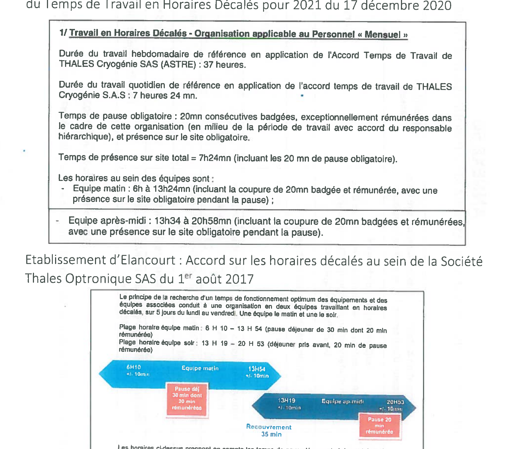

# Accord sur les horaires atypiques au sein de Thales LAS France SAS

---

ENTRE :

**LA SOCIETE Thales LAS France SAS**, Société par actions simplifiée au capital de 199 800 722 Euros dont le Siège social est situé au 2 avenue Gay Lussac – 78990 Elancourt, représentée par Philippe NETO, Directeur des Ressources Humaines de la Société Thales LAS France SAS, agissant par délégation du Président de la Société Thales LAS France SAS.

Ci-après désignée la « Société »

D'une part,

ET :

**LES ORGANISATIONS SYNDICALES REPRESENTATIVES** DESIGNEES CI-APRES :

- CFDT représentée par Madame Marie-Pierre ANDRE – Messieurs Thibault BONNEFIS – Patrick JOUAUD – Thierry PINSARD
- CFE-CGC représentée par Messieurs Stéphane DESCLOS – Stéphane HUSSON – Régis LEMERY – Yann VANET
- CFTC représentée par Madame Véronique MICHAUT – Messieurs Matthieu BENBASSA – Ludovic BONENFANT – Eric DIEUDONNE
- CGT représentée par Messieurs Cyril AZEAU – Eric DAGOIS – Alain DERVIEUX – Jean-Luc LECOINTE
- SUPPer représenté par Messieurs Léo BEAUCHAMP – Patrick CHANTEREAU – Aïssa DEGUIDA – Claude FALCO

Ci-après désignées les « Organisations Syndicales Représentatives »

D'autre part.

---

## Préambule

Le Groupe Thales a simplifié ses structures juridiques en France au 1er janvier 2018. Ainsi, les sociétés TR6, TOSA, TAO, Thales Angénieux, Thales Cryogénie et TDA sont désormais regroupées au sein d'une même structure juridique, la Société Thales LAS France.

Un accord Groupe relatif à l'organisation des négociations liées au projet de simplification des structures juridiques du Groupe Thales en France a été signé le 23 octobre 2017. Cet accord a prévu que les négociations relatives à certaines thématiques seraient traitées au niveau des Sociétés issues des fusions. Il en va notamment ainsi des accords relevant de l'organisation du travail atypique.

Chaque établissement a conservé les dispositions conventionnelles et les pratiques applicables dans sa Société d'origine.

Par le présent accord, les parties visent à harmoniser les dispositions conventionnelles, engagements unilatéraux et usages existants ayant trait aux modes d'organisation du travail atypiques au sein des anciennes sociétés citées ci-dessus et constituant désormais la société THALES LAS France SAS. Cela permet à l'ensemble des salariés faisant partie de ladite société de bénéficier de règles harmonisées dans le cadre des horaires atypiques.

C'est dans ce contexte que les parties au présent accord se sont réunies afin d'arrêter les règles destinées à s'appliquer au sein de la société THALES LAS France SAS.

Les contraintes de nos activités nécessitent, pour certaines affaires, d'organiser exceptionnellement et temporairement des aménagements spécifiques et d'adapter nos moyens afin de respecter les engagements contractuels envers nos clients.

Au contraire, pour d'autres activités, le travail en horaires atypiques est une nécessité pour les besoins de la production industrielle ou pour honorer les contrats conclus avec les clients et ne revêt pas un caractère exceptionnel pour les salariés concernés.

Les parties s'attachent à ce que les souplesses organisationnelles permises par le présent accord soient mises en œuvre dans le respect de l'équilibre vie personnelle et vie professionnelle et dans le respect des engagements de la Société relatifs à la qualité de vie au travail.

Ainsi, l'organisation du travail en horaires atypiques ne sera déployée que dans la stricte mesure du besoin et adaptée au contexte local.

Les parties conviennent de prendre en compte l'impact des horaires atypiques sur la santé des salariés. Le travail posté en 2x8 et 3x8, et le travail de nuit étant par ailleurs reconnus comme critères de pénibilité selon la réglementation ainsi que l'accord Groupe sur « l'évolution de la croissance et de l'emploi » en vigueur.

L'ensemble des parties rappellent que l'instauration d'horaires atypiques dans le cadre de l'application du présent accord ne peut se faire que dans le respect des règles légales et conventionnelles en vigueur et que la mise en place d'horaires atypiques respectera notamment les prérogatives des institutions représentatives du personnel.

Il est convenu entre les parties que les différentes indemnisations prises sur le fondement de la convention collective de la métallurgie se rattachent à la mise en œuvre de l'accord Groupe sur les dispositions sociales du 23 novembre 2006 ou des textes qui lui succèderont.

---

## Sommaire

- [Chapitre 1 : Le travail en horaires décalés](#chapitre-1--le-travail-en-horaires-décalés)
  - [Article 1 : Définitions](#article-1--définitions)
  - [Article 2 : Typologie des horaires décalés](#article-2--typologie-des-horaires-décalés)
  - [Article 3 : Principes de mise en œuvre des horaires décalés](#article-3--principes-de-mise-en-œuvre-des-horaires-décalés)
  - [Article 4 : Indemnisation et temps de travail](#article-4--indemnisation-et-temps-de-travail)
  - [Article 5 : Autres dispositions renvoyées aux établissements](#article-5--autres-dispositions-renvoyées-aux-établissements)
- [Chapitre 2 : Les astreintes](#chapitre-2--les-astreintes)
  - [Article 6 : Principes généraux et champ d'application](#article-6--principes-généraux-et-champ-dapplication)
  - [Article 7 : Typologie des astreintes](#article-7--typologie-des-astreintes)
  - [Article 8 : Principes de mise en œuvre de l'astreinte](#article-8--principes-de-mise-en-œuvre-de-lastreinte)
  - [Article 9 : Indemnisation et temps de travail](#article-9--indemnisation-et-temps-de-travail)
- [Chapitre 3 : Le travail les jours habituellement non travaillés](#chapitre-3--le-travail-les-jours-habituellement-non-travaillés)
  - [Article 10 : Principes généraux et champ d'application](#article-10--principes-généraux-et-champ-dapplication)
  - [Article 11 : Principes de mise en œuvre du travail les jours habituellement non travaillés](#article-11--principes-de-mise-en-œuvre-du-travail-les-jours-habituellement-non-travaillés)
  - [Article 12 : Indemnisation et temps de travail](#article-12--indemnisation-et-temps-de-travail)
- [Chapitre 4 : Champ d'application, durée et dépôt de l'accord](#chapitre-4--champ-dapplication-durée-et-dépôt-de-laccord)
  - [Article 13 : Champ d'application, durée et entrée en vigueur de l'accord](#article-13--champ-dapplication-durée-et-entrée-en-vigueur-de-laccord)
  - [Article 14 : Clause de revoyure](#article-14--clause-de-revoyure)
  - [Article 15 : Dépôt de l'accord](#article-15--dépôt-de-laccord)
- [Annexes](#annexe-1)

---

## Chapitre 1 : Le travail en horaires décalés

Sans pour autant définir en détail les modalités des horaires décalés pouvant être mis en place au sein des établissements de Thales LAS France SAS, les parties entendent leur donner un cadre commun au recours à ces horaires décalés. Les établissements bénéficieront néanmoins de la possibilité de prendre des mesures correspondant à leur besoin spécifique.

### Article 1 : Définitions

Les horaires de travail au sein des différents établissements sont définis sur la base d'horaires collectifs ou d'horaires variables.

Selon les besoins opérationnels des établissements, il peut être dérogé à ces horaires par la mise en place d'horaires décalés.

Les horaires décalés se placent :

- Soit dans le cadre des heures d'ouverture du site en dérogeant aux plages horaires variables en vigueur dans l'établissement, avec des horaires définis tôt le matin ou le soir.
- Soit en dehors des heures d'ouverture du site, pouvant inclure des organisations de travail de nuit.

Une organisation de travail en horaires décalés peut contenir la mise en œuvre de travail posté, tel que défini par la Directive européenne 2003/88/CE du 4 novembre 2003 : *« tout mode d'organisation du travail en équipe selon lequel des travailleurs sont occupés successivement sur les mêmes postes de travail, selon un certain rythme, y compris le rythme rotatif, et qui peut être de type continu ou discontinu, entraînant pour les travailleurs la nécessité d'accomplir un travail à des heures différentes sur une période donnée de jours ou de semaines. Le travail posté peut contenir une période de travail de nuit. »*

Sont considérées comme travail de nuit dans le présent accord les heures de travail effectuées de 21h à 6h conformément à l'accord national du 3 janvier 2002 sur le travail de nuit.

Au sein de chaque établissement, l'organisation du travail en équipe et les alternances éventuelles entre équipes doivent tenir compte des besoins d'adaptation et de la nécessité de limiter la pénibilité issue des changements de séquences d'horaires.

### Article 2 : Typologie des horaires décalés

L'organisation en horaires décalés est un régime dérogatoire au régime d'organisation du travail de droit commun.

Ils peuvent être :

#### Structurels

Les horaires décalés sont dits structurels lorsque leur mise en place est inhérente et indissociable de l'organisation du service, de la fonction, ou du poste de travail du salarié.

Les horaires décalés structurels peuvent comprendre des périodes de travail en horaires collectifs et en horaires décalés, alternées dans l'année en fonction des impératifs de production résultant des engagements contractuels.

Dans ce cadre, le recours à cette organisation s'inscrit dans la durée et doit être formalisé dans le contrat de travail du salarié concerné ou fera l'objet d'un avenant à son contrat de travail.

Ces activités et organisations sont identifiées par la direction de l'établissement et présentées chaque début d'année devant le Comité Social et Economique conformément à l'article 3.1 du présent accord.

A la date de conclusion du présent accord, les sites de Saint-Héand et de Blagnac mettent en œuvre depuis plusieurs années des situations d'horaires décalés structurels dans le cadre de leurs activités respectives.

Si l'activité d'autres établissements de la Société Thales LAS France le nécessite, les horaires décalés structurels seront mis en place dans le cadre du présent accord.

Dans cette optique, seule une modification durable de l'utilisation des moyens de production est susceptible de justifier d'un passage en horaires décalés structurels.

#### Conjoncturels

Les horaires décalés conjoncturels se caractérisent par une situation occasionnelle, souvent imprévisible générée notamment par des aléas techniques, des ruptures d'approvisionnement, des retards dans les délais client. Leur déploiement doit être nécessaire à la résolution de circonstances telles que les retards dans la définition des produits, les retards d'approvisionnement fournisseurs, l'existence de difficultés techniques sur les produits, les équipements, ou la nécessité d'honorer des contrats structurants, rendant impossible, ou particulièrement difficile, la tenue de nos engagements contractuels ou la satisfaction client sous le régime général du temps de travail.

Les horaires décalés conjoncturels ont donc une date de fin déterminée dès l'entrée dans cette organisation du travail.

Si le salarié est amené à travailler 105 jours cumulés, il lui sera proposé un délai de carence de 4 mois durant lequel celui-ci reviendra en horaire normal. Toutefois, il est également possible pour le salarié, à son initiative, et après avis médical, de choisir de continuer à travailler en horaires décalés sans délai de carence.

### Article 3 : Principes de mise en œuvre des horaires décalés

#### Article 3.1 : Modalités de présentation devant les Institutions Représentatives du Personnel

Il sera procédé annuellement, en janvier, ou au plus tard au cours du 1er trimestre de l'année, à une information des CSE d'établissement concernés, afin de présenter les projets ou les organisations de travail pour lesquels le recours aux horaires décalés est engagé ou envisagé pour l'année à venir et le nombre de salariés concernés par catégories.

Une information/consultation du CSE d'établissement sera préalable à la mise en place de nouveau projet d'horaires décalés, structurels ou conjoncturels.

Lors de la mise en place d'une organisation en horaires décalés, le contenu de l'information du CSE d'établissement devra préciser :

- Le projet concerné avec le rappel de la situation actuelle, des objectifs et des enjeux, en termes industriels ou commerciaux
- Le type d'horaires décalés prévu
- La période prévisionnelle de mise en œuvre d'horaires décalés
- Le nombre de postes et de salariés concernés et leurs catégories professionnelles
- Les conditions de travail et de sécurité associées

Compte tenu du caractère d'urgence auquel il faut parfois faire face pour mettre en place des horaires décalés, la Direction convoquera, le cas échéant, immédiatement le CSE d'établissement en réunion extraordinaire.

Aussi, à l'occasion des réunions ordinaires mensuelles du CSE, un tableau de suivi des horaires décalés réalisés le mois précédent sera présenté. Ce suivi portera sur le projet nécessitant des horaires décalés, les postes et le nombre de salariés concernés. Lors de ce suivi, dans les établissements connaissant des horaires décalés structurels, seront également évoqués les prévisions d'interruptions temporaires des horaires décalés.

Sur demande du CSE, la liste nominative des salariés concernés lui sera communiquée.

Dans le cas d'une organisation structurelle en horaires décalés, l'arrêt définitif de celle-ci fait l'objet d'une information préalable au CSE. Le passage d'une organisation du travail en horaires décalés structurels à une organisation du travail selon les horaires collectifs intervient un mois au plus tôt après cette information.

#### Article 3.2 : Entrée et sortie dans le régime des horaires décalés

##### Article 3.2.1 : L'entrée dans le dispositif des horaires décalés

**Entrée dans un dispositif d'horaires décalés structurels**

En cas d'identification d'un nouveau besoin structurel, l'affectation du salarié à un mode d'organisation de travail atypique devra respecter un délai de prévenance de 1 mois.

La mise en place des horaires décalés structurels est prévue dans le contrat de travail du salarié concerné ou fera l'objet d'un avenant à son contrat de travail.

En cas d'impossibilité individuelle du salarié concerné, une nouvelle affectation devra être proposée, le cas échéant avec l'accompagnement nécessaire et ce, prioritairement sur le site de rattachement du salarié.

A sa demande, le salarié pourra bénéficier préalablement d'une visite auprès du service de santé au travail.

Une incompatibilité médicale attestée par la médecine du travail ne pourra donner lieu à la mise en place des horaires décalés pour le salarié concerné.

**Entrée dans un dispositif d'horaires décalés conjoncturels**

Les parties s'engagent à ce que la mise en place du travail en horaires décalés se fasse sur la base du volontariat.

En l'absence d'un nombre suffisant de volontaires et dans la mesure du possible, il pourra être fait appel aux volontaires appartenant à d'autres services sous réserve que ces volontaires disposent des compétences et des informations nécessaires à la réussite d'une éventuelle intervention.

Le salarié volontaire se verra remettre un courrier préalablement à sa prise de poste précisant la durée de l'organisation en horaires décalés et ses nouveaux horaires.

Les salariés concernés seront informés au moins 5 jours ouvrés avant la mise en place des horaires décalés.

A sa demande, le salarié pourra bénéficier préalablement d'une visite auprès du service de santé au travail.

Une incompatibilité médicale attestée par la médecine du travail ne pourra donner lieu à la mise en place des horaires décalés pour le salarié concerné.

##### Article 3.2.2 : La sortie des horaires décalés

**Sortie des horaires décalés structurels**

Le salarié sera informé de la fin des horaires décalés structurels au moins 1 mois avant la fin de ceux-ci.

L'interruption temporaire des horaires décalés structurels fera l'objet d'une information des salariés en respectant un délai de 15 jours.

En cas d'impossibilité individuelle du salarié concerné de poursuivre les horaires décalés structurels, une nouvelle affectation devra être proposée, le cas échéant avec l'accompagnement nécessaire et ce, prioritairement sur le site de rattachement du salarié.

**Sortie des horaires décalés conjoncturels**

Les horaires décalés conjoncturels cessent à la date déterminée lors de leur entrée en vigueur.

Lorsque l'arrêt du travail en horaires décalés se fait avant la date prévue, les salariés concernés sont informés dans un délai de 5 jours ouvrés.

Pendant la période d'organisation en horaires décalés, il sera demandé au salarié souhaitant revenir à un horaire normal un délai de prévenance de 5 jours ouvrés afin de permettre à son responsable de réorganiser l'équipe.

Toutefois en cas d'urgence, ce délai de prévenance pourra être ramené à 48 heures.

Lorsque le salarié fait valoir la réversibilité, il retrouve un poste équivalent à celui qu'il occupait précédemment sur un horaire normal, prioritairement sur le site de rattachement du salarié.

### Article 4 : Indemnisation et temps de travail

Dans la mesure où la mise en place d'horaires décalés est dérogatoire aux horaires collectifs au sein des établissements, une indemnité est versée en contrepartie aux salariés travaillant dans ces conditions.

#### Article 4.1 : Indemnisation des horaires décalés structurels

##### 4.1.1 Règles communes aux salariés connaissant les horaires décalés structurels

La contrepartie financière tient compte des horaires de travail, des temps de pause et de l'organisation personnelle associés à la mise en œuvre des horaires décalés structurels et couvre les sujétions liées au transport domicile-lieu de travail. Elle prend la forme d'une prime forfaitaire mensuelle (non proratisable) de 90 MG.

Dans le cas où l'horaire décalé comprendrait des heures comprises dans la définition des horaires de nuit, le paiement des heures de nuit serait majoré de 15% en sus des indemnités précitées conformément à la Convention collective de la métallurgie.

De plus, lorsque le travail en horaires décalés comprend au moins 3h de travail dans les heures comprises dans la définition des horaires de nuit, le salarié percevra en sus 2,5MG par nuit travaillée.

Par ailleurs, conformément à l'accord national du 3 janvier 2002 sur le travail de nuit, les travailleurs de nuit bénéficient, à titre de contrepartie sous forme de repos compensateur, pour chaque semaine au cours de laquelle ils sont occupés au cours de la plage horaire comprise entre 21 heures et 6 heures, d'une réduction de leur horaire hebdomadaire de travail effectif d'une durée de 20 minutes par rapport à l'horaire collectif de référence des salariés occupés en semaine, selon l'horaire normal de jour.

Les salariés en horaires décalés de jour ou de nuit, bénéficieront d'une prime panier selon la convention collective de la métallurgie. Cette prime est exclusive de tout autre avantage ayant pour objet de compenser le coût du repas du salarié.

Dans le cas d'un retour à un horaire ordinaire, les contreparties associées à une organisation de travail en horaires décalés structurels devront faire l'objet d'un retrait dégressif par l'allocation d'une indemnité de sortie dégressive.

Le personnel concerné par ce dispositif est le personnel ayant une ancienneté déterminée par le présent accord en horaires décalés et dont la sortie du dispositif a lieu à l'initiative de l'employeur.

Pour le calcul de la période continue d'ancienneté en horaires décalés, les périodes de suspension du contrat de travail, quelle qu'en soit la cause, seront neutralisées dans le décompte.

L'indemnité dégressive est calculée sur la base de la moyenne des sommes versées au titre du travail en horaires décalés (hors prime de panier) au cours des 6 derniers mois précédent le passage à une organisation ordinaire.

- Pour une ancienneté de 6 mois en horaires décalés de nuit : 1 mois à 65% et 1 mois à 35 %
- Pour une ancienneté de 12 mois en horaires décalés : 1 mois à 65% et 1 mois à 35%
- Pour une ancienneté de 24 mois en horaires décalés : 2 mois à 65% et 2 mois à 35%
- Pour une ancienneté de 36 mois en horaires décalés : 3 mois à 65% et 3 mois à 35%

##### 4.1.2 Mesures de raccordement pour les salariés de l'établissement de Saint-Héand soumis aux horaires décalés structurels

Afin d'accompagner le ralliement de Saint-Héand aux dispositions du présent accord concernant les horaires décalés structurels, les parties conviennent de compenser l'arrêt du versement des indemnités kilométriques aux salariés ayant connu les horaires atypiques entre le 1er septembre 2020 et le 30 juin 2021 par le versement d'une indemnité nette calculée comme suit pour chaque salarié :

> (Montant de l'indemnisation antérieure pour un mois complet) - (Montant de l'indemnisation prévue par le présent accord pour un mois complet) x 18 x coefficient traduisant le travail effectif en horaire décalés entre le 1er septembre 2020 et le 30 juin 2021

Le coefficient est compris entre 0 (le salarié n'a pas travaillé en poste entre septembre et le 30 juin 2021) et 1 (le salarié a travaillé toute la période en poste).

Les indemnités inférieures à 1000€ seront intégralement versées avec la paie du mois d'octobre 2021.

Les indemnités supérieures à 1000€ seront versées pour moitié avec la paie du mois d'octobre 2021 et pour l'autre moitié, avec la paie du mois d'octobre 2022 sous réserve que le salarié exerce toujours son activité sous horaires décalés structurels.

#### Article 4.2 : Indemnisation des horaires décalés conjoncturels

La contrepartie financière tient compte des horaires de travail, des temps de pause et des durées de recours aux horaires décalés et prend la forme d'une prime forfaitaire journalière, versées aux salariés des équipes travaillant en horaires décalés, à raison de :

- Le premier jour du mois travaillé en horaires décalés : 26 MG
- Du 2ème au 12ème jour du mois travaillé en horaires décalés : 8 MG par jour
- Du 13ème au 23ème jour du mois travaillé en horaires décalés : 3 MG par jour

Les heures de travail effectuées la nuit donneront lieu à une majoration de 25% conformément à la Convention collective de la métallurgie.

A cela s'ajoute les indemnités suivantes :

- Indemnités kilométriques entre le domicile et le lieu de travail selon le barème en vigueur dans la limite de 80km aller/retour par jour
- Prime panier conformément à la Convention collective de la métallurgie

La société prendra en charge, au profit des salariés travaillant dans le cadre de ces horaires décalés, les frais supplémentaires de garde d'enfants ou personnes à charge, dans la limite d'un budget de 140 MG par an, sur présentation de justificatif dans la limite de 20 MG par jour travaillé.

#### Article 4.3 : Information des salariés

Les impératifs opérationnels et les grandes tendances de la charge nécessitant le recours au travail en horaires décalés seront communiqués aux équipes concernées en début d'année à l'issue de la réunion du CSE.

Conformément à l'article D.3171-7 du Code du travail, la liste des salariés concernés par les horaires décalés sera affichée dans les lieux de travail ou dans un registre tenu à la disposition de l'inspecteur du travail.

#### Article 4.4 : Mesures garantissant le respect des temps de repos des salariés

Les salariés travaillant en horaires décalés sont soumis aux durées légales et conventionnelles du travail. Ils doivent observer une durée de repos journalier de 11 heures et un repos hebdomadaire de 35 heures consécutives.

Ils ne peuvent travailler plus de :

- 10 heures par jour,
- 48 heures par semaine,
- 44h sur 12 semaines consécutives.

Dans le but de ne pas déroger à cette durée du travail, il sera prévu un aménagement de l'horaire de travail pour les salariés ayant des formations, entretiens ou tout autre rendez-vous à caractère professionnel et réunions des institutions représentatives du personnel qui se tiendraient en dehors de ces horaires décalés. Dans ce cadre, le salarié conservera l'indemnité perçue en raison des horaires décalés.

De même, le salarié en horaires décalés bénéficie au minimum d'une pause de 20 minutes consécutives rémunérée pour 6 heures de travail.

En tout état de cause, l'accord relatif à la durée et à l'aménagement du temps de travail en vigueur doit être respecté.

Pour ce faire, le chef de service doit s'assurer que l'organisation et la charge de travail permettent au personnel encadrant de respecter les durées maximales de travail et les durées minimales de repos mentionnées ci-dessus.

#### Article 4.5 : Suivi médical des salariés en horaires décalés

Les parties signataires conviennent de la nécessité de mettre en œuvre les mesures de prévention nécessaires en matière de santé et de sécurité pour les salariés concernés par le dispositif des horaires décalés.

**L'entrée dans le dispositif des horaires décalés**

La liste des personnes devant réaliser des horaires décalés sera transmise par la Direction à la médecine du travail.

A sa demande, le salarié pourra bénéficier préalablement d'une visite auprès du service de santé au travail.

Une incompatibilité médicale du salarié attestée par la médecine du travail ne pourra donner lieu à la mise en place des horaires décalés pour le salarié concerné.

**Le suivi des horaires décalés**

La communication de la liste des salariés concernés a pour objectif de prendre en compte les horaires décalés dans le dossier médical. Cette liste sera par ailleurs mise à jour en cas de besoin.

Cette liste permettra également aux services de santé au travail d'adapter les modalités du suivi individuel au regard de leur connaissance des salariés concernés.

Elle permettra également une traçabilité dans le cadre de l'exposition aux éventuels facteurs de pénibilité selon les dispositions légales ou conventionnelles en vigueur à la date d'une éventuelle recherche.

Les salariés travaillant régulièrement de nuit bénéficieront d'un suivi médical renforcé.

**La sortie du dispositif des horaires décalés**

Le médecin peut imposer, sur indication médicale, un retour au travail en horaire normal.

### Article 5 : Autres dispositions renvoyées aux établissements

Compte tenu de la diversité des activités et des horaires au sein de Thales LAS France, les parties conviennent de la nécessité de prévoir les horaires du travail en horaires décalés au plus proche des activités et des équipes concernées.

A ce titre, restent en vigueur pour la mise en œuvre du présent accord, y compris après la fin d'application de l'« accord de la Société Thales LAS France SAS sur l'organisation des négociations au sein de la Société Thales LAS France SAS liées au projet de simplification des structures juridiques du Groupe Thales » du 11 décembre 2020, les dispositions définies au sein des Sociétés fusionnées au sein de Thales LAS France concernant :

- La définition des horaires réalisés par les salariés concernés
- La définition des temps de pause,

Sous réserve de leur conformité aux conditions de mise en œuvre des horaires décalés définies par le présent accord.

Les éventuelles révisions de ces dispositions s'effectueront en concertation dans le cadre du dialogue social de l'établissement et porteront exclusivement sur ces points.

---

## Chapitre 2 : Les astreintes

### Article 6 : Principes généraux et champ d'application

#### Article 6.1 : Définition de l'astreinte

L'astreinte est définie à l'article L.3121-9 du Code du travail : *« Une période d'astreinte s'entend comme une période pendant laquelle le salarié, sans être sur son lieu de travail et sans être à la disposition permanente et immédiate de l'employeur, doit être en mesure d'intervenir pour accomplir un travail au service de l'entreprise.*

*La durée de cette intervention est considérée comme un temps de travail effectif. »*

#### Article 6.2 : Objet

L'astreinte a pour objet d'accéder, en cas de besoin, aux compétences nécessaires visant à assurer la continuité du bon fonctionnement opérationnel de certains systèmes, logiciels, matériels et installations, en donnant la possibilité dans le cas d'incidents, pannes ou difficultés, d'une intervention rapide d'un spécialiste ou d'un responsable préalablement désigné.

Ainsi la période d'astreinte implique la présence du salarié à son domicile ou dans tout autre lieu d'où il lui est possible d'être contacté par téléphone et d'intervenir sur site. La période d'astreinte pourra conduire à ce que le personnel concerné soit en capacité d'intervenir rapidement à distance, sur le lieu de travail habituel ou sur un site où le système ou les équipements concernés sont déployés. Cette intervention devra nécessairement être justifiée par un impératif d'action urgente sur le système ou les équipements concernés.

#### Article 6.3 : Champs d'application

Ce chapitre s'applique à l'ensemble des salariés des établissements de Thales LAS France SAS en France à l'exception des ingénieurs et cadres IIIC, des chefs d'établissement et des officiers de sécurité.

### Article 7 : Typologie des astreintes

#### Article 7.1 : Les différents types d'astreinte

Les parties signataires conviennent de distinguer deux types d'astreinte :

**L'astreinte dite structurelle**

Elle est inhérente à certaines activités ou fonctions.

Elle vise à garantir la disponibilité de personnel en capacité d'intervenir pour assurer en continu le fonctionnement d'installations, de matériels ou de systèmes dont l'arrêt serait préjudiciable à l'activité et/ou aux engagements contractuels vis-à-vis des clients.

Dans ce cadre, le recours à cette organisation s'inscrit dans la durée et doit être formalisé par un avenant au contrat de travail des salariés concernés.

**L'astreinte conjoncturelle**

Elle peut être destinée à répondre à un besoin urgent et imprévisible.

Elle vise également à garantir ponctuellement une assistance dans le cadre de projets.

#### Article 7.2 : Définition des modules d'astreinte

Par définition, et en cohérence avec l'article 6.1, une astreinte se situe en dehors des heures de travail :

- En soirée, de nuit et jusqu'aux premières heures du matin pendant les jours ouvrés
- Toute la journée ou la nuit pendant les jours non ouvrés

Ainsi, l'astreinte ne peut être positionnée pendant les périodes non travaillées telles que les arrêts de travail pour maladie ou les périodes de congé individuel : congés payés, RTT individuels, absence autorisée payée, repos compensateur, congés maternités.

Elles sont organisées selon un planning nominatif, obligatoirement transmis préalablement pour validation à la Direction des Ressources Humaines.

Ces astreintes doivent correspondre à un besoin impératif exprimé par la hiérarchie, notamment :

- Le respect d'un engagement contractuel
- La continuité de la production ou du service

Une astreinte est composée de la mise en œuvre d'un ou plusieurs modules expressément définis comme suit :

| Module | Description |
|--------|-------------|
| A | Une nuit en semaine (du lundi au vendredi) de 18h à 9h le lendemain |
| B | Le samedi en journée de 9h à 18h |
| C | Le samedi sur 24h, du samedi 9h au dimanche 9h |
| D | Le dimanche en journée de 9h à 18h |
| E | Le dimanche sur 24 h, du dimanche 9h au lundi 9h |
| F | Un jour férié en journée de 9h à 18h |
| G | Un jour férié sur 24 h, de 9h du jour concerné au lendemain 9h |
| H | Un jour de fermeture collective en journée de 9h à 18h |
| I | Un jour de fermeture collective 24 h, de 9h du jour concerné au lendemain 9h |
| J | 4 nuits en semaine du lundi 18h au vendredi 9h |
| K | Le week-end complet du vendredi 18h au lundi 9h |
| L | Les 4 nuits et le week-end complet du lundi 18h au lundi suivant 9h |
| M | La semaine complète de 7 jours du lundi 18h au lundi suivant 9h comprenant 5 jours de fermetures collectives en semaine |

### Article 8 : Principes de mise en œuvre de l'astreinte

#### Article 8.1 : Modalités de présentation devant les Institutions Représentatives du Personnel

Il sera procédé annuellement, en janvier, ou au plus tard au cours du 1er trimestre de l'année à une information des CSE d'établissement concernés, afin de présenter les projets ou les organisations du travail dans lesquels le recours aux astreintes est engagé ou envisagé pour l'année à venir.

Lorsqu'il sera envisagé de recourir à des astreintes, une information préalable à la mise en œuvre des astreintes sera effectuée auprès du CSE d'établissement.

Lors de la mise en place d'une astreinte, le contenu de l'information du CSE d'établissement devra préciser :

- Le projet concerné avec le rappel de la situation actuelle, des objectifs et des enjeux, en terme industriels, commerciaux, ou de gestion de site
- Le type d'astreinte prévue,
- La période prévisionnelle de mise en œuvre,
- Le nombre de personnes et les catégories professionnelles susceptibles d'être concernées

Dans la mesure où un CSE d'établissement ordinaire ou extraordinaire ne pourrait se tenir avant la mise en place d'une astreinte dans le cas de situations à caractère d'urgence non prévisible auquel il faut parfois faire face, les parties conviennent de la mise en place d'une procédure spécifique d'information : dans l'attente d'une présentation lors de la prochaine réunion ordinaire du CSE d'établissement, le bureau du CSE en recevra une information complète dès la formulation de la demande d'astreinte.

Afin d'en assurer le suivi, il sera procédé à une présentation mensuelle, au cours de la réunion ordinaire du CSE d'établissement, des astreintes réalisées dans le mois précédent ainsi que des astreintes à venir le mois suivant.

Sur demande du CSE, la liste nominative des salariés concernés lui sera communiquée.

#### Article 8.2 : Entrée et sortie dans le régime de l'astreinte

##### Article 8.2.1 : Entrée dans le régime des astreintes

**Entrée dans le dispositif d'astreintes structurelles**

L'entrée dans une organisation du travail en astreintes structurelles se fait sur la base du volontariat et est formalisée par la signature d'un avenant au contrat de travail du salarié concerné.

En cas d'impossibilité individuelle du salarié concerné, une nouvelle affectation devra être proposée, le cas échéant avec l'accompagnement nécessaire et ce, prioritairement sur le site de rattachement.

**Entrée dans le dispositif d'astreintes conjoncturelles**

Le responsable hiérarchique en charge de la demande d'astreinte devra au préalable définir les compétences requises et nécessaires à la réalisation des activités liées à cette astreinte ainsi que les profils requis.

Les parties s'engagent à ce que la mise en place de l'astreinte se fasse sur la base du volontariat.

En l'absence d'un nombre suffisant de volontaires et dans la mesure du possible, il pourra être fait appel aux volontaires appartenant à d'autres services ou directions sous réserve que ces volontaires disposent immédiatement des compétences et des informations nécessaires à la réussite d'une éventuelle intervention.

Par dérogation au principe du volontariat et dans le cas où il n'y aurait pas de volontaire, dans le service concerné ou d'autres services, le responsable hiérarchique pourra désigner en fonction des compétences nécessaires, le salarié qui sera d'astreinte.

Le choix devra nécessairement tenir compte :

- Des compétences recherchées dans le cadre de l'astreinte
- Du contexte personnel ou familial des salariés concernés

En cas de difficultés, le salarié pourra saisir et demander l'arbitrage de la Direction des Ressources Humaines.

Il sera veillé à ce que les actions de partage de compétences soient mises en place afin de limiter l'appel à des ressources uniques au sein de l'activité.

Le nombre d'arbitrages réalisés dans ce cadre sera présenté au CSE lors du suivi réalisé mensuellement.

##### Article 8.2.2 : Sortie du régime de l'astreinte

**Sortie du dispositif des astreintes structurelles**

Le salarié sera informé de la fin des astreintes structurelles au moins 1 mois avant la fin de celles-ci.

**Sortie du dispositif des astreintes conjoncturelles**

Les astreintes conjoncturelles cessent à la date déterminée lors de leur entrée en vigueur.

Pendant la période d'organisation en astreintes, il sera demandé au salarié souhaitant revenir aux conditions de travail antérieures à la mise en place des astreintes un délai de prévenance de 5 jours ouvrés afin de permettre à son responsable de réorganiser l'équipe.

Toutefois en cas d'urgence, ce délai de prévenance pourra être ramené à 48 heures.

Lorsque le salarié fait valoir la réversibilité, il retrouve son poste aux conditions antérieures à la mise en place des astreintes.

#### Article 8.3 : Programmation individuelle des astreintes et information des salariés

**Astreintes structurelles**

La programmation individuelle de ces astreintes est portée à la connaissance de chaque salarié au minimum un mois à l'avance sauf circonstances exceptionnelles (notamment remplacement pour cause de maladie du salarié en astreinte planifiée) auquel cas le salarié doit être prévenu au moins un jour franc à l'avance.

Dans la mesure du possible, l'organisation des astreintes s'attachera à prévoir les situations de remplacements.

Cette programmation doit couvrir une période minimum d'un mois.

**Astreintes conjoncturelles**

La programmation individuelle de ces périodes d'astreinte est porté à la connaissance de chaque salarié au minimum 15 jours calendaires à l'avance sauf circonstances exceptionnelles (notamment remplacement pour cause de maladie du salarié en astreinte planifiée) auquel cas le salarié doit être prévenu au moins un jour franc à l'avance.

Dans la mesure du possible, l'organisation des astreintes s'attachera à prévoir les situations de remplacements.

La planification sera réalisée en concertation avec les salariés concernés.

Ils seront informés par écrit de celle-ci.

#### Article 8.4 : Fréquence d'astreinte

Le nombre maximum de semaines d'astreinte sur une période de 12 mois consécutifs auquel le salarié peut être appelé, est limité à 20.

Le salarié ne pourra pas être d'astreinte plus de 2 semaines consécutives.

De même, un salarié ne pourra pas être d'astreinte plus de 2 week-ends consécutifs.

L'organisation de l'astreinte respectera les règles relatives au repos hebdomadaire.

Pour chaque salarié, un délai sans astreinte doit être respecté entre deux périodes d'astreinte, ce délai sera au moins égal à la dernière période d'astreinte mise en œuvre.

### Article 9 : Indemnisation et temps de travail

#### Article 9.1 : Astreinte et durée du travail

Le temps pendant lequel le salarié est tenu de rester disponible en vue d'une intervention au service de l'entreprise n'est pas pris en compte dans le temps de travail effectif.

Toutefois le salarié bénéficiera en contrepartie de cette obligation de disponibilité de compensations définies selon le barème figurant en annexe 1 et 2 (indemnités d'astreintes).

Les compensations sont communes à toutes les catégories de personnel, pour tous les établissements de Thales LAS France, dès le premier jour d'astreinte.

Le simple appel téléphonique (renseignement simple, relais) ou la consultation de la messagerie professionnelle ne nécessitant pas l'exécution d'une tâche pour le salarié ne déclenche pas le décompte du temps de travail et est inclus dans l'indemnisation de la période d'astreinte.

#### Article 9.2 : Intervention pendant l'astreinte

En cas d'intervention effective, le salarié ayant un accident entre le lieu où il se trouve et le lieu d'intervention, l'accident sera traité conformément à la réglementation en vigueur concernant les accidents de travail/de trajet.

##### Article 9.2.1 - Astreinte du personnel en décompte en heures

**En cas de dépannage ou d'intervention à distance**

Le temps d'intervention est comptabilisé dans le temps de travail de la semaine. Il constitue du temps de travail effectif et pris en compte au regard de l'application de l'ensemble de la réglementation légale ou conventionnelle du temps de travail. Les heures effectuées au-delà de la durée légale du travail, seront traitées selon le régime des heures supplémentaires de son établissement.

Le temps de travail effectif dans le cadre d'une intervention tiendra compte, le cas échéant, des majorations d'incommodités prévues par les conventions collectives de la Métallurgie et de l'accord Groupe sur les dispositions sociales applicables aux salariés des sociétés du groupe THALES.

**En cas d'intervention sur site nécessitant le déplacement du collaborateur**

Le temps d'intervention est comptabilisé dans le temps de travail de la semaine. Il constitue du temps de travail effectif et pris en compte au regard de l'application de l'ensemble de la réglementation légale ou conventionnelle du temps de travail. Les heures effectuées au-delà de la durée légale du travail, seront traitées selon le régime des heures supplémentaires de son établissement.

Le temps de travail effectif dans le cadre d'une intervention tiendra compte, le cas échéant, des majorations d'incommodités prévues par les conventions collectives de la Métallurgie et de l'accord Groupe sur les dispositions sociales applicables aux salariés des sociétés du groupe THALES.

Le temps de déplacement (aller-retour) pour le trajet entre le domicile ou le lieu où l'appel est reçu et le lieu d'intervention n'est pas du temps de travail effectif mais sera indemnisé comme tel sur la base du salaire brut hors prime d'ancienneté.

Les frais de déplacement (aller/retour) sont indemnisés pour le trajet entre le domicile ou le lieu où l'appel est reçu et le lieu d'intervention selon les taux et barèmes en vigueur au sein de la société THALES LAS France S.A.S.

##### Article 9.2.2 - Astreinte du personnel en décompte en jours

Pour le calcul de la durée d'intervention des salariés en forfait jours, les heures d'intervention sur une même journée seront cumulées. Une intervention s'effectuant la nuit sur deux journées est réputée s'être déroulée le jour où elle a pris fin.

**Le temps d'intervention pendant les astreintes de nuit du lundi au vendredi, les jours ouvrés**

Ce temps s'impute sur la journée de travail correspondante. En sus, une indemnité est versée de la manière suivante (Annexe 2) :

- En cas de dépannage ou d'intervention à distance, une indemnité forfaitaire est versée.
- En cas d'intervention sur site, une indemnité forfaitaire au titre de l'intervention est versée et les frais de déplacement (aller/retour) sont indemnisés pour le trajet entre le domicile ou le lieu où l'appel est reçu et le lieu d'intervention selon les taux et barèmes en vigueur au sein de la société THALES LAS France S.A.S.

**Le temps d'intervention pendant les jours non ouvrés**

Le temps d'intervention – temps de déplacement inclus – pendant l'astreinte sera traité comme suit :

- En cas d'intervention inférieure ou égale à 4 heures : paiement sur la base de 1/44ème du salaire mensuel de base ; ce temps ne rentre pas dans le forfait jour.
- En cas d'intervention supérieure à 4 heures : attribution d'une journée complète de récupération ;

De plus, et conformément à l'accord Groupe sur les dispositions sociales applicables aux salariés des sociétés du groupe THALES, le temps d'intervention déclaré un jour férié sera majoré de 50%.

Les frais de déplacement (aller/retour) sont indemnisés pour le trajet entre le domicile ou le lieu où l'appel est reçu et le lieu d'intervention selon les taux et barèmes en vigueur au sein de la société THALES LAS France S.A.S.

#### Article 9.3 : Temps de repos dans le cadre des périodes astreinte

De manière générale, les périodes d'astreinte sont mises en place pour faire face à des travaux urgents de prévention ou de réparation des incidents/accidents survenus aux matériels ou aux logiciels. Si une intervention sur site a lieu pendant la période d'astreinte, le salarié bénéficiera de la durée minimale de repos continue prévue par le code du travail et les conventions collectives de la Métallurgie à compter de la fin d'intervention sauf si le salarié en a déjà bénéficié entièrement avant le début de son intervention.

Le temps de repos minimal peut conduire le salarié à reprendre son activité en cours de journée et de ce fait, à ne pas respecter son horaire normal de travail. Le salarié concerné n'arrivera alors sur son lieu de travail qu'après le respect du repos quotidien et partira à l'heure normale de départ de l'entreprise :

- Pour un salarié en décompte en heures, la journée de travail incomplète sera alors rémunérée et valorisée suivant l'horaire de référence de la journée.
- Pour un salarié en forfait en jours, la journée s'imputera sur le forfait.

Si le salarié n'est pas amené à intervenir pendant sa période d'astreinte, celle-ci est décomptée dans le temps de repos quotidien et hebdomadaire légal.

Indépendamment des précisions ci-dessus et conformément à l'article L.3132-4 du Code du travail, lorsque l'intervention en cours d'astreinte répond aux besoins de travaux urgents dont l'exécution immédiate est nécessaire pour organiser des mesures de sécurité, pour prévenir des accidents imminents ou réparer des accidents graves aux installations ou aux bâtiments, le repos hebdomadaire peut être suspendu et il peut être dérogé au repos quotidien. Dans ces cas de figure, le repos en question doit être pris à compter de la fin de l'intervention.

Lorsque l'intervention est destinée à répondre à des activités listées dans l'article D.3131-4 du Code du travail, le temps minimal de repos quotidien des salariés amenés à intervenir en astreinte peut être réduit à 9 heures entre la fin d'intervention et le début de la prise de poste.

#### Article 9.4 : Moyens matériels

Pour toute la durée de l'astreinte, le salarié utilisera le téléphone professionnel fourni par l'entreprise dans le cadre de son poste ou des astreintes si nécessaire. Il pourra également être mis à disposition les moyens informatiques et mobiles nécessaires en accord avec le management.

A l'occasion de la prévision de l'astreinte et de l'information préalable du salarié, les modalités de déplacements éventuels sur site seront évoquées.

#### Article 9.5 : Garde d'enfants ou personnes à charge

La société prendra en charge au profit des salariés en astreintes si celles-ci sont déclenchées, les frais supplémentaires de garde d'enfants ou personnes à charge, dans la limite d'un budget de 140 MG par an, sur présentation de justificatif, dans la limite de 20 MG par astreinte déclenchée.

#### Article 9.6 : Suivi des astreintes

**Suivi individuel de l'astreinte**

Toute intervention donnera lieu à un compte rendu établi par le salarié qu'il remettra à son responsable hiérarchique pour validation. Ce document devra indiquer la date, les heures et les durées d'intervention. Il précisera les interventions effectuées sur site ou à distance et, le cas échéant, le mode de déplacement utilisé ainsi que les activités ayant entraîné une intervention en astreinte.

Il sera transmis mensuellement au plus tard le 10 de chaque mois, pour les astreintes du mois précédent, pour prise en compte sur la paie du mois courant après validation du management.

**Suivi médical de l'astreinte**

La liste des personnes devant réaliser des astreintes sera transmise par la Direction à la médecine du travail.

La communication de cette liste a pour objectif de prendre en compte les astreintes dans le dossier médical des salariés concernés afin de permettre aux services de santé au travail d'adapter éventuellement les modalités du suivi individuel au regard de leur connaissance des salariés concernés.

A sa demande, le salarié pourra bénéficier préalablement d'une visite auprès du service de santé au travail.

Une incompatibilité médicale du salarié attestée par la médecine du travail ne pourra donner lieu à la mise en place des astreintes pour le salarié concerné.

---

## Chapitre 3 : Le travail les jours habituellement non travaillés

### Article 10 : Principes généraux et champ d'application

Compte tenu de la criticité de certaines affaires, une organisation ponctuelle de travail un jour habituellement non travaillé : un samedi, un jour férié, un jour de RTT ou de congé collectif peut être indispensable pour tenir des délais et garantir la satisfaction des clients.

Les mesures du présent chapitre s'appliquent aux mensuels et aux ingénieurs et cadres jusqu'à la position III.B incluse.

### Article 11 : Principes de mise en œuvre du travail les jours habituellement non travaillés

#### Article 11.1 : Modalités de présentation devant les Institutions Représentatives du Personnel

Il sera procédé annuellement, en janvier, ou au plus tard au cours du 1er trimestre de l'année à une information des CSE d'établissement concernés, afin de présenter les projets ou les organisations du travail dans lesquels le recours au travail un jour habituellement non travaillé est engagé ou envisagé pour l'année à venir.

Une information/consultation du CSE d'établissement sera préalable à la mise en place de tout nouveau projet de travail un jour habituellement non travaillé.

Lors de la mise en place du travail un jour habituellement non travaillé, le contenu de l'information du CSE d'établissement devra préciser :

- La présentation du contexte, du projet concerné avec le rappel de la situation actuelle, des objectifs et des enjeux, en termes industriels ou commerciaux, ou de gestion de site
- La période prévisionnelle de mise en œuvre du travail un jour habituellement non travaillé et les jours habituellement non travaillés prévus
- La présentation des conditions de travail des personnels concernés
- Le nombre de personnes et les catégories professionnelles susceptibles d'être concernées
- Le cas échéant, la limitation à la seule récupération des heures travaillées en raison de la sous activité du domaine (article 12.1 du présent accord)

Dans la mesure où un CSE d'établissement ordinaire ou extraordinaire ne pourrait se tenir avant la mise en place du travail un jour habituellement non travaillé dans le cas de situations à caractère d'urgence non prévisible auquel il faut parfois faire face, les parties conviennent de la mise en place d'une procédure spécifique d'information : dans l'attente d'une présentation lors de la prochaine réunion ordinaire du CSE d'établissement, le bureau du CSE en recevra une information complète dès la formulation de la demande de travail un jour habituellement non travaillé.

Aussi, à l'occasion des réunions ordinaires mensuelles du CSE d'établissement, un suivi du travail les jours habituellement non travaillés réalisé le mois précédent sera présenté. Ce suivi portera sur le projet nécessitant le recours à ce type d'horaire atypique et le nombre de salariés concernés.

#### Article 11.2 : Entrée dans le dispositif du travail un jour habituellement non travaillé

Les parties s'engagent à ce que la mise en place du travail un jour habituellement non travaillé se fasse sur la base du volontariat.

A défaut et dans la mesure du possible, il pourra être fait appel aux volontaires appartenant à d'autres services ou directions sous réserve que ces volontaires disposent des compétences et des informations nécessaires à la réussite d'une éventuelle intervention.

Par dérogation au principe du volontariat et dans le cas où il n'y aurait pas de volontaire ou un nombre de volontaires ne permettant pas l'atteinte de l'objectif du travail le jour habituellement non travaillé, le responsable hiérarchique pourra désigner le ou les salarié(s) qui seront amenés à travailler un jour habituellement non travaillé.

Le choix du ou des salarié(s) devra nécessairement tenir compte :

- Des compétences recherchées dans le cadre du travail un jour habituellement non travaillé
- Du contexte personnel et familial des salariés concernés
- De la récurrence des désignations précédentes

Le salarié ainsi désigné ne pourra travailler plus de 2 samedis par mois dans la limite de 12 samedis par an.

En cas de difficultés, le salarié pourra demander l'arbitrage de la Direction Ressources Humaines.

Il sera veillé à ce que les actions de partage de compétences soient mises en place afin de limiter l'appel à des ressources uniques au sein de l'activité.

Le nombre d'arbitrages réalisés dans ce cadre sera présenté au CSE lors du suivi réalisé mensuellement.

#### Article 11.3 : Programmation individuelle et information des salariés

La programmation individuelle du travail un jour habituellement non travaillé est portée à la connaissance de chaque salarié au plus tôt et au minimum 7 jours calendaires à l'avance, hors situation d'urgence caractérisée.

Les obligations liées au temps de repos s'appliquent intégralement pour le travail les jours habituellement non travaillés.

### Article 12 : Indemnisation et temps de travail

Les salariés travaillant un jour habituellement non travaillé percevront une prime forfaitaire de 17 MG.

En cas de cumul de situation, le régime le plus favorable au salarié concerné sera retenu et appliqué.

En sus, le temps de travail sera rémunéré dans les conditions suivantes définies dans les articles suivants:

#### Article 12.1 : Salariés en décompte en heures

Les heures effectuées un jour habituellement non travaillé, seront traitées selon le régime des heures complémentaires/ supplémentaires de l'établissement. Le choix sera laissé au salarié entre le paiement et la récupération de ces heures. Cependant, la récupération s'imposera au salarié dans l'hypothèse où le plan de charge du domaine fait apparaître une sous activité dans sa famille professionnelle générique.

Le temps de travail un jour férié tiendra compte de la majoration de 50% prévue par la convention collective de la Métallurgie des mensuels. Cette majoration s'appliquera également aux salariés cadres dont le forfait se décompte en heures.

Les frais de déplacement (aller/retour) sont indemnisés pour le trajet entre le domicile et le lieu de travail selon les taux et barèmes en vigueur au sein de la société THALES LAS France S.A.S.

En cas d'absence d'une solution organisée par l'entreprise pour la prise de repas, une prime panier sera due pour une présence englobant la plage horaire 12h-14h suivant la Convention collective de la métallurgie.

#### Article 12.2 : Salariés en décompte en jours

Le travail un jour habituellement non travaillé est considéré comme une journée de travail qui s'imputera sur le forfait annuel.

A ce titre, une journée de repos sera octroyée au salarié quel que soit le nombre d'heures effectuées pour ne pas porter le nombre de jours travaillés au-delà du forfait en jours.

De plus, et conformément à l'accord Groupe sur les dispositions sociales applicables aux salariés des sociétés du groupe THALES, lorsque cette journée de travail est déclarée un jour férié, elle sera majorée de 50% et récupérée ainsi au titre du paragraphe précédent.

Les frais de déplacement (aller/retour) sont indemnisés pour le trajet entre le domicile et le lieu de travail selon les taux et barèmes en vigueur au sein de la société THALES LAS France S.A.S.

En cas d'absence d'une solution organisée par l'entreprise pour la prise de repas, une prime panier sera due pour une présence englobant la plage horaire 12h-14h suivant la Convention collective de la métallurgie.

#### Article 12.3 : Garde d'enfants ou personnes à charge

La société prendra en charge au profit des salariés travaillant un jour habituellement non travaillé, les frais supplémentaires de garde d'enfants ou personnes à charge, dans la limite d'un budget de 140 MG par an, sur présentation de justificatif, dans la limite de 20 MG par jour de travail habituellement non travaillé.

#### Article 12.4 : Suivi médical des salariés concernés par le travail les jours habituellement non travaillés

La liste des personnes travaillant un jour habituellement non travaillé sera transmise par la Direction à la médecine du travail.

La communication de cette liste a pour objectif de prendre en compte le travail un jour habituellement non travaillé dans le dossier médical des salariés concernés afin de permettre aux services de santé au travail d'adapter éventuellement les modalités du suivi individuel au regard de leur connaissance des salariés concernés.

---

## Chapitre 4 : Champ d'application, durée et dépôt de l'accord

### Article 13 : Champ d'application, durée et entrée en vigueur de l'accord

Il est convenu que le présent accord est conclu pour une durée indéterminée.

Le présent accord entrera en vigueur le 1er octobre 2021.

**Champ d'application de l'accord**

Le présent accord a vocation à s'appliquer immédiatement dans l'ensemble des établissements de Thales LAS France SAS.

Il se substitue dès la date de son entrée en vigueur, à l'ensemble des accords collectifs, dispositions collectives, usages et engagements unilatéraux en vigueur au sein des établissements de Thales LAS France SAS relatifs au même objet.

**Mise en place d'organisation du travail non prévues dans cet accord**

Les modes d'organisation du travail non visés par le présent accord et notamment les modalités de répartition dans la semaine feront l'objet d'une négociation spécifique dans l'établissement concerné lors de l'apparition du besoin.

### Article 14 : Clause de revoyure

Les parties signataires conviennent de se revoir durant la 3ème année d'application de l'accord pour réaliser un point d'étape quant à son application ainsi que sur les éventuels ajustements à y apporter.

L'initiative de ce rendez-vous sera à la charge de la Direction.

### Article 15 : Dépôt de l'accord

Conformément aux dispositions législatives et réglementaires en vigueur, le présent accord sera notifié à l'ensemble des Organisations syndicales représentatives au niveau de la Société et déposé par la Direction des Ressources Humaines de la Société sous forme électronique, en un exemplaire PDF signé et un exemplaire sous format Word anonymisé, sur la plateforme de téléprocédure du Ministère du travail.

Un exemplaire sera également remis au secrétariat du Greffe du Conseil des Prud'hommes de Rambouillet.

Un exemplaire original sera remis à chaque partie signataire.

Fait à Elancourt en 7 exemplaires originaux, le 8 septembre 2021.

**Pour la Direction de la Société Thales LAS France SAS**, Philippe NETO Directeur des Ressources Humaines, agissant par délégation du Président de la Société Thales LAS France SAS.

**Pour les Organisations Syndicales Représentatives :**

- CFDT représentée par Madame Marie-Pierre ANDRE – Messieurs Thibault BONNEFIS – Patrick JOUAUD – Thierry PINSARD : NON SIGNE
- CFE-CGC représentée par Messieurs Stéphane DESCLOS – Stéphane HUSSON – Régis LEMERY – Yann VANET :  Régis LEMERY 
- CFTC représentée par Madame Véronique MICHAUT – Messieurs Matthieu BENBASSA – Ludovic BONENFANT – Eric DIEUDONNE : Ludovic BONENFANT 
- CGT représentée par Messieurs Cyril AZEAU – Eric DAGOIS – Alain DERVIEUX – Jean-Luc LECOINTE : Cyril AZEAU
- SUPPer représenté par Messieurs Léo BEAUCHAMP – Patrick CHANTEREAU – Aïssa DEGUIDA – Claude FALCO : NON SIGNE

---

## Annexe 1

### Tableau des indemnités journalières pour le temps d'astreinte

| Séquence d'astreinte | Indemnité journalière exprimée en Minimum Garanti (MG) |
|---|---|
| Astreinte de nuit de 18h à 9h le lendemain | 10 MG |
| Astreinte un samedi ou un JRTT collectif en journée de 9h à 18h | 15 MG |
| Samedi ou JRTT collectif de 9h jusqu'au lendemain 9h | 25 MG |
| Astreinte un dimanche ou un jour férié journée de 9h à 18h | 20 MG |
| Dimanche ou jour férié de 9h au lendemain 9h | 30 MG |

### Tableau des autres indemnités liées aux astreintes

| Séquence d'astreinte | Indemnité exprimée en Minimum Garanti |
|---|---|
| Astreinte de nuit la semaine 4 fois du lundi 18h au vendredi 9h | 60 MG |
| Astreinte le week-end complet du vendredi 18h au lundi 9h | 72 MG |
| Astreinte de nuit la semaine et le week-end complet du lundi 18h au lundi suivant 9h | 146 MG |
| Astreinte la semaine complète de fermeture collective du lundi 9h au lundi suivant 9h | 197 MG |
| Indemnités exceptionnelles supplémentaires : du 24 décembre 18h au 25 décembre 9h / le 25 décembre de 9h à 18h / du 31 décembre 18h au 1er janvier 9h / le 1er janvier 9h à 18h | + 14 MG |

*A titre d'information, la valeur du minimum garanti en 2021 est de 3,65 €.*

---

## Annexe 2

### Tableau des indemnités journalières pour l'intervention des forfaits jours dans le cadre des astreintes

| Intervention d'un salarié forfait jour dans le cadre d'une astreinte après une journée de travail | Indemnité journalière exprimée en Minimum Garanti (MG) |
|---|---|
| Cas de dépannage ou intervention à distance | 10 MG |
| Cas d'intervention sur site | 20 MG |

*A titre d'information, la valeur du minimum garanti en 2021 est de 3,65 €.*

---

## Annexe 3

### Avenant au contrat de travail pour les horaires décalés structurels

Entre,
La société **Thales LAS France SAS** située, 2 avenue Gay Lussac – 78990 Elancourt représentée par **XXXXXX – Directrice/Directeur des Ressources Humaines de XXXXXX**, d'une part,

Et,
Monsieur/Madame **XXXX**, demeurant **XXXXXXXXXXX**, désigné ci-après « le Titulaire » d'autre part,

Le présent avenant est conclu dans le cadre de l'accord sur les horaires atypiques de la Société Thales LAS France SAS en date du XXXXXXX.

Il a été convenu et arrêté ce qui suit :

Monsieur/Madame XXXXXX a été embauché(e) par la Société XXXXXX en contrat à durée indéterminée le XXXXXX au poste de XXXXXXXXX.

Dans le cadre du projet XXX, le poste de travail de Monsieur/Madame XXXXXX s'effectuera en horaires décalés à compter du XXXX.

La programmation des horaires décalés vous sera communiquée via un planning au minimum un mois à l'avance.

Les horaires décalés réalisés dans ce cadre seront traités conformément aux règles définies dans l'accord mentionné ci-dessus.

Au cours de l'organisation du travail en horaires décalés, vous avez la possibilité de demander le retour à l'horaire de travail collectif sous réserve d'un délai de prévenance d'un mois. Vous retrouverez alors votre poste en horaire normal si cela est possible ou une nouvelle affectation vous sera proposée prioritairement sur votre site de rattachement.

Les horaires décalés peuvent être interrompus temporairement pour les besoins du service. Vous en serez informé par écrit. Pendant la période d'interruption, vous serez repositionné sur l'horaire de travail collectif.

Le présent avenant est conclu pour une durée indéterminée. En cas de mobilité sur un poste n'incluant pas d'horaires décalés structurels, le présent avenant cessera de plein droit, vous reviendrez alors à l'horaire de travail collectif de votre établissement.

Les dispositions du contrat à durée indéterminée initial non visées par le présent avenant demeurent inchangées.

Fait en deux exemplaires, dont un pour chacune des parties, à XXXX, le XX/XX/XXXX.

| Madame/Monsieur XXXXXXXXX¹ | Pour Thales LAS France SAS |
|---|---|
| Salarié | Madame/Monsieur |
| | DRH domaine |

Copie : Paie

¹ La signature devra être précédée de la mention « lu et approuvé, bon pour accord) »

---

## Annexe 4

### Avenant au contrat de travail pour les astreintes structurelles

Entre,
La société **Thales LAS France SAS** située, 2 avenue Gay Lussac – 78990 Elancourt représentée par **XXXXXX – Directrice/Directeur des Ressources Humaines de XXXXXX**, d'une part,

Et,
Monsieur/Madame **XXXX**, demeurant **XXXXXXXXXXX**, désigné ci-après « le Titulaire » d'autre part,

Le présent avenant est conclu dans le cadre de l'accord sur les horaires atypiques de la Société Thales LAS France SAS en date du XXXXXXX.

Il a été convenu ce qui suit :

Compte tenu de la nature des fonctions de Madame/Monsieur XXXXXXXXX au sein de XXXXX (service), Madame/Monsieur XXXXX sera amené(e) à effectuer des astreintes régulièrement tout au long de l'année, et ce à compter du XX/XX/XXXX.

La programmation de ces périodes d'astreintes seront communiquées via un planning nominatif au minimum un mois à l'avance sauf circonstances exceptionnelles.

Les astreintes réalisées dans ce cadre (période d'astreinte et périodes d'intervention éventuelles, à distance ou sur site) seront traitées conformément aux règles définies dans l'accord mentionné ci-dessus.

Le présent avenant est conclu pour une durée indéterminée.

Les autres dispositions du contrat de travail de Madame/Monsieur XXXXX non modifiées par le présent avenant demeurent inchangées.

Fait en deux exemplaires, dont un pour chacune des parties, à XXXX, le XX/XX/XXXX.

| Madame/Monsieur XXXXXXXXX² | Pour Thales LAS France SAS |
|---|---|
| Salarié | Madame/Monsieur |
| | DRH domaine |

² La signature devra être précédée de la mention « lu et approuvé, bon pour accord) »

---

## Annexe 5a

### Synthèse des indemnisations des horaires atypiques – Salarié en décompte en heures

|   | Horaires décalés structurels | Horaires décalés conjoncturels | Travail un samedi | Travail un jour férié | Travail un RTT collectif |
|---|---|---|---|---|---|
| **Traitement en paie** |   |   |   |   |   |
| **Prime forfaitaire journalière** |   | 1er jour du mois : 26 MG / Du 2ème au 12ème jour du mois : 8 MG / Du 13ème au 23ème jour du mois : 3 MG | Selon le régime des heures supplémentaires ou complémentaires de l'établissement | 17 MG | Selon le régime des heures supplémentaires ou complémentaires de l'établissement |
| **Prime de panier** | 7,30€ au 1er janvier 2020 | 7,30€ au 1er janvier 2020 |   |   |   |
| **Prime forfaitaire mensuelle** | 90 MG |   |   |   |   |
| **Majoration des heures travaillées** | Heures de nuit : 15% + 2,5 MG par nuit travaillée (si > 3h) | Heures de nuit : 25% | 50% | JF : 50% / Dimanche : 100% / Nuit : 25% |   |
| **Trajet** | Indemnités kilométriques dans la limite de 80km A/R | Indemnités kilométriques dans la limite de 80km A/R | Indemnités kilométriques | Indemnités kilométriques |   |
| **Garde d'enfant** | Dans la limite de 140MG par an et 20MG par jour travaillé | Dans la limite de 140MG par an et 20MG par jour travaillé | Dans la limite de 140MG par an et 20MG par jour travaillé | Dans la limite de 140MG par an et 20MG par jour travaillé | Dans la limite de 140MG par an et 20MG par jour travaillé |

*1 MG = 3,65€ pour l'année 2021*

*En cas d'interprétation possible entre les dispositions figurant dans cette annexe et le texte de l'accord, le texte de l'accord fera office de loi entre les parties.*

---

## Annexe 5b

### Synthèse des indemnisations des horaires atypiques – Salarié en décompte en jours

|   | Intervention distance dans le cadre d'astreintes | Intervention sur site dans le cadre d'astreintes | Travail un samedi | Travail un jour férié | Travail un RTT collectif |
|---|---|---|---|---|---|
| **Traitement en paie** | Pendant un jour non travaillé : - 4h d'intervention : 1/44 du salaire mensuel de base / + 4h d'intervention : attribution d'une journée complète de récupération | Pendant un jour non travaillé : - 4h d'intervention : 1/44 du salaire mensuel de base / + 4h d'intervention : attribution d'une journée complète de récupération |   | Imputation sur le forfait |   |
| **Prime forfaitaire journalière** | MG en fonction du jour d'astreinte | MG en fonction du jour d'astreinte | 17 MG | 17 MG |   |
| **Prime de panier** |   |   | 7,30€ au 1er janvier 2020 | 7,30€ au 1er janvier 2020 |   |
| **Prime forfaitaire** |   | Intervention après une journée travaillée : 10 MG / JF : majoration du repos de 50% | Intervention après une journée travaillée : 20 MG / JF : majoration du repos de 50% | Majoration du repos de 50% |   |
| **Majoration des heures travaillées** |   |   |   | 50% |   |
| **Trajet** |   | Indemnités kilométriques | Indemnités kilométriques | Indemnités kilométriques |   |
| **Garde d'enfant** | Dans la limite de 140MG par an et 20MG par astreinte déclenchée | Dans la limite de 140MG par an et 20MG par astreinte déclenchée | Dans la limite de 140MG par an et 20MG par jour travaillé | Dans la limite de 140MG par an et 20MG par jour travaillé |   |

*1 MG = 3,65€ pour l'année 2021*

*En cas d'interprétation possible entre les dispositions figurant dans cette annexe et le texte de l'accord, le texte de l'accord fera office de loi entre les parties.*

---

## Annexe 6

### Dispositions concernant la définition des horaires réalisés en horaires décalés et des temps de pause au sein des sociétés fusionnées au sein de Thales LAS France

*Pour application de l'article 5, 2ème paragraphe*

---

#### Établissement de Blagnac

Note d'information au personnel sur l'organisation du Temps de Travail en Horaires Décalés pour 2021 du 17 décembre 2020.

**1/ Travail en Horaires Décalés - Organisation applicable au Personnel « Mensuel »**

- Durée du travail hebdomadaire de référence en application de l'Accord Temps de Travail de THALES Cryogénie SAS (ASTRE) : 37 heures.
- Durée du travail quotidien de référence en application de l'accord temps de travail de THALES Cryogénie S.A.S : 7 heures 24 mn.
- Temps de pause obligatoire : 20mn consécutives badgées, exceptionnellement rémunérées dans le cadre de cette organisation (en milieu de la période de travail avec accord du responsable hiérarchique), et présence sur le site obligatoire.
- Temps de présence sur site total = 7h24mn (incluant les 20 mn de pause obligatoire).

Les horaires au sein des équipes sont :

- Equipe matin : 6h à 13h24mn (incluant la coupure de 20mn badgée et rémunérée, avec une présence sur le site obligatoire pendant la pause) ;
- Equipe après-midi : 13h34 à 20h58mn (incluant la coupure de 20mn badgées et rémunérées, avec une présence sur le site obligatoire pendant la pause).

---

#### Établissement d'Elancourt

Accord sur les horaires décalés au sein de la Société Thales Optronique SAS du 1er août 2017.

---

#### Établissement de Fleury Les Aubrais

Accord d'établissement portant sur les modalités d'application des horaires spécifiques, révision du 4 décembre 2007.

**Dispositions applicables aux salariés concernés :**

- Pause journalière de 35 minutes payée accordée pendant le temps de travail.

---

#### Établissement de La Ferté Saint Aubin

Accord relatif aux modalités d'application des horaires variables du 18 juillet 2000.

**6.5 Horaires des équipes**

Pour les personnels concernés, les horaires sont les suivants :

- Première équipe : 05 h 00 – 12 h 12
- Deuxième équipe : 12 h 07 – 19 h 19

Ces horaires prennent en compte la demi-heure de pause payée.

---

#### Établissement de Limours

Accord d'établissement portant sur les modalités d'application des horaires spécifiques du 25 mars 2004.

Horaires de travail des deux équipes :

- 1ère équipe de 6h30 à 14h00
- 2ème équipe de 12h00 à 19h30

**Dispositions applicables aux salariés concernés :**

- Pause journalière de 45 minutes payée accordée pendant le temps de travail.

---

#### Établissement de Saint-Héand

Accord sur les horaires d'entreprise de la Société Thales Angénieux du 31 janvier 2014.

**IV.1 Travail posté alterné**

Les parties conviennent que les personnels concernés par le travail posté effectuent un horaire hebdomadaire moyen à temps plein de 37 heures 30 minutes, temps de pause inclus. Soit, une base journalière moyenne de 7 heures 30 minutes, dont 7 heures 10 minutes de temps de travail effectif et 20 minutes de temps de pause qui sera pris au plus tard au bout de 6 heures de travail afin de ne pas travailler plus de 6 heures consécutives. Cette pause de 20 minutes doit obligatoirement faire l'objet d'un pointage en début et fin de pause.

Ces personnels doivent respecter les plages horaires de travail suivantes :

**Poste du Matin**

- Lundi : 6h15 ⇔ 13h09
- Mardi au vendredi : 5h30 ⇔ 13h09

**Poste du Soir**

- Lundi au jeudi : 12h59 ⇔ 20h38
- Vendredi : 12h59 ⇔ 19h53

**IV.2 Travail de nuit**

Le poste de nuit s'effectue sur 4 jours du lundi au jeudi et sur la base du volontariat pour les salariés présents de Thales Angénieux.

- Lundi au jeudi : 20h28 ⇔ 05h40

---

#### Établissement de Ymare

Accord d'établissement portant sur les modalités d'application des horaires spécifiques du 19 octobre 2007.

Horaires de travail des deux équipes :

- 1ère équipe de 6h00 à 13h15
- 2ème équipe de 12h45 à 20h00

- Une pause journalière de 35 minutes payée sera accordée pendant le temps de travail intervenant au plus tard avant la sixième heure.
